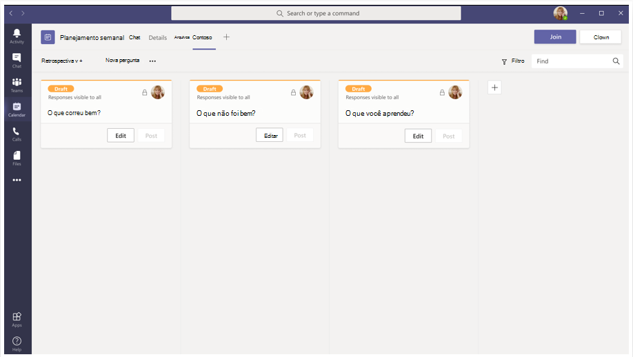
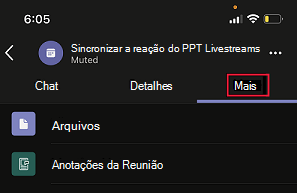
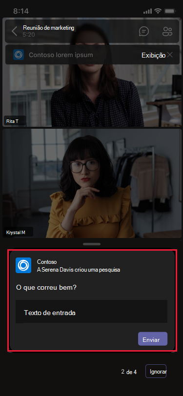
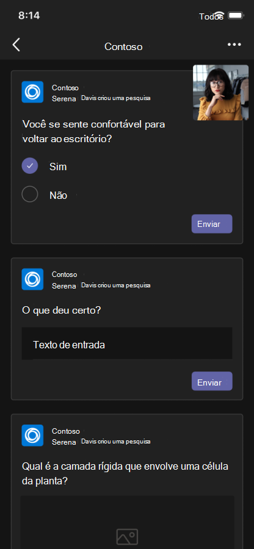
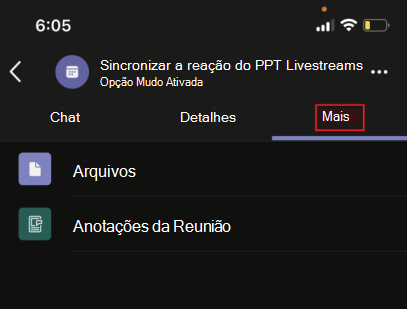

# Aplicativos de reuniões unificadas

Teams aplicativos de reuniões unificadas são baseados nos seguintes conceitos:

* O ciclo de vida da reunião tem diferentes estágios: pré-reunião, reunião e pós-reunião.  
* Há três funções de participantes distintas em uma reunião: organizador, apresentador e participante. Para obter mais informações, [consulte funções em uma Teams reunião](https://support.microsoft.com/office/roles-in-a-teams-meeting-c16fa7d0-1666-4dde-8686-0a0bfe16e019).  
* Há vários tipos [de usuário](/microsoftteams/non-standard-users#:~:text=An%20anonymous%20user%20is%20a,their%20Microsoft%20or%20organization's%20account.) em uma reunião: no locatário, [convidado,](/microsoftteams/guest-access) [federado](/microsoftteams/manage-external-access)e usuários anônimos.

> [!VIDEO https://www.youtube-nocookie.com/embed/rrNpFJbxqrg]

Este artigo aborda as informações sobre o ciclo de vida da reunião e como integrar guias, bots e extensões de mensagens. Ele identifica diferentes funções de participante e tipos de usuário.

## Ciclo de vida da reunião

Um ciclo de vida de reunião consiste na experiência do aplicativo de pré-reunião, em reunião e pós-reunião. Você pode integrar guias, bots e extensões de mensagens em cada estágio do ciclo de vida da reunião.

### Integrar guias ao ciclo de vida da reunião

As guias permitem que os membros da equipe acessem serviços e conteúdo em um espaço específico dentro de uma reunião. A equipe trabalha diretamente com guias e tem conversas sobre as ferramentas e dados disponíveis nas guias. Na Teams, você pode adicionar uma guia selecionando e selecione o aplicativo que você deseja instalar.

> [!IMPORTANT]
> Se você tiver integrado uma guia à sua reunião Teams, seu aplicativo deverá seguir o fluxo de autenticação de logom único [(SSO)](../tabs/how-to/authentication/auth-aad-sso.md)para guias .

> [!NOTE]
> * As reuniões agendadas privadas só suportam aplicativos.
> * A opção Adicionar aplicativo para Teams aplicativo de guia de extensão de reunião não é suportada Teams cliente Web.

#### Experiência do aplicativo de pré-reunião

Com a experiência do aplicativo de pré-reunião, você pode encontrar e adicionar aplicativos de reunião. Você também pode realizar tarefas de pré-reunião, como desenvolver uma sondagem para sondar os participantes da reunião.

**Para adicionar guias a uma reunião existente**

1. Em seu calendário, selecione uma reunião à qual deseja adicionar uma guia.
1. Selecione a **guia Detalhes** e selecione . A galeria de guias é exibida.

    

1. Na galeria de guias, selecione o aplicativo que você deseja adicionar e siga as etapas conforme necessário. O aplicativo é instalado como uma guia.

   > [!NOTE]
   > * Você também pode adicionar uma guia a uma reunião existente usando a guia **Chat de** reunião.
   > * O layout da guia deve estar em um estado organizado, se houver mais de 10 pesquisas ou pesquisas.

# [Desktop](#tab/desktop)

# [Dispositivo móvel](#tab/mobile)

Depois de adicionar as guias a uma reunião existente no celular, você pode ver os mesmos aplicativos na experiência de pré-reunião em **Mais** seção dos detalhes da reunião.

  

---

#### Experiência do aplicativo na reunião

Com a experiência do aplicativo na reunião, você pode envolver os participantes durante a reunião usando aplicativos e a caixa de diálogo na reunião. Os aplicativos de reunião são hospedados na barra de ferramentas da janela de reunião como uma guia na reunião. Use a caixa de diálogo na reunião para mostrar conteúdo a actionable para os participantes da reunião. Para obter mais informações, [consulte create apps for Teams meetings](create-apps-for-teams-meetings.md).

Para dispositivos móveis, os  aplicativos de reunião estão disponíveis > aplicativos &#x25CF;&#x25CF;&#x25CF; na reunião. Selecione **Aplicativos** para exibir todos os aplicativos disponíveis na reunião.

**Para usar guias durante uma reunião**

1. Vá para Teams.
1. Em seu calendário, selecione uma reunião na qual você deseja usar uma guia.
1. Depois de inserir a reunião, na barra de ferramentas da janela de chat, selecione o aplicativo necessário.
    Um aplicativo fica visível em uma reunião Teams no painel lateral ou na caixa de diálogo na reunião.
1. Na caixa de diálogo na reunião, insira sua resposta como comentários.

# [Desktop](#tab/desktop)

# [Dispositivo móvel](#tab/mobile)

Depois de inserir a reunião e adicionar o aplicativo da área de trabalho ou da Web, o aplicativo fica visível na reunião de Teams móvel na **seção Aplicativos.** Selecione **Aplicativos** para mostrar a lista de aplicativos. O usuário pode iniciar qualquer um dos aplicativos como um painel do lado da reunião do aplicativo.

A caixa de diálogo na reunião é exibida onde você pode inserir sua resposta como feedback.

> [!NOTE]
> Você não precisa alterar o manifesto do aplicativo para que os aplicativos funcionem em dispositivos móveis.

---

> [!NOTE]
> * Os aplicativos podem aproveitar Teams SDK do cliente para acessar `meetingId` o , `userMri` e `frameContext` renderizar a experiência adequadamente.
> * Se a caixa de diálogo na reunião for renderizada com êxito, ela enviará uma notificação de que os resultados foram baixados com êxito.
> * O manifesto do aplicativo especifica os locais nos quais você deseja que os aplicativos apareçam. Isso pode ser feito especificando o campo de contexto no manifesto. Também faz parte de uma experiência de estágio de reunião de compartilhamento, sujeita a diretrizes de [design especificadas.](~\apps-in-teams-meetings\design\designing-apps-in-meetings.md)

A imagem a seguir ilustra o painel do lado da reunião:

# [Desktop](#tab/desktop)

# [Dispositivo móvel](#tab/mobile)

---

A tabela a seguir descreve o comportamento do aplicativo quando ele é aprovado e não aprovado:

|Funcionalidade do aplicativo | Aplicativo aprovado | O aplicativo não foi aprovado |
|---|---|---|
| Extensibilidade da reunião | O aplicativo aparecerá em reuniões. | O aplicativo não aparecerá em reuniões para os clientes móveis. |

#### Experiência de aplicativo pós-reunião

Com a experiência do aplicativo pós-reunião, você pode exibir os resultados da reunião, como resultados da pesquisa ou comentários. Selecionar  para adicionar uma guia, obter notas de reunião e ver os resultados em que organizadores e participantes devem tomar medidas.

A imagem a seguir exibe a **guia Contoso** com resultados da sondagem e comentários recebidos dos participantes da reunião:

# [Desktop](#tab/desktop)

# [Dispositivo móvel](#tab/mobile)

---

> [!NOTE]
> O layout da guia deve ser organizado quando houver mais de 10 pesquisas ou pesquisas.

### Integrar bots ao ciclo de vida da reunião

Os bots habilitados no escopo de groupchat começam a funcionar em reuniões. Para implementar bots, comece com [a criação](../build-your-first-app/build-bot.md) de um bot e continue com a criação [de aplicativos para Teams reuniões.](../apps-in-teams-meetings/API-references.md#meeting-apps-api-references)

### Integrar extensões de mensagens ao ciclo de vida da reunião

Para implementar a extensão de mensagens, comece com a criação de uma extensão [de](../messaging-extensions/how-to/create-messaging-extension.md) mensagens e continue com a criação de [aplicativos para Teams reuniões.](../apps-in-teams-meetings/API-references.md#meeting-apps-api-references)

Os Teams de reuniões unificadas permitem que você projete seu aplicativo com base nas funções de participantes em uma reunião.

## Funções de participante em uma reunião

As configurações de participante padrão são determinadas pelo administrador de IT de uma organização. Veja a seguir as funções dos participantes em uma reunião:

* **Organizador**: o organizador agenda uma reunião, define as opções de reunião, atribui funções de reunião e inicia a reunião. Os usuários com Microsoft 365 conta e Teams podem ser apenas os organizadores e controlar as permissões do participante. Um organizador da reunião pode alterar as configurações de uma reunião específica. Os organizadores podem fazer essas alterações na página da Web **opções de** reunião.
* **Apresentador**: Os apresentadores têm os mesmos recursos dos organizadores com exclusões. Um apresentador não pode remover um organizador da sessão ou modificar as opções de reunião da sessão. Por padrão, os participantes que participam de uma reunião têm a função de apresentador.
* **Participante**: Um participante é um usuário que foi convidado a participar de uma reunião. Mas os participantes não estão autorizados a atuar como apresentador. Os participantes podem interagir com outros membros da reunião, mas não podem gerenciar nenhuma das configurações da reunião ou compartilhar o conteúdo.

> [!NOTE]
> Somente um organizador ou apresentador pode adicionar, remover ou desinstalar aplicativos.

Para obter mais informações, [consulte funções em uma Teams reunião](https://support.microsoft.com/office/roles-in-a-teams-meeting-c16fa7d0-1666-4dde-8686-0a0bfe16e019).

Depois de projetar seu aplicativo com base nas funções de participantes em uma reunião, você pode identificar cada tipo de usuário para reuniões e selecionar o que eles podem acessar.

## Tipos de usuário em uma reunião

Tipos de usuário, como organizador, apresentador ou participante em uma reunião, podem fazer uma das funções de [participante em uma reunião](#participant-roles-in-a-meeting).

> [!NOTE]
> O tipo de usuário não está incluído na API **getParticipantRole.**

A lista a seguir detalha os vários tipos de usuário, juntamente com sua acessibilidade e desempenho:

* **In-tenant**: Os usuários no locatário pertencem à organização e têm credenciais em Azure Active Directory (AAD) para o locatário. Eles são funcionários em tempo integral, no local ou remotos. Um usuário no locatário pode ser um organizador, apresentador ou participante.
* **Convidado**: um convidado é um participante de outra organização convidado para acessar Teams ou outros recursos no locatário da organização. Os convidados são adicionados ao AAD da organização e têm os mesmos Teams que um membro nativo da equipe. Eles têm acesso a chats, reuniões e arquivos de equipe. Um convidado pode ser um organizador, apresentador ou participante. Para obter mais informações, consulte [acesso de convidados em Teams](/microsoftteams/guest-access).
* **Federado ou externo**: um usuário federado é um usuário externo Teams em outra organização que foi convidado a participar de uma reunião. Os usuários federados têm credenciais válidas com parceiros federados e são autorizados por Teams. Eles não têm acesso às suas equipes ou a outros recursos compartilhados da sua organização. O acesso de convidados é uma opção melhor para usuários externos ter acesso a equipes e canais. Para obter mais informações, consulte [manage external access in Teams](/microsoftteams/manage-external-access).

    > [!NOTE]
    > Os Teams podem adicionar aplicativos quando hospedam reuniões ou chats com outras organizações. Os usuários podem usar aplicativos compartilhados por usuários externos quando seus usuários ingressarem em reuniões ou chats hospedados por outras organizações. As políticas de dados da organização do usuário de hospedagem, bem como as práticas de compartilhamento de dados dos aplicativos de terceiros compartilhados pela organização desse usuário, estarão em vigor.

    > [!IMPORTANT]
    > Atualmente, aplicativos de terceiros estão disponíveis em Nuvem da Comunidade Governamental (GCC), mas não estão disponíveis para GCC-High e Departamento de Defesa (DOD). Aplicativos de terceiros são desligados por padrão para GCC. Para ativar aplicativos de terceiros para GCC, consulte [manage app permission policies](/microsoftteams/teams-app-permission-policies) and manage [apps](/microsoftteams/manage-apps).

* **Anônimo**: os usuários anônimos não têm uma identidade AAD e não são federados com um locatário. Os participantes anônimos são como usuários externos, mas sua identidade não é mostrada na reunião. Os usuários anônimos não podem acessar aplicativos em uma janela de reunião. Um usuário anônimo não pode ser organizador, mas pode ser apresentador ou participante.

    > [!NOTE]
    > Os usuários anônimos herdam a política de permissão de aplicativo padrão global no nível do usuário. Para obter mais informações, consulte [manage Apps](/microsoftteams/non-standard-users#anonymous-user-in-meetings-access).

Um usuário convidado ou anônimo não pode adicionar, remover ou desinstalar aplicativos.

A tabela a seguir fornece os tipos de usuário e lista os recursos que cada usuário pode acessar:

| Tipo de usuário | Guias | Bots | Extensões de mensagens | Cartões Adaptáveis | Módulos de tarefas | Caixa de diálogo na reunião | Estágio de Reunião | 
| :-- | :-- | :-- | :-- | :-- | :-- | :-- | :-- |
| Usuário anônimo | Não disponível | Não disponível | Não disponível | Interações no chat de reunião são permitidas. | Interações no chat de reunião do Cartão Adaptável são permitidas. | Não disponível | Pode exibir e interagir com o aplicativo no estágio de reunião |
| Convidado, parte do locatário AAD | A interação é permitida. Criar, atualizar e excluir não são permitidos. | Não disponível | Não disponível | Interações no chat de reunião são permitidas. | Interações no chat de reunião do Cartão Adaptável são permitidas. | Disponível | Pode iniciar, exibir e interagir com o aplicativo no estágio de reunião |
| Usuário federado, para obter mais informações, consulte [usuários não padrão.](/microsoftteams/non-standard-users) | A interação é permitida. Criar, atualizar e excluir não são permitidos. | A interação é permitida. Não é permitido adquirir, atualizar e excluir. | Não disponível | Interações no chat de reunião são permitidas. | Interações no chat de reunião do Cartão Adaptável são permitidas. | Não disponível | Pode iniciar, exibir e interagir com o aplicativo no estágio de reunião |

## Confira também

* [Tab](../tabs/what-are-tabs.md#understand-how-tabs-work)
* [Bot](../bots/what-are-bots.md)
* [Extensão de mensagem](../messaging-extensions/what-are-messaging-extensions.md)
* [Criar seu aplicativo](../apps-in-teams-meetings/design/designing-apps-in-meetings.md)

## Próxima Etapa

> [!div class="nextstepaction"]
> [Pré-requisitos e referências de API para aplicativos de reuniões do Teams](create-apps-for-teams-meetings.md)
