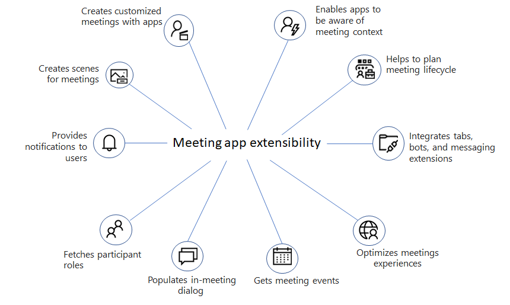

# Aplicativos para Teams reuniões

As reuniões permitem colaboração, parceria, comunicação informada e comentários compartilhados. O aplicativo de reunião pode oferecer uma experiência do usuário para cada estágio do ciclo de vida da reunião. O ciclo de vida da reunião inclui a experiência do aplicativo pré-reunião, na reunião e pós-reunião, dependendo do status do participante.

Os usuários podem acessar aplicativos durante reuniões usando a galeria de guias de seu calendário, como:

* Pré-estágio de um quadro Kanban.
* Iniciar uma caixa de diálogo acionável na reunião.
* Crie uma pesquisa pós-reunião.

A ilustração a seguir fornece uma ideia dos recursos de extensibilidade do aplicativo de reunião:

Este artigo fornece uma visão geral da extensibilidade do aplicativo de reunião, referências de API, habilitar e configurar aplicativos para reuniões e cenas personalizadas do modo Juntos Teams.

Aprimora sua experiência de reunião usando o recurso de extensibilidade de reunião. Esse recurso permite integrar seus aplicativos em reuniões. Ele também inclui diferentes estágios de um ciclo de vida de reunião, onde você pode integrar guias, bots e extensões de mensagens. Você pode identificar várias funções de participante e tipos de usuário, obter eventos de reunião e gerar caixas de diálogo na reunião.

Para personalizar Teams aplicativos para reuniões, habilita seus aplicativos para reuniões Teams atualizando o manifesto do aplicativo e também configure os aplicativos para cenários de reunião.

O novo recurso de cenas do Modo Juntos personalizado permite que os usuários colaborem em uma reunião com sua equipe em um só lugar.

## Próxima etapa

> [!div class="nextstepaction"]
> [Extensibilidade do aplicativo de reunião](meeting-app-extensibility.md)

## Confira também

* [Pré-requisitos e referências de API para aplicativos de reuniões do Teams](create-apps-for-teams-meetings.md)
* [Projetando sua extensão Microsoft Teams reunião](~/apps-in-teams-meetings/design/designing-apps-in-meetings.md)
* [Referências de API de aplicativos de reunião - Teams](~/apps-in-teams-meetings/api-references.md)
* [Cenas do modo Custom Together](~/apps-in-teams-meetings/teams-together-mode.md)
* [Habilitar e configurar seus aplicativos para Teams reuniões](~/apps-in-teams-meetings/enable-and-configure-your-app-for-teams-meetings.md)
* [Ciclo de vida da reunião](meeting-app-extensibility.md#meeting-lifecycle)
