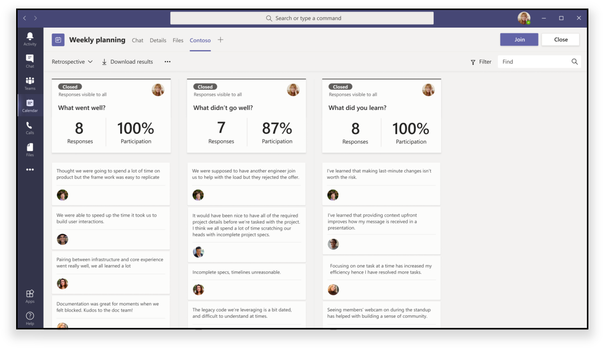

# Aplicativos em reuniões do Teams (Developer Preview)Apps in Teams meetings (Developer Preview)

>[!IMPORTANT]
> Os recursos incluídos no Microsoft Teams Developer Preview são fornecidos apenas para fins de acesso antecipado, teste e comentários.Features included in Microsoft Teams Developer Preview are provided for early-access, testing, and feedback purposes only. Eles podem sofrer alterações antes de ficarem disponíveis no lançamento público e não devem ser usados em aplicativos de produção.They may undergo changes before becoming available in the public release and should not be used in production applications.

As reuniões são fundamentais para a produtividade no Microsoft Teams.Meetings are key to productivity in Teams. Eles permitem colaboração, parceria, comunicação informada e comentários compartilhados em um fórum inclusivo e ativo.They enable collaboration, partnership, informed communication, and shared feedback in an inclusive and active forum. Como desenvolvedor, você pode criar uma [guia configurável](../tabs/what-are-tabs.md#how-do-tabs-work), [bot](../bots/what-are-bots.md)e aplicativos de [extensão de mensagem](../messaging-extensions/what-are-messaging-extensions.md) para aprimorar e enriquecer uma experiência de reunião do teams.As a developer, you can create [configurable tab](../tabs/what-are-tabs.md#how-do-tabs-work), [bot](../bots/what-are-bots.md), and [message extension](../messaging-extensions/what-are-messaging-extensions.md) applications to enhance and enrich a Teams meeting experience. Os usuários da reunião podem acessar os aplicativos, por meio da Galeria de guias, para habilitar os cenários relevantes, como preparar um quadro Kanban, iniciar uma caixa de diálogo acionável em reunião ou criar uma votação de reunião.Meeting users can access apps, via the tab gallery, to enable relevant scenarios such as pre-staging a Kanban board, launching an in-meeting actionable dialog, or creating a post-meeting poll. O aplicativo de reunião pode fornecer uma experiência do usuário para cada estágio do ciclo de vida da reunião com base no status do participante.Your meeting app can deliver a user experience for each stage of the meeting lifecycle based upon attendee status.

Centros de extensibilidade de aplicativos da reunião da equipe em três conceitos:Teams’ meeting app extensibility centers on three concepts:

✔ **Ciclo de vida da reunião** — antes, durante e após o período de reunião.✔ **Meeting lifecycle** — before, during, and after meeting time frame.  
✔ **Função participante** — organizador da reunião, apresentador ou participante.✔ **Participant role** — meeting organizer, presenter, or attendee.  
✔ **Tipo de usuário** , usuário no locatário, convidado, federado ou equipes anônimas.✔ **User type** — in-tenant, guest, federated, or anonymous Teams user.

<!-- markdownlint-disable MD001 -->
### Cenários de ciclo de vida da reuniãoMeeting lifecycle scenarios

## GuiasTabs

> [!IMPORTANT]
> Assim como ocorre com todos os aplicativos de guia, seu aplicativo precisará seguir o [fluxo de autenticação SSO](../tabs/how-to/authentication/auth-aad-sso.md) do teams para guias.As with all tab applications, Your app will need to follow the Teams [SSO authentication flow](../tabs/how-to/authentication/auth-aad-sso.md) for tabs.

> [!NOTE]
> Os clientes móveis dão suporte a guias apenas nas superfícies de reunião prévia e posterior.Mobile clients support Tabs only in Pre and Post Meeting Surfaces. As experiências de reunião (painel e caixa de diálogo na reunião) no Mobile estarão disponíveis em breveThe In-meeting experiences (in-meeting dialog and panel) on mobile will be available soon

### Experiência do aplicativo de pré-vendaPre-meeting app experience

**Experiência antes da reunião:****Pre-meeting experience:**

**Guia antes da reunião:****Pre-meeting tab:**

✔ Usuários com permissão podem adicionar aplicativos a uma reunião por meio da Galeria de guias de duas maneiras:✔ Permissioned users can add apps to a meeting via the tab gallery in two ways:

&emsp;&emsp;&#9679; por meio da guia **detalhes** no formulário de agendamento do teams.&emsp;&emsp;&#9679; Via the **Details** tab on the Teams scheduling form.

&emsp;&emsp;&#9679; por meio da guia **chat** de reunião em uma reunião existente.&emsp;&emsp;&#9679;  Via the meeting **Chat** tab in an existing meeting.   

✔ Os aplicativos de guia podem ser acessados em páginas de **detalhes** de reuniões e **chats** usando um botão de adição (➕). |✔ Tab apps are accessible in meetings **Details** and **Chats** pages using a plus icon (➕) button.|

### Experiência do aplicativo na reuniãoIn-meeting app experience

✔ Os aplicativos de reunião serão hospedados na barra superior superior da janela de bate-papo e como experiência de guia na reunião através da guia na reunião. Quando os usuários adicionam uma guia a uma reunião através da Galeria de guias, os aplicativos que estão durante as experiências de **reunião** serão exibidos.✔ Meeting apps will be hosted in the top upper bar of the chat window and as in-meeting tab experience via the in-meeting tab. When users add a tab to a meeting through the tab gallery, apps that are **during meeting** experiences will be surfaced.

✔ Usuários com permissão podem adicionar aplicativos enquanto estiverem na reunião.✔ Permissioned users can add apps while in the meeting.

✔ Quando carregado no contexto de uma reunião, os aplicativos poderão aproveitar o SDK do cliente do teams para acessar o `meetingId` , `userMri` e `frameContext` para renderizar apropriadamente a experiência.✔ When loaded in the context of a meeting, apps will be able to leverage the Teams Client SDK to access the `meetingId`, `userMri`, and `frameContext` to appropriately render the experience.

✔ Para um aplicativo pode ser visível em uma reunião do teams em duas áreas:✔ For an app can be visible in a Teams meeting in two areas:

&emsp;&emsp;**Painel lateral** &#9679;.&emsp;&emsp;&#9679; **Side panel** .  

> [!NOTE]
> Se o _manifesto do aplicativo_ especificar que a guia será [otimizada para o painel lateral](create-apps-for-teams-meetings.md#in-meeting), isso será exibido.If your _app manifest_ specifies that your tab is [optimized for side panel](create-apps-for-teams-meetings.md#in-meeting), that is where it will be displayed. Também pode fazer parte de uma experiência de bandeja de compartilhamento, sujeita às diretrizes de design especificadas.It can also be part of a share-tray experience, subject to specified design guidelines.

&emsp;&emsp;&#9679; **caixa de diálogo de reunião** .&emsp;&emsp;&#9679; **In-meeting dialog** . Use a caixa de diálogo de reunião para exibir conteúdo acionável para os participantes da reunião.Use the in-meeting dialog to showcase actionable content for meeting participants. *Consulte* [criar aplicativos para reuniões do teams](create-apps-for-teams-meetings.md).*See* [Create Apps for Teams meetings](create-apps-for-teams-meetings.md).

**Experiência de reunião:****In-meeting experience:**

**Caixa de diálogo acionável na reunião para usuários:****In-meeting actionable dialog for users:**

### Experiência do aplicativo após reuniãoPost-meeting app experience

**Experiência de reunião:****Post-meeting experience:**

O cenário de aplicativo pós-reunião é semelhante à experiência de reunião atual com o benefício adicional de ter guias na superfície.The post-meeting app scenario is similar to the current post-meeting experience with the added benefit of having tabs exist within the surface. Usuários com permissão podem adicionar aplicativos da Galeria de guias a uma reunião por meio da guia **detalhes** no formulário de programação de equipes e na guia **chat** de reunião em uma reunião existente.Permissioned users can add apps from the tab gallery to a meeting via the **Details** tab on the Teams scheduling form and the meeting **Chat** tab in an existing meeting.

### BotsBots

Para implementação de bot, Confira nossos [bots na documentação de reuniões do Microsoft Teams](../bots/how-to/create-a-bot-for-teams.md#bots-in-teams-meetings) .For bot implementation, please see our [Bots in Teams meetings](../bots/how-to/create-a-bot-for-teams.md#bots-in-teams-meetings) documentation.

### Extensões de MensagensMessaging Extensions

Para implementação de extensão de mensagens, Confira nossa documentação [de mensagens de reuniões do teams](../messaging-extensions/how-to/create-messaging-extension.md#messaging-extensions-in-teams-meetings) .For messaging extension implementation, please see our [Messaging extensions in Teams meetings](../messaging-extensions/how-to/create-messaging-extension.md#messaging-extensions-in-teams-meetings) documentation.

## Funções de participante e tipos de usuários em uma reuniãoParticipant roles and user types in a meeting

### Funções de participanteParticipant roles

Você pode criar seu aplicativo com autorização específica do participante.You can design your app with participant-specific authorization. Por exemplo, talvez apenas um organizador e/ou apresentador possa criar uma pesquisa em reuniões.For example, perhaps only an organizer and/or presenter can create a poll in meetings. Embora as configurações de participante padrão sejam determinadas pelo administrador de ti de uma organização, um organizador da reunião pode querer alterar as configurações de uma reunião específica.Although default participant settings are determined by an organization's IT administrator, a meeting organizer may want to change the settings for a specific meeting. Os organizadores podem fazer essas alterações na página da Web opções de reunião.Organizers can make these changes on the Meeting options web page.

1. **Organizador** .**Organizer** . O organizador agenda uma reunião, define as opções de reunião, atribui funções de reunião e inicia a reunião.The organizer schedules a meeting, sets the meeting options, assigns meeting roles, and starts the meeting. Somente os usuários com uma conta do M365 (que possui uma licença do Teams) podem ser organizadores e controlar as permissões dos participantes.Only users with a M365 account (possessing a Teams license) can be organizers and control attendee permissions.
1. **Apresentador** .**Presenter** . Os apresentadores têm praticamente os mesmos recursos do organizador; no entanto, um apresentador não pode remover um organizador da sessão ou modificar as opções de reunião da sessão.Presenters have nearly the same capabilities as organizer; however, a presenter cannot remove an organizer from the session or modify meeting options for the session. Por padrão, os participantes que ingressam em uma reunião têm a função apresentador.By default, participants joining a meeting have the presenter role.
1. **Participante** .**Attendee** . Um participante é um usuário que foi convidado a participar de uma reunião, mas que não está autorizado a atuar como apresentador.An attendee is a user who has been invited to attend a meeting but who is not authorized to act as a presenter. Os participantes podem interagir com outros membros da reunião, mas não podem gerenciar nenhuma configuração de reunião ou compartilhar conteúdo.Attendees can interact with other meeting members but cannot manage any of the meeting settings or share content.

_Ver_ [ **funções em uma reunião do teams**](https://support.microsoft.com/office/roles-in-a-teams-meeting-c16fa7d0-1666-4dde-8686-0a0bfe16e019)_See_ [**Roles in a Teams meeting**](https://support.microsoft.com/office/roles-in-a-teams-meeting-c16fa7d0-1666-4dde-8686-0a0bfe16e019)

Você pode acessar a página  **Opções de reunião** da seguinte maneira:You can access the  **Meeting options** page as follows:

&#11200; no Microsoft Teams, **vá para**  , selecione uma reunião e, em seguida, **Opções de reunião** .&#11200; In Teams, go to **Calendar** , select a meeting, and then **Meeting options** .

&#11200; em um convite de reunião, selecione **Opções de reunião** .&#11200; In a meeting invitation, select **Meeting options** .

&#11200; durante uma reunião, selecione **Mostrar participantes**  de participantes nos controles da reunião.&#11200; During a meeting, select **Show participants**  in the meeting controls. Em seguida, acima da lista de participantes, escolha **gerenciar permissões** .Then, above the list of participants, choose **Manage permissions** .

### Tipos de usuáriosUser types

> [!NOTE]
> Os tipos de usuário podem participar de reuniões e assumir uma das funções de participante descritas acima.User types can join meetings and assume one of the participant roles described above. O tipo de usuário não é exposto como parte da API **getParticipantRole** .The User type is not exposed as part of the **getParticipantRole** API.

1. **Dentro do locatário** .**In-tenant** . Esses usuários pertencem à organização e têm credenciais no Azure Active Directory para o locatário.These users belong to the organization and have credentials in Azure Active Directory for the tenant. Em geral, eles são funcionários remotos ou no local.They are usually full-time, onsite or remote employees.
1. **Convidado** .**Guest** . Um convidado é um participante de outra organização que tenha sido convidado a acessar o Microsoft Teams ou outros recursos no locatário da sua organização.A guest is a participant from another organization who has been invited to access Teams or other resources in your organization's tenant. Os convidados são adicionados ao Active Directory da sua organização e podem receber praticamente todos os mesmos recursos do teams que um membro da equipe nativo com acesso total aos bate-papos, reuniões e arquivos da equipe.Guests are added to your organization’s Active Directory and can be given nearly all the same Teams capabilities as a native team member with full access to team chats, meetings, and files. _Ver_ [o acesso de convidados no Microsoft Teams](/microsoftteams/guest-access)_See_ [Guest access in Microsoft Teams](/microsoftteams/guest-access)
1. **Federado/externo** .**Federated/External** . Um usuário federado é um usuário do teams externo em outra organização que foi convidado a participar de uma reunião.A federated user is an external Teams user in another organization who has been invited to join a meeting. Como esses usuários têm credenciais válidas com parceiros federados, eles são tratados como autenticados pelo Teams, mas não têm acesso às suas equipes ou a outros recursos compartilhados da sua organização.Since these users have valid credentials with federated partners, they are treated as authenticated by Teams but do not have access to your teams or other shared resources from your organization. Se você deseja que usuários externos tenham acesso a equipes e canais, o acesso de convidados pode ser uma opção melhor.If you want external users to have access to teams and channels, guest access might be a better option. _Consulte_ [gerenciar o acesso externo no Microsoft Teams](/microsoftteams/manage-external-access)_See_ [Manage external access in Microsoft Teams](/microsoftteams/manage-external-access)
1. **Anônimo** .**Anonymous** . Os usuários anônimos não têm uma identidade do Active Directory e não são federados com um locatário.Anonymous users do not have an Active Directory identity and are not federated with a tenant. O participante anônimo é como um usuário externo, mas sua identidade não é projetada na reunião.The anonymous participant is like an external user, but their identity is not projected into the meeting. Usuários anônimos não poderão acessar aplicativos em uma janela de reunião.Anonymous users will not be able to access apps in a meeting window.

## Próximas EtapasNext Steps

> [!div class="nextstepaction"]
> [Crie aplicativos para reuniões do TeamsCreate apps for Teams meetings](create-apps-for-teams-meetings.md)
