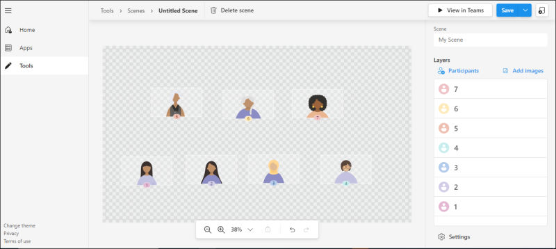
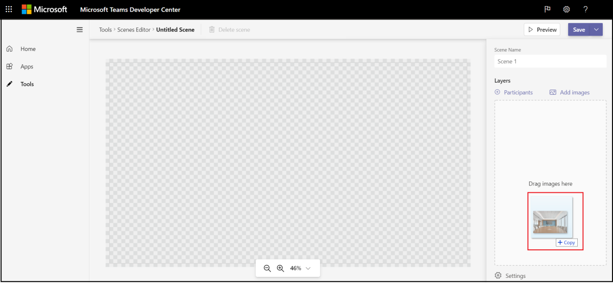
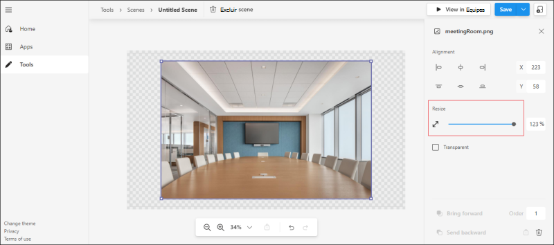
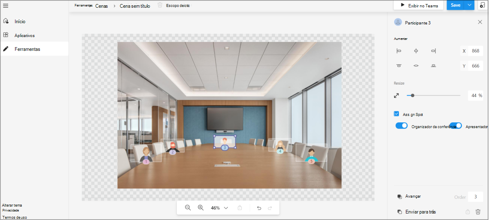
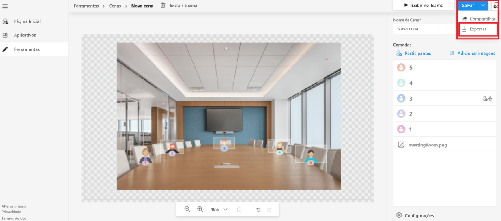

# <a name="together-mode-in-teams"></a><span data-ttu-id="b370e-103">Modo Juntos no Teams</span><span class="sxs-lookup"><span data-stu-id="b370e-103">Together Mode in Teams</span></span>

> [!NOTE]
> <span data-ttu-id="b370e-104">Esse recurso está disponível apenas na [visualização de desenvolvedor](../resources/dev-preview/developer-preview-intro.md) público.</span><span class="sxs-lookup"><span data-stu-id="b370e-104">This feature is currently available in [public developer preview](../resources/dev-preview/developer-preview-intro.md) only.</span></span>

<span data-ttu-id="b370e-105">Microsoft Teams O modo Juntos fornece um ambiente de reunião imersivo e envolvente que reúne as pessoas e as incentiva a ativar seu vídeo.</span><span class="sxs-lookup"><span data-stu-id="b370e-105">Microsoft Teams Together Mode provides an immersive and engaging meeting environment that brings people together and encourages them to turn on their video.</span></span> <span data-ttu-id="b370e-106">Ele combina digitalmente os participantes em uma única cena virtual e coloca seus fluxos de vídeo em bancos pré-determinados projetados e corrigidos pelo criador da cena.</span><span class="sxs-lookup"><span data-stu-id="b370e-106">It digitally combines participants into a single virtual scene and places their video streams in pre-determined seats designed and fixed by the scene creator.</span></span>

> [!VIDEO https://www.youtube-nocookie.com/embed/MGsNmYKgeTA]

<span data-ttu-id="b370e-107">Uma cena no modo Juntos é um artefato criado pelo desenvolvedor de cena usando o estúdio do Microsoft Scene.</span><span class="sxs-lookup"><span data-stu-id="b370e-107">A scene in Together Mode is an artifact created by the scene developer using the Microsoft Scene studio.</span></span> <span data-ttu-id="b370e-108">Em uma configuração de cena concebida, os participantes têm assentos designados com fluxos de vídeo renderizados nesses bancos.</span><span class="sxs-lookup"><span data-stu-id="b370e-108">In a conceived scene setting, participants have designated seats with video streams rendered in those seats.</span></span>

> [!NOTE]
> <span data-ttu-id="b370e-109">Somente aplicativos de cena são recomendados, pois a experiência de aquisição para esses aplicativos é mais perfeita.</span><span class="sxs-lookup"><span data-stu-id="b370e-109">Scene only apps are recommended as the acquisition experience for such apps is more seamless.</span></span>

<span data-ttu-id="b370e-110">O processo a seguir fornece uma visão geral para criar um aplicativo somente de cena:</span><span class="sxs-lookup"><span data-stu-id="b370e-110">The following process gives an overview to create a scene only app:</span></span>

:::image type="content" source="../assets/images/apps-in-meetings/create-together-mode-scene-flow.png" alt-text="Criar aplicativo somente cena" border="false":::

> [!NOTE]
> * <span data-ttu-id="b370e-112">Um aplicativo somente de cena ainda é um aplicativo Microsoft Teams.</span><span class="sxs-lookup"><span data-stu-id="b370e-112">A scene only app is still an app in Microsoft Teams.</span></span> <span data-ttu-id="b370e-113">O estúdio Scene lida com a criação do pacote de aplicativos em segundo plano.</span><span class="sxs-lookup"><span data-stu-id="b370e-113">The Scene studio handles the app package creation in the background.</span></span>
> * <span data-ttu-id="b370e-114">Várias cenas em um único pacote de aplicativos aparecem como uma lista simples de cenas para os usuários.</span><span class="sxs-lookup"><span data-stu-id="b370e-114">Multiple scenes in a single app package appear as a flat list of scenes to users.</span></span>

## <a name="prerequisites"></a><span data-ttu-id="b370e-115">Pré-requisitos</span><span class="sxs-lookup"><span data-stu-id="b370e-115">Prerequisites</span></span>

<span data-ttu-id="b370e-116">Você deve ter uma compreensão básica do seguinte para usar o modo Juntos:</span><span class="sxs-lookup"><span data-stu-id="b370e-116">You must have a basic understanding of the following to use Together Mode:</span></span>

* <span data-ttu-id="b370e-117">Definição de cena e bancos em uma cena.</span><span class="sxs-lookup"><span data-stu-id="b370e-117">Definition of scene and seats in a scene.</span></span>
* <span data-ttu-id="b370e-118">Tenha uma conta do Desenvolvedor da Microsoft e conheça o Microsoft Teams Portal do [Desenvolvedor](../concepts/build-and-test/teams-developer-portal.md) e o App Studio.</span><span class="sxs-lookup"><span data-stu-id="b370e-118">Have a Microsoft Developer account and be familiar with the Microsoft Teams [Developer Portal](../concepts/build-and-test/teams-developer-portal.md) and App Studio.</span></span>
* <span data-ttu-id="b370e-119">[Conceito de sideload de aplicativo.](../concepts/deploy-and-publish/apps-upload.md)</span><span class="sxs-lookup"><span data-stu-id="b370e-119">[Concept of app sideloading](../concepts/deploy-and-publish/apps-upload.md).</span></span>
* <span data-ttu-id="b370e-120">Verifique se o Administrador concedeu permissão para Upload um aplicativo personalizado e selecionar todos os filtros como parte das políticas de Configuração de Aplicativo e Reunião, respectivamente. </span><span class="sxs-lookup"><span data-stu-id="b370e-120">Ensure that the Administrator has granted permission to **Upload a custom app** and to select all filters as part of App Setup and Meeting policies respectively.</span></span>

## <a name="best-practices"></a><span data-ttu-id="b370e-121">Práticas recomendadas</span><span class="sxs-lookup"><span data-stu-id="b370e-121">Best practices</span></span>

<span data-ttu-id="b370e-122">Antes de criar uma cena, considere o seguinte para ter uma experiência perfeita de construção de cena:</span><span class="sxs-lookup"><span data-stu-id="b370e-122">Prior to building a scene, consider the following to have a seamless scene building experience:</span></span>

* <span data-ttu-id="b370e-123">Verifique se todas as imagens estão no formato PNG.</span><span class="sxs-lookup"><span data-stu-id="b370e-123">Ensure that all images are in PNG format.</span></span>
* <span data-ttu-id="b370e-124">Verifique se o pacote final com todas as imagens reunidas não deve exceder a resolução 1920x1080.</span><span class="sxs-lookup"><span data-stu-id="b370e-124">Ensure that the final package with all the images put together must not exceed 1920x1080 resolution.</span></span>

    > [!NOTE]
    > <span data-ttu-id="b370e-125">A resolução é um número even.</span><span class="sxs-lookup"><span data-stu-id="b370e-125">The resolution is an even number.</span></span> <span data-ttu-id="b370e-126">Esse é um requisito para que as cenas sejam iluminadas com êxito.</span><span class="sxs-lookup"><span data-stu-id="b370e-126">This is a requirement for scenes to be lit up successfully.</span></span>

* <span data-ttu-id="b370e-127">Verifique se o tamanho máximo da cena é de 10 MB.</span><span class="sxs-lookup"><span data-stu-id="b370e-127">Ensure that the maximum scene size is 10 MB.</span></span>
* <span data-ttu-id="b370e-128">Verifique se o tamanho máximo de cada imagem é de 5 MB.</span><span class="sxs-lookup"><span data-stu-id="b370e-128">Ensure that the maximum size of each image is 5 MB.</span></span>

    > [!NOTE]
    > * <span data-ttu-id="b370e-129">Uma cena é uma coleção de várias imagens.</span><span class="sxs-lookup"><span data-stu-id="b370e-129">A scene is a collection of multiple images.</span></span> <span data-ttu-id="b370e-130">O limite é para cada imagem individual.</span><span class="sxs-lookup"><span data-stu-id="b370e-130">The limit is for each individual image.</span></span>
    > * <span data-ttu-id="b370e-131">A resolução de imagem individual também deve ser um número único.</span><span class="sxs-lookup"><span data-stu-id="b370e-131">The individual image resolution must also be an even number.</span></span>
  
* <span data-ttu-id="b370e-132">Verifique se a **caixa de** seleção Transparente está selecionada se a imagem for transparente.</span><span class="sxs-lookup"><span data-stu-id="b370e-132">Ensure that the **Transparent** checkbox is selected if the image is transparent.</span></span> <span data-ttu-id="b370e-133">Essa caixa de seleção está disponível no painel direito quando uma imagem é selecionada.</span><span class="sxs-lookup"><span data-stu-id="b370e-133">This checkbox is available on the right panel when an image is selected.</span></span>

    > [!NOTE]
    > <span data-ttu-id="b370e-134">As imagens sobrepostas precisam ser marcadas como **Transparentes** para indicar que estão sobrepostas imagens na cena.</span><span class="sxs-lookup"><span data-stu-id="b370e-134">Overlapping images need to be marked as **Transparent** to indicate that they are overlapping images in the scene.</span></span>

## <a name="build-a-scene-using-the-scene-studio"></a><span data-ttu-id="b370e-135">Criar uma cena usando o estúdio scene</span><span class="sxs-lookup"><span data-stu-id="b370e-135">Build a scene using the Scene studio</span></span>

<span data-ttu-id="b370e-136">A Microsoft tem um estúdio scene que permite que você crie cenas.</span><span class="sxs-lookup"><span data-stu-id="b370e-136">Microsoft has a Scene studio that allows you to build scenes.</span></span> <span data-ttu-id="b370e-137">Ele está disponível no [Editor de Cenas - Teams Portal do Desenvolvedor.](https://dev.teams.microsoft.com/scenes)</span><span class="sxs-lookup"><span data-stu-id="b370e-137">It is available on [Scenes Editor - Teams Developer Portal](https://dev.teams.microsoft.com/scenes).</span></span>

> [!NOTE]
> <span data-ttu-id="b370e-138">Este documento está se referindo ao Scene studio no Microsoft Teams Portal do Desenvolvedor.</span><span class="sxs-lookup"><span data-stu-id="b370e-138">This document is referring to Scene studio in the Microsoft Teams Developer Portal.</span></span> <span data-ttu-id="b370e-139">A interface e as funcionalidades são todas iguais no Designer de Cena do App Studio.</span><span class="sxs-lookup"><span data-stu-id="b370e-139">The interface and functionalities are all the same in App Studio Scene Designer.</span></span>

<span data-ttu-id="b370e-140">Uma cena no contexto do estúdio scene é um artefato que contém o seguinte:</span><span class="sxs-lookup"><span data-stu-id="b370e-140">A scene in the context of the Scene studio is an artifact that contains the following:</span></span>

* <span data-ttu-id="b370e-141">Assentos reservados para organizadores de reunião e apresentadores de reunião.</span><span class="sxs-lookup"><span data-stu-id="b370e-141">Seats reserved for meeting organizer and meeting presenters.</span></span>

    > [!NOTE]
    > <span data-ttu-id="b370e-142">O apresentador não se refere ao usuário que está compartilhando ativamente.</span><span class="sxs-lookup"><span data-stu-id="b370e-142">Presenter does not refer to the user who is actively sharing.</span></span> <span data-ttu-id="b370e-143">Refere-se à função [de reunião](https://support.microsoft.com/en-us/office/roles-in-a-teams-meeting-c16fa7d0-1666-4dde-8686-0a0bfe16e019).</span><span class="sxs-lookup"><span data-stu-id="b370e-143">It refers to the [meeting role](https://support.microsoft.com/en-us/office/roles-in-a-teams-meeting-c16fa7d0-1666-4dde-8686-0a0bfe16e019).</span></span>

* <span data-ttu-id="b370e-144">Assento e imagem para cada participante com largura e altura ajustáveis.</span><span class="sxs-lookup"><span data-stu-id="b370e-144">Seat and image for each participant with an adjustable width and height.</span></span>

    > [!NOTE]
    > <span data-ttu-id="b370e-145">PNG é o único formato com suporte.</span><span class="sxs-lookup"><span data-stu-id="b370e-145">PNG is the only supported format.</span></span>

* <span data-ttu-id="b370e-146">Coordenadas XYZ de todos os bancos e imagens.</span><span class="sxs-lookup"><span data-stu-id="b370e-146">XYZ coordinates of all the seats and images.</span></span>
* <span data-ttu-id="b370e-147">Coleção de imagens que são mascaradas como uma imagem.</span><span class="sxs-lookup"><span data-stu-id="b370e-147">Collection of images that are camouflaged as one image.</span></span>

<span data-ttu-id="b370e-148">As dimensões de assento se tornam a tela para renderizar o fluxo de vídeo do participante.</span><span class="sxs-lookup"><span data-stu-id="b370e-148">The seat dimensions become the canvas for rendering the participant video stream.</span></span> <span data-ttu-id="b370e-149">A imagem a seguir mostra cada assento representado como um avatar para criar cenas:</span><span class="sxs-lookup"><span data-stu-id="b370e-149">The following image shows each seat represented as an avatar for building scenes:</span></span>



<span data-ttu-id="b370e-151">**Para criar uma cena usando o estúdio scene**</span><span class="sxs-lookup"><span data-stu-id="b370e-151">**To build a scene using the Scene studio**</span></span>

1. <span data-ttu-id="b370e-152">Vá para [Editor de Cenas - Teams Portal do Desenvolvedor.](https://dev.teams.microsoft.com/scenes)</span><span class="sxs-lookup"><span data-stu-id="b370e-152">Go to [Scenes Editor - Teams Developer Portal](https://dev.teams.microsoft.com/scenes).</span></span>

    >[!NOTE]
    > * <span data-ttu-id="b370e-153">Para abrir o Estúdio de Cena, você pode navegar até a home page do [Teams Portal do](https://dev.teams.microsoft.com/home) Desenvolvedor e selecionar Criar cenas **personalizadas para reuniões.**</span><span class="sxs-lookup"><span data-stu-id="b370e-153">To open Scene studio, you can navigate to the home page of [Teams Developer Portal](https://dev.teams.microsoft.com/home) and select **Create custom scenes for meetings**.</span></span>
    > * <span data-ttu-id="b370e-154">Para abrir o Estúdio de Cena, você pode navegar até  a home page do [Teams Portal](https://dev.teams.microsoft.com/home)do Desenvolvedor, selecione Ferramentas na seção à esquerda e selecione **Cena studio** na seção **Ferramentas.**</span><span class="sxs-lookup"><span data-stu-id="b370e-154">To open Scene studio, you can navigate to the home page of [Teams Developer Portal](https://dev.teams.microsoft.com/home), select **Tools** from the left hand section, and select **Scene studio** from the **Tools** section.</span></span>

1. <span data-ttu-id="b370e-155">Na página **Editor de Cenas,** selecione **Criar uma nova cena**.</span><span class="sxs-lookup"><span data-stu-id="b370e-155">In the **Scenes Editor** page, select **Create a new scene**.</span></span>

1. <span data-ttu-id="b370e-156">Na caixa **Cena,** insira um nome para a cena.</span><span class="sxs-lookup"><span data-stu-id="b370e-156">In the **Scene** box, enter a name for the scene.</span></span>

    >[!NOTE]
    > * <span data-ttu-id="b370e-157">Você pode selecionar **Fechar** para alternar entre fechar ou reabrir o painel direito.</span><span class="sxs-lookup"><span data-stu-id="b370e-157">You can select **Close** to toggle between closing or reopening the right pane.</span></span>
    > * <span data-ttu-id="b370e-158">Você pode ampliar ou diminuir o zoom da cena usando a barra de zoom para uma melhor exibição da cena.</span><span class="sxs-lookup"><span data-stu-id="b370e-158">You can zoom in or zoom out of the scene using the zoom bar for a better view of the scene.</span></span>

1. <span data-ttu-id="b370e-159">Arraste e solte a imagem no ambiente conforme exibido na imagem a seguir:</span><span class="sxs-lookup"><span data-stu-id="b370e-159">Drag and drop the image into the environment as displayed in the following image:</span></span>

    >[!NOTE]
    > * <span data-ttu-id="b370e-160">Você pode baixar os [ arquivosSampleScene.zip](https://github.com/MicrosoftDocs/msteams-docs/tree/master/msteams-platform/apps-in-teams-meetings/SampleScene.zip) e [SampleApp.zip](https://github.com/MicrosoftDocs/msteams-docs/tree/master/msteams-platform/apps-in-teams-meetings/SampleApp.zip) com as imagens.</span><span class="sxs-lookup"><span data-stu-id="b370e-160">You can download the [SampleScene.zip](https://github.com/MicrosoftDocs/msteams-docs/tree/master/msteams-platform/apps-in-teams-meetings/SampleScene.zip) and [SampleApp.zip](https://github.com/MicrosoftDocs/msteams-docs/tree/master/msteams-platform/apps-in-teams-meetings/SampleApp.zip) files with the images.</span></span>
    > * <span data-ttu-id="b370e-161">Como alternativa, você pode adicionar imagens em segundo plano à cena usando **Adicionar imagens**.</span><span class="sxs-lookup"><span data-stu-id="b370e-161">Alternately, you can add background images to the scene using **Add images**.</span></span>

    

1. <span data-ttu-id="b370e-163">Selecione a imagem que você colocou.</span><span class="sxs-lookup"><span data-stu-id="b370e-163">Select the image that you have placed.</span></span>

1. <span data-ttu-id="b370e-164">No painel direito, selecione um alinhamento para a imagem ou use o controle deslizante **Resize** para ajustar o tamanho da imagem.</span><span class="sxs-lookup"><span data-stu-id="b370e-164">From the right pane, select an alignment for the image or use the **Resize** slider to adjust the image size.</span></span>

    

1. <span data-ttu-id="b370e-166">Selecione uma área fora da imagem.</span><span class="sxs-lookup"><span data-stu-id="b370e-166">Select an area outside of the image.</span></span>

1. <span data-ttu-id="b370e-167">No canto superior direito, selecione **Participantes em Camadas** . </span><span class="sxs-lookup"><span data-stu-id="b370e-167">In the upper-right corner, select **Participants** under **Layers**.</span></span>

1. <span data-ttu-id="b370e-168">Selecione o número de participantes para a cena na caixa **Número** de participantes e selecione **Adicionar**.</span><span class="sxs-lookup"><span data-stu-id="b370e-168">Select the number of participants for the scene from the **Number of participants** box, and select **Add**.</span></span>

    >[!NOTE]
    > * <span data-ttu-id="b370e-169">Depois que a cena é enviada, os posicionamentos de avatar são substituídos pelos fluxos de vídeo reais do participante.</span><span class="sxs-lookup"><span data-stu-id="b370e-169">After the scene is shipped, the avatar placements are replaced with actual participant's video streams.</span></span>
    > * <span data-ttu-id="b370e-170">Você pode arrastar as imagens do participante ao redor da cena e posicioná-las na posição necessária e ressize-las usando a seta de ressize.</span><span class="sxs-lookup"><span data-stu-id="b370e-170">You can drag the participant images around the scene and place them in the required position and resize them using the resize arrow.</span></span>

1. <span data-ttu-id="b370e-171">Selecione qualquer imagem de participante e escolha a caixa de seleção **Atribuir Ponto** para atribuir o local ao participante.</span><span class="sxs-lookup"><span data-stu-id="b370e-171">Select any participant image, and choose the **Assign Spot** check box to assign the spot to the participant.</span></span>

1. <span data-ttu-id="b370e-172">Selecione **Organizador da Reunião** ou Função **de** Apresentador para o participante.</span><span class="sxs-lookup"><span data-stu-id="b370e-172">Select **Meeting Organizer** or **Presenter** role for the participant.</span></span>

    >[!NOTE]
    > <span data-ttu-id="b370e-173">Em uma reunião, um participante deve ter a função de organizador da reunião.</span><span class="sxs-lookup"><span data-stu-id="b370e-173">In a meeting, one participant must be assigned the role of a meeting organizer.</span></span>

    

1. <span data-ttu-id="b370e-175">Selecione **Salvar** e selecione **Exibir em Teams** para testar rapidamente sua cena em Microsoft Teams.</span><span class="sxs-lookup"><span data-stu-id="b370e-175">Select **Save** and select **View in Teams** to quickly test your scene in Microsoft Teams.</span></span>

    >[!NOTE]
    > <span data-ttu-id="b370e-176">Para excluir uma cena criada, selecione **Excluir cena** na barra superior.</span><span class="sxs-lookup"><span data-stu-id="b370e-176">To delete a scene you created, select **Delete scene** on the top bar.</span></span>

1. <span data-ttu-id="b370e-177">Na caixa **de diálogo Exibir Teams,** selecione **Visualizar em Teams**.</span><span class="sxs-lookup"><span data-stu-id="b370e-177">In the **View in Teams** dialog box, select **Preview in Teams**.</span></span>
1. <span data-ttu-id="b370e-178">Na caixa de diálogo exibida, selecione **Adicionar**.</span><span class="sxs-lookup"><span data-stu-id="b370e-178">In the dialog box that appears, select **Add**.</span></span>

    <span data-ttu-id="b370e-179">A cena pode ser testada ou acessada criando uma reunião de teste e iniciando o modo Juntos.</span><span class="sxs-lookup"><span data-stu-id="b370e-179">The scene can be tested or accessed by creating a test meeting and launching Together Mode.</span></span> <span data-ttu-id="b370e-180">Para obter mais informações, consulte [activate the Together Mode](#activate-the-together-mode).</span><span class="sxs-lookup"><span data-stu-id="b370e-180">For more information, see [activate the Together Mode](#activate-the-together-mode).</span></span>

    

    >[!NOTE]
    > * <span data-ttu-id="b370e-182">Selecionar **Visualização** cria automaticamente um Microsoft Teams que pode ser exibido na página **Aplicativos** no Teams Portal do Desenvolvedor.</span><span class="sxs-lookup"><span data-stu-id="b370e-182">Selecting **Preview** automatically creates a Microsoft Teams app that can be viewed in the **Apps** page in the Teams Developer Portal.</span></span>
    > * <span data-ttu-id="b370e-183">Selecionar **Visualização** cria automaticamente um pacote de aplicativos que appmanifest.jspor trás da cena.</span><span class="sxs-lookup"><span data-stu-id="b370e-183">Selecting **Preview** automatically creates an app package that is appmanifest.json behind the scene.</span></span> <span data-ttu-id="b370e-184">Como dito anteriormente, isso é abstraído, mas você pode acessar o pacote de aplicativos criado automaticamente navegando para **Aplicativos** no menu.</span><span class="sxs-lookup"><span data-stu-id="b370e-184">As stated earlier, this is abstracted, but you can access the automatically created app package by navigating to **Apps** from the menu.</span></span>
    > * <span data-ttu-id="b370e-185">Em seguida, a cena pode ser exibida na galeria de cena Modo Conjunto.</span><span class="sxs-lookup"><span data-stu-id="b370e-185">The scene can then be viewed in the Together Mode scene gallery.</span></span>

1. <span data-ttu-id="b370e-186">Opcionalmente, você pode selecionar  **Compartilhar** no menu suspenso Salvar para criar um link compartilhável para distribuir facilmente suas cenas para outras pessoas usarem.</span><span class="sxs-lookup"><span data-stu-id="b370e-186">Optionally, you can select **Share** from the **Save** drop-down menu to create a shareable link to easily distribute your scenes for others to use.</span></span> <span data-ttu-id="b370e-187">Abrir esse link instala a cena para o usuário e eles podem começar a usá-la.</span><span class="sxs-lookup"><span data-stu-id="b370e-187">Opening this link installs the scene for the user and they can start using it.</span></span>

1. <span data-ttu-id="b370e-188">Após a visualização, a cena pode ser enviada como um aplicativo para Teams seguindo as etapas para envio do aplicativo.</span><span class="sxs-lookup"><span data-stu-id="b370e-188">After preview, the scene can be shipped as an app to Teams by following the steps for app submission.</span></span>

    >[!NOTE]
    > <span data-ttu-id="b370e-189">Esta etapa requer o pacote de aplicativo que é diferente do pacote de cena, para a cena que foi projetada.</span><span class="sxs-lookup"><span data-stu-id="b370e-189">This step requires the app package that is different from the scene package, for the scene that was designed.</span></span> <span data-ttu-id="b370e-190">O pacote de aplicativos criado automaticamente pode ser encontrado na seção **Aplicativos** no Teams Desenvolvedor.</span><span class="sxs-lookup"><span data-stu-id="b370e-190">The app package created automatically can be found in the **Apps** section in the Teams Developer Center.</span></span>

1. <span data-ttu-id="b370e-191">Opcionalmente, o pacote de cena pode ser  recuperado selecionando **Exportar** no menu suspenso Salvar.</span><span class="sxs-lookup"><span data-stu-id="b370e-191">Optionally, the scene package can be retrieved by selecting **Export** from the **Save** drop-down menu.</span></span> <span data-ttu-id="b370e-192">Um .zip, que é o pacote de cena, é baixado.</span><span class="sxs-lookup"><span data-stu-id="b370e-192">A .zip file, that is the scene package, is downloaded.</span></span>

    

    >[!NOTE]
    > <span data-ttu-id="b370e-194">O pacote de cena inclui uma scene.jse os ativos PNG usados para criar uma cena.</span><span class="sxs-lookup"><span data-stu-id="b370e-194">Scene package comprises of a scene.json and the PNG assets used to build a scene.</span></span> <span data-ttu-id="b370e-195">O pacote de cena pode ser revisado para incorporar outras alterações, conforme descrito na seção Exemplo scene.jsna seção deste documento.</span><span class="sxs-lookup"><span data-stu-id="b370e-195">The scene package can be reviewed for incorporating other changes as described in the Sample scene.json section of this document.</span></span>

<span data-ttu-id="b370e-196">Uma cena mais complexa que aproveita o eixo Z é demonstrada no exemplo passo a passo de início.</span><span class="sxs-lookup"><span data-stu-id="b370e-196">A more complex scene that leverages the Z-axis is demonstrated in the step-by-step getting started sample.</span></span>

## <a name="sample-scenejson"></a><span data-ttu-id="b370e-197">Exemplo scene.json</span><span class="sxs-lookup"><span data-stu-id="b370e-197">Sample scene.json</span></span>

<span data-ttu-id="b370e-198">Scene.jsem junto com as imagens indicam a posição exata dos bancos.</span><span class="sxs-lookup"><span data-stu-id="b370e-198">Scene.json along with the images indicate the exact position of the seats.</span></span> <span data-ttu-id="b370e-199">Uma cena consiste em imagens bitmap, sprites e retângulos para colocar vídeos de participantes.</span><span class="sxs-lookup"><span data-stu-id="b370e-199">A scene consists of bitmap images, sprites, and rectangles to put participant videos in.</span></span> <span data-ttu-id="b370e-200">Esses sprites e caixas de participantes são definidos em um sistema de coordenadas do mundo com o eixo X apontando para a direita e o eixo Y apontando para baixo.</span><span class="sxs-lookup"><span data-stu-id="b370e-200">These sprites and participant boxes are defined in a world coordinate system with the X-axis pointing to the right and the Y-axis pointing downwards.</span></span> <span data-ttu-id="b370e-201">O modo juntos dá suporte ao zoom nos participantes atuais.</span><span class="sxs-lookup"><span data-stu-id="b370e-201">Together mode supports zooming in on the current participants.</span></span> <span data-ttu-id="b370e-202">Isso é útil para pequenas reuniões em uma cena grande.</span><span class="sxs-lookup"><span data-stu-id="b370e-202">This is helpful for small meetings in a large scene.</span></span> <span data-ttu-id="b370e-203">Um sprite é uma imagem de bitmap estática posicionada no mundo.</span><span class="sxs-lookup"><span data-stu-id="b370e-203">A sprite is a static bitmap image positioned in the world.</span></span> <span data-ttu-id="b370e-204">O valor Z do sprite determina a posição do sprite.</span><span class="sxs-lookup"><span data-stu-id="b370e-204">The Z value of the sprite determines the position of the sprite.</span></span> <span data-ttu-id="b370e-205">A renderização começa com o sprite com o menor valor Z, portanto, o valor Z mais alto significa que ele está mais próximo da câmera.</span><span class="sxs-lookup"><span data-stu-id="b370e-205">Rendering starts with the sprite with lowest Z value, so higher Z value means it is closer to the camera.</span></span> <span data-ttu-id="b370e-206">Cada participante tem seu próprio feed de vídeo, que é segmentado para que apenas o primeiro plano seja renderizado.</span><span class="sxs-lookup"><span data-stu-id="b370e-206">Each participant has its own video feed, which is segmented so that only the foreground is rendered.</span></span>

<span data-ttu-id="b370e-207">Veja a seguir o scene.jsexemplo:</span><span class="sxs-lookup"><span data-stu-id="b370e-207">Following is the scene.json sample:</span></span>

```json
{
   "protocolVersion": "1.0",
   "id": "A",
   "autoZoom": true,
   "mirrorParticipants ": true,
   "extent":{
      "left":0.0,
      "top":0.0,
      "width":16.0,
      "height":9.0
   },
   "sprites":[
      {
         "filename":"background.png",
         "cx":8.0,
         "cy":4.5,
         "width":16.0,
         "height":9.0,
         "zOrder":0.0,
   "isAlpha":false
      },
      {
         "filename":"table.png",
         "cx":8.0,
         "cy":7.0,
         "width":12.0,
         "height":4.0,
         "zOrder":3.0,
   "isAlpha":true
      },
      {
         "filename":"row0.png",
         "cx":12.0,
         "cy":15.0,
         "width":8.0,
         "height":4.0,
         "zOrder":2.0,
   "isAlpha":true
      }

   ],
   "participants":[
      {
         "cx":5.0,
         "cy":4.0,
         "width":4.0,
         "height":2.25,
         "zOrder":1.0,
         "seatingOrder":0
      },
      {
         "cx":11.0,
         "cy":4.0,
         "width":4.0,
         "height":2.25,
         "zOrder":1.0,
         "seatingOrder":1
      }
   ]
}
```

<span data-ttu-id="b370e-208">Cada cena tem uma ID e um nome exclusivos.</span><span class="sxs-lookup"><span data-stu-id="b370e-208">Each scene has a unique ID and name.</span></span> <span data-ttu-id="b370e-209">A cena JSON também contém informações sobre todos os ativos usados para a cena.</span><span class="sxs-lookup"><span data-stu-id="b370e-209">The scene JSON also contains information on all the assets used for the scene.</span></span> <span data-ttu-id="b370e-210">Cada ativo contém um nome de arquivo, largura, altura e posição no eixo X e Y.</span><span class="sxs-lookup"><span data-stu-id="b370e-210">Each asset contains a filename, width, height, and position on the X and Y-axis.</span></span> <span data-ttu-id="b370e-211">Da mesma forma, cada assento contém uma ID de assento, largura, altura e posição no eixo X e Y.</span><span class="sxs-lookup"><span data-stu-id="b370e-211">Similarly, each seat contains a seat ID, width, height, and position on the X and Y-axis.</span></span> <span data-ttu-id="b370e-212">A ordem de assento é gerada automaticamente e pode ser alterada de acordo com a preferência.</span><span class="sxs-lookup"><span data-stu-id="b370e-212">The seating order is generated automatically and can be altered as per preference.</span></span>

> [!NOTE]
> <span data-ttu-id="b370e-213">O número do pedido de assento corresponde à ordem de pessoas que ingressaram na chamada.</span><span class="sxs-lookup"><span data-stu-id="b370e-213">Seating order number corresponds to the order of people joining the call.</span></span>

<span data-ttu-id="b370e-214">O zOrder representa a ordem de colocação de imagens e bancos ao longo do eixo Z.</span><span class="sxs-lookup"><span data-stu-id="b370e-214">The zOrder represents the order of placing images and seats along the Z-axis.</span></span> <span data-ttu-id="b370e-215">Em muitos casos, ele dá uma noção de profundidade ou partição, se necessário.</span><span class="sxs-lookup"><span data-stu-id="b370e-215">In many cases, it gives a sense of depth or partition if required.</span></span> <span data-ttu-id="b370e-216">Para obter mais informações, consulte o exemplo passo a passo sobre como começar.</span><span class="sxs-lookup"><span data-stu-id="b370e-216">For more information, see the step-by-step getting started sample.</span></span> <span data-ttu-id="b370e-217">O exemplo aproveita o zOrder.</span><span class="sxs-lookup"><span data-stu-id="b370e-217">The sample leverages the zOrder.</span></span>

<span data-ttu-id="b370e-218">Agora que você passou pelo exemplo de scene.jsativado, você pode ativar o modo Juntos para participar de cenas.</span><span class="sxs-lookup"><span data-stu-id="b370e-218">Now that you have gone through the sample scene.json, you can activate the Together Mode to engage in scenes.</span></span>

## <a name="activate-the-together-mode"></a><span data-ttu-id="b370e-219">Ativar o modo Juntos</span><span class="sxs-lookup"><span data-stu-id="b370e-219">Activate the Together Mode</span></span>

<span data-ttu-id="b370e-220">Obter informações de ponta a ponta de como um usuário final se envolve com cenas no modo Juntos.</span><span class="sxs-lookup"><span data-stu-id="b370e-220">Get end-to-end information of how an end user engages with scenes in Together Mode.</span></span>

<span data-ttu-id="b370e-221">**Para escolher cenas e ativar o modo Juntos**</span><span class="sxs-lookup"><span data-stu-id="b370e-221">**To choose scenes and activate the Together Mode**</span></span>

1. <span data-ttu-id="b370e-222">Crie uma nova reunião de teste.</span><span class="sxs-lookup"><span data-stu-id="b370e-222">Create a new test meeting.</span></span>

    >[!NOTE]
    > <span data-ttu-id="b370e-223">Ao selecionar **Visualização** no estúdio scene, a cena é instalada como um aplicativo no Microsoft Teams.</span><span class="sxs-lookup"><span data-stu-id="b370e-223">On selecting **Preview** in the Scene studio, the scene is installed as an app in Microsoft Teams.</span></span> <span data-ttu-id="b370e-224">Este é o modelo para um desenvolvedor testar e experimentar cenas do estúdio scene.</span><span class="sxs-lookup"><span data-stu-id="b370e-224">This is the model for a developer to test and try out scenes from the Scene studio.</span></span> <span data-ttu-id="b370e-225">Depois que uma cena é enviada como um aplicativo, os usuários veem essas cenas na galeria de cena.</span><span class="sxs-lookup"><span data-stu-id="b370e-225">After a scene is shipped as an app, users see these scenes in the scene gallery.</span></span>

1. <span data-ttu-id="b370e-226">No drop-down **Galeria** no canto superior esquerdo, selecione **Modo Juntos**.</span><span class="sxs-lookup"><span data-stu-id="b370e-226">From the **Gallery** drop-down in the upper-left corner, select **Together Mode**.</span></span> <span data-ttu-id="b370e-227">A **caixa de diálogo** Selador é exibida e a cena adicionada está disponível.</span><span class="sxs-lookup"><span data-stu-id="b370e-227">The **Picker** dialog box appears and the scene that is added is available.</span></span>

1. <span data-ttu-id="b370e-228">Selecione **Alterar cena** para alterar a cena padrão.</span><span class="sxs-lookup"><span data-stu-id="b370e-228">Select **Change scene** to change the default scene.</span></span>

1. <span data-ttu-id="b370e-229">Na Galeria **de Cena,** selecione a cena que você deseja usar para sua reunião.</span><span class="sxs-lookup"><span data-stu-id="b370e-229">From the **Scene Gallery**, select the scene you want to use for your meeting.</span></span>

1. <span data-ttu-id="b370e-230">Opcionalmente, o organizador da reunião e o apresentador podem escolher **Alternar todos** os participantes para o modo de reunião.</span><span class="sxs-lookup"><span data-stu-id="b370e-230">Optionally, the meeting organizer and presenter can choose **Switch all participants to together mode** in the meeting.</span></span>

    >[!NOTE]
    > <span data-ttu-id="b370e-231">A qualquer momento, apenas uma cena pode ser usada de forma homogênea para a reunião.</span><span class="sxs-lookup"><span data-stu-id="b370e-231">At any point in time, only one scene can be used homogeneously for the meeting.</span></span> <span data-ttu-id="b370e-232">Se um apresentador ou organizador altera uma cena, ela muda para todos.</span><span class="sxs-lookup"><span data-stu-id="b370e-232">If a presenter or organizer changes a scene, it  changes for all.</span></span> <span data-ttu-id="b370e-233">Alternar para dentro ou para fora do modo Juntos é com participantes individuais, mas enquanto estiver no Modo Juntos, todos os participantes têm a mesma cena.</span><span class="sxs-lookup"><span data-stu-id="b370e-233">Switching in or out of Together Mode is up to individual participants, but while in Together Mode, all participants have the same scene.</span></span>

1. <span data-ttu-id="b370e-234">Selecione **Aplicar**.</span><span class="sxs-lookup"><span data-stu-id="b370e-234">Select **Apply**.</span></span> <span data-ttu-id="b370e-235">Teams instala o aplicativo para o usuário e aplica a cena.</span><span class="sxs-lookup"><span data-stu-id="b370e-235">Teams installs the app for the user and applies the scene.</span></span>

## <a name="open-a-together-mode-scene-package"></a><span data-ttu-id="b370e-236">Abrir um pacote de cena de modo conjunto</span><span class="sxs-lookup"><span data-stu-id="b370e-236">Open a Together Mode Scene Package</span></span>

<span data-ttu-id="b370e-237">Você pode compartilhar o Pacote de Cena que é um arquivo .zip recuperado do estúdio scene para outros criadores para aprimorar ainda mais a cena.</span><span class="sxs-lookup"><span data-stu-id="b370e-237">You can share the Scene Package that is a .zip file retrieved from the Scene studio to other creators to further enhance the scene.</span></span> <span data-ttu-id="b370e-238">A **funcionalidade Importar uma Cena** pode ser aproveitada.</span><span class="sxs-lookup"><span data-stu-id="b370e-238">The **Import a Scene** functionality can be leveraged.</span></span> <span data-ttu-id="b370e-239">Essa ferramenta ajuda a desembrulhar um pacote de cena para permitir que o criador continue criando a cena.</span><span class="sxs-lookup"><span data-stu-id="b370e-239">This tool helps unwrap a scene package to let the creator continue building the scene.</span></span>


## <a name="see-also"></a><span data-ttu-id="b370e-241">Confira também</span><span class="sxs-lookup"><span data-stu-id="b370e-241">See also</span></span>

[<span data-ttu-id="b370e-242">Aplicativos para Teams reuniões</span><span class="sxs-lookup"><span data-stu-id="b370e-242">Apps for Teams meetings</span></span>](teams-apps-in-meetings.md)
