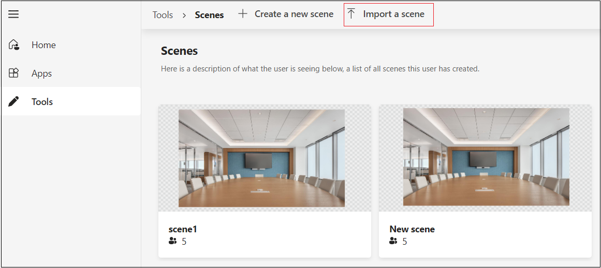

# <a name="custom-together-mode-scenes-in-teams"></a>Cenas personalizadas no Modo Conferência no Teams

As cenas personalizadas do Modo Conferência no Microsoft Teams fornecem um ambiente de reunião imersivo e envolvente com as seguintes ações:

* Reunir pessoas e incentivá-las a ativar seu vídeo.
* Combinar os participantes digitalmente em uma única cena virtual.
* Colocar os fluxos de vídeo dos participantes em assentos pré-determinados projetados e corrigidos pelo criador da cena.

Em cenas personalizadas do Modo Conferência, a cena é um artefato. A cena é criada pelo desenvolvedor de cena usando o estúdio do Microsoft Scene. Em uma configuração de cena concebida, os participantes têm assentos com fluxos de vídeo. Os vídeos são renderizados nesses assentos. Somente aplicativos de cena são recomendados, pois a experiência para esses aplicativos é clara.

O processo a seguir fornece uma visão geral para criar um aplicativo somente de cena:

:::image type="content" source="../assets/images/apps-in-meetings/create-together-mode-scene-flow.png" alt-text="Criar aplicativos específicos para cada cenário":::

Um aplicativo somente de cena ainda é um aplicativo no Teams. O estúdio Scene lida com a criação do pacote de aplicativos em segundo plano. Várias cenas em um único pacote de aplicativos aparecem como uma lista simples para os usuários.

> [!NOTE]
> Os usuários não podem iniciar o Modo Conferência no celular. No entanto, depois que um usuário ingressar em uma reunião por meio de dispositivo móvel e o Modo Conferência for ligado da área de trabalho, os usuários móveis que tenham ligado o vídeo aparecerão no Modo Conferência na área de trabalho.

## <a name="prerequisites"></a>Pré-requisitos

Você deve ter uma compreensão básica do seguinte para usar cenas personalizadas do Modo Conferência:

* Defina cena e assentos em uma cena.
* Tenha uma conta do Desenvolvedor Microsoft e familiarize-se com o [Portal do Desenvolvedor](../concepts/build-and-test/teams-developer-portal.md) do Teams e do App Studio.
* Entenda o [conceito de sideload de aplicativo](../concepts/deploy-and-publish/apps-upload.md).
* Verifique se o Administrador concedeu permissão para [**Carregar um aplicativo personalizado**](../concepts/deploy-and-publish/apps-upload.md) e selecionar todos os filtros como parte das políticas de Configuração de Aplicativo e Reunião, respectivamente.

## <a name="best-practices"></a>Práticas recomendadas

Considere as seguintes práticas para uma experiência de construção de cena:

* Certifique-se de que todas as imagens estão no formato PNG.
* Certifique-se de que o pacote final com todas as imagens reunidas não exceda a resolução 1920x1080. A resolução é um número par. Essa resolução é um requisito para que as cenas sejam mostradas com êxito.
* Certifique-se de que o tamanho máximo da cena é de 10 MB.
* Certifique-se de que o tamanho máximo de cada imagem é de 5 MB. Uma cena é uma coleção de várias imagens. O limite é para cada imagem individual.
* Certifique-se de selecionar **Transparente** conforme necessário. Essa caixa de seleção está disponível no painel direito quando uma imagem é selecionada. As imagens sobrepostas devem ser marcadas como **Transparentes** para indicar que estão sobrepondo imagens na cena.

## <a name="build-a-scene-using-the-scene-studio"></a>Criar uma cena usando o estúdio Scene

A Microsoft tem um estúdio Scene que permite que você crie cenas. Ele está disponível no [Editor de Cenas - Portal do Desenvolvedor Teams](https://dev.teams.microsoft.com/scenes). Este documento se refere ao estúdio Scene no Portal do Desenvolvedor do Teams. A interface e as funcionalidades são todas iguais no Designer de Cena do App Studio.

Uma cena no contexto do estúdio Scene é um artefato que contém os seguintes elementos:

* Assentos reservados para organizadores de reunião e apresentadores de reunião. O apresentador não se refere ao usuário que está compartilhando ativamente. Refere-se à [função de reunião](https://support.microsoft.com/office/roles-in-a-teams-meeting-c16fa7d0-1666-4dde-8686-0a0bfe16e019).

* Assento e imagem para cada participante com largura e altura ajustáveis. Somente o formato PNG é suportado para a imagem.

* Coordenadas XYZ de todos os assentos e imagens.

* Coleção de imagens que são camufladas como uma imagem.

A imagem a seguir mostra cada assento representado como um avatar para a criação das cenas:


Para criar uma cena usando o estúdio Scene, siga estas etapas:

1. Vá para [Editor de Cenas - Portal do Desenvolvedor Teams](https://dev.teams.microsoft.com/scenes).

    Como alternativa, para abrir o estúdio Scene, você pode ir para a página inicial do [Portal do Desenvolvedor Teams](https://dev.teams.microsoft.com/home):
    * Selecione **Criar cenas personalizadas para reuniões**.
    * Selecione **Ferramentas** na seção à esquerda e selecione **estúdio Scene** na seção **Ferramentas**.

1. No **Editor de Cenas,** selecione **Criar uma nova cena**.

1. Em **Nome da Cena,** insira um nome para a cena.

    * Você pode selecionar **Fechar** para alternar entre fechar ou reabrir o painel direito.
    * Você pode ampliar ou diminuir a cena usando a barra de zoom para uma melhor exibição da cena.

1. Selecione **Adicionar imagens** para adicionar a imagem ao ambiente:

   :::image type="content" source="../assets/images/apps-in-meetings/addimages.png" alt-text="Adicionar imagens ao ambiente.":::

    >[!NOTE]
    >Você pode baixar os arquivos [SampleScene.zip](https://github.com/MicrosoftDocs/msteams-docs/tree/master/msteams-platform/apps-in-teams-meetings/SampleScene.zip) e [SampleApp.zip](https://github.com/MicrosoftDocs/msteams-docs/tree/master/msteams-platform/apps-in-teams-meetings/SampleApp.zip) com as imagens.

1. Selecione a imagem que você adicionou.

1. No painel direito, selecione um alinhamento para a imagem ou use **Redimensionar** para ajustar o tamanho da imagem:

    

1. Selecione uma área fora da imagem.

1. No canto superior direito, selecione **Participantes** em **Camadas**.

1. Selecione o número de participantes para a cena na caixa **Número de participantes** e selecione **Adicionar**. Depois que a cena é enviada, os posicionamentos de avatar são substituídos pelos fluxos de vídeo reais do participante. Você pode arrastar as imagens dos participantes ao redor da cena e posicioná-las na posição necessária. Você pode redimensioná-las usando a seta de redimensionamento.

1. Selecione qualquer imagem de participante e selecione **Atribuir Local** para atribuir o local ao participante.

1. Selecione **Organizador da Reunião** ou a função **Apresentador** para o participante. Em uma reunião, um participante deve ter a função de organizador da reunião:

   :::image type="content" source="../assets/images/apps-in-meetings/assign-spot.png" alt-text="Atribuir um local ao participante.":::

1. Selecione **Salvar** e selecione **Exibir no Teams** para testar rapidamente sua cena no Teams.

    * Selecionar **Exibir no Teams** cria automaticamente um aplicativo Teams que pode ser exibido na página **Aplicativos** no Portal do Desenvolvedor do Teams.
    * Selecionar **Exibir no Teams** cria automaticamente um pacote de aplicativos que é appmanifest.json por trás da cena. Você pode acessar **Aplicativos** no menu e acessar o pacote de aplicativos criado automaticamente.
    * Para excluir uma cena criada, selecione **Excluir cena** na barra superior.

1. Em **Exibir no Teams**, selecione **Visualizar no Teams**.
1. Na caixa de diálogo exibida, selecione **Adicionar**.

    A cena é testada ou acessada criando uma reunião de teste e iniciando cenas personalizadas do Modo Conferência. Para obter mais informações, consulte [ativar cenas personalizadas do Modo Conferência:](#activate-custom-together-mode-scenes)

    

    Em seguida, a cena pode ser exibida na galeria de cenas personalizadas do Modo Conferência.

Opcionalmente, você pode selecionar **Compartilhar** no menu suspenso **Salvar**. Você pode criar um link compartilhável para distribuir suas cenas para outras pessoas usarem. O usuário pode abrir o link para instalar a cena e começar a usá-la.

Após a visualização, a cena é enviada como um aplicativo para o Teams seguindo as etapas para envio do aplicativo. Esta etapa requer o pacote do aplicativo. O pacote do aplicativo é diferente do pacote de cena, para a cena que foi projetada. O pacote de aplicativos criado automaticamente é encontrado na seção **Aplicativos** no Centro de Desenvolvedores Teams.

Opcionalmente, o pacote de cena é recuperado selecionando **Exportar** no menu suspenso **Salvar**. Um arquivo .zip, que é o pacote de cena, é baixado. O pacote de cena inclui um scene.json e os ativos PNG usados para criar uma cena. O pacote de cena é revisado para incorporar outras alterações:


Uma cena complexa que usa o eixo Z é demonstrada no exemplo de introdução passo a passo.

## <a name="sample-scenejson"></a>Exemplo de scene.json

Scene.json juntamente com as imagens indicam a posição exata dos assentos. Uma cena consiste em imagens bitmap, sprites e retângulos para colocar vídeos de participantes. Esses sprites e caixas de participantes são definidos em um sistema de coordenadas do mundo. O eixo X aponta para a direita e o eixo Y aponta para baixo.

As cenas personalizadas do Modo Conferência suportam o zoom nos participantes atuais. Esse recurso é útil para pequenas reuniões em uma cena grande. Um sprite é uma imagem de bitmap estática posicionada no mundo. O valor Z do sprite determina a posição do sprite. A renderização começa com o sprite com o menor valor Z, portanto, o valor Z mais alto significa que está mais próximo da câmera. Cada participante tem seu próprio feed de vídeo, que é segmentado para que apenas o primeiro plano seja renderizado.

O código a seguir é o exemplo scene.json:

```json
{
   "protocolVersion": "1.0",
   "id": "A",
   "autoZoom": true,
   "mirrorParticipants ": true,
   "extent":{
      "left":0.0,
      "top":0.0,
      "width":16.0,
      "height":9.0
   },
   "sprites":[
      {
         "filename":"background.png",
         "cx":8.0,
         "cy":4.5,
         "width":16.0,
         "height":9.0,
         "zOrder":0.0,
   "isAlpha":false
      },
      {
         "filename":"table.png",
         "cx":8.0,
         "cy":7.0,
         "width":12.0,
         "height":4.0,
         "zOrder":3.0,
   "isAlpha":true
      },
      {
         "filename":"row0.png",
         "cx":12.0,
         "cy":15.0,
         "width":8.0,
         "height":4.0,
         "zOrder":2.0,
   "isAlpha":true
      }

   ],
   "participants":[
      {
         "cx":5.0,
         "cy":4.0,
         "width":4.0,
         "height":2.25,
         "zOrder":1.0,
         "seatingOrder":0
      },
      {
         "cx":11.0,
         "cy":4.0,
         "width":4.0,
         "height":2.25,
         "zOrder":1.0,
         "seatingOrder":1
      }
   ]
}
```

Cada cena tem uma ID e um nome exclusivos. A cena JSON também contém informações sobre todos os ativos usados para a cena. Cada ativo contém um nome de arquivo, largura, altura e posição no eixo X e Y. Da mesma forma, cada assento contém uma ID de assento, largura, altura e posição no eixo X e Y. A ordem de assento é gerada automaticamente e é alterada de acordo com a preferência. O número da ordem de assento corresponde à ordem de pessoas que ingressaram na chamada.

O `zOrder` representa a ordem de colocação de imagens e assentos ao longo do eixo Z. Ele dá uma noção de profundidade ou partição, se necessário. Consulte o exemplo passo a passo de início. O exemplo usa o `zOrder`.

Agora que você já passou pelo exemplo scene.json, você pode ativar as cenas personalizadas do Modo Conferência para participar de cenas.

## <a name="activate-custom-together-mode-scenes"></a>Ativar cenas personalizadas do Modo Conferência

Obter mais informações sobre como um usuário se envolve com cenas em cenas personalizadas do Modo Conferência.

Para selecionar cenas e ativar cenas personalizadas do Modo Conferência, siga estas etapas:

1. Crie uma nova reunião de teste.

    >[!NOTE]
    > Ao selecionar **Visualização** no estúdio Scene, a cena é instalada como um aplicativo no Teams. Este é o modelo para um desenvolvedor testar e experimentar cenas do estúdio Scene. Depois que uma cena é enviada como um aplicativo, os usuários veem essas cenas na galeria de cena.

1. No menu suspenso **Galeria** no canto superior esquerdo, selecione **Modo Conferência**. A caixa de diálogo **Seletor** é exibida e a cena adicionada está disponível.

1. Selecione **Alterar cena** para alterar a cena padrão.

1. Na **Galeria de Cena,** selecione a cena que você deseja usar para sua reunião.

    Opcionalmente, o organizador da reunião e o apresentador podem **Alterar a cena para todos os participantes** da reunião.

    >[!NOTE]
    > A qualquer momento, apenas uma cena é usada de forma homogênea para a reunião. Se um apresentador ou organizador alterar uma cena, ela mudará para todos. Alternar para dentro ou fora de cenas personalizadas do Modo Conferência é decisão dos participantes individuais, mas enquanto estiverem em cenas personalizadas do Modo Conferência, todos os participantes têm a mesma cena.

1. Selecione **Aplicar**. O Teams instala o aplicativo para o usuário e aplica a cena.

## <a name="open-a-custom-together-mode-scenes-scene-package"></a>Abrir um pacote de cenas personalizadas de Modo Conferência

Você pode compartilhar o Pacote de Cena que é um arquivo .zip recuperado do estúdio Scene para outros criadores para aprimorar ainda mais a cena. A funcionalidade **Importar uma Cena** ajuda a desembrulhar um pacote de cena para permitir que o criador continue criando a cena.



## <a name="see-also"></a>Confira também

* [Aplicativos para reuniões do Teams](teams-apps-in-meetings.md)
* [Bots de chamadas e reuniões](~/bots/calls-and-meetings/calls-meetings-bots-overview.md)
* [Chamadas de mídia em tempo real e reuniões com Microsoft Teams](~/bots/calls-and-meetings/real-time-media-concepts.md)
