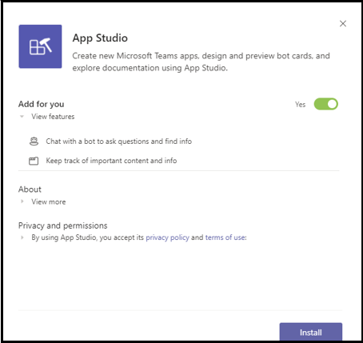
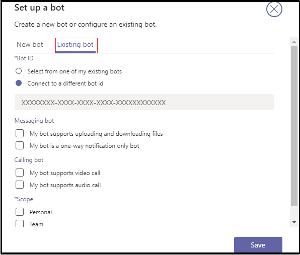

# <a name="add-power-virtual-agents-chatbot"></a>Adicionar um chatbot de Agentes Virtuais de Energia 

Power Virtual Agents é uma solução de interface gráfica sem código guiada que capacita todos os membros da sua equipe a criar chatbots ricos e conversacionais que se integram facilmente à plataforma Teams. Todo o conteúdo Power Virtual Agents renderiza naturalmente em Teams. Power Virtual Agents bots se envolvem com usuários na tela Teams de chat nativa. Os administradores de TI, analistas de negócios, especialistas em domínio e desenvolvedores de aplicativos qualificados podem projetar, desenvolver e publicar agentes virtuais inteligentes para Teams sem precisar configurar um ambiente de desenvolvimento. Eles podem criar um serviço Web ou se registrar diretamente com a Estrutura de Bots. 

Este documento orienta você sobre como disponibilizar seu chatbot no Teams por meio do portal Power Virtual Agents e adicionar seu bot ao Teams usando o App Studio. 

Power Virtual Agents permite criar chatbots poderosos que podem responder a perguntas feitas por seus clientes, outros funcionários ou visitantes do seu site ou serviço.

Esses bots podem ser criados facilmente sem a necessidade de desenvolvedores ou desenvolvedores de dados.

> [!NOTE]
> Ao adicionar seu chatbot ao Microsoft Teams, alguns dos dados, como conteúdo de bot e conteúdo de chat do usuário, são compartilhados com Microsoft Teams. Isso significa que seus dados fluem fora da conformidade da sua organização e dos limites [geográficos ou regionais.](/power-virtual-agents/data-location) <br/>

## <a name="make-your-chatbot-available-in-teams-through-the-power-virtual-agents-portal"></a>Disponibilizar seu chatbot no Teams por meio do portal Power Virtual Agents site

Para disponibilizar seu chatbot no Teams por meio do portal Power Virtual Agents, execute as seguintes etapas de processo:

**Para disponibilizar o chatbot no Teams**

1. **Publicar o conteúdo de bot mais recente**  
Depois de criar um chatbot no portal Power Virtual Agents, você deve publicar seu bot antes Teams os usuários possam interagir com ele. Para obter mais informações, consulte [Publicar o conteúdo de bot mais recente.](/power-virtual-agents/publication-fundamentals-publish-channels#publish-the-latest-bot-content)

   

1. **Configurar o Teams canal**  
Depois de publicar seu bot, adicione o canal Teams para disponibilizar o bot para Teams usuários.

   

1. **Gerar uma ID de aplicativo para seu chatbot**  
Depois de adicionar o Teams ao chatbot, uma **ID de** aplicativo é gerada na caixa de diálogo. A ID do aplicativo é um identificador gerado pela Microsoft exclusivo para seu bot. Salve a ID do aplicativo para criar um pacote de aplicativos para Teams.

## <a name="add-your-bot-to-teams-using-app-studio"></a>Adicionar seu bot ao Teams usando o App Studio

Se [o carregamento de aplicativos](/microsoftteams/admin-settings) personalizados estiver habilitado em sua instância Teams, você poderá usar Teams App Studio para carregar diretamente seu chatbot e começar a usá-lo imediatamente. Para compartilhar seu chatbot, você pode solicitar que o administrador disponibilizar seu bot no catálogo de aplicativos de locatário ou pode enviar seu pacote de aplicativos para outras pessoas e pedir que eles o carreguem independentemente.

1. **Instalar o App Studio no Teams**  
App Studio é um Teams aplicativo. Instale o App Studio no Teams que simplifica o processo de criação e registro de bots Teams: 

   1. Selecione o ícone da loja de aplicativos Teams instância e pesquise **App Studio**.

      &emsp;&emsp;    

   1. Selecione o **grupo App Studio** e selecione **Instalar** na caixa de diálogo pop-up.

      &emsp;&emsp; 

1. **Criar o Teams de aplicativo no App Studio**  
Bots no Teams são definidos por um arquivo JSON de manifesto de aplicativo que fornece as informações básicas sobre seu bot e seus recursos. No **App Studio,** selecione **Editor de manifesto** e selecione Criar um novo **aplicativo.**

    

1. **Adicionar detalhes do bot**  
Conclua todos os campos necessários. Para uma descrição completa de cada campo, consulte [definição de esquema de manifesto](../../resources/schema/manifest-schema.md).

    

1. **Configurar seu bot** Para configurar o bot, execute as seguintes etapas: 
     1. Abra a **guia Bots.** 
     1. Selecione **Configurar**  >  **bot existente** e insira o nome do bot.

    

   A imagem a seguir mostra como configurar um bot existente:      

   
       
1. **Adicionar sua ID do aplicativo**  
Para adicionar a ID do aplicativo, execute as seguintes etapas:  
    1. Selecione **Conexão para uma id de bot diferente** e colar a **ID do aplicativo** que você copiou anteriormente. 
    1. Selecione **Salvar**  >  **Pessoal de**  >  **Escopo**.

    

1. **Adicionar domínios válidos para seu bot**  
Esta etapa só será necessária se o bot exigir que o usuário entre. Selecione **Domínios e permissões** e, no campo **Domínios Válidos,** forneça a seguinte entrada:

    ```bash
       token.botframework.com
    ```

1. **Testar e distribuir seu bot**  
Abra **a guia Testar e distribua** e selecione **Instalar** para adicionar seu bot diretamente à sua Teams instância. Como alternativa, você pode baixar o pacote de aplicativos concluído para compartilhar com Teams usuários ou fornecer ao administrador para disponibilizar seu bot no catálogo de aplicativos de locatário.

1. **Iniciar um chat**   
O processo de configuração para adicionar seu Power Virtual Agents de chat ao Teams está concluído. Agora você pode iniciar uma conversa com seu bot em um chat pessoal.

## <a name="see-also"></a>Confira também

* [Agentes virtuais do Power](/power-virtual-agents/fundamentals-what-is-power-virtual-agents)  
* [Crie um chatbot para Teams com o Microsoft Power Virtual Agents](../bot-features.md#bots-with-power-virtual-agents).  
* [Power Virtual Agents portal](https://powervirtualagents.microsoft.com)
* [Publicar seu Power Virtual Agents bot](/power-virtual-agents/publication-fundamentals-publish-channels)
* [Segurança e conformidade em Microsoft Teams](/MicrosoftTeams/security-compliance-overview).

## <a name="next-step"></a>Próxima etapa

> [!div class="nextstepaction"]
> [Criar um assistente virtual](~/samples/virtual-assistant.md)
