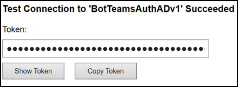

# <a name="add-authentication-to-your-teams-bot"></a>Adicionar autenticação ao bot do Microsoft Teams

Há ocasiões em que você pode precisar criar bots no Microsoft Teams que podem acessar recursos em nome do usuário, como um serviço de email.

Este artigo demonstra como usar a autenticação do SDK do Azure bot Service v4, com base no OAuth 2,0. Isso facilita o desenvolvimento de um bot que pode usar tokens de autenticação com base nas credenciais do usuário. A chave é o uso de provedores de **identidade**, como veremos mais tarde.

O OAuth 2,0 é um padrão aberto para autenticação e autorização usados pelo Azure Active Directory (Azure AD) e muitos outros provedores de identidade. Uma compreensão básica do OAuth 2,0 é um pré-requisito para trabalhar com autenticação no Microsoft Teams.

Consulte [OAuth 2 simplificado](https://aka.ms/oauth2-simplified) para obter uma compreensão básica e o [OAuth 2,0](https://oauth.net/2/) para a especificação completa.

Para obter mais informações sobre como o serviço de bot do Azure trata a autenticação, confira [autenticação do usuário em uma conversa](https://aka.ms/azure-bot-authentication).

Neste artigo, você aprenderá:

- **Como criar um bot habilitado para autenticação**. Você usará o [cs-auth-Sample][teams-auth-bot-cs] para lidar com as credenciais de entrada do usuário e a geração do token de autenticação.
- **Como implantar o bot no Azure e associá-lo a um provedor de identidade**. O provedor emite um token com base nas credenciais de entrada do usuário. O bot pode usar o token para acessar recursos, como um serviço de email, que requer autenticação. Para obter mais informações, consulte  [Microsoft Teams Authentication Flow for bots](auth-flow-bot.md).
- **Como integrar o bot no Microsoft Teams**. Após a integração do bot, você poderá entrar e trocar mensagens com ela em um chat.

## <a name="prerequisites"></a>Pré-requisitos

- Conhecimento das [noções básicas de bot][concept-basics], [Gerenciamento de estado][concept-state], a biblioteca de [caixas de diálogo][concept-dialogs]e como implementar o [fluxo de conversa seqüencial][simple-dialog].
- Conhecimento sobre o desenvolvimento do Azure e do OAuth 2,0.
- As versões atuais do Visual Studio e git.
- Conta do Azure. Se necessário, você pode criar uma [conta gratuita do Azure](https://azure.microsoft.com/free/).
- O exemplo a seguir.

    | Amostra | Versão do BotBuilder | Demonstra |
    |:---|:---:|:---|
    | **Autenticação de bot** no [cs-auth-Sample][teams-auth-bot-cs] | V4 | Suporte do OAuthCard |
    | **Autenticação de bot** no [js-auth-Sample][teams-auth-bot-js] | V4| Suporte do OAuthCard  |
    | **Autenticação de bot** no [py-auth-Sample][teams-auth-bot-py] | V4 | Suporte do OAuthCard |

## <a name="create-the-resource-group"></a>Criar o grupo de recursos

O grupo de recursos e o plano de serviço não são estritamente necessários, mas permitem que você libere convenientemente os recursos que você criou. Essa é uma boa prática para manter seus recursos organizados e gerenciáveis.

Você usa um grupo de recursos para criar recursos individuais para a estrutura de bot. Para desempenho, verifique se esses recursos estão localizados na mesma região do Azure.

1. No seu navegador, entre no [**portal do Azure**][azure-portal].
1. No painel de navegação esquerdo, selecione **grupos de recursos**.
1. Na parte superior esquerda da janela exibida, selecione a guia **Adicionar** para criar um novo grupo de recursos. Você será solicitado a fornecer o seguinte:
    1. **Assinatura**. Use sua assinatura existente.
    1. **Grupo de recursos**. Insira o nome do grupo de recursos. Um exemplo poderia ser  *TeamsResourceGroup*. Lembre-se de que o nome deve ser exclusivo.
    1. No menu suspenso **região** , selecione *oeste dos EUA*ou uma região perto de seus aplicativos.
    1. Selecione o botão **revisar e criar** . Você verá uma faixa que lê a *validação aprovada*.
    1. Selecione o botão **criar** . Pode levar alguns minutos para criar o grupo de recursos.

> [!TIP]
> Da mesma forma que os recursos que você criará posteriormente neste tutorial, é uma boa ideia fixar esse grupo de recursos no painel para facilitar o acesso. Se quiser fazer isso, selecione o ícone de PIN & # 128204; no canto superior direito do painel.

## <a name="create-the-service-plan"></a>Criar o plano de serviço

1. No [**portal do Azure**][azure-portal], no painel de navegação à esquerda, selecione **criar um recurso**.
1. Na caixa de pesquisa, digite *plano de serviço de aplicativo*. Selecione o cartão de **plano do serviço de aplicativo** nos resultados da pesquisa.
1. Selecione **Criar**.
1. Você será solicitado a fornecer as seguintes informações:
    1. **Assinatura**. Você pode usar uma assinatura existente.
    1. **Grupo de recursos**. Selecione o grupo que você criou anteriormente.
    1. **Nome**. Insira o nome do plano de serviço. Um exemplo poderia ser  *TeamsServicePlan*. Lembre-se de que o nome deve ser exclusivo no grupo.
    1. **Sistema operacional**. Selecione *Windows* ou seu sistema operacional aplicável.
    1. **Região**. Selecione *oeste dos EUA* ou uma região perto de seus aplicativos.
    1. **Camada de preços**. Verifique se *S1 padrão* está selecionado. Este deve ser o valor padrão.
    1. Selecione o botão **revisar e criar** . Você verá uma faixa que lê a *validação aprovada*.
    1. Selecione **Criar**. Pode levar alguns minutos para criar o plano de serviço de aplicativo. O plano será listado no grupo de recursos.

## <a name="create-the-bot-channels-registration"></a>Criar o registro de canais de bot

O registro de canais de bot registra seu serviço Web como um bot com a estrutura de bot, desde que você tenha uma ID de aplicativo da Microsoft e uma senha de aplicativo (segredo do cliente).

> [!IMPORTANT]
> Você só precisa registrar seu bot se ele não estiver hospedado no Azure. Se você [criou um bot](/azure/bot-service/abs-quickstart?view=azure-bot-service-4.0&viewFallbackFrom=azure-bot-service-3.0&preserve-view=true) por meio do portal do Azure, ele já está registrado com o serviço. Se você criou o bot por meio da [estrutura de bot](https://dev.botframework.com/bots/new) ou [AppStudio](~/concepts/build-and-test/app-studio-overview.md) seu bot não está registrado no Azure.

[!INCLUDE [bot channels registration steps](~/includes/bots/azure-bot-channels-registration.md)]

> [!NOTE]
> O recurso de registro de canais de bot mostrará a região **global** , mesmo se você selecionar oeste dos EUA. Isso é esperado.

Para obter mais informações, consulte [Create a bot for Teams](../create-a-bot-for-teams.md).

## <a name="create-the-identity-provider"></a>Criar o provedor de identidade

Você precisa de um provedor de identidade que possa ser usado para autenticação.
Neste procedimento, você usará um provedor do Azure AD; outros provedores de identidade compatíveis com o Azure AD também podem ser usados.

1. No [**portal do Azure**][azure-portal], no painel de navegação à esquerda, selecione **Azure Active Directory**.
    > [!TIP]
    > Você precisará criar e registrar esse recurso do Azure AD em um locatário no qual você pode concordar em delegar permissões solicitadas por um aplicativo.
    > Para obter instruções sobre como criar um locatário, confira [acessar o portal e criar um locatário](/azure/active-directory/fundamentals/active-directory-access-create-new-tenant).
1. No painel esquerdo, selecione **registros de aplicativo**.
1. No painel direito, selecione a guia **novo registro** , no canto superior esquerdo.
1. Você será solicitado a fornecer as seguintes informações:
   1. **Nome**. Insira o nome do aplicativo. Um exemplo poderia ser  *BotTeamsIdentity*. Lembre-se de que o nome deve ser exclusivo.
   1. Selecione os **tipos de conta com suporte** para o seu aplicativo. Selecione *contas em qualquer diretório organizacional (qualquer diretório do Azure ad-multilocatário) e contas pessoais da Microsoft (por exemplo, Skype, Xbox)*.
   1. Para o **URI de redirecionamento**:<br/>
       &#x2713;selecione **Web**. <br/>
       &#x2713; definir a URL como `https://token.botframework.com/.auth/web/redirect` .
   1. Selecione **Registrar**.

1. Depois que ele for criado, o Azure exibirá a página **visão geral** do aplicativo. Copie e salve as seguintes informações em um arquivo:

    1. O valor da **ID do aplicativo (cliente)** . Você usará esse valor mais tarde como a *ID do cliente* ao registrar esse aplicativo de identidade do Azure no bot.
    1. O valor da **ID do diretório (locatário)** . Você também usará esse valor mais tarde como a *ID de locatário* para registrar esse aplicativo de identidade do Azure no bot.

1. No painel esquerdo, selecione **certificados & segredos** para criar um segredo do cliente para seu aplicativo.

   1. Em **segredos do cliente**, selecione &#x2795; **novo segredo do cliente**.
   1. Adicione uma descrição para identificar esse segredo de outras pessoas que você talvez precise criar para esse aplicativo, como o *aplicativo de identidade de bot no Microsoft Teams*.
   1. Definir **expira** para sua seleção.
   1. Clique em **Adicionar**.
   1. Antes de sair desta página, **Registre o segredo**. Você usará esse valor mais tarde como o _segredo do cliente_ quando registrar seu aplicativo do Azure AD com o bot.

### <a name="configure-the-identity-provider-connection-and-register-it-with-the-bot"></a>Configurar a conexão do provedor de identidade e registrá-la com o bot

Observação: há duas opções para os provedores de serviços aqui-Azure AD v1 e Azure AD v2.  As diferenças entre os dois provedores são resumidas [aqui](https://docs.microsoft.com/azure/active-directory/azuread-dev/azure-ad-endpoint-comparison), mas em geral, o v2 fornece mais flexibilidade com relação à alteração das permissões de bot.  As permissões de API do Graph estão listadas no campo escopos, e à medida que novas são adicionadas, os bots permitirão que os usuários concordem nas novas permissões na próxima entrada.  Para o v1, o consentimento de bot deve ser excluído pelo usuário para novas permissões a serem solicitadas na caixa de diálogo do OAuth. 

#### <a name="azure-ad-v1"></a>Azure AD v1

1. No [**portal do Azure**][azure-portal], selecione o grupo de recursos no painel.
1. Selecione o link de registro do canal do bot.
1. Na página recurso, selecione **configurações**.
1. Em **configurações de conexão OAuth** próximo à parte inferior da página, selecione **Adicionar configuração**.
1. Preencha o formulário de acordo com as instruções a seguir:

    1. **Nome**. Insira um nome para a conexão. Você usará esse nome no bot no `appsettings.json` arquivo. Por exemplo *BotTeamsAuthADv1*.
    1. **Provedor de serviços**. Selecione **Azure Active Directory**. Depois que você selecionar isso, os campos específicos do Azure AD serão exibidos.
    1. **ID do cliente**. Insira a ID do aplicativo (cliente) que você registrou para seu aplicativo do provedor de identidade do Azure nas etapas acima.
    1. **Segredo do cliente**. Insira o segredo que você gravou para seu aplicativo do provedor de identidade do Azure nas etapas acima.
    1. **Tipo de concessão**. Inserir `authorization_code` .
    1. **URL de logon**. Inserir `https://login.microsoftonline.com` .
    1. **ID do locatário**, digite a **ID do diretório (locatário)** registrada anteriormente para seu aplicativo de identidade do Azure ou **comum** , dependendo do tipo de conta com suporte selecionado quando você criou o aplicativo do provedor de identidade. Para decidir qual o valor a ser atribuído siga estes critérios:

        - Se você selecionou *contas nesse diretório organizacional apenas (Microsoft somente um locatário)* ou *contas em qualquer diretório organizacional (Microsoft AAD Directory-multilocatário)* , insira a **ID do locatário** que você gravou anteriormente para o aplicativo AAD. Este será o locatário associado aos usuários que podem ser autenticados.

        - Se você selecionou *contas em qualquer diretório organizacional (qualquer usuário do AAD-multilocatário e contas pessoais da Microsoft, por exemplo, Skype, Xbox, Outlook)* , insira a palavra **comum** em vez de uma ID de locatário. Caso contrário, o aplicativo AAD verificará o locatário cuja ID foi selecionada e excluirá contas pessoais da Microsoft.

    0. Para **URL de recurso**, insira `https://graph.microsoft.com/` . Isso não é usado no exemplo de código atual.  
    i. Deixe **escopos** em branco. A imagem a seguir é um exemplo:

    

1. Clique em **Salvar**.

#### <a name="azure-ad-v2"></a>Azure AD v2

1. No [**portal do Azure**][azure-portal], selecione o grupo de recursos no painel.
1. Selecione o link de registro do canal do bot.
1. Na página recurso, selecione **configurações**.
1. Em **configurações de conexão OAuth** próximo à parte inferior da página, selecione **Adicionar configuração**.
1. Preencha o formulário de acordo com as instruções a seguir:

    1. **Nome**. Insira um nome para a conexão. Você usará esse nome no bot no `appsettings.json` arquivo. Por exemplo *BotTeamsAuthADv2*.
    1. **Provedor de serviços**. Selecione **Azure Active Directory v2**. Depois que você selecionar isso, os campos específicos do Azure AD serão exibidos.
    1. **ID do cliente**. Insira a ID do aplicativo (cliente) que você registrou para seu aplicativo do provedor de identidade do Azure nas etapas acima.
    1. **Segredo do cliente**. Insira o segredo que você gravou para seu aplicativo do provedor de identidade do Azure nas etapas acima.
    1. **URL do token do Exchange**. Deixe em branco.
    1. **ID do locatário**, digite a **ID do diretório (locatário)** registrada anteriormente para seu aplicativo de identidade do Azure ou **comum** , dependendo do tipo de conta com suporte selecionado quando você criou o aplicativo do provedor de identidade. Para decidir qual o valor a ser atribuído siga estes critérios:

        - Se você selecionou *contas nesse diretório organizacional apenas (Microsoft somente um locatário)* ou *contas em qualquer diretório organizacional (Microsoft AAD Directory-multilocatário)* , insira a **ID do locatário** que você gravou anteriormente para o aplicativo AAD. Este será o locatário associado aos usuários que podem ser autenticados.

        - Se você selecionou *contas em qualquer diretório organizacional (qualquer usuário do AAD-multilocatário e contas pessoais da Microsoft, por exemplo, Skype, Xbox, Outlook)* , insira a palavra **comum** em vez de uma ID de locatário. Caso contrário, o aplicativo AAD verificará o locatário cuja ID foi selecionada e excluirá contas pessoais da Microsoft.

    1. Para **escopos**, insira uma lista delimitada por espaço de permissões de gráfico que esse aplicativo requer por exemplo: user. Read User. ReadBasic. All mail. Read 

1. Clique em **Salvar**.

### <a name="test-the-connection"></a>Testar a conexão

1. Selecione a entrada de conexão para abrir a conexão que você acabou de criar.
1. Selecione **testar conexão** na parte superior do painel **configuração de conexão do provedor de serviços** .
1. Na primeira vez que você fizer isso, abrirá uma nova janela do navegador solicitando que você selecione uma conta. Selecione aquele que você deseja usar.
1. Em seguida, você será solicitado a permitir que o provedor de identidade use seus dados (credenciais). A imagem a seguir é um exemplo:

    

1. Selecione **aceitar**.
1. Isso deve ser redirecionado para uma **conexão de teste para uma página com \<your-connection-name> êxito** . Atualize a página se você receber um erro. A imagem a seguir é um exemplo:

  

O nome da conexão é usado pelo código do bot para recuperar os tokens de autenticação do usuário.

## <a name="prepare-the-bot-sample-code"></a>Preparar o código de exemplo de bot

Com as configurações preliminares concluídas, vamos nos concentrar na criação do bot a ser usado neste artigo.

# <a name="cnet"></a>[C#/.NET](#tab/dotnet)

1. Clone [cs-auth-Sample][teams-auth-bot-cs].
1. Inicie o Visual Studio.
1. Na barra de ferramentas **, selecione Arquivo-> Open-> Project/Solution** e abra o projeto bot.
1. Naappsettings.jsde atualização C# ** da** seguinte maneira:

    - Defina `ConnectionName` como o nome da conexão do provedor de identidade que você adicionou ao registro do canal de bot. O nome usado neste exemplo é *BotTeamsAuthADv1*.
    - Defina `MicrosoftAppId` como a **ID do aplicativo bot** que você salvou no momento do registro do canal de bot.
    - Defina `MicrosoftAppPassword` como o **segredo do cliente** que você salvou no momento do registro do canal do bot.
    - Defina o `ConnectionName` como o nome da conexão do provedor de identidade.

    Dependendo dos caracteres no seu segredo de bot, talvez seja necessário escapar da senha por XML. Por exemplo, qualquer e comercial (&) precisará ser codificado como `&amp;` .

     [!code-json[appsettings](~/../botbuilder-samples/samples/csharp_dotnetcore/46.teams-auth/appsettings.json?range=1-5)]

1. No Gerenciador de soluções, navegue até a `TeamsAppManifest` pasta, abra `manifest.json` e defina `id` e `botId` para o **ID do aplicativo bot** que você salvou no momento do registro do canal de bot.

# <a name="javascript"></a>[JavaScript](#tab/node-js)

1. [Nó clone-auth-Sample][teams-auth-bot-js].
1. Em um console, navegue até o projeto: </br></br>
`cd samples/javascript_nodejs/46.teams`  
1. Instalar módulos</br></br>
`npm install`
1. Atualize a configuração **. env** da seguinte maneira:

    - Defina `MicrosoftAppId` como a **ID do aplicativo bot** que você salvou no momento do registro do canal de bot.
    - Defina `MicrosoftAppPassword` como o **segredo do cliente** que você salvou no momento do registro do canal do bot.
    - Defina o `connectionName` como o nome da conexão do provedor de identidade.

    Dependendo dos caracteres no seu segredo de bot, talvez seja necessário escapar da senha por XML. Por exemplo, qualquer e comercial (&) precisará ser codificado como `&amp;` .

     [!code-javascript[settings](~/../botbuilder-samples/samples/javascript_nodejs/46.teams-auth/.env)]

1. Na `teamsAppManifest` pasta, abra `manifest.json` e defina `id`  como sua ID do aplicativo da **Microsoft** e `botId` para o **ID do aplicativo bot** que você salvou no momento do registro do canal de bot.

# <a name="python"></a>[Python](#tab/python)

1. Clone [py-auth-Sample][teams-auth-bot-py] no repositório do github.
1. Atualizar **config.py**:

    - Defina `ConnectionName` como o nome da configuração de conexão OAuth que você adicionou ao bot.
    - Defina `MicrosoftAppId` e `MicrosoftAppPassword` para a ID de aplicativo do bot e o segredo do aplicativo.

      Dependendo dos caracteres no seu segredo de bot, talvez seja necessário escapar da senha por XML. Por exemplo, qualquer e comercial (&) precisará ser codificado como `&amp;` .

      [!code-python[config](~/../botbuilder-samples/samples/python/46.teams-auth/config.py?range=14-16)]

---

### <a name="deploy-the-bot-to-azure"></a>Implantar o bot no Azure

Para implantar o bot, siga as etapas descritas em como [implantar seu bot no Azure](https://aka.ms/azure-bot-deployment-cli).

Como alternativa, enquanto no Visual Studio, você pode seguir estas etapas:

1. No Visual Studio *Solution Explorer* , selecione e segure (ou clique com o botão direito do mouse) o nome do projeto.
1. No menu suspenso, selecione **publicar**.
1. Na janela exibida, selecione o **novo** link.
1. Na janela de diálogo, selecione **serviço de aplicativo** à esquerda e **crie novo** à direita.
1. Selecione o botão **publicar** .
1. Na próxima janela de diálogo, insira as informações necessárias. Este é um exemplo:

   

1. Selecione **Criar**.
1. Se a implantação for concluída com êxito, você deverá vê-la refletida no Visual Studio. Além disso, uma página é exibida no navegador padrão dizendo que *o bot está pronto!*. A URL será semelhante a esta: `https://botteamsauth.azurewebsites.net/` . Salve-o em um arquivo.
1. No navegador, navegue até o [**portal do Azure**][azure-portal].
1. Verifique o grupo de recursos, o bot deve ser listado junto com os outros recursos. A imagem a seguir é um exemplo:

    

1. No grupo de recursos, selecione o nome de registro do canal de bot (link).
1. No painel esquerdo, selecione **configurações**.
1. Na caixa **ponto de extremidade de mensagens** , digite a URL obtida acima seguida por `api/messages` . Este é um exemplo: `https://botteamsauth.azurewebsites.net/api/messages` .
1. Selecione o botão **salvar** no canto superior esquerdo.

## <a name="test-the-bot-using-the-emulator"></a>Testar o bot usando o emulador

Se você ainda não tiver feito isso, instale o [emulador do Microsoft bot Framework](https://aka.ms/bot-framework-emulator-readme). Consulte também [depurar com o emulador](https://aka.ms/bot-framework-emulator-debug-with-emulator).

Para que o logon de exemplo de bot funcione, você deve configurar o emulador conforme mostrado abaixo.

### <a name="configure-the-emulator-for-authentication"></a>Configurar o emulador para autenticação

Se um bot exigir autenticação, você deve configurar o emulador conforme mostrado abaixo.

1. Inicie o emulador.
1. No emulador, selecione o ícone de engrenagem &#9881; na parte inferior esquerda ou a guia **configurações de emulador** no canto superior direito.
1. Marque a caixa de seleção **usar tokens de autenticação da versão 1,0**.
1. Insira o caminho local para a ferramenta **ngrok** . *Consulte* o ngrok [de integração de](https://github.com/Microsoft/BotFramework-Emulator/wiki/Tunneling-(ngrok))tunelamento/emulador da estrutura do bot. Para obter mais informações sobre a ferramenta, consulte [ngrok](https://ngrok.com/).
1. Marque a caixa de seleção **executar ngrok quando o emulador for iniciado**.
1. Selecione o botão **salvar** .

Quando o bot exibe um cartão de entrada e o usuário seleciona o botão de entrada, o emulador abre uma página que o usuário pode usar para entrar com o provedor de autenticação.
Depois que o usuário faz isso, o provedor gera um token de usuário e o envia ao bot. Depois, o bot pode agir em nome do usuário.

### <a name="test-the-bot-locally"></a>Testar o bot localmente

Depois de configurar o mecanismo de autenticação, você pode executar o teste de bot real.  

1. Execute o exemplo de bot localmente no seu computador, via Visual Studio por exemplo.
1. Inicie o emulador.
1. Selecione o botão **abrir bot** .
1. Na **URL do bot**, digite a URL local do bot. Normalmente, `http://localhost:3978/api/messages` .
1. Na **ID do aplicativo da Microsoft** , digite a ID do aplicativo do bot no `appsettings.json` .
1. Na **senha do aplicativo da Microsoft** , digite a senha do aplicativo do bot no `appsettings.json` .
1. Selecione **conectar**.
1. Depois que o bot estiver em funcionamento, insira qualquer texto para exibir o cartão de entrada.
1. Selecione o botão **entrar** .
1. É exibida uma caixa de diálogo pop-up para **confirmar a abertura da URL**. Isso é para permitir que o usuário do bot (você) seja autenticado.  
1. Selecione **Confirmar**.
1. Se for solicitado, selecione a conta do usuário aplicável.
1. Dependendo da configuração usada para o emulador, você receberá uma das seguintes opções:
    1. **Usando o código de verificação de entrada**  
      &#x2713; uma janela é aberta exibindo o código de validação.  
      &#x2713; Copie e insira o código de validação na caixa chat para concluir a entrada.
    1. **Usando tokens de autenticação**.  
      &#x2713; você está conectado com base em suas credenciais.

    A imagem a seguir é um exemplo da interface do usuário do bot após o logon:

    

1. Se você selecionar **Sim** quando o bot solicitar *que você deseja exibir seu token?*, você receberá uma resposta semelhante à seguinte:

    

1. Digite **logout** na caixa chat de entrada para sair. Isso libera o token de usuário e o bot não poderá atuar em seu nome até que você entre novamente.

> [!NOTE]
> A autenticação de bot requer o uso do **serviço do conector do bot**. O serviço acessa as informações de registro dos canais de bot para o bot.

## <a name="test-the-deployed-bot"></a>Testar o bot implantado

<!--There are several testing scenarios here. Ideally, we'd have a separate article on the what, why, 
and when for these, and just reference that from here, along with the set of steps that exercises the bot code.-->

1. No navegador, navegue até o [**portal do Azure**][azure-portal].
1. Encontre o grupo de recursos.
1. Selecione o link de recurso. A página de recursos é exibida.
1. Na página recurso, selecione **testar no chat da Web**. O bot é iniciado e exibe as saudações predefinidas.
1. Digite qualquer coisa na caixa chat.
1. Selecione a caixa **entrar** .
1. É exibida uma caixa de diálogo pop-up para **confirmar a abertura da URL**. Isso é para permitir que o usuário do bot (você) seja autenticado.  
1. Selecione **Confirmar**.
1. Se for solicitado, selecione a conta do usuário aplicável.
    A imagem a seguir é um exemplo da interface do usuário do bot após o logon:

    .

1. Selecione o botão **Sim** para exibir o token de autenticação. A imagem a seguir é um exemplo:

    .

1. Digite logout para sair.

    

> [!NOTE]
> Se você estiver tendo problemas para entrar, tente testar a conexão novamente, conforme descrito nas etapas anteriores. Isso pode recriar o token de autenticação.
> Com o cliente de chat da Web do bot Framework no Azure, talvez seja necessário entrar várias vezes antes de a autenticação ser estabelecida corretamente.

## <a name="install-and-test-the-bot-in-teams"></a>Instalar e testar o bot no Teams

1. No seu projeto bot, verifique se a `TeamsAppManifest` pasta contém o `manifest.json` junto com um `outline.png` e `color.png` arquivos.
1. No Gerenciador de soluções, navegue até a `TeamsAppManifest` pasta. Edit `manifest.json` atribuindo os seguintes valores:
    1. Certifique-se de que a **ID do aplicativo bot** recebida no momento do registro do canal de bot está atribuída a `id` e `botId` .
    1. Atribua este valor: `validDomains: [ "token.botframework.com" ]` .
1. Selecionar e **compactar** os `manifest.json` `outline.png` arquivos, e `color.png` .
1. Abra **o Microsoft Teams**.
1. No painel esquerdo, na parte inferior, selecione o **ícone aplicativos**.
1. No painel direito, na parte inferior, selecione **carregar um aplicativo personalizado**.
1. Navegue até a `TeamsAppManifest` pasta e carregue o manifesto zipado.
O seguinte assistente é exibido:

    

1. Selecione o botão **Adicionar a uma equipe** .
1. Na janela seguinte, selecione a equipe onde você deseja usar o bot.
1. Selecione o botão **configurar um bot** .
1. Selecione os três pontos (&#x25cf;&#x25cf;&#x25cf;) no painel esquerdo. Em seguida, selecione o ícone do **app Studio** .
1. Selecione a guia **Editor de manifesto** . Você deve ver o ícone do bot que você carregou.
1. Além disso, você deve ser capaz de ver o bot listado como um contato na lista de chat que você pode usar para trocar mensagens com o bot.

### <a name="testing-the-bot-locally-in-teams"></a>Testando o bot localmente no Teams

O Microsoft Teams é um produto totalmente baseado em nuvem, que exige que todos os serviços que ele acessa estejam disponíveis na nuvem usando pontos de extremidade HTTPS. Portanto, para permitir que o bot (nosso exemplo) funcione no Teams, você precisa publicar o código na nuvem de sua escolha ou tornar uma instância em execução local externamente acessível por meio de uma ferramenta de **encapsulamento** . Recomendamos o  [ngrok](https://ngrok.com/download), que cria uma URL endereçável externamente para uma porta que você abre localmente no seu computador.
Para configurar o ngrok em preparação para executar seu aplicativo do Microsoft Teams localmente, siga estas etapas:

1. Em uma janela de terminal, vá para o diretório onde você `ngrok.exe` instalou. Sugerimos definir o caminho da *variável de ambiente* para apontar para ele.
1. Executar, por exemplo, `ngrok http 3978 --host-header=localhost:3978` . Substitua o número da porta, conforme necessário.
Isso inicia o ngrok para escutar na porta que você especificar. Em retorno, ele fornece uma URL endereçável externamente, válida por enquanto o ngrok está em execução. A imagem a seguir é um exemplo:

    .

1. Copie o endereço HTTPS de encaminhamento. Ele deve ser semelhante ao seguinte: `https://dea822bf.ngrok.io/` .
1. Anexar `/api/messages` para obter `https://dea822bf.ngrok.io/api/messages` . Este é o **ponto de extremidade das mensagens** para o bot executado localmente em sua máquina e alcançável pela Web em um chat no Microsoft Teams.
1. Uma etapa final a ser executada é atualizar o ponto de extremidade das mensagens do bot implantado. No exemplo, implantamos o bot no Azure. Portanto, * * vamos executar estas etapas:
    1. No navegador, navegue até o [**portal do Azure**][azure-portal].
    1. Selecione o **registro do canal do bot**.
    1. No painel esquerdo, selecione **configurações**.
    1. No painel direito, na caixa **ponto de extremidade de mensagens** , digite a URL ngrok, no nosso exemplo, `https://dea822bf.ngrok.io/api/messages` .
1. Inicie seu bot localmente, por exemplo no modo de depuração do Visual Studio.
1. Teste o bot durante a execução local usando o **chat da Web de teste**do portal da estrutura de bot. Assim como o emulador, esse teste não permite acessar a funcionalidade específica da equipe.
1. Na janela do terminal onde `ngrok` o está sendo executado, você pode ver o tráfego http entre o bot e o cliente de chat da Web. Se você quiser um modo de exibição mais detalhado, em uma janela do navegador, insira- `http://127.0.0.1:4040` o na janela anterior do terminal. A imagem a seguir é um exemplo:

    .

> [!NOTE]
> Se você parar e reiniciar o ngrok, a URL será alterada. Para usar o ngrok em seu projeto e dependendo dos recursos que você está usando, você deve atualizar todas as referências de URL.
 

## <a name="additional-information"></a>Informações adicionais

### <a name="teamsappmanifestmanifestjson"></a>TeamsAppManifest/manifest.jsem

Este manifesto contém as informações necessárias para que o Microsoft Teams se conecte ao bot.  

```json
{
  "$schema": "https://developer.microsoft.com/json-schemas/teams/v1.7/MicrosoftTeams.schema.json",
  "manifestVersion": "1.5",
  "version": "1.0.0",
  "id": "",
  "packageName": "com.teams.auth.bot",
  "developer": {
    "name": "TeamsBotAuth",
    "websiteUrl": "https://www.microsoft.com",
    "privacyUrl": "https://www.teams.com/privacy",
    "termsOfUseUrl": "https://www.teams.com/termsofuse"
  },
  "icons": {
    "color": "color.png",
    "outline": "outline.png"
  },
  "name": {
    "short": "TeamsBotAuth",
    "full": "Teams Bot Authentication"
  },
  "description": {
    "short": "TeamsBotAuth",
    "full": "Teams Bot Authentication"
  },
  "accentColor": "#FFFFFF",
  "bots": [
    {
      "botId": "",
      "scopes": [
        "groupchat",
        "team"
      ],
      "supportsFiles": false,
      "isNotificationOnly": false
    }
  ],
  "permissions": [
    "identity",
    "messageTeamMembers"
  ],
  "validDomains": [ "token.botframework.com" ]
}
```

Com a autenticação, o Microsoft Teams se comporta de forma ligeiramente diferente de outros canais, conforme explicado abaixo.

### <a name="handling-invoke-activity"></a>Tratamento da atividade de invocação

Uma **atividade de invocação** é enviada ao bot em vez da atividade de evento usada por outros canais.
Isso é feito com a subclasse de **ActivityHandler**.

# <a name="cnet"></a>[C#/.NET](#tab/dotnet-sample)

**Bots/DialogBot. cs**

[!code-csharp[ActivityHandler](~/../botbuilder-samples/samples/csharp_dotnetcore/46.teams-auth/Bots/DialogBot.cs?range=19-51)]

**Bots/TeamsBot. cs**

A *atividade chamar* deve ser encaminhada para a caixa de diálogo se o **OAuthPrompt** for usado.

[!code-csharp[ActivityHandler](~/../botbuilder-samples/samples/csharp_dotnetcore/46.teams-auth/Bots/TeamsBot.cs?range=34-42)]

#### <a name="teamsactivityhandlercs"></a>TeamsActivityHandler.cs

```csharp

protected virtual Task OnInvokeActivityAsync(ITurnContext<IInvokeActivity> turnContext, CancellationToken cancellationToken)
{
    switch (turnContext.Activity.Name)
    {
        case "signin/verifyState":
            return OnSigninVerifyStateAsync(turnContext, cancellationToken);

        default:
            return Task.CompletedTask;
    }
}

protected virtual Task OnSigninVerifyStateAsync(ITurnContext<IInvokeActivity> turnContext, CancellationToken cancellationToken)
{
    return Task.CompletedTask;
}
```

# <a name="javascript"></a>[JavaScript](#tab/node-js-dialog-sample)

**bots/dialogBot.js**

[!code-javascript[ActivityHandler](~/../botbuilder-samples/samples/javascript_nodejs/46.teams-auth/bots/dialogBot.js?range=4-46)]

**bots/teamsBot.js**

A *atividade chamar* deve ser encaminhada para a caixa de diálogo se o **OAuthPrompt** for usado.

[!code-javascript[ActivityHandler](~/../botbuilder-samples/samples/javascript_nodejs/46.teams-auth/bots/teamsBot.js?range=4-33)]

**caixas de diálogo/mainDialog.js**

Em uma etapa da caixa de diálogo, use `beginDialog` para iniciar o prompt do OAuth, que solicita ao usuário para entrar.

- Se o usuário já estiver conectado, isso gerará um evento de resposta de token, sem avisar o usuário.
- Caso contrário, o usuário será solicitado a entrar. O serviço do Azure bot envia o evento de resposta do token após o usuário tentar entrar.

[!code-javascript[AddOAuthPrompt](~/../botbuilder-samples/samples/javascript_nodejs/46.teams-auth/dialogs/mainDialog.js?range=50-52)]

Na etapa da caixa de diálogo a seguir, verifique a presença de um token no resultado da etapa anterior. Se ele não for nulo, o usuário entrou com êxito.

[!code-javascript[AddOAuthPrompt](~/../botbuilder-samples/samples/javascript_nodejs/46.teams-auth/dialogs/mainDialog.js?range=50-64)]

**bots/logoutDialog.js**

[!code-javascript[allow-logout](~/../botbuilder-samples/samples/javascript_nodejs/46.teams-auth/dialogs/logoutDialog.js?range=31-42&highlight=7)]

# <a name="python"></a>[Python](#tab/python-sample)

**bots/dialog_bot. py**

[!code-python[ActivityHandler](~/../botbuilder-samples/samples/python/46.teams-auth/bots/dialog_bot.py?range=10-42)]

**bots/teams_bot. py**

A *atividade chamar* deve ser encaminhada para a caixa de diálogo se o **OAuthPrompt** for usado.

[!code-python[on_token_response_event](~/../botbuilder-samples/samples/python/46.teams-auth/bots/teams_bot.py?range=38-45)]

**caixas de diálogo/main_dialog. py**

Em uma etapa da caixa de diálogo, use `begin_dialog` para iniciar o prompt do OAuth, que solicita ao usuário para entrar.

- Se o usuário já estiver conectado, isso gerará um evento de resposta de token, sem avisar o usuário.
- Caso contrário, o usuário será solicitado a entrar. O serviço do Azure bot envia o evento de resposta do token após o usuário tentar entrar.

[!code-python[Add OAuthPrompt](~/../botbuilder-samples/samples/python/46.teams-auth/dialogs/main_dialog.py?range=48-49)]

Na etapa da caixa de diálogo a seguir, verifique a presença de um token no resultado da etapa anterior. Se ele não for nulo, o usuário entrou com êxito.

[!code-python[Add OAuthPrompt](~/../botbuilder-samples/samples/python/46.teams-auth/dialogs/main_dialog.py?range=51-61)]

**caixas de diálogo/logout_dialog. py**

[!code-python[allow logout](~/../botbuilder-samples/samples/python/46.teams-auth/dialogs/logout_dialog.py?range=29-36&highlight=6)]

---

> [!div class="nextstepaction"]
> [Saiba mais sobre como adicionar a adição de autenticação por meio do serviço do Azure bot](https://aka.ms/azure-bot-add-authentication)

<!-- Footnote-style links -->

[azure-portal]: https://ms.portal.azure.com

[concept-basics]: https://docs.microsoft.com/azure/bot-service/bot-builder-basics?view=azure-bot-service-4.0
[concept-state]: https://docs.microsoft.com/azure/bot-service/bot-builder-concept-state?view=azure-bot-service-4.0
[concept-dialogs]: https://docs.microsoft.com/azure/bot-service/bot-builder-concept-dialog?view=azure-bot-service-4.0
[simple-dialog]: https://docs.microsoft.com/azure/bot-service/bot-builder-dialog-manage-conversation-flow?view=azure-bot-service-4.0

[teams-auth-bot-cs]: https://github.com/microsoft/BotBuilder-Samples/tree/master/samples/csharp_dotnetcore/46.teams-auth

[teams-auth-bot-py]: https://github.com/microsoft/BotBuilder-Samples/tree/master/samples/python/46.teams-auth

[teams-auth-bot-js]: https://github.com/microsoft/BotBuilder-Samples/tree/master/samples/javascript_nodejs/46.teams-auth

[azure-aad-blade]: https://ms.portal.azure.com/#blade/Microsoft_AAD_IAM/ActiveDirectoryMenuBlade/Overview
[aad-registration-blade]: https://ms.portal.azure.com/#blade/Microsoft_AAD_IAM/ActiveDirectoryMenuBlade/RegisteredAppsPreview
