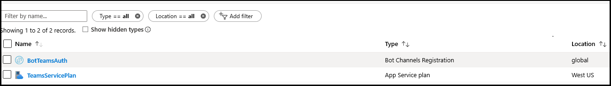
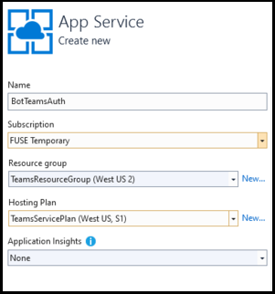

# <a name="add-authentication-to-your-teams-bot"></a><span data-ttu-id="adec7-103">Adicionar autenticação ao bot do Microsoft Teams</span><span class="sxs-lookup"><span data-stu-id="adec7-103">Add authentication to your Teams bot</span></span>

<span data-ttu-id="adec7-104">Há ocasiões em que você pode precisar criar bots no Microsoft Teams que podem acessar recursos em nome do usuário, como um serviço de email.</span><span class="sxs-lookup"><span data-stu-id="adec7-104">There are times when you may need to create bots in Microsoft Teams that can access resources on behalf of the user, such as a mail service.</span></span>

<span data-ttu-id="adec7-105">Este artigo demonstra como usar a autenticação do SDK do Azure bot Service v4, com base no OAuth 2,0.</span><span class="sxs-lookup"><span data-stu-id="adec7-105">This article demonstrates how to use Azure Bot Service v4 SDK authentication, based on OAuth 2.0.</span></span> <span data-ttu-id="adec7-106">Isso facilita o desenvolvimento de um bot que pode usar tokens de autenticação com base nas credenciais do usuário.</span><span class="sxs-lookup"><span data-stu-id="adec7-106">This makes it easier to develop a bot that can use authentication tokens based on the user's credentials.</span></span> <span data-ttu-id="adec7-107">A chave é o uso de provedores de **identidade**, como veremos mais tarde.</span><span class="sxs-lookup"><span data-stu-id="adec7-107">Key in all this is the use of **identity providers**, as we will see later.</span></span>

<span data-ttu-id="adec7-108">O OAuth 2,0 é um padrão aberto para autenticação e autorização usados pelo Azure Active Directory (Azure AD) e muitos outros provedores de identidade.</span><span class="sxs-lookup"><span data-stu-id="adec7-108">OAuth 2.0 is an open standard for authentication and authorization used by Azure Active Directory (Azure AD) and many other identity providers.</span></span> <span data-ttu-id="adec7-109">Uma compreensão básica do OAuth 2,0 é um pré-requisito para trabalhar com autenticação no Microsoft Teams.</span><span class="sxs-lookup"><span data-stu-id="adec7-109">A basic understanding of OAuth 2.0 is a prerequisite for working with authentication in Teams.</span></span>

<span data-ttu-id="adec7-110">Consulte [OAuth 2 simplificado](https://aka.ms/oauth2-simplified) para obter uma compreensão básica e o [OAuth 2,0](https://oauth.net/2/) para a especificação completa.</span><span class="sxs-lookup"><span data-stu-id="adec7-110">See [OAuth 2 Simplified](https://aka.ms/oauth2-simplified) for a basic understanding, and [OAuth 2.0](https://oauth.net/2/) for the complete specification.</span></span>

<span data-ttu-id="adec7-111">Para obter mais informações sobre como o serviço de bot do Azure trata a autenticação, confira [autenticação do usuário em uma conversa](https://aka.ms/azure-bot-authentication).</span><span class="sxs-lookup"><span data-stu-id="adec7-111">For more information about how the Azure Bot Service handles authentication, see [User authentication within a conversation](https://aka.ms/azure-bot-authentication).</span></span>

<span data-ttu-id="adec7-112">Neste artigo, você aprenderá:</span><span class="sxs-lookup"><span data-stu-id="adec7-112">In this article you'll learn:</span></span>

- <span data-ttu-id="adec7-113">**Como criar um bot habilitado para autenticação**.</span><span class="sxs-lookup"><span data-stu-id="adec7-113">**How to create an authentication-enabled bot**.</span></span> <span data-ttu-id="adec7-114">Você usará o [cs-auth-Sample][teams-auth-bot] para lidar com as credenciais de entrada do usuário e a geração do token de autenticação.</span><span class="sxs-lookup"><span data-stu-id="adec7-114">You'll use [cs-auth-sample][teams-auth-bot] to handle user sign-in credentials and the generating the authentication token.</span></span>
- <span data-ttu-id="adec7-115">**Como implantar o bot no Azure e associá-lo a um provedor de identidade**.</span><span class="sxs-lookup"><span data-stu-id="adec7-115">**How to deploy the bot to Azure and associate it with an identity provider**.</span></span> <span data-ttu-id="adec7-116">O provedor emite um token com base nas credenciais de entrada do usuário.</span><span class="sxs-lookup"><span data-stu-id="adec7-116">The provider issues a token based on user sign-in credentials.</span></span> <span data-ttu-id="adec7-117">O bot pode usar o token para acessar recursos, como um serviço de email, que requer autenticação.</span><span class="sxs-lookup"><span data-stu-id="adec7-117">The bot can use the token to access resources, such as a mail service, which require authentication.</span></span> <span data-ttu-id="adec7-118">Para obter mais informações, consulte [Microsoft Teams Authentication Flow for bots](auth-flow-bot.md).</span><span class="sxs-lookup"><span data-stu-id="adec7-118">For more information see  [Microsoft Teams authentication flow for bots](auth-flow-bot.md).</span></span>
- <span data-ttu-id="adec7-119">**Como integrar o bot no Microsoft Teams**.</span><span class="sxs-lookup"><span data-stu-id="adec7-119">**How to integrate the bot within Microsoft Teams**.</span></span> <span data-ttu-id="adec7-120">Após a integração do bot, você poderá entrar e trocar mensagens com ela em um chat.</span><span class="sxs-lookup"><span data-stu-id="adec7-120">Once the bot has been integrated, you can sign in and exchange messages with it in a chat.</span></span>

## <a name="prerequisites"></a><span data-ttu-id="adec7-121">Pré-requisitos</span><span class="sxs-lookup"><span data-stu-id="adec7-121">Prerequisites</span></span>

- <span data-ttu-id="adec7-122">Conhecimento das [noções básicas de bot][concept-basics], [Gerenciamento de estado][concept-state], a biblioteca de [caixas de diálogo][concept-dialogs]e como implementar o [fluxo de conversa seqüencial][simple-dialog].</span><span class="sxs-lookup"><span data-stu-id="adec7-122">Knowledge of [bot basics][concept-basics], [managing state][concept-state], the [dialogs library][concept-dialogs], and how to [implement sequential conversation flow][simple-dialog].</span></span>
- <span data-ttu-id="adec7-123">Conhecimento sobre o desenvolvimento do Azure e do OAuth 2,0.</span><span class="sxs-lookup"><span data-stu-id="adec7-123">Knowledge of Azure and OAuth 2.0 development.</span></span>
- <span data-ttu-id="adec7-124">Visual Studio 2017 ou posterior e git.</span><span class="sxs-lookup"><span data-stu-id="adec7-124">Visual Studio 2017 or later and Git.</span></span>
- <span data-ttu-id="adec7-125">Conta do Azure.</span><span class="sxs-lookup"><span data-stu-id="adec7-125">Azure account.</span></span> <span data-ttu-id="adec7-126">Se necessário, você pode criar uma [conta gratuita do Azure](https://azure.microsoft.com/free/).</span><span class="sxs-lookup"><span data-stu-id="adec7-126">If needed, you can create an [Azure free account](https://azure.microsoft.com/free/).</span></span>
- <span data-ttu-id="adec7-127">O exemplo a seguir.</span><span class="sxs-lookup"><span data-stu-id="adec7-127">The following sample.</span></span>

    | <span data-ttu-id="adec7-128">Amostra</span><span class="sxs-lookup"><span data-stu-id="adec7-128">Sample</span></span> | <span data-ttu-id="adec7-129">Versão do BotBuilder</span><span class="sxs-lookup"><span data-stu-id="adec7-129">BotBuilder version</span></span> | <span data-ttu-id="adec7-130">Demonstra</span><span class="sxs-lookup"><span data-stu-id="adec7-130">Demonstrates</span></span> |
    |:---|:---:|:---|
    | <span data-ttu-id="adec7-131">**Autenticação de bot** no [cs-auth-Sample][teams-auth-bot]</span><span class="sxs-lookup"><span data-stu-id="adec7-131">**Bot authentication** in [cs-auth-sample][teams-auth-bot]</span></span> | <span data-ttu-id="adec7-132">V4</span><span class="sxs-lookup"><span data-stu-id="adec7-132">v4</span></span> | <span data-ttu-id="adec7-133">Suporte do OAuthCard</span><span class="sxs-lookup"><span data-stu-id="adec7-133">OAuthCard support</span></span> |
    | <span data-ttu-id="adec7-134">**Autenticação de bot** no [Python-auth-Sample][teams-auth-bot-py]</span><span class="sxs-lookup"><span data-stu-id="adec7-134">**Bot authentication** in [python-auth-sample][teams-auth-bot-py]</span></span> | <span data-ttu-id="adec7-135">V4</span><span class="sxs-lookup"><span data-stu-id="adec7-135">v4</span></span> | <span data-ttu-id="adec7-136">Suporte do OAuthCard</span><span class="sxs-lookup"><span data-stu-id="adec7-136">OAuthCard support</span></span> |

## <a name="create-the-resource-group"></a><span data-ttu-id="adec7-137">Criar o grupo de recursos</span><span class="sxs-lookup"><span data-stu-id="adec7-137">Create the resource group</span></span>

<span data-ttu-id="adec7-138">O grupo de recursos e o plano de serviço não são estritamente necessários, mas permitem que você libere convenientemente os recursos que você criou.</span><span class="sxs-lookup"><span data-stu-id="adec7-138">The resource group and the service plan aren't strictly necessary, but they allow you to conveniently release the resources you create.</span></span> <span data-ttu-id="adec7-139">Essa é uma boa prática para manter seus recursos organizados e gerenciáveis.</span><span class="sxs-lookup"><span data-stu-id="adec7-139">This is good practice for keeping your resources organized and manageable.</span></span>

<span data-ttu-id="adec7-140">Você usa um grupo de recursos para criar recursos individuais para a estrutura de bot.</span><span class="sxs-lookup"><span data-stu-id="adec7-140">You use a resource group to create individual resources for the Bot Framework.</span></span> <span data-ttu-id="adec7-141">Para desempenho, verifique se esses recursos estão localizados na mesma região do Azure.</span><span class="sxs-lookup"><span data-stu-id="adec7-141">For performance, ensure that these resources are located in the same Azure region.</span></span>

1. <span data-ttu-id="adec7-142">No seu navegador, entre no [**portal do Azure**][azure-portal].</span><span class="sxs-lookup"><span data-stu-id="adec7-142">In your browser, sign into the [**Azure portal**][azure-portal].</span></span>
1. <span data-ttu-id="adec7-143">No painel de navegação esquerdo, selecione **grupos de recursos**.</span><span class="sxs-lookup"><span data-stu-id="adec7-143">In the left navigation panel, select **Resource groups**.</span></span>
1. <span data-ttu-id="adec7-144">Na parte superior esquerda da janela exibida, selecione a guia **Adicionar** para criar um novo grupo de recursos.</span><span class="sxs-lookup"><span data-stu-id="adec7-144">In the upper left of the displayed window, select **Add** tab to create a new resource group.</span></span> <span data-ttu-id="adec7-145">Você será solicitado a fornecer o seguinte:</span><span class="sxs-lookup"><span data-stu-id="adec7-145">You'll be prompted to provide the following:</span></span>
    1. <span data-ttu-id="adec7-146">**Assinatura**.</span><span class="sxs-lookup"><span data-stu-id="adec7-146">**Subscription**.</span></span> <span data-ttu-id="adec7-147">Use sua assinatura existente.</span><span class="sxs-lookup"><span data-stu-id="adec7-147">Use your existing subscription.</span></span>
    1. <span data-ttu-id="adec7-148">**Grupo de recursos**.</span><span class="sxs-lookup"><span data-stu-id="adec7-148">**Resource group**.</span></span> <span data-ttu-id="adec7-149">Insira o nome do grupo de recursos.</span><span class="sxs-lookup"><span data-stu-id="adec7-149">Enter the name for the resource group.</span></span> <span data-ttu-id="adec7-150">Um exemplo poderia ser *TeamsResourceGroup*.</span><span class="sxs-lookup"><span data-stu-id="adec7-150">An example could be  *TeamsResourceGroup*.</span></span> <span data-ttu-id="adec7-151">Lembre-se de que o nome deve ser exclusivo.</span><span class="sxs-lookup"><span data-stu-id="adec7-151">Remember that the name must be unique.</span></span>
    1. <span data-ttu-id="adec7-152">No menu suspenso **região** , selecione *oeste dos EUA*ou uma região perto de seus aplicativos.</span><span class="sxs-lookup"><span data-stu-id="adec7-152">From the **Region** drop-down menu, select *West US*, or a region close to your applications.</span></span>
    1. <span data-ttu-id="adec7-153">Selecione o botão **revisar e criar** .</span><span class="sxs-lookup"><span data-stu-id="adec7-153">Select the **Review and create** button.</span></span> <span data-ttu-id="adec7-154">Você verá uma faixa que lê a *validação aprovada*.</span><span class="sxs-lookup"><span data-stu-id="adec7-154">You should see a banner that reads *Validation passed*.</span></span>
    1. <span data-ttu-id="adec7-155">Selecione o botão **criar** .</span><span class="sxs-lookup"><span data-stu-id="adec7-155">Select the **Create** button.</span></span> <span data-ttu-id="adec7-156">Pode levar alguns minutos para criar o grupo de recursos.</span><span class="sxs-lookup"><span data-stu-id="adec7-156">It may take a few minutes to create the resource group.</span></span>

> [!TIP]
> <span data-ttu-id="adec7-157">Da mesma forma que os recursos que você criará posteriormente neste tutorial, é uma boa ideia fixar esse grupo de recursos no painel para facilitar o acesso.</span><span class="sxs-lookup"><span data-stu-id="adec7-157">As with the resources you'll create later in this tutorial, it's a good idea to pin this resource group to your dashboard for easy access.</span></span> <span data-ttu-id="adec7-158">Se quiser fazer isso, selecione o ícone de PIN & # 128204; no canto superior direito do painel.</span><span class="sxs-lookup"><span data-stu-id="adec7-158">If you'd like to do so, select the pin icon &#128204; in the upper right of the dashboard.</span></span>

## <a name="create-the-service-plan"></a><span data-ttu-id="adec7-159">Criar o plano de serviço</span><span class="sxs-lookup"><span data-stu-id="adec7-159">Create the service plan</span></span>

1. <span data-ttu-id="adec7-160">No [**portal do Azure**][azure-portal], no painel de navegação à esquerda, selecione **criar um recurso**.</span><span class="sxs-lookup"><span data-stu-id="adec7-160">In the [**Azure portal**][azure-portal], on the left navigation panel, select **Create a resource**.</span></span>
1. <span data-ttu-id="adec7-161">Na caixa de pesquisa, digite *plano de serviço de aplicativo*.</span><span class="sxs-lookup"><span data-stu-id="adec7-161">In the search box, type *App Service Plan*.</span></span> <span data-ttu-id="adec7-162">Selecione o cartão de **plano do serviço de aplicativo** nos resultados da pesquisa.</span><span class="sxs-lookup"><span data-stu-id="adec7-162">Select the **App Service Plan** card from the search results.</span></span>
1. <span data-ttu-id="adec7-163">Selecione **Criar**.</span><span class="sxs-lookup"><span data-stu-id="adec7-163">Select **Create**.</span></span>
1. <span data-ttu-id="adec7-164">Você será solicitado a fornecer as seguintes informações:</span><span class="sxs-lookup"><span data-stu-id="adec7-164">You'll be asked to provide the following information:</span></span>
    1. <span data-ttu-id="adec7-165">**Assinatura**.</span><span class="sxs-lookup"><span data-stu-id="adec7-165">**Subscription**.</span></span> <span data-ttu-id="adec7-166">Você pode usar uma assinatura existente.</span><span class="sxs-lookup"><span data-stu-id="adec7-166">You can use an existing subscription.</span></span>
    1. <span data-ttu-id="adec7-167">**Grupo de recursos**.</span><span class="sxs-lookup"><span data-stu-id="adec7-167">**Resource Group**.</span></span> <span data-ttu-id="adec7-168">Selecione o grupo que você criou anteriormente.</span><span class="sxs-lookup"><span data-stu-id="adec7-168">Select the group you created earlier.</span></span>
    1. <span data-ttu-id="adec7-169">**Nome**.</span><span class="sxs-lookup"><span data-stu-id="adec7-169">**Name**.</span></span> <span data-ttu-id="adec7-170">Insira o nome do plano de serviço.</span><span class="sxs-lookup"><span data-stu-id="adec7-170">Enter the name for the service plan.</span></span> <span data-ttu-id="adec7-171">Um exemplo poderia ser *TeamsServicePlan*.</span><span class="sxs-lookup"><span data-stu-id="adec7-171">An example could be  *TeamsServicePlan*.</span></span> <span data-ttu-id="adec7-172">Lembre-se de que o nome deve ser exclusivo no grupo.</span><span class="sxs-lookup"><span data-stu-id="adec7-172">Remember that the name must be unique, within the group.</span></span>
    1. <span data-ttu-id="adec7-173">**Sistema operacional**.</span><span class="sxs-lookup"><span data-stu-id="adec7-173">**Operating System**.</span></span> <span data-ttu-id="adec7-174">Selecione *Windows* ou seu sistema operacional aplicável.</span><span class="sxs-lookup"><span data-stu-id="adec7-174">Select *Windows* or your applicable OS.</span></span>
    1. <span data-ttu-id="adec7-175">**Região**.</span><span class="sxs-lookup"><span data-stu-id="adec7-175">**Region**.</span></span> <span data-ttu-id="adec7-176">Selecione *oeste dos EUA* ou uma região perto de seus aplicativos.</span><span class="sxs-lookup"><span data-stu-id="adec7-176">Select *West US* or a region close to your applications.</span></span>
    1. <span data-ttu-id="adec7-177">**Camada de preços**.</span><span class="sxs-lookup"><span data-stu-id="adec7-177">**Pricing Tier**.</span></span> <span data-ttu-id="adec7-178">Verifique se *S1 padrão* está selecionado.</span><span class="sxs-lookup"><span data-stu-id="adec7-178">Make sure that *Standard S1* is selected.</span></span> <span data-ttu-id="adec7-179">Este deve ser o valor padrão.</span><span class="sxs-lookup"><span data-stu-id="adec7-179">This should be the default value.</span></span>
    1. <span data-ttu-id="adec7-180">Selecione o botão **revisar e criar** .</span><span class="sxs-lookup"><span data-stu-id="adec7-180">Select the **Review and create** button.</span></span> <span data-ttu-id="adec7-181">Você verá uma faixa que lê a *validação aprovada*.</span><span class="sxs-lookup"><span data-stu-id="adec7-181">You should see a banner that reads *Validation passed*.</span></span>
    1. <span data-ttu-id="adec7-182">Selecione **Criar**.</span><span class="sxs-lookup"><span data-stu-id="adec7-182">Select **Create**.</span></span> <span data-ttu-id="adec7-183">Pode levar alguns minutos para criar o plano de serviço de aplicativo.</span><span class="sxs-lookup"><span data-stu-id="adec7-183">It may take a few minutes to create the app service plan.</span></span> <span data-ttu-id="adec7-184">O plano será listado no grupo de recursos.</span><span class="sxs-lookup"><span data-stu-id="adec7-184">The plan will be listed in the resource group.</span></span>

## <a name="create-the-bot-channels-registration"></a><span data-ttu-id="adec7-185">Criar o registro de canais de bot</span><span class="sxs-lookup"><span data-stu-id="adec7-185">Create the bot channels registration</span></span>

<span data-ttu-id="adec7-186">O registro de canais de bot registra seu serviço Web como um bot com a estrutura de bot, desde que você tenha uma ID de aplicativo da Microsoft e uma senha de aplicativo (segredo do cliente).</span><span class="sxs-lookup"><span data-stu-id="adec7-186">The bot channels registration registers your web service as a bot with the Bot Framework, provided you have a Microsoft App Id and App password (client secret).</span></span>

> [!IMPORTANT]
> <span data-ttu-id="adec7-187">Você só precisa registrar seu bot se ele não estiver hospedado no Azure.</span><span class="sxs-lookup"><span data-stu-id="adec7-187">You only need to register your bot if it is not hosted in Azure.</span></span> <span data-ttu-id="adec7-188">Se você [criou um bot](/azure/bot-service/abs-quickstart?view=azure-bot-service-4.0&viewFallbackFrom=azure-bot-service-3.0) por meio do portal do Azure, ele já está registrado com o serviço.</span><span class="sxs-lookup"><span data-stu-id="adec7-188">If you [created a bot](/azure/bot-service/abs-quickstart?view=azure-bot-service-4.0&viewFallbackFrom=azure-bot-service-3.0) through the Azure portal then it is already registered with the service.</span></span> <span data-ttu-id="adec7-189">Se você criou o bot por meio da [estrutura de bot](https://dev.botframework.com/bots/new) ou [AppStudio](~/concepts/build-and-test/app-studio-overview.md) seu bot não está registrado no Azure.</span><span class="sxs-lookup"><span data-stu-id="adec7-189">If you created your bot through the [Bot Framework](https://dev.botframework.com/bots/new) or [AppStudio](~/concepts/build-and-test/app-studio-overview.md) your bot isn't registered in Azure.</span></span>

[!INCLUDE [bot channels registration steps](~/includes/bots/azure-bot-channels-registration.md)]

<span data-ttu-id="adec7-190">Após o Azure ter criado o recurso de registro, ele será incluído na lista grupo de recursos.</span><span class="sxs-lookup"><span data-stu-id="adec7-190">After Azure has created the registration resource it will be included in the resource group list.</span></span>  



> [!NOTE]
> <span data-ttu-id="adec7-192">O recurso de registro de canais de bot mostrará a região **global** , mesmo se você selecionar oeste dos EUA.</span><span class="sxs-lookup"><span data-stu-id="adec7-192">The Bot Channels Registration resource will show the **Global** region even if you selected West US.</span></span> <span data-ttu-id="adec7-193">Isso é esperado.</span><span class="sxs-lookup"><span data-stu-id="adec7-193">This is expected.</span></span>

<span data-ttu-id="adec7-194">Para obter mais informações, consulte [Create a bot for Teams](../create-a-bot-for-teams.md).</span><span class="sxs-lookup"><span data-stu-id="adec7-194">For more information, see [Create a bot for Teams](../create-a-bot-for-teams.md).</span></span>

## <a name="create-the-identity-provider"></a><span data-ttu-id="adec7-195">Criar o provedor de identidade</span><span class="sxs-lookup"><span data-stu-id="adec7-195">Create the identity provider</span></span>

<span data-ttu-id="adec7-196">Você precisa de um provedor de identidade que possa ser usado para autenticação.</span><span class="sxs-lookup"><span data-stu-id="adec7-196">You need an identity provider that can be used for authentication.</span></span>
<span data-ttu-id="adec7-197">Neste procedimento, você usará um provedor do Azure AD; outros provedores de identidade compatíveis com o Azure AD também podem ser usados.</span><span class="sxs-lookup"><span data-stu-id="adec7-197">In this procedure you'll use an Azure AD provider; other Azure AD supported identity providers can also be used.</span></span>

1. <span data-ttu-id="adec7-198">No [**portal do Azure**][azure-portal], no painel de navegação à esquerda, selecione **Azure Active Directory**.</span><span class="sxs-lookup"><span data-stu-id="adec7-198">In the [**Azure portal**][azure-portal], on the left navigation panel, select **Azure Active Directory**.</span></span>
    > [!TIP]
    > <span data-ttu-id="adec7-199">Você precisará criar e registrar esse recurso do Azure AD em um locatário no qual você pode concordar em delegar permissões solicitadas por um aplicativo.</span><span class="sxs-lookup"><span data-stu-id="adec7-199">You'll need to create and register this Azure AD resource in a tenant in which you can consent to delegate permissions requested by an application.</span></span>
    > <span data-ttu-id="adec7-200">Para obter instruções sobre como criar um locatário, confira [acessar o portal e criar um locatário](/azure/active-directory/fundamentals/active-directory-access-create-new-tenant).</span><span class="sxs-lookup"><span data-stu-id="adec7-200">For instruction on creating a tenant, see [Access the portal and create a tenant](/azure/active-directory/fundamentals/active-directory-access-create-new-tenant).</span></span>
1. <span data-ttu-id="adec7-201">No painel esquerdo, selecione **registros de aplicativo**.</span><span class="sxs-lookup"><span data-stu-id="adec7-201">In the left panel, select **App registrations**.</span></span>
1. <span data-ttu-id="adec7-202">No painel direito, selecione a guia **novo registro** , no canto superior esquerdo.</span><span class="sxs-lookup"><span data-stu-id="adec7-202">In the right panel, select the **New registration** tab, in the upper left.</span></span>
1. <span data-ttu-id="adec7-203">Você será solicitado a fornecer as seguintes informações:</span><span class="sxs-lookup"><span data-stu-id="adec7-203">You'll be asked to provide the following information:</span></span>
   1. <span data-ttu-id="adec7-204">**Nome**.</span><span class="sxs-lookup"><span data-stu-id="adec7-204">**Name**.</span></span> <span data-ttu-id="adec7-205">Insira o nome do aplicativo.</span><span class="sxs-lookup"><span data-stu-id="adec7-205">Enter the name for the application.</span></span> <span data-ttu-id="adec7-206">Um exemplo poderia ser *BotTeamsIdentity*.</span><span class="sxs-lookup"><span data-stu-id="adec7-206">An example could be  *BotTeamsIdentity*.</span></span> <span data-ttu-id="adec7-207">Lembre-se de que o nome deve ser exclusivo.</span><span class="sxs-lookup"><span data-stu-id="adec7-207">Remember that the name must be unique.</span></span>
   1. <span data-ttu-id="adec7-208">Selecione os **tipos de conta com suporte** para o seu aplicativo.</span><span class="sxs-lookup"><span data-stu-id="adec7-208">Select the **Supported account types** for your application.</span></span> <span data-ttu-id="adec7-209">Selecione *contas em qualquer diretório organizacional (qualquer diretório do Azure ad-multilocatário) e contas pessoais da Microsoft (por exemplo, Skype, Xbox)*.</span><span class="sxs-lookup"><span data-stu-id="adec7-209">Select *Accounts in any organizational directory (Any Azure AD directory - Multitenant) and personal Microsoft accounts (e.g. Skype, Xbox)*.</span></span>
   1. <span data-ttu-id="adec7-210">Para o **URI de redirecionamento**:</span><span class="sxs-lookup"><span data-stu-id="adec7-210">For the **Redirect URI**:</span></span><br/>
       <span data-ttu-id="adec7-211">&#x2713;selecione **Web**.</span><span class="sxs-lookup"><span data-stu-id="adec7-211">&#x2713;Select **Web**.</span></span> <br/>
       <span data-ttu-id="adec7-212">&#x2713; definir a URL como `https://token.botframework.com/.auth/web/redirect`.</span><span class="sxs-lookup"><span data-stu-id="adec7-212">&#x2713; Set the URL to `https://token.botframework.com/.auth/web/redirect`.</span></span>
   1. <span data-ttu-id="adec7-213">Selecione **registrar**.</span><span class="sxs-lookup"><span data-stu-id="adec7-213">Select **Register**.</span></span>

1. <span data-ttu-id="adec7-214">Depois que ele for criado, o Azure exibirá a página **visão geral** do aplicativo.</span><span class="sxs-lookup"><span data-stu-id="adec7-214">Once it is created, Azure displays the **Overview** page for the app.</span></span> <span data-ttu-id="adec7-215">Copie e salve as seguintes informações em um arquivo:</span><span class="sxs-lookup"><span data-stu-id="adec7-215">Copy and save the following information to a file:</span></span>

    1. <span data-ttu-id="adec7-216">O valor da **ID do aplicativo (cliente)** .</span><span class="sxs-lookup"><span data-stu-id="adec7-216">The **Application (client) ID** value.</span></span> <span data-ttu-id="adec7-217">Você usará esse valor mais tarde como a *ID do cliente* ao registrar esse aplicativo de identidade do Azure no bot.</span><span class="sxs-lookup"><span data-stu-id="adec7-217">You'll use this value later as the *Client ID* when you register this Azure identity application with your bot.</span></span>
    1. <span data-ttu-id="adec7-218">O valor da **ID do diretório (locatário)** .</span><span class="sxs-lookup"><span data-stu-id="adec7-218">The **Directory (tenant) ID** value.</span></span> <span data-ttu-id="adec7-219">Você também usará esse valor mais tarde como a *ID de locatário* para registrar esse aplicativo de identidade do Azure no bot.</span><span class="sxs-lookup"><span data-stu-id="adec7-219">You'll also use this value later as the *Tenant ID* to register this Azure identity application with your bot.</span></span>

1. <span data-ttu-id="adec7-220">No painel esquerdo, selecione **certificados & segredos** para criar um segredo do cliente para seu aplicativo.</span><span class="sxs-lookup"><span data-stu-id="adec7-220">In the left panel, select **Certificates & secrets** to create a client secret for your application.</span></span>

   1. <span data-ttu-id="adec7-221">Em **segredos do cliente**, selecione &#x2795; **novo segredo do cliente**.</span><span class="sxs-lookup"><span data-stu-id="adec7-221">Under **Client secrets**, select &#x2795; **New client secret**.</span></span>
   1. <span data-ttu-id="adec7-222">Adicione uma descrição para identificar esse segredo de outras pessoas que você talvez precise criar para esse aplicativo, como o *aplicativo de identidade de bot no Microsoft Teams*.</span><span class="sxs-lookup"><span data-stu-id="adec7-222">Add a description to identify this secret from others you might need to create for this app, such as *Bot identity app in Teams*.</span></span>
   1. <span data-ttu-id="adec7-223">Definir **expira** para sua seleção.</span><span class="sxs-lookup"><span data-stu-id="adec7-223">Set **Expires** to your selection.</span></span>
   1. <span data-ttu-id="adec7-224">Selecione **Adicionar**.</span><span class="sxs-lookup"><span data-stu-id="adec7-224">Select **Add**.</span></span>
   1. <span data-ttu-id="adec7-225">Antes de sair desta página, **Registre o segredo**.</span><span class="sxs-lookup"><span data-stu-id="adec7-225">Before leaving this page, **record the secret**.</span></span> <span data-ttu-id="adec7-226">Você usará esse valor mais tarde como o _segredo do cliente_ quando registrar seu aplicativo do Azure AD com o bot.</span><span class="sxs-lookup"><span data-stu-id="adec7-226">You'll use this value later as the _Client secret_ when you register your Azure AD application with your bot.</span></span>

### <a name="configure-the-identity-provider-connection-and-register-it-with-the-bot"></a><span data-ttu-id="adec7-227">Configurar a conexão do provedor de identidade e registrá-la com o bot</span><span class="sxs-lookup"><span data-stu-id="adec7-227">Configure the identity provider connection and register it with the bot</span></span>

1. <span data-ttu-id="adec7-228">No [**portal do Azure**][azure-portal], selecione o grupo de recursos no painel.</span><span class="sxs-lookup"><span data-stu-id="adec7-228">In the [**Azure portal**][azure-portal], select your resource group from the dashboard.</span></span>
1. <span data-ttu-id="adec7-229">Selecione o link de registro do canal do bot.</span><span class="sxs-lookup"><span data-stu-id="adec7-229">Select your bot channel registration link.</span></span>
1. <span data-ttu-id="adec7-230">Na página recurso, selecione **configurações**.</span><span class="sxs-lookup"><span data-stu-id="adec7-230">On the resource page, select **Settings**.</span></span>
1. <span data-ttu-id="adec7-231">Em **configurações de conexão OAuth** próximo à parte inferior da página, selecione **Adicionar configuração**.</span><span class="sxs-lookup"><span data-stu-id="adec7-231">Under **OAuth Connection Settings** near the bottom of the page, select **Add Setting**.</span></span>
1. <span data-ttu-id="adec7-232">Preencha o formulário de acordo com as instruções a seguir:</span><span class="sxs-lookup"><span data-stu-id="adec7-232">Complete the form as follows:</span></span>

    1. <span data-ttu-id="adec7-233">**Nome**.</span><span class="sxs-lookup"><span data-stu-id="adec7-233">**Name**.</span></span> <span data-ttu-id="adec7-234">Insira um nome para a conexão.</span><span class="sxs-lookup"><span data-stu-id="adec7-234">Enter a name for the connection.</span></span> <span data-ttu-id="adec7-235">Você usará esse nome no bot no `appsettings.json` arquivo.</span><span class="sxs-lookup"><span data-stu-id="adec7-235">You'll use this name in your bot in the `appsettings.json` file.</span></span> <span data-ttu-id="adec7-236">Por exemplo *BotTeamsAuthADv1*.</span><span class="sxs-lookup"><span data-stu-id="adec7-236">For example *BotTeamsAuthADv1*.</span></span>
    1. <span data-ttu-id="adec7-237">**Provedor de serviços**.</span><span class="sxs-lookup"><span data-stu-id="adec7-237">**Service Provider**.</span></span> <span data-ttu-id="adec7-238">Selecione **Azure Active Directory**.</span><span class="sxs-lookup"><span data-stu-id="adec7-238">Select **Azure Active Directory**.</span></span> <span data-ttu-id="adec7-239">Depois que você selecionar isso, os campos específicos do Azure AD serão exibidos.</span><span class="sxs-lookup"><span data-stu-id="adec7-239">Once you select this, the Azure AD-specific fields will be displayed.</span></span>
    1. <span data-ttu-id="adec7-240">**ID do cliente**. Insira a ID do aplicativo (cliente) que você registrou para seu aplicativo do provedor de identidade do Azure nas etapas acima.</span><span class="sxs-lookup"><span data-stu-id="adec7-240">**Client id**. Enter the Application (client) ID that you recorded for your Azure identity provider app in the steps above.</span></span>
    1. <span data-ttu-id="adec7-241">**Segredo do cliente**.</span><span class="sxs-lookup"><span data-stu-id="adec7-241">**Client secret**.</span></span> <span data-ttu-id="adec7-242">Insira o segredo que você gravou para seu aplicativo do provedor de identidade do Azure nas etapas acima.</span><span class="sxs-lookup"><span data-stu-id="adec7-242">Enter the secret that you recorded for your Azure identity provider app in the steps above.</span></span>
    1. <span data-ttu-id="adec7-243">**Tipo de concessão**.</span><span class="sxs-lookup"><span data-stu-id="adec7-243">**Grant Type**.</span></span> <span data-ttu-id="adec7-244">Inserir `authorization_code`.</span><span class="sxs-lookup"><span data-stu-id="adec7-244">Enter `authorization_code`.</span></span>
    1. <span data-ttu-id="adec7-245">**URL de logon**.</span><span class="sxs-lookup"><span data-stu-id="adec7-245">**Login URL**.</span></span> <span data-ttu-id="adec7-246">Inserir `https://login.microsoftonline.com`.</span><span class="sxs-lookup"><span data-stu-id="adec7-246">Enter `https://login.microsoftonline.com`.</span></span>
    1. <span data-ttu-id="adec7-247">**ID do locatário**, digite a **ID do diretório (locatário)** registrada anteriormente para seu aplicativo de identidade do Azure ou **comum** , dependendo do tipo de conta com suporte selecionado quando você criou o aplicativo do provedor de identidade.</span><span class="sxs-lookup"><span data-stu-id="adec7-247">**Tenant ID**, enter the **Directory (tenant) ID** that you recorded earlier for your Azure identity app or **common** depending on the supported account type selected when you created the identity provider app.</span></span> <span data-ttu-id="adec7-248">Para decidir qual o valor a ser atribuído siga estes critérios:</span><span class="sxs-lookup"><span data-stu-id="adec7-248">To decide which value to assign follow these criteria:</span></span>

        - <span data-ttu-id="adec7-249">Se você selecionou *contas nesse diretório organizacional apenas (Microsoft somente um locatário)* ou *contas em qualquer diretório organizacional (Microsoft AAD Directory-multilocatário)* , insira a **ID do locatário** que você gravou anteriormente para o aplicativo AAD.</span><span class="sxs-lookup"><span data-stu-id="adec7-249">If you selected either *Accounts in this organizational directory only (Microsoft only - Single tenant)* or *Accounts in any organizational directory(Microsoft AAD directory - Multi tenant)* enter the **tenant ID** you recorded earlier for the AAD app.</span></span> <span data-ttu-id="adec7-250">Este será o locatário associado aos usuários que podem ser autenticados.</span><span class="sxs-lookup"><span data-stu-id="adec7-250">This will be the tenant associated with the users who can be authenticated.</span></span>

        - <span data-ttu-id="adec7-251">Se você selecionou *contas em qualquer diretório organizacional (qualquer usuário do AAD-multilocatário e contas pessoais da Microsoft, por exemplo, Skype, Xbox, Outlook)* , insira a palavra **comum** em vez de uma ID de locatário.</span><span class="sxs-lookup"><span data-stu-id="adec7-251">If you selected *Accounts in any organizational directory (Any AAD directory - Multi tenant and personal Microsoft accounts e.g. Skype, Xbox, Outlook)* enter the word **common** instead of a tenant ID.</span></span> <span data-ttu-id="adec7-252">Caso contrário, o aplicativo AAD verificará o locatário cuja ID foi selecionada e excluirá contas pessoais da Microsoft.</span><span class="sxs-lookup"><span data-stu-id="adec7-252">Otherwise, the AAD app will verify through the tenant whose ID was selected and exclude personal Microsoft accounts.</span></span>

    <span data-ttu-id="adec7-253">0.</span><span class="sxs-lookup"><span data-stu-id="adec7-253">h.</span></span> <span data-ttu-id="adec7-254">Para **URL de recurso**, `https://graph.microsoft.com/`insira.</span><span class="sxs-lookup"><span data-stu-id="adec7-254">For **Resource URL**, enter `https://graph.microsoft.com/`.</span></span> <span data-ttu-id="adec7-255">Isso não é usado no exemplo de código atual.</span><span class="sxs-lookup"><span data-stu-id="adec7-255">This is not used in the current code sample.</span></span>  
    <span data-ttu-id="adec7-256">crio.</span><span class="sxs-lookup"><span data-stu-id="adec7-256">i.</span></span> <span data-ttu-id="adec7-257">Deixe **escopos** em branco.</span><span class="sxs-lookup"><span data-stu-id="adec7-257">Leave **Scopes** blank.</span></span> <span data-ttu-id="adec7-258">A imagem a seguir é um exemplo:</span><span class="sxs-lookup"><span data-stu-id="adec7-258">The following image is an example:</span></span>

    

1. <span data-ttu-id="adec7-260">Selecione **Salvar**.</span><span class="sxs-lookup"><span data-stu-id="adec7-260">Select **Save**.</span></span>

### <a name="test-the-connection"></a><span data-ttu-id="adec7-261">Testar a conexão</span><span class="sxs-lookup"><span data-stu-id="adec7-261">Test the connection</span></span>

1. <span data-ttu-id="adec7-262">Selecione a entrada de conexão para abrir a conexão que você acabou de criar.</span><span class="sxs-lookup"><span data-stu-id="adec7-262">Select the connection entry to open the connection you just created.</span></span>
1. <span data-ttu-id="adec7-263">Selecione **testar conexão** na parte superior do painel **configuração de conexão do provedor de serviços** .</span><span class="sxs-lookup"><span data-stu-id="adec7-263">Select **Test Connection** at the top of the **Service Provider Connection Setting** panel.</span></span>
1. <span data-ttu-id="adec7-264">Na primeira vez que você fizer isso, abrirá uma nova janela do navegador solicitando que você selecione uma conta.</span><span class="sxs-lookup"><span data-stu-id="adec7-264">The first time you do this will open a new browser window asking you to select an account.</span></span> <span data-ttu-id="adec7-265">Selecione aquele que você deseja usar.</span><span class="sxs-lookup"><span data-stu-id="adec7-265">Select the one you want to use.</span></span>
1. <span data-ttu-id="adec7-266">Em seguida, você será solicitado a permitir que o provedor de identidade use seus dados (credenciais).</span><span class="sxs-lookup"><span data-stu-id="adec7-266">Next, you'll be asked to allow to the identity provider to use your data (credentials).</span></span> <span data-ttu-id="adec7-267">A imagem a seguir é um exemplo:</span><span class="sxs-lookup"><span data-stu-id="adec7-267">The following image is an example:</span></span>

    

1. <span data-ttu-id="adec7-269">Selecione **aceitar**.</span><span class="sxs-lookup"><span data-stu-id="adec7-269">Select **Accept**.</span></span>
1. <span data-ttu-id="adec7-270">Isso deve ser redirecionado para uma **conexão de \<teste para a página-connection-Name> bem-sucedido** .</span><span class="sxs-lookup"><span data-stu-id="adec7-270">This should then redirect you to a **Test Connection to \<your-connection-name> Succeeded** page.</span></span> <span data-ttu-id="adec7-271">Atualize a página se você receber um erro.</span><span class="sxs-lookup"><span data-stu-id="adec7-271">Refresh the page if you get an error.</span></span> <span data-ttu-id="adec7-272">A imagem a seguir é um exemplo:</span><span class="sxs-lookup"><span data-stu-id="adec7-272">The following image is an example:</span></span>

  

<span data-ttu-id="adec7-274">O nome da conexão é usado pelo código do bot para recuperar os tokens de autenticação do usuário.</span><span class="sxs-lookup"><span data-stu-id="adec7-274">The connection name is used by the bot code to retrieve user authentication tokens.</span></span>

## <a name="prepare-the-bot-sample-code"></a><span data-ttu-id="adec7-275">Preparar o código de exemplo de bot</span><span class="sxs-lookup"><span data-stu-id="adec7-275">Prepare the bot sample code</span></span>

<span data-ttu-id="adec7-276">Com as configurações preliminares concluídas, vamos nos concentrar na criação do bot a ser usado neste artigo.</span><span class="sxs-lookup"><span data-stu-id="adec7-276">With the preliminary settings done, let's focus on the creation of the bot to use in this article.</span></span>

# <a name="cnettabdotnet"></a>[<span data-ttu-id="adec7-277">C#/.NET</span><span class="sxs-lookup"><span data-stu-id="adec7-277">C#/.NET</span></span>](#tab/dotnet)

1. <span data-ttu-id="adec7-278">Clone [cs-auth-Sample][teams-auth-bot].</span><span class="sxs-lookup"><span data-stu-id="adec7-278">Clone [cs-auth-sample][teams-auth-bot].</span></span>
1. <span data-ttu-id="adec7-279">Inicie o Visual Studio.</span><span class="sxs-lookup"><span data-stu-id="adec7-279">Launch Visual Studio.</span></span>
1. <span data-ttu-id="adec7-280">Na barra de ferramentas **, selecione Arquivo-> Open-> Project/Solution** e abra o projeto bot.</span><span class="sxs-lookup"><span data-stu-id="adec7-280">From the toolbar select **File -> Open -> Project/Solution** and open the bot project.</span></span>
1. <span data-ttu-id="adec7-281">Na atualização C# **appSettings. JSON** da seguinte maneira:</span><span class="sxs-lookup"><span data-stu-id="adec7-281">In C# Update **appsettings.json** as follows:</span></span>

    - <span data-ttu-id="adec7-282">Defina `ConnectionName` como o nome da conexão do provedor de identidade que você adicionou ao registro do canal de bot.</span><span class="sxs-lookup"><span data-stu-id="adec7-282">Set `ConnectionName` to the name of the identity provider connection you added to the bot channel registration.</span></span> <span data-ttu-id="adec7-283">O nome usado neste exemplo é *BotTeamsAuthADv1*.</span><span class="sxs-lookup"><span data-stu-id="adec7-283">The name we used in this example is *BotTeamsAuthADv1*.</span></span>
    - <span data-ttu-id="adec7-284">Defina `MicrosoftAppId` como a **ID do aplicativo bot** que você salvou no momento do registro do canal de bot.</span><span class="sxs-lookup"><span data-stu-id="adec7-284">Set `MicrosoftAppId` to the **bot App ID** you saved at the time of the bot channel registration.</span></span>
    - <span data-ttu-id="adec7-285">Defina `MicrosoftAppPassword` como o **segredo do cliente** que você salvou no momento do registro do canal do bot.</span><span class="sxs-lookup"><span data-stu-id="adec7-285">Set `MicrosoftAppPassword` to the **customer secret** you saved at the time of the bot channel registration.</span></span>
    - <span data-ttu-id="adec7-286">Defina o `ConnectionName` como o nome da conexão do provedor de identidade.</span><span class="sxs-lookup"><span data-stu-id="adec7-286">Set the `ConnectionName` to the name of the identity provider connection.</span></span> 

    <span data-ttu-id="adec7-287">Dependendo dos caracteres no seu segredo de bot, talvez seja necessário escapar da senha por XML.</span><span class="sxs-lookup"><span data-stu-id="adec7-287">Depending on the characters in your bot secret, you may need to XML escape the password.</span></span> <span data-ttu-id="adec7-288">Por exemplo, qualquer e comercial (&) precisará ser codificado como `&amp;`.</span><span class="sxs-lookup"><span data-stu-id="adec7-288">For example, any ampersands (&) will need to be encoded as `&amp;`.</span></span>

     [!code-json[appsettings](~/../botbuilder-samples/samples/csharp_dotnetcore/46.teams-auth/appsettings.json?range=1-5)]

1. <span data-ttu-id="adec7-289">No Gerenciador de soluções, navegue até a `TeamsAppManifest` pasta, abra `manifest.json` e defina `id` e `botId` para o **ID do aplicativo bot** que você salvou no momento do registro do canal de bot.</span><span class="sxs-lookup"><span data-stu-id="adec7-289">In the Solution Explorer, navigate to the `TeamsAppManifest` folder, open `manifest.json` and set `id` and `botId` to the **bot App ID** you saved at the time of the bot channel registration.</span></span>

# <a name="pythontabpython"></a>[<span data-ttu-id="adec7-290">Python</span><span class="sxs-lookup"><span data-stu-id="adec7-290">Python</span></span>](#tab/python)

1. <span data-ttu-id="adec7-291">Clone a amostra de [autenticação de bot do teams][teams-auth-bot-py] do repositório do github.</span><span class="sxs-lookup"><span data-stu-id="adec7-291">Clone the sample [Teams bot authentication][teams-auth-bot-py] from the github repository.</span></span>
1. <span data-ttu-id="adec7-292">Atualizar **config.py**:</span><span class="sxs-lookup"><span data-stu-id="adec7-292">Update **config.py**:</span></span>

    - <span data-ttu-id="adec7-293">Defina `ConnectionName` como o nome da configuração de conexão OAuth que você adicionou ao bot.</span><span class="sxs-lookup"><span data-stu-id="adec7-293">Set `ConnectionName` to the name of the OAuth connection setting you added to your bot.</span></span>
    - <span data-ttu-id="adec7-294">Defina `MicrosoftAppId` e `MicrosoftAppPassword` para a ID de aplicativo do bot e o segredo do aplicativo.</span><span class="sxs-lookup"><span data-stu-id="adec7-294">Set `MicrosoftAppId` and `MicrosoftAppPassword` to your bot's app ID and app secret.</span></span>

      <span data-ttu-id="adec7-295">Dependendo dos caracteres no seu segredo de bot, talvez seja necessário escapar da senha por XML.</span><span class="sxs-lookup"><span data-stu-id="adec7-295">Depending on the characters in your bot secret, you may need to XML escape the password.</span></span> <span data-ttu-id="adec7-296">Por exemplo, qualquer e comercial (&) precisará ser codificado como `&amp;`.</span><span class="sxs-lookup"><span data-stu-id="adec7-296">For example, any ampersands (&) will need to be encoded as `&amp;`.</span></span>

      [!code-python[config](~/../botbuilder-samples/samples/python/46.teams-auth/config.py?range=14-16)]

---

### <a name="deploy-the-bot-to-azure"></a><span data-ttu-id="adec7-297">Implantar o bot no Azure</span><span class="sxs-lookup"><span data-stu-id="adec7-297">Deploy the bot to Azure</span></span>

<span data-ttu-id="adec7-298">Para implantar o bot, siga as etapas descritas em como [implantar seu bot no Azure](https://aka.ms/azure-bot-deployment-cli).</span><span class="sxs-lookup"><span data-stu-id="adec7-298">To deploy the bot, follow the steps in the how to [Deploy your bot to Azure](https://aka.ms/azure-bot-deployment-cli).</span></span>

<span data-ttu-id="adec7-299">Como alternativa, enquanto no Visual Studio, você pode seguir estas etapas:</span><span class="sxs-lookup"><span data-stu-id="adec7-299">Alternatively, while in Visual Studio, you can follow these steps:</span></span>

1. <span data-ttu-id="adec7-300">No Visual Studio *Solution Explorer* , selecione e segure (ou clique com o botão direito do mouse) o nome do projeto.</span><span class="sxs-lookup"><span data-stu-id="adec7-300">In Visual Studio *Solution Explorer* select and hold (or right-click) the project name.</span></span>
1. <span data-ttu-id="adec7-301">No menu suspenso, selecione **publicar**.</span><span class="sxs-lookup"><span data-stu-id="adec7-301">In the drop-down menu, select **Publish**.</span></span>
1. <span data-ttu-id="adec7-302">Na janela exibida, selecione o **novo** link.</span><span class="sxs-lookup"><span data-stu-id="adec7-302">In the displayed window, select the **New** link.</span></span>
1. <span data-ttu-id="adec7-303">Na janela de diálogo, selecione **serviço de aplicativo** à esquerda e **crie novo** à direita.</span><span class="sxs-lookup"><span data-stu-id="adec7-303">In the dialog window, select **App Service** on the left and **Create New** on the right.</span></span>
1. <span data-ttu-id="adec7-304">Selecione o botão **publicar** .</span><span class="sxs-lookup"><span data-stu-id="adec7-304">Select the **Publish** button.</span></span>
1. <span data-ttu-id="adec7-305">Na próxima janela de diálogo, insira as informações necessárias.</span><span class="sxs-lookup"><span data-stu-id="adec7-305">In the next dialog window, enter the required information.</span></span> <span data-ttu-id="adec7-306">Este é um exemplo:</span><span class="sxs-lookup"><span data-stu-id="adec7-306">The following is an example:</span></span>

   

1. <span data-ttu-id="adec7-308">Selecione **Criar**.</span><span class="sxs-lookup"><span data-stu-id="adec7-308">Select **Create**.</span></span>
1. <span data-ttu-id="adec7-309">Se a implantação for concluída com êxito, você deverá vê-la refletida no Visual Studio.</span><span class="sxs-lookup"><span data-stu-id="adec7-309">If the deployment completes successfully, you should see it reflected in Visual Studio.</span></span> <span data-ttu-id="adec7-310">Além disso, uma página é exibida no navegador padrão dizendo que *o bot está pronto!*.</span><span class="sxs-lookup"><span data-stu-id="adec7-310">Moreover, a page is displayed in your default browser saying *Your bot is ready!*.</span></span> <span data-ttu-id="adec7-311">A URL será semelhante a esta: `https://botteamsauth.azurewebsites.net/`.</span><span class="sxs-lookup"><span data-stu-id="adec7-311">The URL will be similar to this: `https://botteamsauth.azurewebsites.net/`.</span></span> <span data-ttu-id="adec7-312">Salve-o em um arquivo.</span><span class="sxs-lookup"><span data-stu-id="adec7-312">Save it to a file.</span></span>
1. <span data-ttu-id="adec7-313">No navegador, navegue até o [**portal do Azure**][azure-portal].</span><span class="sxs-lookup"><span data-stu-id="adec7-313">In your browser, navigate to the [**Azure portal**][azure-portal].</span></span>
1. <span data-ttu-id="adec7-314">Verifique o grupo de recursos, o bot deve ser listado junto com os outros recursos.</span><span class="sxs-lookup"><span data-stu-id="adec7-314">Check your resource group, the bot should be listed along with the other resources.</span></span> <span data-ttu-id="adec7-315">A imagem a seguir é um exemplo:</span><span class="sxs-lookup"><span data-stu-id="adec7-315">The following image is an example:</span></span>

    

1. <span data-ttu-id="adec7-317">No grupo de recursos, selecione o nome de registro do canal de bot (link).</span><span class="sxs-lookup"><span data-stu-id="adec7-317">In the resource group, select the bot channel registration name (link).</span></span>
1. <span data-ttu-id="adec7-318">No painel esquerdo, selecione **configurações**.</span><span class="sxs-lookup"><span data-stu-id="adec7-318">In the left panel, select **Settings**.</span></span>
1. <span data-ttu-id="adec7-319">Na caixa **ponto de extremidade de mensagens** , digite a URL obtida acima `api/messages`seguida por.</span><span class="sxs-lookup"><span data-stu-id="adec7-319">In the **Messaging endpoint** box, enter the URL obtained above followed by `api/messages`.</span></span> <span data-ttu-id="adec7-320">Este é um exemplo: `https://botteamsauth.azurewebsites.net/api/messages`.</span><span class="sxs-lookup"><span data-stu-id="adec7-320">This is an example: `https://botteamsauth.azurewebsites.net/api/messages`.</span></span>
1. <span data-ttu-id="adec7-321">Selecione o botão **salvar** no canto superior esquerdo.</span><span class="sxs-lookup"><span data-stu-id="adec7-321">Select the **Save** button in the upper left.</span></span>

## <a name="test-the-bot-using-the-emulator"></a><span data-ttu-id="adec7-322">Testar o bot usando o emulador</span><span class="sxs-lookup"><span data-stu-id="adec7-322">Test the bot using the Emulator</span></span>

<span data-ttu-id="adec7-323">Se você ainda não tiver feito isso, instale o [emulador do Microsoft bot Framework](https://aka.ms/bot-framework-emulator-readme).</span><span class="sxs-lookup"><span data-stu-id="adec7-323">If you haven't done it already, install the [Microsoft Bot Framework Emulator](https://aka.ms/bot-framework-emulator-readme).</span></span> <span data-ttu-id="adec7-324">Consulte também [depurar com o emulador](https://aka.ms/bot-framework-emulator-debug-with-emulator).</span><span class="sxs-lookup"><span data-stu-id="adec7-324">See also [Debug with the Emulator](https://aka.ms/bot-framework-emulator-debug-with-emulator).</span></span>

<span data-ttu-id="adec7-325">Para que o logon de exemplo de bot funcione, você deve configurar o emulador conforme mostrado abaixo.</span><span class="sxs-lookup"><span data-stu-id="adec7-325">In order for the bot sample login to work you must configure the Emulator as shown below.</span></span>

### <a name="configure-the-emulator-for-authentication"></a><span data-ttu-id="adec7-326">Configurar o emulador para autenticação</span><span class="sxs-lookup"><span data-stu-id="adec7-326">Configure the Emulator for authentication</span></span>

<span data-ttu-id="adec7-327">Se um bot exigir autenticação, você deve configurar o emulador conforme mostrado abaixo.</span><span class="sxs-lookup"><span data-stu-id="adec7-327">If a bot requires authentication, you must configure the Emulator as shown below.</span></span>

1. <span data-ttu-id="adec7-328">Inicie o emulador.</span><span class="sxs-lookup"><span data-stu-id="adec7-328">Start the Emulator.</span></span>
1. <span data-ttu-id="adec7-329">No emulador, selecione o ícone de engrenagem &#9881; na parte inferior esquerda ou a guia **configurações de emulador** no canto superior direito.</span><span class="sxs-lookup"><span data-stu-id="adec7-329">In the Emulator, select the gear icon &#9881; in the bottom left, or the **Emulator Settings** tab in the upper right.</span></span>
1. <span data-ttu-id="adec7-330">Marque a caixa de seleção **usar tokens de autenticação da versão 1,0**.</span><span class="sxs-lookup"><span data-stu-id="adec7-330">Check the box by **Use version 1.0 authentication tokens**.</span></span>
1. <span data-ttu-id="adec7-331">Insira o caminho local para a ferramenta **ngrok** .</span><span class="sxs-lookup"><span data-stu-id="adec7-331">Enter the local path to the **ngrok** tool.</span></span> <span data-ttu-id="adec7-332">*Consulte* o ngrok [de integração de](https://github.com/Microsoft/BotFramework-Emulator/wiki/Tunneling-(ngrok))tunelamento/emulador da estrutura do bot.</span><span class="sxs-lookup"><span data-stu-id="adec7-332">*See* the Bot Framework Emulator / ngrok tunneling integration [Wiki](https://github.com/Microsoft/BotFramework-Emulator/wiki/Tunneling-(ngrok)).</span></span> <span data-ttu-id="adec7-333">Para obter mais informações sobre a ferramenta, consulte [ngrok](https://ngrok.com/).</span><span class="sxs-lookup"><span data-stu-id="adec7-333">For more tool information, see [ngrok](https://ngrok.com/).</span></span>
1. <span data-ttu-id="adec7-334">Marque a caixa de seleção **executar ngrok quando o emulador for iniciado**.</span><span class="sxs-lookup"><span data-stu-id="adec7-334">Check the box by **Run ngrok when the Emulator starts up**.</span></span>
1. <span data-ttu-id="adec7-335">Selecione o botão **salvar** .</span><span class="sxs-lookup"><span data-stu-id="adec7-335">Select the **Save** button.</span></span>

<span data-ttu-id="adec7-336">Quando o bot exibe um cartão de entrada e o usuário seleciona o botão de entrada, o emulador abre uma página que o usuário pode usar para entrar com o provedor de autenticação.</span><span class="sxs-lookup"><span data-stu-id="adec7-336">When the bot displays a sign-in card and the user selects the sign-in button, the Emulator opens a page that the user can use to sign in with the authentication provider.</span></span>
<span data-ttu-id="adec7-337">Depois que o usuário faz isso, o provedor gera um token de usuário e o envia ao bot.</span><span class="sxs-lookup"><span data-stu-id="adec7-337">Once the user does so, the provider generates a user token and sends it to the bot.</span></span> <span data-ttu-id="adec7-338">Depois, o bot pode agir em nome do usuário.</span><span class="sxs-lookup"><span data-stu-id="adec7-338">After that, the bot can act on behalf of the user.</span></span>

### <a name="test-the-bot-locally"></a><span data-ttu-id="adec7-339">Testar o bot localmente</span><span class="sxs-lookup"><span data-stu-id="adec7-339">Test the bot locally</span></span>

<span data-ttu-id="adec7-340">Depois de configurar o mecanismo de autenticação, você pode executar o teste de bot real.</span><span class="sxs-lookup"><span data-stu-id="adec7-340">After you have configured the authentication mechanism, you can perform the actual bot testing.</span></span>  

1. <span data-ttu-id="adec7-341">Execute o exemplo de bot localmente no seu computador, via Visual Studio por exemplo.</span><span class="sxs-lookup"><span data-stu-id="adec7-341">Run the bot sample locally on your machine, via Visual Studio for example.</span></span>
1. <span data-ttu-id="adec7-342">Inicie o emulador.</span><span class="sxs-lookup"><span data-stu-id="adec7-342">Start the Emulator.</span></span>
1. <span data-ttu-id="adec7-343">Selecione o botão **abrir bot** .</span><span class="sxs-lookup"><span data-stu-id="adec7-343">Select the **Open bot** button.</span></span>
1. <span data-ttu-id="adec7-344">Na **URL do bot**, digite a URL local do bot.</span><span class="sxs-lookup"><span data-stu-id="adec7-344">In the **Bot URL**, enter the bot's local URL.</span></span> <span data-ttu-id="adec7-345">Normalmente, `http://localhost:3978/api/messages`.</span><span class="sxs-lookup"><span data-stu-id="adec7-345">Usually, `http://localhost:3978/api/messages`.</span></span>
1. <span data-ttu-id="adec7-346">Na **ID do aplicativo da Microsoft** , digite a ID do aplicativo `appsettings.json`do bot no.</span><span class="sxs-lookup"><span data-stu-id="adec7-346">In the **Microsoft App ID** enter the bot's app ID from `appsettings.json`.</span></span>
1. <span data-ttu-id="adec7-347">Na **senha do aplicativo da Microsoft** , digite a senha do aplicativo do `appsettings.json`bot no.</span><span class="sxs-lookup"><span data-stu-id="adec7-347">In the **Microsoft App password** enter the bot's app password from the `appsettings.json`.</span></span>
1. <span data-ttu-id="adec7-348">Selecione **conectar**.</span><span class="sxs-lookup"><span data-stu-id="adec7-348">Select **Connect**.</span></span>
1. <span data-ttu-id="adec7-349">Depois que o bot estiver em funcionamento, insira qualquer texto para exibir o cartão de entrada.</span><span class="sxs-lookup"><span data-stu-id="adec7-349">After the bot is up and running, enter any text to display the sign-in card.</span></span>
1. <span data-ttu-id="adec7-350">Selecione o botão **entrar** .</span><span class="sxs-lookup"><span data-stu-id="adec7-350">Select the **Sign in** button.</span></span>
1. <span data-ttu-id="adec7-351">É exibida uma caixa de diálogo pop-up para **confirmar a abertura da URL**.</span><span class="sxs-lookup"><span data-stu-id="adec7-351">A pop-up dialog is displayed to **Confirm Open URL**.</span></span> <span data-ttu-id="adec7-352">Isso é para permitir que o usuário do bot (você) seja autenticado.</span><span class="sxs-lookup"><span data-stu-id="adec7-352">This is to allow the bot's user (you) to be authenticated.</span></span>  
1. <span data-ttu-id="adec7-353">Selecione **confirmar**.</span><span class="sxs-lookup"><span data-stu-id="adec7-353">Select **Confirm**.</span></span>
1. <span data-ttu-id="adec7-354">Se for solicitado, selecione a conta do usuário aplicável.</span><span class="sxs-lookup"><span data-stu-id="adec7-354">If asked, select the applicable user's account.</span></span>
1. <span data-ttu-id="adec7-355">Dependendo da configuração usada para o emulador, você receberá uma das seguintes opções:</span><span class="sxs-lookup"><span data-stu-id="adec7-355">Depending which configuration you used for the Emulator, you get one of the following:</span></span>
    1. <span data-ttu-id="adec7-356">**Usando o código de verificação de entrada**</span><span class="sxs-lookup"><span data-stu-id="adec7-356">**Using sign-in verification code**</span></span>  
      <span data-ttu-id="adec7-357">&#x2713; uma janela é aberta exibindo o código de validação.</span><span class="sxs-lookup"><span data-stu-id="adec7-357">&#x2713; A window is opened displaying the validation code.</span></span>  
      <span data-ttu-id="adec7-358">&#x2713; Copie e insira o código de validação na caixa chat para concluir a entrada.</span><span class="sxs-lookup"><span data-stu-id="adec7-358">&#x2713; Copy and enter the validation code into the chat box to complete the sign-in.</span></span>
    1. <span data-ttu-id="adec7-359">**Usando tokens de autenticação**.</span><span class="sxs-lookup"><span data-stu-id="adec7-359">**Using authentication tokens**.</span></span>  
      <span data-ttu-id="adec7-360">&#x2713; você está conectado com base em suas credenciais.</span><span class="sxs-lookup"><span data-stu-id="adec7-360">&#x2713; You're logged in based on your credentials.</span></span>

    <span data-ttu-id="adec7-361">A imagem a seguir é um exemplo da interface do usuário do bot após o logon:</span><span class="sxs-lookup"><span data-stu-id="adec7-361">The following image is an example of the bot UI after you've logged in:</span></span>

    

1. <span data-ttu-id="adec7-363">Se você selecionar **Sim** quando o bot solicitar *que você deseja exibir seu token?*, você receberá uma resposta semelhante à seguinte:</span><span class="sxs-lookup"><span data-stu-id="adec7-363">If you select **Yes** when the bot asks *Would you like to view your token?*, you'll get a response similar to the following:</span></span>

    

1. <span data-ttu-id="adec7-365">Digite **logout** na caixa chat de entrada para sair. Isso libera o token de usuário e o bot não poderá atuar em seu nome até que você entre novamente.</span><span class="sxs-lookup"><span data-stu-id="adec7-365">Enter **logout** in the input chat box to sign out. This releases the user token, and the bot won't be able to act on your behalf until you sign in again.</span></span>

> [!NOTE]
> <span data-ttu-id="adec7-366">A autenticação de bot requer o uso do **serviço do conector do bot**.</span><span class="sxs-lookup"><span data-stu-id="adec7-366">Bot authentication requires use of the **Bot Connector Service**.</span></span> <span data-ttu-id="adec7-367">O serviço acessa as informações de registro dos canais de bot para o bot.</span><span class="sxs-lookup"><span data-stu-id="adec7-367">The service accesses the bot channels registration information for your bot.</span></span>

## <a name="test-the-deployed-bot"></a><span data-ttu-id="adec7-368">Testar o bot implantado</span><span class="sxs-lookup"><span data-stu-id="adec7-368">Test the deployed bot</span></span>

<!--There are several testing scenarios here. Ideally, we'd have a separate article on the what, why, 
and when for these, and just reference that from here, along with the set of steps that exercises the bot code.-->

1. <span data-ttu-id="adec7-369">No navegador, navegue até o [**portal do Azure**][azure-portal].</span><span class="sxs-lookup"><span data-stu-id="adec7-369">In your browser, navigate to the [**Azure portal**][azure-portal].</span></span>
1. <span data-ttu-id="adec7-370">Encontre o grupo de recursos.</span><span class="sxs-lookup"><span data-stu-id="adec7-370">Find your resource group.</span></span>
1. <span data-ttu-id="adec7-371">Selecione o link de recurso.</span><span class="sxs-lookup"><span data-stu-id="adec7-371">Select the resource link.</span></span> <span data-ttu-id="adec7-372">A página de recursos é exibida.</span><span class="sxs-lookup"><span data-stu-id="adec7-372">The resource page is displayed.</span></span>
1. <span data-ttu-id="adec7-373">Na página recurso, selecione **testar no chat da Web**.</span><span class="sxs-lookup"><span data-stu-id="adec7-373">In the resource page, select **Test in Web Chat**.</span></span> <span data-ttu-id="adec7-374">O bot é iniciado e exibe as saudações predefinidas.</span><span class="sxs-lookup"><span data-stu-id="adec7-374">The bot starts and displays the predefined greetings.</span></span>
1. <span data-ttu-id="adec7-375">Digite qualquer coisa na caixa chat.</span><span class="sxs-lookup"><span data-stu-id="adec7-375">Type anything in the chat box.</span></span>
1. <span data-ttu-id="adec7-376">Selecione a caixa **entrar** .</span><span class="sxs-lookup"><span data-stu-id="adec7-376">Select the **Sign in** box.</span></span>
1. <span data-ttu-id="adec7-377">É exibida uma caixa de diálogo pop-up para **confirmar a abertura da URL**.</span><span class="sxs-lookup"><span data-stu-id="adec7-377">A pop-up dialog is displayed to **Confirm Open URL**.</span></span> <span data-ttu-id="adec7-378">Isso é para permitir que o usuário do bot (você) seja autenticado.</span><span class="sxs-lookup"><span data-stu-id="adec7-378">This is to allow the bot's user (you) to be authenticated.</span></span>  
1. <span data-ttu-id="adec7-379">Selecione **confirmar**.</span><span class="sxs-lookup"><span data-stu-id="adec7-379">Select **Confirm**.</span></span>
1. <span data-ttu-id="adec7-380">Se for solicitado, selecione a conta do usuário aplicável.</span><span class="sxs-lookup"><span data-stu-id="adec7-380">If asked, select the applicable user's account.</span></span>
    <span data-ttu-id="adec7-381">A imagem a seguir é um exemplo da interface do usuário do bot após o logon:</span><span class="sxs-lookup"><span data-stu-id="adec7-381">The following image is an example of the bot UI after you have logged in:</span></span>

    <span data-ttu-id="adec7-383">.</span><span class="sxs-lookup"><span data-stu-id="adec7-383">.</span></span>

1. <span data-ttu-id="adec7-384">Selecione o botão **Sim** para exibir o token de autenticação.</span><span class="sxs-lookup"><span data-stu-id="adec7-384">Select the **Yes** button to display your authentication token.</span></span> <span data-ttu-id="adec7-385">A imagem a seguir é um exemplo:</span><span class="sxs-lookup"><span data-stu-id="adec7-385">The following image is an example:</span></span>

    <span data-ttu-id="adec7-387">.</span><span class="sxs-lookup"><span data-stu-id="adec7-387">.</span></span>

1. <span data-ttu-id="adec7-388">Digite logout para sair.</span><span class="sxs-lookup"><span data-stu-id="adec7-388">Enter logout to sign out.</span></span>

    

> [!NOTE]
> <span data-ttu-id="adec7-390">Se você estiver tendo problemas para entrar, tente testar a conexão novamente, conforme descrito nas etapas anteriores.</span><span class="sxs-lookup"><span data-stu-id="adec7-390">If you're having problems signing in, try to test the connection again as described in the previous steps.</span></span> <span data-ttu-id="adec7-391">Isso pode recriar o token de autenticação.</span><span class="sxs-lookup"><span data-stu-id="adec7-391">This could recreate the authentication token.</span></span>
> <span data-ttu-id="adec7-392">Com o cliente de chat da Web do bot Framework no Azure, talvez seja necessário entrar várias vezes antes de a autenticação ser estabelecida corretamente.</span><span class="sxs-lookup"><span data-stu-id="adec7-392">With the Bot Framework Web Chat client in Azure, you may need to sign in several times before the authentication is established correctly.</span></span>

## <a name="install-and-test-the-bot-in-teams"></a><span data-ttu-id="adec7-393">Instalar e testar o bot no Teams</span><span class="sxs-lookup"><span data-stu-id="adec7-393">Install and test the bot in Teams</span></span>

1. <span data-ttu-id="adec7-394">No seu projeto bot, verifique se a `TeamsAppManifest` pasta contém o `manifest.json` junto com um `outline.png` e `color.png` arquivos.</span><span class="sxs-lookup"><span data-stu-id="adec7-394">In your bot project, ensure that the `TeamsAppManifest` folder contains the `manifest.json` along with an `outline.png` and `color.png` files.</span></span>
1. <span data-ttu-id="adec7-395">No Gerenciador de soluções, navegue até `TeamsAppManifest` a pasta.</span><span class="sxs-lookup"><span data-stu-id="adec7-395">In Solution Explorer, navigate to the `TeamsAppManifest` folder.</span></span> <span data-ttu-id="adec7-396">Edit `manifest.json` atribuindo os seguintes valores:</span><span class="sxs-lookup"><span data-stu-id="adec7-396">Edit `manifest.json` by assigning the following values:</span></span>
    1. <span data-ttu-id="adec7-397">Certifique-se de que a **ID do aplicativo bot** recebida no momento do registro do canal de bot `id` está `botId`atribuída a e.</span><span class="sxs-lookup"><span data-stu-id="adec7-397">Ensure that the **bot App ID** you received at the time of the bot channel registration is assigned to `id` and `botId`.</span></span>
    1. <span data-ttu-id="adec7-398">Atribua este valor: `validDomains: [ "token.botframework.com" ]`.</span><span class="sxs-lookup"><span data-stu-id="adec7-398">Assign this value: `validDomains: [ "token.botframework.com" ]`.</span></span>
1. <span data-ttu-id="adec7-399">Selecionar e **compactar** `manifest.json`os `outline.png`arquivos, `color.png` e.</span><span class="sxs-lookup"><span data-stu-id="adec7-399">Select and **zip** the `manifest.json`, `outline.png`, and `color.png` files.</span></span>
1. <span data-ttu-id="adec7-400">Abra **o Microsoft Teams**.</span><span class="sxs-lookup"><span data-stu-id="adec7-400">Open **Microsoft Teams**.</span></span>
1. <span data-ttu-id="adec7-401">No painel esquerdo, na parte inferior, selecione o **ícone aplicativos**.</span><span class="sxs-lookup"><span data-stu-id="adec7-401">In the left panel, at the bottom, select the **Apps icon**.</span></span>
1. <span data-ttu-id="adec7-402">No painel direito, na parte inferior, selecione **carregar um aplicativo personalizado**.</span><span class="sxs-lookup"><span data-stu-id="adec7-402">In the right panel, at the bottom, select **Upload a custom app**.</span></span>
1. <span data-ttu-id="adec7-403">Navegue até a `TeamsAppManifest` pasta e carregue o manifesto zipado.</span><span class="sxs-lookup"><span data-stu-id="adec7-403">Navigate to the `TeamsAppManifest` folder and upload the zipped manifest.</span></span>
<span data-ttu-id="adec7-404">O seguinte assistente é exibido:</span><span class="sxs-lookup"><span data-stu-id="adec7-404">The following wizard is displayed:</span></span>

    

1. <span data-ttu-id="adec7-406">Selecione o botão **Adicionar a uma equipe** .</span><span class="sxs-lookup"><span data-stu-id="adec7-406">Select the **Add to a team** button.</span></span>
1. <span data-ttu-id="adec7-407">Na janela seguinte, selecione a equipe onde você deseja usar o bot.</span><span class="sxs-lookup"><span data-stu-id="adec7-407">In the next window, select the team where you want to use the bot.</span></span>
1. <span data-ttu-id="adec7-408">Selecione o botão **configurar um bot** .</span><span class="sxs-lookup"><span data-stu-id="adec7-408">Select the **Set up a bot** button.</span></span>
1. <span data-ttu-id="adec7-409">Selecione os três pontos (&#x25cf;&#x25cf;&#x25cf;) no painel esquerdo.</span><span class="sxs-lookup"><span data-stu-id="adec7-409">Select the three dots (&#x25cf;&#x25cf;&#x25cf;) in the left panel.</span></span> <span data-ttu-id="adec7-410">Em seguida, selecione o ícone do **app Studio** .</span><span class="sxs-lookup"><span data-stu-id="adec7-410">Then select the **App Studio** icon.</span></span>
1. <span data-ttu-id="adec7-411">Selecione a guia **Editor de manifesto** . Você deve ver o ícone do bot que você carregou.</span><span class="sxs-lookup"><span data-stu-id="adec7-411">Select the **Manifest editor** tab. You should see the icon for the bot you uploaded.</span></span>
1. <span data-ttu-id="adec7-412">Além disso, você deve ser capaz de ver o bot listado como um contato na lista de chat que você pode usar para trocar mensagens com o bot.</span><span class="sxs-lookup"><span data-stu-id="adec7-412">Also, you should be able to see the bot listed as a contact in the chat list that you can use to exchange messages with the bot.</span></span>

### <a name="testing-the-bot-locally-in-teams"></a><span data-ttu-id="adec7-413">Testando o bot localmente no Teams</span><span class="sxs-lookup"><span data-stu-id="adec7-413">Testing the bot locally in Teams</span></span>

<span data-ttu-id="adec7-414">O Microsoft Teams é um produto totalmente baseado em nuvem, que exige que todos os serviços que ele acessa estejam disponíveis na nuvem usando pontos de extremidade HTTPS.</span><span class="sxs-lookup"><span data-stu-id="adec7-414">Microsoft Teams is an entirely cloud-based product, it requires all services it accesses to be available from the cloud using HTTPS endpoints.</span></span> <span data-ttu-id="adec7-415">Portanto, para permitir que o bot (nosso exemplo) funcione no Teams, você precisa publicar o código na nuvem de sua escolha ou tornar uma instância em execução local externamente acessível por meio de uma ferramenta de **encapsulamento** .</span><span class="sxs-lookup"><span data-stu-id="adec7-415">Therefore, to enable the bot (our sample) to work in Teams, you need to either publish the code to the cloud of your choice, or make a locally running instance externally accessible via a **tunneling** tool.</span></span> <span data-ttu-id="adec7-416">Recomendamos o [ngrok](https://ngrok.com/download), que cria uma URL endereçável externamente para uma porta que você abre localmente no seu computador.</span><span class="sxs-lookup"><span data-stu-id="adec7-416">We recommend  [ngrok](https://ngrok.com/download), which creates an externally addressable URL for a port you open locally on your machine.</span></span>
<span data-ttu-id="adec7-417">Para configurar o ngrok em preparação para executar seu aplicativo do Microsoft Teams localmente, siga estas etapas:</span><span class="sxs-lookup"><span data-stu-id="adec7-417">To set up ngrok in preparation for running your Microsoft Teams app locally, follow these steps:</span></span>

1. <span data-ttu-id="adec7-418">Em uma janela de terminal, vá para o diretório onde `ngrok.exe` você instalou.</span><span class="sxs-lookup"><span data-stu-id="adec7-418">In a terminal window, go the directory where you have `ngrok.exe` installed.</span></span> <span data-ttu-id="adec7-419">Sugerimos definir o caminho da *variável de ambiente* para apontar para ele.</span><span class="sxs-lookup"><span data-stu-id="adec7-419">We suggest setting the *environment variable* path to point to it.</span></span>
1. <span data-ttu-id="adec7-420">Executar, por exemplo, `ngrok http 3978 --host-header=localhost:3978`.</span><span class="sxs-lookup"><span data-stu-id="adec7-420">Run, for example, `ngrok http 3978 --host-header=localhost:3978`.</span></span> <span data-ttu-id="adec7-421">Substitua o número da porta, conforme necessário.</span><span class="sxs-lookup"><span data-stu-id="adec7-421">Replace the port number as needed.</span></span>
<span data-ttu-id="adec7-422">Isso inicia o ngrok para escutar na porta que você especificar.</span><span class="sxs-lookup"><span data-stu-id="adec7-422">This launches ngrok to listen on the port you specify.</span></span> <span data-ttu-id="adec7-423">Em retorno, ele fornece uma URL endereçável externamente, válida por enquanto o ngrok está em execução.</span><span class="sxs-lookup"><span data-stu-id="adec7-423">In return, it gives you an externally addressable URL, valid for as long as ngrok is running.</span></span> <span data-ttu-id="adec7-424">A imagem a seguir é um exemplo:</span><span class="sxs-lookup"><span data-stu-id="adec7-424">The following image is an example:</span></span>

    <span data-ttu-id="adec7-426">.</span><span class="sxs-lookup"><span data-stu-id="adec7-426">.</span></span>

1. <span data-ttu-id="adec7-427">Copie o endereço HTTPS de encaminhamento.</span><span class="sxs-lookup"><span data-stu-id="adec7-427">Copy the forwarding HTTPS address.</span></span> <span data-ttu-id="adec7-428">Ele deve ser semelhante ao seguinte: `https://dea822bf.ngrok.io/`.</span><span class="sxs-lookup"><span data-stu-id="adec7-428">It should be similar to the following: `https://dea822bf.ngrok.io/`.</span></span>
1. <span data-ttu-id="adec7-429">Anexar `/api/messages` para obter `https://dea822bf.ngrok.io/api/messages`.</span><span class="sxs-lookup"><span data-stu-id="adec7-429">Append `/api/messages` to obtain `https://dea822bf.ngrok.io/api/messages`.</span></span> <span data-ttu-id="adec7-430">Este é o **ponto de extremidade das mensagens** para o bot executado localmente em sua máquina e alcançável pela Web em um chat no Microsoft Teams.</span><span class="sxs-lookup"><span data-stu-id="adec7-430">This is the **messages endpoint** for the bot running locally on your machine and reachable over the web in a chat in Microsoft Teams.</span></span>
1. <span data-ttu-id="adec7-431">Uma etapa final a ser executada é atualizar o ponto de extremidade das mensagens do bot implantado.</span><span class="sxs-lookup"><span data-stu-id="adec7-431">One final step to perform is to update the messages endpoint of the deployed bot.</span></span> <span data-ttu-id="adec7-432">No exemplo, implantamos o bot no Azure.</span><span class="sxs-lookup"><span data-stu-id="adec7-432">In the example, we deployed the bot in Azure.</span></span> <span data-ttu-id="adec7-433">Portanto, \* \* vamos executar estas etapas:</span><span class="sxs-lookup"><span data-stu-id="adec7-433">So \*\*let's perform these steps:</span></span>
    1. <span data-ttu-id="adec7-434">No navegador, navegue até o [**portal do Azure**][azure-portal].</span><span class="sxs-lookup"><span data-stu-id="adec7-434">In your browser navigate to the [**Azure portal**][azure-portal].</span></span>
    1. <span data-ttu-id="adec7-435">Selecione o **registro do canal do bot**.</span><span class="sxs-lookup"><span data-stu-id="adec7-435">Select your **Bot Channel Registration**.</span></span>
    1. <span data-ttu-id="adec7-436">No painel esquerdo, selecione **configurações**.</span><span class="sxs-lookup"><span data-stu-id="adec7-436">In the left panel, select **Settings**.</span></span>
    1. <span data-ttu-id="adec7-437">No painel direito, na caixa **ponto de extremidade de mensagens** , digite a URL ngrok, no nosso exemplo `https://dea822bf.ngrok.io/api/messages`,.</span><span class="sxs-lookup"><span data-stu-id="adec7-437">In the right panel, in the **Messaging endpoint** box, enter the ngrok URL, in our example, `https://dea822bf.ngrok.io/api/messages`.</span></span>
1. <span data-ttu-id="adec7-438">Inicie seu bot localmente, por exemplo no modo de depuração do Visual Studio.</span><span class="sxs-lookup"><span data-stu-id="adec7-438">Start your bot locally, for example in Visual Studio debug mode.</span></span>
1. <span data-ttu-id="adec7-439">Teste o bot durante a execução local usando o **chat da Web de teste**do portal da estrutura de bot.</span><span class="sxs-lookup"><span data-stu-id="adec7-439">Test the bot while running locally using the Bot Framework portal's **Test Web chat**.</span></span> <span data-ttu-id="adec7-440">Assim como o emulador, esse teste não permite acessar a funcionalidade específica da equipe.</span><span class="sxs-lookup"><span data-stu-id="adec7-440">Like the Emulator, this test doesn't allow you to access Teams-specific functionality.</span></span>
1. <span data-ttu-id="adec7-441">Na janela do terminal onde `ngrok` o está sendo executado, você pode ver o tráfego http entre o bot e o cliente de chat da Web.</span><span class="sxs-lookup"><span data-stu-id="adec7-441">In the terminal window where `ngrok` is running you can see HTTP traffic between the bot and the web chat client.</span></span> <span data-ttu-id="adec7-442">Se você quiser um modo de exibição mais detalhado, em uma janela `http://127.0.0.1:4040` do navegador, insira-o na janela anterior do terminal.</span><span class="sxs-lookup"><span data-stu-id="adec7-442">If you want a more detailed view, in a browser window enter `http://127.0.0.1:4040` you obtained from the previous terminal window.</span></span> <span data-ttu-id="adec7-443">A imagem a seguir é um exemplo:</span><span class="sxs-lookup"><span data-stu-id="adec7-443">The following image is an example:</span></span>

    <span data-ttu-id="adec7-445">.</span><span class="sxs-lookup"><span data-stu-id="adec7-445">.</span></span>

> [!NOTE]
> <span data-ttu-id="adec7-446">Se você parar e reiniciar o ngrok, a URL será alterada.</span><span class="sxs-lookup"><span data-stu-id="adec7-446">If you stop and restart ngrok, the URL changes.</span></span> <span data-ttu-id="adec7-447">Para usar o ngrok em seu projeto e dependendo dos recursos que você está usando, você deve atualizar todas as referências de URL.</span><span class="sxs-lookup"><span data-stu-id="adec7-447">To use ngrok in your project, and depending on the capabilities you're using, you must update all URL references.</span></span>

## <a name="additional-information"></a><span data-ttu-id="adec7-448">Informações adicionais</span><span class="sxs-lookup"><span data-stu-id="adec7-448">Additional information</span></span>

### <a name="teamsappmanifestmanifestjson"></a><span data-ttu-id="adec7-449">TeamsAppManifest/manifest. JSON</span><span class="sxs-lookup"><span data-stu-id="adec7-449">TeamsAppManifest/manifest.json</span></span>

<span data-ttu-id="adec7-450">Este manifesto contém as informações necessárias para que o Microsoft Teams se conecte ao bot.</span><span class="sxs-lookup"><span data-stu-id="adec7-450">This manifest contains information needed by Microsoft Teams to connect with the bot.</span></span>  

```json
{
  "$schema": "https://developer.microsoft.com/json-schemas/teams/v1.5/MicrosoftTeams.schema.json",
  "manifestVersion": "1.5",
  "version": "1.0.0",
  "id": "",
  "packageName": "com.teams.auth.bot",
  "developer": {
    "name": "TeamsBotAuth",
    "websiteUrl": "https://www.microsoft.com",
    "privacyUrl": "https://www.teams.com/privacy",
    "termsOfUseUrl": "https://www.teams.com/termsofuse"
  },
  "icons": {
    "color": "color.png",
    "outline": "outline.png"
  },
  "name": {
    "short": "TeamsBotAuth",
    "full": "Teams Bot Authentication"
  },
  "description": {
    "short": "TeamsBotAuth",
    "full": "Teams Bot Authentication"
  },
  "accentColor": "#FFFFFF",
  "bots": [
    {
      "botId": "",
      "scopes": [
        "groupchat",
        "team"
      ],
      "supportsFiles": false,
      "isNotificationOnly": false
    }
  ],
  "permissions": [
    "identity",
    "messageTeamMembers"
  ],
  "validDomains": [ "token.botframework.com" ]
}
```

<span data-ttu-id="adec7-451">Com a autenticação, o Microsoft Teams se comporta de forma ligeiramente diferente de outros canais, conforme explicado abaixo.</span><span class="sxs-lookup"><span data-stu-id="adec7-451">With authentication, Teams behaves slightly differently than other channels, as explained below.</span></span>

### <a name="handling-invoke-activity"></a><span data-ttu-id="adec7-452">Tratamento da atividade de invocação</span><span class="sxs-lookup"><span data-stu-id="adec7-452">Handling Invoke Activity</span></span>

<span data-ttu-id="adec7-453">Uma **atividade de invocação** é enviada ao bot em vez da atividade de evento usada por outros canais.</span><span class="sxs-lookup"><span data-stu-id="adec7-453">An **Invoke Activity** is sent to the bot rather than the Event Activity used by other channels.</span></span>
<span data-ttu-id="adec7-454">Isso é feito com a subclasse de **ActivityHandler**.</span><span class="sxs-lookup"><span data-stu-id="adec7-454">This is done by sub-classing the **ActivityHandler**.</span></span>

<span data-ttu-id="adec7-455">**Bots/DialogBot. cs**</span><span class="sxs-lookup"><span data-stu-id="adec7-455">**Bots/DialogBot.cs**</span></span>

# <a name="cnettabdotnet"></a>[<span data-ttu-id="adec7-456">C#/.NET</span><span class="sxs-lookup"><span data-stu-id="adec7-456">C#/.NET</span></span>](#tab/dotnet)

[!code-csharp[ActivityHandler](~/../botbuilder-samples/samples/csharp_dotnetcore/46.teams-auth/Bots/DialogBot.cs?range=19-51)]

<span data-ttu-id="adec7-457">**Bots/TeamsBot. cs**</span><span class="sxs-lookup"><span data-stu-id="adec7-457">**Bots/TeamsBot.cs**</span></span>

<span data-ttu-id="adec7-458">A *atividade chamar* deve ser encaminhada para a caixa de diálogo se o **OAuthPrompt** for usado.</span><span class="sxs-lookup"><span data-stu-id="adec7-458">The *Invoke Activity* must be forwarded to the dialog if the **OAuthPrompt** is used.</span></span>

[!code-csharp[ActivityHandler](~/../botbuilder-samples/samples/csharp_dotnetcore/46.teams-auth/Bots/TeamsBot.cs?range=34-42)]

#### <a name="teamsactivityhandlercs"></a><span data-ttu-id="adec7-459">TeamsActivityHandler.cs</span><span class="sxs-lookup"><span data-stu-id="adec7-459">TeamsActivityHandler.cs</span></span>

```csharp

protected virtual Task OnInvokeActivityAsync(ITurnContext<IInvokeActivity> turnContext, CancellationToken cancellationToken)
{
    switch (turnContext.Activity.Name)
    {
        case "signin/verifyState":
            return OnSigninVerifyStateAsync(turnContext, cancellationToken);

        default:
            return Task.CompletedTask;
    }
}

protected virtual Task OnSigninVerifyStateAsync(ITurnContext<IInvokeActivity> turnContext, CancellationToken cancellationToken)
{
    return Task.CompletedTask;
}
```

# <a name="pythontabpython"></a>[<span data-ttu-id="adec7-460">Python</span><span class="sxs-lookup"><span data-stu-id="adec7-460">Python</span></span>](#tab/python)

<span data-ttu-id="adec7-461">**bots/dialog_bot. py**</span><span class="sxs-lookup"><span data-stu-id="adec7-461">**bots/dialog_bot.py**</span></span>

[!code-python[ActivityHandler](~/../botbuilder-samples/samples/python/46.teams-auth/bots/dialog_bot.py?range=10-42)]

<span data-ttu-id="adec7-462">**bots/teams_bot. py**</span><span class="sxs-lookup"><span data-stu-id="adec7-462">**bots/teams_bot.py**</span></span>

<span data-ttu-id="adec7-463">A *atividade chamar* deve ser encaminhada para a caixa de diálogo se o **OAuthPrompt** for usado.</span><span class="sxs-lookup"><span data-stu-id="adec7-463">The *Invoke Activity* must be forwarded to the dialog if the **OAuthPrompt** is used.</span></span>

[!code-python[on_token_response_event](~/../botbuilder-samples/samples/python/46.teams-auth/bots/teams_bot.py?range=38-45)] 

<span data-ttu-id="adec7-464">**caixas de diálogo/main_dialog. py**</span><span class="sxs-lookup"><span data-stu-id="adec7-464">**dialogs/main_dialog.py**</span></span>

<span data-ttu-id="adec7-465">Em uma etapa da caixa de `begin_dialog` diálogo, use para iniciar o prompt do OAuth, que solicita ao usuário para entrar.</span><span class="sxs-lookup"><span data-stu-id="adec7-465">Within a dialog step, use `begin_dialog` to start the OAuth prompt, which asks the user to sign in.</span></span>

- <span data-ttu-id="adec7-466">Se o usuário já estiver conectado, isso gerará um evento de resposta de token, sem avisar o usuário.</span><span class="sxs-lookup"><span data-stu-id="adec7-466">If the user is already signed in, this will generate a token response event, without prompting the user.</span></span>
- <span data-ttu-id="adec7-467">Caso contrário, o usuário será solicitado a entrar.</span><span class="sxs-lookup"><span data-stu-id="adec7-467">Otherwise, this will prompt the user to sign in.</span></span> <span data-ttu-id="adec7-468">O serviço do Azure bot envia o evento de resposta do token após o usuário tentar entrar.</span><span class="sxs-lookup"><span data-stu-id="adec7-468">The Azure Bot Service sends the token response event after the user attempts to sign in.</span></span>

[!code-python[Add OAuthPrompt](~/../botbuilder-samples/samples/python/46.teams-auth/dialogs/main_dialog.py?range=48-49)]

<span data-ttu-id="adec7-469">Na etapa da caixa de diálogo a seguir, verifique a presença de um token no resultado da etapa anterior.</span><span class="sxs-lookup"><span data-stu-id="adec7-469">Within the following dialog step, check for the presence of a token in the result from the previous step.</span></span> <span data-ttu-id="adec7-470">Se ele não for nulo, o usuário entrou com êxito.</span><span class="sxs-lookup"><span data-stu-id="adec7-470">If it is not null, the user successfully signed in.</span></span>

[!code-python[Add OAuthPrompt](~/../botbuilder-samples/samples/python/46.teams-auth/dialogs/main_dialog.py?range=54-65)]

<span data-ttu-id="adec7-471">**caixas de diálogo/logout_dialog. py**</span><span class="sxs-lookup"><span data-stu-id="adec7-471">**dialogs/logout_dialog.py**</span></span>

[!code-python[allow logout](~/../botbuilder-samples/samples/python/46.teams-auth/dialogs/logout_dialog.py?range=29-36&highlight=6)]

---

## <a name="further-reading"></a><span data-ttu-id="adec7-472">Leitura adicional</span><span class="sxs-lookup"><span data-stu-id="adec7-472">Further reading</span></span>

- [<span data-ttu-id="adec7-473">Adicionar autenticação ao bot por meio do serviço de bot do Azure</span><span class="sxs-lookup"><span data-stu-id="adec7-473">Add authentication to your bot via Azure Bot Service</span></span>](https://aka.ms/azure-bot-add-authentication)

<!-- Footnote-style links -->

[azure-portal]: https://ms.portal.azure.com

[concept-basics]: https://docs.microsoft.com/azure/bot-service/bot-builder-basics?view=azure-bot-service-4.0
[concept-state]: https://docs.microsoft.com/azure/bot-service/bot-builder-concept-state?view=azure-bot-service-4.0
[concept-dialogs]: https://docs.microsoft.com/azure/bot-service/bot-builder-concept-dialog?view=azure-bot-service-4.0
[simple-dialog]: https://docs.microsoft.com/azure/bot-service/bot-builder-dialog-manage-conversation-flow?view=azure-bot-service-4.0

[teams-auth-bot]: https://github.com/microsoft/BotBuilder-Samples/tree/master/samples/csharp_dotnetcore/46.teams-auth

[teams-auth-bot-py]: https://github.com/microsoft/BotBuilder-Samples/tree/master/samples/python/46.teams-auth

[azure-aad-blade]: https://ms.portal.azure.com/#blade/Microsoft_AAD_IAM/ActiveDirectoryMenuBlade/Overview
[aad-registration-blade]: https://ms.portal.azure.com/#blade/Microsoft_AAD_IAM/ActiveDirectoryMenuBlade/RegisteredAppsPreview
