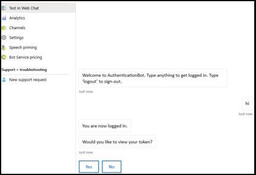

# <a name="add-authentication-to-your-teams-bot"></a><span data-ttu-id="7f6c5-103">Adicione autenticação ao seu bot Teams</span><span class="sxs-lookup"><span data-stu-id="7f6c5-103">Add authentication to your Teams bot</span></span>

<span data-ttu-id="7f6c5-104">Há momentos em que você pode precisar criar bots em Microsoft Teams que podem acessar recursos em nome do usuário, como um serviço de correio.</span><span class="sxs-lookup"><span data-stu-id="7f6c5-104">There are times when you may need to create bots in Microsoft Teams that can access resources on behalf of the user, such as a mail service.</span></span>

<span data-ttu-id="7f6c5-105">Este artigo demonstra como usar a autenticação V4 SDK do Azure Bot Service, com base no OAuth 2.0.</span><span class="sxs-lookup"><span data-stu-id="7f6c5-105">This article demonstrates how to use Azure Bot Service v4 SDK authentication, based on OAuth 2.0.</span></span> <span data-ttu-id="7f6c5-106">Isso torna mais fácil desenvolver um bot que pode usar tokens de autenticação com base nas credenciais do usuário.</span><span class="sxs-lookup"><span data-stu-id="7f6c5-106">This makes it easier to develop a bot that can use authentication tokens based on the user's credentials.</span></span> <span data-ttu-id="7f6c5-107">A chave em tudo isso é o uso de provedores de **identidade,** como veremos mais tarde.</span><span class="sxs-lookup"><span data-stu-id="7f6c5-107">Key in all this is the use of **identity providers**, as we will see later.</span></span>

<span data-ttu-id="7f6c5-108">O OAuth 2.0 é um padrão aberto para autenticação e autorização usadas pelo Azure Active Directory (Azure AD) e muitos outros provedores de identidade.</span><span class="sxs-lookup"><span data-stu-id="7f6c5-108">OAuth 2.0 is an open standard for authentication and authorization used by Azure Active Directory (Azure AD) and many other identity providers.</span></span> <span data-ttu-id="7f6c5-109">Um entendimento básico do OAuth 2.0 é um pré-requisito para trabalhar com autenticação em Teams.</span><span class="sxs-lookup"><span data-stu-id="7f6c5-109">A basic understanding of OAuth 2.0 is a prerequisite for working with authentication in Teams.</span></span>

<span data-ttu-id="7f6c5-110">Consulte [OAuth 2 Simplificado](https://aka.ms/oauth2-simplified) para um entendimento básico e [OAuth 2.0](https://oauth.net/2/) para a especificação completa.</span><span class="sxs-lookup"><span data-stu-id="7f6c5-110">See [OAuth 2 Simplified](https://aka.ms/oauth2-simplified) for a basic understanding, and [OAuth 2.0](https://oauth.net/2/) for the complete specification.</span></span>

<span data-ttu-id="7f6c5-111">Para obter mais informações sobre como o Azure Bot Service lida com a autenticação, consulte [a autenticação do usuário dentro de uma conversa](https://aka.ms/azure-bot-authentication).</span><span class="sxs-lookup"><span data-stu-id="7f6c5-111">For more information about how the Azure Bot Service handles authentication, see [User authentication within a conversation](https://aka.ms/azure-bot-authentication).</span></span>

<span data-ttu-id="7f6c5-112">Neste artigo você aprenderá:</span><span class="sxs-lookup"><span data-stu-id="7f6c5-112">In this article you'll learn:</span></span>

- <span data-ttu-id="7f6c5-113">**Como criar um bot habilitado para autenticação**.</span><span class="sxs-lookup"><span data-stu-id="7f6c5-113">**How to create an authentication-enabled bot**.</span></span> <span data-ttu-id="7f6c5-114">Você usará [cs-auth-sample][teams-auth-bot-cs] para lidar com credenciais de login do usuário e gerar o token de autenticação.</span><span class="sxs-lookup"><span data-stu-id="7f6c5-114">You'll use [cs-auth-sample][teams-auth-bot-cs] to handle user sign-in credentials and the generating the authentication token.</span></span>
- <span data-ttu-id="7f6c5-115">**Como implantar o bot no Azure e associá-lo a um provedor de identidade**.</span><span class="sxs-lookup"><span data-stu-id="7f6c5-115">**How to deploy the bot to Azure and associate it with an identity provider**.</span></span> <span data-ttu-id="7f6c5-116">O provedor emite um token com base em credenciais de login do usuário.</span><span class="sxs-lookup"><span data-stu-id="7f6c5-116">The provider issues a token based on user sign-in credentials.</span></span> <span data-ttu-id="7f6c5-117">O bot pode usar o token para acessar recursos, como um serviço de correio, que requerem autenticação.</span><span class="sxs-lookup"><span data-stu-id="7f6c5-117">The bot can use the token to access resources, such as a mail service, which require authentication.</span></span> <span data-ttu-id="7f6c5-118">Para obter mais informações, consulte [Microsoft Teams fluxo de autenticação para bots](auth-flow-bot.md).</span><span class="sxs-lookup"><span data-stu-id="7f6c5-118">For more information see  [Microsoft Teams authentication flow for bots](auth-flow-bot.md).</span></span>
- <span data-ttu-id="7f6c5-119">**Como integrar o bot dentro de Microsoft Teams**.</span><span class="sxs-lookup"><span data-stu-id="7f6c5-119">**How to integrate the bot within Microsoft Teams**.</span></span> <span data-ttu-id="7f6c5-120">Uma vez que o bot tenha sido integrado, você pode fazer login e trocar mensagens com ele em um chat.</span><span class="sxs-lookup"><span data-stu-id="7f6c5-120">Once the bot has been integrated, you can sign in and exchange messages with it in a chat.</span></span>

## <a name="prerequisites"></a><span data-ttu-id="7f6c5-121">Pré-requisitos</span><span class="sxs-lookup"><span data-stu-id="7f6c5-121">Prerequisites</span></span>

- <span data-ttu-id="7f6c5-122">Conhecimento do básico do [bot,][concept-basics] [estado de gestão,][concept-state] [biblioteca de diálogos][concept-dialogs]e como [implementar fluxo de conversação sequencial][simple-dialog].</span><span class="sxs-lookup"><span data-stu-id="7f6c5-122">Knowledge of [bot basics][concept-basics], [managing state][concept-state], the [dialogs library][concept-dialogs], and how to [implement sequential conversation flow][simple-dialog].</span></span>
- <span data-ttu-id="7f6c5-123">Conhecimento do desenvolvimento do Azure e OAuth 2.0.</span><span class="sxs-lookup"><span data-stu-id="7f6c5-123">Knowledge of Azure and OAuth 2.0 development.</span></span>
- <span data-ttu-id="7f6c5-124">As versões atuais de Visual Studio e Git.</span><span class="sxs-lookup"><span data-stu-id="7f6c5-124">The current versions of Visual Studio and Git.</span></span>
- <span data-ttu-id="7f6c5-125">Conta azul.</span><span class="sxs-lookup"><span data-stu-id="7f6c5-125">Azure account.</span></span> <span data-ttu-id="7f6c5-126">Se necessário, você pode criar uma [conta gratuita do Azure.](https://azure.microsoft.com/free/)</span><span class="sxs-lookup"><span data-stu-id="7f6c5-126">If needed, you can create an [Azure free account](https://azure.microsoft.com/free/).</span></span>
- <span data-ttu-id="7f6c5-127">A seguinte amostra:</span><span class="sxs-lookup"><span data-stu-id="7f6c5-127">The following sample:</span></span>

    | <span data-ttu-id="7f6c5-128">Amostra</span><span class="sxs-lookup"><span data-stu-id="7f6c5-128">Sample</span></span> | <span data-ttu-id="7f6c5-129">Versão BotBuilder</span><span class="sxs-lookup"><span data-stu-id="7f6c5-129">BotBuilder version</span></span> | <span data-ttu-id="7f6c5-130">Demonstra</span><span class="sxs-lookup"><span data-stu-id="7f6c5-130">Demonstrates</span></span> |
    |:---|:---:|:---|
    | <span data-ttu-id="7f6c5-131">**Autenticação de bot** em [cs-auth-sample][teams-auth-bot-cs]</span><span class="sxs-lookup"><span data-stu-id="7f6c5-131">**Bot authentication** in [cs-auth-sample][teams-auth-bot-cs]</span></span> | <span data-ttu-id="7f6c5-132">v4</span><span class="sxs-lookup"><span data-stu-id="7f6c5-132">v4</span></span> | <span data-ttu-id="7f6c5-133">Suporte ao OAuthCard</span><span class="sxs-lookup"><span data-stu-id="7f6c5-133">OAuthCard support</span></span> |
    | <span data-ttu-id="7f6c5-134">**Autenticação de bot** em [js-auth-sample][teams-auth-bot-js]</span><span class="sxs-lookup"><span data-stu-id="7f6c5-134">**Bot authentication** in [js-auth-sample][teams-auth-bot-js]</span></span> | <span data-ttu-id="7f6c5-135">v4</span><span class="sxs-lookup"><span data-stu-id="7f6c5-135">v4</span></span>| <span data-ttu-id="7f6c5-136">Suporte ao OAuthCard</span><span class="sxs-lookup"><span data-stu-id="7f6c5-136">OAuthCard support</span></span>  |
    | <span data-ttu-id="7f6c5-137">**Autenticação de bot** em [py-auth-sample][teams-auth-bot-py]</span><span class="sxs-lookup"><span data-stu-id="7f6c5-137">**Bot authentication** in [py-auth-sample][teams-auth-bot-py]</span></span> | <span data-ttu-id="7f6c5-138">v4</span><span class="sxs-lookup"><span data-stu-id="7f6c5-138">v4</span></span> | <span data-ttu-id="7f6c5-139">Suporte ao OAuthCard</span><span class="sxs-lookup"><span data-stu-id="7f6c5-139">OAuthCard support</span></span> |

## <a name="create-the-resource-group"></a><span data-ttu-id="7f6c5-140">Crie o grupo de recursos</span><span class="sxs-lookup"><span data-stu-id="7f6c5-140">Create the resource group</span></span>

<span data-ttu-id="7f6c5-141">O grupo de recursos e o plano de serviço não são estritamente necessários, mas permitem que você libere convenientemente os recursos que você cria.</span><span class="sxs-lookup"><span data-stu-id="7f6c5-141">The resource group and the service plan aren't strictly necessary, but they allow you to conveniently release the resources you create.</span></span> <span data-ttu-id="7f6c5-142">Esta é uma boa prática para manter seus recursos organizados e gerenciáveis.</span><span class="sxs-lookup"><span data-stu-id="7f6c5-142">This is good practice for keeping your resources organized and manageable.</span></span>

<span data-ttu-id="7f6c5-143">Você usa um grupo de recursos para criar recursos individuais para o Bot Framework.</span><span class="sxs-lookup"><span data-stu-id="7f6c5-143">You use a resource group to create individual resources for the Bot Framework.</span></span> <span data-ttu-id="7f6c5-144">Para desempenho, garanta que esses recursos estejam localizados na mesma região do Azure.</span><span class="sxs-lookup"><span data-stu-id="7f6c5-144">For performance, ensure that these resources are located in the same Azure region.</span></span>

1. <span data-ttu-id="7f6c5-145">No seu navegador, entre no portal do [**Azure.**][azure-portal]</span><span class="sxs-lookup"><span data-stu-id="7f6c5-145">In your browser, sign into the [**Azure portal**][azure-portal].</span></span>
1. <span data-ttu-id="7f6c5-146">No painel de navegação à esquerda, selecione **Grupos de recursos**.</span><span class="sxs-lookup"><span data-stu-id="7f6c5-146">In the left navigation panel, select **Resource groups**.</span></span>
1. <span data-ttu-id="7f6c5-147">No canto superior esquerdo da janela exibida, selecione **Adicionar** guia para criar um novo grupo de recursos.</span><span class="sxs-lookup"><span data-stu-id="7f6c5-147">In the upper left of the displayed window, select **Add** tab to create a new resource group.</span></span> <span data-ttu-id="7f6c5-148">Você será solicitado a fornecer o seguinte:</span><span class="sxs-lookup"><span data-stu-id="7f6c5-148">You'll be prompted to provide the following:</span></span>
    1. <span data-ttu-id="7f6c5-149">**Assinatura**.</span><span class="sxs-lookup"><span data-stu-id="7f6c5-149">**Subscription**.</span></span> <span data-ttu-id="7f6c5-150">Use sua assinatura existente.</span><span class="sxs-lookup"><span data-stu-id="7f6c5-150">Use your existing subscription.</span></span>
    1. <span data-ttu-id="7f6c5-151">**Grupo de recursos**.</span><span class="sxs-lookup"><span data-stu-id="7f6c5-151">**Resource group**.</span></span> <span data-ttu-id="7f6c5-152">Digite o nome do grupo de recursos.</span><span class="sxs-lookup"><span data-stu-id="7f6c5-152">Enter the name for the resource group.</span></span> <span data-ttu-id="7f6c5-153">Um exemplo pode ser  *o TeamsResourceGroup*.</span><span class="sxs-lookup"><span data-stu-id="7f6c5-153">An example could be  *TeamsResourceGroup*.</span></span> <span data-ttu-id="7f6c5-154">Lembre-se que o nome deve ser único.</span><span class="sxs-lookup"><span data-stu-id="7f6c5-154">Remember that the name must be unique.</span></span>
    1. <span data-ttu-id="7f6c5-155">No menu suspenso **da Região,** selecione *West US* ou uma região próxima às suas aplicações.</span><span class="sxs-lookup"><span data-stu-id="7f6c5-155">From the **Region** drop-down menu, select *West US*, or a region close to your applications.</span></span>
    1. <span data-ttu-id="7f6c5-156">Selecione o **botão Revisão e crie.**</span><span class="sxs-lookup"><span data-stu-id="7f6c5-156">Select the **Review and create** button.</span></span> <span data-ttu-id="7f6c5-157">Você deve ver um banner que diz *validação passada*.</span><span class="sxs-lookup"><span data-stu-id="7f6c5-157">You should see a banner that reads *Validation passed*.</span></span>
    1. <span data-ttu-id="7f6c5-158">Selecione o botão **Criar.**</span><span class="sxs-lookup"><span data-stu-id="7f6c5-158">Select the **Create** button.</span></span> <span data-ttu-id="7f6c5-159">Pode levar alguns minutos para criar o grupo de recursos.</span><span class="sxs-lookup"><span data-stu-id="7f6c5-159">It may take a few minutes to create the resource group.</span></span>

> [!TIP]
> <span data-ttu-id="7f6c5-160">Assim como com os recursos que você criará mais tarde neste tutorial, é uma boa ideia fixar esse grupo de recursos no seu painel para fácil acesso.</span><span class="sxs-lookup"><span data-stu-id="7f6c5-160">As with the resources you'll create later in this tutorial, it's a good idea to pin this resource group to your dashboard for easy access.</span></span> <span data-ttu-id="7f6c5-161">Se quiser fazê-lo, selecione o ícone de pino &#128204; no canto superior direito do painel.</span><span class="sxs-lookup"><span data-stu-id="7f6c5-161">If you'd like to do so, select the pin icon &#128204; in the upper right of the dashboard.</span></span>

## <a name="create-the-service-plan"></a><span data-ttu-id="7f6c5-162">Crie o plano de serviço</span><span class="sxs-lookup"><span data-stu-id="7f6c5-162">Create the service plan</span></span>

1. <span data-ttu-id="7f6c5-163">No [**portal Azure**][azure-portal], no painel de navegação à esquerda, selecione **Criar um recurso**.</span><span class="sxs-lookup"><span data-stu-id="7f6c5-163">In the [**Azure portal**][azure-portal], on the left navigation panel, select **Create a resource**.</span></span>
1. <span data-ttu-id="7f6c5-164">Na caixa de pesquisa, digite *App Service Plan*.</span><span class="sxs-lookup"><span data-stu-id="7f6c5-164">In the search box, type *App Service Plan*.</span></span> <span data-ttu-id="7f6c5-165">Selecione o cartão **App Service Plan** a partir dos resultados da pesquisa.</span><span class="sxs-lookup"><span data-stu-id="7f6c5-165">Select the **App Service Plan** card from the search results.</span></span>
1. <span data-ttu-id="7f6c5-166">Selecione **Criar**.</span><span class="sxs-lookup"><span data-stu-id="7f6c5-166">Select **Create**.</span></span>
1. <span data-ttu-id="7f6c5-167">Você será solicitado a fornecer as seguintes informações:</span><span class="sxs-lookup"><span data-stu-id="7f6c5-167">You'll be asked to provide the following information:</span></span>
    1. <span data-ttu-id="7f6c5-168">**Assinatura**.</span><span class="sxs-lookup"><span data-stu-id="7f6c5-168">**Subscription**.</span></span> <span data-ttu-id="7f6c5-169">Você pode usar uma assinatura existente.</span><span class="sxs-lookup"><span data-stu-id="7f6c5-169">You can use an existing subscription.</span></span>
    1. <span data-ttu-id="7f6c5-170">**Grupo de Recursos**.</span><span class="sxs-lookup"><span data-stu-id="7f6c5-170">**Resource Group**.</span></span> <span data-ttu-id="7f6c5-171">Selecione o grupo que você criou anteriormente.</span><span class="sxs-lookup"><span data-stu-id="7f6c5-171">Select the group you created earlier.</span></span>
    1. <span data-ttu-id="7f6c5-172">**Nome.**</span><span class="sxs-lookup"><span data-stu-id="7f6c5-172">**Name**.</span></span> <span data-ttu-id="7f6c5-173">Digite o nome do plano de serviço.</span><span class="sxs-lookup"><span data-stu-id="7f6c5-173">Enter the name for the service plan.</span></span> <span data-ttu-id="7f6c5-174">Um exemplo pode ser  *o TeamsServicePlan*.</span><span class="sxs-lookup"><span data-stu-id="7f6c5-174">An example could be  *TeamsServicePlan*.</span></span> <span data-ttu-id="7f6c5-175">Lembre-se que o nome deve ser único, dentro do grupo.</span><span class="sxs-lookup"><span data-stu-id="7f6c5-175">Remember that the name must be unique, within the group.</span></span>
    1. <span data-ttu-id="7f6c5-176">**Sistema Operacional**.</span><span class="sxs-lookup"><span data-stu-id="7f6c5-176">**Operating System**.</span></span> <span data-ttu-id="7f6c5-177">Selecione *Windows* ou o sistema operacional aplicável.</span><span class="sxs-lookup"><span data-stu-id="7f6c5-177">Select *Windows* or your applicable OS.</span></span>
    1. <span data-ttu-id="7f6c5-178">**Região**.</span><span class="sxs-lookup"><span data-stu-id="7f6c5-178">**Region**.</span></span> <span data-ttu-id="7f6c5-179">Selecione *West US* ou uma região próxima às suas aplicações.</span><span class="sxs-lookup"><span data-stu-id="7f6c5-179">Select *West US* or a region close to your applications.</span></span>
    1. <span data-ttu-id="7f6c5-180">**Nível de preços**.</span><span class="sxs-lookup"><span data-stu-id="7f6c5-180">**Pricing Tier**.</span></span> <span data-ttu-id="7f6c5-181">Certifique-se de que *o Standard S1* está selecionado.</span><span class="sxs-lookup"><span data-stu-id="7f6c5-181">Make sure that *Standard S1* is selected.</span></span> <span data-ttu-id="7f6c5-182">Este deve ser o valor padrão.</span><span class="sxs-lookup"><span data-stu-id="7f6c5-182">This should be the default value.</span></span>
    1. <span data-ttu-id="7f6c5-183">Selecione o **botão Revisão e crie.**</span><span class="sxs-lookup"><span data-stu-id="7f6c5-183">Select the **Review and create** button.</span></span> <span data-ttu-id="7f6c5-184">Você deve ver um banner que diz *validação passada*.</span><span class="sxs-lookup"><span data-stu-id="7f6c5-184">You should see a banner that reads *Validation passed*.</span></span>
    1. <span data-ttu-id="7f6c5-185">Selecione **Criar**.</span><span class="sxs-lookup"><span data-stu-id="7f6c5-185">Select **Create**.</span></span> <span data-ttu-id="7f6c5-186">Pode levar alguns minutos para criar o plano de serviço do aplicativo.</span><span class="sxs-lookup"><span data-stu-id="7f6c5-186">It may take a few minutes to create the app service plan.</span></span> <span data-ttu-id="7f6c5-187">O plano será listado no grupo de recursos.</span><span class="sxs-lookup"><span data-stu-id="7f6c5-187">The plan will be listed in the resource group.</span></span>

## <a name="create-the-bot-channels-registration"></a><span data-ttu-id="7f6c5-188">Crie o registro dos canais de bot</span><span class="sxs-lookup"><span data-stu-id="7f6c5-188">Create the bot channels registration</span></span>

<span data-ttu-id="7f6c5-189">O registro de canais de bot registra seu serviço web como um bot com o Bot Framework, desde que você tenha uma senha de Aplicativo microsoft e app (segredo do cliente).</span><span class="sxs-lookup"><span data-stu-id="7f6c5-189">The bot channels registration registers your web service as a bot with the Bot Framework, provided you have a Microsoft App Id and App password (client secret).</span></span>

> [!IMPORTANT]
> <span data-ttu-id="7f6c5-190">Você só precisa registrar seu bot se ele não estiver hospedado no Azure.</span><span class="sxs-lookup"><span data-stu-id="7f6c5-190">You only need to register your bot if it is not hosted in Azure.</span></span> <span data-ttu-id="7f6c5-191">Se você [criou um bot](/azure/bot-service/abs-quickstart?view=azure-bot-service-4.0&viewFallbackFrom=azure-bot-service-3.0&preserve-view=true) através do portal Azure, então ele já está cadastrado no serviço.</span><span class="sxs-lookup"><span data-stu-id="7f6c5-191">If you [created a bot](/azure/bot-service/abs-quickstart?view=azure-bot-service-4.0&viewFallbackFrom=azure-bot-service-3.0&preserve-view=true) through the Azure portal then it is already registered with the service.</span></span> <span data-ttu-id="7f6c5-192">Se você criou seu bot através do [Bot Framework](https://dev.botframework.com/bots/new) ou [AppStudio,](~/concepts/build-and-test/app-studio-overview.md) seu bot não está registrado no Azure.</span><span class="sxs-lookup"><span data-stu-id="7f6c5-192">If you created your bot through the [Bot Framework](https://dev.botframework.com/bots/new) or [AppStudio](~/concepts/build-and-test/app-studio-overview.md) your bot isn't registered in Azure.</span></span>

[!INCLUDE [bot channels registration steps](~/includes/bots/azure-bot-channels-registration.md)]

> [!NOTE]
> <span data-ttu-id="7f6c5-193">O recurso de registro de canais de bot mostrará a região **global** mesmo se você selecionou o Oeste dos EUA.</span><span class="sxs-lookup"><span data-stu-id="7f6c5-193">The Bot Channels Registration resource will show the **Global** region even if you selected West US.</span></span> <span data-ttu-id="7f6c5-194">Isso é esperado.</span><span class="sxs-lookup"><span data-stu-id="7f6c5-194">This is expected.</span></span>

<span data-ttu-id="7f6c5-195">Para obter mais informações, consulte [Criar um bot para Teams](../create-a-bot-for-teams.md).</span><span class="sxs-lookup"><span data-stu-id="7f6c5-195">For more information, see [Create a bot for Teams](../create-a-bot-for-teams.md).</span></span>

## <a name="create-the-identity-provider"></a><span data-ttu-id="7f6c5-196">Crie o provedor de identidade</span><span class="sxs-lookup"><span data-stu-id="7f6c5-196">Create the identity provider</span></span>

<span data-ttu-id="7f6c5-197">Você precisa de um provedor de identidade que possa ser usado para autenticação.</span><span class="sxs-lookup"><span data-stu-id="7f6c5-197">You need an identity provider that can be used for authentication.</span></span>
<span data-ttu-id="7f6c5-198">Neste procedimento, você usará um provedor de Azure AD; outros provedores de identidade suportados pelo Azure AD também podem ser usados.</span><span class="sxs-lookup"><span data-stu-id="7f6c5-198">In this procedure you'll use an Azure AD provider; other Azure AD supported identity providers can also be used.</span></span>

1. <span data-ttu-id="7f6c5-199">No [**portal do Azure,**][azure-portal]no painel de navegação à esquerda, selecione **Azure Active Directory**.</span><span class="sxs-lookup"><span data-stu-id="7f6c5-199">In the [**Azure portal**][azure-portal], on the left navigation panel, select **Azure Active Directory**.</span></span>
    > [!TIP]
    > <span data-ttu-id="7f6c5-200">Você precisará criar e registrar este recurso Azure AD em um inquilino no qual você pode consentir em delegar permissões solicitadas por um aplicativo.</span><span class="sxs-lookup"><span data-stu-id="7f6c5-200">You'll need to create and register this Azure AD resource in a tenant in which you can consent to delegate permissions requested by an application.</span></span>
    > <span data-ttu-id="7f6c5-201">Para obter instruções sobre a criação de um inquilino, consulte [Acessar o portal e criar um inquilino](/azure/active-directory/fundamentals/active-directory-access-create-new-tenant).</span><span class="sxs-lookup"><span data-stu-id="7f6c5-201">For instruction on creating a tenant, see [Access the portal and create a tenant](/azure/active-directory/fundamentals/active-directory-access-create-new-tenant).</span></span>
1. <span data-ttu-id="7f6c5-202">No painel esquerdo, selecione **registros de aplicativos**.</span><span class="sxs-lookup"><span data-stu-id="7f6c5-202">In the left panel, select **App registrations**.</span></span>
1. <span data-ttu-id="7f6c5-203">No painel direito, selecione a guia **de registro Novo,** no canto superior esquerdo.</span><span class="sxs-lookup"><span data-stu-id="7f6c5-203">In the right panel, select the **New registration** tab, in the upper left.</span></span>
1. <span data-ttu-id="7f6c5-204">Você será solicitado a fornecer as seguintes informações:</span><span class="sxs-lookup"><span data-stu-id="7f6c5-204">You'll be asked to provide the following information:</span></span>
   1. <span data-ttu-id="7f6c5-205">**Nome.**</span><span class="sxs-lookup"><span data-stu-id="7f6c5-205">**Name**.</span></span> <span data-ttu-id="7f6c5-206">Digite o nome da inscrição.</span><span class="sxs-lookup"><span data-stu-id="7f6c5-206">Enter the name for the application.</span></span> <span data-ttu-id="7f6c5-207">Um exemplo pode ser  *o BotTeamsIdentity*.</span><span class="sxs-lookup"><span data-stu-id="7f6c5-207">An example could be  *BotTeamsIdentity*.</span></span> <span data-ttu-id="7f6c5-208">Lembre-se que o nome deve ser único.</span><span class="sxs-lookup"><span data-stu-id="7f6c5-208">Remember that the name must be unique.</span></span>
   1. <span data-ttu-id="7f6c5-209">Selecione os **tipos de conta suportada** para sua aplicação.</span><span class="sxs-lookup"><span data-stu-id="7f6c5-209">Select the **Supported account types** for your application.</span></span> <span data-ttu-id="7f6c5-210">Selecione *Contas em qualquer diretório organizacional (qualquer diretório de Azure AD - Multitenant) e contas pessoais da Microsoft (por exemplo, Skype, Xbox)*.</span><span class="sxs-lookup"><span data-stu-id="7f6c5-210">Select *Accounts in any organizational directory (Any Azure AD directory - Multitenant) and personal Microsoft accounts (e.g. Skype, Xbox)*.</span></span>
   1. <span data-ttu-id="7f6c5-211">Para o **Redirecionamento URI**:</span><span class="sxs-lookup"><span data-stu-id="7f6c5-211">For the **Redirect URI**:</span></span><br/>
       <span data-ttu-id="7f6c5-212">&#x2713;Select **Web**.</span><span class="sxs-lookup"><span data-stu-id="7f6c5-212">&#x2713;Select **Web**.</span></span> <br/>
       <span data-ttu-id="7f6c5-213">&#x2713; defina a URL para `https://token.botframework.com/.auth/web/redirect` .</span><span class="sxs-lookup"><span data-stu-id="7f6c5-213">&#x2713; Set the URL to `https://token.botframework.com/.auth/web/redirect`.</span></span>
   1. <span data-ttu-id="7f6c5-214">Selecione **Registrar**.</span><span class="sxs-lookup"><span data-stu-id="7f6c5-214">Select **Register**.</span></span>

1. <span data-ttu-id="7f6c5-215">Uma vez criado, o Azure exibe a página **Visão Geral** do aplicativo.</span><span class="sxs-lookup"><span data-stu-id="7f6c5-215">Once it is created, Azure displays the **Overview** page for the app.</span></span> <span data-ttu-id="7f6c5-216">Copie e salve as seguintes informações em um arquivo:</span><span class="sxs-lookup"><span data-stu-id="7f6c5-216">Copy and save the following information to a file:</span></span>

    1. <span data-ttu-id="7f6c5-217">O valor **de ID do Aplicativo (cliente).**</span><span class="sxs-lookup"><span data-stu-id="7f6c5-217">The **Application (client) ID** value.</span></span> <span data-ttu-id="7f6c5-218">Você usará esse valor mais tarde como o *ID do Cliente* ao registrar este aplicativo de identidade Azure com o seu bot.</span><span class="sxs-lookup"><span data-stu-id="7f6c5-218">You'll use this value later as the *Client ID* when you register this Azure identity application with your bot.</span></span>
    1. <span data-ttu-id="7f6c5-219">O valor **de ID do Diretório (inquilino).**</span><span class="sxs-lookup"><span data-stu-id="7f6c5-219">The **Directory (tenant) ID** value.</span></span> <span data-ttu-id="7f6c5-220">Você também usará esse valor mais tarde como o *ID do Inquilino* para registrar este aplicativo de identidade Azure com o seu bot.</span><span class="sxs-lookup"><span data-stu-id="7f6c5-220">You'll also use this value later as the *Tenant ID* to register this Azure identity application with your bot.</span></span>

1. <span data-ttu-id="7f6c5-221">No painel esquerdo, selecione **Certificados & segredos** para criar um segredo de cliente para sua aplicação.</span><span class="sxs-lookup"><span data-stu-id="7f6c5-221">In the left panel, select **Certificates & secrets** to create a client secret for your application.</span></span>

   1. <span data-ttu-id="7f6c5-222">Em **segredos do Cliente,** selecione &#x2795; **novo segredo do cliente**.</span><span class="sxs-lookup"><span data-stu-id="7f6c5-222">Under **Client secrets**, select &#x2795; **New client secret**.</span></span>
   1. <span data-ttu-id="7f6c5-223">Adicione uma descrição para identificar esse segredo de outras pessoas que você pode precisar criar para este aplicativo, como *o aplicativo de identidade Bot em Teams*.</span><span class="sxs-lookup"><span data-stu-id="7f6c5-223">Add a description to identify this secret from others you might need to create for this app, such as *Bot identity app in Teams*.</span></span>
   1. <span data-ttu-id="7f6c5-224">O conjunto **expira** para sua seleção.</span><span class="sxs-lookup"><span data-stu-id="7f6c5-224">Set **Expires** to your selection.</span></span>
   1. <span data-ttu-id="7f6c5-225">Selecione **Adicionar**.</span><span class="sxs-lookup"><span data-stu-id="7f6c5-225">Select **Add**.</span></span>
   1. <span data-ttu-id="7f6c5-226">Antes de sair desta página, **regisse o segredo.**</span><span class="sxs-lookup"><span data-stu-id="7f6c5-226">Before leaving this page, **record the secret**.</span></span> <span data-ttu-id="7f6c5-227">Você usará esse valor mais tarde como o segredo do _Cliente_ quando registrar seu aplicativo Azure AD com seu bot.</span><span class="sxs-lookup"><span data-stu-id="7f6c5-227">You'll use this value later as the _Client secret_ when you register your Azure AD application with your bot.</span></span>

### <a name="configure-the-identity-provider-connection-and-register-it-with-the-bot"></a><span data-ttu-id="7f6c5-228">Configure a conexão do provedor de identidade e registre-a no bot</span><span class="sxs-lookup"><span data-stu-id="7f6c5-228">Configure the identity provider connection and register it with the bot</span></span>

<span data-ttu-id="7f6c5-229">Nota- há duas opções para provedores de serviços aqui-Azure AD V1 e Azure AD V2.</span><span class="sxs-lookup"><span data-stu-id="7f6c5-229">Note-there are two options for Service Providers here-Azure AD V1 and Azure AD V2.</span></span>  <span data-ttu-id="7f6c5-230">As diferenças entre os dois provedores são resumidas [aqui,](/azure/active-directory/azuread-dev/azure-ad-endpoint-comparison)mas, em geral, a V2 fornece mais flexibilidade no que diz respeito à alteração das permissões de bots.</span><span class="sxs-lookup"><span data-stu-id="7f6c5-230">The differences between the two providers are summarized [here](/azure/active-directory/azuread-dev/azure-ad-endpoint-comparison), but in general, V2 provides more flexibility with respect to changing bot permissions.</span></span>  <span data-ttu-id="7f6c5-231">Graph As permissões de API são listadas no campo de escopos e, à medida que novas são adicionadas, os bots permitirão que os usuários consentam com as novas permissões no próximo login.</span><span class="sxs-lookup"><span data-stu-id="7f6c5-231">Graph API permissions are listed in the scopes field, and as new ones are added, bots will allow users to consent to the new permissions on the next sign in.</span></span>  <span data-ttu-id="7f6c5-232">Para V1, o consentimento do bot deve ser excluído pelo usuário para que novas permissões sejam solicitadas na caixa de diálogo OAuth.</span><span class="sxs-lookup"><span data-stu-id="7f6c5-232">For V1, the bot consent must be deleted by the user for new permissions to be prompted in the OAuth dialog.</span></span> 

#### <a name="azure-ad-v1"></a><span data-ttu-id="7f6c5-233">Azure AD V1</span><span class="sxs-lookup"><span data-stu-id="7f6c5-233">Azure AD V1</span></span>

1. <span data-ttu-id="7f6c5-234">No [**portal do Azure,**][azure-portal]selecione seu grupo de recursos no painel.</span><span class="sxs-lookup"><span data-stu-id="7f6c5-234">In the [**Azure portal**][azure-portal], select your resource group from the dashboard.</span></span>
1. <span data-ttu-id="7f6c5-235">Selecione seu link de registro de canal de bot.</span><span class="sxs-lookup"><span data-stu-id="7f6c5-235">Select your bot channel registration link.</span></span>
1. <span data-ttu-id="7f6c5-236">Abra a página de recursos e selecione **Configuração** em **Configurações**.</span><span class="sxs-lookup"><span data-stu-id="7f6c5-236">Open the resource page and select **Configuration** under **Settings**.</span></span> 
1. <span data-ttu-id="7f6c5-237">Selecione **Adicionar Configurações de conexão OAuth**.</span><span class="sxs-lookup"><span data-stu-id="7f6c5-237">Select **Add OAuth Connection Settings**.</span></span>    
<span data-ttu-id="7f6c5-238">A imagem a seguir exibe a seleção correspondente na página de recursos:</span><span class="sxs-lookup"><span data-stu-id="7f6c5-238">The following image displays the corresponding selection in the resource page:</span></span>  
<span data-ttu-id="7f6c5-239"></span><span class="sxs-lookup"><span data-stu-id="7f6c5-239"></span></span>
1. <span data-ttu-id="7f6c5-240">Preencha o formulário de acordo com as instruções a seguir:</span><span class="sxs-lookup"><span data-stu-id="7f6c5-240">Complete the form as follows:</span></span>

    1. <span data-ttu-id="7f6c5-241">**Nome.**</span><span class="sxs-lookup"><span data-stu-id="7f6c5-241">**Name**.</span></span> <span data-ttu-id="7f6c5-242">Digite um nome para a conexão.</span><span class="sxs-lookup"><span data-stu-id="7f6c5-242">Enter a name for the connection.</span></span> <span data-ttu-id="7f6c5-243">Você usará esse nome no seu bot no `appsettings.json` arquivo.</span><span class="sxs-lookup"><span data-stu-id="7f6c5-243">You'll use this name in your bot in the `appsettings.json` file.</span></span> <span data-ttu-id="7f6c5-244">Por exemplo, *BotTeamsAuthADv1*.</span><span class="sxs-lookup"><span data-stu-id="7f6c5-244">For example *BotTeamsAuthADv1*.</span></span>
    1. <span data-ttu-id="7f6c5-245">**Prestador de Serviços**.</span><span class="sxs-lookup"><span data-stu-id="7f6c5-245">**Service Provider**.</span></span> <span data-ttu-id="7f6c5-246">Selecione **Azure Active Directory**.</span><span class="sxs-lookup"><span data-stu-id="7f6c5-246">Select **Azure Active Directory**.</span></span> <span data-ttu-id="7f6c5-247">Uma vez selecionados, os campos específicos do Azure AD serão exibidos.</span><span class="sxs-lookup"><span data-stu-id="7f6c5-247">Once you select this, the Azure AD-specific fields will be displayed.</span></span>
    1. <span data-ttu-id="7f6c5-248">**Id cliente**. Digite o ID do aplicativo (cliente) que você gravou para o seu aplicativo de provedor de identidade Azure nas etapas acima.</span><span class="sxs-lookup"><span data-stu-id="7f6c5-248">**Client id**. Enter the Application (client) ID that you recorded for your Azure identity provider app in the steps above.</span></span>
    1. <span data-ttu-id="7f6c5-249">**Segredo do cliente.**</span><span class="sxs-lookup"><span data-stu-id="7f6c5-249">**Client secret**.</span></span> <span data-ttu-id="7f6c5-250">Digite o segredo que você gravou para o seu aplicativo de provedor de identidade Azure nas etapas acima.</span><span class="sxs-lookup"><span data-stu-id="7f6c5-250">Enter the secret that you recorded for your Azure identity provider app in the steps above.</span></span>
    1. <span data-ttu-id="7f6c5-251">**Tipo de Subvenção**.</span><span class="sxs-lookup"><span data-stu-id="7f6c5-251">**Grant Type**.</span></span> <span data-ttu-id="7f6c5-252">Entre `authorization_code` .</span><span class="sxs-lookup"><span data-stu-id="7f6c5-252">Enter `authorization_code`.</span></span>
    1. <span data-ttu-id="7f6c5-253">**URL de login**.</span><span class="sxs-lookup"><span data-stu-id="7f6c5-253">**Login URL**.</span></span> <span data-ttu-id="7f6c5-254">Entre `https://login.microsoftonline.com` .</span><span class="sxs-lookup"><span data-stu-id="7f6c5-254">Enter `https://login.microsoftonline.com`.</span></span>
    1. <span data-ttu-id="7f6c5-255">**ID do inquilino**, digite o **ID do Diretório (inquilino)** que você gravou anteriormente para o seu aplicativo de identidade Azure ou **comum,** dependendo do tipo de conta suportada selecionada quando você criou o aplicativo do provedor de identidade.</span><span class="sxs-lookup"><span data-stu-id="7f6c5-255">**Tenant ID**, enter the **Directory (tenant) ID** that you recorded earlier for your Azure identity app or **common** depending on the supported account type selected when you created the identity provider app.</span></span> <span data-ttu-id="7f6c5-256">Para decidir qual valor atribuir siga esses critérios:</span><span class="sxs-lookup"><span data-stu-id="7f6c5-256">To decide which value to assign follow these criteria:</span></span>

        - <span data-ttu-id="7f6c5-257">Se você selecionou contas *neste diretório organizacional apenas (apenas Microsoft - Único inquilino)* ou *Contas em qualquer diretório organizacional (diretório Microsoft AAD - Multi tenant)* digite o **ID do inquilino** que você gravou anteriormente para o aplicativo AAD.</span><span class="sxs-lookup"><span data-stu-id="7f6c5-257">If you selected either *Accounts in this organizational directory only (Microsoft only - Single tenant)* or *Accounts in any organizational directory(Microsoft AAD directory - Multi tenant)* enter the **tenant ID** you recorded earlier for the AAD app.</span></span> <span data-ttu-id="7f6c5-258">Este será o inquilino associado aos usuários que podem ser autenticados.</span><span class="sxs-lookup"><span data-stu-id="7f6c5-258">This will be the tenant associated with the users who can be authenticated.</span></span>

        - <span data-ttu-id="7f6c5-259">Se você selecionou *Contas em qualquer diretório organizacional (qualquer diretório AAD - Multi tenant e contas pessoais da Microsoft, por exemplo, Skype, Xbox, Outlook)* digite a palavra **comum** em vez de um ID de inquilino.</span><span class="sxs-lookup"><span data-stu-id="7f6c5-259">If you selected *Accounts in any organizational directory (Any AAD directory - Multi tenant and personal Microsoft accounts e.g. Skype, Xbox, Outlook)* enter the word **common** instead of a tenant ID.</span></span> <span data-ttu-id="7f6c5-260">Caso contrário, o aplicativo AAD verificará através do inquilino cujo ID foi selecionado e excluirá contas pessoais da Microsoft.</span><span class="sxs-lookup"><span data-stu-id="7f6c5-260">Otherwise, the AAD app will verify through the tenant whose ID was selected and exclude personal Microsoft accounts.</span></span>

    <span data-ttu-id="7f6c5-261">h.</span><span class="sxs-lookup"><span data-stu-id="7f6c5-261">h.</span></span> <span data-ttu-id="7f6c5-262">Para **URL de recursos,** digite `https://graph.microsoft.com/` .</span><span class="sxs-lookup"><span data-stu-id="7f6c5-262">For **Resource URL**, enter `https://graph.microsoft.com/`.</span></span> <span data-ttu-id="7f6c5-263">Isso não é usado na amostra de código atual.</span><span class="sxs-lookup"><span data-stu-id="7f6c5-263">This is not used in the current code sample.</span></span>  
    <span data-ttu-id="7f6c5-264">i.</span><span class="sxs-lookup"><span data-stu-id="7f6c5-264">i.</span></span> <span data-ttu-id="7f6c5-265">Deixe **scopes** em branco.</span><span class="sxs-lookup"><span data-stu-id="7f6c5-265">Leave **Scopes** blank.</span></span> <span data-ttu-id="7f6c5-266">A imagem a seguir é um exemplo:</span><span class="sxs-lookup"><span data-stu-id="7f6c5-266">The following image is an example:</span></span>

    

1. <span data-ttu-id="7f6c5-268">Selecione **Salvar**.</span><span class="sxs-lookup"><span data-stu-id="7f6c5-268">Select **Save**.</span></span>

#### <a name="azure-ad-v2"></a><span data-ttu-id="7f6c5-269">Azure AD V2</span><span class="sxs-lookup"><span data-stu-id="7f6c5-269">Azure AD V2</span></span>

1. <span data-ttu-id="7f6c5-270">No [**portal do Azure,**][azure-portal]selecione seu grupo de recursos no painel.</span><span class="sxs-lookup"><span data-stu-id="7f6c5-270">In the [**Azure portal**][azure-portal], select your resource group from the dashboard.</span></span>
1. <span data-ttu-id="7f6c5-271">Selecione seu link de registro de canal de bot.</span><span class="sxs-lookup"><span data-stu-id="7f6c5-271">Select your bot channel registration link.</span></span>
1. <span data-ttu-id="7f6c5-272">Abra a página de recursos e selecione **Configuração** em **Configurações**.</span><span class="sxs-lookup"><span data-stu-id="7f6c5-272">Open the resource page and select **Configuration** under **Settings**.</span></span> 
1. <span data-ttu-id="7f6c5-273">Selecione **Adicionar Configurações de conexão OAuth**.</span><span class="sxs-lookup"><span data-stu-id="7f6c5-273">Select **Add OAuth Connection Settings**.</span></span>  
<span data-ttu-id="7f6c5-274">A imagem a seguir exibe a seleção correspondente na página de recursos:</span><span class="sxs-lookup"><span data-stu-id="7f6c5-274">The following image displays the corresponding selection in the resource page:</span></span>        
<span data-ttu-id="7f6c5-275"></span><span class="sxs-lookup"><span data-stu-id="7f6c5-275"></span></span> 

1. <span data-ttu-id="7f6c5-276">Preencha o formulário de acordo com as instruções a seguir:</span><span class="sxs-lookup"><span data-stu-id="7f6c5-276">Complete the form as follows:</span></span>

    1. <span data-ttu-id="7f6c5-277">**Nome.**</span><span class="sxs-lookup"><span data-stu-id="7f6c5-277">**Name**.</span></span> <span data-ttu-id="7f6c5-278">Digite um nome para a conexão.</span><span class="sxs-lookup"><span data-stu-id="7f6c5-278">Enter a name for the connection.</span></span> <span data-ttu-id="7f6c5-279">Você usará esse nome no seu bot no `appsettings.json` arquivo.</span><span class="sxs-lookup"><span data-stu-id="7f6c5-279">You'll use this name in your bot in the `appsettings.json` file.</span></span> <span data-ttu-id="7f6c5-280">Por exemplo, *BotTeamsAuthADv2*.</span><span class="sxs-lookup"><span data-stu-id="7f6c5-280">For example *BotTeamsAuthADv2*.</span></span>
    1. <span data-ttu-id="7f6c5-281">**Prestador de Serviços**.</span><span class="sxs-lookup"><span data-stu-id="7f6c5-281">**Service Provider**.</span></span> <span data-ttu-id="7f6c5-282">Selecione **Azure Active Directory v2**.</span><span class="sxs-lookup"><span data-stu-id="7f6c5-282">Select **Azure Active Directory v2**.</span></span> <span data-ttu-id="7f6c5-283">Uma vez selecionados, os campos específicos do Azure AD serão exibidos.</span><span class="sxs-lookup"><span data-stu-id="7f6c5-283">Once you select this, the Azure AD-specific fields will be displayed.</span></span>
    1. <span data-ttu-id="7f6c5-284">**Id cliente**. Digite o ID do aplicativo (cliente) que você gravou para o seu aplicativo de provedor de identidade Azure nas etapas acima.</span><span class="sxs-lookup"><span data-stu-id="7f6c5-284">**Client id**. Enter the Application (client) ID that you recorded for your Azure identity provider app in the steps above.</span></span>
    1. <span data-ttu-id="7f6c5-285">**Segredo do cliente.**</span><span class="sxs-lookup"><span data-stu-id="7f6c5-285">**Client secret**.</span></span> <span data-ttu-id="7f6c5-286">Digite o segredo que você gravou para o seu aplicativo de provedor de identidade Azure nas etapas acima.</span><span class="sxs-lookup"><span data-stu-id="7f6c5-286">Enter the secret that you recorded for your Azure identity provider app in the steps above.</span></span>
    1. <span data-ttu-id="7f6c5-287">**URL de Exchange de token**.</span><span class="sxs-lookup"><span data-stu-id="7f6c5-287">**Token Exchange URL**.</span></span> <span data-ttu-id="7f6c5-288">Deixe isso em branco.</span><span class="sxs-lookup"><span data-stu-id="7f6c5-288">Leave this blank.</span></span>
    1. <span data-ttu-id="7f6c5-289">**ID do inquilino**, digite o **ID do Diretório (inquilino)** que você gravou anteriormente para o seu aplicativo de identidade Azure ou **comum,** dependendo do tipo de conta suportada selecionada quando você criou o aplicativo do provedor de identidade.</span><span class="sxs-lookup"><span data-stu-id="7f6c5-289">**Tenant ID**, enter the **Directory (tenant) ID** that you recorded earlier for your Azure identity app or **common** depending on the supported account type selected when you created the identity provider app.</span></span> <span data-ttu-id="7f6c5-290">Para decidir qual valor atribuir siga esses critérios:</span><span class="sxs-lookup"><span data-stu-id="7f6c5-290">To decide which value to assign follow these criteria:</span></span>

        - <span data-ttu-id="7f6c5-291">Se você selecionou contas *neste diretório organizacional apenas (apenas Microsoft - Único inquilino)* ou *Contas em qualquer diretório organizacional (diretório Microsoft AAD - Multi tenant)* digite o **ID do inquilino** que você gravou anteriormente para o aplicativo AAD.</span><span class="sxs-lookup"><span data-stu-id="7f6c5-291">If you selected either *Accounts in this organizational directory only (Microsoft only - Single tenant)* or *Accounts in any organizational directory(Microsoft AAD directory - Multi tenant)* enter the **tenant ID** you recorded earlier for the AAD app.</span></span> <span data-ttu-id="7f6c5-292">Este será o inquilino associado aos usuários que podem ser autenticados.</span><span class="sxs-lookup"><span data-stu-id="7f6c5-292">This will be the tenant associated with the users who can be authenticated.</span></span>

        - <span data-ttu-id="7f6c5-293">Se você selecionou *Contas em qualquer diretório organizacional (qualquer diretório AAD - Multi tenant e contas pessoais da Microsoft, por exemplo, Skype, Xbox, Outlook)* digite a palavra **comum** em vez de um ID de inquilino.</span><span class="sxs-lookup"><span data-stu-id="7f6c5-293">If you selected *Accounts in any organizational directory (Any AAD directory - Multi tenant and personal Microsoft accounts e.g. Skype, Xbox, Outlook)* enter the word **common** instead of a tenant ID.</span></span> <span data-ttu-id="7f6c5-294">Caso contrário, o aplicativo AAD verificará através do inquilino cujo ID foi selecionado e excluirá contas pessoais da Microsoft.</span><span class="sxs-lookup"><span data-stu-id="7f6c5-294">Otherwise, the AAD app will verify through the tenant whose ID was selected and exclude personal Microsoft accounts.</span></span>

    1. <span data-ttu-id="7f6c5-295">Para **escopos, insira** uma lista de permissões de gráficos delimitadas pelo espaço que este aplicativo requer, por exemplo: Usuário.Leia Usuário.ReadBasic.All Mail.Read</span><span class="sxs-lookup"><span data-stu-id="7f6c5-295">For **Scopes**, enter a space-delimited list of graph permissions this application requires e.g.: User.Read User.ReadBasic.All Mail.Read</span></span> 

1. <span data-ttu-id="7f6c5-296">Selecione **Salvar**.</span><span class="sxs-lookup"><span data-stu-id="7f6c5-296">Select **Save**.</span></span>

### <a name="test-the-connection"></a><span data-ttu-id="7f6c5-297">Teste a conexão</span><span class="sxs-lookup"><span data-stu-id="7f6c5-297">Test the connection</span></span>

1. <span data-ttu-id="7f6c5-298">Selecione a entrada de conexão para abrir a conexão que você acabou de criar.</span><span class="sxs-lookup"><span data-stu-id="7f6c5-298">Select the connection entry to open the connection you just created.</span></span>
1. <span data-ttu-id="7f6c5-299">Selecione **Conexão de teste** na parte superior do painel Configuração de **conexão do provedor de serviços.**</span><span class="sxs-lookup"><span data-stu-id="7f6c5-299">Select **Test Connection** at the top of the **Service Provider Connection Setting** panel.</span></span>
1. <span data-ttu-id="7f6c5-300">A primeira vez que você fizer isso abrirá uma nova janela do navegador pedindo que você selecione uma conta.</span><span class="sxs-lookup"><span data-stu-id="7f6c5-300">The first time you do this will open a new browser window asking you to select an account.</span></span> <span data-ttu-id="7f6c5-301">Selecione o que deseja usar.</span><span class="sxs-lookup"><span data-stu-id="7f6c5-301">Select the one you want to use.</span></span>
1. <span data-ttu-id="7f6c5-302">Em seguida, você será solicitado a permitir que o provedor de identidade use seus dados (credenciais).</span><span class="sxs-lookup"><span data-stu-id="7f6c5-302">Next, you'll be asked to allow to the identity provider to use your data (credentials).</span></span> <span data-ttu-id="7f6c5-303">A imagem a seguir é um exemplo:</span><span class="sxs-lookup"><span data-stu-id="7f6c5-303">The following image is an example:</span></span>

    

1. <span data-ttu-id="7f6c5-305">Selecione **Aceitar**.</span><span class="sxs-lookup"><span data-stu-id="7f6c5-305">Select **Accept**.</span></span>
1. <span data-ttu-id="7f6c5-306">Isso deve então redirecioná-lo para uma página **de teste para \<your-connection-name> sucesso.**</span><span class="sxs-lookup"><span data-stu-id="7f6c5-306">This should then redirect you to a **Test Connection to \<your-connection-name> Succeeded** page.</span></span> <span data-ttu-id="7f6c5-307">Atualize a página se você tiver um erro.</span><span class="sxs-lookup"><span data-stu-id="7f6c5-307">Refresh the page if you get an error.</span></span> <span data-ttu-id="7f6c5-308">A imagem a seguir é um exemplo:</span><span class="sxs-lookup"><span data-stu-id="7f6c5-308">The following image is an example:</span></span>

    

<span data-ttu-id="7f6c5-310">O nome da conexão é usado pelo código do bot para recuperar tokens de autenticação do usuário.</span><span class="sxs-lookup"><span data-stu-id="7f6c5-310">The connection name is used by the bot code to retrieve user authentication tokens.</span></span>

## <a name="prepare-the-bot-sample-code"></a><span data-ttu-id="7f6c5-311">Prepare o código de amostra do bot</span><span class="sxs-lookup"><span data-stu-id="7f6c5-311">Prepare the bot sample code</span></span>

<span data-ttu-id="7f6c5-312">Com as configurações preliminares feitas, vamos focar na criação do bot para usar neste artigo.</span><span class="sxs-lookup"><span data-stu-id="7f6c5-312">With the preliminary settings done, let's focus on the creation of the bot to use in this article.</span></span>

# <a name="cnet"></a>[<span data-ttu-id="7f6c5-313">C#/.NET</span><span class="sxs-lookup"><span data-stu-id="7f6c5-313">C#/.NET</span></span>](#tab/dotnet)

1. <span data-ttu-id="7f6c5-314">Clone [cs-auth-sample][teams-auth-bot-cs].</span><span class="sxs-lookup"><span data-stu-id="7f6c5-314">Clone [cs-auth-sample][teams-auth-bot-cs].</span></span>
1. <span data-ttu-id="7f6c5-315">Lançar Visual Studio.</span><span class="sxs-lookup"><span data-stu-id="7f6c5-315">Launch Visual Studio.</span></span>
1. <span data-ttu-id="7f6c5-316">Na barra de ferramentas selecione **Arquivo -> Abra -> Project/Solução** e abra o projeto bot.</span><span class="sxs-lookup"><span data-stu-id="7f6c5-316">From the toolbar select **File -> Open -> Project/Solution** and open the bot project.</span></span>
1. <span data-ttu-id="7f6c5-317">Em C# Update **appsettings.jso** seguinte:</span><span class="sxs-lookup"><span data-stu-id="7f6c5-317">In C# Update **appsettings.json** as follows:</span></span>

    - <span data-ttu-id="7f6c5-318">Defina `ConnectionName` o nome da conexão do provedor de identidade adicionada ao registro do canal bot.</span><span class="sxs-lookup"><span data-stu-id="7f6c5-318">Set `ConnectionName` to the name of the identity provider connection you added to the bot channel registration.</span></span> <span data-ttu-id="7f6c5-319">O nome que usamos neste exemplo é *BotTeamsAuthADv1*.</span><span class="sxs-lookup"><span data-stu-id="7f6c5-319">The name we used in this example is *BotTeamsAuthADv1*.</span></span>
    - <span data-ttu-id="7f6c5-320">Definido `MicrosoftAppId` para o **iD do aplicativo bot** que você salvou no momento do registro do canal do bot.</span><span class="sxs-lookup"><span data-stu-id="7f6c5-320">Set `MicrosoftAppId` to the **bot App ID** you saved at the time of the bot channel registration.</span></span>
    - <span data-ttu-id="7f6c5-321">Defina `MicrosoftAppPassword` o segredo do **cliente** que você salvou no momento do registro do canal bot.</span><span class="sxs-lookup"><span data-stu-id="7f6c5-321">Set `MicrosoftAppPassword` to the **customer secret** you saved at the time of the bot channel registration.</span></span>

    <span data-ttu-id="7f6c5-322">Dependendo dos caracteres do seu segredo de bot, você pode precisar de XML para escapar da senha.</span><span class="sxs-lookup"><span data-stu-id="7f6c5-322">Depending on the characters in your bot secret, you may need to XML escape the password.</span></span> <span data-ttu-id="7f6c5-323">Por exemplo, quaisquer ampersands (&) precisarão ser codificados como `&amp;` .</span><span class="sxs-lookup"><span data-stu-id="7f6c5-323">For example, any ampersands (&) will need to be encoded as `&amp;`.</span></span>

     [!code-json[appsettings](~/../botbuilder-samples/samples/csharp_dotnetcore/46.teams-auth/appsettings.json?range=1-5)]

1. <span data-ttu-id="7f6c5-324">No Solution Explorer, navegue até a `TeamsAppManifest` pasta, abra `manifest.json` e defina `id` e até `botId` o **ID do aplicativo bot** que você salvou no momento do registro do canal do bot.</span><span class="sxs-lookup"><span data-stu-id="7f6c5-324">In the Solution Explorer, navigate to the `TeamsAppManifest` folder, open `manifest.json` and set `id` and `botId` to the **bot App ID** you saved at the time of the bot channel registration.</span></span>

# <a name="javascript"></a>[<span data-ttu-id="7f6c5-325">JavaScript</span><span class="sxs-lookup"><span data-stu-id="7f6c5-325">JavaScript</span></span>](#tab/node-js)

1. <span data-ttu-id="7f6c5-326">Clone [node-auth-sample][teams-auth-bot-js].</span><span class="sxs-lookup"><span data-stu-id="7f6c5-326">Clone [node-auth-sample][teams-auth-bot-js].</span></span>
1. <span data-ttu-id="7f6c5-327">Em um console, navegue até o projeto:</span><span class="sxs-lookup"><span data-stu-id="7f6c5-327">In a console, navigate to the project:</span></span> </br></br>
`cd samples/javascript_nodejs/46.teams`  
1. <span data-ttu-id="7f6c5-328">Instalar módulos</span><span class="sxs-lookup"><span data-stu-id="7f6c5-328">Install modules</span></span></br></br>
`npm install`
1. <span data-ttu-id="7f6c5-329">Atualize a configuração **.env** da seguinte forma:</span><span class="sxs-lookup"><span data-stu-id="7f6c5-329">Update the **.env** configuration as follows:</span></span>

    - <span data-ttu-id="7f6c5-330">Definido `MicrosoftAppId` para o **iD do aplicativo bot** que você salvou no momento do registro do canal do bot.</span><span class="sxs-lookup"><span data-stu-id="7f6c5-330">Set `MicrosoftAppId` to the **bot App ID** you saved at the time of the bot channel registration.</span></span>
    - <span data-ttu-id="7f6c5-331">Defina `MicrosoftAppPassword` o segredo do **cliente** que você salvou no momento do registro do canal bot.</span><span class="sxs-lookup"><span data-stu-id="7f6c5-331">Set `MicrosoftAppPassword` to the **customer secret** you saved at the time of the bot channel registration.</span></span>
    - <span data-ttu-id="7f6c5-332">Defina `connectionName` o nome da conexão do provedor de identidade.</span><span class="sxs-lookup"><span data-stu-id="7f6c5-332">Set the `connectionName` to the name of the identity provider connection.</span></span>
    <span data-ttu-id="7f6c5-333">Dependendo dos caracteres do seu segredo de bot, você pode precisar de XML para escapar da senha.</span><span class="sxs-lookup"><span data-stu-id="7f6c5-333">Depending on the characters in your bot secret, you may need to XML escape the password.</span></span> <span data-ttu-id="7f6c5-334">Por exemplo, quaisquer ampersands (&) precisarão ser codificados como `&amp;` .</span><span class="sxs-lookup"><span data-stu-id="7f6c5-334">For example, any ampersands (&) will need to be encoded as `&amp;`.</span></span>

     [!code-javascript[settings](~/../botbuilder-samples/samples/javascript_nodejs/46.teams-auth/.env)]

1. <span data-ttu-id="7f6c5-335">Na `teamsAppManifest` pasta, abra `manifest.json` e defina `id`  para o **ID do aplicativo microsoft** e para o `botId` **ID do aplicativo bot** que você salvou no momento do registro do canal do bot.</span><span class="sxs-lookup"><span data-stu-id="7f6c5-335">In the `teamsAppManifest` folder, open `manifest.json` and set `id`  to your **Microsoft App ID** and `botId` to the **bot App ID** you saved at the time of the bot channel registration.</span></span>

# <a name="python"></a>[<span data-ttu-id="7f6c5-336">Python</span><span class="sxs-lookup"><span data-stu-id="7f6c5-336">Python</span></span>](#tab/python)

1. <span data-ttu-id="7f6c5-337">Clone [py-auth-sample][teams-auth-bot-py] do repositório github.</span><span class="sxs-lookup"><span data-stu-id="7f6c5-337">Clone [py-auth-sample][teams-auth-bot-py] from the github repository.</span></span>
1. <span data-ttu-id="7f6c5-338">Atualização **config.py:**</span><span class="sxs-lookup"><span data-stu-id="7f6c5-338">Update **config.py**:</span></span>

    - <span data-ttu-id="7f6c5-339">Defina `ConnectionName` o nome da configuração de conexão OAuth adicionada ao seu bot.</span><span class="sxs-lookup"><span data-stu-id="7f6c5-339">Set `ConnectionName` to the name of the OAuth connection setting you added to your bot.</span></span>
    - <span data-ttu-id="7f6c5-340">Defina `MicrosoftAppId` e `MicrosoftAppPassword` para o ID do aplicativo do seu bot e segredo do aplicativo.</span><span class="sxs-lookup"><span data-stu-id="7f6c5-340">Set `MicrosoftAppId` and `MicrosoftAppPassword` to your bot's app ID and app secret.</span></span>

      <span data-ttu-id="7f6c5-341">Dependendo dos caracteres do seu segredo de bot, você pode precisar de XML para escapar da senha.</span><span class="sxs-lookup"><span data-stu-id="7f6c5-341">Depending on the characters in your bot secret, you may need to XML escape the password.</span></span> <span data-ttu-id="7f6c5-342">Por exemplo, quaisquer ampersands (&) precisarão ser codificados como `&amp;` .</span><span class="sxs-lookup"><span data-stu-id="7f6c5-342">For example, any ampersands (&) will need to be encoded as `&amp;`.</span></span>

      [!code-python[config](~/../botbuilder-samples/samples/python/46.teams-auth/config.py?range=14-16)]

---

### <a name="deploy-the-bot-to-azure"></a><span data-ttu-id="7f6c5-343">Implante o bot para o Azure</span><span class="sxs-lookup"><span data-stu-id="7f6c5-343">Deploy the bot to Azure</span></span>

<span data-ttu-id="7f6c5-344">Para implantar o bot, siga os passos de como [implantar seu bot no Azure](https://aka.ms/azure-bot-deployment-cli).</span><span class="sxs-lookup"><span data-stu-id="7f6c5-344">To deploy the bot, follow the steps in the how to [Deploy your bot to Azure](https://aka.ms/azure-bot-deployment-cli).</span></span>

<span data-ttu-id="7f6c5-345">Alternativamente, enquanto em Visual Studio, você pode seguir estes passos:</span><span class="sxs-lookup"><span data-stu-id="7f6c5-345">Alternatively, while in Visual Studio, you can follow these steps:</span></span>

1. <span data-ttu-id="7f6c5-346">Em Visual Studio *Solution Explorer* selecione e segure (ou clique com o botão direito) do nome do projeto.</span><span class="sxs-lookup"><span data-stu-id="7f6c5-346">In Visual Studio *Solution Explorer* select and hold (or right-click) the project name.</span></span>
1. <span data-ttu-id="7f6c5-347">No menu suspenso, selecione **Publicar**.</span><span class="sxs-lookup"><span data-stu-id="7f6c5-347">In the drop-down menu, select **Publish**.</span></span>
1. <span data-ttu-id="7f6c5-348">Na janela exibida, selecione o **link Novo.**</span><span class="sxs-lookup"><span data-stu-id="7f6c5-348">In the displayed window, select the **New** link.</span></span>
1. <span data-ttu-id="7f6c5-349">Na janela de diálogo, selecione **App Service** à esquerda e Crie **o Novo** à direita.</span><span class="sxs-lookup"><span data-stu-id="7f6c5-349">In the dialog window, select **App Service** on the left and **Create New** on the right.</span></span>
1. <span data-ttu-id="7f6c5-350">Selecione o botão **Publicar.**</span><span class="sxs-lookup"><span data-stu-id="7f6c5-350">Select the **Publish** button.</span></span>
1. <span data-ttu-id="7f6c5-351">Na próxima janela de diálogo, digite as informações necessárias.</span><span class="sxs-lookup"><span data-stu-id="7f6c5-351">In the next dialog window, enter the required information.</span></span> <span data-ttu-id="7f6c5-352">Veja um exemplo a seguir:</span><span class="sxs-lookup"><span data-stu-id="7f6c5-352">The following is an example:</span></span>

    

1. <span data-ttu-id="7f6c5-354">Selecione **Criar**.</span><span class="sxs-lookup"><span data-stu-id="7f6c5-354">Select **Create**.</span></span>
1. <span data-ttu-id="7f6c5-355">Se a implantação for concluída com sucesso, você deve vê-la refletida em Visual Studio.</span><span class="sxs-lookup"><span data-stu-id="7f6c5-355">If the deployment completes successfully, you should see it reflected in Visual Studio.</span></span> <span data-ttu-id="7f6c5-356">Além disso, uma página é exibida no seu navegador padrão dizendo que *seu bot está pronto!*.</span><span class="sxs-lookup"><span data-stu-id="7f6c5-356">Moreover, a page is displayed in your default browser saying *Your bot is ready!*.</span></span> <span data-ttu-id="7f6c5-357">A URL será semelhante a esta: `https://botteamsauth.azurewebsites.net/` .</span><span class="sxs-lookup"><span data-stu-id="7f6c5-357">The URL will be similar to this: `https://botteamsauth.azurewebsites.net/`.</span></span> <span data-ttu-id="7f6c5-358">Guarde-o para um arquivo.</span><span class="sxs-lookup"><span data-stu-id="7f6c5-358">Save it to a file.</span></span>
1. <span data-ttu-id="7f6c5-359">No seu navegador, navegue até o [**portal do Azure.**][azure-portal]</span><span class="sxs-lookup"><span data-stu-id="7f6c5-359">In your browser, navigate to the [**Azure portal**][azure-portal].</span></span>
1. <span data-ttu-id="7f6c5-360">Verifique seu grupo de recursos, o bot deve ser listado junto com os outros recursos.</span><span class="sxs-lookup"><span data-stu-id="7f6c5-360">Check your resource group, the bot should be listed along with the other resources.</span></span> <span data-ttu-id="7f6c5-361">A imagem a seguir é um exemplo:</span><span class="sxs-lookup"><span data-stu-id="7f6c5-361">The following image is an example:</span></span>

    

1. <span data-ttu-id="7f6c5-363">No grupo de recursos, selecione o nome de registro do canal bot (link).</span><span class="sxs-lookup"><span data-stu-id="7f6c5-363">In the resource group, select the bot channel registration name (link).</span></span>
1. <span data-ttu-id="7f6c5-364">No painel esquerdo, selecione **Configurações**.</span><span class="sxs-lookup"><span data-stu-id="7f6c5-364">In the left panel, select **Settings**.</span></span>
1. <span data-ttu-id="7f6c5-365">Na caixa **de ponto final de mensagens,** digite a URL obtida acima seguida por `api/messages` .</span><span class="sxs-lookup"><span data-stu-id="7f6c5-365">In the **Messaging endpoint** box, enter the URL obtained above followed by `api/messages`.</span></span> <span data-ttu-id="7f6c5-366">Este é um exemplo: `https://botteamsauth.azurewebsites.net/api/messages` .</span><span class="sxs-lookup"><span data-stu-id="7f6c5-366">This is an example: `https://botteamsauth.azurewebsites.net/api/messages`.</span></span>
1. <span data-ttu-id="7f6c5-367">Selecione o botão **Salvar** no canto superior esquerdo.</span><span class="sxs-lookup"><span data-stu-id="7f6c5-367">Select the **Save** button in the upper left.</span></span>

## <a name="test-the-bot-using-the-emulator"></a><span data-ttu-id="7f6c5-368">Teste o bot usando o Emulador</span><span class="sxs-lookup"><span data-stu-id="7f6c5-368">Test the bot using the Emulator</span></span>

<span data-ttu-id="7f6c5-369">Se você ainda não fez isso, instale o [Microsoft Bot Framework Emulator](https://aka.ms/bot-framework-emulator-readme).</span><span class="sxs-lookup"><span data-stu-id="7f6c5-369">If you haven't done it already, install the [Microsoft Bot Framework Emulator](https://aka.ms/bot-framework-emulator-readme).</span></span> <span data-ttu-id="7f6c5-370">Veja também [Debug com o Emulador](https://aka.ms/bot-framework-emulator-debug-with-emulator).</span><span class="sxs-lookup"><span data-stu-id="7f6c5-370">See also [Debug with the Emulator](https://aka.ms/bot-framework-emulator-debug-with-emulator).</span></span>

<span data-ttu-id="7f6c5-371">Para que o login da amostra do bot funcione, você deve configurar o Emulador.</span><span class="sxs-lookup"><span data-stu-id="7f6c5-371">In order for the bot sample login to work you must configure the Emulator.</span></span>

### <a name="configure-the-emulator-for-authentication"></a><span data-ttu-id="7f6c5-372">Configure o Emulador para autenticação</span><span class="sxs-lookup"><span data-stu-id="7f6c5-372">Configure the Emulator for authentication</span></span>

<span data-ttu-id="7f6c5-373">Se um bot exigir autenticação, você deve configurar o Emulador.</span><span class="sxs-lookup"><span data-stu-id="7f6c5-373">If a bot requires authentication, you must configure the Emulator.</span></span> <span data-ttu-id="7f6c5-374">Para configurar:</span><span class="sxs-lookup"><span data-stu-id="7f6c5-374">To configure:</span></span>

1. <span data-ttu-id="7f6c5-375">Inicie o Emulador.</span><span class="sxs-lookup"><span data-stu-id="7f6c5-375">Start the Emulator.</span></span>
1. <span data-ttu-id="7f6c5-376">No Emulador, selecione o ícone de engrenagem &#9881; no canto inferior esquerdo ou a guia **Emulador Configurações** no canto superior direito.</span><span class="sxs-lookup"><span data-stu-id="7f6c5-376">In the Emulator, select the gear icon &#9881; in the bottom left, or the **Emulator Settings** tab in the upper right.</span></span>
1. <span data-ttu-id="7f6c5-377">Verifique a caixa usando **tokens de autenticação da versão 1.0**.</span><span class="sxs-lookup"><span data-stu-id="7f6c5-377">Check the box by **Use version 1.0 authentication tokens**.</span></span>
1. <span data-ttu-id="7f6c5-378">Insira o caminho local para a ferramenta **ngrok.**</span><span class="sxs-lookup"><span data-stu-id="7f6c5-378">Enter the local path to the **ngrok** tool.</span></span> <span data-ttu-id="7f6c5-379">*Veja* a integração de tunelamento Bot Framework Emulator / ngrok [Wiki](https://github.com/Microsoft/BotFramework-Emulator/wiki/Tunneling-(ngrok)).</span><span class="sxs-lookup"><span data-stu-id="7f6c5-379">*See* the Bot Framework Emulator / ngrok tunneling integration [Wiki](https://github.com/Microsoft/BotFramework-Emulator/wiki/Tunneling-(ngrok)).</span></span> <span data-ttu-id="7f6c5-380">Para obter mais informações sobre ferramentas, consulte [ngrok](https://ngrok.com/).</span><span class="sxs-lookup"><span data-stu-id="7f6c5-380">For more tool information, see [ngrok](https://ngrok.com/).</span></span>
1. <span data-ttu-id="7f6c5-381">Verifique a caixa por **Run ngrok quando o Emulador é iniciado**.</span><span class="sxs-lookup"><span data-stu-id="7f6c5-381">Check the box by **Run ngrok when the Emulator starts up**.</span></span>
1. <span data-ttu-id="7f6c5-382">Selecione o botão **Salvar.**</span><span class="sxs-lookup"><span data-stu-id="7f6c5-382">Select the **Save** button.</span></span>

<span data-ttu-id="7f6c5-383">Quando o bot exibe um cartão de login e o usuário seleciona o botão de login, o Emulador abre uma página que o usuário pode usar para fazer login com o provedor de autenticação.</span><span class="sxs-lookup"><span data-stu-id="7f6c5-383">When the bot displays a sign-in card and the user selects the sign-in button, the Emulator opens a page that the user can use to sign in with the authentication provider.</span></span>
<span data-ttu-id="7f6c5-384">Uma vez que o usuário faz isso, o provedor gera um token de usuário e envia-o para o bot.</span><span class="sxs-lookup"><span data-stu-id="7f6c5-384">Once the user does so, the provider generates a user token and sends it to the bot.</span></span> <span data-ttu-id="7f6c5-385">Depois disso, o bot pode agir em nome do usuário.</span><span class="sxs-lookup"><span data-stu-id="7f6c5-385">After that, the bot can act on behalf of the user.</span></span>

### <a name="test-the-bot-locally"></a><span data-ttu-id="7f6c5-386">Teste o bot localmente</span><span class="sxs-lookup"><span data-stu-id="7f6c5-386">Test the bot locally</span></span>

<span data-ttu-id="7f6c5-387">Depois de configurar o mecanismo de autenticação, você pode realizar o teste real do bot.</span><span class="sxs-lookup"><span data-stu-id="7f6c5-387">After you have configured the authentication mechanism, you can perform the actual bot testing.</span></span>  

1. <span data-ttu-id="7f6c5-388">Execute a amostra do bot localmente em sua máquina, através de Visual Studio por exemplo.</span><span class="sxs-lookup"><span data-stu-id="7f6c5-388">Run the bot sample locally on your machine, via Visual Studio for example.</span></span>
1. <span data-ttu-id="7f6c5-389">Inicie o Emulador.</span><span class="sxs-lookup"><span data-stu-id="7f6c5-389">Start the Emulator.</span></span>
1. <span data-ttu-id="7f6c5-390">Selecione o botão **Abrir bot.**</span><span class="sxs-lookup"><span data-stu-id="7f6c5-390">Select the **Open bot** button.</span></span>
1. <span data-ttu-id="7f6c5-391">Na URL do **Bot,** digite a URL local do bot.</span><span class="sxs-lookup"><span data-stu-id="7f6c5-391">In the **Bot URL**, enter the bot's local URL.</span></span> <span data-ttu-id="7f6c5-392">Normalmente, `http://localhost:3978/api/messages` .</span><span class="sxs-lookup"><span data-stu-id="7f6c5-392">Usually, `http://localhost:3978/api/messages`.</span></span>
1. <span data-ttu-id="7f6c5-393">No **Microsoft App ID** digite o ID do aplicativo do bot de `appsettings.json` .</span><span class="sxs-lookup"><span data-stu-id="7f6c5-393">In the **Microsoft App ID** enter the bot's app ID from `appsettings.json`.</span></span>
1. <span data-ttu-id="7f6c5-394">Na **senha** do Microsoft App digite a senha do aplicativo do bot a partir do `appsettings.json` .</span><span class="sxs-lookup"><span data-stu-id="7f6c5-394">In the **Microsoft App password** enter the bot's app password from the `appsettings.json`.</span></span>
1. <span data-ttu-id="7f6c5-395">Selecione **Conexão**.</span><span class="sxs-lookup"><span data-stu-id="7f6c5-395">Select **Connect**.</span></span>
1. <span data-ttu-id="7f6c5-396">Depois que o bot estiver funcionando, digite qualquer texto para exibir o cartão de login.</span><span class="sxs-lookup"><span data-stu-id="7f6c5-396">After the bot is up and running, enter any text to display the sign-in card.</span></span>
1. <span data-ttu-id="7f6c5-397">Selecione o botão **Entrar.**</span><span class="sxs-lookup"><span data-stu-id="7f6c5-397">Select the **Sign in** button.</span></span>
1. <span data-ttu-id="7f6c5-398">Uma caixa de diálogo pop-up é exibida para **confirmar URL aberto**.</span><span class="sxs-lookup"><span data-stu-id="7f6c5-398">A pop-up dialog is displayed to **Confirm Open URL**.</span></span> <span data-ttu-id="7f6c5-399">Isso é para permitir que o usuário do bot (você) seja autenticado.</span><span class="sxs-lookup"><span data-stu-id="7f6c5-399">This is to allow the bot's user (you) to be authenticated.</span></span>  
1. <span data-ttu-id="7f6c5-400">Selecione **Confirmar**.</span><span class="sxs-lookup"><span data-stu-id="7f6c5-400">Select **Confirm**.</span></span>
1. <span data-ttu-id="7f6c5-401">Se solicitado, selecione a conta do usuário aplicável.</span><span class="sxs-lookup"><span data-stu-id="7f6c5-401">If asked, select the applicable user's account.</span></span>
1. <span data-ttu-id="7f6c5-402">Dependendo da configuração que você usou para o Emulador, você recebe uma das seguintes:</span><span class="sxs-lookup"><span data-stu-id="7f6c5-402">Depending which configuration you used for the Emulator, you get one of the following:</span></span>
    1. <span data-ttu-id="7f6c5-403">**Usando código de verificação de login**</span><span class="sxs-lookup"><span data-stu-id="7f6c5-403">**Using sign-in verification code**</span></span>  
      <span data-ttu-id="7f6c5-404">&#x2713; Uma janela é aberta exibindo o código de validação.</span><span class="sxs-lookup"><span data-stu-id="7f6c5-404">&#x2713; A window is opened displaying the validation code.</span></span>  
      <span data-ttu-id="7f6c5-405">&#x2713; Copiar e digitar o código de validação na caixa de bate-papo para concluir o login.</span><span class="sxs-lookup"><span data-stu-id="7f6c5-405">&#x2713; Copy and enter the validation code into the chat box to complete the sign-in.</span></span>
    1. <span data-ttu-id="7f6c5-406">**Usando tokens de autenticação**.</span><span class="sxs-lookup"><span data-stu-id="7f6c5-406">**Using authentication tokens**.</span></span>  
      <span data-ttu-id="7f6c5-407">&#x2713; Você está logado com base em suas credenciais.</span><span class="sxs-lookup"><span data-stu-id="7f6c5-407">&#x2713; You're logged in based on your credentials.</span></span>

    <span data-ttu-id="7f6c5-408">A imagem a seguir é um exemplo da interface do usuário do bot depois de você ter logado:</span><span class="sxs-lookup"><span data-stu-id="7f6c5-408">The following image is an example of the bot UI after you've logged in:</span></span>

    

1. <span data-ttu-id="7f6c5-410">Se você selecionar **Sim** quando o bot perguntar *Gostaria de visualizar seu token?*</span><span class="sxs-lookup"><span data-stu-id="7f6c5-410">If you select **Yes** when the bot asks *Would you like to view your token?*, you'll get a response similar to the following:</span></span>

    

1. <span data-ttu-id="7f6c5-412">Digite **logout** na caixa de bate-papo de entrada para sair. Isso libera o token do usuário, e o bot não poderá agir em seu nome até que você faça login novamente.</span><span class="sxs-lookup"><span data-stu-id="7f6c5-412">Enter **logout** in the input chat box to sign out. This releases the user token, and the bot won't be able to act on your behalf until you sign in again.</span></span>

> [!NOTE]
> <span data-ttu-id="7f6c5-413">A autenticação do bot requer o uso do **Serviço de Conector de Bot**.</span><span class="sxs-lookup"><span data-stu-id="7f6c5-413">Bot authentication requires use of the **Bot Connector Service**.</span></span> <span data-ttu-id="7f6c5-414">O serviço acessa as informações de registro dos canais do bot para o seu bot.</span><span class="sxs-lookup"><span data-stu-id="7f6c5-414">The service accesses the bot channels registration information for your bot.</span></span>

## <a name="test-the-deployed-bot"></a><span data-ttu-id="7f6c5-415">Teste o bot implantado</span><span class="sxs-lookup"><span data-stu-id="7f6c5-415">Test the deployed bot</span></span>

<!--There are several testing scenarios here. Ideally, we'd have a separate article on the what, why, 
and when for these, and just reference that from here, along with the set of steps that exercises the bot code.-->

1. <span data-ttu-id="7f6c5-416">No seu navegador, navegue até o [**portal do Azure.**][azure-portal]</span><span class="sxs-lookup"><span data-stu-id="7f6c5-416">In your browser, navigate to the [**Azure portal**][azure-portal].</span></span>
1. <span data-ttu-id="7f6c5-417">Encontre seu grupo de recursos.</span><span class="sxs-lookup"><span data-stu-id="7f6c5-417">Find your resource group.</span></span>
1. <span data-ttu-id="7f6c5-418">Selecione o link de recursos.</span><span class="sxs-lookup"><span data-stu-id="7f6c5-418">Select the resource link.</span></span> <span data-ttu-id="7f6c5-419">A página de recursos é exibida.</span><span class="sxs-lookup"><span data-stu-id="7f6c5-419">The resource page is displayed.</span></span>
1. <span data-ttu-id="7f6c5-420">Na página de recursos, selecione **Teste no Web Chat**.</span><span class="sxs-lookup"><span data-stu-id="7f6c5-420">In the resource page, select **Test in Web Chat**.</span></span> <span data-ttu-id="7f6c5-421">O bot inicia e exibe as saudações predefinidas.</span><span class="sxs-lookup"><span data-stu-id="7f6c5-421">The bot starts and displays the predefined greetings.</span></span>
1. <span data-ttu-id="7f6c5-422">Digite qualquer coisa na caixa de bate-papo.</span><span class="sxs-lookup"><span data-stu-id="7f6c5-422">Type anything in the chat box.</span></span>
1. <span data-ttu-id="7f6c5-423">Selecione a caixa **Sinal na** caixa.</span><span class="sxs-lookup"><span data-stu-id="7f6c5-423">Select the **Sign in** box.</span></span>
1. <span data-ttu-id="7f6c5-424">Uma caixa de diálogo pop-up é exibida para **confirmar URL aberto**.</span><span class="sxs-lookup"><span data-stu-id="7f6c5-424">A pop-up dialog is displayed to **Confirm Open URL**.</span></span> <span data-ttu-id="7f6c5-425">Isso é para permitir que o usuário do bot (você) seja autenticado.</span><span class="sxs-lookup"><span data-stu-id="7f6c5-425">This is to allow the bot's user (you) to be authenticated.</span></span>  
1. <span data-ttu-id="7f6c5-426">Selecione **Confirmar**.</span><span class="sxs-lookup"><span data-stu-id="7f6c5-426">Select **Confirm**.</span></span>
1. <span data-ttu-id="7f6c5-427">Se solicitado, selecione a conta do usuário aplicável.</span><span class="sxs-lookup"><span data-stu-id="7f6c5-427">If asked, select the applicable user's account.</span></span>
    <span data-ttu-id="7f6c5-428">A imagem a seguir é um exemplo da interface do usuário bot depois de você ter logado:</span><span class="sxs-lookup"><span data-stu-id="7f6c5-428">The following image is an example of the bot UI after you have logged in:</span></span>

    <span data-ttu-id="7f6c5-430">.</span><span class="sxs-lookup"><span data-stu-id="7f6c5-430">.</span></span>

1. <span data-ttu-id="7f6c5-431">Selecione o botão **Sim** para exibir seu token de autenticação.</span><span class="sxs-lookup"><span data-stu-id="7f6c5-431">Select the **Yes** button to display your authentication token.</span></span> <span data-ttu-id="7f6c5-432">A imagem a seguir é um exemplo:</span><span class="sxs-lookup"><span data-stu-id="7f6c5-432">The following image is an example:</span></span>

    <span data-ttu-id="7f6c5-434">.</span><span class="sxs-lookup"><span data-stu-id="7f6c5-434">.</span></span>

1. <span data-ttu-id="7f6c5-435">Digite logout para sair.</span><span class="sxs-lookup"><span data-stu-id="7f6c5-435">Enter logout to sign out.</span></span>

    

> [!NOTE]
> <span data-ttu-id="7f6c5-437">Se você está tendo problemas para fazer login, tente testar a conexão novamente como descrito nas etapas anteriores.</span><span class="sxs-lookup"><span data-stu-id="7f6c5-437">If you're having problems signing in, try to test the connection again as described in the previous steps.</span></span> <span data-ttu-id="7f6c5-438">Isso poderia recriar o token de autenticação.</span><span class="sxs-lookup"><span data-stu-id="7f6c5-438">This could recreate the authentication token.</span></span>
> <span data-ttu-id="7f6c5-439">Com o cliente Bot Framework Web Chat no Azure, você pode precisar fazer login várias vezes antes que a autenticação seja estabelecida corretamente.</span><span class="sxs-lookup"><span data-stu-id="7f6c5-439">With the Bot Framework Web Chat client in Azure, you may need to sign in several times before the authentication is established correctly.</span></span>

## <a name="install-and-test-the-bot-in-teams"></a><span data-ttu-id="7f6c5-440">Instale e teste o bot em Teams</span><span class="sxs-lookup"><span data-stu-id="7f6c5-440">Install and test the bot in Teams</span></span>

1. <span data-ttu-id="7f6c5-441">Em seu projeto bot, certifique-se de que a `TeamsAppManifest` pasta contém o junto com um e `manifest.json` `outline.png` `color.png` arquivos.</span><span class="sxs-lookup"><span data-stu-id="7f6c5-441">In your bot project, ensure that the `TeamsAppManifest` folder contains the `manifest.json` along with an `outline.png` and `color.png` files.</span></span>
1. <span data-ttu-id="7f6c5-442">No Solution Explorer, navegue até a `TeamsAppManifest` pasta.</span><span class="sxs-lookup"><span data-stu-id="7f6c5-442">In Solution Explorer, navigate to the `TeamsAppManifest` folder.</span></span> <span data-ttu-id="7f6c5-443">Editar `manifest.json` atribuindo os seguintes valores:</span><span class="sxs-lookup"><span data-stu-id="7f6c5-443">Edit `manifest.json` by assigning the following values:</span></span>
    1. <span data-ttu-id="7f6c5-444">Certifique-se de que o **ID do aplicativo bot** recebido no momento do registro do canal do bot seja atribuído `id` e `botId` .</span><span class="sxs-lookup"><span data-stu-id="7f6c5-444">Ensure that the **bot App ID** you received at the time of the bot channel registration is assigned to `id` and `botId`.</span></span>
    1. <span data-ttu-id="7f6c5-445">Atribua este valor: `validDomains: [ "token.botframework.com" ]` .</span><span class="sxs-lookup"><span data-stu-id="7f6c5-445">Assign this value: `validDomains: [ "token.botframework.com" ]`.</span></span>
1. <span data-ttu-id="7f6c5-446">Selecione e **feche** os `manifest.json` `outline.png` arquivos e `color.png` .</span><span class="sxs-lookup"><span data-stu-id="7f6c5-446">Select and **zip** the `manifest.json`, `outline.png`, and `color.png` files.</span></span>
1. <span data-ttu-id="7f6c5-447">Aberto **Microsoft Teams**.</span><span class="sxs-lookup"><span data-stu-id="7f6c5-447">Open **Microsoft Teams**.</span></span>
1. <span data-ttu-id="7f6c5-448">No painel esquerdo, na parte inferior, selecione o **ícone Aplicativos**.</span><span class="sxs-lookup"><span data-stu-id="7f6c5-448">In the left panel, at the bottom, select the **Apps icon**.</span></span>
1. <span data-ttu-id="7f6c5-449">No painel direito, na parte inferior, selecione **Upload um aplicativo personalizado**.</span><span class="sxs-lookup"><span data-stu-id="7f6c5-449">In the right panel, at the bottom, select **Upload a custom app**.</span></span>
1. <span data-ttu-id="7f6c5-450">Navegue até a `TeamsAppManifest` pasta e carregue o manifesto com zíper.</span><span class="sxs-lookup"><span data-stu-id="7f6c5-450">Navigate to the `TeamsAppManifest` folder and upload the zipped manifest.</span></span>
<span data-ttu-id="7f6c5-451">O seguinte assistente é exibido:</span><span class="sxs-lookup"><span data-stu-id="7f6c5-451">The following wizard is displayed:</span></span>

    

1. <span data-ttu-id="7f6c5-453">Selecione o botão **Adicionar a uma equipe**.</span><span class="sxs-lookup"><span data-stu-id="7f6c5-453">Select the **Add to a team** button.</span></span>
1. <span data-ttu-id="7f6c5-454">Na próxima janela, selecione a equipe onde deseja usar o bot.</span><span class="sxs-lookup"><span data-stu-id="7f6c5-454">In the next window, select the team where you want to use the bot.</span></span>
1. <span data-ttu-id="7f6c5-455">Selecione o botão **Configurar um bot.**</span><span class="sxs-lookup"><span data-stu-id="7f6c5-455">Select the **Set up a bot** button.</span></span>
1. <span data-ttu-id="7f6c5-456">Selecione os três pontos (&#x25cf;&#x25cf;&#x25cf;) no painel esquerdo.</span><span class="sxs-lookup"><span data-stu-id="7f6c5-456">Select the three dots (&#x25cf;&#x25cf;&#x25cf;) in the left panel.</span></span> <span data-ttu-id="7f6c5-457">Em seguida, selecione o ícone **App Studio.**</span><span class="sxs-lookup"><span data-stu-id="7f6c5-457">Then select the **App Studio** icon.</span></span>
1. <span data-ttu-id="7f6c5-458">Selecione a guia **'Manifesto'.** Você deve ver o ícone do bot que você carregou.</span><span class="sxs-lookup"><span data-stu-id="7f6c5-458">Select the **Manifest editor** tab. You should see the icon for the bot you uploaded.</span></span>
1. <span data-ttu-id="7f6c5-459">Além disso, você deve ser capaz de ver o bot listado como um contato na lista de bate-papo que você pode usar para trocar mensagens com o bot.</span><span class="sxs-lookup"><span data-stu-id="7f6c5-459">Also, you should be able to see the bot listed as a contact in the chat list that you can use to exchange messages with the bot.</span></span>

### <a name="testing-the-bot-locally-in-teams"></a><span data-ttu-id="7f6c5-460">Testando o bot localmente em Teams</span><span class="sxs-lookup"><span data-stu-id="7f6c5-460">Testing the bot locally in Teams</span></span>

<span data-ttu-id="7f6c5-461">Microsoft Teams é um produto inteiramente baseado em nuvem, requer que todos os serviços que acessa estejam disponíveis na nuvem usando pontos finais HTTPS.</span><span class="sxs-lookup"><span data-stu-id="7f6c5-461">Microsoft Teams is an entirely cloud-based product, it requires all services it accesses to be available from the cloud using HTTPS endpoints.</span></span> <span data-ttu-id="7f6c5-462">Portanto, para permitir que o bot (nossa amostra) funcione em Teams, você precisa publicar o código na nuvem de sua escolha, ou tornar uma instância de execução local acessível externamente através de uma ferramenta **de tunelamento.**</span><span class="sxs-lookup"><span data-stu-id="7f6c5-462">Therefore, to enable the bot (our sample) to work in Teams, you need to either publish the code to the cloud of your choice, or make a locally running instance externally accessible via a **tunneling** tool.</span></span> <span data-ttu-id="7f6c5-463">Recomendamos  [ngrok](https://ngrok.com/download), que cria uma URL externamente endereçada para uma porta que você abre localmente em sua máquina.</span><span class="sxs-lookup"><span data-stu-id="7f6c5-463">We recommend  [ngrok](https://ngrok.com/download), which creates an externally addressable URL for a port you open locally on your machine.</span></span>
<span data-ttu-id="7f6c5-464">Para configurar ngrok em preparação para executar seu aplicativo de Microsoft Teams localmente, siga estas etapas:</span><span class="sxs-lookup"><span data-stu-id="7f6c5-464">To set up ngrok in preparation for running your Microsoft Teams app locally, follow these steps:</span></span>

1. <span data-ttu-id="7f6c5-465">Em uma janela terminal, vá ao diretório onde você `ngrok.exe` instalou.</span><span class="sxs-lookup"><span data-stu-id="7f6c5-465">In a terminal window, go the directory where you have `ngrok.exe` installed.</span></span> <span data-ttu-id="7f6c5-466">Sugerimos definir o caminho variável do *ambiente* para apontar para ele.</span><span class="sxs-lookup"><span data-stu-id="7f6c5-466">We suggest setting the *environment variable* path to point to it.</span></span>
1. <span data-ttu-id="7f6c5-467">Corra, por `ngrok http 3978 --host-header=localhost:3978` exemplo, .</span><span class="sxs-lookup"><span data-stu-id="7f6c5-467">Run, for example, `ngrok http 3978 --host-header=localhost:3978`.</span></span> <span data-ttu-id="7f6c5-468">Substitua o número da porta conforme necessário.</span><span class="sxs-lookup"><span data-stu-id="7f6c5-468">Replace the port number as needed.</span></span>
<span data-ttu-id="7f6c5-469">Isso lança ngrok para ouvir na porta que você especificar.</span><span class="sxs-lookup"><span data-stu-id="7f6c5-469">This launches ngrok to listen on the port you specify.</span></span> <span data-ttu-id="7f6c5-470">Em troca, ele lhe dá uma URL externamente endereçada, válida enquanto ngrok estiver sendo executado.</span><span class="sxs-lookup"><span data-stu-id="7f6c5-470">In return, it gives you an externally addressable URL, valid for as long as ngrok is running.</span></span> <span data-ttu-id="7f6c5-471">A imagem a seguir é um exemplo:</span><span class="sxs-lookup"><span data-stu-id="7f6c5-471">The following image is an example:</span></span>

    <span data-ttu-id="7f6c5-473">.</span><span class="sxs-lookup"><span data-stu-id="7f6c5-473">.</span></span>

1. <span data-ttu-id="7f6c5-474">Copie o endereço HTTPS de encaminhamento.</span><span class="sxs-lookup"><span data-stu-id="7f6c5-474">Copy the forwarding HTTPS address.</span></span> <span data-ttu-id="7f6c5-475">Deve ser semelhante ao seguinte: `https://dea822bf.ngrok.io/` .</span><span class="sxs-lookup"><span data-stu-id="7f6c5-475">It should be similar to the following: `https://dea822bf.ngrok.io/`.</span></span>
1. <span data-ttu-id="7f6c5-476">Anexar `/api/messages` para obter `https://dea822bf.ngrok.io/api/messages` .</span><span class="sxs-lookup"><span data-stu-id="7f6c5-476">Append `/api/messages` to obtain `https://dea822bf.ngrok.io/api/messages`.</span></span> <span data-ttu-id="7f6c5-477">Este é o ponto final das **mensagens** para o bot rodando localmente em sua máquina e acessível pela web em um bate-papo em Microsoft Teams.</span><span class="sxs-lookup"><span data-stu-id="7f6c5-477">This is the **messages endpoint** for the bot running locally on your machine and reachable over the web in a chat in Microsoft Teams.</span></span>
1. <span data-ttu-id="7f6c5-478">Um passo final a ser realizado é atualizar o ponto final das mensagens do bot implantado.</span><span class="sxs-lookup"><span data-stu-id="7f6c5-478">One final step to perform is to update the messages endpoint of the deployed bot.</span></span> <span data-ttu-id="7f6c5-479">No exemplo, implantamos o bot no Azure.</span><span class="sxs-lookup"><span data-stu-id="7f6c5-479">In the example, we deployed the bot in Azure.</span></span> <span data-ttu-id="7f6c5-480">Então \*\*vamos executar essas etapas:</span><span class="sxs-lookup"><span data-stu-id="7f6c5-480">So \*\*let's perform these steps:</span></span>
    1. <span data-ttu-id="7f6c5-481">No seu navegador navegue até o [**portal do Azure.**][azure-portal]</span><span class="sxs-lookup"><span data-stu-id="7f6c5-481">In your browser navigate to the [**Azure portal**][azure-portal].</span></span>
    1. <span data-ttu-id="7f6c5-482">Selecione seu **Registro de Canal de Bot**.</span><span class="sxs-lookup"><span data-stu-id="7f6c5-482">Select your **Bot Channel Registration**.</span></span>
    1. <span data-ttu-id="7f6c5-483">No painel esquerdo, selecione **Configurações**.</span><span class="sxs-lookup"><span data-stu-id="7f6c5-483">In the left panel, select **Settings**.</span></span>
    1. <span data-ttu-id="7f6c5-484">No painel direito, na caixa **de ponto final de mensagens,** digite a URL ngrok, em nosso exemplo, `https://dea822bf.ngrok.io/api/messages` .</span><span class="sxs-lookup"><span data-stu-id="7f6c5-484">In the right panel, in the **Messaging endpoint** box, enter the ngrok URL, in our example, `https://dea822bf.ngrok.io/api/messages`.</span></span>
1. <span data-ttu-id="7f6c5-485">Inicie seu bot localmente, por exemplo, no modo de depuração de Visual Studio.</span><span class="sxs-lookup"><span data-stu-id="7f6c5-485">Start your bot locally, for example in Visual Studio debug mode.</span></span>
1. <span data-ttu-id="7f6c5-486">Teste o bot enquanto estiver sendo executado localmente usando o chat da Web de teste do portal **Bot** Framework .</span><span class="sxs-lookup"><span data-stu-id="7f6c5-486">Test the bot while running locally using the Bot Framework portal's **Test Web chat**.</span></span> <span data-ttu-id="7f6c5-487">Como o Emulador, este teste não permite que você acesse Teams funcionalidade específica.</span><span class="sxs-lookup"><span data-stu-id="7f6c5-487">Like the Emulator, this test doesn't allow you to access Teams-specific functionality.</span></span>
1. <span data-ttu-id="7f6c5-488">Na janela do terminal onde `ngrok` está sendo executado, você pode ver o tráfego HTTP entre o bot e o cliente do web chat.</span><span class="sxs-lookup"><span data-stu-id="7f6c5-488">In the terminal window where `ngrok` is running you can see HTTP traffic between the bot and the web chat client.</span></span> <span data-ttu-id="7f6c5-489">Se você quiser uma exibição mais detalhada, em uma janela do navegador `http://127.0.0.1:4040` digite você obtido na janela do terminal anterior.</span><span class="sxs-lookup"><span data-stu-id="7f6c5-489">If you want a more detailed view, in a browser window enter `http://127.0.0.1:4040` you obtained from the previous terminal window.</span></span> <span data-ttu-id="7f6c5-490">A imagem a seguir é um exemplo:</span><span class="sxs-lookup"><span data-stu-id="7f6c5-490">The following image is an example:</span></span>

    <span data-ttu-id="7f6c5-492">.</span><span class="sxs-lookup"><span data-stu-id="7f6c5-492">.</span></span>

> [!NOTE]
> <span data-ttu-id="7f6c5-493">Se você parar e reiniciar ngrok, a URL será alterado.</span><span class="sxs-lookup"><span data-stu-id="7f6c5-493">If you stop and restart ngrok, the URL changes.</span></span> <span data-ttu-id="7f6c5-494">Para usar ngrok em seu projeto e, dependendo dos recursos que você está usando, você deve atualizar todas as referências de URL.</span><span class="sxs-lookup"><span data-stu-id="7f6c5-494">To use ngrok in your project, and depending on the capabilities you're using, you must update all URL references.</span></span>
 

## <a name="additional-information"></a><span data-ttu-id="7f6c5-495">Informações adicionais</span><span class="sxs-lookup"><span data-stu-id="7f6c5-495">Additional information</span></span>

### <a name="teamsappmanifestmanifestjson"></a><span data-ttu-id="7f6c5-496">TeamsAppManifest/manifest.json</span><span class="sxs-lookup"><span data-stu-id="7f6c5-496">TeamsAppManifest/manifest.json</span></span>

<span data-ttu-id="7f6c5-497">Este manifesto contém informações necessárias por Microsoft Teams para se conectar com o bot:</span><span class="sxs-lookup"><span data-stu-id="7f6c5-497">This manifest contains information needed by Microsoft Teams to connect with the bot:</span></span>  

```json
{
  "$schema": "https://developer.microsoft.com/json-schemas/teams/v1.8/MicrosoftTeams.schema.json",
  "manifestVersion": "1.5",
  "version": "1.0.0",
  "id": "",
  "packageName": "com.teams.auth.bot",
  "developer": {
    "name": "TeamsBotAuth",
    "websiteUrl": "https://www.microsoft.com",
    "privacyUrl": "https://www.teams.com/privacy",
    "termsOfUseUrl": "https://www.teams.com/termsofuse"
  },
  "icons": {
    "color": "color.png",
    "outline": "outline.png"
  },
  "name": {
    "short": "TeamsBotAuth",
    "full": "Teams Bot Authentication"
  },
  "description": {
    "short": "TeamsBotAuth",
    "full": "Teams Bot Authentication"
  },
  "accentColor": "#FFFFFF",
  "bots": [
    {
      "botId": "",
      "scopes": [
        "groupchat",
        "team"
      ],
      "supportsFiles": false,
      "isNotificationOnly": false
    }
  ],
  "permissions": [
    "identity",
    "messageTeamMembers"
  ],
  "validDomains": [ "token.botframework.com" ]
}
```

<span data-ttu-id="7f6c5-498">Com a autenticação, Teams se comporta de forma ligeiramente diferente de outros canais, como explicado abaixo.</span><span class="sxs-lookup"><span data-stu-id="7f6c5-498">With authentication, Teams behaves slightly differently than other channels, as explained below.</span></span>

### <a name="handling-invoke-activity"></a><span data-ttu-id="7f6c5-499">Manipulação da atividade de invocação</span><span class="sxs-lookup"><span data-stu-id="7f6c5-499">Handling Invoke Activity</span></span>

<span data-ttu-id="7f6c5-500">Uma **Atividade de Invocação** é enviada ao bot em vez da Atividade de Evento usada por outros canais.</span><span class="sxs-lookup"><span data-stu-id="7f6c5-500">An **Invoke Activity** is sent to the bot rather than the Event Activity used by other channels.</span></span>
<span data-ttu-id="7f6c5-501">Isso é feito sub-classificando o **ActivityHandler**.</span><span class="sxs-lookup"><span data-stu-id="7f6c5-501">This is done by sub-classing the **ActivityHandler**.</span></span>

# <a name="cnet"></a>[<span data-ttu-id="7f6c5-502">C#/.NET</span><span class="sxs-lookup"><span data-stu-id="7f6c5-502">C#/.NET</span></span>](#tab/dotnet-sample)

<span data-ttu-id="7f6c5-503">**Bots/DialogBot.cs**</span><span class="sxs-lookup"><span data-stu-id="7f6c5-503">**Bots/DialogBot.cs**</span></span>

[!code-csharp[ActivityHandler](~/../botbuilder-samples/samples/csharp_dotnetcore/46.teams-auth/Bots/DialogBot.cs?range=19-51)]

<span data-ttu-id="7f6c5-504">**Bots/TeamsBot.cs**</span><span class="sxs-lookup"><span data-stu-id="7f6c5-504">**Bots/TeamsBot.cs**</span></span>

<span data-ttu-id="7f6c5-505">A *Atividade de Invocação* deve ser encaminhada para o diálogo se o **OAuthPrompt** for usado.</span><span class="sxs-lookup"><span data-stu-id="7f6c5-505">The *Invoke Activity* must be forwarded to the dialog if the **OAuthPrompt** is used.</span></span>

[!code-csharp[ActivityHandler](~/../botbuilder-samples/samples/csharp_dotnetcore/46.teams-auth/Bots/TeamsBot.cs?range=34-42)]

#### <a name="teamsactivityhandlercs"></a><span data-ttu-id="7f6c5-506">TeamsActivityHandler.cs</span><span class="sxs-lookup"><span data-stu-id="7f6c5-506">TeamsActivityHandler.cs</span></span>

```csharp

protected virtual Task OnInvokeActivityAsync(ITurnContext<IInvokeActivity> turnContext, CancellationToken cancellationToken)
{
    switch (turnContext.Activity.Name)
    {
        case "signin/verifyState":
            return OnSigninVerifyStateAsync(turnContext, cancellationToken);

        default:
            return Task.CompletedTask;
    }
}

protected virtual Task OnSigninVerifyStateAsync(ITurnContext<IInvokeActivity> turnContext, CancellationToken cancellationToken)
{
    return Task.CompletedTask;
}
```

# <a name="javascript"></a>[<span data-ttu-id="7f6c5-507">JavaScript</span><span class="sxs-lookup"><span data-stu-id="7f6c5-507">JavaScript</span></span>](#tab/node-js-dialog-sample)

<span data-ttu-id="7f6c5-508">**bots/dialogBot.js**</span><span class="sxs-lookup"><span data-stu-id="7f6c5-508">**bots/dialogBot.js**</span></span>

[!code-javascript[ActivityHandler](~/../botbuilder-samples/samples/javascript_nodejs/46.teams-auth/bots/dialogBot.js?range=4-46)]

<span data-ttu-id="7f6c5-509">**bots/teamsBot.js**</span><span class="sxs-lookup"><span data-stu-id="7f6c5-509">**bots/teamsBot.js**</span></span>

<span data-ttu-id="7f6c5-510">A *Atividade de Invocação* deve ser encaminhada para o diálogo se o **OAuthPrompt** for usado.</span><span class="sxs-lookup"><span data-stu-id="7f6c5-510">The *Invoke Activity* must be forwarded to the dialog if the **OAuthPrompt** is used.</span></span>

[!code-javascript[ActivityHandler](~/../botbuilder-samples/samples/javascript_nodejs/46.teams-auth/bots/teamsBot.js?range=4-33)]

<span data-ttu-id="7f6c5-511">**diálogos/mainDialog.js**</span><span class="sxs-lookup"><span data-stu-id="7f6c5-511">**dialogs/mainDialog.js**</span></span>

<span data-ttu-id="7f6c5-512">Dentro de uma etapa de diálogo, use `beginDialog` para iniciar o prompt OAuth, que pede ao usuário para fazer login.</span><span class="sxs-lookup"><span data-stu-id="7f6c5-512">Within a dialog step, use `beginDialog` to start the OAuth prompt, which asks the user to sign in.</span></span>

- <span data-ttu-id="7f6c5-513">Se o usuário já estiver conectado, isso gerará um evento de resposta a tokens, sem solicitar ao usuário.</span><span class="sxs-lookup"><span data-stu-id="7f6c5-513">If the user is already signed in, this will generate a token response event, without prompting the user.</span></span>
- <span data-ttu-id="7f6c5-514">Caso contrário, isso solicitará ao usuário fazer login.</span><span class="sxs-lookup"><span data-stu-id="7f6c5-514">Otherwise, this will prompt the user to sign in.</span></span> <span data-ttu-id="7f6c5-515">O Serviço Azure Bot envia o evento de resposta ao token após o usuário tentar fazer login.</span><span class="sxs-lookup"><span data-stu-id="7f6c5-515">The Azure Bot Service sends the token response event after the user attempts to sign in.</span></span>

[!code-javascript[AddOAuthPrompt](~/../botbuilder-samples/samples/javascript_nodejs/46.teams-auth/dialogs/mainDialog.js?range=50-52)]

<span data-ttu-id="7f6c5-516">Dentro da etapa de diálogo a seguir, verifique se há presença de um token no resultado da etapa anterior.</span><span class="sxs-lookup"><span data-stu-id="7f6c5-516">Within the following dialog step, check for the presence of a token in the result from the previous step.</span></span> <span data-ttu-id="7f6c5-517">Se não for nulo, o usuário fez o seu primeiro-dia.</span><span class="sxs-lookup"><span data-stu-id="7f6c5-517">If it is not null, the user successfully signed in.</span></span>

[!code-javascript[AddOAuthPrompt](~/../botbuilder-samples/samples/javascript_nodejs/46.teams-auth/dialogs/mainDialog.js?range=50-64)]

<span data-ttu-id="7f6c5-518">**bots/logoutDialog.js**</span><span class="sxs-lookup"><span data-stu-id="7f6c5-518">**bots/logoutDialog.js**</span></span>

[!code-javascript[allow-logout](~/../botbuilder-samples/samples/javascript_nodejs/46.teams-auth/dialogs/logoutDialog.js?range=31-42&highlight=7)]

# <a name="python"></a>[<span data-ttu-id="7f6c5-519">Python</span><span class="sxs-lookup"><span data-stu-id="7f6c5-519">Python</span></span>](#tab/python-sample)

<span data-ttu-id="7f6c5-520">**bots/dialog_bot.py**</span><span class="sxs-lookup"><span data-stu-id="7f6c5-520">**bots/dialog_bot.py**</span></span>

[!code-python[ActivityHandler](~/../botbuilder-samples/samples/python/46.teams-auth/bots/dialog_bot.py?range=10-42)]

<span data-ttu-id="7f6c5-521">**bots/teams_bot.py**</span><span class="sxs-lookup"><span data-stu-id="7f6c5-521">**bots/teams_bot.py**</span></span>

<span data-ttu-id="7f6c5-522">A *Atividade de Invocação* deve ser encaminhada para o diálogo se o **OAuthPrompt** for usado.</span><span class="sxs-lookup"><span data-stu-id="7f6c5-522">The *Invoke Activity* must be forwarded to the dialog if the **OAuthPrompt** is used.</span></span>

[!code-python[on_token_response_event](~/../botbuilder-samples/samples/python/46.teams-auth/bots/teams_bot.py?range=38-45)]

<span data-ttu-id="7f6c5-523">**diálogos/main_dialog.py**</span><span class="sxs-lookup"><span data-stu-id="7f6c5-523">**dialogs/main_dialog.py**</span></span>

<span data-ttu-id="7f6c5-524">Dentro de uma etapa de diálogo, use `begin_dialog` para iniciar o prompt OAuth, que pede ao usuário para fazer login.</span><span class="sxs-lookup"><span data-stu-id="7f6c5-524">Within a dialog step, use `begin_dialog` to start the OAuth prompt, which asks the user to sign in.</span></span>

- <span data-ttu-id="7f6c5-525">Se o usuário já estiver conectado, isso gerará um evento de resposta a tokens, sem solicitar ao usuário.</span><span class="sxs-lookup"><span data-stu-id="7f6c5-525">If the user is already signed in, this will generate a token response event, without prompting the user.</span></span>
- <span data-ttu-id="7f6c5-526">Caso contrário, isso solicitará ao usuário fazer login.</span><span class="sxs-lookup"><span data-stu-id="7f6c5-526">Otherwise, this will prompt the user to sign in.</span></span> <span data-ttu-id="7f6c5-527">O Serviço Azure Bot envia o evento de resposta ao token após o usuário tentar fazer login.</span><span class="sxs-lookup"><span data-stu-id="7f6c5-527">The Azure Bot Service sends the token response event after the user attempts to sign in.</span></span>

[!code-python[Add OAuthPrompt](~/../botbuilder-samples/samples/python/46.teams-auth/dialogs/main_dialog.py?range=48-49)]

<span data-ttu-id="7f6c5-528">Dentro da etapa de diálogo a seguir, verifique se há presença de um token no resultado da etapa anterior.</span><span class="sxs-lookup"><span data-stu-id="7f6c5-528">Within the following dialog step, check for the presence of a token in the result from the previous step.</span></span> <span data-ttu-id="7f6c5-529">Se não for nulo, o usuário fez o seu primeiro-dia.</span><span class="sxs-lookup"><span data-stu-id="7f6c5-529">If it is not null, the user successfully signed in.</span></span>

[!code-python[Add OAuthPrompt](~/../botbuilder-samples/samples/python/46.teams-auth/dialogs/main_dialog.py?range=51-61)]

<span data-ttu-id="7f6c5-530">**diálogos/logout_dialog.py**</span><span class="sxs-lookup"><span data-stu-id="7f6c5-530">**dialogs/logout_dialog.py**</span></span>

[!code-python[allow logout](~/../botbuilder-samples/samples/python/46.teams-auth/dialogs/logout_dialog.py?range=29-36&highlight=6)]

---

## <a name="see-also"></a><span data-ttu-id="7f6c5-531">Confira também</span><span class="sxs-lookup"><span data-stu-id="7f6c5-531">See also</span></span>

[<span data-ttu-id="7f6c5-532">Adicionar autenticação através do Azure Bot Service</span><span class="sxs-lookup"><span data-stu-id="7f6c5-532">Add authentication through Azure Bot Service</span></span>](https://aka.ms/azure-bot-add-authentication)

<!-- Footnote-style links -->

[azure-portal]: https://ms.portal.azure.com

[concept-basics]: /azure/bot-service/bot-builder-basics?view=azure-bot-service-4.0&preserve-view=true
[concept-state]: /azure/bot-service/bot-builder-concept-state?view=azure-bot-service-4.0&preserve-view=true
[concept-dialogs]: /azure/bot-service/bot-builder-concept-dialog?view=azure-bot-service-4.0&preserve-view=true
[simple-dialog]: /azure/bot-service/bot-builder-dialog-manage-conversation-flow?view=azure-bot-service-4.0&preserve-view=true

[teams-auth-bot-cs]: https://github.com/microsoft/BotBuilder-Samples/tree/master/samples/csharp_dotnetcore/46.teams-auth

[teams-auth-bot-py]: https://github.com/microsoft/BotBuilder-Samples/tree/master/samples/python/46.teams-auth

[teams-auth-bot-js]: https://github.com/microsoft/BotBuilder-Samples/tree/master/samples/javascript_nodejs/46.teams-auth

[azure-aad-blade]: https://ms.portal.azure.com/#blade/Microsoft_AAD_IAM/ActiveDirectoryMenuBlade/Overview
[aad-registration-blade]: https://ms.portal.azure.com/#blade/Microsoft_AAD_IAM/ActiveDirectoryMenuBlade/RegisteredAppsPreview
