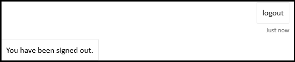

# <a name="add-authentication-to-your-teams-bot"></a><span data-ttu-id="b1dd2-103">Adicionar autenticação ao bot do Teams</span><span class="sxs-lookup"><span data-stu-id="b1dd2-103">Add authentication to your Teams bot</span></span>

<span data-ttu-id="b1dd2-104">Há momentos em que você pode precisar criar bots no Microsoft Teams que podem acessar recursos em nome do usuário, como um serviço de email.</span><span class="sxs-lookup"><span data-stu-id="b1dd2-104">There are times when you may need to create bots in Microsoft Teams that can access resources on behalf of the user, such as a mail service.</span></span>

<span data-ttu-id="b1dd2-105">Este artigo demonstra como usar a autenticação do Azure Bot Service v4 SDK, com base no OAuth 2.0.</span><span class="sxs-lookup"><span data-stu-id="b1dd2-105">This article demonstrates how to use Azure Bot Service v4 SDK authentication, based on OAuth 2.0.</span></span> <span data-ttu-id="b1dd2-106">Isso facilita o desenvolvimento de um bot que pode usar tokens de autenticação com base nas credenciais do usuário.</span><span class="sxs-lookup"><span data-stu-id="b1dd2-106">This makes it easier to develop a bot that can use authentication tokens based on the user's credentials.</span></span> <span data-ttu-id="b1dd2-107">A chave em tudo isso é o uso de **provedores de identidade**, como veremos mais adiante.</span><span class="sxs-lookup"><span data-stu-id="b1dd2-107">Key in all this is the use of **identity providers**, as we will see later.</span></span>

<span data-ttu-id="b1dd2-108">O OAuth 2.0 é um padrão aberto para autenticação e autorização usadas pelo Azure Active Directory (Azure AD) e muitos outros provedores de identidade.</span><span class="sxs-lookup"><span data-stu-id="b1dd2-108">OAuth 2.0 is an open standard for authentication and authorization used by Azure Active Directory (Azure AD) and many other identity providers.</span></span> <span data-ttu-id="b1dd2-109">Uma compreensão básica do OAuth 2.0 é um pré-requisito para trabalhar com autenticação no Teams.</span><span class="sxs-lookup"><span data-stu-id="b1dd2-109">A basic understanding of OAuth 2.0 is a prerequisite for working with authentication in Teams.</span></span>

<span data-ttu-id="b1dd2-110">Consulte [OAuth 2 Simplificado para](https://aka.ms/oauth2-simplified) um entendimento básico e [OAuth 2.0](https://oauth.net/2/) para a especificação completa.</span><span class="sxs-lookup"><span data-stu-id="b1dd2-110">See [OAuth 2 Simplified](https://aka.ms/oauth2-simplified) for a basic understanding, and [OAuth 2.0](https://oauth.net/2/) for the complete specification.</span></span>

<span data-ttu-id="b1dd2-111">Para obter mais informações sobre como o Serviço de Bot do Azure lida com a autenticação, consulte [Autenticação do usuário em uma conversa](https://aka.ms/azure-bot-authentication).</span><span class="sxs-lookup"><span data-stu-id="b1dd2-111">For more information about how the Azure Bot Service handles authentication, see [User authentication within a conversation](https://aka.ms/azure-bot-authentication).</span></span>

<span data-ttu-id="b1dd2-112">Neste artigo, você aprenderá:</span><span class="sxs-lookup"><span data-stu-id="b1dd2-112">In this article you'll learn:</span></span>

- <span data-ttu-id="b1dd2-113">**Como criar um bot habilitado para autenticação.**</span><span class="sxs-lookup"><span data-stu-id="b1dd2-113">**How to create an authentication-enabled bot**.</span></span> <span data-ttu-id="b1dd2-114">Você usará [o cs-auth-sample][teams-auth-bot-cs] para manipular as credenciais de login do usuário e a geração do token de autenticação.</span><span class="sxs-lookup"><span data-stu-id="b1dd2-114">You'll use [cs-auth-sample][teams-auth-bot-cs] to handle user sign-in credentials and the generating the authentication token.</span></span>
- <span data-ttu-id="b1dd2-115">**Como implantar o bot no Azure e associá-lo a um provedor de identidade.**</span><span class="sxs-lookup"><span data-stu-id="b1dd2-115">**How to deploy the bot to Azure and associate it with an identity provider**.</span></span> <span data-ttu-id="b1dd2-116">O provedor emite um token com base nas credenciais de login do usuário.</span><span class="sxs-lookup"><span data-stu-id="b1dd2-116">The provider issues a token based on user sign-in credentials.</span></span> <span data-ttu-id="b1dd2-117">O bot pode usar o token para acessar recursos, como um serviço de email, que exige autenticação.</span><span class="sxs-lookup"><span data-stu-id="b1dd2-117">The bot can use the token to access resources, such as a mail service, which require authentication.</span></span> <span data-ttu-id="b1dd2-118">Para obter mais informações,  [consulte Fluxo de autenticação do Microsoft Teams para bots](auth-flow-bot.md).</span><span class="sxs-lookup"><span data-stu-id="b1dd2-118">For more information see  [Microsoft Teams authentication flow for bots](auth-flow-bot.md).</span></span>
- <span data-ttu-id="b1dd2-119">**Como integrar o bot ao Microsoft Teams**.</span><span class="sxs-lookup"><span data-stu-id="b1dd2-119">**How to integrate the bot within Microsoft Teams**.</span></span> <span data-ttu-id="b1dd2-120">Depois que o bot tiver sido integrado, você poderá entrar e trocar mensagens com ele em um chat.</span><span class="sxs-lookup"><span data-stu-id="b1dd2-120">Once the bot has been integrated, you can sign in and exchange messages with it in a chat.</span></span>

## <a name="prerequisites"></a><span data-ttu-id="b1dd2-121">Pré-requisitos</span><span class="sxs-lookup"><span data-stu-id="b1dd2-121">Prerequisites</span></span>

- <span data-ttu-id="b1dd2-122">Conhecimento de [noções básicas do bot,][concept-basics] [estado de][concept-state]gerenciamento, biblioteca [de caixas][concept-dialogs]de diálogo e como implementar o fluxo de conversa [sequencial.][simple-dialog]</span><span class="sxs-lookup"><span data-stu-id="b1dd2-122">Knowledge of [bot basics][concept-basics], [managing state][concept-state], the [dialogs library][concept-dialogs], and how to [implement sequential conversation flow][simple-dialog].</span></span>
- <span data-ttu-id="b1dd2-123">Conhecimento do desenvolvimento do Azure e do OAuth 2.0.</span><span class="sxs-lookup"><span data-stu-id="b1dd2-123">Knowledge of Azure and OAuth 2.0 development.</span></span>
- <span data-ttu-id="b1dd2-124">As versões atuais de Visual Studio e Git.</span><span class="sxs-lookup"><span data-stu-id="b1dd2-124">The current versions of Visual Studio and Git.</span></span>
- <span data-ttu-id="b1dd2-125">Conta do Azure.</span><span class="sxs-lookup"><span data-stu-id="b1dd2-125">Azure account.</span></span> <span data-ttu-id="b1dd2-126">Se necessário, você pode criar uma conta gratuita [do Azure.](https://azure.microsoft.com/free/)</span><span class="sxs-lookup"><span data-stu-id="b1dd2-126">If needed, you can create an [Azure free account](https://azure.microsoft.com/free/).</span></span>
- <span data-ttu-id="b1dd2-127">O exemplo a seguir.</span><span class="sxs-lookup"><span data-stu-id="b1dd2-127">The following sample.</span></span>

    | <span data-ttu-id="b1dd2-128">Amostra</span><span class="sxs-lookup"><span data-stu-id="b1dd2-128">Sample</span></span> | <span data-ttu-id="b1dd2-129">Versão botBuilder</span><span class="sxs-lookup"><span data-stu-id="b1dd2-129">BotBuilder version</span></span> | <span data-ttu-id="b1dd2-130">Demonstra</span><span class="sxs-lookup"><span data-stu-id="b1dd2-130">Demonstrates</span></span> |
    |:---|:---:|:---|
    | <span data-ttu-id="b1dd2-131">**Autenticação bot** [em cs-auth-sample][teams-auth-bot-cs]</span><span class="sxs-lookup"><span data-stu-id="b1dd2-131">**Bot authentication** in [cs-auth-sample][teams-auth-bot-cs]</span></span> | <span data-ttu-id="b1dd2-132">v4</span><span class="sxs-lookup"><span data-stu-id="b1dd2-132">v4</span></span> | <span data-ttu-id="b1dd2-133">Suporte ao OAuthCard</span><span class="sxs-lookup"><span data-stu-id="b1dd2-133">OAuthCard support</span></span> |
    | <span data-ttu-id="b1dd2-134">**Autenticação bot** [no js-auth-sample][teams-auth-bot-js]</span><span class="sxs-lookup"><span data-stu-id="b1dd2-134">**Bot authentication** in [js-auth-sample][teams-auth-bot-js]</span></span> | <span data-ttu-id="b1dd2-135">v4</span><span class="sxs-lookup"><span data-stu-id="b1dd2-135">v4</span></span>| <span data-ttu-id="b1dd2-136">Suporte ao OAuthCard</span><span class="sxs-lookup"><span data-stu-id="b1dd2-136">OAuthCard support</span></span>  |
    | <span data-ttu-id="b1dd2-137">**Autenticação bot** [em py-auth-sample][teams-auth-bot-py]</span><span class="sxs-lookup"><span data-stu-id="b1dd2-137">**Bot authentication** in [py-auth-sample][teams-auth-bot-py]</span></span> | <span data-ttu-id="b1dd2-138">v4</span><span class="sxs-lookup"><span data-stu-id="b1dd2-138">v4</span></span> | <span data-ttu-id="b1dd2-139">Suporte ao OAuthCard</span><span class="sxs-lookup"><span data-stu-id="b1dd2-139">OAuthCard support</span></span> |

## <a name="create-the-resource-group"></a><span data-ttu-id="b1dd2-140">Criar o grupo de recursos</span><span class="sxs-lookup"><span data-stu-id="b1dd2-140">Create the resource group</span></span>

<span data-ttu-id="b1dd2-141">O grupo de recursos e o plano de serviço não são estritamente necessários, mas permitem que você libere convenientemente os recursos que você criar.</span><span class="sxs-lookup"><span data-stu-id="b1dd2-141">The resource group and the service plan aren't strictly necessary, but they allow you to conveniently release the resources you create.</span></span> <span data-ttu-id="b1dd2-142">Essa é uma boa prática para manter seus recursos organizados e gerenciáveis.</span><span class="sxs-lookup"><span data-stu-id="b1dd2-142">This is good practice for keeping your resources organized and manageable.</span></span>

<span data-ttu-id="b1dd2-143">Você usa um grupo de recursos para criar recursos individuais para a Estrutura de Bots.</span><span class="sxs-lookup"><span data-stu-id="b1dd2-143">You use a resource group to create individual resources for the Bot Framework.</span></span> <span data-ttu-id="b1dd2-144">Para desempenho, verifique se esses recursos estão localizados na mesma região do Azure.</span><span class="sxs-lookup"><span data-stu-id="b1dd2-144">For performance, ensure that these resources are located in the same Azure region.</span></span>

1. <span data-ttu-id="b1dd2-145">No navegador, entre no [**portal do Azure.**][azure-portal]</span><span class="sxs-lookup"><span data-stu-id="b1dd2-145">In your browser, sign into the [**Azure portal**][azure-portal].</span></span>
1. <span data-ttu-id="b1dd2-146">No painel de navegação esquerdo, selecione **Grupos de recursos**.</span><span class="sxs-lookup"><span data-stu-id="b1dd2-146">In the left navigation panel, select **Resource groups**.</span></span>
1. <span data-ttu-id="b1dd2-147">No canto superior esquerdo da janela exibida, selecione **Adicionar** guia para criar um novo grupo de recursos.</span><span class="sxs-lookup"><span data-stu-id="b1dd2-147">In the upper left of the displayed window, select **Add** tab to create a new resource group.</span></span> <span data-ttu-id="b1dd2-148">Você será solicitado a fornecer o seguinte:</span><span class="sxs-lookup"><span data-stu-id="b1dd2-148">You'll be prompted to provide the following:</span></span>
    1. <span data-ttu-id="b1dd2-149">**Assinatura**.</span><span class="sxs-lookup"><span data-stu-id="b1dd2-149">**Subscription**.</span></span> <span data-ttu-id="b1dd2-150">Use sua assinatura existente.</span><span class="sxs-lookup"><span data-stu-id="b1dd2-150">Use your existing subscription.</span></span>
    1. <span data-ttu-id="b1dd2-151">**Grupo de recursos**.</span><span class="sxs-lookup"><span data-stu-id="b1dd2-151">**Resource group**.</span></span> <span data-ttu-id="b1dd2-152">Insira o nome do grupo de recursos.</span><span class="sxs-lookup"><span data-stu-id="b1dd2-152">Enter the name for the resource group.</span></span> <span data-ttu-id="b1dd2-153">Um exemplo pode ser  *TeamsResourceGroup*.</span><span class="sxs-lookup"><span data-stu-id="b1dd2-153">An example could be  *TeamsResourceGroup*.</span></span> <span data-ttu-id="b1dd2-154">Lembre-se de que o nome deve ser exclusivo.</span><span class="sxs-lookup"><span data-stu-id="b1dd2-154">Remember that the name must be unique.</span></span>
    1. <span data-ttu-id="b1dd2-155">No menu **suspenso** Região, selecione *Oeste dos EUA* ou uma região próxima aos seus aplicativos.</span><span class="sxs-lookup"><span data-stu-id="b1dd2-155">From the **Region** drop-down menu, select *West US*, or a region close to your applications.</span></span>
    1. <span data-ttu-id="b1dd2-156">Selecione o **botão Revisar e** criar.</span><span class="sxs-lookup"><span data-stu-id="b1dd2-156">Select the **Review and create** button.</span></span> <span data-ttu-id="b1dd2-157">Você deve ver um banner que lê *Validação passada*.</span><span class="sxs-lookup"><span data-stu-id="b1dd2-157">You should see a banner that reads *Validation passed*.</span></span>
    1. <span data-ttu-id="b1dd2-158">Selecione o **botão Criar.**</span><span class="sxs-lookup"><span data-stu-id="b1dd2-158">Select the **Create** button.</span></span> <span data-ttu-id="b1dd2-159">Pode levar alguns minutos para criar o grupo de recursos.</span><span class="sxs-lookup"><span data-stu-id="b1dd2-159">It may take a few minutes to create the resource group.</span></span>

> [!TIP]
> <span data-ttu-id="b1dd2-160">Assim como com os recursos que você criará mais adiante neste tutorial, é uma boa ideia fixar esse grupo de recursos em seu painel para facilitar o acesso.</span><span class="sxs-lookup"><span data-stu-id="b1dd2-160">As with the resources you'll create later in this tutorial, it's a good idea to pin this resource group to your dashboard for easy access.</span></span> <span data-ttu-id="b1dd2-161">Se você quiser fazer isso, selecione o ícone de pino &#128204; no canto superior direito do painel.</span><span class="sxs-lookup"><span data-stu-id="b1dd2-161">If you'd like to do so, select the pin icon &#128204; in the upper right of the dashboard.</span></span>

## <a name="create-the-service-plan"></a><span data-ttu-id="b1dd2-162">Criar o plano de serviço</span><span class="sxs-lookup"><span data-stu-id="b1dd2-162">Create the service plan</span></span>

1. <span data-ttu-id="b1dd2-163">No portal [**do Azure**][azure-portal], no painel de navegação esquerdo, selecione **Criar um recurso**.</span><span class="sxs-lookup"><span data-stu-id="b1dd2-163">In the [**Azure portal**][azure-portal], on the left navigation panel, select **Create a resource**.</span></span>
1. <span data-ttu-id="b1dd2-164">Na caixa de pesquisa, digite *Plano de Serviço de Aplicativo*.</span><span class="sxs-lookup"><span data-stu-id="b1dd2-164">In the search box, type *App Service Plan*.</span></span> <span data-ttu-id="b1dd2-165">Selecione o **cartão Plano de Serviço de Aplicativo** nos resultados da pesquisa.</span><span class="sxs-lookup"><span data-stu-id="b1dd2-165">Select the **App Service Plan** card from the search results.</span></span>
1. <span data-ttu-id="b1dd2-166">Selecione **Criar**.</span><span class="sxs-lookup"><span data-stu-id="b1dd2-166">Select **Create**.</span></span>
1. <span data-ttu-id="b1dd2-167">Você será solicitado a fornecer as seguintes informações:</span><span class="sxs-lookup"><span data-stu-id="b1dd2-167">You'll be asked to provide the following information:</span></span>
    1. <span data-ttu-id="b1dd2-168">**Assinatura**.</span><span class="sxs-lookup"><span data-stu-id="b1dd2-168">**Subscription**.</span></span> <span data-ttu-id="b1dd2-169">Você pode usar uma assinatura existente.</span><span class="sxs-lookup"><span data-stu-id="b1dd2-169">You can use an existing subscription.</span></span>
    1. <span data-ttu-id="b1dd2-170">**Grupo de Recursos**.</span><span class="sxs-lookup"><span data-stu-id="b1dd2-170">**Resource Group**.</span></span> <span data-ttu-id="b1dd2-171">Selecione o grupo criado anteriormente.</span><span class="sxs-lookup"><span data-stu-id="b1dd2-171">Select the group you created earlier.</span></span>
    1. <span data-ttu-id="b1dd2-172">**Nome**.</span><span class="sxs-lookup"><span data-stu-id="b1dd2-172">**Name**.</span></span> <span data-ttu-id="b1dd2-173">Insira o nome do plano de serviço.</span><span class="sxs-lookup"><span data-stu-id="b1dd2-173">Enter the name for the service plan.</span></span> <span data-ttu-id="b1dd2-174">Um exemplo pode ser  *TeamsServicePlan*.</span><span class="sxs-lookup"><span data-stu-id="b1dd2-174">An example could be  *TeamsServicePlan*.</span></span> <span data-ttu-id="b1dd2-175">Lembre-se de que o nome deve ser exclusivo, dentro do grupo.</span><span class="sxs-lookup"><span data-stu-id="b1dd2-175">Remember that the name must be unique, within the group.</span></span>
    1. <span data-ttu-id="b1dd2-176">**Sistema Operacional**.</span><span class="sxs-lookup"><span data-stu-id="b1dd2-176">**Operating System**.</span></span> <span data-ttu-id="b1dd2-177">Selecione *Windows* ou seu sistema operacional aplicável.</span><span class="sxs-lookup"><span data-stu-id="b1dd2-177">Select *Windows* or your applicable OS.</span></span>
    1. <span data-ttu-id="b1dd2-178">**Região**.</span><span class="sxs-lookup"><span data-stu-id="b1dd2-178">**Region**.</span></span> <span data-ttu-id="b1dd2-179">Selecione *Oeste dos EUA* ou uma região próxima aos seus aplicativos.</span><span class="sxs-lookup"><span data-stu-id="b1dd2-179">Select *West US* or a region close to your applications.</span></span>
    1. <span data-ttu-id="b1dd2-180">**Camada de preços**.</span><span class="sxs-lookup"><span data-stu-id="b1dd2-180">**Pricing Tier**.</span></span> <span data-ttu-id="b1dd2-181">Certifique-se *de que o Padrão S1* está selecionado.</span><span class="sxs-lookup"><span data-stu-id="b1dd2-181">Make sure that *Standard S1* is selected.</span></span> <span data-ttu-id="b1dd2-182">Esse deve ser o valor padrão.</span><span class="sxs-lookup"><span data-stu-id="b1dd2-182">This should be the default value.</span></span>
    1. <span data-ttu-id="b1dd2-183">Selecione o **botão Revisar e** criar.</span><span class="sxs-lookup"><span data-stu-id="b1dd2-183">Select the **Review and create** button.</span></span> <span data-ttu-id="b1dd2-184">Você deve ver um banner que lê *Validação passada*.</span><span class="sxs-lookup"><span data-stu-id="b1dd2-184">You should see a banner that reads *Validation passed*.</span></span>
    1. <span data-ttu-id="b1dd2-185">Selecione **Criar**.</span><span class="sxs-lookup"><span data-stu-id="b1dd2-185">Select **Create**.</span></span> <span data-ttu-id="b1dd2-186">Pode levar alguns minutos para criar o plano de serviço do aplicativo.</span><span class="sxs-lookup"><span data-stu-id="b1dd2-186">It may take a few minutes to create the app service plan.</span></span> <span data-ttu-id="b1dd2-187">O plano será listado no grupo de recursos.</span><span class="sxs-lookup"><span data-stu-id="b1dd2-187">The plan will be listed in the resource group.</span></span>

## <a name="create-the-bot-channels-registration"></a><span data-ttu-id="b1dd2-188">Criar o registro de canais bot</span><span class="sxs-lookup"><span data-stu-id="b1dd2-188">Create the bot channels registration</span></span>

<span data-ttu-id="b1dd2-189">O registro de canais de bot registra seu serviço Web como um bot com a Estrutura de Bot, desde que você tenha uma ID do Aplicativo microsoft e senha do aplicativo (segredo do cliente).</span><span class="sxs-lookup"><span data-stu-id="b1dd2-189">The bot channels registration registers your web service as a bot with the Bot Framework, provided you have a Microsoft App Id and App password (client secret).</span></span>

> [!IMPORTANT]
> <span data-ttu-id="b1dd2-190">Você só precisará registrar seu bot se ele não estiver hospedado no Azure.</span><span class="sxs-lookup"><span data-stu-id="b1dd2-190">You only need to register your bot if it is not hosted in Azure.</span></span> <span data-ttu-id="b1dd2-191">Se você [criou um bot por](/azure/bot-service/abs-quickstart?view=azure-bot-service-4.0&viewFallbackFrom=azure-bot-service-3.0&preserve-view=true) meio do portal do Azure, ele já está registrado com o serviço.</span><span class="sxs-lookup"><span data-stu-id="b1dd2-191">If you [created a bot](/azure/bot-service/abs-quickstart?view=azure-bot-service-4.0&viewFallbackFrom=azure-bot-service-3.0&preserve-view=true) through the Azure portal then it is already registered with the service.</span></span> <span data-ttu-id="b1dd2-192">Se você criou seu bot por meio da [Estrutura de Bot](https://dev.botframework.com/bots/new) ou [AppStudio,](~/concepts/build-and-test/app-studio-overview.md) seu bot não está registrado no Azure.</span><span class="sxs-lookup"><span data-stu-id="b1dd2-192">If you created your bot through the [Bot Framework](https://dev.botframework.com/bots/new) or [AppStudio](~/concepts/build-and-test/app-studio-overview.md) your bot isn't registered in Azure.</span></span>

[!INCLUDE [bot channels registration steps](~/includes/bots/azure-bot-channels-registration.md)]

> [!NOTE]
> <span data-ttu-id="b1dd2-193">O recurso Registro de Canais de Bot mostrará a **região Global** mesmo se você tiver selecionado o Oeste dos EUA.</span><span class="sxs-lookup"><span data-stu-id="b1dd2-193">The Bot Channels Registration resource will show the **Global** region even if you selected West US.</span></span> <span data-ttu-id="b1dd2-194">Isso é esperado.</span><span class="sxs-lookup"><span data-stu-id="b1dd2-194">This is expected.</span></span>

<span data-ttu-id="b1dd2-195">Para obter mais informações, [consulte Create a bot for Teams](../create-a-bot-for-teams.md).</span><span class="sxs-lookup"><span data-stu-id="b1dd2-195">For more information, see [Create a bot for Teams](../create-a-bot-for-teams.md).</span></span>

## <a name="create-the-identity-provider"></a><span data-ttu-id="b1dd2-196">Criar o provedor de identidade</span><span class="sxs-lookup"><span data-stu-id="b1dd2-196">Create the identity provider</span></span>

<span data-ttu-id="b1dd2-197">Você precisa de um provedor de identidade que possa ser usado para autenticação.</span><span class="sxs-lookup"><span data-stu-id="b1dd2-197">You need an identity provider that can be used for authentication.</span></span>
<span data-ttu-id="b1dd2-198">Neste procedimento, você usará um provedor do Azure AD; outros provedores de identidade com suporte do Azure AD também podem ser usados.</span><span class="sxs-lookup"><span data-stu-id="b1dd2-198">In this procedure you'll use an Azure AD provider; other Azure AD supported identity providers can also be used.</span></span>

1. <span data-ttu-id="b1dd2-199">No portal [**do Azure**][azure-portal], no painel de navegação esquerdo, selecione **Azure Active Directory**.</span><span class="sxs-lookup"><span data-stu-id="b1dd2-199">In the [**Azure portal**][azure-portal], on the left navigation panel, select **Azure Active Directory**.</span></span>
    > [!TIP]
    > <span data-ttu-id="b1dd2-200">Você precisará criar e registrar esse recurso do Azure AD em um locatário no qual você pode autorizar a delegação de permissões solicitadas por um aplicativo.</span><span class="sxs-lookup"><span data-stu-id="b1dd2-200">You'll need to create and register this Azure AD resource in a tenant in which you can consent to delegate permissions requested by an application.</span></span>
    > <span data-ttu-id="b1dd2-201">Para instruções sobre como criar um locatário, [consulte Access the portal and create a tenant](/azure/active-directory/fundamentals/active-directory-access-create-new-tenant).</span><span class="sxs-lookup"><span data-stu-id="b1dd2-201">For instruction on creating a tenant, see [Access the portal and create a tenant](/azure/active-directory/fundamentals/active-directory-access-create-new-tenant).</span></span>
1. <span data-ttu-id="b1dd2-202">No painel esquerdo, selecione **Registros de aplicativo .**</span><span class="sxs-lookup"><span data-stu-id="b1dd2-202">In the left panel, select **App registrations**.</span></span>
1. <span data-ttu-id="b1dd2-203">No painel direito, selecione a guia **Novo registro,** no canto superior esquerdo.</span><span class="sxs-lookup"><span data-stu-id="b1dd2-203">In the right panel, select the **New registration** tab, in the upper left.</span></span>
1. <span data-ttu-id="b1dd2-204">Você será solicitado a fornecer as seguintes informações:</span><span class="sxs-lookup"><span data-stu-id="b1dd2-204">You'll be asked to provide the following information:</span></span>
   1. <span data-ttu-id="b1dd2-205">**Nome**.</span><span class="sxs-lookup"><span data-stu-id="b1dd2-205">**Name**.</span></span> <span data-ttu-id="b1dd2-206">Insira o nome do aplicativo.</span><span class="sxs-lookup"><span data-stu-id="b1dd2-206">Enter the name for the application.</span></span> <span data-ttu-id="b1dd2-207">Um exemplo pode ser  *BotTeamsIdentity*.</span><span class="sxs-lookup"><span data-stu-id="b1dd2-207">An example could be  *BotTeamsIdentity*.</span></span> <span data-ttu-id="b1dd2-208">Lembre-se de que o nome deve ser exclusivo.</span><span class="sxs-lookup"><span data-stu-id="b1dd2-208">Remember that the name must be unique.</span></span>
   1. <span data-ttu-id="b1dd2-209">Selecione os **tipos de conta com suporte** para seu aplicativo.</span><span class="sxs-lookup"><span data-stu-id="b1dd2-209">Select the **Supported account types** for your application.</span></span> <span data-ttu-id="b1dd2-210">Selecione Contas em qualquer diretório organizacional (Qualquer diretório *do Azure AD - Multitenant) e contas pessoais da Microsoft (por exemplo, Skype, Xbox)*.</span><span class="sxs-lookup"><span data-stu-id="b1dd2-210">Select *Accounts in any organizational directory (Any Azure AD directory - Multitenant) and personal Microsoft accounts (e.g. Skype, Xbox)*.</span></span>
   1. <span data-ttu-id="b1dd2-211">Para o **URI de redirecionamento**:</span><span class="sxs-lookup"><span data-stu-id="b1dd2-211">For the **Redirect URI**:</span></span><br/>
       <span data-ttu-id="b1dd2-212">&#x2713;Selecione **Web**.</span><span class="sxs-lookup"><span data-stu-id="b1dd2-212">&#x2713;Select **Web**.</span></span> <br/>
       <span data-ttu-id="b1dd2-213">&#x2713; definir a URL como `https://token.botframework.com/.auth/web/redirect` .</span><span class="sxs-lookup"><span data-stu-id="b1dd2-213">&#x2713; Set the URL to `https://token.botframework.com/.auth/web/redirect`.</span></span>
   1. <span data-ttu-id="b1dd2-214">Selecione **Registrar**.</span><span class="sxs-lookup"><span data-stu-id="b1dd2-214">Select **Register**.</span></span>

1. <span data-ttu-id="b1dd2-215">Depois de criado, o Azure exibe a página **Visão** Geral do aplicativo.</span><span class="sxs-lookup"><span data-stu-id="b1dd2-215">Once it is created, Azure displays the **Overview** page for the app.</span></span> <span data-ttu-id="b1dd2-216">Copie e salve as seguintes informações em um arquivo:</span><span class="sxs-lookup"><span data-stu-id="b1dd2-216">Copy and save the following information to a file:</span></span>

    1. <span data-ttu-id="b1dd2-217">O **valor da ID do aplicativo (cliente).**</span><span class="sxs-lookup"><span data-stu-id="b1dd2-217">The **Application (client) ID** value.</span></span> <span data-ttu-id="b1dd2-218">Você usará esse valor posteriormente como a *ID do* Cliente quando registrar esse aplicativo de identidade do Azure com seu bot.</span><span class="sxs-lookup"><span data-stu-id="b1dd2-218">You'll use this value later as the *Client ID* when you register this Azure identity application with your bot.</span></span>
    1. <span data-ttu-id="b1dd2-219">O valor da ID do Diretório **(locatário).**</span><span class="sxs-lookup"><span data-stu-id="b1dd2-219">The **Directory (tenant) ID** value.</span></span> <span data-ttu-id="b1dd2-220">Você também usará esse valor posteriormente como a ID do *Locatário* para registrar esse aplicativo de identidade do Azure com seu bot.</span><span class="sxs-lookup"><span data-stu-id="b1dd2-220">You'll also use this value later as the *Tenant ID* to register this Azure identity application with your bot.</span></span>

1. <span data-ttu-id="b1dd2-221">No painel esquerdo, selecione **Certificados & segredos para** criar um segredo do cliente para seu aplicativo.</span><span class="sxs-lookup"><span data-stu-id="b1dd2-221">In the left panel, select **Certificates & secrets** to create a client secret for your application.</span></span>

   1. <span data-ttu-id="b1dd2-222">Em **Segredos do cliente,** selecione &#x2795; **Novo segredo do cliente.**</span><span class="sxs-lookup"><span data-stu-id="b1dd2-222">Under **Client secrets**, select &#x2795; **New client secret**.</span></span>
   1. <span data-ttu-id="b1dd2-223">Adicione uma descrição para identificar esse segredo de outras pessoas que você pode precisar criar para este aplicativo, como *o aplicativo de identidade bot no Teams*.</span><span class="sxs-lookup"><span data-stu-id="b1dd2-223">Add a description to identify this secret from others you might need to create for this app, such as *Bot identity app in Teams*.</span></span>
   1. <span data-ttu-id="b1dd2-224">Set **Expires** to your selection.</span><span class="sxs-lookup"><span data-stu-id="b1dd2-224">Set **Expires** to your selection.</span></span>
   1. <span data-ttu-id="b1dd2-225">Selecione **Adicionar**.</span><span class="sxs-lookup"><span data-stu-id="b1dd2-225">Select **Add**.</span></span>
   1. <span data-ttu-id="b1dd2-226">Antes de sair desta página, **grave o segredo**.</span><span class="sxs-lookup"><span data-stu-id="b1dd2-226">Before leaving this page, **record the secret**.</span></span> <span data-ttu-id="b1dd2-227">Você usará esse valor posteriormente como o _segredo do cliente_ ao registrar seu aplicativo do Azure AD com seu bot.</span><span class="sxs-lookup"><span data-stu-id="b1dd2-227">You'll use this value later as the _Client secret_ when you register your Azure AD application with your bot.</span></span>

### <a name="configure-the-identity-provider-connection-and-register-it-with-the-bot"></a><span data-ttu-id="b1dd2-228">Configurar a conexão do provedor de identidade e registrá-la com o bot</span><span class="sxs-lookup"><span data-stu-id="b1dd2-228">Configure the identity provider connection and register it with the bot</span></span>

<span data-ttu-id="b1dd2-229">Observação: há duas opções para Provedores de Serviços aqui-Azure AD V1 e Azure AD V2.</span><span class="sxs-lookup"><span data-stu-id="b1dd2-229">Note-there are two options for Service Providers here-Azure AD V1 and Azure AD V2.</span></span>  <span data-ttu-id="b1dd2-230">As diferenças entre os dois provedores são resumidas [aqui](https://docs.microsoft.com/azure/active-directory/azuread-dev/azure-ad-endpoint-comparison), mas, em geral, a V2 oferece mais flexibilidade em relação à alteração de permissões de bot.</span><span class="sxs-lookup"><span data-stu-id="b1dd2-230">The differences between the two providers are summarized [here](https://docs.microsoft.com/azure/active-directory/azuread-dev/azure-ad-endpoint-comparison), but in general, V2 provides more flexibility with respect to changing bot permissions.</span></span>  <span data-ttu-id="b1dd2-231">As permissões de API do Graph são listadas no campo escopos e, à medida que novas são adicionadas, os bots permitirão que os usuários consentam com as novas permissões na próxima vez em que entrar.</span><span class="sxs-lookup"><span data-stu-id="b1dd2-231">Graph API permissions are listed in the scopes field, and as new ones are added, bots will allow users to consent to the new permissions on the next sign in.</span></span>  <span data-ttu-id="b1dd2-232">Para V1, o consentimento do bot deve ser excluído pelo usuário para que novas permissões sejam solicitados na caixa de diálogo OAuth.</span><span class="sxs-lookup"><span data-stu-id="b1dd2-232">For V1, the bot consent must be deleted by the user for new permissions to be prompted in the OAuth dialog.</span></span> 

#### <a name="azure-ad-v1"></a><span data-ttu-id="b1dd2-233">Azure AD V1</span><span class="sxs-lookup"><span data-stu-id="b1dd2-233">Azure AD V1</span></span>

1. <span data-ttu-id="b1dd2-234">No [**portal do Azure,**][azure-portal]selecione seu grupo de recursos no painel.</span><span class="sxs-lookup"><span data-stu-id="b1dd2-234">In the [**Azure portal**][azure-portal], select your resource group from the dashboard.</span></span>
1. <span data-ttu-id="b1dd2-235">Selecione o link de registro do canal bot.</span><span class="sxs-lookup"><span data-stu-id="b1dd2-235">Select your bot channel registration link.</span></span>
1. <span data-ttu-id="b1dd2-236">Na página recurso, selecione **Configurações**.</span><span class="sxs-lookup"><span data-stu-id="b1dd2-236">On the resource page, select **Settings**.</span></span>
1. <span data-ttu-id="b1dd2-237">Em **Configurações de Conexão OAuth próximas** à parte inferior da página, selecione **Adicionar Configuração**.</span><span class="sxs-lookup"><span data-stu-id="b1dd2-237">Under **OAuth Connection Settings** near the bottom of the page, select **Add Setting**.</span></span>
1. <span data-ttu-id="b1dd2-238">Preencha o formulário de acordo com as instruções a seguir:</span><span class="sxs-lookup"><span data-stu-id="b1dd2-238">Complete the form as follows:</span></span>

    1. <span data-ttu-id="b1dd2-239">**Nome**.</span><span class="sxs-lookup"><span data-stu-id="b1dd2-239">**Name**.</span></span> <span data-ttu-id="b1dd2-240">Insira um nome para a conexão.</span><span class="sxs-lookup"><span data-stu-id="b1dd2-240">Enter a name for the connection.</span></span> <span data-ttu-id="b1dd2-241">Você usará esse nome em seu bot no `appsettings.json` arquivo.</span><span class="sxs-lookup"><span data-stu-id="b1dd2-241">You'll use this name in your bot in the `appsettings.json` file.</span></span> <span data-ttu-id="b1dd2-242">Por *exemplo, BotTeamsAuthADv1*.</span><span class="sxs-lookup"><span data-stu-id="b1dd2-242">For example *BotTeamsAuthADv1*.</span></span>
    1. <span data-ttu-id="b1dd2-243">**Provedor de Serviços**.</span><span class="sxs-lookup"><span data-stu-id="b1dd2-243">**Service Provider**.</span></span> <span data-ttu-id="b1dd2-244">Selecione **Azure Active Directory**.</span><span class="sxs-lookup"><span data-stu-id="b1dd2-244">Select **Azure Active Directory**.</span></span> <span data-ttu-id="b1dd2-245">Depois de selecionar isso, os campos específicos do Azure AD serão exibidos.</span><span class="sxs-lookup"><span data-stu-id="b1dd2-245">Once you select this, the Azure AD-specific fields will be displayed.</span></span>
    1. <span data-ttu-id="b1dd2-246">**ID do cliente**. Insira a ID de aplicativo (cliente) que você gravou para seu aplicativo provedor de identidade do Azure nas etapas acima.</span><span class="sxs-lookup"><span data-stu-id="b1dd2-246">**Client id**. Enter the Application (client) ID that you recorded for your Azure identity provider app in the steps above.</span></span>
    1. <span data-ttu-id="b1dd2-247">**Segredo do cliente**.</span><span class="sxs-lookup"><span data-stu-id="b1dd2-247">**Client secret**.</span></span> <span data-ttu-id="b1dd2-248">Insira o segredo que você gravou para seu aplicativo provedor de identidade do Azure nas etapas acima.</span><span class="sxs-lookup"><span data-stu-id="b1dd2-248">Enter the secret that you recorded for your Azure identity provider app in the steps above.</span></span>
    1. <span data-ttu-id="b1dd2-249">**Tipo de concessão**.</span><span class="sxs-lookup"><span data-stu-id="b1dd2-249">**Grant Type**.</span></span> <span data-ttu-id="b1dd2-250">Insira `authorization_code` .</span><span class="sxs-lookup"><span data-stu-id="b1dd2-250">Enter `authorization_code`.</span></span>
    1. <span data-ttu-id="b1dd2-251">**URL de logon**.</span><span class="sxs-lookup"><span data-stu-id="b1dd2-251">**Login URL**.</span></span> <span data-ttu-id="b1dd2-252">Insira `https://login.microsoftonline.com` .</span><span class="sxs-lookup"><span data-stu-id="b1dd2-252">Enter `https://login.microsoftonline.com`.</span></span>
    1. <span data-ttu-id="b1dd2-253">**ID do** locatário , insira a ID de Diretório **(locatário)** que você gravou anteriormente para seu aplicativo de identidade do Azure ou **comum,** dependendo do tipo de conta com suporte selecionado ao criar o aplicativo do provedor de identidade.</span><span class="sxs-lookup"><span data-stu-id="b1dd2-253">**Tenant ID**, enter the **Directory (tenant) ID** that you recorded earlier for your Azure identity app or **common** depending on the supported account type selected when you created the identity provider app.</span></span> <span data-ttu-id="b1dd2-254">Para decidir qual valor atribuir siga estes critérios:</span><span class="sxs-lookup"><span data-stu-id="b1dd2-254">To decide which value to assign follow these criteria:</span></span>

        - <span data-ttu-id="b1dd2-255">Se você selecionou contas somente neste diretório organizacional *(somente Microsoft -* Locatário único) ou Contas em qualquer diretório organizacional *(diretório Microsoft AAD - Multi locatário)* insira a **ID** de locatário que você gravou anteriormente para o aplicativo AAD.</span><span class="sxs-lookup"><span data-stu-id="b1dd2-255">If you selected either *Accounts in this organizational directory only (Microsoft only - Single tenant)* or *Accounts in any organizational directory(Microsoft AAD directory - Multi tenant)* enter the **tenant ID** you recorded earlier for the AAD app.</span></span> <span data-ttu-id="b1dd2-256">Esse será o locatário associado aos usuários que podem ser autenticados.</span><span class="sxs-lookup"><span data-stu-id="b1dd2-256">This will be the tenant associated with the users who can be authenticated.</span></span>

        - <span data-ttu-id="b1dd2-257">Se você selecionou Contas em qualquer diretório organizacional (qualquer diretório AAD - Contas da Microsoft de vários locatários e pessoais, por *exemplo, Skype, Xbox, Outlook)* insira a palavra **comum** em vez de uma ID de locatário.</span><span class="sxs-lookup"><span data-stu-id="b1dd2-257">If you selected *Accounts in any organizational directory (Any AAD directory - Multi tenant and personal Microsoft accounts e.g. Skype, Xbox, Outlook)* enter the word **common** instead of a tenant ID.</span></span> <span data-ttu-id="b1dd2-258">Caso contrário, o aplicativo AAD verificará por meio do locatário cuja ID foi selecionada e excluirá contas pessoais da Microsoft.</span><span class="sxs-lookup"><span data-stu-id="b1dd2-258">Otherwise, the AAD app will verify through the tenant whose ID was selected and exclude personal Microsoft accounts.</span></span>

    <span data-ttu-id="b1dd2-259">h.</span><span class="sxs-lookup"><span data-stu-id="b1dd2-259">h.</span></span> <span data-ttu-id="b1dd2-260">Para **URL do Recurso,** insira `https://graph.microsoft.com/` .</span><span class="sxs-lookup"><span data-stu-id="b1dd2-260">For **Resource URL**, enter `https://graph.microsoft.com/`.</span></span> <span data-ttu-id="b1dd2-261">Isso não é usado no exemplo de código atual.</span><span class="sxs-lookup"><span data-stu-id="b1dd2-261">This is not used in the current code sample.</span></span>  
    <span data-ttu-id="b1dd2-262">i.</span><span class="sxs-lookup"><span data-stu-id="b1dd2-262">i.</span></span> <span data-ttu-id="b1dd2-263">Deixar **escopos em** branco.</span><span class="sxs-lookup"><span data-stu-id="b1dd2-263">Leave **Scopes** blank.</span></span> <span data-ttu-id="b1dd2-264">A imagem a seguir é um exemplo:</span><span class="sxs-lookup"><span data-stu-id="b1dd2-264">The following image is an example:</span></span>

    

1. <span data-ttu-id="b1dd2-266">Selecione **Salvar**.</span><span class="sxs-lookup"><span data-stu-id="b1dd2-266">Select **Save**.</span></span>

#### <a name="azure-ad-v2"></a><span data-ttu-id="b1dd2-267">Azure AD V2</span><span class="sxs-lookup"><span data-stu-id="b1dd2-267">Azure AD V2</span></span>

1. <span data-ttu-id="b1dd2-268">No [**portal do Azure,**][azure-portal]selecione seu grupo de recursos no painel.</span><span class="sxs-lookup"><span data-stu-id="b1dd2-268">In the [**Azure portal**][azure-portal], select your resource group from the dashboard.</span></span>
1. <span data-ttu-id="b1dd2-269">Selecione o link de registro do canal bot.</span><span class="sxs-lookup"><span data-stu-id="b1dd2-269">Select your bot channel registration link.</span></span>
1. <span data-ttu-id="b1dd2-270">Na página recurso, selecione **Configurações**.</span><span class="sxs-lookup"><span data-stu-id="b1dd2-270">On the resource page, select **Settings**.</span></span>
1. <span data-ttu-id="b1dd2-271">Em **Configurações de Conexão OAuth próximas** à parte inferior da página, selecione **Adicionar Configuração**.</span><span class="sxs-lookup"><span data-stu-id="b1dd2-271">Under **OAuth Connection Settings** near the bottom of the page, select **Add Setting**.</span></span>
1. <span data-ttu-id="b1dd2-272">Preencha o formulário de acordo com as instruções a seguir:</span><span class="sxs-lookup"><span data-stu-id="b1dd2-272">Complete the form as follows:</span></span>

    1. <span data-ttu-id="b1dd2-273">**Nome**.</span><span class="sxs-lookup"><span data-stu-id="b1dd2-273">**Name**.</span></span> <span data-ttu-id="b1dd2-274">Insira um nome para a conexão.</span><span class="sxs-lookup"><span data-stu-id="b1dd2-274">Enter a name for the connection.</span></span> <span data-ttu-id="b1dd2-275">Você usará esse nome em seu bot no `appsettings.json` arquivo.</span><span class="sxs-lookup"><span data-stu-id="b1dd2-275">You'll use this name in your bot in the `appsettings.json` file.</span></span> <span data-ttu-id="b1dd2-276">Por *exemplo, BotTeamsAuthADv2*.</span><span class="sxs-lookup"><span data-stu-id="b1dd2-276">For example *BotTeamsAuthADv2*.</span></span>
    1. <span data-ttu-id="b1dd2-277">**Provedor de Serviços**.</span><span class="sxs-lookup"><span data-stu-id="b1dd2-277">**Service Provider**.</span></span> <span data-ttu-id="b1dd2-278">Selecione **Azure Active Directory v2**.</span><span class="sxs-lookup"><span data-stu-id="b1dd2-278">Select **Azure Active Directory v2**.</span></span> <span data-ttu-id="b1dd2-279">Depois de selecionar isso, os campos específicos do Azure AD serão exibidos.</span><span class="sxs-lookup"><span data-stu-id="b1dd2-279">Once you select this, the Azure AD-specific fields will be displayed.</span></span>
    1. <span data-ttu-id="b1dd2-280">**ID do cliente**. Insira a ID de aplicativo (cliente) que você gravou para seu aplicativo provedor de identidade do Azure nas etapas acima.</span><span class="sxs-lookup"><span data-stu-id="b1dd2-280">**Client id**. Enter the Application (client) ID that you recorded for your Azure identity provider app in the steps above.</span></span>
    1. <span data-ttu-id="b1dd2-281">**Segredo do cliente**.</span><span class="sxs-lookup"><span data-stu-id="b1dd2-281">**Client secret**.</span></span> <span data-ttu-id="b1dd2-282">Insira o segredo que você gravou para seu aplicativo provedor de identidade do Azure nas etapas acima.</span><span class="sxs-lookup"><span data-stu-id="b1dd2-282">Enter the secret that you recorded for your Azure identity provider app in the steps above.</span></span>
    1. <span data-ttu-id="b1dd2-283">**URL do Exchange de tokens**.</span><span class="sxs-lookup"><span data-stu-id="b1dd2-283">**Token Exchange URL**.</span></span> <span data-ttu-id="b1dd2-284">Deixe isso em branco.</span><span class="sxs-lookup"><span data-stu-id="b1dd2-284">Leave this blank.</span></span>
    1. <span data-ttu-id="b1dd2-285">**ID do** locatário , insira a ID de Diretório **(locatário)** que você gravou anteriormente para seu aplicativo de identidade do Azure ou **comum,** dependendo do tipo de conta com suporte selecionado ao criar o aplicativo do provedor de identidade.</span><span class="sxs-lookup"><span data-stu-id="b1dd2-285">**Tenant ID**, enter the **Directory (tenant) ID** that you recorded earlier for your Azure identity app or **common** depending on the supported account type selected when you created the identity provider app.</span></span> <span data-ttu-id="b1dd2-286">Para decidir qual valor atribuir siga estes critérios:</span><span class="sxs-lookup"><span data-stu-id="b1dd2-286">To decide which value to assign follow these criteria:</span></span>

        - <span data-ttu-id="b1dd2-287">Se você selecionou contas somente neste diretório organizacional *(somente Microsoft -* Locatário único) ou Contas em qualquer diretório organizacional *(diretório Microsoft AAD - Multi locatário)* insira a **ID** de locatário que você gravou anteriormente para o aplicativo AAD.</span><span class="sxs-lookup"><span data-stu-id="b1dd2-287">If you selected either *Accounts in this organizational directory only (Microsoft only - Single tenant)* or *Accounts in any organizational directory(Microsoft AAD directory - Multi tenant)* enter the **tenant ID** you recorded earlier for the AAD app.</span></span> <span data-ttu-id="b1dd2-288">Esse será o locatário associado aos usuários que podem ser autenticados.</span><span class="sxs-lookup"><span data-stu-id="b1dd2-288">This will be the tenant associated with the users who can be authenticated.</span></span>

        - <span data-ttu-id="b1dd2-289">Se você selecionou Contas em qualquer diretório organizacional (qualquer diretório AAD - Contas da Microsoft de vários locatários e pessoais, por *exemplo, Skype, Xbox, Outlook)* insira a palavra **comum** em vez de uma ID de locatário.</span><span class="sxs-lookup"><span data-stu-id="b1dd2-289">If you selected *Accounts in any organizational directory (Any AAD directory - Multi tenant and personal Microsoft accounts e.g. Skype, Xbox, Outlook)* enter the word **common** instead of a tenant ID.</span></span> <span data-ttu-id="b1dd2-290">Caso contrário, o aplicativo AAD verificará por meio do locatário cuja ID foi selecionada e excluirá contas pessoais da Microsoft.</span><span class="sxs-lookup"><span data-stu-id="b1dd2-290">Otherwise, the AAD app will verify through the tenant whose ID was selected and exclude personal Microsoft accounts.</span></span>

    1. <span data-ttu-id="b1dd2-291">Para **Escopos,** insira uma lista delimitada por espaço de permissões gráficas que este aplicativo exige, por exemplo: User.Read User.ReadBasic.All Mail.Read</span><span class="sxs-lookup"><span data-stu-id="b1dd2-291">For **Scopes**, enter a space-delimited list of graph permissions this application requires e.g.: User.Read User.ReadBasic.All Mail.Read</span></span> 

1. <span data-ttu-id="b1dd2-292">Selecione **Salvar**.</span><span class="sxs-lookup"><span data-stu-id="b1dd2-292">Select **Save**.</span></span>

### <a name="test-the-connection"></a><span data-ttu-id="b1dd2-293">Testar a conexão</span><span class="sxs-lookup"><span data-stu-id="b1dd2-293">Test the connection</span></span>

1. <span data-ttu-id="b1dd2-294">Selecione a entrada de conexão para abrir a conexão que você acabou de criar.</span><span class="sxs-lookup"><span data-stu-id="b1dd2-294">Select the connection entry to open the connection you just created.</span></span>
1. <span data-ttu-id="b1dd2-295">Selecione **Conexão de Teste** na parte superior do painel Configuração de Conexão do Provedor **de** Serviços.</span><span class="sxs-lookup"><span data-stu-id="b1dd2-295">Select **Test Connection** at the top of the **Service Provider Connection Setting** panel.</span></span>
1. <span data-ttu-id="b1dd2-296">A primeira vez que você fizer isso abrirá uma nova janela do navegador solicitando que você selecione uma conta.</span><span class="sxs-lookup"><span data-stu-id="b1dd2-296">The first time you do this will open a new browser window asking you to select an account.</span></span> <span data-ttu-id="b1dd2-297">Selecione o que você deseja usar.</span><span class="sxs-lookup"><span data-stu-id="b1dd2-297">Select the one you want to use.</span></span>
1. <span data-ttu-id="b1dd2-298">Em seguida, você será solicitado a permitir que o provedor de identidade use seus dados (credenciais).</span><span class="sxs-lookup"><span data-stu-id="b1dd2-298">Next, you'll be asked to allow to the identity provider to use your data (credentials).</span></span> <span data-ttu-id="b1dd2-299">A imagem a seguir é um exemplo:</span><span class="sxs-lookup"><span data-stu-id="b1dd2-299">The following image is an example:</span></span>

    

1. <span data-ttu-id="b1dd2-301">Selecione **Aceitar**.</span><span class="sxs-lookup"><span data-stu-id="b1dd2-301">Select **Accept**.</span></span>
1. <span data-ttu-id="b1dd2-302">Em seguida, você deve redirecionar para uma página Conexão de Teste **\<your-connection-name> para Êxito.**</span><span class="sxs-lookup"><span data-stu-id="b1dd2-302">This should then redirect you to a **Test Connection to \<your-connection-name> Succeeded** page.</span></span> <span data-ttu-id="b1dd2-303">Atualize a página se você receber um erro.</span><span class="sxs-lookup"><span data-stu-id="b1dd2-303">Refresh the page if you get an error.</span></span> <span data-ttu-id="b1dd2-304">A imagem a seguir é um exemplo:</span><span class="sxs-lookup"><span data-stu-id="b1dd2-304">The following image is an example:</span></span>

  

<span data-ttu-id="b1dd2-306">O nome da conexão é usado pelo código bot para recuperar tokens de autenticação do usuário.</span><span class="sxs-lookup"><span data-stu-id="b1dd2-306">The connection name is used by the bot code to retrieve user authentication tokens.</span></span>

## <a name="prepare-the-bot-sample-code"></a><span data-ttu-id="b1dd2-307">Preparar o código de exemplo do bot</span><span class="sxs-lookup"><span data-stu-id="b1dd2-307">Prepare the bot sample code</span></span>

<span data-ttu-id="b1dd2-308">Com as configurações preliminares feitas, vamos nos concentrar na criação do bot a ser usado neste artigo.</span><span class="sxs-lookup"><span data-stu-id="b1dd2-308">With the preliminary settings done, let's focus on the creation of the bot to use in this article.</span></span>

# <a name="cnet"></a>[<span data-ttu-id="b1dd2-309">C#/.NET</span><span class="sxs-lookup"><span data-stu-id="b1dd2-309">C#/.NET</span></span>](#tab/dotnet)

1. <span data-ttu-id="b1dd2-310">Clone [cs-auth-sample][teams-auth-bot-cs].</span><span class="sxs-lookup"><span data-stu-id="b1dd2-310">Clone [cs-auth-sample][teams-auth-bot-cs].</span></span>
1. <span data-ttu-id="b1dd2-311">Iniciar Visual Studio.</span><span class="sxs-lookup"><span data-stu-id="b1dd2-311">Launch Visual Studio.</span></span>
1. <span data-ttu-id="b1dd2-312">Na barra de ferramentas, selecione **Arquivo -> Abrir -> Project/Solution** e abra o projeto bot.</span><span class="sxs-lookup"><span data-stu-id="b1dd2-312">From the toolbar select **File -> Open -> Project/Solution** and open the bot project.</span></span>
1. <span data-ttu-id="b1dd2-313">Em C# Atualizar **appsettings.json** da seguinte forma:</span><span class="sxs-lookup"><span data-stu-id="b1dd2-313">In C# Update **appsettings.json** as follows:</span></span>

    - <span data-ttu-id="b1dd2-314">De `ConnectionName` acordo com o nome da conexão do provedor de identidade que você adicionou ao registro do canal bot.</span><span class="sxs-lookup"><span data-stu-id="b1dd2-314">Set `ConnectionName` to the name of the identity provider connection you added to the bot channel registration.</span></span> <span data-ttu-id="b1dd2-315">O nome usado neste exemplo é *BotTeamsAuthADv1*.</span><span class="sxs-lookup"><span data-stu-id="b1dd2-315">The name we used in this example is *BotTeamsAuthADv1*.</span></span>
    - <span data-ttu-id="b1dd2-316">De `MicrosoftAppId` acordo com a **ID do** aplicativo bot que você salvou no momento do registro do canal bot.</span><span class="sxs-lookup"><span data-stu-id="b1dd2-316">Set `MicrosoftAppId` to the **bot App ID** you saved at the time of the bot channel registration.</span></span>
    - <span data-ttu-id="b1dd2-317">De `MicrosoftAppPassword` acordo com o segredo do **cliente** salvo no momento do registro do canal bot.</span><span class="sxs-lookup"><span data-stu-id="b1dd2-317">Set `MicrosoftAppPassword` to the **customer secret** you saved at the time of the bot channel registration.</span></span>

    <span data-ttu-id="b1dd2-318">Dependendo dos caracteres em seu segredo de bot, talvez seja necessário que XML escape da senha.</span><span class="sxs-lookup"><span data-stu-id="b1dd2-318">Depending on the characters in your bot secret, you may need to XML escape the password.</span></span> <span data-ttu-id="b1dd2-319">Por exemplo, qualquer ampersands (&) precisará ser codificado como `&amp;` .</span><span class="sxs-lookup"><span data-stu-id="b1dd2-319">For example, any ampersands (&) will need to be encoded as `&amp;`.</span></span>

     [!code-json[appsettings](~/../botbuilder-samples/samples/csharp_dotnetcore/46.teams-auth/appsettings.json?range=1-5)]

1. <span data-ttu-id="b1dd2-320">No Explorador de Soluções, navegue até a pasta, abra e desem conjunto e até a ID do aplicativo de bot que você salvou no momento do registro do canal `TeamsAppManifest` `manifest.json` `id` `botId` bot. </span><span class="sxs-lookup"><span data-stu-id="b1dd2-320">In the Solution Explorer, navigate to the `TeamsAppManifest` folder, open `manifest.json` and set `id` and `botId` to the **bot App ID** you saved at the time of the bot channel registration.</span></span>

# <a name="javascript"></a>[<span data-ttu-id="b1dd2-321">JavaScript</span><span class="sxs-lookup"><span data-stu-id="b1dd2-321">JavaScript</span></span>](#tab/node-js)

1. <span data-ttu-id="b1dd2-322">Clone [node-auth-sample][teams-auth-bot-js].</span><span class="sxs-lookup"><span data-stu-id="b1dd2-322">Clone [node-auth-sample][teams-auth-bot-js].</span></span>
1. <span data-ttu-id="b1dd2-323">Em um console, navegue até o projeto:</span><span class="sxs-lookup"><span data-stu-id="b1dd2-323">In a console, navigate to the project:</span></span> </br></br>
`cd samples/javascript_nodejs/46.teams`  
1. <span data-ttu-id="b1dd2-324">Instalar módulos</span><span class="sxs-lookup"><span data-stu-id="b1dd2-324">Install modules</span></span></br></br>
`npm install`
1. <span data-ttu-id="b1dd2-325">Atualize a **configuração .env** da seguinte forma:</span><span class="sxs-lookup"><span data-stu-id="b1dd2-325">Update the **.env** configuration as follows:</span></span>

    - <span data-ttu-id="b1dd2-326">De `MicrosoftAppId` acordo com a **ID do** aplicativo bot que você salvou no momento do registro do canal bot.</span><span class="sxs-lookup"><span data-stu-id="b1dd2-326">Set `MicrosoftAppId` to the **bot App ID** you saved at the time of the bot channel registration.</span></span>
    - <span data-ttu-id="b1dd2-327">De `MicrosoftAppPassword` acordo com o segredo do **cliente** salvo no momento do registro do canal bot.</span><span class="sxs-lookup"><span data-stu-id="b1dd2-327">Set `MicrosoftAppPassword` to the **customer secret** you saved at the time of the bot channel registration.</span></span>
    - <span data-ttu-id="b1dd2-328">De definir `connectionName` o para o nome da conexão do provedor de identidade.</span><span class="sxs-lookup"><span data-stu-id="b1dd2-328">Set the `connectionName` to the name of the identity provider connection.</span></span>
    <span data-ttu-id="b1dd2-329">Dependendo dos caracteres em seu segredo de bot, talvez seja necessário que XML escape da senha.</span><span class="sxs-lookup"><span data-stu-id="b1dd2-329">Depending on the characters in your bot secret, you may need to XML escape the password.</span></span> <span data-ttu-id="b1dd2-330">Por exemplo, qualquer ampersands (&) precisará ser codificado como `&amp;` .</span><span class="sxs-lookup"><span data-stu-id="b1dd2-330">For example, any ampersands (&) will need to be encoded as `&amp;`.</span></span>

     [!code-javascript[settings](~/../botbuilder-samples/samples/javascript_nodejs/46.teams-auth/.env)]

1. <span data-ttu-id="b1dd2-331">Na `teamsAppManifest` pasta, abra e desacordo para sua ID do Microsoft App e para a ID do aplicativo de bot que você salvou no momento do registro do canal `manifest.json` `id`  `botId` bot. </span><span class="sxs-lookup"><span data-stu-id="b1dd2-331">In the `teamsAppManifest` folder, open `manifest.json` and set `id`  to your **Microsoft App ID** and `botId` to the **bot App ID** you saved at the time of the bot channel registration.</span></span>

# <a name="python"></a>[<span data-ttu-id="b1dd2-332">Python</span><span class="sxs-lookup"><span data-stu-id="b1dd2-332">Python</span></span>](#tab/python)

1. <span data-ttu-id="b1dd2-333">Clone [py-auth-sample][teams-auth-bot-py] do repositório github.</span><span class="sxs-lookup"><span data-stu-id="b1dd2-333">Clone [py-auth-sample][teams-auth-bot-py] from the github repository.</span></span>
1. <span data-ttu-id="b1dd2-334">Atualizar **config.py**:</span><span class="sxs-lookup"><span data-stu-id="b1dd2-334">Update **config.py**:</span></span>

    - <span data-ttu-id="b1dd2-335">De `ConnectionName` acordo com o nome da configuração de conexão OAuth adicionada ao bot.</span><span class="sxs-lookup"><span data-stu-id="b1dd2-335">Set `ConnectionName` to the name of the OAuth connection setting you added to your bot.</span></span>
    - <span data-ttu-id="b1dd2-336">Definir `MicrosoftAppId` e para a `MicrosoftAppPassword` ID do aplicativo do bot e o segredo do aplicativo.</span><span class="sxs-lookup"><span data-stu-id="b1dd2-336">Set `MicrosoftAppId` and `MicrosoftAppPassword` to your bot's app ID and app secret.</span></span>

      <span data-ttu-id="b1dd2-337">Dependendo dos caracteres em seu segredo de bot, talvez seja necessário que XML escape da senha.</span><span class="sxs-lookup"><span data-stu-id="b1dd2-337">Depending on the characters in your bot secret, you may need to XML escape the password.</span></span> <span data-ttu-id="b1dd2-338">Por exemplo, qualquer ampersands (&) precisará ser codificado como `&amp;` .</span><span class="sxs-lookup"><span data-stu-id="b1dd2-338">For example, any ampersands (&) will need to be encoded as `&amp;`.</span></span>

      [!code-python[config](~/../botbuilder-samples/samples/python/46.teams-auth/config.py?range=14-16)]

---

### <a name="deploy-the-bot-to-azure"></a><span data-ttu-id="b1dd2-339">Implantar o bot no Azure</span><span class="sxs-lookup"><span data-stu-id="b1dd2-339">Deploy the bot to Azure</span></span>

<span data-ttu-id="b1dd2-340">Para implantar o bot, siga as etapas em como [implantar seu bot no Azure](https://aka.ms/azure-bot-deployment-cli).</span><span class="sxs-lookup"><span data-stu-id="b1dd2-340">To deploy the bot, follow the steps in the how to [Deploy your bot to Azure](https://aka.ms/azure-bot-deployment-cli).</span></span>

<span data-ttu-id="b1dd2-341">Como alternativa, enquanto estiver Visual Studio, você pode seguir estas etapas:</span><span class="sxs-lookup"><span data-stu-id="b1dd2-341">Alternatively, while in Visual Studio, you can follow these steps:</span></span>

1. <span data-ttu-id="b1dd2-342">Em Visual Studio *Solution Explorer* selecione e segure (ou clique com o botão direito do mouse) no nome do projeto.</span><span class="sxs-lookup"><span data-stu-id="b1dd2-342">In Visual Studio *Solution Explorer* select and hold (or right-click) the project name.</span></span>
1. <span data-ttu-id="b1dd2-343">No menu suspenso, selecione **Publicar**.</span><span class="sxs-lookup"><span data-stu-id="b1dd2-343">In the drop-down menu, select **Publish**.</span></span>
1. <span data-ttu-id="b1dd2-344">Na janela exibida, selecione o **link Novo.**</span><span class="sxs-lookup"><span data-stu-id="b1dd2-344">In the displayed window, select the **New** link.</span></span>
1. <span data-ttu-id="b1dd2-345">Na janela de diálogo, selecione **Serviço de Aplicativo** à esquerda e Criar **Novo** à direita.</span><span class="sxs-lookup"><span data-stu-id="b1dd2-345">In the dialog window, select **App Service** on the left and **Create New** on the right.</span></span>
1. <span data-ttu-id="b1dd2-346">Selecione o **botão Publicar.**</span><span class="sxs-lookup"><span data-stu-id="b1dd2-346">Select the **Publish** button.</span></span>
1. <span data-ttu-id="b1dd2-347">Na próxima janela de diálogo, insira as informações necessárias.</span><span class="sxs-lookup"><span data-stu-id="b1dd2-347">In the next dialog window, enter the required information.</span></span> <span data-ttu-id="b1dd2-348">Veja um exemplo a seguir:</span><span class="sxs-lookup"><span data-stu-id="b1dd2-348">The following is an example:</span></span>

   

1. <span data-ttu-id="b1dd2-350">Selecione **Criar**.</span><span class="sxs-lookup"><span data-stu-id="b1dd2-350">Select **Create**.</span></span>
1. <span data-ttu-id="b1dd2-351">Se a implantação for concluída com êxito, você deverá vê-la refletida Visual Studio.</span><span class="sxs-lookup"><span data-stu-id="b1dd2-351">If the deployment completes successfully, you should see it reflected in Visual Studio.</span></span> <span data-ttu-id="b1dd2-352">Além disso, uma página é exibida no navegador padrão dizendo *que Seu bot está pronto!*.</span><span class="sxs-lookup"><span data-stu-id="b1dd2-352">Moreover, a page is displayed in your default browser saying *Your bot is ready!*.</span></span> <span data-ttu-id="b1dd2-353">A URL será semelhante a esta: `https://botteamsauth.azurewebsites.net/` .</span><span class="sxs-lookup"><span data-stu-id="b1dd2-353">The URL will be similar to this: `https://botteamsauth.azurewebsites.net/`.</span></span> <span data-ttu-id="b1dd2-354">Salve-o em um arquivo.</span><span class="sxs-lookup"><span data-stu-id="b1dd2-354">Save it to a file.</span></span>
1. <span data-ttu-id="b1dd2-355">No navegador, navegue até o [**portal do Azure.**][azure-portal]</span><span class="sxs-lookup"><span data-stu-id="b1dd2-355">In your browser, navigate to the [**Azure portal**][azure-portal].</span></span>
1. <span data-ttu-id="b1dd2-356">Verifique seu grupo de recursos, o bot deve ser listado junto com os outros recursos.</span><span class="sxs-lookup"><span data-stu-id="b1dd2-356">Check your resource group, the bot should be listed along with the other resources.</span></span> <span data-ttu-id="b1dd2-357">A imagem a seguir é um exemplo:</span><span class="sxs-lookup"><span data-stu-id="b1dd2-357">The following image is an example:</span></span>

    

1. <span data-ttu-id="b1dd2-359">No grupo de recursos, selecione o nome de registro do canal bot (link).</span><span class="sxs-lookup"><span data-stu-id="b1dd2-359">In the resource group, select the bot channel registration name (link).</span></span>
1. <span data-ttu-id="b1dd2-360">No painel esquerdo, selecione **Configurações**.</span><span class="sxs-lookup"><span data-stu-id="b1dd2-360">In the left panel, select **Settings**.</span></span>
1. <span data-ttu-id="b1dd2-361">Na caixa **Ponto de extremidade Mensagens,** insira a URL obtida acima seguida de `api/messages` .</span><span class="sxs-lookup"><span data-stu-id="b1dd2-361">In the **Messaging endpoint** box, enter the URL obtained above followed by `api/messages`.</span></span> <span data-ttu-id="b1dd2-362">Este é um exemplo: `https://botteamsauth.azurewebsites.net/api/messages` .</span><span class="sxs-lookup"><span data-stu-id="b1dd2-362">This is an example: `https://botteamsauth.azurewebsites.net/api/messages`.</span></span>
1. <span data-ttu-id="b1dd2-363">Selecione o **botão Salvar** no canto superior esquerdo.</span><span class="sxs-lookup"><span data-stu-id="b1dd2-363">Select the **Save** button in the upper left.</span></span>

## <a name="test-the-bot-using-the-emulator"></a><span data-ttu-id="b1dd2-364">Testar o bot usando o Emulador</span><span class="sxs-lookup"><span data-stu-id="b1dd2-364">Test the bot using the Emulator</span></span>

<span data-ttu-id="b1dd2-365">Se você ainda não fez isso, instale o [Emulador](https://aka.ms/bot-framework-emulator-readme)da Estrutura do Microsoft Bot.</span><span class="sxs-lookup"><span data-stu-id="b1dd2-365">If you haven't done it already, install the [Microsoft Bot Framework Emulator](https://aka.ms/bot-framework-emulator-readme).</span></span> <span data-ttu-id="b1dd2-366">Consulte também [Depurar com o Emulador](https://aka.ms/bot-framework-emulator-debug-with-emulator).</span><span class="sxs-lookup"><span data-stu-id="b1dd2-366">See also [Debug with the Emulator](https://aka.ms/bot-framework-emulator-debug-with-emulator).</span></span>

<span data-ttu-id="b1dd2-367">Para que o logon de exemplo de bot funcione, você deve configurar o Emulador conforme mostrado abaixo.</span><span class="sxs-lookup"><span data-stu-id="b1dd2-367">In order for the bot sample login to work you must configure the Emulator as shown below.</span></span>

### <a name="configure-the-emulator-for-authentication"></a><span data-ttu-id="b1dd2-368">Configurar o Emulador para autenticação</span><span class="sxs-lookup"><span data-stu-id="b1dd2-368">Configure the Emulator for authentication</span></span>

<span data-ttu-id="b1dd2-369">Se um bot exigir autenticação, você deve configurar o Emulador conforme mostrado abaixo.</span><span class="sxs-lookup"><span data-stu-id="b1dd2-369">If a bot requires authentication, you must configure the Emulator as shown below.</span></span>

1. <span data-ttu-id="b1dd2-370">Inicie o Emulador.</span><span class="sxs-lookup"><span data-stu-id="b1dd2-370">Start the Emulator.</span></span>
1. <span data-ttu-id="b1dd2-371">No Emulador, selecione o ícone de engrenagem &#9881; na parte inferior esquerda ou a guia Configurações do **Emulador** no canto superior direito.</span><span class="sxs-lookup"><span data-stu-id="b1dd2-371">In the Emulator, select the gear icon &#9881; in the bottom left, or the **Emulator Settings** tab in the upper right.</span></span>
1. <span data-ttu-id="b1dd2-372">Marque a caixa por **Usar tokens de autenticação versão 1.0**.</span><span class="sxs-lookup"><span data-stu-id="b1dd2-372">Check the box by **Use version 1.0 authentication tokens**.</span></span>
1. <span data-ttu-id="b1dd2-373">Insira o caminho local para a **ferramenta ngrok.**</span><span class="sxs-lookup"><span data-stu-id="b1dd2-373">Enter the local path to the **ngrok** tool.</span></span> <span data-ttu-id="b1dd2-374">*Consulte* o Emulador de Estrutura de Bot/integração de túnel ngrok [Wiki](https://github.com/Microsoft/BotFramework-Emulator/wiki/Tunneling-(ngrok)).</span><span class="sxs-lookup"><span data-stu-id="b1dd2-374">*See* the Bot Framework Emulator / ngrok tunneling integration [Wiki](https://github.com/Microsoft/BotFramework-Emulator/wiki/Tunneling-(ngrok)).</span></span> <span data-ttu-id="b1dd2-375">Para obter mais informações sobre a ferramenta, consulte [ngrok](https://ngrok.com/).</span><span class="sxs-lookup"><span data-stu-id="b1dd2-375">For more tool information, see [ngrok](https://ngrok.com/).</span></span>
1. <span data-ttu-id="b1dd2-376">Marque a caixa por **Executar ngrok quando o Emulador for iniciado**.</span><span class="sxs-lookup"><span data-stu-id="b1dd2-376">Check the box by **Run ngrok when the Emulator starts up**.</span></span>
1. <span data-ttu-id="b1dd2-377">Selecione o **botão Salvar.**</span><span class="sxs-lookup"><span data-stu-id="b1dd2-377">Select the **Save** button.</span></span>

<span data-ttu-id="b1dd2-378">Quando o bot exibe um cartão de login e o usuário seleciona o botão de login, o Emulador abre uma página que o usuário pode usar para entrar com o provedor de autenticação.</span><span class="sxs-lookup"><span data-stu-id="b1dd2-378">When the bot displays a sign-in card and the user selects the sign-in button, the Emulator opens a page that the user can use to sign in with the authentication provider.</span></span>
<span data-ttu-id="b1dd2-379">Depois que o usuário faz isso, o provedor gera um token de usuário e o envia para o bot.</span><span class="sxs-lookup"><span data-stu-id="b1dd2-379">Once the user does so, the provider generates a user token and sends it to the bot.</span></span> <span data-ttu-id="b1dd2-380">Depois disso, o bot pode agir em nome do usuário.</span><span class="sxs-lookup"><span data-stu-id="b1dd2-380">After that, the bot can act on behalf of the user.</span></span>

### <a name="test-the-bot-locally"></a><span data-ttu-id="b1dd2-381">Testar o bot localmente</span><span class="sxs-lookup"><span data-stu-id="b1dd2-381">Test the bot locally</span></span>

<span data-ttu-id="b1dd2-382">Depois de configurar o mecanismo de autenticação, você poderá executar o teste de bot real.</span><span class="sxs-lookup"><span data-stu-id="b1dd2-382">After you have configured the authentication mechanism, you can perform the actual bot testing.</span></span>  

1. <span data-ttu-id="b1dd2-383">Execute o exemplo de bot localmente em seu computador, por Visual Studio por exemplo.</span><span class="sxs-lookup"><span data-stu-id="b1dd2-383">Run the bot sample locally on your machine, via Visual Studio for example.</span></span>
1. <span data-ttu-id="b1dd2-384">Inicie o Emulador.</span><span class="sxs-lookup"><span data-stu-id="b1dd2-384">Start the Emulator.</span></span>
1. <span data-ttu-id="b1dd2-385">Selecione o **botão Abrir bot.**</span><span class="sxs-lookup"><span data-stu-id="b1dd2-385">Select the **Open bot** button.</span></span>
1. <span data-ttu-id="b1dd2-386">Na **URL do Bot,** insira a URL local do bot.</span><span class="sxs-lookup"><span data-stu-id="b1dd2-386">In the **Bot URL**, enter the bot's local URL.</span></span> <span data-ttu-id="b1dd2-387">Normalmente, `http://localhost:3978/api/messages` .</span><span class="sxs-lookup"><span data-stu-id="b1dd2-387">Usually, `http://localhost:3978/api/messages`.</span></span>
1. <span data-ttu-id="b1dd2-388">Na **ID do Microsoft App,** insira a ID do aplicativo do bot de `appsettings.json` .</span><span class="sxs-lookup"><span data-stu-id="b1dd2-388">In the **Microsoft App ID** enter the bot's app ID from `appsettings.json`.</span></span>
1. <span data-ttu-id="b1dd2-389">Na senha **do Microsoft App,** insira a senha do aplicativo do bot a partir do `appsettings.json` .</span><span class="sxs-lookup"><span data-stu-id="b1dd2-389">In the **Microsoft App password** enter the bot's app password from the `appsettings.json`.</span></span>
1. <span data-ttu-id="b1dd2-390">Selecione **Conectar**.</span><span class="sxs-lookup"><span data-stu-id="b1dd2-390">Select **Connect**.</span></span>
1. <span data-ttu-id="b1dd2-391">Depois que o bot está em execução, insira qualquer texto para exibir o cartão de entrada.</span><span class="sxs-lookup"><span data-stu-id="b1dd2-391">After the bot is up and running, enter any text to display the sign-in card.</span></span>
1. <span data-ttu-id="b1dd2-392">Selecione o **botão Entrar.**</span><span class="sxs-lookup"><span data-stu-id="b1dd2-392">Select the **Sign in** button.</span></span>
1. <span data-ttu-id="b1dd2-393">Uma caixa de diálogo pop-up é exibida para **Confirmar URL aberta**.</span><span class="sxs-lookup"><span data-stu-id="b1dd2-393">A pop-up dialog is displayed to **Confirm Open URL**.</span></span> <span data-ttu-id="b1dd2-394">Isso é para permitir que o usuário do bot (você) seja autenticado.</span><span class="sxs-lookup"><span data-stu-id="b1dd2-394">This is to allow the bot's user (you) to be authenticated.</span></span>  
1. <span data-ttu-id="b1dd2-395">Selecione **Confirmar**.</span><span class="sxs-lookup"><span data-stu-id="b1dd2-395">Select **Confirm**.</span></span>
1. <span data-ttu-id="b1dd2-396">Se solicitado, selecione a conta do usuário aplicável.</span><span class="sxs-lookup"><span data-stu-id="b1dd2-396">If asked, select the applicable user's account.</span></span>
1. <span data-ttu-id="b1dd2-397">Dependendo da configuração usada para o Emulador, você obterá um dos seguintes:</span><span class="sxs-lookup"><span data-stu-id="b1dd2-397">Depending which configuration you used for the Emulator, you get one of the following:</span></span>
    1. <span data-ttu-id="b1dd2-398">**Usando o código de verificação de login**</span><span class="sxs-lookup"><span data-stu-id="b1dd2-398">**Using sign-in verification code**</span></span>  
      <span data-ttu-id="b1dd2-399">&#x2713; Uma janela é aberta exibindo o código de validação.</span><span class="sxs-lookup"><span data-stu-id="b1dd2-399">&#x2713; A window is opened displaying the validation code.</span></span>  
      <span data-ttu-id="b1dd2-400">&#x2713; copie e insira o código de validação na caixa de chat para concluir a entrada.</span><span class="sxs-lookup"><span data-stu-id="b1dd2-400">&#x2713; Copy and enter the validation code into the chat box to complete the sign-in.</span></span>
    1. <span data-ttu-id="b1dd2-401">**Usando tokens de autenticação**.</span><span class="sxs-lookup"><span data-stu-id="b1dd2-401">**Using authentication tokens**.</span></span>  
      <span data-ttu-id="b1dd2-402">&#x2713; Você está conectado com base em suas credenciais.</span><span class="sxs-lookup"><span data-stu-id="b1dd2-402">&#x2713; You're logged in based on your credentials.</span></span>

    <span data-ttu-id="b1dd2-403">A imagem a seguir é um exemplo da interface do usuário do bot depois que você fez logor:</span><span class="sxs-lookup"><span data-stu-id="b1dd2-403">The following image is an example of the bot UI after you've logged in:</span></span>

    

1. <span data-ttu-id="b1dd2-405">Se você selecionar **Sim** quando o bot perguntar Você gostaria de exibir *seu token?*, você obterá uma resposta semelhante à seguinte:</span><span class="sxs-lookup"><span data-stu-id="b1dd2-405">If you select **Yes** when the bot asks *Would you like to view your token?*, you'll get a response similar to the following:</span></span>

    

1. <span data-ttu-id="b1dd2-407">Insira **logout** na caixa de chat de entrada para sair. Isso libera o token de usuário, e o bot não poderá agir em seu nome até que você entre novamente.</span><span class="sxs-lookup"><span data-stu-id="b1dd2-407">Enter **logout** in the input chat box to sign out. This releases the user token, and the bot won't be able to act on your behalf until you sign in again.</span></span>

> [!NOTE]
> <span data-ttu-id="b1dd2-408">A autenticação bot requer o uso do **Serviço de Conector de Bot.**</span><span class="sxs-lookup"><span data-stu-id="b1dd2-408">Bot authentication requires use of the **Bot Connector Service**.</span></span> <span data-ttu-id="b1dd2-409">O serviço acessa as informações de registro de canais bots para seu bot.</span><span class="sxs-lookup"><span data-stu-id="b1dd2-409">The service accesses the bot channels registration information for your bot.</span></span>

## <a name="test-the-deployed-bot"></a><span data-ttu-id="b1dd2-410">Testar o bot implantado</span><span class="sxs-lookup"><span data-stu-id="b1dd2-410">Test the deployed bot</span></span>

<!--There are several testing scenarios here. Ideally, we'd have a separate article on the what, why, 
and when for these, and just reference that from here, along with the set of steps that exercises the bot code.-->

1. <span data-ttu-id="b1dd2-411">No navegador, navegue até o [**portal do Azure.**][azure-portal]</span><span class="sxs-lookup"><span data-stu-id="b1dd2-411">In your browser, navigate to the [**Azure portal**][azure-portal].</span></span>
1. <span data-ttu-id="b1dd2-412">Encontre seu grupo de recursos.</span><span class="sxs-lookup"><span data-stu-id="b1dd2-412">Find your resource group.</span></span>
1. <span data-ttu-id="b1dd2-413">Selecione o link de recurso.</span><span class="sxs-lookup"><span data-stu-id="b1dd2-413">Select the resource link.</span></span> <span data-ttu-id="b1dd2-414">A página de recursos é exibida.</span><span class="sxs-lookup"><span data-stu-id="b1dd2-414">The resource page is displayed.</span></span>
1. <span data-ttu-id="b1dd2-415">Na página de recursos, selecione **Testar no Chat da Web.**</span><span class="sxs-lookup"><span data-stu-id="b1dd2-415">In the resource page, select **Test in Web Chat**.</span></span> <span data-ttu-id="b1dd2-416">O bot inicia e exibe as saudações predefinida.</span><span class="sxs-lookup"><span data-stu-id="b1dd2-416">The bot starts and displays the predefined greetings.</span></span>
1. <span data-ttu-id="b1dd2-417">Digite qualquer coisa na caixa de chat.</span><span class="sxs-lookup"><span data-stu-id="b1dd2-417">Type anything in the chat box.</span></span>
1. <span data-ttu-id="b1dd2-418">Selecione a **caixa Entrar.**</span><span class="sxs-lookup"><span data-stu-id="b1dd2-418">Select the **Sign in** box.</span></span>
1. <span data-ttu-id="b1dd2-419">Uma caixa de diálogo pop-up é exibida para **Confirmar URL aberta**.</span><span class="sxs-lookup"><span data-stu-id="b1dd2-419">A pop-up dialog is displayed to **Confirm Open URL**.</span></span> <span data-ttu-id="b1dd2-420">Isso é para permitir que o usuário do bot (você) seja autenticado.</span><span class="sxs-lookup"><span data-stu-id="b1dd2-420">This is to allow the bot's user (you) to be authenticated.</span></span>  
1. <span data-ttu-id="b1dd2-421">Selecione **Confirmar**.</span><span class="sxs-lookup"><span data-stu-id="b1dd2-421">Select **Confirm**.</span></span>
1. <span data-ttu-id="b1dd2-422">Se solicitado, selecione a conta do usuário aplicável.</span><span class="sxs-lookup"><span data-stu-id="b1dd2-422">If asked, select the applicable user's account.</span></span>
    <span data-ttu-id="b1dd2-423">A imagem a seguir é um exemplo da interface do usuário do bot depois que você fez logor:</span><span class="sxs-lookup"><span data-stu-id="b1dd2-423">The following image is an example of the bot UI after you have logged in:</span></span>

    <span data-ttu-id="b1dd2-425">.</span><span class="sxs-lookup"><span data-stu-id="b1dd2-425">.</span></span>

1. <span data-ttu-id="b1dd2-426">Selecione o **botão Sim** para exibir seu token de autenticação.</span><span class="sxs-lookup"><span data-stu-id="b1dd2-426">Select the **Yes** button to display your authentication token.</span></span> <span data-ttu-id="b1dd2-427">A imagem a seguir é um exemplo:</span><span class="sxs-lookup"><span data-stu-id="b1dd2-427">The following image is an example:</span></span>

    <span data-ttu-id="b1dd2-429">.</span><span class="sxs-lookup"><span data-stu-id="b1dd2-429">.</span></span>

1. <span data-ttu-id="b1dd2-430">Insira logout para sair.</span><span class="sxs-lookup"><span data-stu-id="b1dd2-430">Enter logout to sign out.</span></span>

    

> [!NOTE]
> <span data-ttu-id="b1dd2-432">Se você estiver com problemas para entrar, tente testar a conexão novamente, conforme descrito nas etapas anteriores.</span><span class="sxs-lookup"><span data-stu-id="b1dd2-432">If you're having problems signing in, try to test the connection again as described in the previous steps.</span></span> <span data-ttu-id="b1dd2-433">Isso pode recriar o token de autenticação.</span><span class="sxs-lookup"><span data-stu-id="b1dd2-433">This could recreate the authentication token.</span></span>
> <span data-ttu-id="b1dd2-434">Com o cliente de Web Chat da Estrutura de Bots no Azure, talvez seja necessário entrar várias vezes antes que a autenticação seja estabelecida corretamente.</span><span class="sxs-lookup"><span data-stu-id="b1dd2-434">With the Bot Framework Web Chat client in Azure, you may need to sign in several times before the authentication is established correctly.</span></span>

## <a name="install-and-test-the-bot-in-teams"></a><span data-ttu-id="b1dd2-435">Instalar e testar o bot no Teams</span><span class="sxs-lookup"><span data-stu-id="b1dd2-435">Install and test the bot in Teams</span></span>

1. <span data-ttu-id="b1dd2-436">Em seu projeto de bot, certifique-se de que a `TeamsAppManifest` pasta contém o junto com um e `manifest.json` `outline.png` `color.png` arquivos.</span><span class="sxs-lookup"><span data-stu-id="b1dd2-436">In your bot project, ensure that the `TeamsAppManifest` folder contains the `manifest.json` along with an `outline.png` and `color.png` files.</span></span>
1. <span data-ttu-id="b1dd2-437">No Explorador de Soluções, navegue até a `TeamsAppManifest` pasta.</span><span class="sxs-lookup"><span data-stu-id="b1dd2-437">In Solution Explorer, navigate to the `TeamsAppManifest` folder.</span></span> <span data-ttu-id="b1dd2-438">Edite `manifest.json` atribuindo os seguintes valores:</span><span class="sxs-lookup"><span data-stu-id="b1dd2-438">Edit `manifest.json` by assigning the following values:</span></span>
    1. <span data-ttu-id="b1dd2-439">Verifique se a **ID do aplicativo** bot que você recebeu no momento em que o registro do canal bot está atribuído `id` e `botId` .</span><span class="sxs-lookup"><span data-stu-id="b1dd2-439">Ensure that the **bot App ID** you received at the time of the bot channel registration is assigned to `id` and `botId`.</span></span>
    1. <span data-ttu-id="b1dd2-440">Atribua esse valor: `validDomains: [ "token.botframework.com" ]` .</span><span class="sxs-lookup"><span data-stu-id="b1dd2-440">Assign this value: `validDomains: [ "token.botframework.com" ]`.</span></span>
1. <span data-ttu-id="b1dd2-441">Selecione e **feche os** arquivos `manifest.json` , `outline.png` `color.png` e.</span><span class="sxs-lookup"><span data-stu-id="b1dd2-441">Select and **zip** the `manifest.json`, `outline.png`, and `color.png` files.</span></span>
1. <span data-ttu-id="b1dd2-442">Abra **o Microsoft Teams**.</span><span class="sxs-lookup"><span data-stu-id="b1dd2-442">Open **Microsoft Teams**.</span></span>
1. <span data-ttu-id="b1dd2-443">No painel esquerdo, na parte inferior, selecione o ícone **Aplicativos**.</span><span class="sxs-lookup"><span data-stu-id="b1dd2-443">In the left panel, at the bottom, select the **Apps icon**.</span></span>
1. <span data-ttu-id="b1dd2-444">No painel direito, na parte inferior, selecione **Carregar um aplicativo personalizado**.</span><span class="sxs-lookup"><span data-stu-id="b1dd2-444">In the right panel, at the bottom, select **Upload a custom app**.</span></span>
1. <span data-ttu-id="b1dd2-445">Navegue até `TeamsAppManifest` a pasta e carregue o manifesto de zipped.</span><span class="sxs-lookup"><span data-stu-id="b1dd2-445">Navigate to the `TeamsAppManifest` folder and upload the zipped manifest.</span></span>
<span data-ttu-id="b1dd2-446">O assistente a seguir é exibido:</span><span class="sxs-lookup"><span data-stu-id="b1dd2-446">The following wizard is displayed:</span></span>

    

1. <span data-ttu-id="b1dd2-448">Selecione o botão **Adicionar a uma equipe**.</span><span class="sxs-lookup"><span data-stu-id="b1dd2-448">Select the **Add to a team** button.</span></span>
1. <span data-ttu-id="b1dd2-449">Na próxima janela, selecione a equipe onde você deseja usar o bot.</span><span class="sxs-lookup"><span data-stu-id="b1dd2-449">In the next window, select the team where you want to use the bot.</span></span>
1. <span data-ttu-id="b1dd2-450">Selecione o **botão Configurar um bot.**</span><span class="sxs-lookup"><span data-stu-id="b1dd2-450">Select the **Set up a bot** button.</span></span>
1. <span data-ttu-id="b1dd2-451">Selecione os três pontos (&#x25cf;&#x25cf;&#x25cf;) no painel esquerdo.</span><span class="sxs-lookup"><span data-stu-id="b1dd2-451">Select the three dots (&#x25cf;&#x25cf;&#x25cf;) in the left panel.</span></span> <span data-ttu-id="b1dd2-452">Em seguida, selecione **o ícone do App Studio.**</span><span class="sxs-lookup"><span data-stu-id="b1dd2-452">Then select the **App Studio** icon.</span></span>
1. <span data-ttu-id="b1dd2-453">Selecione a **guia Editor de** manifesto. Você deve ver o ícone do bot que você carregou.</span><span class="sxs-lookup"><span data-stu-id="b1dd2-453">Select the **Manifest editor** tab. You should see the icon for the bot you uploaded.</span></span>
1. <span data-ttu-id="b1dd2-454">Além disso, você deve ser capaz de ver o bot listado como um contato na lista de chat que você pode usar para trocar mensagens com o bot.</span><span class="sxs-lookup"><span data-stu-id="b1dd2-454">Also, you should be able to see the bot listed as a contact in the chat list that you can use to exchange messages with the bot.</span></span>

### <a name="testing-the-bot-locally-in-teams"></a><span data-ttu-id="b1dd2-455">Testando o bot localmente no Teams</span><span class="sxs-lookup"><span data-stu-id="b1dd2-455">Testing the bot locally in Teams</span></span>

<span data-ttu-id="b1dd2-456">O Microsoft Teams é um produto totalmente baseado em nuvem, ele exige que todos os serviços que acessa sejam disponibilizados na nuvem usando pontos de extremidade HTTPS.</span><span class="sxs-lookup"><span data-stu-id="b1dd2-456">Microsoft Teams is an entirely cloud-based product, it requires all services it accesses to be available from the cloud using HTTPS endpoints.</span></span> <span data-ttu-id="b1dd2-457">Portanto, para permitir que o bot (nosso exemplo) funcione no Teams, você precisa publicar o código na nuvem  de sua escolha ou tornar uma instância em execução localmente acessível externamente por meio de uma ferramenta de túnel.</span><span class="sxs-lookup"><span data-stu-id="b1dd2-457">Therefore, to enable the bot (our sample) to work in Teams, you need to either publish the code to the cloud of your choice, or make a locally running instance externally accessible via a **tunneling** tool.</span></span> <span data-ttu-id="b1dd2-458">Recomendamos  [ngrok](https://ngrok.com/download), que cria uma URL de endereço externo para uma porta que você abre localmente em seu computador.</span><span class="sxs-lookup"><span data-stu-id="b1dd2-458">We recommend  [ngrok](https://ngrok.com/download), which creates an externally addressable URL for a port you open locally on your machine.</span></span>
<span data-ttu-id="b1dd2-459">Para configurar o ngrok em preparação para executar seu aplicativo do Microsoft Teams localmente, siga estas etapas:</span><span class="sxs-lookup"><span data-stu-id="b1dd2-459">To set up ngrok in preparation for running your Microsoft Teams app locally, follow these steps:</span></span>

1. <span data-ttu-id="b1dd2-460">Em uma janela de terminal, vá para o diretório onde `ngrok.exe` você instalou.</span><span class="sxs-lookup"><span data-stu-id="b1dd2-460">In a terminal window, go the directory where you have `ngrok.exe` installed.</span></span> <span data-ttu-id="b1dd2-461">Sugerimos definir o *caminho da variável do* ambiente para apontar para ele.</span><span class="sxs-lookup"><span data-stu-id="b1dd2-461">We suggest setting the *environment variable* path to point to it.</span></span>
1. <span data-ttu-id="b1dd2-462">Execute, por exemplo, `ngrok http 3978 --host-header=localhost:3978` .</span><span class="sxs-lookup"><span data-stu-id="b1dd2-462">Run, for example, `ngrok http 3978 --host-header=localhost:3978`.</span></span> <span data-ttu-id="b1dd2-463">Substitua o número da porta conforme necessário.</span><span class="sxs-lookup"><span data-stu-id="b1dd2-463">Replace the port number as needed.</span></span>
<span data-ttu-id="b1dd2-464">Isso inicia o ngrok para ouvir a porta especificada.</span><span class="sxs-lookup"><span data-stu-id="b1dd2-464">This launches ngrok to listen on the port you specify.</span></span> <span data-ttu-id="b1dd2-465">Em troca, ele fornece uma URL que pode ser abordada externamente, válida enquanto o ngrok está em execução.</span><span class="sxs-lookup"><span data-stu-id="b1dd2-465">In return, it gives you an externally addressable URL, valid for as long as ngrok is running.</span></span> <span data-ttu-id="b1dd2-466">A imagem a seguir é um exemplo:</span><span class="sxs-lookup"><span data-stu-id="b1dd2-466">The following image is an example:</span></span>

    <span data-ttu-id="b1dd2-468">.</span><span class="sxs-lookup"><span data-stu-id="b1dd2-468">.</span></span>

1. <span data-ttu-id="b1dd2-469">Copie o endereço HTTPS de encaminhamento.</span><span class="sxs-lookup"><span data-stu-id="b1dd2-469">Copy the forwarding HTTPS address.</span></span> <span data-ttu-id="b1dd2-470">Deve ser semelhante ao seguinte: `https://dea822bf.ngrok.io/` .</span><span class="sxs-lookup"><span data-stu-id="b1dd2-470">It should be similar to the following: `https://dea822bf.ngrok.io/`.</span></span>
1. <span data-ttu-id="b1dd2-471">Anexar `/api/messages` para obter `https://dea822bf.ngrok.io/api/messages` .</span><span class="sxs-lookup"><span data-stu-id="b1dd2-471">Append `/api/messages` to obtain `https://dea822bf.ngrok.io/api/messages`.</span></span> <span data-ttu-id="b1dd2-472">Este é o **ponto de extremidade de** mensagens para o bot que está sendo executado localmente em seu computador e acessível pela Web em um chat no Microsoft Teams.</span><span class="sxs-lookup"><span data-stu-id="b1dd2-472">This is the **messages endpoint** for the bot running locally on your machine and reachable over the web in a chat in Microsoft Teams.</span></span>
1. <span data-ttu-id="b1dd2-473">Uma etapa final a executar é atualizar o ponto de extremidade de mensagens do bot implantado.</span><span class="sxs-lookup"><span data-stu-id="b1dd2-473">One final step to perform is to update the messages endpoint of the deployed bot.</span></span> <span data-ttu-id="b1dd2-474">No exemplo, implantamos o bot no Azure.</span><span class="sxs-lookup"><span data-stu-id="b1dd2-474">In the example, we deployed the bot in Azure.</span></span> <span data-ttu-id="b1dd2-475">Portanto, \*\*vamos executar estas etapas:</span><span class="sxs-lookup"><span data-stu-id="b1dd2-475">So \*\*let's perform these steps:</span></span>
    1. <span data-ttu-id="b1dd2-476">No navegador, navegue até o [**portal do Azure.**][azure-portal]</span><span class="sxs-lookup"><span data-stu-id="b1dd2-476">In your browser navigate to the [**Azure portal**][azure-portal].</span></span>
    1. <span data-ttu-id="b1dd2-477">Selecione seu **Registro de Canal bot.**</span><span class="sxs-lookup"><span data-stu-id="b1dd2-477">Select your **Bot Channel Registration**.</span></span>
    1. <span data-ttu-id="b1dd2-478">No painel esquerdo, selecione **Configurações**.</span><span class="sxs-lookup"><span data-stu-id="b1dd2-478">In the left panel, select **Settings**.</span></span>
    1. <span data-ttu-id="b1dd2-479">No painel direito, na caixa Ponto de extremidade **Mensagens,** insira a URL ngrok, em nosso exemplo, `https://dea822bf.ngrok.io/api/messages` .</span><span class="sxs-lookup"><span data-stu-id="b1dd2-479">In the right panel, in the **Messaging endpoint** box, enter the ngrok URL, in our example, `https://dea822bf.ngrok.io/api/messages`.</span></span>
1. <span data-ttu-id="b1dd2-480">Inicie seu bot localmente, por exemplo, Visual Studio modo de depuração.</span><span class="sxs-lookup"><span data-stu-id="b1dd2-480">Start your bot locally, for example in Visual Studio debug mode.</span></span>
1. <span data-ttu-id="b1dd2-481">Teste o bot durante a execução local usando o chat da Web de Teste do portal da Estrutura de **Bot.**</span><span class="sxs-lookup"><span data-stu-id="b1dd2-481">Test the bot while running locally using the Bot Framework portal's **Test Web chat**.</span></span> <span data-ttu-id="b1dd2-482">Como o Emulador, esse teste não permite que você acesse a funcionalidade específica do Teams.</span><span class="sxs-lookup"><span data-stu-id="b1dd2-482">Like the Emulator, this test doesn't allow you to access Teams-specific functionality.</span></span>
1. <span data-ttu-id="b1dd2-483">Na janela do terminal onde `ngrok` está sendo executado, você pode ver o tráfego HTTP entre o bot e o cliente de chat da Web.</span><span class="sxs-lookup"><span data-stu-id="b1dd2-483">In the terminal window where `ngrok` is running you can see HTTP traffic between the bot and the web chat client.</span></span> <span data-ttu-id="b1dd2-484">Se você quiser uma exibição mais detalhada, em uma janela do navegador insira `http://127.0.0.1:4040` você obtido na janela do terminal anterior.</span><span class="sxs-lookup"><span data-stu-id="b1dd2-484">If you want a more detailed view, in a browser window enter `http://127.0.0.1:4040` you obtained from the previous terminal window.</span></span> <span data-ttu-id="b1dd2-485">A imagem a seguir é um exemplo:</span><span class="sxs-lookup"><span data-stu-id="b1dd2-485">The following image is an example:</span></span>

    <span data-ttu-id="b1dd2-487">.</span><span class="sxs-lookup"><span data-stu-id="b1dd2-487">.</span></span>

> [!NOTE]
> <span data-ttu-id="b1dd2-488">Se você parar e reiniciar o ngrok, a URL será mudada.</span><span class="sxs-lookup"><span data-stu-id="b1dd2-488">If you stop and restart ngrok, the URL changes.</span></span> <span data-ttu-id="b1dd2-489">Para usar o ngrok em seu projeto e, dependendo dos recursos que você está usando, você deve atualizar todas as referências de URL.</span><span class="sxs-lookup"><span data-stu-id="b1dd2-489">To use ngrok in your project, and depending on the capabilities you're using, you must update all URL references.</span></span>
 

## <a name="additional-information"></a><span data-ttu-id="b1dd2-490">Informações adicionais</span><span class="sxs-lookup"><span data-stu-id="b1dd2-490">Additional information</span></span>

### <a name="teamsappmanifestmanifestjson"></a><span data-ttu-id="b1dd2-491">TeamsAppManifest/manifest.json</span><span class="sxs-lookup"><span data-stu-id="b1dd2-491">TeamsAppManifest/manifest.json</span></span>

<span data-ttu-id="b1dd2-492">Este manifesto contém informações necessárias para que o Microsoft Teams se conecte ao bot.</span><span class="sxs-lookup"><span data-stu-id="b1dd2-492">This manifest contains information needed by Microsoft Teams to connect with the bot.</span></span>  

```json
{
  "$schema": "https://developer.microsoft.com/json-schemas/teams/v1.8/MicrosoftTeams.schema.json",
  "manifestVersion": "1.5",
  "version": "1.0.0",
  "id": "",
  "packageName": "com.teams.auth.bot",
  "developer": {
    "name": "TeamsBotAuth",
    "websiteUrl": "https://www.microsoft.com",
    "privacyUrl": "https://www.teams.com/privacy",
    "termsOfUseUrl": "https://www.teams.com/termsofuse"
  },
  "icons": {
    "color": "color.png",
    "outline": "outline.png"
  },
  "name": {
    "short": "TeamsBotAuth",
    "full": "Teams Bot Authentication"
  },
  "description": {
    "short": "TeamsBotAuth",
    "full": "Teams Bot Authentication"
  },
  "accentColor": "#FFFFFF",
  "bots": [
    {
      "botId": "",
      "scopes": [
        "groupchat",
        "team"
      ],
      "supportsFiles": false,
      "isNotificationOnly": false
    }
  ],
  "permissions": [
    "identity",
    "messageTeamMembers"
  ],
  "validDomains": [ "token.botframework.com" ]
}
```

<span data-ttu-id="b1dd2-493">Com a autenticação, o Teams se comporta um pouco diferente de outros canais, conforme explicado a seguir.</span><span class="sxs-lookup"><span data-stu-id="b1dd2-493">With authentication, Teams behaves slightly differently than other channels, as explained below.</span></span>

### <a name="handling-invoke-activity"></a><span data-ttu-id="b1dd2-494">Manipulando a atividade invocar</span><span class="sxs-lookup"><span data-stu-id="b1dd2-494">Handling Invoke Activity</span></span>

<span data-ttu-id="b1dd2-495">Uma **Atividade invocar** é enviada ao bot em vez da Atividade de Evento usada por outros canais.</span><span class="sxs-lookup"><span data-stu-id="b1dd2-495">An **Invoke Activity** is sent to the bot rather than the Event Activity used by other channels.</span></span>
<span data-ttu-id="b1dd2-496">Isso é feito sub-classificando **o ActivityHandler**.</span><span class="sxs-lookup"><span data-stu-id="b1dd2-496">This is done by sub-classing the **ActivityHandler**.</span></span>

# <a name="cnet"></a>[<span data-ttu-id="b1dd2-497">C#/.NET</span><span class="sxs-lookup"><span data-stu-id="b1dd2-497">C#/.NET</span></span>](#tab/dotnet-sample)

<span data-ttu-id="b1dd2-498">**Bots/DialogBot.cs**</span><span class="sxs-lookup"><span data-stu-id="b1dd2-498">**Bots/DialogBot.cs**</span></span>

[!code-csharp[ActivityHandler](~/../botbuilder-samples/samples/csharp_dotnetcore/46.teams-auth/Bots/DialogBot.cs?range=19-51)]

<span data-ttu-id="b1dd2-499">**Bots/TeamsBot.cs**</span><span class="sxs-lookup"><span data-stu-id="b1dd2-499">**Bots/TeamsBot.cs**</span></span>

<span data-ttu-id="b1dd2-500">A *Atividade de Invocação* deve ser encaminhada para a caixa de diálogo se **o OAuthPrompt** for usado.</span><span class="sxs-lookup"><span data-stu-id="b1dd2-500">The *Invoke Activity* must be forwarded to the dialog if the **OAuthPrompt** is used.</span></span>

[!code-csharp[ActivityHandler](~/../botbuilder-samples/samples/csharp_dotnetcore/46.teams-auth/Bots/TeamsBot.cs?range=34-42)]

#### <a name="teamsactivityhandlercs"></a><span data-ttu-id="b1dd2-501">TeamsActivityHandler.cs</span><span class="sxs-lookup"><span data-stu-id="b1dd2-501">TeamsActivityHandler.cs</span></span>

```csharp

protected virtual Task OnInvokeActivityAsync(ITurnContext<IInvokeActivity> turnContext, CancellationToken cancellationToken)
{
    switch (turnContext.Activity.Name)
    {
        case "signin/verifyState":
            return OnSigninVerifyStateAsync(turnContext, cancellationToken);

        default:
            return Task.CompletedTask;
    }
}

protected virtual Task OnSigninVerifyStateAsync(ITurnContext<IInvokeActivity> turnContext, CancellationToken cancellationToken)
{
    return Task.CompletedTask;
}
```

# <a name="javascript"></a>[<span data-ttu-id="b1dd2-502">JavaScript</span><span class="sxs-lookup"><span data-stu-id="b1dd2-502">JavaScript</span></span>](#tab/node-js-dialog-sample)

<span data-ttu-id="b1dd2-503">**bots/dialogBot.js**</span><span class="sxs-lookup"><span data-stu-id="b1dd2-503">**bots/dialogBot.js**</span></span>

[!code-javascript[ActivityHandler](~/../botbuilder-samples/samples/javascript_nodejs/46.teams-auth/bots/dialogBot.js?range=4-46)]

<span data-ttu-id="b1dd2-504">**bots/teamsBot.js**</span><span class="sxs-lookup"><span data-stu-id="b1dd2-504">**bots/teamsBot.js**</span></span>

<span data-ttu-id="b1dd2-505">A *Atividade de Invocação* deve ser encaminhada para a caixa de diálogo se **o OAuthPrompt** for usado.</span><span class="sxs-lookup"><span data-stu-id="b1dd2-505">The *Invoke Activity* must be forwarded to the dialog if the **OAuthPrompt** is used.</span></span>

[!code-javascript[ActivityHandler](~/../botbuilder-samples/samples/javascript_nodejs/46.teams-auth/bots/teamsBot.js?range=4-33)]

<span data-ttu-id="b1dd2-506">**dialogs/mainDialog.js**</span><span class="sxs-lookup"><span data-stu-id="b1dd2-506">**dialogs/mainDialog.js**</span></span>

<span data-ttu-id="b1dd2-507">Em uma etapa de caixa de diálogo, use `beginDialog` para iniciar o prompt OAuth, que pede ao usuário para entrar.</span><span class="sxs-lookup"><span data-stu-id="b1dd2-507">Within a dialog step, use `beginDialog` to start the OAuth prompt, which asks the user to sign in.</span></span>

- <span data-ttu-id="b1dd2-508">Se o usuário já estiver assinado, isso gerará um evento de resposta de token, sem solicitar ao usuário.</span><span class="sxs-lookup"><span data-stu-id="b1dd2-508">If the user is already signed in, this will generate a token response event, without prompting the user.</span></span>
- <span data-ttu-id="b1dd2-509">Caso contrário, isso solicitará que o usuário entre.</span><span class="sxs-lookup"><span data-stu-id="b1dd2-509">Otherwise, this will prompt the user to sign in.</span></span> <span data-ttu-id="b1dd2-510">O Serviço bot do Azure envia o evento de resposta de token após o usuário tentar entrar.</span><span class="sxs-lookup"><span data-stu-id="b1dd2-510">The Azure Bot Service sends the token response event after the user attempts to sign in.</span></span>

[!code-javascript[AddOAuthPrompt](~/../botbuilder-samples/samples/javascript_nodejs/46.teams-auth/dialogs/mainDialog.js?range=50-52)]

<span data-ttu-id="b1dd2-511">Na etapa de diálogo a seguir, verifique a presença de um token no resultado da etapa anterior.</span><span class="sxs-lookup"><span data-stu-id="b1dd2-511">Within the following dialog step, check for the presence of a token in the result from the previous step.</span></span> <span data-ttu-id="b1dd2-512">Se não for nulo, o usuário se inscreveu com êxito.</span><span class="sxs-lookup"><span data-stu-id="b1dd2-512">If it is not null, the user successfully signed in.</span></span>

[!code-javascript[AddOAuthPrompt](~/../botbuilder-samples/samples/javascript_nodejs/46.teams-auth/dialogs/mainDialog.js?range=50-64)]

<span data-ttu-id="b1dd2-513">**bots/logoutDialog.js**</span><span class="sxs-lookup"><span data-stu-id="b1dd2-513">**bots/logoutDialog.js**</span></span>

[!code-javascript[allow-logout](~/../botbuilder-samples/samples/javascript_nodejs/46.teams-auth/dialogs/logoutDialog.js?range=31-42&highlight=7)]

# <a name="python"></a>[<span data-ttu-id="b1dd2-514">Python</span><span class="sxs-lookup"><span data-stu-id="b1dd2-514">Python</span></span>](#tab/python-sample)

<span data-ttu-id="b1dd2-515">**bots/dialog_bot.py**</span><span class="sxs-lookup"><span data-stu-id="b1dd2-515">**bots/dialog_bot.py**</span></span>

[!code-python[ActivityHandler](~/../botbuilder-samples/samples/python/46.teams-auth/bots/dialog_bot.py?range=10-42)]

<span data-ttu-id="b1dd2-516">**bots/teams_bot.py**</span><span class="sxs-lookup"><span data-stu-id="b1dd2-516">**bots/teams_bot.py**</span></span>

<span data-ttu-id="b1dd2-517">A *Atividade de Invocação* deve ser encaminhada para a caixa de diálogo se **o OAuthPrompt** for usado.</span><span class="sxs-lookup"><span data-stu-id="b1dd2-517">The *Invoke Activity* must be forwarded to the dialog if the **OAuthPrompt** is used.</span></span>

[!code-python[on_token_response_event](~/../botbuilder-samples/samples/python/46.teams-auth/bots/teams_bot.py?range=38-45)]

<span data-ttu-id="b1dd2-518">**dialogs/main_dialog.py**</span><span class="sxs-lookup"><span data-stu-id="b1dd2-518">**dialogs/main_dialog.py**</span></span>

<span data-ttu-id="b1dd2-519">Em uma etapa de caixa de diálogo, use `begin_dialog` para iniciar o prompt OAuth, que pede ao usuário para entrar.</span><span class="sxs-lookup"><span data-stu-id="b1dd2-519">Within a dialog step, use `begin_dialog` to start the OAuth prompt, which asks the user to sign in.</span></span>

- <span data-ttu-id="b1dd2-520">Se o usuário já estiver assinado, isso gerará um evento de resposta de token, sem solicitar ao usuário.</span><span class="sxs-lookup"><span data-stu-id="b1dd2-520">If the user is already signed in, this will generate a token response event, without prompting the user.</span></span>
- <span data-ttu-id="b1dd2-521">Caso contrário, isso solicitará que o usuário entre.</span><span class="sxs-lookup"><span data-stu-id="b1dd2-521">Otherwise, this will prompt the user to sign in.</span></span> <span data-ttu-id="b1dd2-522">O Serviço bot do Azure envia o evento de resposta de token após o usuário tentar entrar.</span><span class="sxs-lookup"><span data-stu-id="b1dd2-522">The Azure Bot Service sends the token response event after the user attempts to sign in.</span></span>

[!code-python[Add OAuthPrompt](~/../botbuilder-samples/samples/python/46.teams-auth/dialogs/main_dialog.py?range=48-49)]

<span data-ttu-id="b1dd2-523">Na etapa de diálogo a seguir, verifique a presença de um token no resultado da etapa anterior.</span><span class="sxs-lookup"><span data-stu-id="b1dd2-523">Within the following dialog step, check for the presence of a token in the result from the previous step.</span></span> <span data-ttu-id="b1dd2-524">Se não for nulo, o usuário se inscreveu com êxito.</span><span class="sxs-lookup"><span data-stu-id="b1dd2-524">If it is not null, the user successfully signed in.</span></span>

[!code-python[Add OAuthPrompt](~/../botbuilder-samples/samples/python/46.teams-auth/dialogs/main_dialog.py?range=51-61)]

<span data-ttu-id="b1dd2-525">**dialogs/logout_dialog.py**</span><span class="sxs-lookup"><span data-stu-id="b1dd2-525">**dialogs/logout_dialog.py**</span></span>

[!code-python[allow logout](~/../botbuilder-samples/samples/python/46.teams-auth/dialogs/logout_dialog.py?range=29-36&highlight=6)]

---

> [!div class="nextstepaction"]
> [<span data-ttu-id="b1dd2-526">Saiba mais sobre como adicionar autenticação por meio do Serviço de Bot do Azure</span><span class="sxs-lookup"><span data-stu-id="b1dd2-526">Learn about adding authentication via Azure Bot Service</span></span>](https://aka.ms/azure-bot-add-authentication)

<!-- Footnote-style links -->

[azure-portal]: https://ms.portal.azure.com

[concept-basics]: https://docs.microsoft.com/azure/bot-service/bot-builder-basics?view=azure-bot-service-4.0&preserve-view=true
[concept-state]: https://docs.microsoft.com/azure/bot-service/bot-builder-concept-state?view=azure-bot-service-4.0&preserve-view=true
[concept-dialogs]: https://docs.microsoft.com/azure/bot-service/bot-builder-concept-dialog?view=azure-bot-service-4.0&preserve-view=true
[simple-dialog]: https://docs.microsoft.com/azure/bot-service/bot-builder-dialog-manage-conversation-flow?view=azure-bot-service-4.0&preserve-view=true

[teams-auth-bot-cs]: https://github.com/microsoft/BotBuilder-Samples/tree/master/samples/csharp_dotnetcore/46.teams-auth

[teams-auth-bot-py]: https://github.com/microsoft/BotBuilder-Samples/tree/master/samples/python/46.teams-auth

[teams-auth-bot-js]: https://github.com/microsoft/BotBuilder-Samples/tree/master/samples/javascript_nodejs/46.teams-auth

[azure-aad-blade]: https://ms.portal.azure.com/#blade/Microsoft_AAD_IAM/ActiveDirectoryMenuBlade/Overview
[aad-registration-blade]: https://ms.portal.azure.com/#blade/Microsoft_AAD_IAM/ActiveDirectoryMenuBlade/RegisteredAppsPreview
