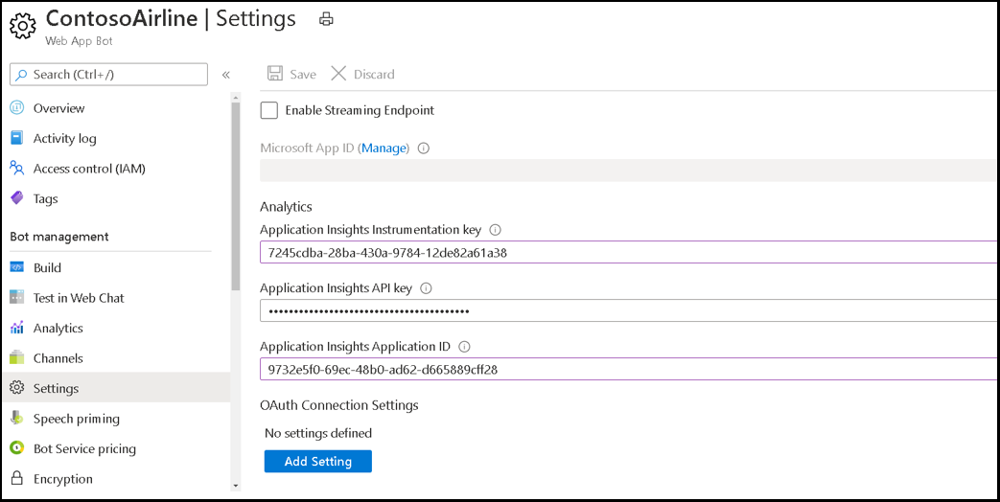

# <a name="single-sign-on-sso-support-for-bots"></a><span data-ttu-id="00d27-105">Suporte a SSO (login único) para bots</span><span class="sxs-lookup"><span data-stu-id="00d27-105">Single sign-on (SSO) support for bots</span></span>

<span data-ttu-id="00d27-106">A autenticação de entrada única no Azure Active Directory (AAD) minimiza o número de vezes que os usuários precisam inserir suas credenciais de entrada atualize silenciosamente o token de autenticação.</span><span class="sxs-lookup"><span data-stu-id="00d27-106">Single sign-on authentication in Azure Active Directory (AAD) minimizes the number of times users need to enter their sign in credentials by silently refreshing the authentication token.</span></span> <span data-ttu-id="00d27-107">Se os usuários concordarem em usar seu aplicativo, eles não precisarão fornecer consentimento novamente em outro dispositivo e podem entrar automaticamente.</span><span class="sxs-lookup"><span data-stu-id="00d27-107">If users agree to use your app, they need not provide consent again on another device and can sign in automatically.</span></span> <span data-ttu-id="00d27-108">O fluxo é semelhante ao do suporte Microsoft Teams [SSO](../../../tabs/how-to/authentication/auth-aad-sso.md)da guia , no entanto, a diferença está no protocolo de como um bot solicita [tokens](#request-a-bot-token) e recebe [respostas](#receive-the-bot-token).</span><span class="sxs-lookup"><span data-stu-id="00d27-108">The flow is similar to that of [Microsoft Teams tab SSO support](../../../tabs/how-to/authentication/auth-aad-sso.md), however, the difference is in the protocol for how a bot [requests tokens](#request-a-bot-token) and [receives responses](#receive-the-bot-token).</span></span>

>[!NOTE]
> <span data-ttu-id="00d27-109">OAuth 2.0 é um padrão aberto para autenticação e autorização usada pela AAD e muitos outros provedores de identidade.</span><span class="sxs-lookup"><span data-stu-id="00d27-109">OAuth 2.0 is an open standard for authentication and authorization used by AAD and many other identity providers.</span></span> <span data-ttu-id="00d27-110">Uma compreensão básica do OAuth 2.0 é um pré-requisito para trabalhar com autenticação no Teams.</span><span class="sxs-lookup"><span data-stu-id="00d27-110">A basic understanding of OAuth 2.0 is a prerequisite for working with authentication in Teams.</span></span>

## <a name="bot-sso-at-runtime"></a><span data-ttu-id="00d27-111">SSO de bot em tempo de execução</span><span class="sxs-lookup"><span data-stu-id="00d27-111">Bot SSO at runtime</span></span>


<span data-ttu-id="00d27-113">Conclua as etapas a seguir para obter tokens de aplicativo de bot e autenticação:</span><span class="sxs-lookup"><span data-stu-id="00d27-113">Complete the following steps to get authentication and bot application tokens:</span></span>

1. <span data-ttu-id="00d27-114">O bot envia uma mensagem com um OAuthCard que contém a `tokenExchangeResource` propriedade.</span><span class="sxs-lookup"><span data-stu-id="00d27-114">The bot sends a message with an OAuthCard that contains the `tokenExchangeResource` property.</span></span> <span data-ttu-id="00d27-115">Ele diz Teams obter um token de autenticação para o aplicativo bot.</span><span class="sxs-lookup"><span data-stu-id="00d27-115">It tells Teams to obtain an authentication token for the bot application.</span></span> <span data-ttu-id="00d27-116">O usuário recebe mensagens em todos os pontos de extremidade do usuário ativo.</span><span class="sxs-lookup"><span data-stu-id="00d27-116">The user receives messages at all the active user endpoints.</span></span>

    > [!NOTE]
    >* <span data-ttu-id="00d27-117">Um usuário pode ter mais de um ponto de extremidade ativo por vez.</span><span class="sxs-lookup"><span data-stu-id="00d27-117">A user can have more than one active endpoint at a time.</span></span>
    >* <span data-ttu-id="00d27-118">O token de bot é recebido de cada ponto de extremidade do usuário ativo.</span><span class="sxs-lookup"><span data-stu-id="00d27-118">The bot token is received from every active user endpoint.</span></span>
    >* <span data-ttu-id="00d27-119">O aplicativo deve ser instalado em escopo pessoal para suporte a SSO.</span><span class="sxs-lookup"><span data-stu-id="00d27-119">The app must be installed in personal scope for SSO support.</span></span>

1. <span data-ttu-id="00d27-120">Se o usuário atual estiver usando seu aplicativo bot pela primeira vez, um prompt de solicitação será exibido solicitando que o usuário faça um dos seguintes:</span><span class="sxs-lookup"><span data-stu-id="00d27-120">If the current user is using your bot application for the first time, a request prompt appears requesting the user to do one of the following:</span></span>
    * <span data-ttu-id="00d27-121">Forneça consentimento, se necessário.</span><span class="sxs-lookup"><span data-stu-id="00d27-121">Provide consent, if required.</span></span>
    * <span data-ttu-id="00d27-122">Manipular a autenticação de etapa, como a autenticação de dois fatores.</span><span class="sxs-lookup"><span data-stu-id="00d27-122">Handle step-up authentication, such as two-factor authentication.</span></span>

1. <span data-ttu-id="00d27-123">Teams solicita o token de aplicativo bot do ponto de extremidade do AAD para o usuário atual.</span><span class="sxs-lookup"><span data-stu-id="00d27-123">Teams requests the bot application token from the AAD endpoint for the current user.</span></span>

1. <span data-ttu-id="00d27-124">O AAD envia o token de aplicativo bot para o Teams aplicativo.</span><span class="sxs-lookup"><span data-stu-id="00d27-124">AAD sends the bot application token to the Teams application.</span></span>

1. <span data-ttu-id="00d27-125">Teams envia o token para o bot como parte do objeto value retornado pela atividade de invocação com o nome **entrar/tokenExchange**.</span><span class="sxs-lookup"><span data-stu-id="00d27-125">Teams sends the token to the bot as part of the value object returned by the invoke activity with the name **sign-in/tokenExchange**.</span></span>
  
1. <span data-ttu-id="00d27-126">O token analisado no aplicativo bot fornece as informações necessárias, como o endereço de email do usuário.</span><span class="sxs-lookup"><span data-stu-id="00d27-126">The parsed token in the bot application provides the required information, such as the user's email address.</span></span>
  
## <a name="develop-an-sso-teams-bot"></a><span data-ttu-id="00d27-127">Desenvolver um bot de Teams SSO</span><span class="sxs-lookup"><span data-stu-id="00d27-127">Develop an SSO Teams bot</span></span>
  
<span data-ttu-id="00d27-128">Conclua as etapas a seguir para desenvolver um bot de Teams SSO:</span><span class="sxs-lookup"><span data-stu-id="00d27-128">Complete the following steps to develop an SSO Teams bot:</span></span>

1. <span data-ttu-id="00d27-129">[Registre seu aplicativo por meio do portal do AAD.](#register-your-app-through-the-aad-portal)</span><span class="sxs-lookup"><span data-stu-id="00d27-129">[Register your app through the AAD portal](#register-your-app-through-the-aad-portal).</span></span>
1. <span data-ttu-id="00d27-130">[Atualize seu Teams de aplicativo para seu bot.](#update-your-teams-application-manifest-for-your-bot)</span><span class="sxs-lookup"><span data-stu-id="00d27-130">[Update your Teams application manifest for your bot](#update-your-teams-application-manifest-for-your-bot).</span></span>
1. <span data-ttu-id="00d27-131">[Adicione o código para solicitar e receber um token de bot](#add-the-code-to-request-and-receive-a-bot-token).</span><span class="sxs-lookup"><span data-stu-id="00d27-131">[Add the code to request and receive a bot token](#add-the-code-to-request-and-receive-a-bot-token).</span></span>

### <a name="register-your-app-through-the-aad-portal"></a><span data-ttu-id="00d27-132">Registrar seu aplicativo por meio do portal do AAD</span><span class="sxs-lookup"><span data-stu-id="00d27-132">Register your app through the AAD portal</span></span>

<span data-ttu-id="00d27-133">As etapas para registrar seu aplicativo por meio do portal do AAD são semelhantes ao [fluxo de SSO da guia](../../../tabs/how-to/authentication/auth-aad-sso.md).</span><span class="sxs-lookup"><span data-stu-id="00d27-133">The steps to register your app through the AAD portal are similar to the [tab SSO flow](../../../tabs/how-to/authentication/auth-aad-sso.md).</span></span> <span data-ttu-id="00d27-134">Conclua as etapas a seguir para registrar seu aplicativo:</span><span class="sxs-lookup"><span data-stu-id="00d27-134">Complete the following steps to register your app:</span></span>

1. <span data-ttu-id="00d27-135">Registre um novo aplicativo no [portal Azure Active Directory – Registros de Aplicativos.](https://go.microsoft.com/fwlink/?linkid=2083908)</span><span class="sxs-lookup"><span data-stu-id="00d27-135">Register a new application in the [Azure Active Directory – App Registrations](https://go.microsoft.com/fwlink/?linkid=2083908) portal.</span></span>
2. <span data-ttu-id="00d27-136">Selecione **Novo Registro**.</span><span class="sxs-lookup"><span data-stu-id="00d27-136">Select **New Registration**.</span></span> <span data-ttu-id="00d27-137">A **página Registrar um aplicativo** é exibida.</span><span class="sxs-lookup"><span data-stu-id="00d27-137">The **Register an application** page appears.</span></span>
3. <span data-ttu-id="00d27-138">Na página **Registrar um aplicativo,** insira os seguintes valores:</span><span class="sxs-lookup"><span data-stu-id="00d27-138">In the **Register an application** page, enter the following values:</span></span>
    1. <span data-ttu-id="00d27-139">Insira um **Nome** para seu aplicativo.</span><span class="sxs-lookup"><span data-stu-id="00d27-139">Enter a **Name** for your app.</span></span>
    2. <span data-ttu-id="00d27-140">Escolha os **tipos de conta com** suporte, selecione locatário único ou tipo de conta multitenant.</span><span class="sxs-lookup"><span data-stu-id="00d27-140">Choose the **Supported account types**, select single tenant or multitenant account type.</span></span>

        > [!NOTE]
        >
        > <span data-ttu-id="00d27-141">Os usuários não são solicitados a consentir e são concedidos tokens de acesso imediatamente, se o aplicativo AAD estiver registrado no mesmo locatário em que eles estão fazendo uma solicitação de autenticação Teams.</span><span class="sxs-lookup"><span data-stu-id="00d27-141">The users are not asked for consent and are granted access tokens right away, if the AAD app is registered in the same tenant where they are making an authentication request in Teams.</span></span> <span data-ttu-id="00d27-142">No entanto, os usuários devem fornecer consentimento para as permissões, se o aplicativo AAD estiver registrado em um locatário diferente.</span><span class="sxs-lookup"><span data-stu-id="00d27-142">However, the users must provide consent to the permissions, if the AAD app is registered in a different tenant.</span></span>

    3. <span data-ttu-id="00d27-143">Escolha **Registrar**.</span><span class="sxs-lookup"><span data-stu-id="00d27-143">Choose **Register**.</span></span>
4. <span data-ttu-id="00d27-144">Na página visão geral, copie e salve a **ID do aplicativo (cliente).**</span><span class="sxs-lookup"><span data-stu-id="00d27-144">On the overview page, copy and save the **Application (client) ID**.</span></span> <span data-ttu-id="00d27-145">Você precisará mais tarde ao atualizar seu manifesto Teams aplicativo.</span><span class="sxs-lookup"><span data-stu-id="00d27-145">You need it later when updating your Teams application manifest.</span></span>
5. <span data-ttu-id="00d27-146">Em **Gerenciar**, selecione **Expor uma API**.</span><span class="sxs-lookup"><span data-stu-id="00d27-146">Under **Manage**, select **Expose an API**.</span></span> 

   > [!IMPORTANT]
    > * <span data-ttu-id="00d27-147">Se você estiver criando um bot autônomo, insira o URI de ID do Aplicativo como `api://botid-{YourBotId}` .</span><span class="sxs-lookup"><span data-stu-id="00d27-147">If you are building a standalone bot, enter the Application ID URI as `api://botid-{YourBotId}`.</span></span> <span data-ttu-id="00d27-148">Aqui **YourBotId** é sua ID do aplicativo AAD.</span><span class="sxs-lookup"><span data-stu-id="00d27-148">Here **YourBotId** is your AAD application ID.</span></span>
    > * <span data-ttu-id="00d27-149">Se você estiver criando um aplicativo com um bot e uma guia, insira o URI de ID do aplicativo como `api://fully-qualified-domain-name.com/botid-{YourBotId}` .</span><span class="sxs-lookup"><span data-stu-id="00d27-149">If you are building an app with a bot and a tab, enter the Application ID URI as `api://fully-qualified-domain-name.com/botid-{YourBotId}`.</span></span>

5. <span data-ttu-id="00d27-150">Selecione as permissões que seu aplicativo precisa para o ponto de extremidade do AAD e, opcionalmente, para o Microsoft Graph.</span><span class="sxs-lookup"><span data-stu-id="00d27-150">Select the permissions that your application needs for the AAD endpoint and, optionally, for Microsoft Graph.</span></span>
6. <span data-ttu-id="00d27-151">[Conceda permissões](/azure/active-directory/develop/v2-permissions-and-consent) para Teams desktop, web e aplicativos móveis.</span><span class="sxs-lookup"><span data-stu-id="00d27-151">[Grant permissions](/azure/active-directory/develop/v2-permissions-and-consent) for Teams desktop, web, and mobile applications.</span></span>
7. <span data-ttu-id="00d27-152">Selecione **Adicionar um escopo**.</span><span class="sxs-lookup"><span data-stu-id="00d27-152">Select **Add a scope**.</span></span>
8. <span data-ttu-id="00d27-153">No painel que é aberto, adicione um aplicativo cliente inserindo `access_as_user` como o nome do **escopo**.</span><span class="sxs-lookup"><span data-stu-id="00d27-153">In the panel that opens, add a client app by entering `access_as_user` as the **Scope name**.</span></span>

    >[!NOTE]
    > <span data-ttu-id="00d27-154">O escopo "access_as_user" usado para adicionar um aplicativo cliente é para "Administradores e usuários".</span><span class="sxs-lookup"><span data-stu-id="00d27-154">The "access_as_user" scope used to add a client app is for "Administrators and users".</span></span>
    >
    > <span data-ttu-id="00d27-155">Você deve estar ciente das seguintes restrições importantes:</span><span class="sxs-lookup"><span data-stu-id="00d27-155">You must be aware of the following important restrictions:</span></span>
    >
    > * <span data-ttu-id="00d27-156">Somente as permissões de API microsoft Graph nível do usuário, como email, perfil, offline_access e OpenId são suportadas.</span><span class="sxs-lookup"><span data-stu-id="00d27-156">Only user-level Microsoft Graph API permissions, such as email, profile, offline_access, and OpenId are supported.</span></span> <span data-ttu-id="00d27-157">Se você precisar de acesso a outros escopos Graph microsoft, como `User.Read` ou , consulte a solução alternativa `Mail.Read` [recomendada](../../../tabs/how-to/authentication/auth-aad-sso.md#apps-that-require-additional-graph-scopes).</span><span class="sxs-lookup"><span data-stu-id="00d27-157">If you need access to other Microsoft Graph scopes, such as `User.Read` or `Mail.Read`, see [recommended workaround](../../../tabs/how-to/authentication/auth-aad-sso.md#apps-that-require-additional-graph-scopes).</span></span>
    > * <span data-ttu-id="00d27-158">O nome de domínio do aplicativo deve ser igual ao nome de domínio que você registrou para seu aplicativo AAD.</span><span class="sxs-lookup"><span data-stu-id="00d27-158">Your application's domain name must be same as the domain name that you have registered for your AAD application.</span></span>
    > * <span data-ttu-id="00d27-159">No momento, não há suporte para vários domínios por aplicativo.</span><span class="sxs-lookup"><span data-stu-id="00d27-159">Multiple domains per app are currently not supported.</span></span>
    > * <span data-ttu-id="00d27-160">Os aplicativos que usam `azurewebsites.net` o domínio não têm suporte porque é comum e pode ser um risco de segurança.</span><span class="sxs-lookup"><span data-stu-id="00d27-160">Applications that use the `azurewebsites.net` domain are not supported because it is common and may be a security risk.</span></span>

#### <a name="update-the-azure-portal-with-the-oauth-connection"></a><span data-ttu-id="00d27-161">Atualizar o portal do Azure com a conexão OAuth</span><span class="sxs-lookup"><span data-stu-id="00d27-161">Update the Azure portal with the OAuth connection</span></span>

<span data-ttu-id="00d27-162">Conclua as etapas a seguir para atualizar o portal do Azure com a conexão OAuth:</span><span class="sxs-lookup"><span data-stu-id="00d27-162">Complete the following steps to update the Azure portal with the OAuth connection:</span></span>

1. <span data-ttu-id="00d27-163">No Portal do Azure, navegue até **Registros de aplicativo.**</span><span class="sxs-lookup"><span data-stu-id="00d27-163">In the Azure Portal, navigate to **App registrations**.</span></span>

2. <span data-ttu-id="00d27-164">Vá para **Permissões de API**.</span><span class="sxs-lookup"><span data-stu-id="00d27-164">Go to **API Permissions**.</span></span> <span data-ttu-id="00d27-165">Selecione **Adicionar uma permissão microsoft**  >  **Graph** permissões  >  **delegadas**, em seguida, adicione as seguintes permissões da API Graph Microsoft:</span><span class="sxs-lookup"><span data-stu-id="00d27-165">Select **Add a permission** > **Microsoft Graph** > **Delegated permissions**, then add the following permissions from Microsoft Graph API:</span></span>
    * <span data-ttu-id="00d27-166">User.Read (habilitado por padrão)</span><span class="sxs-lookup"><span data-stu-id="00d27-166">User.Read (enabled by default)</span></span>
    * <span data-ttu-id="00d27-167">email</span><span class="sxs-lookup"><span data-stu-id="00d27-167">email</span></span>
    * <span data-ttu-id="00d27-168">offline_access</span><span class="sxs-lookup"><span data-stu-id="00d27-168">offline_access</span></span>
    * <span data-ttu-id="00d27-169">OpenId</span><span class="sxs-lookup"><span data-stu-id="00d27-169">OpenId</span></span>
    * <span data-ttu-id="00d27-170">perfil</span><span class="sxs-lookup"><span data-stu-id="00d27-170">profile</span></span>

3. <span data-ttu-id="00d27-171">No Portal do Azure, navegue até **Bot Channels Registration**.</span><span class="sxs-lookup"><span data-stu-id="00d27-171">In the Azure Portal, navigate to **Bot Channels Registration**.</span></span>

4. <span data-ttu-id="00d27-172">Selecione **Configurações** no painel esquerdo e escolha **Adicionar Configuração** na seção Conexão **OAuth Configurações.**</span><span class="sxs-lookup"><span data-stu-id="00d27-172">Select **Settings** on the left pane and choose **Add Setting** under the **OAuth Connection Settings** section.</span></span>

    

5. <span data-ttu-id="00d27-174">Execute as etapas a seguir para concluir o **formulário Nova Configuração de** Conexão:</span><span class="sxs-lookup"><span data-stu-id="00d27-174">Perform the following steps to complete the **New Connection Setting** form:</span></span>

    >[!NOTE]
    > <span data-ttu-id="00d27-175">**A concessão** implícita pode ser necessária no aplicativo AAD.</span><span class="sxs-lookup"><span data-stu-id="00d27-175">**Implicit grant** may be required in the AAD application.</span></span>

    1. <span data-ttu-id="00d27-176">Insira um **Nome** na página **Nova Configuração de** Conexão.</span><span class="sxs-lookup"><span data-stu-id="00d27-176">Enter a **Name** in the **New Connection Setting** page.</span></span> <span data-ttu-id="00d27-177">Esse é o nome que é referido dentro das configurações do código de serviço de bot na etapa *5* do [SSO](#bot-sso-at-runtime)bot no tempo de execução .</span><span class="sxs-lookup"><span data-stu-id="00d27-177">This is the name that is referred to inside the settings of your bot service code in *step 5* of [Bot SSO at runtime](#bot-sso-at-runtime).</span></span>
    2. <span data-ttu-id="00d27-178">No drop-down **Provedor de** Serviços, selecione **Azure Active Directory v2**.</span><span class="sxs-lookup"><span data-stu-id="00d27-178">From the **Service Provider** drop-down, select **Azure Active Directory v2**.</span></span>
    3. <span data-ttu-id="00d27-179">Insira as credenciais do cliente, como **id do** cliente e **segredo do cliente** para o aplicativo AAD.</span><span class="sxs-lookup"><span data-stu-id="00d27-179">Enter the client credentials, such as **Client id** and **Client secret** for the AAD application.</span></span>
    4. <span data-ttu-id="00d27-180">Para a **URL token Exchange**, use o valor de escopo definido em Atualizar seu manifesto do aplicativo Teams para seu [bot](#update-your-teams-application-manifest-for-your-bot).</span><span class="sxs-lookup"><span data-stu-id="00d27-180">For the **Token Exchange URL**, use the scope value defined in [Update your Teams application manifest for your bot](#update-your-teams-application-manifest-for-your-bot).</span></span> <span data-ttu-id="00d27-181">A URL Exchange Token indica ao SDK que esse aplicativo AAD está configurado para SSO.</span><span class="sxs-lookup"><span data-stu-id="00d27-181">The Token Exchange URL indicates to the SDK that this AAD application is configured for SSO.</span></span>
    5. <span data-ttu-id="00d27-182">Na caixa **ID do locatário,** insira *comum*.</span><span class="sxs-lookup"><span data-stu-id="00d27-182">In the **Tenant ID** box, enter *common*.</span></span>
    6. <span data-ttu-id="00d27-183">Adicione todos os **Escopos configurados** ao especificar permissões para APIs downstream para seu aplicativo AAD.</span><span class="sxs-lookup"><span data-stu-id="00d27-183">Add all the **Scopes** configured when specifying permissions to downstream APIs for your AAD application.</span></span> <span data-ttu-id="00d27-184">Com a ID do cliente e o segredo do cliente fornecido, o armazenamento de tokens troca o token por um token de gráfico com permissões definidas.</span><span class="sxs-lookup"><span data-stu-id="00d27-184">With the Client id and Client secret provided, the token store exchanges the token for a graph token with defined permissions.</span></span>
    7. <span data-ttu-id="00d27-185">Selecione **Salvar**.</span><span class="sxs-lookup"><span data-stu-id="00d27-185">Select **Save**.</span></span>

    

### <a name="update-your-teams-application-manifest-for-your-bot"></a><span data-ttu-id="00d27-187">Atualizar o manifesto Teams aplicativo do seu bot</span><span class="sxs-lookup"><span data-stu-id="00d27-187">Update your Teams application manifest for your bot</span></span>

<span data-ttu-id="00d27-188">Se o aplicativo contiver um bot autônomo, use o seguinte código para adicionar novas propriedades ao manifesto Teams aplicativo:</span><span class="sxs-lookup"><span data-stu-id="00d27-188">If the application contains a standalone bot, then use the following code to add new properties to the Teams application manifest:</span></span>

```json
    "webApplicationInfo": 
        {
            "id": "00000000-0000-0000-0000-000000000000",
            "resource": "api://botid-00000000-0000-0000-0000-000000000000"
        }
```
<span data-ttu-id="00d27-189">Se o aplicativo contiver um bot e uma guia, use o seguinte código para adicionar novas propriedades ao manifesto Teams aplicativo:</span><span class="sxs-lookup"><span data-stu-id="00d27-189">If the application contains a bot and a tab, then use the following code to add new properties to the Teams application manifest:</span></span>

```json
    "webApplicationInfo": 
        {
            "id": "00000000-0000-0000-0000-000000000000",
            "resource": "api://subdomain.example.com/botid-00000000-0000-0000-0000-000000000000"
        }
```

<span data-ttu-id="00d27-190">**webApplicationInfo** é o pai dos seguintes elementos:</span><span class="sxs-lookup"><span data-stu-id="00d27-190">**webApplicationInfo** is the parent of the following elements:</span></span>

* <span data-ttu-id="00d27-191">**id** - A ID do cliente do aplicativo.</span><span class="sxs-lookup"><span data-stu-id="00d27-191">**id** - The client ID of the application.</span></span> <span data-ttu-id="00d27-192">Essa é a ID do aplicativo que você obteve como parte do registro do aplicativo com o AAD.</span><span class="sxs-lookup"><span data-stu-id="00d27-192">This is the application ID that you obtained as part of registering the application with AAD.</span></span>
* <span data-ttu-id="00d27-193">**resource** - O domínio e o subdomínio do seu aplicativo.</span><span class="sxs-lookup"><span data-stu-id="00d27-193">**resource** - The domain and subdomain of your application.</span></span> <span data-ttu-id="00d27-194">Esse é o mesmo URI, incluindo o protocolo que você registrou ao criar o seu em Registrar seu aplicativo por meio `api://` `scope` do portal do [AAD.](#register-your-app-through-the-aad-portal)</span><span class="sxs-lookup"><span data-stu-id="00d27-194">This is the same URI, including the `api://` protocol that you registered when creating your `scope` in [Register your app through the AAD portal](#register-your-app-through-the-aad-portal).</span></span> <span data-ttu-id="00d27-195">Você não deve incluir o `access_as_user` caminho em seu recurso.</span><span class="sxs-lookup"><span data-stu-id="00d27-195">You must not include the `access_as_user` path in your resource.</span></span> <span data-ttu-id="00d27-196">A parte de domínio deste URI deve corresponder ao domínio e aos subdomas usados nas URLs do seu manifesto Teams aplicativo.</span><span class="sxs-lookup"><span data-stu-id="00d27-196">The domain part of this URI must match the domain and subdomains used in the URLs of your Teams application manifest.</span></span>

### <a name="add-the-code-to-request-and-receive-a-bot-token"></a><span data-ttu-id="00d27-197">Adicionar o código para solicitar e receber um token de bot</span><span class="sxs-lookup"><span data-stu-id="00d27-197">Add the code to request and receive a bot token</span></span>

#### <a name="request-a-bot-token"></a><span data-ttu-id="00d27-198">Solicitar um token de bot</span><span class="sxs-lookup"><span data-stu-id="00d27-198">Request a bot token</span></span>

<span data-ttu-id="00d27-199">A solicitação para obter o token é uma solicitação de mensagem POST normal usando o esquema de mensagem existente.</span><span class="sxs-lookup"><span data-stu-id="00d27-199">The request to get the token is a normal POST message request using the existing message schema.</span></span> <span data-ttu-id="00d27-200">Ele está incluído nos anexos de um OAuthCard.</span><span class="sxs-lookup"><span data-stu-id="00d27-200">It is included in the attachments of an OAuthCard.</span></span> <span data-ttu-id="00d27-201">O esquema da classe OAuthCard é definido no Esquema do [Microsoft Bot 4.0](/dotnet/api/microsoft.bot.schema.oauthcard?view=botbuilder-dotnet-stable&preserve-view=true) e é semelhante a um cartão de visita.</span><span class="sxs-lookup"><span data-stu-id="00d27-201">The schema for the OAuthCard class is defined in [Microsoft Bot Schema 4.0](/dotnet/api/microsoft.bot.schema.oauthcard?view=botbuilder-dotnet-stable&preserve-view=true) and it is similar to a sign-in card.</span></span> <span data-ttu-id="00d27-202">Teams trata essa solicitação como uma aquisição de token silencioso se a `TokenExchangeResource` propriedade for preenchida no cartão.</span><span class="sxs-lookup"><span data-stu-id="00d27-202">Teams treats this request as a silent token acquisition if the `TokenExchangeResource` property is populated on the card.</span></span> <span data-ttu-id="00d27-203">Para o canal Teams, somente a propriedade, que identifica exclusivamente uma solicitação `Id` de token, é adida.</span><span class="sxs-lookup"><span data-stu-id="00d27-203">For the Teams channel, only the `Id` property, which uniquely identifies a token request, is honored.</span></span>

>[!NOTE]
> <span data-ttu-id="00d27-204">O Microsoft Bot Framework `OAuthPrompt` ou o é suportado para `MultiProviderAuthDialog` autenticação SSO.</span><span class="sxs-lookup"><span data-stu-id="00d27-204">The Microsoft Bot Framework `OAuthPrompt` or the `MultiProviderAuthDialog` is supported for SSO authentication.</span></span>

<span data-ttu-id="00d27-205">Se o usuário estiver usando o aplicativo pela primeira vez e o consentimento do usuário for necessário, a caixa de diálogo a seguir aparecerá para continuar com a experiência de consentimento:</span><span class="sxs-lookup"><span data-stu-id="00d27-205">If the user is using the application for the first time and user consent is required, the following dialog box appears to continue with the consent experience:</span></span>


<span data-ttu-id="00d27-207">Quando o usuário seleciona **Continuar**, os seguintes eventos ocorrem:</span><span class="sxs-lookup"><span data-stu-id="00d27-207">When the user selects **Continue**, the following events occur:</span></span>

* <span data-ttu-id="00d27-208">Se o bot definir um botão de logon, o fluxo de logon para bots será disparado de forma semelhante ao fluxo de logon de um botão de cartão OAuth em um fluxo de mensagens.</span><span class="sxs-lookup"><span data-stu-id="00d27-208">If the bot defines a sign-in button, the sign in flow for bots is triggered similar to the sign in flow from an OAuth card button in a message stream.</span></span> <span data-ttu-id="00d27-209">O desenvolvedor deve decidir quais permissões exigem o consentimento do usuário.</span><span class="sxs-lookup"><span data-stu-id="00d27-209">The developer must decide which permissions require user's consent.</span></span> <span data-ttu-id="00d27-210">Essa abordagem é recomendada se você exigir um token com permissões além `openId` de .</span><span class="sxs-lookup"><span data-stu-id="00d27-210">This approach is recommended if you require a token with permissions beyond `openId`.</span></span> <span data-ttu-id="00d27-211">Por exemplo, se você quiser trocar o token por recursos de gráfico.</span><span class="sxs-lookup"><span data-stu-id="00d27-211">For example, if you want to exchange the token for graph resources.</span></span>

* <span data-ttu-id="00d27-212">Se o bot não estiver fornecendo um botão de logon no cartão OAuth, o consentimento do usuário será necessário para um conjunto mínimo de permissões.</span><span class="sxs-lookup"><span data-stu-id="00d27-212">If the bot is not providing a sign-in button on the OAuth card, user consent is required for a minimal set of permissions.</span></span> <span data-ttu-id="00d27-213">Esse token é útil para autenticação básica e para obter o endereço de email do usuário.</span><span class="sxs-lookup"><span data-stu-id="00d27-213">This token is useful for basic authentication and to get the user's email address.</span></span>

##### <a name="c-token-request-without-a-sign-in-button"></a><span data-ttu-id="00d27-214">C# solicitação de token sem um botão de login</span><span class="sxs-lookup"><span data-stu-id="00d27-214">C# token request without a sign-in button</span></span>

```csharp
    var attachment = new Attachment
            {
                Content = new OAuthCard
                {
                    TokenExchangeResource = new TokenExchangeResource
                    {
                        Id = requestId
                    }
                },
                ContentType = OAuthCard.ContentType,
            };
            var activity = MessageFactory.Attachment(attachment);

            // NOTE: This activity needs to be sent in the 1:1 conversation between the bot and the user. 
            // If the bot supports group and channel scope, this code should be updated to send the request to the 1:1 chat. 

       await turnContext.SendActivityAsync(activity, cancellationToken);
```

#### <a name="receive-the-bot-token"></a><span data-ttu-id="00d27-215">Receber o token de bot</span><span class="sxs-lookup"><span data-stu-id="00d27-215">Receive the bot token</span></span>

<span data-ttu-id="00d27-216">A resposta com o token é enviada por meio de uma atividade de invocação com o mesmo esquema que outras atividades de invocação que os bots recebem hoje.</span><span class="sxs-lookup"><span data-stu-id="00d27-216">The response with the token is sent through an invoke activity with the same schema as other invoke activities that the bots receive today.</span></span> <span data-ttu-id="00d27-217">A única diferença é o nome da invocação, **o login/tokenExchange** e o **campo de** valor.</span><span class="sxs-lookup"><span data-stu-id="00d27-217">The only difference is the invoke name, **sign-in/tokenExchange** and the **value** field.</span></span> <span data-ttu-id="00d27-218">O **campo** valor contém a **Id**, uma cadeia de caracteres da solicitação inicial para obter o token e o **campo de token,** um valor de cadeia de caracteres, incluindo o token.</span><span class="sxs-lookup"><span data-stu-id="00d27-218">The **value** field contains the **Id**, a string of the initial request to get the token and the **token** field, a string value including the token.</span></span>

>[!NOTE]
> <span data-ttu-id="00d27-219">Você pode receber várias respostas para uma determinada solicitação se o usuário tiver vários pontos de extremidade ativos.</span><span class="sxs-lookup"><span data-stu-id="00d27-219">You might receive multiple responses for a given request if the user has multiple active endpoints.</span></span> <span data-ttu-id="00d27-220">Você deve deduplicar as respostas com o token.</span><span class="sxs-lookup"><span data-stu-id="00d27-220">You must deduplicate the responses with the token.</span></span>

##### <a name="c-code-to-handle-the-invoke-activity"></a><span data-ttu-id="00d27-221">C# código para manipular a atividade de invocação</span><span class="sxs-lookup"><span data-stu-id="00d27-221">C# code to handle the invoke activity</span></span>

```csharp
    protected override async Task<InvokeResponse> OnInvokeActivityAsync
    (ITurnContext<IInvokeActivity> turnContext, CancellationToken cancellationToken)
            {
                try
                {
                    if (turnContext.Activity.Name == SignInConstants.TokenExchangeOperationName && turnContext.Activity.ChannelId == Channels.Msteams)
                    {
                        await OnTokenResponseEventAsync(turnContext, cancellationToken);
                        return new InvokeResponse() { Status = 200 };
                    }
                    else
                    {
                        return await base.OnInvokeActivityAsync(turnContext, cancellationToken);
                    }
                }
                catch (InvokeResponseException e)
                {
                    return e.CreateInvokeResponse();
                }
            }
```

<span data-ttu-id="00d27-222">O `turnContext.activity.value` é do tipo [TokenExchangeInvokeRequest](/dotnet/api/microsoft.bot.schema.tokenexchangeinvokerequest?view=botbuilder-dotnet-stable&preserve-view=true) e contém o token que pode ser mais usado pelo bot.</span><span class="sxs-lookup"><span data-stu-id="00d27-222">The `turnContext.activity.value` is of type [TokenExchangeInvokeRequest](/dotnet/api/microsoft.bot.schema.tokenexchangeinvokerequest?view=botbuilder-dotnet-stable&preserve-view=true) and contains the token that can be further used by your bot.</span></span> <span data-ttu-id="00d27-223">Você deve armazenar os tokens por motivos de desempenho e atualize-os.</span><span class="sxs-lookup"><span data-stu-id="00d27-223">You must store the tokens for performance reasons and refresh them.</span></span>

### <a name="token-exchange-failure"></a><span data-ttu-id="00d27-224">Falha na troca de tokens</span><span class="sxs-lookup"><span data-stu-id="00d27-224">Token exchange failure</span></span>

<span data-ttu-id="00d27-225">Em caso de falha na troca de tokens, use o seguinte código:</span><span class="sxs-lookup"><span data-stu-id="00d27-225">In case of token exchange failure, use the following code:</span></span>

```json
{ 
    "status": "<response code>", 
    "body": 
    { 
        "id":"<unique Id>", 
        "connectionName": "<connection Name on the bot (from the OAuth card)>", 
        "failureDetail": "<failure reason if status code is not 200, null otherwise>" 
    } 
}
```

<span data-ttu-id="00d27-226">Para entender o que o bot faz quando a troca de token falha ao disparar um prompt de consentimento, consulte as seguintes etapas:</span><span class="sxs-lookup"><span data-stu-id="00d27-226">To understand what the bot does when the token exchange fails to trigger a consent prompt, see the following steps:</span></span>

>[!NOTE]
> <span data-ttu-id="00d27-227">Nenhuma ação do usuário é necessária para ser tomada à medida que o bot assume as ações quando a troca de token falha.</span><span class="sxs-lookup"><span data-stu-id="00d27-227">No user action is required to be taken as the bot takes the actions when the token exchange fails.</span></span>

1. <span data-ttu-id="00d27-228">O cliente inicia uma conversa com o bot disparando um cenário OAuth.</span><span class="sxs-lookup"><span data-stu-id="00d27-228">The client starts a conversation with the bot triggering an OAuth scenario.</span></span>
2. <span data-ttu-id="00d27-229">O bot envia de volta um cartão OAuth para o cliente.</span><span class="sxs-lookup"><span data-stu-id="00d27-229">The bot sends back an OAuth card to the client.</span></span>
3. <span data-ttu-id="00d27-230">O cliente intercepta o cartão OAuth antes de exibi-lo para o usuário e verifica se ele contém uma `TokenExchangeResource` propriedade.</span><span class="sxs-lookup"><span data-stu-id="00d27-230">The client intercepts the OAuth card before displaying it to the user and checks if it contains a `TokenExchangeResource` property.</span></span>
4. <span data-ttu-id="00d27-231">Se a propriedade existir, o cliente enviará um `TokenExchangeInvokeRequest` para o bot.</span><span class="sxs-lookup"><span data-stu-id="00d27-231">If the property exists, the client sends a `TokenExchangeInvokeRequest` to the bot.</span></span> <span data-ttu-id="00d27-232">O cliente deve ter um token exchangeable para o usuário, que deve ser um token do Azure AD v2 e cuja audiência deve ser igual à `TokenExchangeResource.Uri` propriedade.</span><span class="sxs-lookup"><span data-stu-id="00d27-232">The client must have an exchangeable token for the user, which must be an Azure AD v2 token and whose audience must be the same as `TokenExchangeResource.Uri` property.</span></span> <span data-ttu-id="00d27-233">O cliente envia uma atividade de invocação para o bot com o seguinte código:</span><span class="sxs-lookup"><span data-stu-id="00d27-233">The client sends an invoke activity to the bot with the following code:</span></span>

    ```json
    {
        "type": "Invoke",
        "name": "signin/tokenExchange",
        "value": 
        {
            "id": "<any unique Id>",
            "connectionName": "<connection Name on the skill bot (from the OAuth card)>",
            "token": "<exchangeable token>"
        }
    }
    ```

5. <span data-ttu-id="00d27-234">O bot processa `TokenExchangeInvokeRequest` o e retorna uma volta para o `TokenExchangeInvokeResponse` cliente.</span><span class="sxs-lookup"><span data-stu-id="00d27-234">The bot processes the `TokenExchangeInvokeRequest` and returns a `TokenExchangeInvokeResponse` back to the client.</span></span> <span data-ttu-id="00d27-235">O cliente deve aguardar até receber o `TokenExchangeInvokeResponse` .</span><span class="sxs-lookup"><span data-stu-id="00d27-235">The client must wait till it receives the `TokenExchangeInvokeResponse`.</span></span>

    ```json
    {
        "status": "<response code>",
        "body": 
        {
            "id":"<unique Id>",
            "connectionName": "<connection Name on the skill bot (from the OAuth card)>",
            "failureDetail": "<failure reason if status code is not 200, null otherwise>"
        }
    }
    ```

6. <span data-ttu-id="00d27-236">Se o `TokenExchangeInvokeResponse` tiver um de , o cliente não `status` `200` mostrará o cartão OAuth.</span><span class="sxs-lookup"><span data-stu-id="00d27-236">If the `TokenExchangeInvokeResponse` has a `status` of `200`, then the client does not show the OAuth card.</span></span> <span data-ttu-id="00d27-237">Consulte a [imagem de fluxo normal](/azure/bot-service/bot-builder-concept-sso?view=azure-bot-service-4.0#sso-components-interaction&preserve-view=true).</span><span class="sxs-lookup"><span data-stu-id="00d27-237">See the [normal flow image](/azure/bot-service/bot-builder-concept-sso?view=azure-bot-service-4.0#sso-components-interaction&preserve-view=true).</span></span> <span data-ttu-id="00d27-238">Para qualquer outro ou se o não for recebido, o cliente mostrará o cartão `status` `TokenExchangeInvokeResponse` OAuth para o usuário.</span><span class="sxs-lookup"><span data-stu-id="00d27-238">For any other `status` or if the `TokenExchangeInvokeResponse` is not received, then the client shows the OAuth card to the user.</span></span> <span data-ttu-id="00d27-239">Consulte a [imagem de fluxo de fallback](/azure/bot-service/bot-builder-concept-sso?view=azure-bot-service-4.0#sso-components-interaction&preserve-view=true).</span><span class="sxs-lookup"><span data-stu-id="00d27-239">See the [fallback flow image](/azure/bot-service/bot-builder-concept-sso?view=azure-bot-service-4.0#sso-components-interaction&preserve-view=true).</span></span> <span data-ttu-id="00d27-240">Isso garante que o fluxo de SSO volte ao fluxo normal do OAuthCard em caso de erros ou dependências não a ativas, como o consentimento do usuário.</span><span class="sxs-lookup"><span data-stu-id="00d27-240">This ensures that the SSO flow falls back to normal OAuthCard flow in case of any errors or unmet dependencies like user consent.</span></span>


### <a name="update-the-auth-sample"></a><span data-ttu-id="00d27-241">Atualizar o exemplo de auth</span><span class="sxs-lookup"><span data-stu-id="00d27-241">Update the auth sample</span></span>

<span data-ttu-id="00d27-242">Abra [Teams exemplo de auth](https://github.com/microsoft/BotBuilder-Samples/tree/master/samples/csharp_dotnetcore/46.teams-auth) e conclua as seguintes etapas para atualizá-lo:</span><span class="sxs-lookup"><span data-stu-id="00d27-242">Open [Teams auth sample](https://github.com/microsoft/BotBuilder-Samples/tree/master/samples/csharp_dotnetcore/46.teams-auth) and then complete the following steps to update it:</span></span>

1. <span data-ttu-id="00d27-243">Atualize o TeamsBot para lidar com a dedução da solicitação de entrada incluindo o seguinte código:</span><span class="sxs-lookup"><span data-stu-id="00d27-243">Update the TeamsBot to handle the deduping of the incoming request by including the following code:</span></span>

    ```csharp
        protected override async Task OnSignInInvokeAsync(ITurnContext<IInvokeActivity> turnContext, CancellationToken cancellationToken)
            {
                await Dialog.RunAsync(turnContext, ConversationState.CreateProperty<DialogState>(nameof(DialogState)), cancellationToken);
            }
        protected override async Task OnTokenResponseEventAsync(ITurnContext<IEventActivity> turnContext, CancellationToken cancellationToken)
            {
                await Dialog.RunAsync(turnContext, ConversationState.CreateProperty<DialogState>(nameof(DialogState)), cancellationToken);
            }
    ```
  
2. <span data-ttu-id="00d27-244">Atualizar para incluir a , senha e o nome da conexão definido em `appsettings.json` Atualizar o portal do `botId` [Azure com a conexão OAuth](#update-the-azure-portal-with-the-oauth-connection).</span><span class="sxs-lookup"><span data-stu-id="00d27-244">Update `appsettings.json` to include the `botId`, password, and the connection name defined in [Update the Azure portal with the OAuth connection](#update-the-azure-portal-with-the-oauth-connection).</span></span>
3. <span data-ttu-id="00d27-245">Atualize o manifesto e verifique `token.botframework.com` se está na lista de domínios válidos.</span><span class="sxs-lookup"><span data-stu-id="00d27-245">Update the manifest and ensure that `token.botframework.com` is in the valid domains list.</span></span> <span data-ttu-id="00d27-246">Para obter mais informações, [consulte Teams exemplo de auth](https://github.com/microsoft/BotBuilder-Samples/tree/master/samples/csharp_dotnetcore/46.teams-auth).</span><span class="sxs-lookup"><span data-stu-id="00d27-246">For more information, see [Teams auth sample](https://github.com/microsoft/BotBuilder-Samples/tree/master/samples/csharp_dotnetcore/46.teams-auth).</span></span>
4. <span data-ttu-id="00d27-247">Feche o manifesto com as imagens de perfil e instale-o Teams.</span><span class="sxs-lookup"><span data-stu-id="00d27-247">Zip the manifest with the profile images and install it in Teams.</span></span>

## <a name="code-sample"></a><span data-ttu-id="00d27-248">Exemplo de código</span><span class="sxs-lookup"><span data-stu-id="00d27-248">Code sample</span></span>
|<span data-ttu-id="00d27-249">**Exemplo de nome**</span><span class="sxs-lookup"><span data-stu-id="00d27-249">**Sample name**</span></span> | <span data-ttu-id="00d27-250">**Descrição**</span><span class="sxs-lookup"><span data-stu-id="00d27-250">**Description**</span></span> |<span data-ttu-id="00d27-251">**.NET**</span><span class="sxs-lookup"><span data-stu-id="00d27-251">**.NET**</span></span> | 
|----------------|-----------------|--------------|
|<span data-ttu-id="00d27-252">SDK da estrutura bot</span><span class="sxs-lookup"><span data-stu-id="00d27-252">Bot framework SDK</span></span> | <span data-ttu-id="00d27-253">Exemplo para usar o SDK da estrutura de bot.</span><span class="sxs-lookup"><span data-stu-id="00d27-253">Sample for using the bot framework SDK.</span></span> |[<span data-ttu-id="00d27-254">View</span><span class="sxs-lookup"><span data-stu-id="00d27-254">View</span></span>](https://github.com/microsoft/BotBuilder-Samples/tree/main/experimental/teams-sso/csharp_dotnetcore)|
