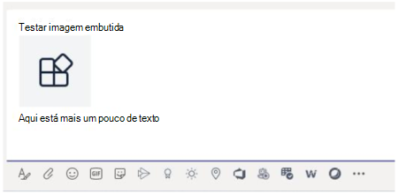

# <a name="send-and-receive-files-through-the-bot"></a>Enviar e receber arquivos por meio do bot

> [!IMPORTANT]
> Os artigos neste documento são baseados no SDK do Bot Framework v4.

Há duas maneiras de enviar e receber arquivos de um bot:

* [**Use as APIs do Microsoft Graph:**](#use-the-graph-apis) esse método funciona para bots em todos os Microsoft Teams escopos:
  * `personal`
  * `channel`
  * `groupchat`

* [**Use as APIs Teams bot: elas**](#use-the-teams-bot-apis) só dão suporte a arquivos no `personal` contexto.

## <a name="use-the-graph-apis"></a>Usar as APIs Graph configuração

Poste mensagens com anexos de cartão que fazem referência a arquivos SharePoint existentes, usando as APIs do Graph para OneDrive [e SharePoint](/onedrive/developer/rest-api/). Para usar as APIs Graph, obtenha acesso a qualquer uma das seguintes opções por meio do fluxo de autorização padrão do OAuth 2.0:

* A pasta de OneDrive de um usuário e `personal` arquivos`groupchat`.
* Os arquivos no canal de uma equipe para `channel` arquivos.

Graph APIs funcionam em todos os Teams escopos. Para obter mais informações, consulte [enviar anexos de arquivo de mensagem de chat](/graph/api/chatmessage-post?view=graph-rest-beta&tabs=http#example-4-file-attachments&preserve-view=true).

Como alternativa, você pode enviar e receber arquivos de um bot usando as APIs Teams bot.

## <a name="use-the-teams-bot-apis"></a>Usar as APIs Teams bot

> [!NOTE]
> Teams APIs de bot funcionam somente no `personal` contexto. Eles não funcionam no contexto `channel` ou no `groupchat` contexto.

Usando Teams APIs, o bot `personal` pode enviar e receber arquivos diretamente com usuários no contexto, também conhecidos como chats pessoais. Implemente recursos, como relatórios de despesas, reconhecimento de imagem, arquivamento de arquivos e assinaturas e-signatures que envolvem a edição do conteúdo do arquivo. Os arquivos compartilhados Teams normalmente aparecem como cartões e permitem a exibição avançada no aplicativo.

As próximas seções descrevem como enviar conteúdo de arquivo como interação direta do usuário, como enviar uma mensagem. Essa API é fornecida como parte da plataforma Teams bot.

### <a name="configure-the-bot-to-support-files"></a>Configurar o bot para dar suporte a arquivos

Para enviar e receber arquivos no bot, defina a `supportsFiles` propriedade no manifesto como `true`. Essa propriedade é descrita na seção [bots](~/resources/schema/manifest-schema.md#bots) da referência de manifesto.

A definição tem esta aparência. `"supportsFiles": true` Se o bot não habilitar `supportsFiles`, os recursos listados nesta seção não funcionarão.

### <a name="receive-files-in-personal-chat"></a>Receber arquivos no chat pessoal

Quando um usuário envia um arquivo para o bot, o arquivo é carregado pela primeira vez na conta de OneDrive para empresas. Em seguida, o bot recebe uma atividade de mensagem notificando o usuário sobre o upload do usuário. A atividade contém metadados de arquivo, como seu nome e a URL de conteúdo. O usuário pode ler diretamente dessa URL para buscar seu conteúdo binário.

#### <a name="message-activity-with-file-attachment-example"></a>Exemplo de atividade de mensagem com anexo de arquivo

O código a seguir mostra um exemplo de atividade de mensagem com anexo de arquivo:

```json
{
  "attachments": [{
    "contentType": "application/vnd.microsoft.teams.file.download.info",
    "contentUrl": "https://contoso.sharepoint.com/personal/johnadams_contoso_com/Documents/Applications/file_example.txt",
    "name": "file_example.txt",
    "content": {
      "downloadUrl" : "https://download.link",
      "uniqueId": "1150D938-8870-4044-9F2C-5BBDEBA70C9D",
      "fileType": "txt",
      "etag": "123"
    }
  }]
}
```

A tabela a seguir descreve as propriedades de conteúdo do anexo:

| Propriedade | Objetivo |
| --- | --- |
| `downloadUrl` | OneDrive URL para buscar o conteúdo do arquivo. O usuário pode emitir um `HTTP GET` diretamente dessa URL. |
| `uniqueId` | ID de arquivo exclusiva. Essa é a OneDrive ID do item da unidade, caso o usuário envie um arquivo para o bot. |
| `fileType` | Tipo de arquivo, como .pdf ou .docx. |

Como prática recomendada, confirme o upload do arquivo enviando uma mensagem de volta para o usuário.

### <a name="upload-files-to-personal-chat"></a>Upload arquivos para chat pessoal

Para carregar um arquivo para um usuário:

1. Envie uma mensagem para o usuário solicitando permissão para gravar o arquivo. Essa mensagem deve conter um `FileConsentCard` anexo com o nome do arquivo a ser carregado.
2. Se o usuário aceitar o download do arquivo, o bot receberá uma atividade de invocação com uma URL de local.
3. Para transferir o arquivo, o bot executa um diretamente `HTTP POST` na URL de local fornecida.
4. Opcionalmente, remova o cartão de consentimento original se você não quiser que o usuário aceite uploads adicionais do mesmo arquivo.

#### <a name="message-requesting-permission-to-upload"></a>Mensagem solicitando permissão para carregar

A seguinte mensagem da área de trabalho contém um objeto de anexo simples solicitando permissão do usuário para carregar o arquivo:


A seguinte mensagem móvel contém um objeto de anexo solicitando permissão do usuário para carregar o arquivo:


```json
{
  "attachments": [{
    "contentType": "application/vnd.microsoft.teams.card.file.consent",
    "name": "file_example.txt",
    "content": {
      "description": "<Purpose of the file, such as: this is your monthly expense report>",
      "sizeInBytes": 1029393,
      "acceptContext": {
      },
      "declineContext": {
      }
    }
  }]
}
```

A tabela a seguir descreve as propriedades de conteúdo do anexo:

| Propriedade | Objetivo |
| --- | --- |
| `description` | Descreve a finalidade do arquivo ou resume seu conteúdo. |
| `sizeInBytes` | Fornece ao usuário uma estimativa do tamanho do arquivo e a quantidade de espaço necessário OneDrive. |
| `acceptContext` | Contexto adicional que é transmitido silenciosamente para o bot quando o usuário aceita o arquivo. |
| `declineContext` | Contexto adicional que é transmitido silenciosamente para o bot quando o usuário recusa o arquivo. |

#### <a name="invoke-activity-when-the-user-accepts-the-file"></a>Invocar atividade quando o usuário aceita o arquivo

Uma atividade de invocação é enviada ao bot se e quando o usuário aceita o arquivo. Ele contém a URL OneDrive for Business espaço reservado que o bot pode emitir para `PUT` transferir o conteúdo do arquivo. Para obter informações sobre como carregar para a URL OneDrive, consulte [bytes de upload para a sessão de upload](/onedrive/developer/rest-api/api/driveitem_createuploadsession#upload-bytes-to-the-upload-session).

O código a seguir mostra um exemplo de uma versão concisa da atividade de invocação que o bot recebe:

```json
{
  "name": "fileConsent/invoke",
  "value": {
    "type": "fileUpload",
    "action": "accept",
    "context": {
    },
    "uploadInfo": {
      "contentUrl": "https://contoso.sharepoint.com/personal/johnadams_contoso_com/Documents/Applications/file_example.txt",
      "name": "file_example.txt",
      "uploadUrl": "https://upload.link",
      "uniqueId": "1150D938-8870-4044-9F2C-5BBDEBA70C8C",
      "fileType": "txt",
      "etag": "123"
    }
  }
}
```

Da mesma forma, se o usuário recusar o arquivo, o bot receberá o seguinte evento com o mesmo nome geral da atividade:

```json
{
  "name": "fileConsent/invoke",
  "value": {
    "type": "fileUpload",
    "action": "decline",
    "context": {
    }
  }
}
```

### <a name="notifying-the-user-about-an-uploaded-file"></a>Notificar o usuário sobre um arquivo carregado

Depois de carregar um arquivo na conta do OneDrive, envie uma mensagem de confirmação para o usuário. A mensagem deve conter o seguinte `FileCard` anexo que o usuário pode selecionar, para visualizar ou abri-lo no OneDrive ou baixar localmente:

```json
{
  "attachments": [{
    "contentType": "application/vnd.microsoft.teams.card.file.info",
    "contentUrl": "https://contoso.sharepoint.com/personal/johnadams_contoso_com/Documents/Applications/file_example.txt",
    "name": "file_example.txt",
    "content": {
      "uniqueId": "1150D938-8870-4044-9F2C-5BBDEBA70C8C",
      "fileType": "txt",
    }
  }]
}
```

A tabela a seguir descreve as propriedades de conteúdo do anexo:

| Propriedade | Objetivo |
| --- | --- |
| `uniqueId` | OneDrive ou SharePoint ID do item da unidade de unidade. |
| `fileType` | Tipo de arquivo, como .pdf ou .docx. |

### <a name="fetch-inline-images-from-message"></a>Buscar imagens embutidas da mensagem

Busque imagens embutidas que fazem parte da mensagem usando o token de acesso do Bot.



O código a seguir mostra um exemplo de busca de imagens embutidas da mensagem:

```csharp
private async Task ProcessInlineImage(ITurnContext<IMessageActivity> turnContext, CancellationToken cancellationToken)
{
    var attachment = turnContext.Activity.Attachments[0];
    var client = _clientFactory.CreateClient();
    // Get Bot's access token to fetch inline image. 
    var token = await new MicrosoftAppCredentials(microsoftAppId, microsoftAppPassword).GetTokenAsync();
    client.DefaultRequestHeaders.Authorization = new AuthenticationHeaderValue("Bearer", token);
    var responseMessage = await client.GetAsync(attachment.ContentUrl);
    // Save the inline image to Files directory.
    var filePath = Path.Combine("Files", "ImageFromUser.png");
    using (var fileStream = new FileStream(filePath, FileMode.Create, FileAccess.Write, FileShare.None))
    {
        await responseMessage.Content.CopyToAsync(fileStream);
    }
    // Create reply with image.
    var reply = MessageFactory.Text($"Attachment of {attachment.ContentType} type and size of {responseMessage.Content.Headers.ContentLength} bytes received.");
    reply.Attachments = new List<Attachment>() { 
        GetInlineAttachment() 
    };
    await turnContext.SendActivityAsync(reply, cancellationToken);
}
private static Attachment GetInlineAttachment()
{
    var imagePath = Path.Combine("Files", "ImageFromUser.png");
    var imageData = Convert.ToBase64String(File.ReadAllBytes(imagePath));
    return new Attachment
    {
        Name = @"ImageFromUser.png",
        ContentType = "image/png",
        ContentUrl = $"data:image/png;base64,{imageData}",
    };
}
```

### <a name="basic-example-in-c"></a>Exemplo básico em C #

O código a seguir mostra um exemplo de como lidar com uploads de arquivos e enviar solicitações de consentimento de arquivo na caixa de diálogo do bot:

```csharp

protected override async Task OnMessageActivityAsync(ITurnContext<IMessageActivity> turnContext, CancellationToken cancellationToken)
{
    if (turnContext.Activity.Attachments?[0].ContentType.Contains("image/*") == true)
    {
        // Inline image.
        await ProcessInlineImage(turnContext, cancellationToken);
    }
    else
    {
        string filename = "teams-logo.png";
        string filePath = Path.Combine("Files", filename);
        long fileSize = new FileInfo(filePath).Length;
        await SendFileCardAsync(turnContext, filename, fileSize, cancellationToken);
    }
}
private async Task ProcessInlineImage(ITurnContext<IMessageActivity> turnContext, CancellationToken cancellationToken)
{
    var attachment = turnContext.Activity.Attachments[0];
    var client = _clientFactory.CreateClient();
    // Get Bot's access token to fetch inline image. 
    var token = await new MicrosoftAppCredentials(microsoftAppId, microsoftAppPassword).GetTokenAsync();
    client.DefaultRequestHeaders.Authorization = new AuthenticationHeaderValue("Bearer", token);
    var responseMessage = await client.GetAsync(attachment.ContentUrl);
    // Save the inline image to Files directory.
    var filePath = Path.Combine("Files", "ImageFromUser.png");
    using (var fileStream = new FileStream(filePath, FileMode.Create, FileAccess.Write, FileShare.None))
    {
        await responseMessage.Content.CopyToAsync(fileStream);
    }
    // Create reply with image.
    var reply = MessageFactory.Text($"Attachment of {attachment.ContentType} type and size of {responseMessage.Content.Headers.ContentLength} bytes received.");
    reply.Attachments = new List<Attachment>() { GetInlineAttachment() };
    await turnContext.SendActivityAsync(reply, cancellationToken);
}
private static Attachment GetInlineAttachment()
{
    var imagePath = Path.Combine("Files", "ImageFromUser.png");
    var imageData = Convert.ToBase64String(File.ReadAllBytes(imagePath));
    return new Attachment
    {
        Name = @"ImageFromUser.png",
        ContentType = "image/png",
        ContentUrl = $"data:image/png;base64,{imageData}",
    };
}
private async Task SendFileCardAsync(ITurnContext turnContext, string filename, long filesize, CancellationToken cancellationToken)
{
    var consentContext = new Dictionary<string, string>
    {
        { 
            "filename", filename 
        },
    };
    var fileCard = new FileConsentCard
    {
        Description = "This is the file I want to send you",
        SizeInBytes = filesize,
        AcceptContext = consentContext,
        DeclineContext = consentContext,
    };
    var asAttachment = new Attachment
    {
        Content = fileCard,
        ContentType = FileConsentCard.ContentType,
        Name = filename,
    };
    var replyActivity = turnContext.Activity.CreateReply();
    replyActivity.Attachments = new List<Attachment>() { asAttachment };
    await turnContext.SendActivityAsync(replyActivity, cancellationToken);
}
```

## <a name="code-sample"></a>Exemplo de código

O exemplo de código a seguir demonstra como obter o consentimento do arquivo e carregar arquivos para Teams de um bot:

|**Nome de exemplo** | **Descrição** | **.NET** | **Javascript** | **Python**|
|----------------|-----------------|--------------|----------------|-----------|
| Upload de arquivos | Demonstra como obter o consentimento do arquivo e carregar arquivos para Teams de um bot. Além disso, como receber um arquivo enviado para um bot. | [View](https://github.com/microsoft/BotBuilder-Samples/blob/main/samples/csharp_dotnetcore/56.teams-file-upload) | [View](https://github.com/microsoft/BotBuilder-Samples/blob/main/samples/javascript_nodejs/56.teams-file-upload) | [View](https://github.com/microsoft/BotBuilder-Samples/blob/main/samples/python/56.teams-file-upload) |

## <a name="step-by-step-guide"></a>Guias passo a passo

Siga o [guia passo a passo para](../../sbs-file-handling-in-bot.yml) carregar o arquivo no Teams usando o bot.

## <a name="next-step"></a>Próxima etapa

> [!div class="nextstepaction"]
> [Otimizar seu bot com limitação de fluxo no Teams](~/bots/how-to/rate-limit.md)
