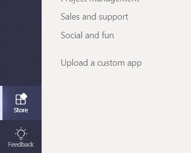
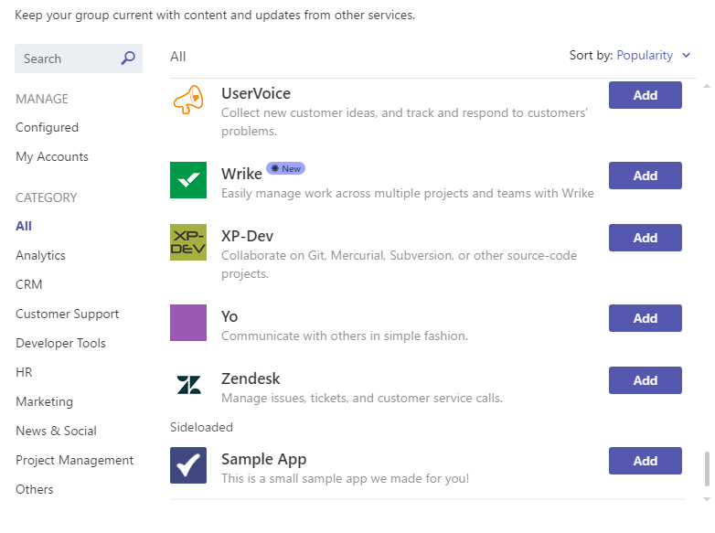

# Carregar um pacote do aplicativo para o Microsoft Teams

Para testar a experiência do aplicativo no Microsoft Teams, você precisa carregar seu aplicativo para o Teams. O carregamento adiciona o aplicativo à equipe selecionada e você e os membros da equipe podem interagir com ele, como os usuários finais.

> [!NOTE]
> Carregar um pacote atualizado para um aplicativo existente com um bot pode não mostrar as alterações de tabulação quando visualizado por meio da janela conversas. É melhor acessá-lo por meio do surgimento dos aplicativos ou teste em um ambiente de teste limpo.

## Criar seu pacote de carregamento

Para o desenvolvimento, bem como o envio do AppSource (anteriormente Office Store), você deve criar um pacote que contenha as informações para descrever sua experiência. O pacote, um arquivo. zip, contém o manifesto do aplicativo e os ícones que definem exclusivamente sua experiência.

Para criar um pacote de carregamento, consulte [criar o pacote para seu aplicativo do Microsoft Teams](../build-and-test/apps-package.md).

Com seu pacote criado, agora você pode carregá-lo em uma equipe. Depois de carregado, ele estará disponível para todos os usuários da equipe selecionada e apenas para os usuários dessa equipe.

## Carregar seu pacote no Microsoft Teams

Você pode testar seu pacote carregando-o no Microsoft Teams.

> [!NOTE]
> Para que o carregamento funcione, o administrador de locatário deve primeiro [habilitar o carregamento de aplicativos](/microsoftteams/admin-settings).

Há duas maneiras de carregar seu aplicativo para o Microsoft Teams:

* Usando o repositório
* Usando a guia aplicativos

## Carregar seu pacote em uma equipe ou conversa usando a loja

1. No canto inferior esquerdo do Teams, escolha o ícone de armazenamento. Na página loja, escolha "carregar um aplicativo personalizado".

   

2. Na caixa de diálogo *abrir* , navegue até o pacote que você deseja carregar e escolha *abrir*.

O pacote carregado agora deve estar disponível para uso na equipe ou conversa especificada na caixa de diálogo de consentimento. Se seu aplicativo não aparecer, o motivo mais comum é um erro no manifesto, principalmente IDs para o aplicativo, bot e extensões de mensagens. Se o aplicativo não tiver escopo para conversas, essa opção não será exibida.

>[!NOTE]
> Os aplicativos em conversas estão atualmente na [visualização do desenvolvedor](../../resources/dev-preview/developer-preview-intro.md)e a opção não será exibida se o Microsoft Teams não estiver em execução nesse modo.

## Carregar seu pacote em uma equipe usando a guia aplicativos

1. Na equipe de destino, escolha *mais opções* (**&#8943;**) e escolha *Gerenciar equipe*.

   > [!NOTE]
   > Você deve ser o proprietário da equipe ou o proprietário deve permitir que os usuários adicionem os tipos de aplicativos apropriados para que essa funcionalidade seja exibida.

2. Selecione a guia aplicativos e, em seguida, escolha *carregar um aplicativo personalizado* no canto inferior direito.

   

3. Navegue até o pacote. zip e selecione-o em seu computador.

4. Após uma breve pausa, você verá seu aplicativo carregado na lista.

   

Se seu aplicativo não carregar, o motivo mais comum é um erro no manifesto, principalmente IDs para o aplicativo, bot e extensões de mensagens.

## Acessar a guia configurável do carregado

Se o aplicativo contiver guias, os usuários poderão fixá-los em qualquer conversa ou canal de equipe usando o fluxo da Galeria de guias padrão:

1. Vá para um canal da equipe. Escolha *+* (*Adicionar uma guia*) à direita das guias existentes.

2. Selecione sua guia na galeria que aparece.

3. Aceite o prompt de consentimento.

4. Configure sua guia por meio de sua [página de configuração](../../tabs/how-to/create-tab-pages/configuration-page.md) e escolha *salvar*.

  

## Acessar o bot carregado

Quando você adiciona um bot a uma equipe, ele deve ser útil para qualquer pessoa nessa equipe, dentro e fora dos canais da equipe, dependendo da definição do escopo do bot. Você e outros membros da equipe verão uma postagem no canal geral indicando que o bot foi adicionado à equipe.

Para um bot habilitado para o Microsoft Teams, você pode começar invocando o bot, @mentioning o nome do bot, que deve ser concluído.

Para testar chats diretos com o bot, você pode acessá-lo por meio da página inicial do aplicativo, @mention-lo em um canal ou procurá-lo na nova janela de **chat** .

Ao adicionar o bot a uma conversa para testar chats diretos com o bot, você pode @mention-lo em uma conversa ou procurá-lo na nova janela de **chat** .

## Acessando seu conector carregado

Com o aplicativo carregado na equipe ou na conversa, os usuários podem configurar um conector usando o fluxo da Galeria de conectores padrão:

1. Vá para um canal da equipe. Escolha *mais opções* (*&#8943;*) e escolha *conectores*.

2. Selecione seu conector na seção **suplementos foi feito** na parte inferior.

3. Configure seu conector por meio de sua [página de configuração](../../webhooks-and-connectors/how-to/connectors-creating.md) e escolha *salvar*.

  

## Acessar sua extensão de mensagens carregadas

Um aplicativo carregado com uma extensão de mensagens aparece automaticamente no menu *mais opções* (*&#8943;*) na caixa de composição.

## Remover ou atualizar seu aplicativo

Se você deseja remover o aplicativo, selecione o ícone Lixeira ao lado do nome do aplicativo na lista de bots do modo de exibição do teams.

Se você alterar as informações do manifesto, remova primeiro o aplicativo e, em seguida, adicione o pacote atualizado (por [carregar seu pacote em uma equipe](#load-your-package-into-teams)). Observe que, em geral, as alterações de código no serviço não exigem que você carregue novamente seu manifesto, a menos que essas alterações exijam atualizações de manifesto (como alterações na URL ou na ID do aplicativo da Microsoft para seu bot).

> [!NOTE]
> Não é possível remover completamente um bot do contexto pessoal. Se o bot for removido e adicionado novamente, a comunicação adicional com o bot será acrescentada à conversa anterior.

## Notas de solução de problemas

* Se o manifesto não carregar, verifique se você seguiu todas as instruções em [criar o pacote](../../concepts/build-and-test/apps-package.md) e validou seu manifesto no [esquema](../../resources/schema/manifest-schema.md).

