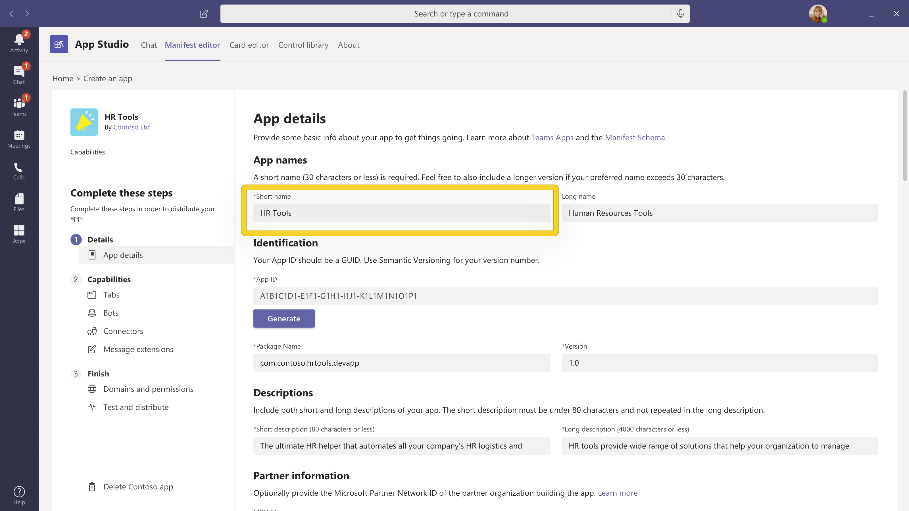
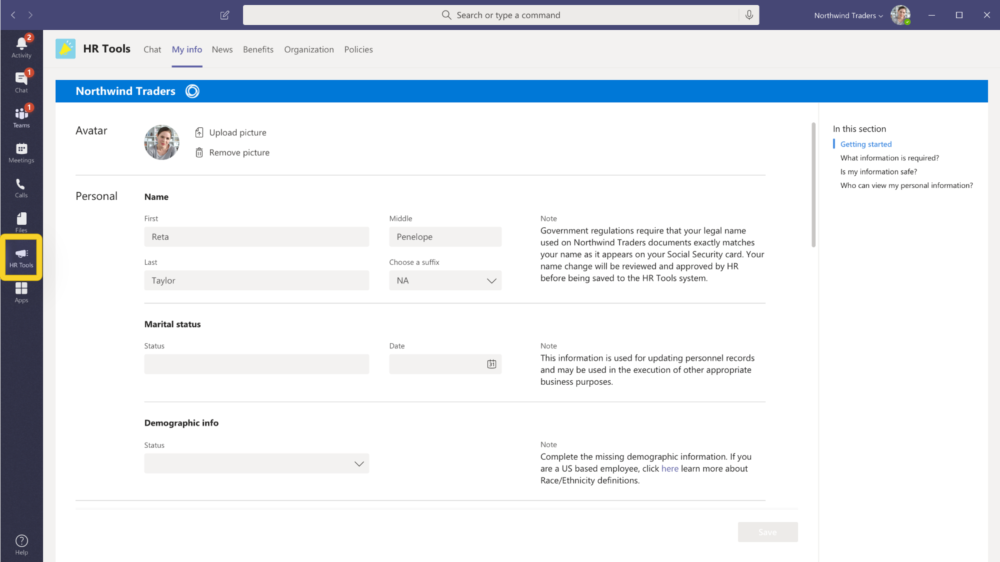
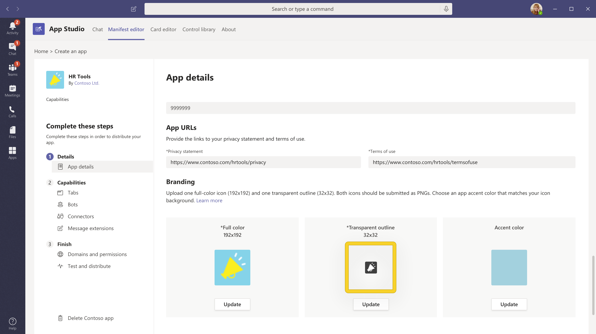

# Criar uma ótima página de detalhes do aplicativoBuild a great app details page

A página de detalhes apresenta a primeira impressão do seu aplicativo para os usuários.The details page presents the first impression of your app to users. Cada elemento da sua página de detalhes pode ser usado para transmitir sua visão e downloads de unidade — considere como você deseja demonstrar seu aplicativo em um espaço limitado.Each element of your details page can be used to convey your vision and drive downloads — consider how you want to showcase your app in a limited space. Aqui estão algumas dicas e truques para ajudá-lo a envolver seus usuários antes mesmo de instalar seu aplicativo.Here are some tips and tricks to help you engage your users before they even install your app.

> [!NOTE]
> Certifique-se de que as informações do seu aplicativo sigam nossas diretrizes do [AppSource para criar uma listagem da Loja eficaz.](/office/dev/store/create-effective-office-store-listings)Make sure your app information follows our [AppSource guidance for creating an effective store listing](/office/dev/store/create-effective-office-store-listings).

## Nome do aplicativoApp name

> [!div class="checklist"]
>
> * O nome de um aplicativo desempenha um papel fundamental na forma como os usuários o descobre na app store do AppSource.An app's name plays a critical role in how users discover it in the AppSource app store. O nome curto do aplicativo é exibido na página de detalhes.Your app's short name is displayed on the details page.
>* O nome do aplicativo deve refletir seu aplicativo sem qualquer referência aos produtos da Microsoft ou da Microsoft.The app name should reflect your app without any reference to Microsoft or Microsoft products.
>

> **Observação:** se seu aplicativo for uma parceria oficial com a Microsoft, o nome do aplicativo de terceiros precisará ser o primeiro, por exemplo, o Conector salesforce para *o Microsoft Teams.***Note**: If your app is an official partnership with Microsoft, then the name of the third-party app needs to be first, e.g., *Salesforce Connector for Microsoft Teams*.

> [!div class="checklist"]
>
>* Use estes recursos para obter orientações:Use these resources for guidance:

* [Guia de nome do aplicativoApp name guide](#app-name)
* [Diretrizes de marca e marca da MicrosoftMicrosoft Trademark and Brand Guidelines](https://www.microsoft.com/en-us/legal/intellectualproperty/trademarks/usage/general)

**O que fazer é:****Do's:**

* Escolha um nome simples e fácil de lembrar que indica o que seu aplicativo faz.Choose a simple, memorable name that hints at what your app does.
* Seja distinto.Be distinctive.
* Se necessário, use as referências do Microsoft 365 em vez do Office 365.If needed, use Microsoft 365 references instead of Office 365.

**O que não fazer:****Don'ts:**

* Não omita espaços, tenha uma ocorrência incorreta ou contenha erros de idioma no nome do aplicativo.Don't omit spaces, have an incorrect case, or contain language errors in the app name.
* Não use termos genéricos ou nomes semelhantes aos aplicativos existentes.Don't use generic terms or names similar to existing apps.
* Não use "Teams", "Microsoft", nomes de produtos da Microsoft existentes/futuros ou "aplicativo" no nome do aplicativo.Don't use "Teams", "Microsoft", existing/upcoming Microsoft product names, or  "app" in your app name.
* Não use parênteses para incluir produtos da Microsoft, por exemplo, o Nome do Seu *Aplicativo (para o Microsoft Teams).*Don't use parenthesis to include Microsoft products, e.g., *Your-App-Name (for Microsoft Teams)*.

## Ícone de corColor icon

Este é um dos primeiros elementos que os usuários veem.This is one of the first elements that users see. Ele deve ser atraente e atraente ao rolar pela loja de aplicativos.It should be attractive and eye-catching when scrolling through the app store. Certifique-se de que isso seja uma boa primeira impressão e também comunique a imagem e a finalidade da sua marca.Be sure it makes a good first impression and also communicates your brand's image and purpose. O AppSource tem mais dicas sobre [como criar uma identidade visual consistente.](/office/dev/store/create-effective-office-store-listings#create-a-consistent-visual-identity)AppSource has more tips on [creating a consistent visual identity](/office/dev/store/create-effective-office-store-listings#create-a-consistent-visual-identity).

**O que não fazer:****Don'ts:**

* Seu ícone não deve imitar nenhum produto protegido por direitos autorais que você não possui.Your icon must not mimic any copyrighted products that you don't own.
* Seu ícone não deve ser semelhante a qualquer produto/marca da Microsoft.Your icon must not look similar to any Microsoft product/brands.

## Ícone de contornoOutline icon

Esse ícone é usado para extensões de mensagens fixadas e quando seu aplicativo é exibido à esquerda do Teams.This icon is used for pinned messaging extensions and when your app displays on the left of Teams. Consulte [as diretrizes de design para o ícone de estrutura de estrutura de estrutura.](../../../../concepts/build-and-test/apps-package.md#outline-icon)See [design guidance for the outline icon](../../../../concepts/build-and-test/apps-package.md#outline-icon).

 

**O que não fazer:****Don'ts:**

* Seu ícone não deve imitar nenhum produto protegido por direitos autorais que você não possui.Your icon must not mimic any copyrighted products you don't own.
* Seu ícone não deve ser semelhante a qualquer produto/marca da Microsoft.Your icon must not look similar to any Microsoft product/brands.

## Descrição breveShort description

Este é um resumo conciso do seu aplicativo.This is a concise summary of your app. Ela deve ser original, interessante e direcionada ao seu público-alvo.You want it to be original, engaging, and directed at your target audience. O ideal é tentar descrever sua solução e seu valor para os usuários em uma única frase.Ideally, try and describe your solution and its value to your users in one sentence.

**O que fazer é:****Do's:**

* Fale primeiro as informações mais importantes.Put the most important information first.
* Inclua palavras-chave que os clientes provavelmente pesquisarão.Include keywords that customers are likely to search for.
* Se você precisar mencionar o Microsoft Teams, a primeira menção do Microsoft Teams deve ser escrita na íntegra como *Microsoft Teams.*If you need to mention Microsoft Teams, the first mention of Microsoft Teams should be written out in full as *Microsoft Teams*. Se o Teams for mencionado novamente na mesma descrição, o nome poderá ser encurtado para o *Teams.*If Teams is mentioned again in the same description, the name can be shortened to *Teams*.
* Todas as referências à Microsoft ou ao Microsoft Teams podem fazer parte da descrição e devem seguir os padrões e diretrizes da marca da Microsoft.Any references to Microsoft or Microsoft Teams can be part of the description and should follow Microsoft’s brand standards and guidelines.
* Todas as descrições devem ser gramaticalmente corretas sem erros de idioma.All descriptions must be grammatically correct with no language errors.
* Evite o uso desnecessário de maiúsculas, por exemplo, informando "Usuários" em vez de "usuários".Avoid unnecessary use of capitalizations, e.g., stating "Users" instead of "users".

**O que não fazer:****Don'ts:**

* Não repita o título.Don't repeat the title.
* Não abreviar a Microsoft como "MS" ou "MSFT".Don't abbreviate Microsoft to "MS" or "MSFT".
* Não use jargão ou terminologia especializada — você não pode presumir que os usuários saibam o que procurar.Don't use jargon or specialized terminology — you can't assume that users know what to look for.
* Evite referências desnecessárias a nomes de produtos da Microsoft, a menos que seja absolutamente necessário.Avoid unnecessary reference to Microsoft product names unless absolutely necessary.
* Não indique ou indique que o aplicativo é uma oferta da Microsoft.Don't indicate or imply that the app is an offering from Microsoft.
* Não use nomes de marca protegidos por direitos autorais que você não possui.Don't use copyrighted brand names you don't own.
* Não use "para o Teams" em um nome curto.Don't  use "for Teams" in a short name.

Aqui está uma exibição no [App Studio:](https://aka.ms/InstallTeamsAppStudio)Here's a view in [App Studio](https://aka.ms/InstallTeamsAppStudio):

## Descrição longaLong description

> [!div class="checklist"]
>
>* Isso fornece uma história envolvente que destaca os principais recursos da sua solução, os problemas que ela resolve e o público-alvo.This provides an engaging narrative highlighting your solution's main features, the problems it solves, and the target audience. Desenque seu público com a primeira frase comunicando os recursos exclusivos do seu aplicativo.Draw in your audience with the first sentence by communicating your app's unique features. Sua descrição deve ter menos de 4.000 caracteres; a maioria dos usuários só lerá entre 300 e 500 palavras.Your description must be under 4000 characters; most users will only read between 300 and 500 words.
>* O que é permitido?What is allowed?

* `<your_app>`  "funciona com o Microsoft Teams"`<your_app>`  "works with Microsoft Teams"
* `<for users>`  "trabalhando com o Microsoft Teams"`<for users>`  "working with Microsoft Teams"
* `<for tasks>`  "no Microsoft Teams"`<for tasks>`  "within Microsoft Teams"
* `<an app>`  "para o Microsoft Teams"`<an app>`  "for Microsoft Teams"
* `<your_app>`  "integra-se ao Microsoft Teams"`<your_app>`  "integrates with Microsoft Teams"
* "... integrado ao Microsoft Teams""...integrated with Microsoft Teams"
* "... criado em...""...built on…"
* "... é executado em...""...runs on…"
* "... habilitado por...""…enabled by…"
* "... desenvolvido para...""…developed for…"
* "... projetado para...""…designed for…"

> **Observação:** os termos acima também se aplicam ao uso do Microsoft 365.**Note**: The above terms also apply to the use of Microsoft 365. O Office 365 agora é chamado de Microsoft 365.Office 365 is now called Microsoft 365. Atualize as descrições do aplicativo para refletir isso.Please update your app descriptions to reflect this.

>[!IMPORTANT]
> Copie com precisão as descrições que você escreveu na entrada do AppSource no manifesto do aplicativo — os valores devem corresponder.Make sure to precisely copy the descriptions you wrote in your AppSource entry to your app manifest — the values must match. O Microsoft Teams usará apenas as descrições fornecidas no manifesto do aplicativo.Microsoft Teams will only use the descriptions you provide in the app manifest.

**O que fazer é:****Do's:**

* Use [a formatação Markdown](https://support.office.com/article/use-markdown-formatting-in-teams-4d10bd65-55e2-4b2d-a1f3-2bebdcd2c772) para iluminar sua descrição.Use [Markdown formatting](https://support.office.com/article/use-markdown-formatting-in-teams-4d10bd65-55e2-4b2d-a1f3-2bebdcd2c772) to illuminate your description.  
* Listar recursos para auxiliar os leitores na verificação de sua descrição.List features to aid readers in scanning your description.
* Use a voz ativa e fale diretamente com os usuários.Use active voice and speak to users directly.
* Use pontos de marcador para listar seus recursos.Use bullet points to list out your features.
* Inclua um link de ajuda ou suporte para que os usuários saibam como falar com você se eles têm dúvidas.Include a help or support link so your users know how to reach you if they have questions.
* Certifique-se de que a primeira menção do Microsoft Teams seja escrita na íntegra como "*Microsoft Teams*".Make certain that the first mention of Microsoft Teams is written out in full as "*Microsoft Teams*". Se o Teams for mencionado novamente mais tarde na mesma descrição, o nome poderá ser reduzido para "*Teams*".If Teams is mentioned again later in the same description, the name can be shortened to "*Teams*".
* Quaisquer referências à Microsoft ou ao Microsoft Teams (somente se necessário) podem fazer parte da descrição longa e devem seguir os padrões e diretrizes da marca da Microsoft.Any references to Microsoft or Microsoft Teams (only if necessary)  may be part of the long description and should follow Microsoft’s brand standards and guidelines.
* Todas as descrições devem estar gramaticalmente corretas sem erros de idioma.All descriptions must be grammatically correct with no language errors.
* Evite o uso desnecessário de maiúsculas em termos em sua descrição (exemplo: declarando "Usuários" em vez de "usuários".Avoid unnecessary use of capitalizations for terms in your description (example: stating "Users" instead of "users".
* Evite acrônimos.Avoid acronyms.
* Certifique-se de chamar limitações, dependência de conta, configuração definida, atualizações futuras em versões ou quaisquer restrições de usoMake sure to call out limitations, account dependency, configuration set up, future updates in releases, or any usage constraints

>[!NOTE]
> O Microsoft Teams dá suporte à seguinte sintaxe de Markdown:Microsoft Teams supports the following Markdown syntax:  
> **Links**.**Links**. `[title](url/address/here)`.`[title](url/address/here)`.  
>**Imagens** `` ...**Images**.``.  
> **Negrito**.**Bold**. `**bold text**`   `__bold text__`.`**bold text**`   `__bold text__`.  
> **Itálico .****Italics**. `*italicized text*`  `_italicized text`.`*italicized text*`  `_italicized text`.  
>**[Listas ordenadas](https://www.markdownguide.org/basic-syntax/#ordered-lists)****[Ordered Lists](https://www.markdownguide.org/basic-syntax/#ordered-lists)** 
>`1. first` 
 ` 1. second ` 
 `1.third` 
>**[Unordered List](https://www.markdownguide.org/basic-syntax/#unordered-lists)****[Unordered List](https://www.markdownguide.org/basic-syntax/#unordered-lists)** 
` - short`  `- bulleted`  `- list` 
>**Newline**.**Newline**. `Place   at the end of a line.`   \
 >\**Escape.** \
\**Escape.** Use uma inline backslash para escapar caracteres especiais.Use an inline backslash to escape special characters. `\*asterisk`.`\*asterisk`.

**Exemplo no formato Markdown****Example in Markdown format**

|Formato de markdown paraMarkdown format for |Formato markdownMarkdown format |Texto exibidoDisplayed text|
|:---------|:---------------|:-------------|
|LinkLink  |` [App name guide](#app-name)`| [Guia de nome do aplicativoApp name guide](#app-name) |
|ImageImage |` `| |
|NegritoBold |` **HR Tools**` | **Ferramentas de RH****HR Tools**  |
|ItálicoItalics |`*HR Tools*` |*Ferramentas de RH**HR Tools*|
|NewlineNewline |` HR Tools provide wide range of solutions that help your organization to manage day-to-day HR activities effectively.   No more flipping through paper records or juggling among 5 different apps.` |As Ferramentas de RH fornecem uma ampla variedade de soluções que ajudam sua organização a gerenciar as atividades diárias de RH com eficiência.HR Tools provide wide range of solutions that help your organization to manage day-to-day HR activities effectively.    Não há mais inverta registros de papel ou manipulando entre cinco aplicativos diferentes.No more flipping through paper records or juggling among 5 different apps.|
|EscapeEscape|`\*Payroll tools that help you manage your payroll and tax documents.` |\*Ferramentas de folha de pagamento que ajudam você a gerenciar sua folha de pagamento e documentos fiscais.\*Payroll tools that help you manage your payroll and tax documents. 

**O que não fazer:****Don'ts:**

* Não coloque muitas palavras-chave em sua descrição. Isso desvia a atenção e não ajuda a descoberta do seu aplicativo.Don't put too many keywords in your description — it's distracting and won't help your app's discoverability.
* Não use "*Teams*" ou "*Microsoft Teams*" em um nome curto.Don't use "*Teams*” or “*Microsoft Teams*” in a short name.
* Evite referências desnecessárias a nomes de produtos da Microsoft, a menos que seja absolutamente necessário.Avoid unnecessary reference to Microsoft product names unless absolutely necessary.
* Não indique que o aplicativo é uma oferta da Microsoft.Don't indicate that the app is an offering from Microsoft.
* Não use nomes de marca protegidos por direitos autorais que você não possui.Don't use copyrighted brand names you don't own.
* Não use o seguinte idioma, a menos que o aplicativo tenha passado por um processo de certificação oficial:Don't use the following language unless the app has gone through an official certification process:

  * "... certificado para...""…certified for…"
  * "... da tecnologia...""…powered by…"

* Não abreviar "Microsoft" para "MS" ou "MSFT" — escreva a Microsoft na íntegra.Don't abbreviate “Microsoft” to “MS” or “MSFT” — write Microsoft out in full.
* Nenhuma parte da descrição ou dos metadados pode indicar o aplicativo como uma oferta oficial da Microsoft.No part of description or metadata can indicate the app as an official Microsoft offering.
* Os parceiros não podem usar ou imitar qualquer marca da Microsoft ou usar o nome de qualquer produto ou serviço da Microsoft no tagline ou no tagline.Partners may not use or imitate any Microsoft tagline, or use the name of any Microsoft product or service in the slogan or tagline.
* O logotipo não deve representar incorretamente o aplicativo como um produto/recurso oficial da Microsoft ou imitar qualquer um dos produtos da Microsoft existentes ou futuros.Logo must not wrongly depict the app as an official Microsoft product/ feature or mimic any of the existing or upcoming Microsoft products.

Aqui está uma exibição no [App Studio:](https://aka.ms/InstallTeamsAppStudio)Here's a view in [App Studio](https://aka.ms/InstallTeamsAppStudio):

## Capturas de telaScreenshots

As capturas de tela carregadas no [Partner Center](https://partner.microsoft.com) são exibidas no [AppSource](https://appsource.microsoft.com/marketplace/apps?product=office%3Bteams&page=1) e na listagem do aplicativo no cliente do Teams.The screenshots uploaded on the [Partner Center](https://partner.microsoft.com) are displayed in both [AppSource](https://appsource.microsoft.com/marketplace/apps?product=office%3Bteams&page=1) and your app listing in the Teams client. Eles fornecem uma visualização visual do seu aplicativo juntamente com a descrição do aplicativo.They provide a visual preview of your app along with your app description.
Você pode fornecer de uma a cinco capturas de tela formatadas como arquivos .png, .jpg ou .gif.You can provide one to five screenshots formatted as .png, .jpg, or .gif files. Screenshots should be 1366 x 768 pixels with a maximum size of 1024 KB.Screenshots should be 1366 x 768 pixels with a maximum size of 1024 KB.

**O que fazer é:****Do's:**

* Concentre-se em realçar todos os recursos do seu aplicativo.Focus on highlighting all your app's capabilities.
* O conteúdo deve representar seu aplicativo com precisão.Content should accurately represent your app.
* O texto deve ser bem preenchido sem ser excessivo.Text should be well-populated without being excessive.
* Você pode colocar suas capturas de tela com uma cor de fundo e adicionar conteúdo de marketing semelhante ao [exemplo do Freshdesk;](https://appsource.microsoft.com/product/office/WA104381505?src=office&tab=Overview) no entanto, as dimensões não serão apenas da captura de tela, mas incluirão a imagem geral.You can surround your screenshots with a background color and add marketing content similar to the [Freshdesk](https://appsource.microsoft.com/product/office/WA104381505?src=office&tab=Overview) example; however, the dimensions won't be of the screenshot alone but will include the overall image.

**O que não fazer:****Don'ts:**

* Não mostre dispositivos específicos, como telefones ou laptops.Don't show specific devices, like phones or laptops.
* Não mostre chrome/interface do usuário de fora do seu aplicativo.Don't show any chrome/UI from outside of your app.
* Não capture nenhuma interface do usuário do navegador ou do Teams nas capturas de tela.Don't capture any Teams or browser UI in your screenshots.
* Não inclua modelos que reflitam imprecisamente a interface do usuário real de seus aplicativos, como mostrar seu site em vez da guia do Teams.Don't include mock-ups that inaccurately reflect your apps actual UI such as showing your website instead of your Teams tab.

Para obter mais práticas *recomendadas, consulte:* [Criação de imagens efetivas da loja do AppSource.](/office/dev/store/craft-effective-appsource-store-images)For more best practices, *see*: [Crafting effective AppSource store images](/office/dev/store/craft-effective-appsource-store-images).

## VídeosVideos

Se uma imagem vale milhares de palavras, então um vídeo vale milhares de imagens.If an image is worth a thousand words, then a video is worth a thousand images. Os vídeos são a maneira mais eficaz de comunicar os benefícios de usar seu aplicativo.Videos are the most effective way to communicate the benefits of using your app. Ele será colocado na frente de todas as capturas de tela na página de detalhes do aplicativo.It will be placed in front of all your screenshots on the app details page. Certifique-se de mencionar o seguinte:Make sure you mention the following:

* Como seu aplicativo funciona.How your app works.
* O que pode ser feito com seu aplicativo.What can be achieved with your app.
* Os benefícios de usar seu aplicativo.The benefits of using your app.
* Para quem você é.Who your is for.

Lembre-se de manter sua apresentação curta e meiga — em algum lugar entre 30 e 90 segundos.Remember to keep your presentation short and sweet — somewhere between 30-90 seconds.

## Saiba maisLearn more

[Lista de verificação para envio de aplicativo.](~/concepts/deploy-and-publish/appsource/publish.md)[Checklist for app submission](~/concepts/deploy-and-publish/appsource/publish.md).  
[Crie um pacote do aplicativo para o aplicativo Microsoft Teams.](~/concepts/build-and-test/apps-package.md)[Create an app package for your Microsoft Teams app](~/concepts/build-and-test/apps-package.md).  
[Use o Partner Center para enviar sua solução ao AppSource.](/office/dev/store/use-partner-center-to-submit-to-appsource)[Use Partner Center to submit your solution to AppSource](/office/dev/store/use-partner-center-to-submit-to-appsource).
