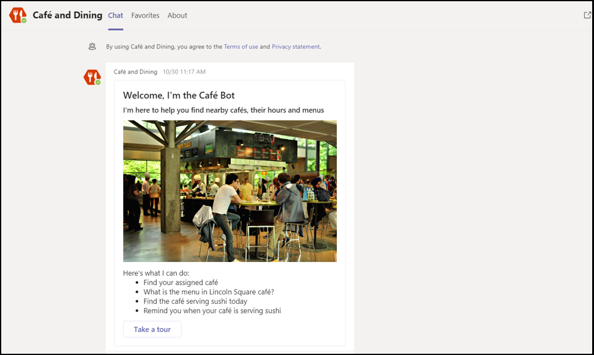

# Dicas para um envio de aplicativo de Microsoft Teams bem-sucedidoTips for a successful Microsoft Teams app submission

>[!NOTE]
>Esta página será preterida até maio de 2021.This page will be deprecated by May 2021. Para obter mais informações sobre como publicar seu aplicativo com êxito, consulte as [diretrizes Teams de](~/concepts/deploy-and-publish/appsource/prepare/teams-store-validation-guidelines.md)validação da loja.For more information on successfully publishing your app, see the [Teams store validation guidelines](~/concepts/deploy-and-publish/appsource/prepare/teams-store-validation-guidelines.md).

Este artigo aborda motivos comuns para a validação de falha dos aplicativos enviados.This article addresses common reasons submitted apps fail validation. Embora não se pretenda ser uma lista exaustiva de todos os possíveis problemas com seu aplicativo, seguir este guia aumentará a probabilidade de o envio do aplicativo passar pela primeira vez.While it's not intended to be an exhaustive list of all potential issues with your app, following this guide will increase the likelihood that your app submission will pass the first time. Consulte [Políticas de certificação do marketplace](/legal/marketplace/certification-policies) comercial para uma lista extensa de políticas de validação.See [Commercial marketplace certification policies](/legal/marketplace/certification-policies) for an extensive list of validation policies.

>[!NOTE]
>**[A Seção 1140](/legal/marketplace/certification-policies#1140-teams)** é específica para Microsoft Teams e a **[subseção 1140.4](https://docs.microsoft.com/legal/marketplace/certification-policies#11404-functionality)** aborda os requisitos de funcionalidade para Teams aplicativos.**[Section 1140](/legal/marketplace/certification-policies#1140-teams)** is specific to Microsoft Teams and **[sub-section 1140.4](https://docs.microsoft.com/legal/marketplace/certification-policies#11404-functionality)** addresses functionality requirements for Teams apps.

## Diretrizes de validação & a maioria dos casos de teste com falhaValidation guidelines & most failed test cases

### &#9989; considerações gerais&#9989; General considerations

Consulte também [Seção 100 — Geral](/legal/marketplace/certification-policies#100-general)See also [Section 100 — General](/legal/marketplace/certification-policies#100-general)

* Verifique se você está usando a versão 1.4.1 ou posterior do [Microsoft Teams SDK](https://www.npmjs.com/package/@microsoft/teams-js).Ensure you are using version 1.4.1 or later of the [Microsoft Teams SDK](https://www.npmjs.com/package/@microsoft/teams-js).
* Não faça alterações em seu aplicativo enquanto o processo de validação estiver em andamento.Don't make changes to your app while the validation process is in progress. Isso exigirá uma revalidação completa do seu aplicativo.Doing so will require a complete revalidation of your app.
* Seu aplicativo não deve parar de responder, terminar inesperadamente ou conter erros de programação.Your app must not stop responding, end unexpectedly, or contain programming errors. Se ocorrer um problema, seu aplicativo deverá falhar e fornecer informações válidas para o encaminhamento para o usuário.If an issue occurs, your app must fail and provide valid information for the way-forward to the user.
* Seu aplicativo não deve baixar, instalar ou iniciar automaticamente qualquer código executável no ambiente do usuário.Your app must not automatically download, install, or launch any executable code in the user environment. Todos os downloads devem buscar permissão explícita do usuário.All downloads must seek explicit permission from the user.
* Qualquer material associado à sua experiência, como descrições e documentação de suporte, deve ser preciso.Any material that you associate with your experience, such as descriptions and support documentation, must be accurate. Use ortografia, capitalização, pontuação e gramática corretas em suas descrições e materiais.Use correct spelling, capitalization, punctuation, and grammar in your descriptions and materials.
* Forneça informações de ajuda e suporte.Provide help and support information. É altamente recomendável que seu aplicativo inclua uma ajuda ou um link de perguntas frequentes para a experiência do usuário de primeira.It's highly recommended that your app include a help or FAQ link for the first-run user experience. Para todos os aplicativos pessoais, recomendamos fornecer sua página de ajuda como uma guia pessoal para uma melhor experiência do usuário.For all personal apps, we recommend providing your help page as a personal tab for a better user experience.
* Todos os aplicativos devem ter  um tour  visual, como Fazer um Tour ou um Guia de Aplicativo em sua tela de configuração que fale sobre os recursos do aplicativo e a integração necessária nos seguintes locais:All apps must have a visual tour, such as **Take a Tour** or an **App Guide** in its configuration screen that talks about the app features and necessary integration in the following places:
    * A página de listagem da loja (Long Description).The store listing page (Long Description).
    * Tela de configuração de tabulação.Tab configuration screen.
    * Mensagem de boas-vindas para um bot.Welcome message for a bot.
    * Metadados de origem do aplicativo.App source metadata.
    * Tela de configuração do conector.Connector configuration screen.

* O tour visual pode ser um vídeo, captura de tela, um link para uma guia estática com detalhes do aplicativo.The visual tour can be a  video, screenshot, a link to a static tab with app details. Todas essas referências devem estar dentro do Teams ambiente.All these references must be within the Teams environment.

      

* Incremente o número da versão do aplicativo no manifesto se você fizer alterações de manifesto no envio.Increment your app version number in the manifest if you make any manifest changes to your submission.
* O aplicativo não deve tirar os usuários do Teams principais cenários do usuário.The app must not take users out of Teams for core user scenarios. Os destinos de link em aplicativos não devem ser link para um navegador externo.Link targets in apps must not link to an external browser. Os destinos de link devem vincular aos elementos div contidos Teams, por exemplo, módulos de tarefas e guias.Link targets must link to div elements contained within Teams, for example, task modules and tabs. 
* O uso de módulos de tarefas ou guias é sugerido para exibir informações aos usuários dentro Teams.Using task modules or tabs is suggested to display information to users within Teams.
* Todos os cenários principais e não essenciais devem ser concluídos no ambiente Teams, exceto por:All core and non-core scenarios must be completed within the Teams environment except for:
  * Política de privacidadePrivacy Policy
  * Termos de Uso (TOU)Terms Of Use (TOU)
  * Link do siteWebsite link
  * Processo de inscrever-seSign-up process

* Aplicativos pessoais permitem que os usuários compartilhem conteúdo de uma experiência de aplicativo pessoal com outros membros da equipe.Personal apps enable users to share content from a personal app experience with other team members.

### &#9989; fornecer uma experiência clara e simples de entrar, entrar e inscrever-se&#9989; Provide a clear and simple sign-in, sign-out, and sign-up experience

Consulte também [Seção 1100.5 — Controle do cliente](/legal/marketplace/certification-policies#11005-customer-control)See also [Section 1100.5 — Customer control](/legal/marketplace/certification-policies#11005-customer-control)

* Se o aplicativo ou o seu add-in depender de contas ou serviços externos, a experiência de login, de saída e de assinatura deve ser aparente e acessível em todos os recursos em seu aplicativo.If your app or add-in depends on external accounts or services, the sign-in, sign-out, and sign-up experience must be apparent and reachable across all capabilities in your app.
* Se houver uma opção de login explícita fornecida ao usuário, deverá haver uma opção de saída correspondente (mesmo se o aplicativo estiver usando autenticação [silenciosa](../../../../tabs/how-to/authentication/auth-silent-aad.md)).If there is an explicit sign-in option provided to the user, there must be a corresponding sign-out option (even if the app is using [silent authentication](../../../../tabs/how-to/authentication/auth-silent-aad.md)).
* A opção de saída só deve tirar o usuário da funcionalidade do aplicativo e não sair do Teams cliente.The sign-out option must only sign the user out of your app's capability and not out of the Teams client.
* No mínimo, a opção de saída deve fazer com que o usuário saia dos mesmos recursos acessados com a opção de login.At a minimum, the sign-out option must sign the user out of the same capabilities accessed with the sign-in option. Por exemplo, se a opção de login incluir a extensão de mensagens e a guia, a opção de saída deverá incluir a extensão de mensagens e a guia.For example, if the sign-in option includes both messaging extension and tab, then the sign-out option must include both messaging extension and tab.

* Certifique-se de que sempre haja uma maneira de reverter os seguintes comportamentos (ou semelhantes:Make sure there is always a way to reverse the following (or similar) behaviors:
  * Entrar => sair.Sign-in => sign-out.
  * Vincular uma conta/serviço => desvincular uma conta/serviço.Link an account/service => unlink an account/service.
  * Conexão uma conta/serviço => desconectar uma conta/serviço.Connect an account/service => disconnect an account/service.
  * Autorizar uma conta/serviço => desautorizar/negar uma conta/serviço.Authorize an account/service => deauthorize/deny an account/service.
  * Registrar uma conta/serviço => deregister/cancelar a assinatura de uma conta/serviço.Register an account/service => deregister/unsubscribe an account/service.
* Se seu aplicativo exigir uma conta ou serviço, você deve fornecer uma maneira para o usuário se inscrever ou criar uma solicitação de inscrever-se.If your app requires an account or service, you must provide a way for the user to sign-up or create a sign-up request. Uma exceção pode ser concedida se seu aplicativo exigir uma licença para usar.An exception may be granted if your app requires a license to use. Nesses cenários, forneça instruções claras para um novo usuário se inscrever.In such scenarios, provide clear instructions for a new user to sign-up.
* Forneça orientações claras sobre o encaminhamento para um novo usuário sobre como se inscrever para usar seus serviços de aplicativo.Provide clear guidance on the way-forward to a new user on how to sign-up to use your app services. Se um link de assinatura pronto não estiver disponível, forneça orientações precisas nas seguintes áreas:If a ready sign-up link is not available, provide precise guidance in the following areas:

> [!div class="checklist"]
>
> * na seção descrição do aplicativo.within your app's description section.
> * na mensagem de boas-vindas do aplicativo.in your app's welcome message.
> * na mensagem de ajuda do aplicativo.in your app's help message.
> * na janela em que você pede a um usuário para entrar em seus serviços.in the window where you ask a user to sign-in to your services.

* Os aplicativos sem um fluxo de assinatura fácil também devem incluir uma guia de ajuda ou um link para uma página da Web, onde um novo usuário pode ver orientações detalhadas sobre como configurar seu Teams app.Apps without an easy sign-up flow must also include a help tab or link to a web page, where a new user can see detailed guidance on configuring your Teams app. Forneça informações detalhadas para garantir que um novo usuário não seja bloqueado ao tentar seu aplicativo pela primeira vez.Provide detailed information to ensure a new user is not blocked when trying your app for the first time.
* A funcionalidade de entrar e sair deve funcionar em clientes móveis.Sign-in and sign-out functionality must work on mobile clients. Certifique-se de usar o [Microsoft Teams SDK](https://www.npmjs.com/package/@microsoft/teams-js) versão 1.4.1 ou posterior.Ensure to use the [Microsoft Teams SDK](https://www.npmjs.com/package/@microsoft/teams-js) version 1.4.1 or later.

Para obter informações adicionais sobre autenticação, consulte:For additional information on authentication see:

* [Documentação de autenticaçãoAuthentication documentation](../../../authentication/authentication.md)
* [Exemplo de autenticação bot no NóBot authentication sample in Node](https://github.com/OfficeDev/microsoft-teams-sample-auth-node)
* [Exemplo de autenticação de tabulação no NóTab authentication sample in Node](https://github.com/OfficeDev/microsoft-teams-sample-complete-node)
* [Autenticação de tabulação/bot no C#/.NETTab/bot authentication in C#/.NET](https://github.com/OfficeDev/microsoft-teams-sample-complete-csharp)

### &#9989; os tempos de resposta devem ser razoáveis&#9989; Response times must be reasonable

* **Guias**.**Tabs**. Se uma resposta a uma ação levar mais de três segundos, você deverá fornecer uma mensagem de carregamento ou um aviso.If a response to an action takes more than three seconds, you must provide a loading message or warning.
* **Bots**.**Bots**. Uma resposta a um comando do usuário deve ocorrer em dois segundos.A response to a user command must occur within two seconds. Se o processamento mais longo for necessário, seu aplicativo deverá exibir um indicador de digitação.If longer processing is required, your app must display a typing indicator.
* **Redação de extensões**.**Compose extensions**. Uma resposta a um comando do usuário deve ocorrer dentro de cinco segundos.A response to a user command must occur within five seconds.

> [!TIP]
> Certifique-se de que seu aplicativo exibe um indicador de carregamento ou alguma forma de aviso quando o aplicativo estiver demorando mais do que o esperado para responder.Make sure your app displays a loading indicator or some form of warning when your app is taking longer than expected to respond.

### &#9989; conteúdo tab não deve ter navegação excessiva em camadas ou cromadas&#9989; Tab content must not have excessive chrome or layered navigation

* As guias devem fornecer conteúdo focado e evitar elementos de interface do usuário desnecessários.Tabs must provide focused content and avoid needless UI elements. Isso geralmente se refere a navegação aninhada ou em camadas desnecessária, uma interface do usuário externa ou irrelevante ao lado do conteúdo ou quaisquer links que levam o usuário ao conteúdo não relacionado.This usually refers to unnecessary nested or layered navigation, an extraneous or irrelevant UI next to the content, or any links that take the user to unrelated content. Por exemplo, o modo de exibição de tabulação a seguir omite menus de navegação e mostra apenas o conteúdo principal:For example, the following tab view omits navigation menus and only showcases the main content:

  

* As guias devem ter natureza leve e não incluir navegação complexa.Tabs must be light in nature and not include complex navigation.
* As guias de canal com recursos complexos de edição dentro do aplicativo devem abrir o modo de exibição do editor em uma janela com várias janelas, em vez de uma guia.Channel tabs that have complex editing capabilities within the app must open the editor view in a multi-window rather than a tab.
* As guias de canal não devem fornecer uma barra de aplicativos com ícones no trilho esquerdo que conflitam com a navegação Teams principal.Channel tabs must not provide an app bar with icons in the left rail that conflicts with the main Teams navigation.
* As guias não devem apresentar uma barra de aplicativos com ícones no trilho esquerdo que conflitam com a navegação Teams principal.Tabs must not present an app bar with icons in the left rail that conflict with the main Teams navigation.
* Guias com recursos complexos de edição dentro do aplicativo devem abrir o modo de exibição do editor em uma janela com várias janelas, em vez de na guia.Tabs that have complex editing capabilities within the app must open the editor view in a multi-window rather than in the tab.
* Se houver várias opções de exibição, considere ter um menu de configuração de tabulação para o usuário escolher.If there are multiple view options, consider having a tab config menu for the user to choose from. Por exemplo, em vez de incorporar um menu dentro da guia, coloque o menu na página de configuração para que o modo de exibição de tabulação real seja limpo e focado.For example, instead of embedding a menu inside the tab, put the menu in the configuration page so the actual tab view is clean and focused.
* Inclua uma guia *Ajuda como* uma guia estática para aconselhar os usuários a configurar, inscrever-se e usar seu aplicativo.Please include a *Help* tab as a static tab to advise users how to configure, sign-up, and use your app.
* Inclua uma *guia Configurações* que está disponível no header do aplicativo.Please include a *Settings* tab that is available from the app header.

### &#9989; configuração tab deve acontecer na tela de configuração&#9989; Tab configuration must happen in the configuration screen

* A tela de configuração deve explicar claramente o valor da experiência e como configurar a guia.The configuration screen must clearly explain the value of the experience and how to configure the tab.
* O processo de configuração sempre deve fornecer uma maneira para que os usuários continuem e não terminem a experiência do usuário.The configuration process must always provide a way for the users to continue and not end the user experience. Por exemplo, não mostre uma placa vazia depois que o usuário configurou a guia.For example, do not show an empty board after the user has configured the tab.
* O processo de entrada do usuário deve fazer parte do processo de configuração.The user sign-in process must be a part of the configuration process. Certifique-se de conclua-lo na interface do usuário da guia.Ensure to complete it in the Tab UI. Depois que o usuário concluiu a configuração e carregou a guia, nenhuma outra ação é necessária.After the user has completed the configuration and loaded the tab, no further action is required.
* Não mostre toda a página da Web na janela pop-up de configuração de entrada.Don't show your entire webpage within the sign-in configuration pop-up window.
* Um usuário sempre deve ser capaz de concluir a experiência de configuração, mesmo que não consiga encontrar imediatamente o conteúdo que está procurando.A user must always be able to finish the configuration experience, even if they can’t immediately find the content they’re looking for.
* A experiência de configuração deve fornecer opções para o usuário encontrar seu conteúdo, fixar uma URL ou criar novo conteúdo se ele não existir.The configuration experience must provide options for the user to find their content, pin a URL, or create new content if it doesn’t exist.
* A experiência de configuração deve permanecer dentro do Teams contexto.The configuration experience must remain within the Teams context. O usuário não deve ter que deixar a experiência de configuração para criar conteúdo e, em seguida, retornar ao Teams para fixá-lo.The user shouldn’t have to leave the configuration experience to create content and then return to Teams to pin it.
* Use a área do modo de exibição disponível com eficiência.Use the available viewport area efficiently. Não desperdiçou o uso de logotipos enormes dentro da configuração pop-up.Do not waste it on using huge logos inside the configuration pop up.

### &#9989; guias no canal - Acesso para membros&#9989; Tabs in channel - Member access

* Uma guia configurada por um membro em um escopo de canal deve estar acessível aos outros membros sem precisar buscar permissões do membro que configurou a guia.A tab configured by a member in a channel scope must be accessible to the other members without having to seek permissions from the member who configured the tab.
* O aplicativo deve fornecer as opções de gerenciamento de permissão antecipadamente se a guia for para uso privado ou restrito ou exigir qualquer permissão do membro que configurou a guia.The app must provide the permission management options upfront if the tab is for private or restricted use or requires any permissions from the member who configured the tab.

### &#9989; bots sempre devem ser responsivos e falhar normalmente&#9989; Bots must always be responsive and fail gracefully

Seu bot deve estar respondendo a qualquer comando e não in-locar o usuário.Your bot must be responsive to any command and not dead-end the user. Aqui estão algumas dicas para ajudar seu bot a responder de forma inteligente aos usuários:Here are some tips to help your bot intelligently respond to users:

* **Usar listas de comandos**.**Use command lists**. Analisar a entrada do usuário ou prever a intenção do usuário é difícil.Analyzing user input or predicting user intent is hard. Em vez de permitir que os usuários adivinharem o que seu bot pode fazer, forneça uma lista de comandos que seu bot entende.Instead of letting users guess what your bot can do, provide a list of commands your bot understands.

* **Inclua um comando de ajuda**.**Include a help command**. Os usuários provavelmente digitarão "Ajuda" quando perderem ou quando o bot não responder conforme esperado.Users are likely to type "Help" when they are lost or when your bot doesn't respond as expected. Inclua um comando de ajuda que descreve como o valor do aplicativo será experimentado juntamente com todos os comandos válidos.Include a help command that describes how your app's value will be experienced along with all valid commands.

* **Inclua conteúdo de ajuda ou orientações quando seu bot for perdido**.**Include help content or guidance when your bot is lost**. Quando o bot não consegue entender a entrada do usuário, ele deve sugerir uma ação alternativa.When your bot cannot understand the user input, it must suggest an alternative action. Por exemplo, *"Desculpe, não consigo entender. Digite "ajuda" para obter mais informações."*For example, *"I'm sorry, I don't understand. Type "help" for more information."* Não responda com uma mensagem de erro ou *simplesmente, "Não estou entendendo".*Don't respond with an error message or simply, *"I don't understand"*.

### &#9989; resposta de comando da Ajuda&#9989; Help command response

* O Comando de Ajuda deve ser preciso e as respostas do aplicativo devem estar em um formato de cartão adaptável com um conteúdo a ação para pelo menos seis comandos.Help Command must be precise and the app responses must be in an adaptive card format with an actionable content for at least six commands.
* Se um aplicativo tiver menos de seis comandos, verifique se todos os comandos estão presentes no cartão adaptável.If an app has less than six commands, check if all the commands are present in the adaptive card.

  

* **Use cartões adaptáveis e módulos de tarefa para tornar a resposta do bot clara e a actionable** 
 [Cartões adaptáveis com botões invocando módulos](/task-modules-and-cards/task-modules/task-modules-bots) de tarefa aprimoram a experiência do usuário do bot.**Use adaptive cards and task modules to make your bot response clear and actionable**
[Adaptive cards with buttons invoking task modules](/task-modules-and-cards/task-modules/task-modules-bots) enhance the bot user experience. Esses cartões e botões são mais fáceis de usar em um dispositivo móvel, em vez do usuário digitar os comandos.These cards and buttons are easier to use in a mobile device as opposed to your user typing the commands. Além disso, as respostas de bot não devem ser textuais com texto longo.Also bot responses must not be textual with long text. Os bots devem usar cartões adaptáveis e módulos de tarefa em vez de interfaces de usuário baseadas em chat de conversa e respostas de texto longas.Bots must make use of adaptive cards and task modules instead of conversational chat based user interface and lengthy text responses.

* **Pense em todos os escopos.****Think through all scopes**. Certifique-se de que seu bot fornece respostas apropriadas quando mencionado ( `@*botname*` ) em um canal e em conversas pessoais.Be sure that your bot provides appropriate responses when mentioned (`@*botname*`) in a channel and in personal conversations. Se o bot não fornecer contexto significativo no escopo pessoal ou de equipes, desabilite esse escopo por meio do manifesto.If your bot does not provide meaningful context within the personal or teams scope, disable that scope via the manifest. (Consulte o bloco na referência de esquema de `bots` [manifesto Microsoft Teams](../../../../resources/schema/manifest-schema.md#bots).)(See the `bots` block in the [Microsoft Teams manifest schema reference](../../../../resources/schema/manifest-schema.md#bots).)

* **Inclua equipe, chat em grupo ou conversa 1:1.****Include team, group chat, or 1:1 conversation**. As notificações de bot devem incluir uma equipe, um bate-papo em grupo ou uma conversa um para um com conteúdo relevante para sua audiência.Bot notifications must include a team, a group chat, or a one-to-one conversation with relevant content for your audience.

* **Não pressione dados confidenciais.****Do not push sensitive data**. Os bots não devem empurrar dados confidenciais para uma equipe, um chat em grupo ou uma conversa 1:1, onde há uma audiência que não deve exibir esses dados.Bots must not push sensitive data to a team, a group chat, or a 1:1 conversation, where there is an audience who must not view that data.

* **Forneça uma mensagem de boas-vindas**.**Provide a welcome message**. Bot deve fornecer uma mensagem de boas-vindas FRE que inclui um tutorial interativo com cartões de carrossel ou botões "experimente", para incentivar o envolvimento.Bot must provide an FRE welcome message that includes an interactive tutorial with carousel cards or "try it" buttons, to encourage engagement.

### &#9989; os bots pessoais sempre devem enviar uma mensagem de boas-vindas na primeira iniciação&#9989; Personal bots must always send a welcome message on first launch

Uma mensagem de boas-vindas é a melhor maneira de definir o tom do bot de chat pessoal.A welcome message is the best way to set the tone for your personal chat bot. Esta é a primeira interação que um usuário tem com o bot.This is the first interaction a user has with the bot. Uma boa mensagem de boas-vindas pode incentivar o usuário a continuar explorando o aplicativo.A good welcome message can encourage the user to keep exploring the app. Se a mensagem de boas-vindas ou introdutório for confusa ou não clara, os usuários não verão o valor do aplicativo imediatamente e perderão o interesse.If the welcome or introductory message is confusing or unclear, users won't see the value of the app immediately and lose interest.
Consulte a seção a seguir para requisitos de mensagem de boas-vindas:See the following section for welcome message requirements:

> [!Note]
> Uma mensagem de boas-vindas é opcional para um bot de canal.A welcome message is optional for a channel bot.

### Requisitos de mensagem de boas-vindasWelcome message requirements

* Inclua uma proposta de valor com o tour de boas-vindas.Include a value proposition with the welcome tour.
* Forneça orientações de avanço para o uso do aplicativo.Provide way-forward guidance for using the app.
* Inclua orientações sobre como se inscrever e configurar seu aplicativo.Include guidance on how to sign-up and configure your app.
* Apresente texto fácil de ler e diálogo direto — preferencialmente um cartão com um botão de visita de boas-vindas a ação que carrega um módulo de tarefa.Present easy-to-read text and straightforward dialogue — preferably a card with an actionable welcome tour button that loads a task module.
* Mantenha-a simples e acessível com botões e cartões — evite texto longo, diálogo conversativo.Keep it simple and usable with buttons and cards — avoid long text, chatty dialogue.
* Inclua cartões e botões adaptáveis para tornar a mensagem de boas-vindas mais usável.Include adaptive cards and buttons to make the welcome message more usable.
* Invocar a mensagem de boas-vindas com um ping, não dois ou mais pings simultâneos.Invoke the welcome message  with one ping, not two or more simultaneous pings.
* Uma mensagem de boas-vindas só deve ser mostrada ao usuário que configurou o aplicativo, preferencialmente em um chat pessoal 1:1.A welcome message must only be shown to the user who configured the app, preferably in a 1:1 personal chat.
* Aplicativos pessoais sempre devem fornecer uma mensagem de boas-vindas a um usuário.Personal apps must always provide a welcome message to a user.
* Nunca envie um chat pessoal para todos os membros da equipe; ele é considerado spam.Never send a personal chat to every member of the team; it is considered spam.
* Nunca envie a mensagem de boas-vindas mais de uma vez.Never send the welcome message more than once. Repetir a mesma mensagem de boas-vindas em intervalos regulares não é permitido e é considerado spam.Repeating the same welcome message over regular intervals is not allowed and is considered spamming.

#### Evitar spam de mensagens de boas-vindasAvoid welcome message spamming

* **Mensagem de canal por bot**.**Channel message by bot**. Não spam usuários criando novas postagens de chat separadas.Don't spam users by creating separate new chat posts. Crie uma única postagem de thread com respostas no mesmo thread.Create a single thread post with replies in the same thread.
* **Chat pessoal por bot**.**Personal chat by bot**. Não envie várias mensagens.Don't send multiple messages. Envie uma mensagem com informações completas.Send one message with complete information. Repetir a mesma mensagem de boas-vindas em intervalos regulares não é permitido e é considerado spam.Repeating the same welcome message over regular intervals is not allowed and is considered spamming.

#### Mensagens de boas-vindas de bot somente notificaçãoNotification-only bot welcome messages

Os bots somente notificação devem enviar uma mensagem de boas-vindas que inclui um transporte de mensagem: "Sou um bot somente notificação e não consigo responder aos *seus chats"*.Notification-only bots must send a welcome message that includes a message conveying, *"I am a notification-only bot and will not be able to reply to your chats"*.

#### Mensagens de boas-vindas no escopo pessoalWelcome messages in the personal scope

   * **Tornar sua mensagem concisa e informativa**.**Make your message concise and informative**. A experiência do usuário e o conhecimento do seu aplicativo variam.The user experience and the knowledge of your app will vary. Um usuário pode ter usado seu aplicativo em outra plataforma ou não saber nada sobre seu aplicativo.A user may have used your app on another platform or know nothing about your app. Você deseja adaptar sua mensagem a todas as audiências e em algumas frases explica o que seu bot faz e as maneiras de interagir com ela.You want to tailor your message to all audiences and in a couple sentences explain what your bot does and the ways to interact with it. Você também deve explicar o valor do aplicativo e como os usuários se beneficiarão de usá-lo.You must also explain the value of the app and how the users will benefit from using it.

* **Tornar sua mensagem a actionable**.**Make your message actionable**. Pense na primeira coisa que você deseja que os usuários faça depois de instalar seu aplicativo.Think about the first thing you want users to do after installing your app. Há um comando legal que eles devem tentar?Is there a cool command they must try? Há outra experiência de integração que eles devem saber?Is there another onboarding experience they must know about? Eles precisam entrar?Do they need to sign-in? Você pode adicionar ações em um cartão adaptável ou fornecer exemplos específicos como *"Tente perguntar...."*, "Isso é o *que posso fazer..."*.You can add actions on an adaptive card or provide specific examples such as *“Try asking….”*, *“This is what I can do…”*.

#### Mensagens de boas-vindas no escopo de equipe ou canalWelcome messages in the team or channel  scope

As coisas são um pouco diferentes quando o bot é adicionado pela primeira vez a um canal.Things are a little bit different when the bot is first added to a channel. Normalmente, você não deve enviar uma mensagem 1:1 para todos na equipe, mas o bot pode enviar uma mensagem de boas-vindas no canal.Normally, you shouldn't send a 1:1 message to everyone on the team, but the bot can send a welcome message in the channel.

### &#9989; capacidade de resposta móvel, nenhum upsell direto ou pagamento&#9989; Mobile responsiveness, no direct upsell or payment

* Suas guias, cartões adaptáveis, mensagens de bot e conteúdo em módulos de tarefas devem ser responsivos para uma variedade de tamanhos de telas de dispositivo móvel.Your tabs, adaptive cards, bot messages and content in task modules must be responsive for a variety of mobile device screens sizes.
* Os aplicativos que suportam o iOS devem estar totalmente funcionais no dispositivo iPad mais recente usando a versão mais recente do iOS.Apps that support iOS must be fully functional on the latest iPad device using the latest version of iOS.
* Não deve incluir referências diretas a compras no aplicativo, ofertas de avaliação, ofertas para versões pagas ou links para qualquer loja online em que os usuários possam comprar ou adquirir outros conteúdos, aplicativos ou complementos do aplicativo Teams no sistema operacional móvel (Android, iOS).Must not include any direct references to in-app purchases, trial offers, offers for paid versions, or links to any online stores where users can purchase or acquire other content, apps, or add-ins from your Teams app on mobile OS (Android, iOS).
* A versão iOS ou Android do complemento não deve mostrar nenhuma interface do usuário ou idioma ou link para quaisquer outros aplicativos, complementos ou site que peçam ao usuário para pagar.The iOS or Android version of the add-in must not show any UI or language or link to any other apps, add-ins, or website that ask the user to pay.
* As páginas de Política de Privacidade e Termos de Uso associadas também devem estar livres de qualquer interface do usuário do comércio ou links da Loja.The associated Privacy Policy and Terms of Use pages must also be free of any commerce UI or Store links.

### &#9989; Não poste dados confidenciais para uma audiência que não se destina a exibir os dados&#9989; Do not post sensitive data to an audience not intended to view the data

Seu Teams aplicativo não deve postar dados confidenciais, como cartão de crédito ou instrumento de pagamento financeiro, PIN (Personal Identifiable Information), health ou contact tracing information to an audience not intended to view that data.Your Teams app must not post sensitive data such as credit card or financial payment instrument, Personal Identifiable Information (PIN), health, or contact tracing information to an audience not intended to view that data.

### &#9989; Não transmita detalhes de pagamento financeiros ou conclua transações financeiras por meio do Teams app&#9989; Do not transmit financial payment details or complete financial transactions via your Teams app

* Seu Teams aplicativo não deve solicitar que os usuários façam um pagamento diretamente na Teams interface.Your Teams app must not ask users to make a payment directly within Teams interface.
* Os aplicativos podem não transmitir detalhes do instrumento financeiro por meio do usuário na interface do aplicativo.Apps may not transmit financial instrument details through the user on the app interface. Os aplicativos só poderão transmitir links para serviços de pagamento seguros para os usuários se isso for divulgado nos Termos de Uso, Política de Privacidade e qualquer página de perfil ou site do aplicativo antes que um usuário concorde em usar o aplicativo.Apps may only transmit links to secure payment services to users if this is disclosed in the app's Terms of Use, Privacy Policy, and any profile page or website for the app before a user agrees to use the app.

### &#9989; Limpar aviso antes de baixar quaisquer arquivos ou executáveis ( `.exe` ) no ambiente de um usuário&#9989; Clear warning before downloading any files or executable (`.exe`) into a user’s environment

Avise os usuários antes que seu aplicativo baixe arquivos ou executáveis ( )para o computador ou ambiente `.exe`  do usuário.Please warn users before your app downloads any files or executable (`.exe`  )into the user's machine or environment.

### &#9989; extensões de mensagens devem fornecer texto de ajuda e ser fácil de ler&#9989; Messaging extensions must provide help text and be easy to read

* A extensão de mensagens baseada em pesquisa deve fornecer texto de ajuda sobre como pesquisar efetivamente (por exemplo, mostrar entrada de exemplo).The search-based messaging extension must provide help text on how to effectively search (e.g., show example input).
* Os módulos de tarefa devem incluir um ícone e um nome curto em que estão contidos ou criados a partir do aplicativo.Task modules must include an icon and a short name that they are contained in or created from the app.
* Os executáveis de `@mention` extensão de mensagem devem ser claros, fáceis de entender e fáceis de ler.The message extension `@mention` executables must be clear, easy to understand, and easy to read.

## Atestado de Publisher M365M365 Publisher Attestation

### &#9989; concluir o Publisher atestado no Partner Center&#9989; Complete the Publisher Attestation in Partner Center

* Consulte a [documentação do Publisher atestado](/microsoft-365-app-certification/docs/attestation) completo para obter mais detalhes.Refer to the [Complete Publisher Attestation](/microsoft-365-app-certification/docs/attestation) program documentation for more details.
* Siga as etapas na seção Publisher [Fluxo](/microsoft-365-app-certification/docs/userguide#3publisher-attestation-workflow) de Trabalho de Atestado para concluir o processo de atestado do editor.Follow the steps in the [Publisher Attestation Workflow](/microsoft-365-app-certification/docs/userguide#3publisher-attestation-workflow) section to complete the publisher attestation process. Escreva no appcert@microsoft.com para qualquer dúvida.Write to appcert@microsoft.com for any questions.
* Consulte o guia [Solução de Problemas para](/azure/active-directory/develop/troubleshoot-publisher-verification) obter informações adicionais.Refer to the [Troubleshooting guide](/azure/active-directory/develop/troubleshoot-publisher-verification) for additional information.
* Conclua o autoteste por meio do Partner Center.Complete the self attestation through partner center. Preencha o Self-Assessment questionário em **Conformidade com Aplicativos.**Fill the Self-Assessment questionnaire under **App Compliance**.

> [!div class="nextstepaction"]
> [Saiba mais sobre as Teams de aprovação de aplicativosLearn more about Teams app approval policies](/legal/marketplace/certification-policies#1140-teams)
