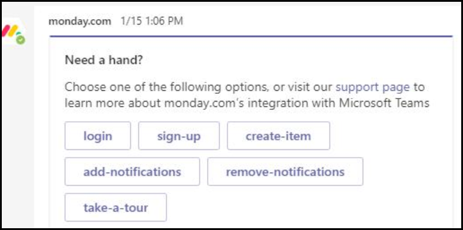

# Dicas para um envio de aplicativo bem-sucedido do Microsoft Teams

Este artigo aborda os motivos comuns pelos quais os aplicativos enviados falham na validação. Embora não se destine a ser uma lista exaustiva de todos os possíveis problemas com seu aplicativo, seguir este guia aumentará a probabilidade de seu envio de aplicativo passar pela primeira vez. Consulte [Políticas de certificação do Marketplace comercial](/legal/marketplace/certification-policies) para uma lista extensa de políticas de validação.

>[!NOTE]
>**[A seção 1140 é](/legal/marketplace/certification-policies#1140-teams)** específica do Microsoft Teams e **[a subseção 1140.4](https://docs.microsoft.com/legal/marketplace/certification-policies#11404-functionality)** aborda os requisitos de funcionalidade para aplicativos do Teams.

## Diretrizes de validação & a maioria dos casos de teste com falha

### &#9989; Considerações gerais

Consulte também [a Seção 100 — Geral](/legal/marketplace/certification-policies#100-general)

* Certifique-se de que você está usando a versão 1.4.1 ou posterior do [SDK](https://www.npmjs.com/package/@microsoft/teams-js)do Microsoft Teams.
* Não faça alterações em seu aplicativo enquanto o processo de validação estiver em andamento. Isso exigirá uma revalidação completa do seu aplicativo.
* Seu aplicativo não deve parar de responder, terminar inesperadamente ou conter erros de programação. Se ocorrer um problema, seu aplicativo deverá falhar e fornecer informações válidas para o avanço para o usuário.
* Seu aplicativo não deve baixar, instalar ou iniciar automaticamente nenhum código executável no ambiente do usuário. Todos os downloads devem buscar permissão explícita do usuário.
* Qualquer material associado à sua experiência, como descrições e documentação de suporte, deve ser preciso. Use ortografia, capitalização, pontuação e gramática corretas em suas descrições e materiais.
* Fornecer informações de ajuda e suporte. É altamente recomendável que seu aplicativo inclua um link de ajuda ou perguntas frequentes para a experiência do usuário na primeira vez. Para todos os aplicativos pessoais, recomendamos fornecer sua página de ajuda como uma guia pessoal para uma melhor experiência do usuário.
* Todos os aplicativos devem ter um tour  visual, como Fazer **um** Tour ou um Guia do Aplicativo em sua tela de configuração que fala sobre os recursos do aplicativo e a integração necessária nos seguintes locais:
    * A página de listagem da Loja (Descrição Longa).
    * Tela de configuração da guia.
    * Mensagem de boas-vindas para um bot.
    * Metadados de origem do aplicativo.
    * Tela de configuração do conector.

* O tour visual pode ser um vídeo, uma captura de tela, um link para uma guia estática com detalhes do aplicativo. Todas essas referências devem estar no ambiente do Teams.

     

* Incremente o número da versão do aplicativo no manifesto se você fizer alterações de manifesto no envio.
* O aplicativo não deve tirar os usuários do Teams para cenários principais do usuário. Os destinos de link em aplicativos não devem vincular a um navegador externo. Os destinos de link devem vincular aos elementos div contidos no Teams, por exemplo, módulos de tarefas e guias. 
* O uso de módulos de tarefas ou guias é sugerido para exibir informações aos usuários no Teams.
* Todos os cenários principais e não principais devem ser concluídos no ambiente do Teams, exceto para:
  * Política de privacidade
  * Termos de Uso (TOU)
  * Link do site
  * Processo de assinatura

* Os aplicativos pessoais permitem que os usuários compartilhem conteúdo de uma experiência de aplicativo pessoal com outros membros da equipe.

### &#9989; fornecer uma experiência clara e simples de entrar, sair e inscrever-se

Consulte também [a Seção 1100.5 — Controle do cliente](/legal/marketplace/certification-policies#11005-customer-control)

* Se o aplicativo ou o seu complemento depender de contas ou serviços externos, a experiência de entrar, sair e inscrever-se deverá estar aparente e acessível em todos os recursos do seu aplicativo.
* Se houver uma opção de login explícita fornecida ao usuário, deverá haver uma opção de saída correspondente (mesmo se o aplicativo estiver usando autenticação [silenciosa).](../../../../tabs/how-to/authentication/auth-silent-aad.md)
* A opção de saída só deve desafocar o usuário da funcionalidade do seu aplicativo e não sair do cliente do Teams.
* No mínimo, a opção de saída deve desassecar o usuário dos mesmos recursos acessados com a opção de login. Por exemplo, se a opção de login incluir a extensão de mensagens e a guia, a opção de saída deverá incluir a extensão e a guia de mensagens.

* Certifique-se de que sempre haja uma maneira de reverter os seguintes comportamentos (ou semelhantes:
  * Sign-in => sign-out.
  * Vincular uma conta/serviço => desvincular uma conta/serviço.
  * Conectar uma conta/serviço => desconectar uma conta/serviço.
  * Autorizar uma conta/serviço => autorizar/negar uma conta/serviço.
  * Registre uma conta/serviço => cancelar o registro/cancelar a assinatura de uma conta/serviço.
* Se seu aplicativo exigir uma conta ou serviço, você deverá fornecer uma maneira para o usuário se inscrever ou criar uma solicitação de assinatura. Uma exceção pode ser concedida se seu aplicativo exigir uma licença para usar. Nesses cenários, forneça instruções claras para um novo usuário se inscrever.
* Fornecer orientações claras sobre o encaminhamento para um novo usuário sobre como se inscrever para usar seus serviços de aplicativo. Se um link de assinatura pronto não estiver disponível, forneça orientações precisas nas seguintes áreas:

> [!div class="checklist"]
>
> * na seção de descrição do aplicativo.
> * na mensagem de boas-vindas do seu aplicativo.
> * na mensagem de ajuda do seu aplicativo.
> * na janela em que você solicita que um usuário entre em seus serviços.

* Os aplicativos sem um fluxo de assinatura fácil também devem incluir uma guia de ajuda ou um link para uma página da Web, onde um novo usuário pode ver orientações detalhadas sobre como configurar seu aplicativo teams. Forneça informações detalhadas para garantir que um novo usuário não seja bloqueado ao tentar seu aplicativo pela primeira vez.
* A funcionalidade de entrar e sair deve funcionar em clientes móveis. Certifique-se de usar [o SDK](https://www.npmjs.com/package/@microsoft/teams-js) do Microsoft Teams versão 1.4.1 ou posterior.

Para obter informações adicionais sobre autenticação, consulte:

* [Documentação de autenticação](../../../authentication/authentication.md)
* [Exemplo de autenticação de bot no Node](https://github.com/OfficeDev/microsoft-teams-sample-auth-node)
* [Exemplo de autenticação de guia no Nó](https://github.com/OfficeDev/microsoft-teams-sample-complete-node)
* [Autenticação de guia/bot em C#/.NET](https://github.com/OfficeDev/microsoft-teams-sample-complete-csharp)

### &#9989; tempos de resposta devem ser razoáveis

* **Guias**. Se uma resposta a uma ação levar mais de três segundos, você deverá fornecer uma mensagem de carregamento ou aviso.
* **Bots**. Uma resposta a um comando do usuário deve ocorrer dentro de dois segundos. Se for necessário um processamento mais longo, seu aplicativo deverá exibir um indicador de digitação.
* **Extensões de redação.** Uma resposta a um comando do usuário deve ocorrer dentro de cinco segundos.

> [!TIP]
> Certifique-se de que seu aplicativo exibe um indicador de carregamento ou alguma forma de aviso quando seu aplicativo está demorando mais do que o esperado para responder.

### &#9989; conteúdo da guia não deve ter cromado excessivo ou navegação em camadas

* As guias devem fornecer conteúdo focado e evitar elementos de interface do usuário desnecessários. Isso geralmente se refere à navegação aninhada ou em camadas desnecessária, uma interface do usuário irrelevante ou irrelevante ao lado do conteúdo ou quaisquer links que levam o usuário ao conteúdo não relacionado. Por exemplo, o modo de exibição de guia a seguir omite menus de navegação e mostra apenas o conteúdo principal:

  

* As guias devem ser claras na natureza e não incluir navegação complexa.
* Guias de canal que têm recursos de edição complexos dentro do aplicativo devem abrir o modo de exibição do editor em uma janela de várias janelas em vez de uma guia.
* As guias de canal não devem fornecer uma barra de aplicativos com ícones no trilho esquerdo que estão em conflito com a navegação principal do Teams.
* As guias não devem apresentar uma barra de aplicativos com ícones no trilho esquerdo que estão em conflito com a navegação principal do Teams.
* Guias com recursos complexos de edição dentro do aplicativo devem abrir o modo de exibição do editor em uma janela de várias janelas em vez de na guia.
* Se houver várias opções de exibição, considere ter um menu de configuração de guia para o usuário escolher. Por exemplo, em vez de incorporar um menu dentro da guia, coloque o menu na página de configuração para que o modo de exibição de guia real seja limpo e focado.
* Inclua uma guia *ajuda como* uma guia estática para orientar os usuários sobre como configurar, inscrever-se e usar seu aplicativo.
* Inclua uma *guia Configurações* que está disponível no header do aplicativo.

### &#9989; configuração da guia deve ocorrer na tela de configuração

* A tela de configuração deve explicar claramente o valor da experiência e como configurar a guia.
* O processo de configuração sempre deve fornecer uma maneira de os usuários continuarem e não encerrarem a experiência do usuário. Por exemplo, não mostre uma placa vazia depois que o usuário tiver configurado a guia.
* O processo de entrada do usuário deve fazer parte do processo de configuração. Certifique-se de conclua-lo na interface do usuário da guia. Depois que o usuário concluir a configuração e carregar a guia, nenhuma outra ação será necessária.
* Não mostre toda a página da Web dentro da janela pop-up de configuração de entrada.
* Um usuário sempre deve ser capaz de concluir a experiência de configuração, mesmo que não consiga encontrar imediatamente o conteúdo que está procurando.
* A experiência de configuração deve fornecer opções para que o usuário encontre o conteúdo, fixe uma URL ou crie um novo conteúdo se ele não existir.
* A experiência de configuração deve permanecer dentro do contexto do Teams. O usuário não deve ter que sair da experiência de configuração para criar conteúdo e, em seguida, retornar ao Teams para fixá-lo.
* Use a área de visualização disponível com eficiência. Não perca tempo usando logotipos enormes dentro do pop-up de configuração.

### &#9989; guias no canal - Acesso de membro

* Uma guia configurada por um membro em um escopo de canal deve estar acessível para os outros membros sem ter que buscar permissões do membro que configurou a guia.
* O aplicativo deve fornecer as opções de gerenciamento de permissão antecipadamente se a guia for para uso particular ou restrito ou exigir permissões do membro que configurou a guia.

### &#9989; bots sempre devem ser responsivos e falhar normalmente

Seu bot deve responder a qualquer comando e não deixar o usuário sem saída. Aqui estão algumas dicas para ajudar seu bot a responder de forma inteligente aos usuários:

* **Usar listas de comandos.** Analisar a entrada do usuário ou prever a intenção do usuário é difícil. Em vez de permitir que os usuários adivinharem o que seu bot pode fazer, forneça uma lista de comandos que seu bot entende.

* **Inclua um comando de ajuda.** Os usuários provavelmente digitarão "Ajuda" quando eles se perderem ou quando o bot não responder conforme o esperado. Inclua um comando de ajuda que descreve como o valor do seu aplicativo será experimentado juntamente com todos os comandos válidos.

* **Inclua conteúdo de ajuda ou orientação quando seu bot for perdido.** Quando seu bot não consegue entender a entrada do usuário, ele deve sugerir uma ação alternativa. Por exemplo, *"Desculpe, não consigo entender. Digite "ajuda" para obter mais informações."* Não responda com uma mensagem de erro ou *simplesmente" "Não estou entendendo".*

### &#9989; de comando da Ajuda

* O Comando de Ajuda deve ser preciso e as respostas do aplicativo devem estar em um formato de cartão adaptável com um conteúdo a actionable por pelo menos seis comandos.
* Se um aplicativo tiver menos de seis comandos, verifique se todos os comandos estão presentes no cartão adaptável.

  

* **Use cartões adaptáveis e módulos de tarefa para tornar a resposta do bot clara e a actionable** 
 [Cartões adaptáveis com botões que invocam módulos de tarefa](/task-modules-and-cards/task-modules/task-modules-bots) aprimoram a experiência do usuário do bot. Esses cartões e botões são mais fáceis de usar em um dispositivo móvel, em vez de o usuário digitar os comandos. Além disso, as respostas de bot não devem ser textuais com texto longo. Os bots devem usar cartões adaptáveis e módulos de tarefas em vez de interface do usuário baseada em chat de conversa e respostas de texto longas.

* **Pense em todos os escopos.** Certifique-se de que seu bot fornece respostas apropriadas quando mencionado ( `@*botname*` ) em um canal e em conversas pessoais. Se o bot não fornecer contexto significativo no escopo pessoal ou de equipes, desabilite esse escopo por meio do manifesto. (Confira o `bots` bloco na referência de esquema de manifesto do Microsoft [Teams.)](../../../../resources/schema/manifest-schema.md#bots)

* **Incluir equipe, chat em grupo ou conversa 1:1.** As notificações de bot devem incluir uma equipe, um chat em grupo ou uma conversa um-para-um com conteúdo relevante para seu público.

* **Não faça push de dados confidenciais.** Os bots não devem fazer push de dados confidenciais para uma equipe, um chat em grupo ou uma conversa 1:1, onde há uma audiência que não deve exibir esses dados.

* **Forneça uma mensagem de boas-vindas.** Bot must provide an FRE welcome message that includes an interactive tutorial with carousel cards or "try it" buttons, to encourage engagement.

### &#9989; bots pessoais sempre devem enviar uma mensagem de boas-vindas na primeira iniciação

Uma mensagem de boas-vindas é a melhor maneira de definir o tom para seu bot de chat pessoal. Esta é a primeira interação que um usuário tem com o bot. Uma boa mensagem de boas-vindas pode incentivar o usuário a continuar explorando o aplicativo. Se a mensagem de boas-vindas ou introdutório for confusa ou confusa, os usuários não verão o valor do aplicativo imediatamente e perderão o interesse.
Consulte a seção a seguir para requisitos de mensagem de boas-vindas:

> [!Note]
> Uma mensagem de boas-vindas é opcional para um bot de canal.

### Requisitos de mensagem de boas-vindas

* Inclua uma proposta de valor com o tour de boas-vindas.
* Fornecer orientações passo a passo para usar o aplicativo.
* Inclua orientações sobre como se inscrever e configurar seu aplicativo.
* Apresentar texto fácil de ler e um diálogo simples — preferencialmente um cartão com um botão de tour de boas-vindas a actionable que carrega um módulo de tarefa.
* Mantenha-o simples e fácil de ser possível com botões e cartões — evite texto longo, diálogo conversada.
* Inclua cartões e botões adaptáveis para tornar a mensagem de boas-vindas mais usável.
* Invoque a mensagem de boas-vindas com um ping, não dois ou mais pings simultâneos.
* Uma mensagem de boas-vindas só deve ser mostrada ao usuário que configurou o aplicativo, preferencialmente em um chat pessoal 1:1.
* Os aplicativos pessoais sempre devem fornecer uma mensagem de boas-vindas a um usuário.
* Nunca envie um chat pessoal para todos os membros da equipe; ele é considerado spam.
* Nunca envie a mensagem de boas-vindas mais de uma vez. Não é permitido repetir a mesma mensagem de boas-vindas em intervalos regulares e é considerado spam.

#### Evitar spam de mensagem de boas-vindas

* **Mensagem de canal por bot**. Não spam users by creating separate new chat posts. Crie uma única postagem de thread com respostas no mesmo thread.
* **Bate-papo pessoal por bot.** Não envie várias mensagens. Envie uma mensagem com informações completas. Não é permitido repetir a mesma mensagem de boas-vindas em intervalos regulares e é considerado spam.

#### Mensagens de boas-vindas do bot somente notificação

Os bots somente notificação devem enviar uma mensagem de boas-vindas que inclui uma mensagem que transmite: "Sou um bot somente de notificação e não consigo responder aos *seus chats".*

#### Mensagens de boas-vindas no escopo pessoal

   * **Tornar sua mensagem concisa e informativa.** A experiência do usuário e o conhecimento do seu aplicativo variam. Um usuário pode ter usado seu aplicativo em outra plataforma ou não saber nada sobre seu aplicativo. Você deseja adaptar sua mensagem a todas as audiências e, em algumas frases, explicar o que seu bot faz e as maneiras de interagir com ela. Você também deve explicar o valor do aplicativo e como os usuários se beneficiarão de usá-lo.

* **Tornar sua mensagem a actionable**. Pense na primeira coisa que você deseja que os usuários fazem depois de instalar seu aplicativo. Há um comando interessante que eles devem tentar? Há outra experiência de integração que eles devem conhecer? Eles precisam entrar? Você pode adicionar ações em um cartão adaptável ou fornecer exemplos específicos, como *"Tente perguntar..."*, "Isso é o *que posso fazer..."*.

#### Mensagens de boas-vindas no escopo da equipe ou do canal

As coisas são um pouco diferentes quando o bot é adicionado pela primeira vez a um canal. Normalmente, você não deve enviar uma mensagem 1:1 para todos na equipe, mas o bot pode enviar uma mensagem de boas-vindas no canal.

### &#9989; capacidade de resposta móvel, sem venda direta ou pagamento

* Suas guias, cartões adaptáveis, mensagens de bot e conteúdo em módulos de tarefas devem ser responsivos para uma variedade de tamanhos de tela de dispositivo móvel.
* Os aplicativos que suportam iOS devem estar totalmente funcionais no dispositivo iPad mais recente usando a versão mais recente do iOS.
* Não deve incluir referências diretas a compras no aplicativo, ofertas de avaliação, ofertas para versões pagas ou links para qualquer loja online onde os usuários possam comprar ou adquirir outros conteúdos, aplicativos ou complementos do seu aplicativo Teams no sistema operacional móvel (Android, iOS).
* A versão para iOS ou Android do complemento não deve mostrar nenhuma interface do usuário ou idioma ou link para outros aplicativos, complementos ou sites que peçam ao usuário para pagar.
* As páginas de Política de Privacidade e Termos de Uso associadas também devem estar livres de qualquer interface do usuário de comércio ou links da Loja.

### &#9989; Não postar dados confidenciais para uma audiência que não se destina a exibir os dados

Seu aplicativo teams não deve postar dados confidenciais, como cartão de crédito ou instrumento de pagamento financeiro, INFORMAÇÕES de Identificação Pessoal (PIN), saúde ou informações de rastreamento de contato para uma audiência que não se destina a exibir esses dados.

### &#9989; Não transmita detalhes de pagamento financeiro ou conclua transações financeiras por meio de seu aplicativo do Teams

* Seu aplicativo teams não deve solicitar que os usuários façam um pagamento diretamente na interface do Teams.
* Os aplicativos podem não transmitir detalhes do instrumento financeiro por meio do usuário na interface do aplicativo. Os aplicativos só podem transmitir links para proteger serviços de pagamento aos usuários se isso for divulgado nos Termos de Uso, na Política de Privacidade e em qualquer página de perfil ou site do aplicativo antes que um usuário concorde em usar o aplicativo.

### &#9989; Limpar aviso antes de baixar arquivos ou executáveis ( `.exe` ) no ambiente de um usuário

Avise os usuários antes que seu aplicativo baixe arquivos ou arquivos executáveis ( `.exe`  )no computador ou ambiente do usuário.

### &#9989; Extensões de mensagens devem fornecer texto de ajuda e ser fáceis de ler

* A extensão de mensagens baseada em pesquisa deve fornecer texto de ajuda sobre como pesquisar com eficiência (por exemplo, mostrar entrada de exemplo).
* Os módulos de tarefa devem incluir um ícone e um nome curto em que estão contidos ou criados a partir do aplicativo.
* Os executáveis `@mention` de extensão de mensagem devem ser claros, fáceis de entender e fáceis de ler.

## Atestado de Editor do M365

### &#9989; concluir o Atestado de Editor no Partner Center

* Consulte a [documentação do programa Detestação completa do](/microsoft-365-app-certification/docs/attestation) Publisher para obter mais detalhes.
* Siga as etapas na seção [Fluxo de Trabalho](/microsoft-365-app-certification/docs/userguide#3publisher-attestation-workflow) de Atestado do Publisher para concluir o processo de atestado do editor. Escreva para appcert@microsoft.com perguntas.
* Consulte o guia [de solução de problemas para](/azure/active-directory/develop/troubleshoot-publisher-verification) obter informações adicionais.
* Conclua o autoteste por meio do Partner Center. Preencha o questionário Self-Assessment em Conformidade **do Aplicativo.**

> [!div class="nextstepaction"]
> [Saiba mais sobre as políticas de aprovação de aplicativos do Teams](/legal/marketplace/certification-policies#1140-teams)
