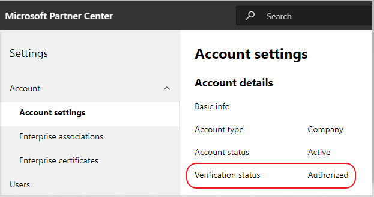

# Envie seu aplicativo para o AppSource

## Envio de aplicativos do teams

Publicar seu aplicativo no [AppSource](https://appsource.microsoft.com) o disponibiliza no catálogo de aplicativos do Microsoft Teams e na Web. Em um nível alto, o processo de envio de seu aplicativo para o AppSource é:

1. Desenvolva seu aplicativo seguindo as [diretrizes de design](~/concepts/design/understand-use-cases.md). As guias devem seguir as [diretrizes de design de guia](~/tabs/design/tabs.md). Os bots devem seguir as [diretrizes de design de bot](~/bots/design/bots.md).
1. Verifique se o aplicativo atende às [políticas de validação](/legal/marketplace/certification-policies) de aplicativos do Microsoft Teams.
1. [Configurar uma conta de desenvolvedor](/office/dev/store/open-a-developer-account) no [Partner Center](https://support.microsoft.com/help/4499930/partner-center-overview). *Consulte também* [como criar uma conta de centro de parceiros](#how-do-i-create-a-partner-center-account) na seção perguntas frequentes, abaixo.
1. Prepare seu aplicativo para envio, seguindo nossa [lista de verificação de envio](~/concepts/deploy-and-publish/appsource/prepare/submission-checklist.md).
1. Revise nossas [dicas para um envio de aplicativo bem-sucedido](~/concepts/deploy-and-publish/appsource/prepare/frequently-failed-cases.md).
1. Envie seu pacote para o [AppSource por meio do Partner Center](/office/dev/store/use-partner-center-to-submit-to-appsource).
1. Acompanhe o processo de aprovação no painel do seu centro de parceria. *Consulte* [visão geral do Partner Center](https://support.microsoft.com/help/4499930/partner-center-overview).
1. Envio de postagem — revise nossas orientações para [manter e dar suporte ao seu aplicativo publicado](~/concepts/deploy-and-publish/appsource/post-publish/overview.md).

>[!NOTE]
>
>- Se seu aplicativo do Microsoft Teams contiver um bot, você deverá estar em conformidade com o [código de conduta do](https://aka.ms/bf-conduct)bot Developer Framework.
>- Se seu aplicativo contiver um conector do Office 365, termos adicionais poderão ser aplicados. *Consulte* [Connectors Dashboard de desenvolvedor](https://aka.ms/connectorsdashboard) e [contrato de desenvolvedor de aplicativos](https://sellerdashboard.microsoft.com/Assets/Content/Agreements/Office_Store_Seller_Agreement_20120927.htm).

## Perguntas frequentes: aplicativos de equipe e contas de parceiros

## Como faço para criar uma conta do Partner Center?

Há duas maneiras de criar uma conta de centro de parceiros:

- Se você é novo no Partner Center e não tem uma conta na rede da Microsoft, [crie uma conta usando a página de registro do Partner Center](/office/dev/store/open-a-developer-account#create-an-account-using-an-existing-partner-center-enrollment).
- Se você já estiver inscrito na rede de parceiros, [crie uma conta diretamente no Partner Center usando um registro existente](/office/dev/store/).

## E se eu não conseguir encontrar minha conta da Office Store no Partner Center?

Abra um [tíquete de suporte do centro de parceria](https://partner.microsoft.com/support/v2/?stage=1) e selecione o seguinte nos menus suspensos:

| Menu | Opção |
| -------   | -------  |
|Categoria| Mercado comercial|
| Tópico | Perguntas gerais sobre ajuda e instruções do Marketplace |
| Subtópico| Suplemento do Office |

## Onde posso obter suporte para meus problemas do centro de parceria?

Visite nossa [página de suporte de editores](https://aka.ms/marketplacepublishersupport) para procurar seu tópico de problema e encontre orientações. Se a orientação fornecida não for útil, [abra um tíquete de suporte do centro de parceria](/azure/marketplace/partner-center-portal/support#how-to-open-a-support-ticket).

## Como gerenciar minha conta da Office Store?

Visite nossa [conta gerenciar a sua conta do Office Store no Partner Center](/office/dev/store/manage-account-settings-and-profile) para obter orientação sobre como gerenciar sua conta da Office Store por meio do Partner Center.

## Como adiciono meu número de telefone à seção de contato de perfil de parceiro?

O número de telefone tem três partes: código do país, código de área e número de telefone. Se o número de telefone não incluir um código de área, deixe a segunda caixa vazia e preencha a terceira caixa.

## Como gerenciar minhas configurações de conta e perfil de parceiro no Partner Center?

Visite a página [gerenciar configurações de conta e informações de perfil](/windows/uwp/publish/manage-account-settings-and-profile#additional-settings-and-info) para obter orientação sobre como gerenciar as configurações de conta do seu centro de parceiros.

## Por que recebo a mensagem "esta conta não está publicando qualificada" quando tento enviar meu suplemento por meio do Partner Center?

Você receberá a mensagem de erro acima quando o [status da verificação](/partner-center/verification-responses) da sua conta estiver pendente. Você pode verificar o status de verificação da sua conta no [painel](https://partner.microsoft.com/dashboard) do centro de parceiro selecionando a opção **configurações** (o ícone de engrenagem) no canto superior direito do Shell de cabeçalho de página e escolhendo configurações de conta de conta de **configurações do desenvolvedor**  =>  **Account**   =>  **Account settings** .

Durante o processo de verificação da conta, o status de cada etapa obrigatória: propriedade de email, verificação de emprego e verificação de negócios — será exibida. Depois que o processo de verificação for concluído com êxito, o status de verificação do registro na página de perfil mudará de "pendente" para "autorizado" e as etapas do processo não serão mais exibidas.

## Meu status de verificação de conta não é avançado além da propriedade de email. Como devo proceder?

Durante o processo de verificação de **propriedade de email** , um email de verificação é enviado para o endereço de email de contato principal. Verifique a caixa de entrada de contato principal de um email de **maccount@Microsoft. com** com a ação de linha de assunto *necessária: Verifique sua conta de email com a Microsoft*, solicitando que você conclua o processo de verificação de email. O email de verificação será enviado para o endereço de email listado na página Configurações de conta no centro de parceiros.

> [!NOTE]
 >O link de verificação de email só é válido por sete dias. Você pode solicitar que reenviemos o email para você visitando sua página de perfil de parceiro e selecionando o link de **email de verificação de reenvio** . Para garantir que o email seja recebido, o email de lista branca do microsoft.com como um domínio seguro e verifique as pastas de lixo eletrônico.

## Como eu obteria mais suporte para as minhas questões relacionadas à conta?

Visite o nosso [suporte para o programa de mercado comercial na](/azure/marketplace/partner-center-portal/support) página de centro de parceria para obter orientações e etapas para criar um tíquete de suporte.

## Verifiquei minhas pastas de email e não recebi o email de verificação. O que devo fazer em seguida?

Tente o seguinte:

1. Verifique a pasta de lixo eletrônico/spam.
1. Limpe o cache do navegador, vá para o painel de conta do centro de parceiros e selecione o link **reenviar email de verificação** para que o email de verificação seja enviado novamente ao seu endereço de email.
1. Tente acessar o link de **email de verificação de reenvio** de outro navegador.
1. Trabalhe com seu departamento de ti para garantir que os emails de verificação não sejam bloqueados pelo servidor de email.
1. Ajuste o filtro de spam do seu servidor para permitir/listar todos os emails de **maccount@microsoft.  com**.

## Quanto tempo o processo de verificação de emprego geralmente leva?

Se todos os detalhes enviados estiverem corretos, a verificação de emprego será concluída em 1 a 2 horas.

## Quanto tempo o processo de "verificação de negócios" geralmente leva?

A verificação de negócios leva de 1 a 2 dias úteis para ser concluída, desde que todos os documentos necessários tenham sido enviados.

## Se eu chegar à equipe de suporte, meu tíquete será acelerado?

Os tíquetes de suporte serão resolvidos dentro do horário da semana. Procure as atualizações que serão enviadas para o email fornecido quando o tíquete de suporte foi gerado.

## Meu problema não está listado aqui.  Há outras páginas que eu posso referenciar para problemas do Partner Center?

Consulte nossa documentação do [Marketplace comercial](/azure/marketplace/) para obter mais ajuda.

## Criei um tíquete de suporte, ele tem sete dias úteis e não recebi uma atualização. Onde posso obter ajuda adicional?

Envie um email para **<teamsubm@microsoft.com>** com os seguintes detalhes:

1. **Linha de assunto**. *Problema de conta do centro de parceria para <App_Name>* (especifique o nome do seu aplicativo).
1. **Corpo do email:**
    * Número do tíquete de suporte:
    * Sua ID de vendedor:
    * Uma captura de tela do problema (se possível):

>
> [!div class="nextstepaction"]
> [Saiba mais sobre as políticas de validação de aplicativos para o Microsoft Teams](/legal/marketplace/certification-policies)
