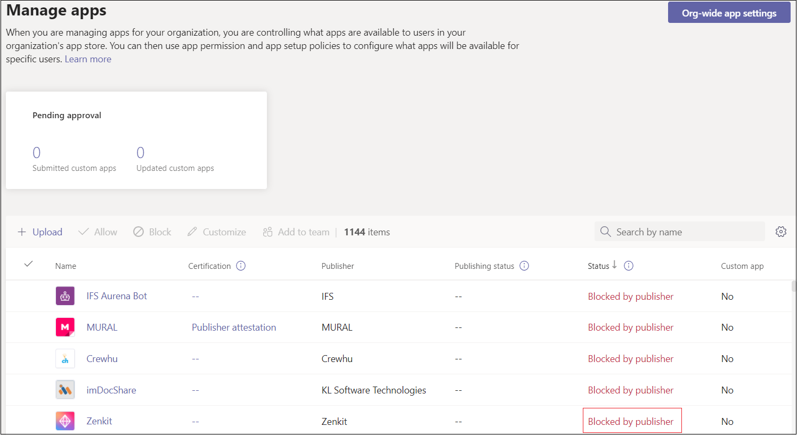

# Personalizar seu Teams app

## Permitir que seu Microsoft Teams aplicativo seja personalizado

Você pode permitir que os clientes personalizem alguns aspectos do seu aplicativo Microsoft Teams no centro de Teams de administração. Esse recurso só é suportado para aplicativos publicados no Teams store. Aplicativos e aplicativos com sideload publicados para uma organização não podem ser personalizados.

Alguns exemplos possíveis desse recurso incluem:

* Alterar a cor de destaque do aplicativo para corresponder à marca de uma organização.
* Atualizando o nome do aplicativo da *Contoso* para *o Agente Contoso*, que é o nome que os usuários da organização verão. (Observação: os usuários adicionando um conector a um chat ou canal ainda verão o nome original do aplicativo, *Contoso*.)

Você pode habilitar esse recurso no Portal do [Desenvolvedor para Teams](https://dev.teams.microsoft.com/home). Isso configura , que não está disponível em `configurableProperties` versões antes de 1,10 do manifesto Teams aplicativo.

### Testar seu aplicativo

Não é possível testar esse recurso durante o desenvolvimento. A personalização do aplicativo não é suportada ao fazer sideload ou publicação no catálogo de aplicativos de uma organização.

### Considerações do usuário

Forneça diretrizes para clientes (especificamente Teams administradores) que querem personalizar seu aplicativo. Para obter mais informações, consulte [personalizar aplicativos em Teams](/MicrosoftTeams/customize-apps).

## Ocultar Teams aplicativo até que o administrador aprove

Para aprimorar Teams experiência do aplicativo, você pode ocultar um aplicativo dos usuários por padrão até que o administrador permita desa desabilitar o aplicativo. Por exemplo, a Contoso Electronics criou um aplicativo de help desk para Teams. Para habilitar o funcionamento apropriado do aplicativo, a Contoso Electronics deseja que os clientes primeiro configurar propriedades específicas do aplicativo. O aplicativo está oculto por padrão e está disponível para os usuários somente depois que o administrador permitir.

Para ocultar o aplicativo, no arquivo de manifesto do aplicativo, de definir a `defaultBlockUntilAdminAction` propriedade como `true` . Quando a propriedade é definida como , no Teams de administração > Gerenciar aplicativos , Bloqueado pelo `true` **editor** aparece no Status do **aplicativo:** 

O administrador recebe uma solicitação para tomar medidas antes que um usuário possa acessar o aplicativo. Em **Gerenciar aplicativos,** os administradores podem selecionar **Permitir** permitir que o aplicativo com Bloqueado pelo status **do** editor:

Se, por padrão, você não quiser que o aplicativo seja oculto, você pode atualizar a `defaultBlockUntilAdminAction` propriedade para `false` . Quando a nova versão do aplicativo for aprovada, por padrão, o aplicativo será permitido desde que o administrador não tenha tomado nenhuma ação explícita.

> [!NOTE]
> `defaultBlockUntilAdminAction` não há suporte para aplicativos LOB. Se você carregar um aplicativo LOB com essa propriedade, o aplicativo não será bloqueado.

## Confira também

* [Esquema de manifesh de aplicativo](/MicrosoftTeams/manifest-schema)
* [Personalizar aplicativos no Teams de administração](/MicrosoftTeams/customize-apps)

