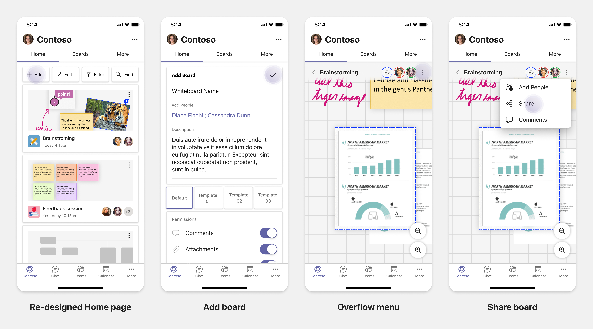

# Planejar guias responsivas para o aplicativo móvel do Teams

 Teams plataforma oferece a oportunidade de criar aplicativos em dispositivos móveis e desktop. Os usuários do aplicativo podem preferir desktop ou móvel ou ambos. Os usuários podem preparar dados na área de trabalho, mas consumir e compartilhar mais dados usando dispositivos móveis. A chave para criar qualquer aplicativo é entender e atender às necessidades dos usuários. Há recursos como bots, extensões de mensagem e conectores que funcionam perfeitamente na área de trabalho e em dispositivos móveis. No entanto, a criação de guias e módulos de tarefas exige o planejamento para hospedar sua experiência na Web Teams dispositivos móveis. Os guias de artigo para planejar suas páginas da Web responsivas Teams celular.

## Identificar escopo de aplicativos

A lista a seguir fornece as principais informações para planejar a criação de aplicativos para Teams mobile:

* Considere a funcionalidade entre dispositivos Teams aplicativo. Por exemplo, se você tiver um aplicativo de bom desempenho na área de trabalho, poderá explorar para criar um aplicativo semelhante em dispositivos móveis. Inicialmente, pode ser difícil mudar toda a experiência da área de trabalho no celular. Você pode começar com cenários básicos, mas comuns. Adicione funcionalidades e funcionalidades depois de coletar mais insights e comentários do usuário.

* Certifique-se de direcionar a persona de usuário apropriada no celular. Por exemplo, se você estiver criando um aplicativo que fornece serviço aos usuários finais e também fornece acesso a dados para desenvolvedores e gerentes sênior, os usuários finais poderão usar mais o aplicativo enquanto você começa a criar o aplicativo no Teams mobile. Você pode atender a todas as personas que você tem em seu aplicativo da área de trabalho, no entanto, é recomendável começar com persona com uma base maior e possíveis usuários pioneiros para uma experiência de tela menor. De acordo com o exemplo, os usuários finais são as personas de usuário apropriadas. Você pode adicionar funcionalidades gradualmente para dar suporte a outras personas de usuário em seu Teams móvel.

## Entender diferentes estágios para criar aplicativos

Depois de identificar o escopo do aplicativo, é hora de entender os três estágios a seguir para planejar qualquer aplicativo no Teams móvel e aprimorar a experiência do usuário:

1. **Consumo**

   Exibir aplicativos em dispositivos móveis. Para criar um aplicativo no celular, você pode começar com a experiência de consumo. Como o mundo móvel tornou a rolagem de conteúdo uma prática comum, você pode mostrar informações relevantes. Use mecanismos de envolvimento, como notificações para informar atualizações.

2. **Ações Rápidas**

   Use o aplicativo no celular. Depois que os usuários começarem a consumir o conteúdo em dispositivos móveis, você poderá dimensionar seu aplicativo para o próximo nível migrando algumas ações do aplicativo da área de trabalho. Você pode otimizar e criar novas ações para dispositivos móveis.

3. **Habilitação**

   Forneça experiências completas de aplicativo para se envolver em dispositivos móveis. À medida que os usuários se envolvem com seu aplicativo, forneça uma experiência imersiva completa em dispositivos móveis, seja na mesma ou melhor experiência da área de trabalho. Para fornecer uma boa experiência para seus usuários, torne todos os casos de uso responsivos em dispositivos móveis.

> [!TIP]
> Para obter informações sobre as diretrizes de design, consulte o [processo de design para Teams aplicativos](design-teams-app-process.md).

## Casos de uso

Vamos examinar os seguintes casos de uso para entender como planejar diferentes tipos de aplicativos para Teams mobile:

 

<b>Aplicativos de dashboarding e visualização de dados</b>

Você pode entender como planejar guias responsivas para dashboards e aplicativos de visualização de dados Teams plataforma móvel.

Consumo:

No primeiro estágio, você pode implementar a experiência de consumo mais básica para exibir dados. A finalidade de qualquer aplicativo no domínio é mostrar dados na forma de visualizações. Em seu aplicativo, você pode mostrar visualizações exibidas recentemente na área de trabalho ou listar todos os gráficos autorizados para os usuários. Depois de criar painéis na área de trabalho, os usuários podem acessar as informações usando dispositivos móveis. Você pode mostrar uma exibição detalhada de qualquer gráfico selecionado pelo usuário como uma exibição expandida em suas guias ou usando módulos de tarefa.

Você pode mostrar as seguintes informações:

* Dashboards e resumos
* Visuais de dados, mapas e infográficos
* Gráficos, gráficos e tabelas

Ações rápidas:

No segundo estágio, os usuários podem trabalhar nos gráficos e visuais existentes da experiência desktop. Você pode introduzir as seguintes ações:

* Pesquisar conteúdo
* Filtrar dados
* Criar indicadores

Capacitação:

No terceiro estágio, permita que os usuários criem conteúdo como gráficos e gráficos do zero. Certifique-se de introduzir todos os recursos em seu aplicativo para dispositivos móveis. Por exemplo, você pode usar módulos de tarefa para ajudar a acessar itens de dados específicos com exibição detalhada.

Você pode fornecer o seguinte acesso aos usuários:

* Modificar título e descrição
* Inserir itens de dados para criar visualizações
* Compartilhar visualizações em um canal ou chat em grupo

 

 

<b>Aplicativos de integração de tarefas</b>

Você pode entender como planejar guias responsivas para aplicativos de integração de tarefas Teams plataforma móvel.

Consumo:

No primeiro estágio, seu aplicativo pode mostrar a lista de tarefas para o usuário em uma pilha vertical. Se houver várias categorias de tarefas, como **Proposta****, Ativa** e Fechada,  forneça filtros para mostrar tarefas agrupadas ou como cabeçalhos para ver as tarefas agrupadas.

Ações rápidas:

No segundo estágio, você pode fornecer o seguinte acesso de aplicativo aos usuários:

* Criar tarefas ou itens com os campos obrigatórios para reduzir a carga cognitiva dos usuários
* Alterar o tipo de quadro ou exibição
* Examinar tarefas expandindo a exibição
* Usar módulos de tarefa para ver a exibição detalhada
* Mover as tarefas para categorias diferentes
* Compartilhar tarefas relevantes em chats e canais por meio de emails e feed de atividades

Capacitação:

No terceiro estágio, você pode habilitar a experiência dos usuários com as seguintes atividades:

* Adicionar novos projetos e quadros
* Adicionar e modificar categorias diferentes, como **Proposta**, **Ativa** e **Fechada**
* Configurar as tarefas para comentários, anexos e outros recursos complexos

 

 

<b>Coautoria e aplicativos de quadro de comunicações</b>

Você pode entender como planejar guias responsivas para coautoria e aplicativos de quadro de comunicações Teams plataforma móvel.

Consumo:

No primeiro estágio, você pode considerar a experiência de área de trabalho para mostrar o conteúdo e os ativos em seu aplicativo.  Você pode mostrar as seguintes funções:

* Comentários ou comentários
* Ampliar ou reduzir
* Estágio atual ou progresso de um documento pendente

Ações Rápidas:

No segundo estágio, você pode introduzir as seguintes ações:

* Criar um novo quadro para colaboração ou novos documentos para assinatura
* Compartilhar quadros internamente e também com convidados
* Configurar permissões de administrador

> [!TIP]
> Você expõe ações, que podem ser mostradas facilmente nas telas pequenas.

Capacitação:

No terceiro estágio, forneça experiência completa aos usuários. Você pode habilitar a experiência dos usuários com as seguintes atividades:

* Adicionar texto, formas e anotações rápidas
* Navegar pelo conteúdo
* Adicionar camadas e filtros
* Excluir, desfazer e refazer operações
* Acesse a câmera e o microfone usando APIs do SDK do JS. Para obter mais informações sobre as funcionalidades do dispositivo, consulte a [visão geral dos recursos do dispositivo](../device-capabilities/device-capabilities-overview.md).

 

## Confira também

As seguintes diretrizes de design e validação ajudam dependendo do escopo do seu aplicativo:

* [Projetando sua guia](../../tabs/design/tabs.md)
* [Criar um bot](../../bots/design/bots.md)
* [Criar módulos de tarefa](../..//task-modules-and-cards/task-modules/design-teams-task-modules.md)
* [Diretrizes de validação da loja](../deploy-and-publish/appsource/prepare/teams-store-validation-guidelines.md)
