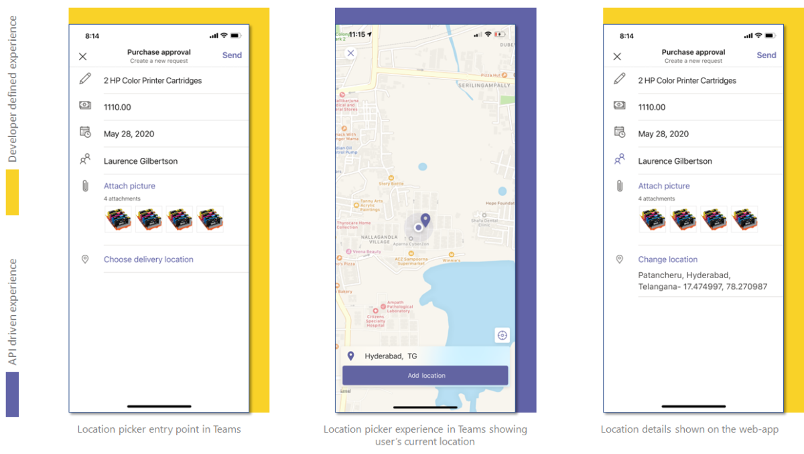

# <a name="integrate-location-capabilities"></a>Integrar os recursos de localização

Você pode integrar os recursos de localização do dispositivo nativo ao seu Teams app.  

Você pode usar [Microsoft Teams SDK do cliente JavaScript](/javascript/api/overview/msteams-client?view=msteams-client-js-latest&preserve-view=true), que fornece as ferramentas necessárias para que seu aplicativo acesse os recursos de [dispositivo nativo do usuário](native-device-permissions.md). Use as APIs de local, como [getLocation](/javascript/api/@microsoft/teams-js/microsoftteams.location?view=msteams-client-js-latest#getLocation_LocationProps___error__SdkError__location__Location_____void_&preserve-view=true) e [showLocation](/javascript/api/@microsoft/teams-js/microsoftteams.location?view=msteams-client-js-latest#showLocation_Location___error__SdkError__status__boolean_____void_&preserve-view=true) , para integrar os recursos ao seu aplicativo.

## <a name="advantages-of-integrating-location-capabilities"></a>Vantagens da integração de recursos de localização

A principal vantagem da integração de recursos de localização em seus aplicativos Teams é que ele permite que os desenvolvedores de aplicativos Web em uma plataforma Teams aproveitem a funcionalidade de local com Microsoft Teams SDK do cliente JavaScript.

Exemplos a seguir mostram como a integração dos recursos de localização é usada em diferentes cenários:

* Em uma fábrica, o supervisor pode acompanhar a participação dos funcionários solicitando que eles tire uma selfie nas proximidades da fábrica e compartilhe-a por meio do aplicativo especificado. Os dados de local também são capturados e enviados junto com a imagem.
* Os recursos de localização permitem que a equipe de manutenção de um provedor de serviços compartilhe dados de saúde autênticos de torres de celular com o gerenciamento. O gerenciamento pode comparar qualquer incompatibilidade entre as informações de local capturadas e os dados enviados pela equipe de manutenção.

Para integrar recursos de local, você deve atualizar o arquivo de manifesto do aplicativo e chamar as APIs. Para uma integração eficaz, você deve ter uma boa compreensão dos [trechos de código](#code-snippets) para chamar as APIs de local.
É importante se familiarizar com os erros de resposta da [API](#error-handling) para lidar com os erros em seu Teams app.

> [!NOTE]
> Atualmente, o Microsoft Teams suporte para recursos de localização está disponível apenas para clientes móveis.

## <a name="update-manifest"></a>Atualizar manifesto

Atualize seu Teams arquivo [manifest.json](../../resources/schema/manifest-schema.md#devicepermissions) do aplicativo adicionando a `devicePermissions` propriedade e especificando `geolocation`. Ele permite que seu aplicativo peça permissões de requisito dos usuários antes de começar a usar os recursos de localização. A atualização para o manifesto do aplicativo é a seguinte:

``` json
"devicePermissions": [
    "geolocation",
],
```

> [!NOTE]
> * O **prompt De Permissões de** Solicitação é exibido automaticamente quando uma API Teams relevante é iniciada. Para obter mais informações, consulte [request device permissions](native-device-permissions.md).
> * As permissões do dispositivo são diferentes no navegador. Para obter mais informações, consulte [browser device permissions](browser-device-permissions.md).

## <a name="location-apis"></a>APIs de localização

Você deve usar o seguinte conjunto de APIs para habilitar os recursos de localização do dispositivo:

| API      | Descrição   |
| --- | --- |
|[getLocation](/javascript/api/@microsoft/teams-js/microsoftteams.location?view=msteams-client-js-latest#getLocation_LocationProps___error__SdkError__location__Location_____void_&preserve-view=true) | Fornece o local do dispositivo atual do usuário ou abre o se picker de localização nativo e retorna o local escolhido pelo usuário. |
|[showLocation](/javascript/api/@microsoft/teams-js/microsoftteams.location?view=msteams-client-js-latest#showLocation_Location___error__SdkError__status__boolean_____void_&preserve-view=true) | Mostra o local no mapa. |

> [!NOTE]
> A `getLocation()` API acompanha as seguintes configurações [de entrada](/javascript/api/@microsoft/teams-js/locationprops?view=msteams-client-js-latest&preserve-view=true) e `allowChooseLocation` `showMap`. <br/> Se o valor for `allowChooseLocation` *verdadeiro*, os usuários poderão escolher qualquer local de sua escolha.<br/>  Se o valor for *false*, os usuários não poderão alterar o local atual.<br/> Se o valor for `showMap` *false*, o local atual será buscado sem exibir o mapa. `showMap` será ignorado se `allowChooseLocation` estiver definido como *true*.

A imagem a seguir mostra a experiência do aplicativo Web de recursos de localização:



### <a name="code-snippets"></a>Trechos de código

**Chamando `getLocation` a API para recuperar o local:**

```javascript
let locationProps = {"allowChooseLocation":true,"showMap":true};
microsoftTeams.location.getLocation(locationProps, (err: microsoftTeams.SdkError, location: microsoftTeams.location.Location) => {
          if (err) {
            output(err);
            return;
          }
          output(JSON.stringify(location));
});
```

**Chamando `showLocation` a API para exibir o local:**

```javascript
let location = {"latitude":17,"longitude":17};
microsoftTeams.location.showLocation(location, (err: microsoftTeams.SdkError, result: boolean) => {
          if (err) {
            output(err);
            return;
          }
     output(result);
});
```

## <a name="error-handling"></a>Tratamento de erros

Certifique-se de lidar com esses erros adequadamente em seu Teams app. A tabela a seguir lista os códigos de erro e as condições nas quais os erros são gerados:

|Código de erro |  Nome do erro     | Condição|
| --------- | --------------- | -------- |
| **100** | NOT_SUPPORTED_ON_PLATFORM | A API não tem suporte na plataforma atual.|
| **500** | INTERNAL_ERROR | Erro interno é encontrado durante a execução da operação necessária.|
| **1000** | PERMISSION_DENIED |As permissões de local negadas pelo usuário para o Teams App ou o web-app .|
| **4000** | INVALID_ARGUMENTS | A API é invocada com argumentos obrigatórios errados ou insuficientes.|
| **8000** | USER_ABORT |O usuário cancelou a operação.|
| **9000** | OLD_PLATFORM | O usuário está em uma com build de plataforma antiga onde a implementação da API não está presente. A atualização da com build deve resolver o problema.|

### <a name="code-sample"></a>Exemplo de código

|Nome do exemplo | Descrição | C# | Node.js |
|----------------|-----------------|--------------|--------------|
| Local atual de check-in do aplicativo | Os usuários podem fazer check-in no local atual e exibir todos os check-ins de localização anteriores.| [View](https://github.com/OfficeDev/Microsoft-Teams-Samples/tree/main/samples/app-checkin-location/csharp) | [Exibir](https://github.com/OfficeDev/Microsoft-Teams-Samples/tree/main/samples/app-checkin-location/nodejs) |

## <a name="see-also"></a>Confira também

* [Integrar recursos de mídia no Teams](mobile-camera-image-permissions.md)
* [Integrar o código de QR ou o recurso de scanner de código de barras Teams](qr-barcode-scanner-capability.md)
* [Integrar o Se picker de pessoas no Teams](people-picker-capability.md)
