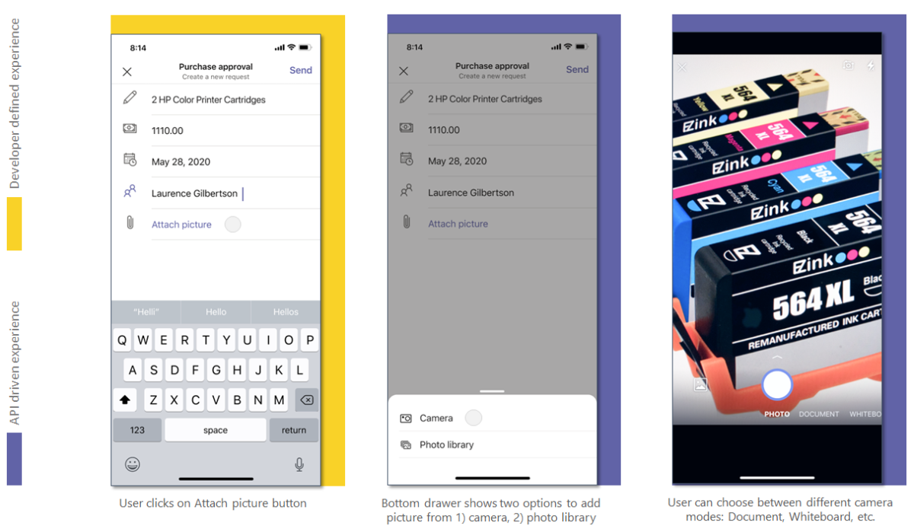

# <a name="integrate-media-capabilities"></a><span data-ttu-id="34cfe-104">Integrar recursos de mídia</span><span class="sxs-lookup"><span data-stu-id="34cfe-104">Integrate media capabilities</span></span> 

<span data-ttu-id="34cfe-105">Este documento orienta você sobre como integrar recursos de mídia.</span><span class="sxs-lookup"><span data-stu-id="34cfe-105">This document guides you on how to integrate media capabilities.</span></span> <span data-ttu-id="34cfe-106">Essa integração combina os recursos de dispositivo nativo, como a **câmera** e **o microfone com** a plataforma do Teams.</span><span class="sxs-lookup"><span data-stu-id="34cfe-106">This integration combines the native device capabilities, such as the **camera** and **microphone** with the Teams platform.</span></span>  

<span data-ttu-id="34cfe-107">Você pode usar o [SDK](/javascript/api/overview/msteams-client?view=msteams-client-js-latest&preserve-view=true)do cliente JavaScript do Microsoft Teams, que fornece as ferramentas necessárias para que seu aplicativo acesse as permissões de dispositivo [de um usuário.](native-device-permissions.md)</span><span class="sxs-lookup"><span data-stu-id="34cfe-107">You can use [Microsoft Teams JavaScript client SDK](/javascript/api/overview/msteams-client?view=msteams-client-js-latest&preserve-view=true), that provides the tools necessary for your app to access a user’s [device permissions](native-device-permissions.md).</span></span> <span data-ttu-id="34cfe-108">Use **APIs** de funcionalidade de mídia adequadas para  integrar  os recursos de dispositivo nativo, como a câmera e o microfone com a plataforma teams no seu aplicativo móvel do Microsoft Teams, e crie uma experiência mais rica.</span><span class="sxs-lookup"><span data-stu-id="34cfe-108">Use suitable  **media capability APIs** to integrate the native device capabilities, such as the **camera** and **microphone** with the Teams platform within your Microsoft Teams mobile app, and build a richer experience.</span></span> 

## <a name="advantage-of-integrating-media-capabilities"></a><span data-ttu-id="34cfe-109">Vantagem da integração de recursos de mídia</span><span class="sxs-lookup"><span data-stu-id="34cfe-109">Advantage of integrating media capabilities</span></span>

<span data-ttu-id="34cfe-110">A principal vantagem da integração de recursos de dispositivo em seus aplicativos do Teams é que ele aproveita controles nativos do Teams para oferecer uma experiência rica e imersiva aos usuários.</span><span class="sxs-lookup"><span data-stu-id="34cfe-110">The main advantage of integrating device capabilities in your Teams apps is it leverages native Teams controls to provide a rich and immersive experience to your users.</span></span>
<span data-ttu-id="34cfe-111">Para integrar recursos de mídia, você deve atualizar o arquivo de manifesto do aplicativo e chamar as APIs de recurso de mídia.</span><span class="sxs-lookup"><span data-stu-id="34cfe-111">To integrate media capabilities you must update the app manifest file and call the media capability APIs.</span></span> 

<span data-ttu-id="34cfe-112">Para uma integração eficaz, você deve ter uma boa compreensão dos trechos de código para chamar as [respectivas](#code-snippets) APIs, que permitem que você use recursos de mídia nativa.</span><span class="sxs-lookup"><span data-stu-id="34cfe-112">For effective integration, you must have a good understanding of [code snippets](#code-snippets) for calling the respective APIs, which allow you to use native media capabilities.</span></span>

<span data-ttu-id="34cfe-113">É importante se familiarizar com os erros de resposta [da API](#error-handling) para lidar com os erros em seu aplicativo do Teams.</span><span class="sxs-lookup"><span data-stu-id="34cfe-113">It is important to familiarize yourself with the [API response errors](#error-handling) to handle the errors in your Teams app.</span></span>

> [!NOTE] 
> <span data-ttu-id="34cfe-114">Atualmente, o suporte do Microsoft Teams para recursos de mídia só está disponível para clientes móveis.</span><span class="sxs-lookup"><span data-stu-id="34cfe-114">Currently, Microsoft Teams support for media capabilities is only available for mobile clients.</span></span>

## <a name="update-manifest"></a><span data-ttu-id="34cfe-115">Manifesto de atualização</span><span class="sxs-lookup"><span data-stu-id="34cfe-115">Update manifest</span></span>

<span data-ttu-id="34cfe-116">Atualize seu aplicativo do Teams [manifest.jsno](../../resources/schema/manifest-schema.md#devicepermissions) arquivo adicionando a propriedade `devicePermissions` e especificando `media` .</span><span class="sxs-lookup"><span data-stu-id="34cfe-116">Update your Teams app [manifest.json](../../resources/schema/manifest-schema.md#devicepermissions) file by adding the `devicePermissions` property and specifying `media`.</span></span> <span data-ttu-id="34cfe-117">Ele permite que seu aplicativo peça permissões de requisito dos  usuários antes de começar a usar a câmera para capturar a  imagem, abra a galeria para selecionar uma imagem para enviar como um anexo ou use o microfone para gravar a conversa.</span><span class="sxs-lookup"><span data-stu-id="34cfe-117">It allows your app to ask for requisite permissions from users before they start using  the **camera** to capture the image, open the gallery to select an image to submit as an attachment, or use the **microphone** to record the conversation.</span></span>

``` json
"devicePermissions": [
    "media",
],
```

> [!NOTE]
> <span data-ttu-id="34cfe-118">O **prompt de Permissões de** Solicitação é exibido automaticamente quando uma API relevante do Teams é iniciada.</span><span class="sxs-lookup"><span data-stu-id="34cfe-118">The **Request Permissions** prompt is automatically displayed when a relevant Teams API is initiated.</span></span> <span data-ttu-id="34cfe-119">Para obter mais informações, consulte [Solicitar permissões de dispositivo](native-device-permissions.md).</span><span class="sxs-lookup"><span data-stu-id="34cfe-119">For more information, see [Request device permissions](native-device-permissions.md).</span></span>

## <a name="media-capability-apis"></a><span data-ttu-id="34cfe-120">APIs de funcionalidade de mídia</span><span class="sxs-lookup"><span data-stu-id="34cfe-120">Media capability APIs</span></span>

<span data-ttu-id="34cfe-121">As [APIs selectMedia](/javascript/api/@microsoft/teams-js/media?view=msteams-client-js-latest#selectMedia_MediaInputs___error__SdkError__attachments__Media_______void_&preserve-view=true), [getMedia](/javascript/api/@microsoft/teams-js/_media?view=msteams-client-js-latest#getMedia__error__SdkError__blob__Blob_____void_&preserve-view=true)e [viewImages](/javascript/api/@microsoft/teams-js/media?view=msteams-client-js-latest#viewImages_ImageUri_____error___SdkError_____void_&preserve-view=true) permitem que você use recursos de mídia nativa da seguinte forma:</span><span class="sxs-lookup"><span data-stu-id="34cfe-121">The [selectMedia](/javascript/api/@microsoft/teams-js/media?view=msteams-client-js-latest#selectMedia_MediaInputs___error__SdkError__attachments__Media_______void_&preserve-view=true), [getMedia](/javascript/api/@microsoft/teams-js/_media?view=msteams-client-js-latest#getMedia__error__SdkError__blob__Blob_____void_&preserve-view=true), and [viewImages](/javascript/api/@microsoft/teams-js/media?view=msteams-client-js-latest#viewImages_ImageUri_____error___SdkError_____void_&preserve-view=true) APIs enable you to use native media capabilities as follows:</span></span>

* <span data-ttu-id="34cfe-122">Use o microfone **nativo** para permitir que os usuários **gravem áudio** (gravar 10 minutos de conversa) do dispositivo.</span><span class="sxs-lookup"><span data-stu-id="34cfe-122">Use the native **microphone** to allow users to **record audio** (record 10 minutes of conversation) from the device.</span></span>
* <span data-ttu-id="34cfe-123">Use o controle **de câmera nativo** para permitir que os usuários **capturem e anexem imagens** em movimento.</span><span class="sxs-lookup"><span data-stu-id="34cfe-123">Use native **camera control** to allow users to **capture and attach images** on the go.</span></span>
* <span data-ttu-id="34cfe-124">Use o suporte **de galeria nativa** para permitir que os usuários **selecionem imagens de dispositivo** como anexos.</span><span class="sxs-lookup"><span data-stu-id="34cfe-124">Use native **gallery support** to allow users to **select device images** as attachments.</span></span>
* <span data-ttu-id="34cfe-125">Use o **controle do visualizador de imagem nativo** para visualizar várias **imagens** ao mesmo tempo.</span><span class="sxs-lookup"><span data-stu-id="34cfe-125">Use native **image viewer control** to **preview multiple images** at one time.</span></span>
* <span data-ttu-id="34cfe-126">Suporte **a transferência de imagem grande** (de 1 MB a 50 MB) através da ponte SDK.</span><span class="sxs-lookup"><span data-stu-id="34cfe-126">Support **large image transfer** (from 1 MB to 50 MB) through the SDK bridge.</span></span>
* <span data-ttu-id="34cfe-127">Suporte **aos recursos avançados de imagem** que permitem que os usuários visualizem e editem imagens:</span><span class="sxs-lookup"><span data-stu-id="34cfe-127">Support **advanced image capabilities** allowing users to preview and edit images:</span></span>
  * <span data-ttu-id="34cfe-128">Examinar documento, quadro de trabalho e cartões de visita pela câmera.</span><span class="sxs-lookup"><span data-stu-id="34cfe-128">Scan document, whiteboard, and business cards  through the camera.</span></span>
  
> [!IMPORTANT]
>*   <span data-ttu-id="34cfe-129">As APIs , e podem ser invocadas de várias `selectMedia` `getMedia` `viewImages` superfícies do Teams, como módulos de tarefas, guias e aplicativos pessoais.</span><span class="sxs-lookup"><span data-stu-id="34cfe-129">The `selectMedia`, `getMedia`, and `viewImages` APIs can be invoked from multiple Teams surfaces such as task modules, tabs, and personal apps.</span></span> <span data-ttu-id="34cfe-130">Para obter mais detalhes, consulte [Pontos de entrada para aplicativos do Teams](../extensibility-points.md).</span><span class="sxs-lookup"><span data-stu-id="34cfe-130">For more details, see [Entry points for Teams apps](../extensibility-points.md).</span></span>
>* <span data-ttu-id="34cfe-131">`selectMedia` A API foi estendida para dar suporte a propriedades de microfone e áudio.</span><span class="sxs-lookup"><span data-stu-id="34cfe-131">`selectMedia` API has been extended to support mic and audio properties.</span></span>

<span data-ttu-id="34cfe-132">Você deve usar o seguinte conjunto de APIs para habilitar os recursos de mídia do dispositivo:</span><span class="sxs-lookup"><span data-stu-id="34cfe-132">You must use the following set of APIs to enable your device's media capabilities:</span></span>

| <span data-ttu-id="34cfe-133">API</span><span class="sxs-lookup"><span data-stu-id="34cfe-133">API</span></span>      | <span data-ttu-id="34cfe-134">Descrição</span><span class="sxs-lookup"><span data-stu-id="34cfe-134">Description</span></span>   |
| --- | --- |
| <span data-ttu-id="34cfe-135">[**selectMedia**](/javascript/api/@microsoft/teams-js/media?view=msteams-client-js-latest#selectMedia_MediaInputs___error__SdkError__attachments__Media_______void_&preserve-view=true) (**Câmera)**</span><span class="sxs-lookup"><span data-stu-id="34cfe-135">[**selectMedia**](/javascript/api/@microsoft/teams-js/media?view=msteams-client-js-latest#selectMedia_MediaInputs___error__SdkError__attachments__Media_______void_&preserve-view=true) (**Camera)**</span></span>| <span data-ttu-id="34cfe-136">Essa API permite que os usuários **capturem ou selecionem mídia da** câmera do dispositivo e a retornem ao aplicativo Web.</span><span class="sxs-lookup"><span data-stu-id="34cfe-136">This API allows users to **capture or select media from the device camera** and return it to the web-app.</span></span> <span data-ttu-id="34cfe-137">Os usuários podem editar, cortar, girar, anotar ou desenhar imagens antes do envio.</span><span class="sxs-lookup"><span data-stu-id="34cfe-137">The users can edit, crop, rotate, annotate, or draw over images before submission.</span></span> <span data-ttu-id="34cfe-138">Em resposta a **selectMedia**, o web-app recebe as IDs de mídia de imagens selecionadas e uma miniatura da mídia selecionada.</span><span class="sxs-lookup"><span data-stu-id="34cfe-138">In response to **selectMedia**, the web-app receives the media IDs of selected images and a thumbnail of the selected media.</span></span> <span data-ttu-id="34cfe-139">Essa API pode ser configurada ainda mais por meio da [configuração ImageProps.](/javascript/api/@microsoft/teams-js/imageprops?view=msteams-client-js-latest&preserve-view=true)</span><span class="sxs-lookup"><span data-stu-id="34cfe-139">This API can be further configured through the [ImageProps](/javascript/api/@microsoft/teams-js/imageprops?view=msteams-client-js-latest&preserve-view=true) configuration.</span></span> |
| <span data-ttu-id="34cfe-140">[**selectMedia**](/javascript/api/@microsoft/teams-js/media?view=msteams-client-js-latest#selectMedia_MediaInputs___error__SdkError__attachments__Media_______void_&preserve-view=true) (**Microfone**)</span><span class="sxs-lookup"><span data-stu-id="34cfe-140">[**selectMedia**](/javascript/api/@microsoft/teams-js/media?view=msteams-client-js-latest#selectMedia_MediaInputs___error__SdkError__attachments__Media_______void_&preserve-view=true) (**Microphone**)</span></span>| <span data-ttu-id="34cfe-141">De definir [o mediaType](/javascript/api/@microsoft/teams-js/mediatype?view=msteams-client-js-latest&preserve-view=true) como `4` na API **selectMedia** para acessar o recurso de microfone.</span><span class="sxs-lookup"><span data-stu-id="34cfe-141">Set the [mediaType](/javascript/api/@microsoft/teams-js/mediatype?view=msteams-client-js-latest&preserve-view=true) to `4` in **selectMedia** API for accessing microphone  capability.</span></span> <span data-ttu-id="34cfe-142">Essa API também permite que os usuários gravem áudio do microfone do dispositivo e retornem clipes gravados para o aplicativo Web.</span><span class="sxs-lookup"><span data-stu-id="34cfe-142">This API also allows users to record audio from the device microphone and return recorded clips to the web-app.</span></span> <span data-ttu-id="34cfe-143">Os usuários podem pausar, gravar e reproduzir a visualização de gravação antes do envio.</span><span class="sxs-lookup"><span data-stu-id="34cfe-143">The users can pause, re-record, and play recording preview before submission.</span></span> <span data-ttu-id="34cfe-144">Em resposta a **selectMedia**, o aplicativo Web recebe IDs de mídia da gravação de áudio selecionada.</span><span class="sxs-lookup"><span data-stu-id="34cfe-144">In response to **selectMedia**, the web-app receives media IDs of the selected audio recording.</span></span> <br/> <span data-ttu-id="34cfe-145">Use `maxDuration` , se você precisar configurar uma duração em minutos para gravar a conversa.</span><span class="sxs-lookup"><span data-stu-id="34cfe-145">Use `maxDuration`, if you require to configure a duration in minutes for recording the conversation.</span></span> <span data-ttu-id="34cfe-146">A duração atual da gravação é de 10 minutos, após o qual a gravação é encerrada.</span><span class="sxs-lookup"><span data-stu-id="34cfe-146">The current duration for recording is 10 minutes, after which the recording terminates.</span></span>  |
| [<span data-ttu-id="34cfe-147">**getMedia**</span><span class="sxs-lookup"><span data-stu-id="34cfe-147">**getMedia**</span></span>](/javascript/api/@microsoft/teams-js/_media?view=msteams-client-js-latest#getMedia__error__SdkError__blob__Blob_____void_&preserve-view=true)| <span data-ttu-id="34cfe-148">Essa API recupera a mídia capturada pela API **selectMedia** em partes, independentemente do tamanho da mídia.</span><span class="sxs-lookup"><span data-stu-id="34cfe-148">This API retrieves the media captured by **selectMedia** API in chunks, irrespective of the media size.</span></span> <span data-ttu-id="34cfe-149">Essas partes são montadas e enviadas de volta para o aplicativo Web como um arquivo ou blob.</span><span class="sxs-lookup"><span data-stu-id="34cfe-149">These chunks are assembled and sent back to the web app as a file or blob.</span></span> <span data-ttu-id="34cfe-150">A quebra de mídia em partes menores facilita a transferência de arquivos grandes.</span><span class="sxs-lookup"><span data-stu-id="34cfe-150">Breaking of media into smaller chunks facilitates large file transfer.</span></span> |
| [<span data-ttu-id="34cfe-151">**viewImages**</span><span class="sxs-lookup"><span data-stu-id="34cfe-151">**viewImages**</span></span>](/javascript/api/@microsoft/teams-js/media?view=msteams-client-js-latest#viewImages_ImageUri_____error___SdkError_____void_&preserve-view=true)| <span data-ttu-id="34cfe-152">Essa API permite que o usuário veja imagens no modo de tela inteira como uma lista rolável.</span><span class="sxs-lookup"><span data-stu-id="34cfe-152">This API enables the user to view images in  full-screen mode as a scrollable list.</span></span>|


<span data-ttu-id="34cfe-153">**Experiência do aplicativo Web para a API SelectMedia para funcionalidade de imagem** 
 </span><span class="sxs-lookup"><span data-stu-id="34cfe-153">**Web app experience for selectMedia API for image capability**
</span></span>

<span data-ttu-id="34cfe-154">**Experiência do aplicativo Web para a API selectMedia para funcionalidade de microfone** 
 </span><span class="sxs-lookup"><span data-stu-id="34cfe-154">**Web app experience for selectMedia API for microphone capability**
</span></span>

## <a name="error-handling"></a><span data-ttu-id="34cfe-155">Tratamento de erros</span><span class="sxs-lookup"><span data-stu-id="34cfe-155">Error handling</span></span>

<span data-ttu-id="34cfe-156">Certifique-se de lidar com esses erros adequadamente em seu aplicativo do Teams.</span><span class="sxs-lookup"><span data-stu-id="34cfe-156">You must ensure to handle these errors appropriately in your Teams app.</span></span> <span data-ttu-id="34cfe-157">A tabela a seguir lista os códigos de erro e as condições nas quais os erros são gerados:</span><span class="sxs-lookup"><span data-stu-id="34cfe-157">The following table lists the error codes and the conditions under which the errors are generated:</span></span> 


|<span data-ttu-id="34cfe-158">Código de erro</span><span class="sxs-lookup"><span data-stu-id="34cfe-158">Error code</span></span> |  <span data-ttu-id="34cfe-159">Nome do erro</span><span class="sxs-lookup"><span data-stu-id="34cfe-159">Error name</span></span>     | <span data-ttu-id="34cfe-160">Condition</span><span class="sxs-lookup"><span data-stu-id="34cfe-160">Condition</span></span>|
| --------- | --------------- | -------- |
| <span data-ttu-id="34cfe-161">**100**</span><span class="sxs-lookup"><span data-stu-id="34cfe-161">**100**</span></span> | <span data-ttu-id="34cfe-162">NOT_SUPPORTED_ON_PLATFORM</span><span class="sxs-lookup"><span data-stu-id="34cfe-162">NOT_SUPPORTED_ON_PLATFORM</span></span> | <span data-ttu-id="34cfe-163">A API não tem suporte na plataforma atual.</span><span class="sxs-lookup"><span data-stu-id="34cfe-163">API is not supported on the current platform.</span></span>|
| <span data-ttu-id="34cfe-164">**404**</span><span class="sxs-lookup"><span data-stu-id="34cfe-164">**404**</span></span> | <span data-ttu-id="34cfe-165">FILE_NOT_FOUND</span><span class="sxs-lookup"><span data-stu-id="34cfe-165">FILE_NOT_FOUND</span></span> | <span data-ttu-id="34cfe-166">O arquivo especificado não é encontrado no local determinado.</span><span class="sxs-lookup"><span data-stu-id="34cfe-166">File specified is not found in the given location.</span></span>|
| <span data-ttu-id="34cfe-167">**500**</span><span class="sxs-lookup"><span data-stu-id="34cfe-167">**500**</span></span> | <span data-ttu-id="34cfe-168">INTERNAL_ERROR</span><span class="sxs-lookup"><span data-stu-id="34cfe-168">INTERNAL_ERROR</span></span> | <span data-ttu-id="34cfe-169">Erro interno é encontrado durante a execução da operação necessária.</span><span class="sxs-lookup"><span data-stu-id="34cfe-169">Internal error is encountered while performing the required operation.</span></span>|
| <span data-ttu-id="34cfe-170">**1000**</span><span class="sxs-lookup"><span data-stu-id="34cfe-170">**1000**</span></span> | <span data-ttu-id="34cfe-171">PERMISSION_DENIED</span><span class="sxs-lookup"><span data-stu-id="34cfe-171">PERMISSION_DENIED</span></span> |<span data-ttu-id="34cfe-172">A permissão é negada pelo usuário.</span><span class="sxs-lookup"><span data-stu-id="34cfe-172">Permission is denied by the user.</span></span>|
| <span data-ttu-id="34cfe-173">**2000**</span><span class="sxs-lookup"><span data-stu-id="34cfe-173">**2000**</span></span> |<span data-ttu-id="34cfe-174">NETWORK_ERROR</span><span class="sxs-lookup"><span data-stu-id="34cfe-174">NETWORK_ERROR</span></span> | <span data-ttu-id="34cfe-175">Problema de rede.</span><span class="sxs-lookup"><span data-stu-id="34cfe-175">Network issue.</span></span>|
| <span data-ttu-id="34cfe-176">**3000**</span><span class="sxs-lookup"><span data-stu-id="34cfe-176">**3000**</span></span> | <span data-ttu-id="34cfe-177">NO_HW_SUPPORT</span><span class="sxs-lookup"><span data-stu-id="34cfe-177">NO_HW_SUPPORT</span></span> | <span data-ttu-id="34cfe-178">O hardware subjacente não dá suporte à funcionalidade.</span><span class="sxs-lookup"><span data-stu-id="34cfe-178">Underlying hardware does not support the capability.</span></span>|
| <span data-ttu-id="34cfe-179">**4000**</span><span class="sxs-lookup"><span data-stu-id="34cfe-179">**4000**</span></span>| <span data-ttu-id="34cfe-180">INVALID_ARGUMENTS</span><span class="sxs-lookup"><span data-stu-id="34cfe-180">INVALID_ARGUMENTS</span></span> | <span data-ttu-id="34cfe-181">Um ou mais argumentos são inválidos.</span><span class="sxs-lookup"><span data-stu-id="34cfe-181">One or more arguments are invalid.</span></span>|
| <span data-ttu-id="34cfe-182">**5000**</span><span class="sxs-lookup"><span data-stu-id="34cfe-182">**5000**</span></span> | <span data-ttu-id="34cfe-183">UNAUTHORIZED_USER_OPERATION</span><span class="sxs-lookup"><span data-stu-id="34cfe-183">UNAUTHORIZED_USER_OPERATION</span></span> | <span data-ttu-id="34cfe-184">O usuário não está autorizado a concluir essa operação.</span><span class="sxs-lookup"><span data-stu-id="34cfe-184">User is not authorized to complete this operation.</span></span>|
| <span data-ttu-id="34cfe-185">**6000**</span><span class="sxs-lookup"><span data-stu-id="34cfe-185">**6000**</span></span> |<span data-ttu-id="34cfe-186">INSUFFICIENT_RESOURCES</span><span class="sxs-lookup"><span data-stu-id="34cfe-186">INSUFFICIENT_RESOURCES</span></span> | <span data-ttu-id="34cfe-187">A operação não pôde ser concluída devido a recursos insuficientes.</span><span class="sxs-lookup"><span data-stu-id="34cfe-187">Operation could not be completed due to insufficient resources.</span></span>|
|<span data-ttu-id="34cfe-188">**7000**</span><span class="sxs-lookup"><span data-stu-id="34cfe-188">**7000**</span></span> | <span data-ttu-id="34cfe-189">THROTTLE</span><span class="sxs-lookup"><span data-stu-id="34cfe-189">THROTTLE</span></span> | <span data-ttu-id="34cfe-190">A plataforma acelerou a solicitação à medida que a API era invocada com frequência.</span><span class="sxs-lookup"><span data-stu-id="34cfe-190">Platform throttled the request as the API was invoked frequently.</span></span>|
|  <span data-ttu-id="34cfe-191">**8000**</span><span class="sxs-lookup"><span data-stu-id="34cfe-191">**8000**</span></span> | <span data-ttu-id="34cfe-192">USER_ABORT</span><span class="sxs-lookup"><span data-stu-id="34cfe-192">USER_ABORT</span></span> |<span data-ttu-id="34cfe-193">O usuário aborta a operação.</span><span class="sxs-lookup"><span data-stu-id="34cfe-193">User aborts the operation.</span></span>|
| <span data-ttu-id="34cfe-194">**9000**</span><span class="sxs-lookup"><span data-stu-id="34cfe-194">**9000**</span></span>| <span data-ttu-id="34cfe-195">OLD_PLATFORM</span><span class="sxs-lookup"><span data-stu-id="34cfe-195">OLD_PLATFORM</span></span> | <span data-ttu-id="34cfe-196">O código da plataforma está desatualizado e não implementa essa API.</span><span class="sxs-lookup"><span data-stu-id="34cfe-196">Platform code is outdated and does not implement this API.</span></span>|
| <span data-ttu-id="34cfe-197">**10000**</span><span class="sxs-lookup"><span data-stu-id="34cfe-197">**10000**</span></span>| <span data-ttu-id="34cfe-198">SIZE_EXCEEDED</span><span class="sxs-lookup"><span data-stu-id="34cfe-198">SIZE_EXCEEDED</span></span> |  <span data-ttu-id="34cfe-199">O valor de retorno é muito grande e excedeu os limites de tamanho da plataforma.</span><span class="sxs-lookup"><span data-stu-id="34cfe-199">Return value is too big and has exceeded the platform size boundaries.</span></span>|

## <a name="code-snippets"></a><span data-ttu-id="34cfe-200">Trechos de código</span><span class="sxs-lookup"><span data-stu-id="34cfe-200">Code snippets</span></span>

<span data-ttu-id="34cfe-201">**Chamada `selectMedia` API** para capturar imagens usando câmera:</span><span class="sxs-lookup"><span data-stu-id="34cfe-201">**Calling `selectMedia` API** for capturing images using camera:</span></span>

```javascript
let imageProp: microsoftTeams.media.ImageProps = {
    sources: [microsoftTeams.media.Source.Camera, microsoftTeams.media.Source.Gallery],
    startMode: microsoftTeams.media.CameraStartMode.Photo,
    ink: false,
    cameraSwitcher: false,
    textSticker: false,
    enableFilter: true,
};
let mediaInput: microsoftTeams.media.MediaInputs = {
    mediaType: microsoftTeams.media.MediaType.Image,
    maxMediaCount: 10,
    imageProps: imageProp
};
microsoftTeams.media.selectMedia(mediaInput, (error: microsoftTeams.SdkError, attachments: microsoftTeams.media.Media[]) => {
    if (error) {
        if (error.message) {
            alert(" ErrorCode: " + error.errorCode + error.message);
        } else {
            alert(" ErrorCode: " + error.errorCode);
        }
    }
    if (attachments) {
        let y = attachments[0];
        img.src = ("data:" + y.mimeType + ";base64," + y.preview);
    }
});
```

<span data-ttu-id="34cfe-202">**Chamada `getMedia` API** para recuperar grandes mídias em partes:</span><span class="sxs-lookup"><span data-stu-id="34cfe-202">**Calling `getMedia` API** to retrieve large media in chunks:</span></span>

```javascript
let media: microsoftTeams.media.Media = attachments[0]
media.getMedia((error: microsoftTeams.SdkError, blob: Blob) => {
    if (blob) {
        if (blob.type.includes("image")) {
            img.src = (URL.createObjectURL(blob));
        }
    }
    if (error) {
        if (error.message) {
            alert(" ErrorCode: " + error.errorCode + error.message);
        } else {
            alert(" ErrorCode: " + error.errorCode);
        }
    }
});
```

<span data-ttu-id="34cfe-203">**Chamada `viewImages` API por ID retornada pela `selectMedia` API**:</span><span class="sxs-lookup"><span data-stu-id="34cfe-203">**Calling `viewImages` API by ID returned by `selectMedia` API**:</span></span>

```javascript
// View images by id:
// Assumption: attachmentArray = select Media API Output
let uriList = [];
if (attachmentArray && attachmentArray.length > 0) {
    for (let i = 0; i < attachmentArray.length; i++) {
        let file = attachmentArray[i];
        if (file.mimeType.includes("image")) {
            let imageUri = {
                value: file.content,
                type: 1,
            }
            uriList.push(imageUri);
        } else {
            alert("File type is not image");
        }
    }
}
if (uriList.length > 0) {
    microsoftTeams.media.viewImages(uriList, (error: microsoftTeams.SdkError) => {
        if (error) {
            if (error.message) {
                output(" ErrorCode: " + error.errorCode + error.message);
            } else {
                output(" ErrorCode: " + error.errorCode);
            }
        }
    });
} else {
    output("Url list is empty");
}
```

<span data-ttu-id="34cfe-204">**Chamada `viewImages` API por URL**:</span><span class="sxs-lookup"><span data-stu-id="34cfe-204">**Calling `viewImages` API by URL**:</span></span>

```javascript
// View Images by URL:
// Assumption 2 urls, url1 and url2
let uriList = [];
if (URL1 != null && URL1.length > 0) {
    let imageUri = {
        value: URL1,
        type: 2,
    }
    uriList.push(imageUri);
}
if (URL2 != null && URL2.length > 0) {
    let imageUri = {
        value: URL2,
        type: 2,
    }
    uriList.push(imageUri);
}
if (uriList.length > 0) {
    microsoftTeams.media.viewImages(uriList, (error: microsoftTeams.SdkError) => {
        if (error) {
            if (error.message) {
                output(" ErrorCode: " + error.errorCode + error.message);
            } else {
                output(" ErrorCode: " + error.errorCode);
            }
        }
    });
} else {
    output("Url list is empty");
}
```

<span data-ttu-id="34cfe-205">**Chamada `selectMedia` e `getMedia` APIs para gravação de áudio por microfone:**</span><span class="sxs-lookup"><span data-stu-id="34cfe-205">**Calling `selectMedia` and `getMedia` APIs for recording audio through microphone**:</span></span>

```javascript
let mediaInput: microsoftTeams.media.MediaInputs = {
    mediaType: microsoftTeams.media.MediaType.Audio,
    maxMediaCount: 1,
};
microsoftTeams.media.selectMedia(mediaInput, (error: microsoftTeams.SdkError, attachments: microsoftTeams.media.Media[]) => {
    if (error) {
        if (error.message) {
            alert(" ErrorCode: " + error.errorCode + error.message);
        } else {
            alert(" ErrorCode: " + error.errorCode);
        }
    }
    // If you want to directly use the audio file (for smaller file sizes (~4MB))    if (attachments) {
    let audioResult = attachments[0];
    var videoElement = document.createElement("video");
    videoElement.setAttribute("src", ("data:" + y.mimeType + ";base64," + y.preview));
    //To use the audio file via get Media API for bigger audio file sizes greater than 4MB        audioResult.getMedia((error: microsoftTeams.SdkError, blob: Blob) => {
    if (blob) {
        if (blob.type.includes("video")) {
            videoElement.setAttribute("src", URL.createObjectURL(blob));
        }
    }
    if (error) {
        if (error.message) {
            alert(" ErrorCode: " + error.errorCode + error.message);
        } else {
            alert(" ErrorCode: " + error.errorCode);
        }
    }
});
```

## <a name="see-also"></a><span data-ttu-id="34cfe-206">Confira também</span><span class="sxs-lookup"><span data-stu-id="34cfe-206">See also</span></span>

> [!div class="nextstepaction"]
> [<span data-ttu-id="34cfe-207">Integrar a QR ou o recurso de scanner de código de barras no Teams</span><span class="sxs-lookup"><span data-stu-id="34cfe-207">Integrate QR or barcode scanner capability in Teams</span></span>](qr-barcode-scanner-capability.md)