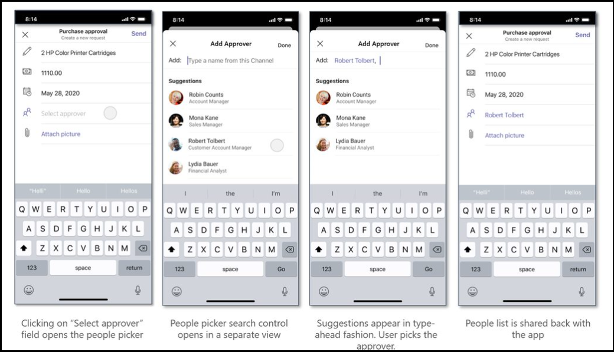

# <a name="integrate-people-picker"></a>Integrar o Seletor de Pessoas  

O Seletor de Pessoas é um controle para pesquisar e selecionar pessoas. Esse é um recurso nativo disponível na Teams plataforma. Você pode integrar Teams controle de entrada nativo do People Picker com seus aplicativos Web. Você pode selecionar entre uma seleção única ou várias e configurações, como limitar a pesquisa em um chat, canais ou em toda a organização.

Você pode usar [Microsoft Teams SDK do cliente JavaScript](/javascript/api/overview/msteams-client?view=msteams-client-js-latest&preserve-view=true), `selectPeople` que fornece API para integrar o Selador de Pessoas ao seu aplicativo Web. 

## <a name="advantages-of-integrating-the-native-people-picker"></a>Vantagens de integrar o Selador de Pessoas nativos 

* O controle People Picker funciona em todas as Teams, como módulo de tarefa, chat, canal, guia de reunião e aplicativo pessoal.
* Esse controle permite que você pesquise e selecione usuários em um chat, canal ou toda a organização.
* O People Picker ajuda com cenários que envolvem atribuição de tarefas, marcação, notificação de um usuário. 
* Você pode usar esse controle prontamente disponível em seu aplicativo Web. Economiza o esforço e o tempo significativamente para criar esse controle por conta própria.

Você deve chamar a `selectPeople` API para integrar o controle Se picker de pessoas em seu Teams app. Para uma integração eficaz, você deve ter uma compreensão do [trecho de código](#code-snippet) para chamar a API. É importante se familiarizar com os erros de resposta [da API](#error-handling) para lidar com os erros em seu aplicativo Web.

> [!NOTE] 
> Atualmente, o Microsoft Teams suporte para o People Picker está disponível apenas para clientes móveis.

## <a name="selectpeople-api"></a>`selectPeople` API 

`selectPeople`A API permite que você adicione Teams nativos aos `People Picker input control` seus aplicativos Web.  
A descrição da API é a seguinte:

| API      | Descrição  |
| --- | --- |
|**selectPeople**|Inicia um Seletor de Pessoas e permite que o usuário pesquise e selecione uma ou mais pessoas na lista.<br/><br/>Essa API retorna a ID, o nome e o endereço de email dos usuários selecionados para o aplicativo Web de chamada.<br/><br/>No caso de um aplicativo pessoal, o controle pesquisa em toda a organização. Se o aplicativo for adicionado a um chat ou canal, o contexto de pesquisa será configurado dependendo do cenário. A pesquisa é restrita dentro dos membros desse chat, canal ou disponibilizado em toda a organização.|

A `selectPeople` API acompanha as seguintes configurações de entrada:

|Parâmetro Configuration|Tipo|Descrição| Valor padrão|
|-----|------|--------------|------|
|`title`| Cadeia de caracteres| É um parâmetro opcional. Ele define o título para o controle People Picker. | Selecionar pessoas|
|`setSelected`|Cadeia de caracteres| É um parâmetro opcional. Você deve passar Microsoft Azure Active Directory IDs (Azure AD) das pessoas a serem pré-selecionadas. Esse parâmetro pré-seleciona as pessoas ao iniciar o controle People Picker. Em caso de seleção única, apenas o primeiro usuário válido é pré-populado ignorando o restante. |Nulo| 
|`openOrgWideSearchInChatOrChannel`|Boolean | É um parâmetro opcional. Quando é definido como true, ele inicia o People Picker no escopo de toda a organização, mesmo que o aplicativo seja adicionado a um chat ou canal. |Falso|
|`singleSelect`|Boolean|É um parâmetro opcional. Quando ele é definido como true, ele inicia o Seletor de Pessoas restringindo a seleção somente a um usuário. |Falso|

A imagem a seguir mostra a experiência do People Picker em um aplicativo Web de exemplo:



### <a name="code-snippet"></a>Trecho de código

**Chamada `selectPeople` API** para selecionar pessoas de uma lista:

```javascript
 microsoftTeams.people.selectPeople((error: microsoftTeams.SdkError, people: microsoftTeams.people.PeoplePickerResult[]) => 
 {
    if (error) 
    {
        if (error.message) 
           {
             alert(" ErrorCode: " + error.errorCode + error.message);
           }
            else 
            {
              alert(" ErrorCode: " + error.errorCode);
            }
      }
    if (people)
     {
            output(" People length: " + people.length + " " + JSON.stringify(people));
      }
  });
```

## <a name="error-handling"></a>Tratamento de erros

Certifique-se de lidar com os erros adequadamente em seu aplicativo Web. A tabela a seguir lista os códigos de erro e as condições nas quais os erros são gerados: 

|Código de erro |  Nome do erro     | Condição|
| --------- | --------------- | -------- |
| **100** | NOT_SUPPORTED_ON_PLATFORM | A API não tem suporte na plataforma atual.|
| **500** | INTERNAL_ERROR | Erro interno é encontrado ao iniciar o Selador de Pessoas.|
| **4000** | INVALID_ARGUMENTS | A API é invocada com argumentos obrigatórios errados ou insuficientes.|
| **8000** | USER_ABORT |O usuário cancelou a operação.|
| **9000** | OLD_PLATFORM | O usuário está em uma com build de plataforma antiga onde a implementação da API não está presente.  Atualizar a com build resolve o problema.|

## <a name="see-also"></a>Confira também

* [Integrar recursos de mídia no Teams](mobile-camera-image-permissions.md)
* [Integrar o código de QR ou o recurso de scanner de código de barras Teams](qr-barcode-scanner-capability.md)
* [Integrar recursos de localização Teams](location-capability.md)
