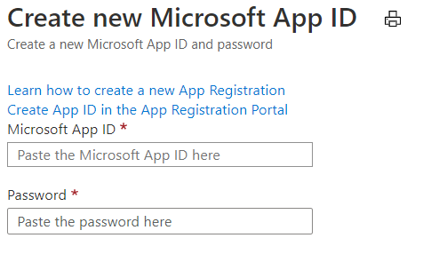

1. No portal [do Azure](https://ms.portal.azure.com/#home), em Serviços do Azure, selecione **Criar um recurso**.In the [Azure portal](https://ms.portal.azure.com/#home), under Azure services, select **Create a resource**.
1. Na caixa de pesquisa, digite "bot".In the search box enter "bot". E na lista lista listada, selecione **Registro de Canais de Bot**.And in the drop-down list, select **Bot Channels Registration**.
1. Selecione o **botão Criar.**Select the **Create** button.
1. Na folha **Registro de Canal** bot, forneça as informações solicitadas sobre seu bot.In the **Bot Channel Registration** blade, provide the requested information about your bot.
1. Deixe a **caixa de ponto de extremidade** Mensagens vazia por enquanto, você inserirá a URL necessária após a implantação do bot.Leave the **Messaging endpoint** box empty for now, you will enter the required URL after deploying the bot. A imagem a seguir mostra um exemplo das configurações de registro:The following picture shows an example of the registration settings:

    

1. Clique **em ID e senha do** Aplicativo Microsoft e crie **Novo**.Click **Microsoft App ID and password** and then **Create New**.

          

1. Clique **em Criar ID do Aplicativo no** link Portal de Registro de Aplicativos.Click **Create App ID in the App Registration Portal** link.

   
   
1. Na janela de registro **do aplicativo exibido,** clique na guia **Novo registro** no canto superior esquerdo.In the displayed **App registration** window, click the **New registration** tab in the upper left.
1. Insira o nome do aplicativo bot que você está registrando, nós utilizamos *BotTeamsAuth* (você precisa selecionar seu próprio nome exclusivo).Enter the name of the bot application you are registering, we used *BotTeamsAuth* (you need to select your own unique name).
1. Para os **tipos de conta** com suporte, selecione Contas em qualquer diretório organizacional (Qualquer diretório do *Azure AD - Multitenant) e contas pessoais da Microsoft (por exemplo, Skype, Xbox)*.For the **Supported account types** select *Accounts in any organizational directory (Any Azure AD directory - Multitenant) and personal Microsoft accounts (e.g. Skype, Xbox)*.
1. Clique no **botão Registrar.**Click the **Register** button. Depois de concluído, o Azure exibe a página *Visão* Geral do aplicativo.Once completed, Azure displays the *Overview* page for the application.
1. Copie e salve em um arquivo o valor da **ID do** aplicativo (cliente).Copy and save to a file the **Application (client) ID** value.
1. No painel esquerdo, clique em **Certificado e segredos.**In the left panel, click **Certificate and secrets**.
    1. Em *Segredos do Cliente,* clique **em Novo segredo do cliente.**Under *Client secrets*, click **New client secret**.
    1. Adicione uma descrição para identificar esse segredo de outras pessoas que talvez você precise criar para este aplicativo.Add a description to identify this secret from others you might need to create for this app.
    1. Set *Expires* to your selection.Set *Expires* to your selection.
    1. Clique em **Adicionar**.Click **Add**.
    1. Copie o segredo do cliente e salve-o em um arquivo.Copy the client secret and save it to a file.
1. Volte para a janela **Registro** do Canal bot  e copie a *ID* do aplicativo e o segredo do cliente nas caixas **ID** do Aplicativo Microsoft e **Senha,** respectivamente.Go back to the **Bot Channel Registration** window and copy the *App ID* and the *Client secret* in the **Microsoft App ID** and **Password** boxes, respectively.
1. Clique em **OK**.Click **OK**.
1. Por fim, clique em **Criar**.Finally, click **Create**.

Depois que o Azure tiver criado o recurso de registro, ele será incluído na lista de grupos de recursos.After Azure has created the registration resource it will be included in the resource group list.  

Depois que o registro de canais de bot for criado, você precisará habilitar o Teams canal.Once your bot channels registration is created, you'll need to enable the Teams channel.

1. No portal [do Azure](https://ms.portal.azure.com/#home), em serviços do Azure, selecione o **Registro** de Canal bot que você acabou de criar.In the [Azure portal](https://ms.portal.azure.com/#home), under Azure services, select the **Bot Channel Registration** you just created.
1. No painel esquerdo, clique em **Canais**.In the left panel, click **Channels**.
1. Clique no Microsoft Teams e escolha **Salvar**.Click the Microsoft Teams icon, then choose **Save**.
