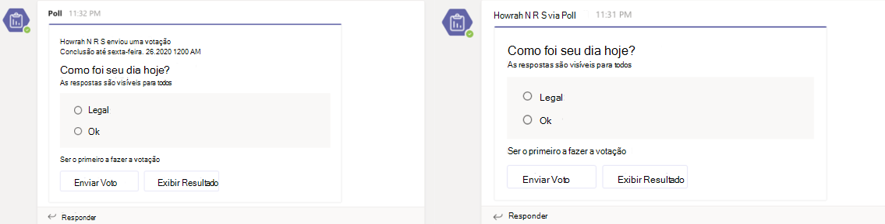

# <a name="respond-to-the-task-module-submit-action"></a><span data-ttu-id="47063-103">Responder à ação de envio do módulo de tarefas</span><span class="sxs-lookup"><span data-stu-id="47063-103">Respond to the task module submit action</span></span>

[!include[v4-to-v3-SDK-pointer](~/includes/v4-to-v3-pointer-me.md)]

<span data-ttu-id="47063-104">Este documento orienta você sobre como seu aplicativo responde aos comandos de ação, como a ação de envio do módulo de tarefas do usuário.</span><span class="sxs-lookup"><span data-stu-id="47063-104">This document guides you on how your app responds to the action commands, such as user's task module submit action.</span></span>
<span data-ttu-id="47063-105">Depois que um usuário envia o módulo de tarefa, seu serviço Web recebe uma mensagem de invocação com a ID de comando e os valores `composeExtension/submitAction` de parâmetro.</span><span class="sxs-lookup"><span data-stu-id="47063-105">After a user submits the task module, your web service receives a `composeExtension/submitAction` invoke message with the command ID and parameter values.</span></span> <span data-ttu-id="47063-106">Seu aplicativo tem cinco segundos para responder à invocação, caso contrário, o usuário recebe uma mensagem de erro Não é possível alcançar o aplicativo **e** qualquer resposta à invocação é ignorada pelo cliente do Teams.</span><span class="sxs-lookup"><span data-stu-id="47063-106">Your app has five seconds to respond to the invoke, otherwise the user receives an error message **Unable to reach the app**, and any reply to the invoke is ignored by the Teams client.</span></span>

<span data-ttu-id="47063-107">Você tem as seguintes opções para responder:</span><span class="sxs-lookup"><span data-stu-id="47063-107">You have the following options to respond:</span></span>

* <span data-ttu-id="47063-108">Nenhuma resposta: use a ação enviar para disparar um processo em um sistema externo e não fornecer comentários ao usuário.</span><span class="sxs-lookup"><span data-stu-id="47063-108">No response: Use the submit action to trigger a process in an external system, and not provide any feedback to the user.</span></span> <span data-ttu-id="47063-109">Isso é útil para processos de longa duração e você pode selecionar para fornecer comentários de forma alternativa.</span><span class="sxs-lookup"><span data-stu-id="47063-109">This is useful for long-running processes, and you can select to provide feedback alternately.</span></span> <span data-ttu-id="47063-110">Por exemplo, você pode dar comentários com uma [mensagem proativa](~/bots/how-to/conversations/send-proactive-messages.md).</span><span class="sxs-lookup"><span data-stu-id="47063-110">For example, you can give feedback with a [proactive message](~/bots/how-to/conversations/send-proactive-messages.md).</span></span>
* <span data-ttu-id="47063-111">[Outro módulo de](#respond-with-another-task-module)tarefa : você pode responder com um módulo de tarefa adicional como parte de uma interação em várias etapas.</span><span class="sxs-lookup"><span data-stu-id="47063-111">[Another task module](#respond-with-another-task-module): You can respond with an additional task module as part of a multi-step interaction.</span></span>
* <span data-ttu-id="47063-112">[Resposta ao](#respond-with-a-card-inserted-into-the-compose-message-area)cartão : você pode responder com um cartão com o que o usuário pode interagir ou inserir em uma mensagem.</span><span class="sxs-lookup"><span data-stu-id="47063-112">[Card response](#respond-with-a-card-inserted-into-the-compose-message-area): You can respond with a card that the user can interact with or insert into a message.</span></span>
* <span data-ttu-id="47063-113">[Cartão Adaptável do bot](#bot-response-with-adaptive-card): Insira um Cartão Adaptável diretamente na conversa.</span><span class="sxs-lookup"><span data-stu-id="47063-113">[Adaptive Card from bot](#bot-response-with-adaptive-card): Insert an Adaptive Card directly into the conversation.</span></span>
* <span data-ttu-id="47063-114">[Solicitar que o usuário autenture](~/messaging-extensions/how-to/add-authentication.md).</span><span class="sxs-lookup"><span data-stu-id="47063-114">[Request the user to authenticate](~/messaging-extensions/how-to/add-authentication.md).</span></span>
* <span data-ttu-id="47063-115">[Solicite que o usuário forneça configuração adicional.](~/messaging-extensions/how-to/add-configuration-page.md)</span><span class="sxs-lookup"><span data-stu-id="47063-115">[Request the user to provide additional configuration](~/messaging-extensions/how-to/add-configuration-page.md).</span></span>

<span data-ttu-id="47063-116">Para autenticação ou configuração, depois que o usuário concluir o processo, a invocação original se ressente ao seu serviço Web.</span><span class="sxs-lookup"><span data-stu-id="47063-116">For authentication or configuration, after the user completes the process, the original invoke is resent to your web service.</span></span> <span data-ttu-id="47063-117">A tabela a seguir mostra quais tipos de respostas estão disponíveis com base no local de `commandContext` invocação da extensão de mensagens:</span><span class="sxs-lookup"><span data-stu-id="47063-117">The following table shows which types of responses are available based on the invoke location `commandContext` of the messaging extension:</span></span> 

|<span data-ttu-id="47063-118">Tipo de resposta</span><span class="sxs-lookup"><span data-stu-id="47063-118">Response Type</span></span> | <span data-ttu-id="47063-119">Escrever</span><span class="sxs-lookup"><span data-stu-id="47063-119">Compose</span></span> | <span data-ttu-id="47063-120">Barra de comandos</span><span class="sxs-lookup"><span data-stu-id="47063-120">Command bar</span></span> | <span data-ttu-id="47063-121">Mensagem</span><span class="sxs-lookup"><span data-stu-id="47063-121">Message</span></span> |
|--------------|:-------------:|:-------------:|:---------:|
|<span data-ttu-id="47063-122">Resposta de cartão</span><span class="sxs-lookup"><span data-stu-id="47063-122">Card response</span></span> | <span data-ttu-id="47063-123">✔</span><span class="sxs-lookup"><span data-stu-id="47063-123">✔</span></span> | <span data-ttu-id="47063-124">✔</span><span class="sxs-lookup"><span data-stu-id="47063-124">✔</span></span> | <span data-ttu-id="47063-125">✔</span><span class="sxs-lookup"><span data-stu-id="47063-125">✔</span></span> |
|<span data-ttu-id="47063-126">Outro módulo de tarefa</span><span class="sxs-lookup"><span data-stu-id="47063-126">Another task module</span></span> | <span data-ttu-id="47063-127">✔</span><span class="sxs-lookup"><span data-stu-id="47063-127">✔</span></span> | <span data-ttu-id="47063-128">✔</span><span class="sxs-lookup"><span data-stu-id="47063-128">✔</span></span> | <span data-ttu-id="47063-129">✔</span><span class="sxs-lookup"><span data-stu-id="47063-129">✔</span></span> |
|<span data-ttu-id="47063-130">Bot com Cartão Adaptável</span><span class="sxs-lookup"><span data-stu-id="47063-130">Bot with Adaptive Card</span></span> | <span data-ttu-id="47063-131">✔</span><span class="sxs-lookup"><span data-stu-id="47063-131">✔</span></span> | <span data-ttu-id="47063-132">x</span><span class="sxs-lookup"><span data-stu-id="47063-132">x</span></span> | <span data-ttu-id="47063-133">✔</span><span class="sxs-lookup"><span data-stu-id="47063-133">✔</span></span> |
| <span data-ttu-id="47063-134">Sem resposta</span><span class="sxs-lookup"><span data-stu-id="47063-134">No response</span></span> | <span data-ttu-id="47063-135">✔</span><span class="sxs-lookup"><span data-stu-id="47063-135">✔</span></span> | <span data-ttu-id="47063-136">✔</span><span class="sxs-lookup"><span data-stu-id="47063-136">✔</span></span> | <span data-ttu-id="47063-137">✔</span><span class="sxs-lookup"><span data-stu-id="47063-137">✔</span></span> |

> [!NOTE]
> * <span data-ttu-id="47063-138">Quando você seleciona **Action.Submit** through ME cards, ele envia atividades invocadas com o nome **composeExtension**, onde o valor é igual à carga normal.</span><span class="sxs-lookup"><span data-stu-id="47063-138">When you select **Action.Submit** through ME cards, it sends invoke activity with the name **composeExtension**, where the value is equal to the usual payload.</span></span>
> * <span data-ttu-id="47063-139">Quando você seleciona **Action.Submit** por meio de conversa, recebe atividade de mensagem com o nome **onCardButtonClicked**, onde o valor é igual à carga normal.</span><span class="sxs-lookup"><span data-stu-id="47063-139">When you select **Action.Submit** through conversation, you receive message activity with the name **onCardButtonClicked**, where the value is equal to the usual payload.</span></span>

## <a name="the-submitaction-invoke-event"></a><span data-ttu-id="47063-140">O evento invoke submitAction</span><span class="sxs-lookup"><span data-stu-id="47063-140">The submitAction invoke event</span></span>

<span data-ttu-id="47063-141">Os exemplos de recebimento da mensagem de invocação são:</span><span class="sxs-lookup"><span data-stu-id="47063-141">Examples of receiving the invoke message are as follows:</span></span>

# <a name="cnet"></a>[<span data-ttu-id="47063-142">C#/.NET</span><span class="sxs-lookup"><span data-stu-id="47063-142">C#/.NET</span></span>](#tab/dotnet)

```csharp
protected override async Task<MessagingExtensionActionResponse> OnTeamsMessagingExtensionSubmitActionAsync(
  ITurnContext<IInvokeActivity> turnContext, MessagingExtensionAction action, CancellationToken cancellationToken) {
  //code to handle the submit action
}
```

# <a name="javascriptnodejs"></a>[<span data-ttu-id="47063-143">JavaScript/Node.js</span><span class="sxs-lookup"><span data-stu-id="47063-143">JavaScript/Node.js</span></span>](#tab/javascript)

```javascript
class TeamsMessagingExtensionsActionPreview extends TeamsActivityHandler {
  constructor() {
  handleTeamsMessagingExtensionSubmitAction(context, action) {
  
  //code to handle the submit action
    }
  }
}
```

# <a name="json"></a>[<span data-ttu-id="47063-144">JSON</span><span class="sxs-lookup"><span data-stu-id="47063-144">JSON</span></span>](#tab/json)

<span data-ttu-id="47063-145">Este é um exemplo do objeto JSON que você recebe.</span><span class="sxs-lookup"><span data-stu-id="47063-145">This is an example of the JSON object that you receive.</span></span> <span data-ttu-id="47063-146">O parâmetro indica de onde a extensão de mensagens `commandContext` foi disparada.</span><span class="sxs-lookup"><span data-stu-id="47063-146">The `commandContext` parameter indicates where your messaging extension was triggered from.</span></span> <span data-ttu-id="47063-147">O `data` objeto contém os campos no formulário como parâmetros e os valores enviados pelo usuário.</span><span class="sxs-lookup"><span data-stu-id="47063-147">The `data` object contains the fields on the form as parameters, and the values the user submitted.</span></span> <span data-ttu-id="47063-148">O objeto JSON aqui é reduzido para realçar os campos mais relevantes.</span><span class="sxs-lookup"><span data-stu-id="47063-148">The JSON object here is shortened to highlight the most relevant fields.</span></span>

```json
{
  "name": "composeExtension/submitAction",
  "imdisplayname": "Bob Smith",
  "serviceUrl": "https://smba.trafficmanager.net/amer/",
  "value": {
    "commandId": "giveKudos",
    "commandContext": "compose",
    "context": {
      "theme": "default"
    },
    "data": {
      "id": "submitButton",
      "formField1": "formField1_value",
      "formField2": "formField2_value",
      "formField3": "formField3_value"
    }
  },
  "conversation": {
    "id": "19:7705841b240044b297123ad7f9c99217@thread.skype"
  }
}
```

* * *

## <a name="respond-with-a-card-inserted-into-the-compose-message-area"></a><span data-ttu-id="47063-149">Responder com um cartão inserido na área de mensagem de composição</span><span class="sxs-lookup"><span data-stu-id="47063-149">Respond with a card inserted into the compose message area</span></span>

<span data-ttu-id="47063-150">A maneira mais comum de responder à solicitação `composeExtension/submitAction` é com um cartão inserido na área de mensagem de composição.</span><span class="sxs-lookup"><span data-stu-id="47063-150">The most common way to respond to the `composeExtension/submitAction` request is with a card inserted into the compose message area.</span></span> <span data-ttu-id="47063-151">O usuário envia o cartão para a conversa.</span><span class="sxs-lookup"><span data-stu-id="47063-151">The user submits the card to the conversation.</span></span> <span data-ttu-id="47063-152">Para obter mais informações sobre como usar cartões, consulte [ações de cartões e cartões.](~/task-modules-and-cards/cards/cards-actions.md)</span><span class="sxs-lookup"><span data-stu-id="47063-152">For more information on using cards, see [cards and card actions](~/task-modules-and-cards/cards/cards-actions.md).</span></span>

# <a name="cnet"></a>[<span data-ttu-id="47063-153">C#/.NET</span><span class="sxs-lookup"><span data-stu-id="47063-153">C#/.NET</span></span>](#tab/dotnet)

```csharp
protected override async Task<MessagingExtensionActionResponse> OnTeamsMessagingExtensionSubmitActionAsync(
  ITurnContext<IInvokeActivity> turnContext, MessagingExtensionAction action, CancellationToken cancellationToken)
{
    var response = new MessagingExtensionActionResponse
    {
        ComposeExtension = new MessagingExtensionResult
        {
            AttachmentLayout = "list",
            Type = "result",
        },
    };
    var createCardData = ((JObject)action.Data).ToObject<CreateCardData>();
var card = new HeroCard
{
     Title = createCardData.Title,
     Subtitle = createCardData.Subtitle,
     Text = createCardData.Text,
};
    var attachments = new List<MessagingExtensionAttachment>();
    attachments.Add(new MessagingExtensionAttachment
    {
        Content = card,
        ContentType = HeroCard.ContentType,
        Preview = card.ToAttachment(),
    });
    response.ComposeExtension.Attachments = attachments;
    return response;
}
```

# <a name="javascriptnodejs"></a>[<span data-ttu-id="47063-154">JavaScript/Node.js</span><span class="sxs-lookup"><span data-stu-id="47063-154">JavaScript/Node.js</span></span>](#tab/javascript)

```javascript
class TeamsMessagingExtensionsActionPreview extends TeamsActivityHandler {
  handleTeamsMessagingExtensionSubmitAction(context, action) {
    const data = action.data;
    const heroCard = CardFactory.heroCard(data.title, data.text);
    heroCard.content.subtitle = data.subTitle;
    const attachment = { contentType: heroCard.contentType, content: heroCard.content, preview: heroCard };

    return {
      composeExtension: {
        type: 'result',
        attachmentLayout: 'list',
        attachments: [
          attachment
        ]
      }
    }
  }
}
```

# <a name="json"></a>[<span data-ttu-id="47063-155">JSON</span><span class="sxs-lookup"><span data-stu-id="47063-155">JSON</span></span>](#tab/json)

```json
{
  "composeExtension": {
    "attachmentLayout": "list",
    "type": "result",
    "attachments": [
      {
        "preview": {
          "contentType": "application/vnd.microsoft.card.hero",
          "content": {
            "title": "formField1_value",
            "subtitle": "formField2_value",
            "text": "formField3_value"
          }
        },
        "contentType": "application/vnd.microsoft.card.hero",
        "content": {
          "title": "formField1_value",
          "subtitle": "formField2_value",
          "text": "formField3_value"
        }
      }
    ]
  }
}
```

* * *

## <a name="respond-with-another-task-module"></a><span data-ttu-id="47063-156">Responder com outro módulo de tarefa</span><span class="sxs-lookup"><span data-stu-id="47063-156">Respond with another task module</span></span>

<span data-ttu-id="47063-157">Você pode selecionar para responder ao `submitAction` evento com um módulo de tarefa adicional.</span><span class="sxs-lookup"><span data-stu-id="47063-157">You can select to respond to the `submitAction` event with an additional task module.</span></span> <span data-ttu-id="47063-158">Isso é útil quando:</span><span class="sxs-lookup"><span data-stu-id="47063-158">This is useful when:</span></span>

* <span data-ttu-id="47063-159">Você precisa coletar grandes quantidades de informações.</span><span class="sxs-lookup"><span data-stu-id="47063-159">You need to collect large amounts of information.</span></span>
* <span data-ttu-id="47063-160">Você precisa alterar dinamicamente as informações que está coletando com base na entrada do usuário.</span><span class="sxs-lookup"><span data-stu-id="47063-160">You need to dynamically change the information you are collecting based on user input.</span></span>
* <span data-ttu-id="47063-161">Você precisa validar as informações enviadas pelo usuário e reendá-lo com uma mensagem de erro se algo estiver errado.</span><span class="sxs-lookup"><span data-stu-id="47063-161">You need to validate the information submitted by the user and resend the form with an error message if something is wrong.</span></span> 

<span data-ttu-id="47063-162">O método de resposta é o mesmo que [responder ao evento `fetchTask` inicial](~/messaging-extensions/how-to/action-commands/create-task-module.md).</span><span class="sxs-lookup"><span data-stu-id="47063-162">The method for response is the same as [responding to the initial `fetchTask` event](~/messaging-extensions/how-to/action-commands/create-task-module.md).</span></span> <span data-ttu-id="47063-163">Se você estiver usando o SDK da Estrutura de Bots, o mesmo evento dispara para ambas as ações de envio.</span><span class="sxs-lookup"><span data-stu-id="47063-163">If you are using the Bot Framework SDK the same event triggers for both submit actions.</span></span> <span data-ttu-id="47063-164">Para fazer isso funcionar, você deve adicionar lógica que determina a resposta correta.</span><span class="sxs-lookup"><span data-stu-id="47063-164">To make this work, you must add logic that determines the correct response.</span></span>

## <a name="bot-response-with-adaptive-card"></a><span data-ttu-id="47063-165">Resposta bot com Cartão Adaptável</span><span class="sxs-lookup"><span data-stu-id="47063-165">Bot response with Adaptive Card</span></span>

> [!NOTE]
> <span data-ttu-id="47063-166">O pré-requisito para obter a resposta do bot com um cartão Adaptável é que você deve adicionar o objeto ao manifesto do aplicativo e definir o escopo necessário para `bot` o bot.</span><span class="sxs-lookup"><span data-stu-id="47063-166">The prerequisite to get the bot response with an Adaptive card is that you must add the `bot` object to your app manifest, and define the required scope for the bot.</span></span> <span data-ttu-id="47063-167">Use a mesma ID da extensão de mensagens do bot.</span><span class="sxs-lookup"><span data-stu-id="47063-167">Use the same ID as your messaging extension for your bot.</span></span>
 
<span data-ttu-id="47063-168">Você também pode responder ao inserir uma mensagem com um `submitAction` Cartão Adaptável no canal com um bot.</span><span class="sxs-lookup"><span data-stu-id="47063-168">You can also respond to the `submitAction` by inserting a message with an Adaptive Card into the channel with a bot.</span></span> <span data-ttu-id="47063-169">O usuário pode visualizar a mensagem antes de enviar.</span><span class="sxs-lookup"><span data-stu-id="47063-169">The user can preview the message before submitting it.</span></span> <span data-ttu-id="47063-170">Isso é muito útil em cenários em que você coleta informações dos usuários antes de criar uma resposta do Cartão Adaptável ou quando atualiza o cartão depois que alguém interage com ele.</span><span class="sxs-lookup"><span data-stu-id="47063-170">This is very useful in scenarios where you gather information from the users before creating an Adaptive Card response, or when you update the card after someone interacts with it.</span></span> 

<span data-ttu-id="47063-171">O cenário a seguir mostra como o aplicativo Polly configura uma sondagem sem incluir as etapas de configuração na conversa do canal:</span><span class="sxs-lookup"><span data-stu-id="47063-171">The following scenario shows how the app Polly configures a poll without including the configuration steps in the channel conversation:</span></span>

<span data-ttu-id="47063-172">**Para configurar a sondagem**</span><span class="sxs-lookup"><span data-stu-id="47063-172">**To configure the poll**</span></span>

1. <span data-ttu-id="47063-173">O usuário seleciona a extensão de mensagens para invocar o módulo de tarefa.</span><span class="sxs-lookup"><span data-stu-id="47063-173">The user selects the messaging extension to invoke the task module.</span></span>
1. <span data-ttu-id="47063-174">O usuário configura a sondagem com o módulo de tarefa.</span><span class="sxs-lookup"><span data-stu-id="47063-174">The user configures the poll with the task module.</span></span>
1. <span data-ttu-id="47063-175">Depois de enviar o módulo de tarefa, o aplicativo usa as informações fornecidas para criar a sondagem como um Cartão Adaptável e a envia como uma resposta `botMessagePreview` ao cliente.</span><span class="sxs-lookup"><span data-stu-id="47063-175">After submitting the task module, the app uses the information provided to build the poll as an Adaptive Card and sends it as a `botMessagePreview` response to the client.</span></span>
1. <span data-ttu-id="47063-176">Em seguida, o usuário pode visualizar a mensagem Cartão Adaptável antes que o bot a insere no canal.</span><span class="sxs-lookup"><span data-stu-id="47063-176">The user can then preview the Adaptive Card message before the bot inserts it into the channel.</span></span> <span data-ttu-id="47063-177">Se o aplicativo ainda não for membro do canal, selecione `Send` adicioná-lo.</span><span class="sxs-lookup"><span data-stu-id="47063-177">If the app is not already a member of the channel, select `Send` to add it.</span></span>

    > [!NOTE] 
    > * <span data-ttu-id="47063-178">Os usuários também podem selecionar `Edit` para a mensagem, que os retorna para o módulo de tarefa original.</span><span class="sxs-lookup"><span data-stu-id="47063-178">The users can also select to `Edit` the message, which returns them to the original task module.</span></span> 
    > * <span data-ttu-id="47063-179">A interação com o Cartão Adaptável altera a mensagem antes de enviá-la.</span><span class="sxs-lookup"><span data-stu-id="47063-179">Interaction with the Adaptive Card changes the message before sending it.</span></span>
1. <span data-ttu-id="47063-180">Depois que o usuário selecionar `Send` o bot, poste a mensagem no canal.</span><span class="sxs-lookup"><span data-stu-id="47063-180">After the user selects `Send` the bot posts the message to the channel.</span></span>

## <a name="respond-to-initial-submit-action"></a><span data-ttu-id="47063-181">Responder à ação inicial de envio</span><span class="sxs-lookup"><span data-stu-id="47063-181">Respond to initial submit action</span></span>

<span data-ttu-id="47063-182">Seu módulo de tarefa deve responder à mensagem `composeExtension/submitAction` inicial com uma visualização do cartão que o bot envia para o canal.</span><span class="sxs-lookup"><span data-stu-id="47063-182">Your task module must respond to the initial `composeExtension/submitAction` message with a preview of the card that the bot sends to the channel.</span></span> <span data-ttu-id="47063-183">O usuário pode verificar o cartão antes de enviar e também tentar instalar seu bot na conversa se o bot ainda não estiver instalado.</span><span class="sxs-lookup"><span data-stu-id="47063-183">The user can verify the card before sending, and also try to install your bot in the conversation if the bot is not already installed.</span></span>

# <a name="cnet"></a>[<span data-ttu-id="47063-184">C#/.NET</span><span class="sxs-lookup"><span data-stu-id="47063-184">C#/.NET</span></span>](#tab/dotnet)

```csharp
protected override async Task<MessagingExtensionActionResponse> OnTeamsMessagingExtensionSubmitActionAsync(
  ITurnContext<IInvokeActivity> turnContext, MessagingExtensionAction action, CancellationToken cancellationToken)
{
  dynamic createCardData = ((JObject) action.Data).ToObject(typeof(JObject));
  var response = new MessagingExtensionActionResponse
  {
    ComposeExtension = new MessagingExtensionResult
    {
      Type = "botMessagePreview",
      ActivityPreview = MessageFactory.Attachment(new Attachment
      {
        Content = new AdaptiveCard("1.0")
        {
          Body = new List<AdaptiveElement>()
          {
            new AdaptiveTextBlock() { Text = "FormField1 value was:", Size = AdaptiveTextSize.Large },
            new AdaptiveTextBlock() { Text = Data["FormField1"] as string }
          },
          Height = AdaptiveHeight.Auto,
          Actions = new List<AdaptiveAction>()
          {
            new AdaptiveSubmitAction
            {
              Type = AdaptiveSubmitAction.TypeName,
              Title = "Submit",
              Data = new JObject { { "submitLocation", "messagingExtensionFetchTask" } },
            },
          }
        },
        ContentType = AdaptiveCard.ContentType
      }) as Activity
    }
  };

  return response;
}
```

# <a name="javascriptnodejs"></a>[<span data-ttu-id="47063-185">JavaScript/Node.js</span><span class="sxs-lookup"><span data-stu-id="47063-185">JavaScript/Node.js</span></span>](#tab/javascript)

```javascript
class TeamsMessagingExtensionsActionPreview extends TeamsActivityHandler {
  handleTeamsMessagingExtensionSubmitAction(context, action) {
    const submittedData = action.data;
    const adaptiveCard = CardFactory.adaptiveCard({
      actions: [
        { type: 'Action.Submit', title: 'Submit', data: { submitLocation: 'messagingExtensionSubmit' } }
      ],
      body: [
          { text: 'Adaptive Card from Task Module', type: 'TextBlock', weight: 'bolder' },
          { text: `${ submittedData.Question }`, type: 'TextBlock', id: 'Question' },
          { id: 'Answer', placeholder: 'Answer here...', type: 'Input.Text' },
        {
          choices: [
            { title: submittedData.Option1, value: submittedData.Option1 },
            { title: submittedData.Option2, value: submittedData.Option2 },
            { title: submittedData.Option3, value: submittedData.Option3 }
          ],
          id: 'Choices',
          isMultiSelect: submittedData.MultiSelect,
          style: 'expanded',
          type: 'Input.ChoiceSet'
        }
      ],
      type: 'AdaptiveCard',
      version: '1.0'
    });
    return {
      composeExtension: {
        activityPreview: MessageFactory.attachment(adaptiveCard, null, null, InputHints.ExpectingInput),
        type: 'botMessagePreview'
      }
    };
  }
}
```

# <a name="json"></a>[<span data-ttu-id="47063-186">JSON</span><span class="sxs-lookup"><span data-stu-id="47063-186">JSON</span></span>](#tab/json)

> [!NOTE]
> * <span data-ttu-id="47063-187">O `activityPreview` deve conter uma atividade com exatamente um anexo de Cartão `message` Adaptável.</span><span class="sxs-lookup"><span data-stu-id="47063-187">The `activityPreview` must contain a `message` activity with exactly one Adaptive Card attachment.</span></span> <span data-ttu-id="47063-188">O `<< Card Payload >>` valor é um espaço reservado para o cartão que você deseja enviar.</span><span class="sxs-lookup"><span data-stu-id="47063-188">The `<< Card Payload >>` value is a placeholder for the card you want to send.</span></span>

```json
{
  "composeExtension": {
    "type": "botMessagePreview",
    "activityPreview": {
      "type": "message",
      "attachments":  [
        {
          "contentType": "application/vnd.microsoft.card.adaptive",
          "content": << Card Payload >>
        }
      ]
    }
  }
}
```

* * *

### <a name="the-botmessagepreview-send-and-edit-events"></a><span data-ttu-id="47063-189">Os eventos de envio e edição do botMessagePreview</span><span class="sxs-lookup"><span data-stu-id="47063-189">The botMessagePreview send and edit events</span></span>

<span data-ttu-id="47063-190">Sua extensão de mensagens deve responder a dois novos tipos de `composeExtension/submitAction` invocação, onde `value.botMessagePreviewAction = "send"` e `value.botMessagePreviewAction = "edit"` .</span><span class="sxs-lookup"><span data-stu-id="47063-190">Your messaging extension must respond to two new types of the `composeExtension/submitAction` invoke, where `value.botMessagePreviewAction = "send"`and `value.botMessagePreviewAction = "edit"`.</span></span>

# <a name="cnet"></a>[<span data-ttu-id="47063-191">C#/.NET</span><span class="sxs-lookup"><span data-stu-id="47063-191">C#/.NET</span></span>](#tab/dotnet)

```csharp
protected override async Task<MessagingExtensionActionResponse> OnTeamsMessagingExtensionBotMessagePreviewEditAsync(
  ITurnContext<IInvokeActivity> turnContext, MessagingExtensionAction action, CancellationToken cancellationToken)
{
  //handle the event
}

protected override async Task<MessagingExtensionActionResponse> OnTeamsMessagingExtensionBotMessagePreviewSendAsync(
  ITurnContext<IInvokeActivity> turnContext, MessagingExtensionAction action, CancellationToken cancellationToken)
{
  //handle the event
}

```

# <a name="javascriptnodejs"></a>[<span data-ttu-id="47063-192">JavaScript/Node.js</span><span class="sxs-lookup"><span data-stu-id="47063-192">JavaScript/Node.js</span></span>](#tab/javascript)

```javascript
class TeamsMessagingExtensionsActionPreview extends TeamsActivityHandler {
  handleTeamsMessagingExtensionBotMessagePreviewEdit(context, action) {

    //handle the event
  }
  
  handleTeamsMessagingExtensionBotMessagePreviewSend(context, action) {

    //handle the event
  }
}

```

# <a name="json"></a>[<span data-ttu-id="47063-193">JSON</span><span class="sxs-lookup"><span data-stu-id="47063-193">JSON</span></span>](#tab/json)

```json
{
  "name": "composeExtension/submitAction",
  "type": "invoke",
  "conversation": { "id": "19:c366b75791784100b6e8b515fd55b063@thread.skype" },
  "imdisplayname": "Pranav Smith",
  ...
  "value": {
    "botMessagePreviewAction": "edit | send",
    "botActivityPreview": [
      {
        "type": "message/card",
        "attachments": [
          {
            "content":
              {
                "type": "AdaptiveCard",
                "body": [{<<card payload>>}]
              },
            "contentType" : "application/vnd.microsoft.card.adaptive"
          }
        ],
        "context": { "theme": "default" }
      }
    ],
  }
}
```

* * *

### <a name="respond-to-botmessagepreview-edit"></a><span data-ttu-id="47063-194">Responder à edição botMessagePreview</span><span class="sxs-lookup"><span data-stu-id="47063-194">Respond to botMessagePreview edit</span></span>

<span data-ttu-id="47063-195">Se o usuário editar o cartão antes de enviar, selecionando **Editar**, você receberá uma `composeExtension/submitAction` invocação com `value.botMessagePreviewAction = edit` .</span><span class="sxs-lookup"><span data-stu-id="47063-195">If the user edits the card before sending, by selecting **Edit**, you receive a `composeExtension/submitAction` invoke with `value.botMessagePreviewAction = edit`.</span></span> <span data-ttu-id="47063-196">Você deve responder retornando o módulo de tarefa enviado, em resposta à invocação inicial `composeExtension/fetchTask` que iniciou a interação.</span><span class="sxs-lookup"><span data-stu-id="47063-196">You must respond by returning the task module you sent, in response to the initial `composeExtension/fetchTask` invoke that began the interaction.</span></span> <span data-ttu-id="47063-197">Isso permite que o usuário inicie o processo inserindo as informações originais.</span><span class="sxs-lookup"><span data-stu-id="47063-197">This allows the user to start the process by re-entering the original information.</span></span> <span data-ttu-id="47063-198">Use as informações disponíveis para atualizar o módulo de tarefas para que o usuário não precise preencher todas as informações do zero.</span><span class="sxs-lookup"><span data-stu-id="47063-198">Use the available information to update the task module so that the user need not fill out all information from scratch.</span></span>
<span data-ttu-id="47063-199">Para obter mais informações sobre como responder ao evento `fetchTask` inicial, consulte [responder ao evento `fetchTask` inicial](~/messaging-extensions/how-to/action-commands/create-task-module.md).</span><span class="sxs-lookup"><span data-stu-id="47063-199">For more information on responding to the initial `fetchTask` event, see [responding to the initial `fetchTask` event](~/messaging-extensions/how-to/action-commands/create-task-module.md).</span></span>

### <a name="respond-to-botmessagepreview-send"></a><span data-ttu-id="47063-200">Responder ao envio de botMessagePreview</span><span class="sxs-lookup"><span data-stu-id="47063-200">Respond to botMessagePreview send</span></span>

<span data-ttu-id="47063-201">Depois que o usuário selecionar **Enviar**, você receberá uma `composeExtension/submitAction` invocação com `value.botMessagePreviewAction = send` .</span><span class="sxs-lookup"><span data-stu-id="47063-201">After the user selects the **Send**, you receive a `composeExtension/submitAction` invoke with `value.botMessagePreviewAction = send`.</span></span> <span data-ttu-id="47063-202">Seu serviço Web precisa criar e enviar uma mensagem proativa com o Cartão Adaptável para a conversa e também responder à invocação.</span><span class="sxs-lookup"><span data-stu-id="47063-202">Your web service has to create and send a proactive message with the Adaptive Card to the conversation, and also reply to the invoke.</span></span>

# <a name="cnet"></a>[<span data-ttu-id="47063-203">C#/.NET</span><span class="sxs-lookup"><span data-stu-id="47063-203">C#/.NET</span></span>](#tab/dotnet)

```csharp
protected override async Task<MessagingExtensionActionResponse> OnTeamsMessagingExtensionBotMessagePreviewSendAsync(
  ITurnContext<IInvokeActivity> turnContext, MessagingExtensionAction action, CancellationToken cancellationToken)
{
  var activityPreview = action.BotActivityPreview[0];
  var attachmentContent = activityPreview.Attachments[0].Content;
  var previewedCard = JsonConvert.DeserializeObject<AdaptiveCard>(attachmentContent.ToString(),
          new JsonSerializerSettings { NullValueHandling = NullValueHandling.Ignore });
  
  previewedCard.Version = "1.0";

  var responseActivity = Activity.CreateMessageActivity();
  Attachment attachment = new Attachment()
  {
    ContentType = AdaptiveCard.ContentType,
    Content = previewedCard
  };
  responseActivity.Attachments.Add(attachment);
  
  // Attribute the message to the user on whose behalf the bot is posting
  responseActivity.ChannelData = new {
    OnBehalfOf = new []
    {
      new
      {
        ItemId = 0,
        MentionType = "person",
        Mri = turnContext.Activity.From.Id,
        DisplayName = turnContext.Activity.From.Name
      }  
    }
  };
  
  await turnContext.SendActivityAsync(responseActivity);

  return new MessagingExtensionActionResponse();
}
```

# <a name="javascriptnodejs"></a>[<span data-ttu-id="47063-204">JavaScript/Node.js</span><span class="sxs-lookup"><span data-stu-id="47063-204">JavaScript/Node.js</span></span>](#tab/javascript)

```javascript
class TeamsMessagingExtensionsActionPreview extends TeamsActivityHandler {
    async handleTeamsMessagingExtensionBotMessagePreviewSend(context, action) {
      // The data has been returned to the bot in the action structure.
      const activityPreview = action.botActivityPreview[0];
      const attachmentContent = activityPreview.attachments[0].content;
      const userText = attachmentContent.body[1].text;
      const choiceSet = attachmentContent.body[3];

      const submitData = {
        MultiSelect: choiceSet.isMultiSelect ? 'true' : 'false',
        Option1: choiceSet.choices[0].title,
        Option2: choiceSet.choices[1].title,
        Option3: choiceSet.choices[2].title,
        Question: userText
      };

      const adaptiveCard = CardFactory.adaptiveCard({
        actions: [
          { type: 'Action.Submit', title: 'Submit', data: { submitLocation: 'messagingExtensionSubmit' } }
        ],
        body: [
          { text: 'Adaptive Card from Task Module', type: 'TextBlock', weight: 'bolder' },
          { text: `${ submitData.Question }`, type: 'TextBlock', id: 'Question' },
          { id: 'Answer', placeholder: 'Answer here...', type: 'Input.Text' },
          {
            choices: [
                { title: submitData.Option1, value: submitData.Option1 },
                { title: submitData.Option2, value: submitData.Option2 },
                { title: submitData.Option3, value: submitData.Option3 }
            ],
            id: 'Choices',
            isMultiSelect: submitData.MultiSelect,
            style: 'expanded',
            type: 'Input.ChoiceSet'
          }
        ],
        type: 'AdaptiveCard',
        version: '1.0'
      });
      const responseActivity = { type: 'message', attachments: [adaptiveCard], channelData: {
          onBehalfOf: [
              { itemId: 0, mentionType: 'person', mri: context.activity.from.id, displayname: context.activity.from.name }
          ]
      }};

      await context.sendActivity(responseActivity);
    }
}
```

# <a name="json"></a>[<span data-ttu-id="47063-205">JSON</span><span class="sxs-lookup"><span data-stu-id="47063-205">JSON</span></span>](#tab/json)

<span data-ttu-id="47063-206">Você recebe uma nova `composeExtension/submitAction` mensagem semelhante à seguinte:</span><span class="sxs-lookup"><span data-stu-id="47063-206">You receive a new `composeExtension/submitAction` message similar to the following:</span></span>

```json
{
  "name": "composeExtension/submitAction",
  "type": "invoke",
  "conversation": { "id": "19:c366b75791784100b6e8b515fd55b063@thread.skype" },
  "imdisplayname": "Pranav Smith",
  ...
  "value": {
    "botMessagePreviewAction": "send",
    "botActivityPreview": [
      {
        "type": "message/card",
        "attachments": [
          {
            "content":
              {
                "type": "AdaptiveCard",
                "body": [{<<card payload>>}]
              },
            "contentType" : "application/vnd.microsoft.card.adaptive"
          }
        ],
        "context": { "theme": "default" }
      }
    ],
  }
}
```

* * *

### <a name="user-attribution-for-bots-messages"></a><span data-ttu-id="47063-207">Atribuição do usuário para mensagens de bots</span><span class="sxs-lookup"><span data-stu-id="47063-207">User attribution for bots messages</span></span> 

<span data-ttu-id="47063-208">Em cenários em que um bot envia mensagens em nome de um usuário, atribuir a mensagem a esse usuário ajuda no envolvimento e mostra um fluxo de interação mais natural.</span><span class="sxs-lookup"><span data-stu-id="47063-208">In scenarios where a bot sends messages on behalf of a user, attributing the message to that user helps with engagement and showcase a more natural interaction flow.</span></span> <span data-ttu-id="47063-209">Esse recurso permite que você atribua uma mensagem de seu bot a um usuário em cujo nome ela foi enviada.</span><span class="sxs-lookup"><span data-stu-id="47063-209">This feature allows you to attribute a message from your bot to a user on whose behalf it was sent.</span></span>

<span data-ttu-id="47063-210">Na imagem a seguir, à esquerda está uma mensagem de cartão enviada por um bot sem atribuição do usuário e à direita está um cartão enviado por um bot com atribuição do usuário.</span><span class="sxs-lookup"><span data-stu-id="47063-210">In the following image, on the left is a card message sent by a bot without user attribution and on the right is a card sent by a bot with user attribution.</span></span>



<span data-ttu-id="47063-212">Para usar a atribuição do usuário em equipes, você deve adicionar a entidade de menção à sua `OnBehalfOf` carga que é enviada ao `ChannelData` `Activity` Teams.</span><span class="sxs-lookup"><span data-stu-id="47063-212">To use the user attribution in teams, you must add the `OnBehalfOf` mention entity to `ChannelData` in your `Activity` payload that is sent to Teams.</span></span>

# <a name="cnet"></a>[<span data-ttu-id="47063-213">C#/.NET</span><span class="sxs-lookup"><span data-stu-id="47063-213">C#/.NET</span></span>](#tab/dotnet-1)

```csharp
    OnBehalfOf = new []
    {
      new
      {
        ItemId = 0,
        MentionType = "person",
        Mri = turnContext.Activity.From.Id,
        DisplayName = turnContext.Activity.From.Name
      }  
    }

```

# <a name="json"></a>[<span data-ttu-id="47063-214">JSON</span><span class="sxs-lookup"><span data-stu-id="47063-214">JSON</span></span>](#tab/json-1)

```json
{
    "text": "Hello World!",
    "ChannelData": {
        "OnBehalfOf": [{
            "itemid": 0,
            "mentionType": "person",
            "mri": "29:orgid:89e6508d-6c0f-4ffe-9f6a-b58416d965ae",
            "displayName": "Sowrabh N R S"
        }]
    }
}
```

* * *

#### <a name="details-of--onbehalfof-entity-schema"></a><span data-ttu-id="47063-215">Detalhes do  `OnBehalfOf` esquema de entidade</span><span class="sxs-lookup"><span data-stu-id="47063-215">Details of  `OnBehalfOf` entity schema</span></span>

<span data-ttu-id="47063-216">A seção a seguir é uma descrição das entidades na `OnBehalfOf` Matriz:</span><span class="sxs-lookup"><span data-stu-id="47063-216">The following section is a description of the entities in the `OnBehalfOf` Array:</span></span>

|<span data-ttu-id="47063-217">Campo</span><span class="sxs-lookup"><span data-stu-id="47063-217">Field</span></span>|<span data-ttu-id="47063-218">Tipo</span><span class="sxs-lookup"><span data-stu-id="47063-218">Type</span></span>|<span data-ttu-id="47063-219">Descrição</span><span class="sxs-lookup"><span data-stu-id="47063-219">Description</span></span>|
|:---|:---|:---|
|`itemId`|<span data-ttu-id="47063-220">Inteiro</span><span class="sxs-lookup"><span data-stu-id="47063-220">Integer</span></span>|<span data-ttu-id="47063-221">Descreve a identificação do item.</span><span class="sxs-lookup"><span data-stu-id="47063-221">Describes identification of the item.</span></span> <span data-ttu-id="47063-222">Seu valor deve ser `0` .</span><span class="sxs-lookup"><span data-stu-id="47063-222">Its value must be `0`.</span></span>|
|`mentionType`|<span data-ttu-id="47063-223">String</span><span class="sxs-lookup"><span data-stu-id="47063-223">String</span></span>|<span data-ttu-id="47063-224">Descreve a menção de uma "pessoa".</span><span class="sxs-lookup"><span data-stu-id="47063-224">Describes the mention of a "person".</span></span>|
|`mri`|<span data-ttu-id="47063-225">String</span><span class="sxs-lookup"><span data-stu-id="47063-225">String</span></span>|<span data-ttu-id="47063-226">Identificador de recurso de mensagem (MRI) da pessoa em cujo nome a mensagem é enviada.</span><span class="sxs-lookup"><span data-stu-id="47063-226">Message resource identifier (MRI) of the person on whose behalf the message is sent.</span></span> <span data-ttu-id="47063-227">O nome do remetente da mensagem aparecerá como " \<user\> através \<bot name\> ".</span><span class="sxs-lookup"><span data-stu-id="47063-227">Message sender name would appear as "\<user\> through \<bot name\>".</span></span>|
|`displayName`|<span data-ttu-id="47063-228">String</span><span class="sxs-lookup"><span data-stu-id="47063-228">String</span></span>|<span data-ttu-id="47063-229">Nome da pessoa.</span><span class="sxs-lookup"><span data-stu-id="47063-229">Name of the person.</span></span> <span data-ttu-id="47063-230">Usado como fallback em caso de resolução de nome não disponível.</span><span class="sxs-lookup"><span data-stu-id="47063-230">Used as fallback in case name resolution is unavailable.</span></span>|
  
## <a name="code-sample"></a><span data-ttu-id="47063-231">Exemplo de código</span><span class="sxs-lookup"><span data-stu-id="47063-231">Code sample</span></span>

| <span data-ttu-id="47063-232">Exemplo de nome</span><span class="sxs-lookup"><span data-stu-id="47063-232">Sample Name</span></span>           | <span data-ttu-id="47063-233">Descrição</span><span class="sxs-lookup"><span data-stu-id="47063-233">Description</span></span> | <span data-ttu-id="47063-234">.NET</span><span class="sxs-lookup"><span data-stu-id="47063-234">.NET</span></span>    | <span data-ttu-id="47063-235">Node.js</span><span class="sxs-lookup"><span data-stu-id="47063-235">Node.js</span></span>   |   
|:---------------------|:--------------|:---------|:--------|
|<span data-ttu-id="47063-236">Ação de extensão de mensagens do Teams</span><span class="sxs-lookup"><span data-stu-id="47063-236">Teams messaging extension action</span></span>| <span data-ttu-id="47063-237">Descreve como definir comandos de ação, criar módulo de tarefa e responder à ação de envio do módulo de tarefa.</span><span class="sxs-lookup"><span data-stu-id="47063-237">Describes how to define action commands, create task module, and  respond to task module submit action.</span></span> |[<span data-ttu-id="47063-238">View</span><span class="sxs-lookup"><span data-stu-id="47063-238">View</span></span>](https://github.com/microsoft/BotBuilder-Samples/tree/master/samples/csharp_dotnetcore/51.teams-messaging-extensions-action)|[<span data-ttu-id="47063-239">View</span><span class="sxs-lookup"><span data-stu-id="47063-239">View</span></span>](https://github.com/microsoft/BotBuilder-Samples/tree/master/samples/javascript_nodejs/51.teams-messaging-extensions-action) | 
|<span data-ttu-id="47063-240">Pesquisa de extensão de mensagens do Teams</span><span class="sxs-lookup"><span data-stu-id="47063-240">Teams messaging extension search</span></span>   |  <span data-ttu-id="47063-241">Descreve como definir comandos de pesquisa e responder a pesquisas.</span><span class="sxs-lookup"><span data-stu-id="47063-241">Describes how to define search commands and respond to searches.</span></span>        |[<span data-ttu-id="47063-242">View</span><span class="sxs-lookup"><span data-stu-id="47063-242">View</span></span>](https://github.com/microsoft/BotBuilder-Samples/tree/master/samples/csharp_dotnetcore/50.teams-messaging-extensions-search)|[<span data-ttu-id="47063-243">View</span><span class="sxs-lookup"><span data-stu-id="47063-243">View</span></span>](https://github.com/microsoft/BotBuilder-Samples/tree/master/samples/javascript_nodejs/50.teams-messaging-extensions-search)|

## <a name="next-step"></a><span data-ttu-id="47063-244">Próxima etapa</span><span class="sxs-lookup"><span data-stu-id="47063-244">Next Step</span></span>

> [!div class="nextstepaction"]
> [<span data-ttu-id="47063-245">Definir comandos de pesquisa</span><span class="sxs-lookup"><span data-stu-id="47063-245">Define search commands</span></span>](~/messaging-extensions/how-to/search-commands/define-search-command.md)

