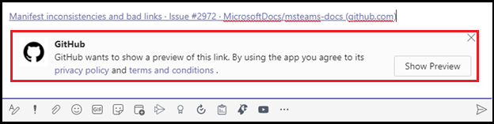

# Extensões de mensagensMessaging extensions

As extensões de mensagens permitem que os usuários interajam com seu serviço Web por meio de botões e formulários no cliente do Microsoft Teams.Messaging extensions allow the users to interact with your web service through buttons and forms in the Microsoft Teams client. Eles podem pesquisar ou iniciar ações em um sistema externo a partir da área de mensagem de composição, da caixa de comando ou diretamente de uma mensagem.They can search or initiate actions in an external system from the compose message area, the command box, or directly from a message. Você pode enviar de volta os resultados dessa interação para o cliente do Microsoft Teams na forma de um cartão ricamente formatado.You can send back the results of that interaction to the Microsoft Teams client in the form of a richly formatted card. Este documento fornece uma visão geral da extensão de mensagens, tarefas executadas em diferentes cenários, trabalho de extensão de mensagens, comandos de ação e pesquisa e desfraldamento de link.This document gives an overview of the messaging extension, tasks performed under different scenarios, working of messaging extension, action and search commands, and link unfurling.

A imagem a seguir exibe os locais de onde as extensões de mensagens são invocadas:The following image displays the locations from where messaging extensions are invoked:

## Cenários em que extensões de mensagens são usadasScenarios where messaging extensions are used

| CenárioScenario | ExemploExample |
|:-----------------|:-----------------|
|Você deseja que algum sistema externo faça uma ação e o resultado da ação seja enviado de volta para sua conversa.You want some external system to do an action  and the result of the action to be sent back to your conversation.|Reserve um recurso e permita que o canal saiba o intervalo de tempo reservado.Reserve a resource and allow the channel to know the reserved time slot.|
|Você deseja encontrar algo em um sistema externo e compartilhar os resultados com a conversa.You want to find something in an external system, and share the results with the conversation.|Pesquise um item de trabalho no Azure DevOps e compartilhe-o com o grupo como um Cartão Adaptável.Search for a work item in Azure DevOps, and share it with the group as an Adaptive Card.|
|Você deseja concluir uma tarefa complexa envolvendo várias etapas ou muitas informações em um sistema externo e compartilhar os resultados com uma conversa.You want to complete a complex task involving multiple steps or lots of information in an external system, and share the results with a conversation.|Crie um bug em seu sistema de controle com base em uma mensagem do Teams, atribua esse bug a Bob e envie um cartão para o thread de conversa com os detalhes do bug.Create a bug in your tracking system based on a Teams message, assign that bug to Bob, and send a card to the conversation thread with the bug's details.|

## Entender como funcionam as extensões de mensagensUnderstand how messaging extensions work

Uma extensão de mensagens consiste em um serviço Web que você hospeda e um manifesto de aplicativo, que define de onde seu serviço Web é invocado no cliente do Microsoft Teams.A messaging extension consists of a web service that you host and an app manifest, which defines where your web service is invoked from in the Microsoft Teams client. O serviço Web aproveita o esquema de mensagens da Estrutura de Bot e o protocolo de comunicação segura, portanto, você deve registrar seu serviço Web como um bot na Estrutura de Bots.The web service takes advantage of the Bot Framework's messaging schema and secure communication protocol, so you must register your web service as a bot in the Bot Framework. 

> [!NOTE]
> Embora você possa criar o serviço Web manualmente, use [o SDK da Estrutura de Bots](https://github.com/microsoft/botframework) para trabalhar com o protocolo.Though you can create the web service manually, use [Bot Framework SDK](https://github.com/microsoft/botframework) to work with the protocol.

No manifesto do aplicativo do Microsoft Teams, uma única extensão de mensagens é definida com até dez comandos diferentes.In the app manifest for Microsoft Teams app, a single messaging extension is defined with up to ten different commands. Cada comando define um tipo, como ação ou pesquisa e os locais no cliente de onde ele é invocado.Each command defines a type, such as action or search and the locations in the client from where it is invoked. Os locais de invocação são área de composição de mensagem, barra de comandos e mensagem.The invoke locations are compose message area, command bar, and message. Ao chamar, o serviço Web recebe uma mensagem HTTPS com uma carga JSON, incluindo todas as informações relevantes.On invoke, the web service receives an HTTPS message with a JSON payload including all the relevant information. Responda com uma carga JSON, permitindo que o cliente do Teams saiba a próxima interação a ser habilitada.Respond with a JSON payload, allowing the Teams client to know the next interaction to enable. 

## Tipos de comandos de extensão de mensagensTypes of messaging extension commands

Há dois tipos de comandos de extensão de mensagens, comando de ação e comando de pesquisa.There are two types of messaging extension commands, action command and search command. O tipo de comando de extensão de mensagens define os elementos da interface do usuário e os fluxos de interação disponíveis para seu serviço Web.The messaging extension command type defines the UI elements and interaction flows available to your web service. Algumas interações, como autenticação e configuração, estão disponíveis para ambos os tipos de comandos.Some interactions, such as authentication and configuration are available for both types of commands.

### Comandos de açãoAction commands

Comandos de ação são usados para apresentar aos usuários um pop-up modal para coletar ou exibir informações.Action commands are used to present the users with a modal popup to collect or display information. Quando o usuário envia o formulário, o serviço Web responde inserindo uma mensagem diretamente na conversa ou inserindo uma mensagem na área de mensagem de redação.When the user submits the form, your web service responds by inserting a message into the conversation directly or by inserting a message into the compose message area. Depois disso, o usuário pode enviar a mensagem.After that the user can submit the message. Você pode encadeá-los para fluxos de trabalho mais complexos.You can chain multiple forms together for more complex workflows.

Os comandos de ação são disparados da área de mensagem de composição, da caixa de comando ou de uma mensagem.The action commands are triggered from the compose message area, the command box, or from a message. Quando o comando é invocado de uma mensagem, a carga JSON inicial enviada para o bot inclui a mensagem inteira de que ele foi invocado.When the command is invoked from a message, the initial JSON payload sent to your bot includes the entire message it was invoked from. A imagem a seguir exibe o módulo de tarefa de comando de ação de extensão de mensagens: módulo de tarefa de ação de The following image displays the messaging extension action command task module: 

### Comandos de pesquisaSearch commands

Os comandos de pesquisa permitem que os usuários pesquisem informações em um sistema externo manualmente por meio de uma caixa de pesquisa ou colar um link a um domínio monitorado na área de mensagem de composição e inserir os resultados da pesquisa em uma mensagem.Search commands allow the users to search an external system for information either manually through a search box, or by pasting a link to a monitored domain into the compose message area, and insert the results of the search into a message. No fluxo de comando de pesquisa mais básico, a mensagem de invocação inicial inclui a cadeia de caracteres de pesquisa que o usuário enviou.In the most basic search command flow, the initial invoke message includes the search string that the user submitted. Você responde com uma lista de visualizações de cartões e cartões.You respond with a list of cards and card previews. O cliente do Teams renderiza uma lista de visualizações de cartão para o usuário.The Teams client renders a list of card previews for the user. Quando o usuário seleciona um cartão na lista, o cartão de tamanho completo é inserido na área de mensagem de composição.When the user selects a card from the list, the full-size card is inserted into the compose message area.

Os cartões são disparados da área de mensagem de redação ou da caixa de comando e não disparados de uma mensagem.The cards are triggered from the compose message area or the command box and not triggered from a message. Eles não podem ser disparados de uma mensagem.They can not be triggered from a message.
A imagem a seguir exibe o módulo de tarefa de comando de pesquisa de extensão de mensagens:The following image displays the messaging extension search command task module:

> [!NOTE]
> Para obter mais informações sobre cartões, consulte [o que são cartões](../task-modules-and-cards/what-are-cards.md).For more information on cards, see [what are cards](../task-modules-and-cards/what-are-cards.md).

## Desenrolamento de linkLink unfurling

Um serviço Web é chamado quando uma URL é colar na área de mensagem de redação.A web service is invoked when a URL is pasted in the compose message area. Essa funcionalidade é conhecida como desarmamento de link.This functionality is known as link unfurling. Você pode se inscrever para receber uma invocação quando URLs que contêm um determinado domínio são colar na área de mensagem de redação.You can subscribe to receive an invoke when URLs containing a particular domain are pasted into the compose message area. Seu serviço Web pode "desafraldar" a URL em um cartão detalhado, fornecendo mais informações do que o cartão de visualização do site padrão.Your web service can "unfurl" the URL into a detailed card, providing more information than the standard website preview card. Você pode adicionar botões para permitir que os usuários tomem medidas imediatamente sem sair do cliente do Microsoft Teams.You can add buttons to allow the users to immediately take action without leaving the Microsoft Teams client.
As imagens a seguir exibem o recurso de desfralização de link quando um link é passado na extensão de mensagens:The following images display link unfurling feature when a link is pasted in messaging extension:
 

## Exemplo de códigoCode sample

| **Exemplo de nome****Sample name** | **Descrição****Description** | **.NET****.NET** | **Node.js****Node.js** | **Python****Python** |
|------------|-------------|----------------|------------|
| Extensão de mensagens com comandos baseados em açãoMessaging extension with action-based commands | Este exemplo ilustra como criar uma extensão de mensagens baseada em ação.This sample illustrates how to build an action-based messaging extension. | [ViewView](https://github.com/microsoft/BotBuilder-Samples/tree/master/samples/csharp_dotnetcore/51.teams-messaging-extensions-action) | [ViewView](https://github.com/microsoft/BotBuilder-Samples/tree/master/samples/javascript_nodejs/51.teams-messaging-extensions-action) | [ViewView](https://github.com/microsoft/BotBuilder-Samples/tree/main/samples/python/51.teams-messaging-extensions-action) |
| Extensão de mensagens com comandos baseados em pesquisaMessaging extension with search-based commands | Este exemplo ilustra como criar uma Extensão de Mensagens baseada em Pesquisa.This sample illustrates how to build a Search-based Messaging Extension. | [ViewView](https://github.com/microsoft/BotBuilder-Samples/tree/master/samples/csharp_dotnetcore/50.teams-messaging-extensions-search) | [ViewView](https://github.com/microsoft/BotBuilder-Samples/tree/master/samples/javascript_nodejs/50.teams-messaging-extensions-search) | [ViewView](https://github.com/microsoft/BotBuilder-Samples/tree/main/samples/python/50.teams-messaging-extension-search) |

## Confira tambémSee also

> [!div class="nextstepaction"]
> [Criar uma extensão de mensagensCreate a messaging extension](../build-your-first-app/build-messaging-extension.md)

## Próxima etapaNext step

> [!div class="nextstepaction"]
> [Definir comando de extensão de mensagens de açãoDefine action messaging extension command](~/messaging-extensions/how-to/action-commands/define-action-command.md)

> [!div class="nextstepaction"]
> [Definir o comando de extensão de mensagens de pesquisaDefine search messaging extension command](~/messaging-extensions/how-to/search-commands/define-search-command.md)
