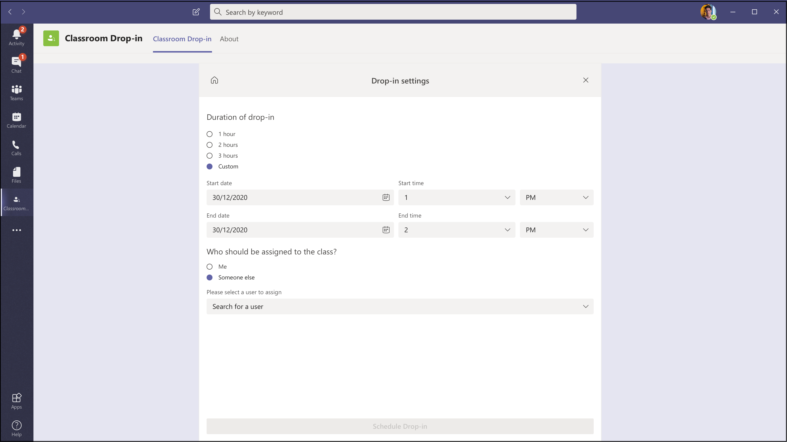
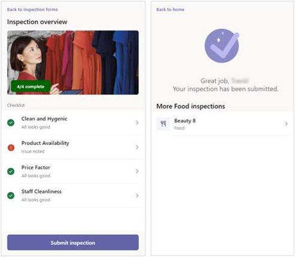
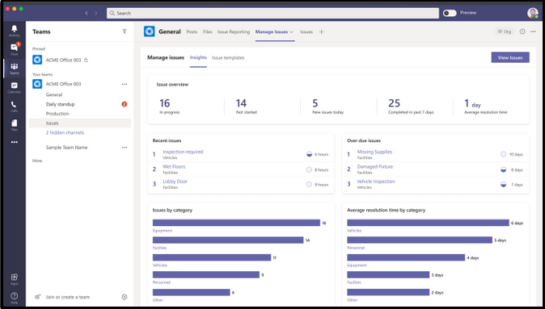

# Modelos de aplicativo para o Microsoft Teams

Modelos de aplicativo são exemplos de aplicativos completos para o Microsoft Teams que são de código aberto e estão disponíveis no GitHub. Cada modelo de aplicativo contém instruções detalhadas para implantar e instalar esse aplicativo para sua organização. Ele também fornece um aplicativo de exemplo que você pode instalar e começar a usar imediatamente. O código-fonte completo também está disponível, o que permite que você o explore em detalhes ou bifurcar o código e alterá-lo para atender aos seus requisitos específicos.
Todos os modelos de aplicativo são fornecidos de acordo com os termos de [licença do MIT.](https://github.com/OfficeDev/microsoft-teams-apps-eprescription/blob/master/LICENSE)
>[!NOTE] 
>Você, e não a Microsoft, deve licenciar e dar suporte a aplicativos criados a partir de modelos de aplicativo para seus usuários e organizações.

**&#9734; indica modelos de aplicativo lançados recentemente.**

### Principais benefícios

* **Implante diretamente na nuvem:** Todos os modelos de aplicativo incluem scripts de implantação que permitem hospedar todos os serviços necessários no Microsoft Azure ou na Plataforma Power. 
* **Código de exemplo recomendado:** Os modelos de aplicativo estão em conformidade com as práticas recomendadas de segurança e infraestrutura. Todas as alterações enviadas pela comunidade aos modelos de aplicativos são revisadas para garantir a conformidade.
* **Personalizável e extensível:** Embora todos os modelos de aplicativo possam ser implantados com configuração mínima, fornecemos toda a base de código e scripts de implantação para que você possa personalizá-los ou estendí-los facilmente para que se ajustem às suas necessidades exclusivas.
* **Documentação detalhada:** Todos os modelos de aplicativo são acompanhados pela documentação de ponta a ponta sobre as etapas de arquitetura, implantação e configuração da solução.  

## Adoção de bots &#9734;

Bot de adoção é um bot de chat com cuidado do usuário criado com o Power Virtual Agent para Teams (PVA). Ele pode ser considerado como a versão PVA do FAQPlus. O Bot de Adoção responde mais de 100 perguntas comuns sobre o Microsoft 365 e o Teams. Você pode editar os tópicos incluídos, adicionar seus próprios tópicos e ingerir perguntas frequentes existentes. Se os usuários precisam de ajuda adicional, o Bot de Adoção pode conectá-los a especialistas ou até mesmo ser estendido para abrir tíquetes de serviço com conectores de fluxo premium.

[Obter no GitHub](https://github.com/OfficeDev/microsoft-teams-apps-adopt-bot)

## Gerenciador de compromissos &#9734;

O Gerenciador de Compromissos é um modelo de aplicativo do Teams para ajudar as empresas a criar, gerenciar e conduzir compromissos virtuais com os consumidores por meio do Teams. As novas solicitações de compromissos dos consumidores são visíveis nos canais do Teams, onde eles podem ser atribuídos e reatribuídos rapidamente aos funcionários de uma equipe. As solicitações de compromisso podem ser visualizadas em níveis de equipe ou pessoal por meio de guias personalizadas. Cada compromisso é associado a uma reunião online do Teams, por isso, os funcionários e os consumidores podem facilmente ingressar na reunião no horário agendado.

O modelo de aplicativo se integra ao Microsoft Bookings para facilitar o gerenciamento de compromissos. Os compromissos agendados aparecem automaticamente nos calendários dos membros da equipe atribuídos, e os consumidores recebem notificações por email e lembretes personalizáveis com links de reunião incorporados.

[Obter no GitHub](https://github.com/OfficeDev/microsoft-teams-apps-appointment-manager)

 

## Pergunte-se

Ask Away é um [bot do Microsoft Teams](../bots/what-are-bots.md) que permite que os usuários conduzam sessões de perguntas&A (pergunta e resposta) no Teams. Usando o bot Pergunte-se, os membros da equipe podem enviar e votações compartilhadas por colegas, permitindo que os hosts de P&e R reúnam facilmente perguntas mais importantes em um canal ou chat. O bot pode ser usado para conduzir uma sessão de perguntas e&A em tempo real em uma reunião do Teams e permite que os participantes enviem perguntas ao vivo por meio de chat.

[Obter no GitHub](https://github.com/OfficeDev/microsoft-teams-apps-askaway)

:::row:::
  :::column span="2":::
      
:::column-end:::
:::row-end:::

## Informações associadas

O Associate Insights é um [modelo do Power Apps](/powerapps/maker/canvas-apps/embed-teams-app) que capacita os trabalhadores da linha de frente a capturar e enviar diretamente opiniões, opiniões e percepção dos clientes. Os trabalhadores da linha de frente geralmente são os primeiros representantes da empresa a se envolver com clientes em um ponto de contato um-para-um. Os dados coletados podem ser compartilhados e usados de forma colaborativa por equipes de negócios, por exemplo, por meio de uma guia do Power BI Teams, para melhorar o produto e aprimorar a experiência do cliente.

[Obter no GitHub](https://github.com/OfficeDev/microsoft-teams-apps-associateinsights)

:::row:::
  :::column span="2":::
      
:::column-end:::
:::row-end:::
:::row:::
:::column span="2":::
    
:::column-end:::
:::row-end:::

## Participação

O aplicativo Presença é uma [guia do Power Apps](/powerapps/maker/canvas-apps/embed-teams-app) que pode ser fixada em uma equipe. Ele foi projetado para registrar a presença, normalmente em configurações como ambientes de aprendizagem e treinamento. Os usuários podem marcar ou editar a participação por até 30 dias no passado e exibir relatórios resumidos de presença para um grupo inteiro ou participantes individuais.

[Obter no GitHub](https://github.com/OfficeDev/microsoft-teams-apps-attendance)

## Book-a-room

Book-a-room é um bot do [Microsoft Teams](../bots/what-are-bots.md) que permite aos usuários encontrar e reservar rapidamente uma sala de reunião por 30 (padrão), 60 ou 90 minutos a partir da hora atual. Os escopos de bot de sala de livro para conversas pessoais ou 1:1.

[Obter no GitHub](https://github.com/OfficeDev/microsoft-teams-apps-bookaroom)

## Acesso à construção

O Building Access é um aplicativo baseado no Microsoft [Power Platform](https://powerapps.microsoft.com/blog/now-in-preview-customize-teams-with-built-in-power-platform-capabilities/)que oferece suporte à administração da criação de limites de acumulação e de padrões de distanciamento social, permitindo que os diretores de instalações gerenciem, rastreiem e reportem a presença de funcionários no local. O aplicativo, criado usando o Microsoft [Power Apps](/powerapps/powerapps-overview)e o [Power Automate,](/power-automate/getting-started)integra-se profundamente ao Microsoft Teams e permite que as organizações determinem a preparação da construção, estabeleçam critérios de qualificação para o acesso local e reúnam ideias para planejamento futuro.

[Obter no GitHub](https://github.com/OfficeDev/microsoft-teams-apps-buildingaccess)

:::row:::
   :::column span="":::
     
   :::column-end:::
   :::column span="":::
      
   :::column-end:::
:::row-end:::

## Celebrações

Celebrações é um aplicativo do Teams que ajuda os membros da equipe a celebrar aniversários, datas de aniversário e outros eventos recorrentes entre si. Ele lembra ocasiões especiais de todos os membros da equipe e envia uma mensagem amigável em todas as equipes selecionadas no momento da criação do evento, para fazer com que os membros da equipe se sintam especiais em seus dias.

O aplicativo fornece uma interface fácil para todos os membros da equipe adicionarem e exibirem seus eventos pessoalmente e também permitem que o usuário selecione as equipes nas quais os eventos são compartilhados.

[Obter no GitHub](https://github.com/OfficeDev/microsoft-teams-celebrations-app)

## Lista de verificação

A lista de verificação é um aplicativo de extensão de mensagens personalizado do Microsoft [Teams](../messaging-extensions/what-are-messaging-extensions.md) que permite que você colabore com sua equipe criando uma lista de verificação compartilhada em um chat ou canal. O aplicativo tem suporte em todos os clientes da plataforma Teams — desktop, navegador, iOS e Android — e está pronto para implantação como parte da sua assinatura do Microsoft 365.  

[Obter no GitHub](https://github.com/OfficeDev/microsoft-teams-checklist-app )

:::row:::
:::column span="2":::
      
:::column-end:::
:::row-end:::

## Drop-in classroom &#9734;

O Drop-in de Sala de Aula é um aplicativo baseado no Microsoft [Power Platform](https://powerapps.microsoft.com/blog/now-in-preview-customize-teams-with-built-in-power-platform-capabilities/)que permite que os líderes do sistema encontrem equipes de classe (salas de aula virtuais) e adicionem a si mesmos ou outras pessoas a essas equipes de classe por um período de lista de participantes especificado, conforme necessário. O aplicativo criado usando o Microsoft [Power Apps](/powerapps/powerapps-overview) e o [Power Automate](/power-automate/getting-started)se integra profundamente ao Microsoft Teams para garantir que as instituições educacionais possam otimizar suas operações em um ambiente de aprendizado híbrido, fornecendo acesso a participantes relevantes para equipes de classe de acordo com os requisitos de negócios.

[Obter no GitHub](https://github.com/OfficeDev/microsoft-teams-apps-classroom-dropin)

## Communicator da empresa

O aplicativo Communicator da Empresa permite que as equipes corporativas criem e enviem mensagens destinadas a várias equipes ou a um grande número de funcionários por chat, permitindo que a organização alcance os funcionários exatamente onde eles colaboram. Utilize esse modelo para vários cenários, como novos anúncios de iniciativa, integração de funcionários, aprendizado e desenvolvimento modernos ou transmissões em toda a organização.

O aplicativo fornece uma interface fácil para os usuários designados criarem, visualizarem, colaborarem e enviarem mensagens.

Ele fornece uma base para criar recursos personalizados de comunicação direcionada, como telemetria personalizada, sobre quantos usuários reconheceram ou interagiram com uma mensagem.

[Obter no GitHub](https://github.com/OfficeDev/microsoft-teams-company-communicator-app)

## Contact Group Lookup

O aplicativo Pesquisa de Grupo de Contatos fornece uma abordagem conveniente e útil para criar, acessar e gerenciar grupos de contatos da sua organização (anteriormente conhecidos como listas de distribuição ou grupos de comunicação). Os usuários podem exibir e conversar rapidamente com membros do grupo, exibir o status do membro e criar um chat em grupo com os membros selecionados no grupo de contatos, tudo no ambiente do Teams.

[Obter no GitHub](https://github.com/OfficeDev/microsoft-teams-app-contactgrouplookup)

:::row:::
:::column span="2":::
      
:::column-end:::
:::row-end:::
:::row:::
:::column span="2":::
    
:::column-end:::
:::row-end:::

## Co-worker Worker &#9734;

Usando o modelo de reconhecimento de colegas de trabalho no Microsoft Teams, os usuários podem reconhecer as conquistas de seus colegas dentro do contexto do Teams. Quando colegas de trabalho selecionam recompensar um colega, os destinatários e outros membros da equipe são marcados em uma conversa de canal e recebem uma notificação sobre os detalhes de prêmio do canal. Os prêmio são gravados no aplicativo teams, que é seguro, portátil e facilmente compartilhável. Isso pode ser considerado como a versão baseada no PowerApps do modelo de aplicativo Open Badges, com um placar de líderes.

[Obter no GitHub](https://github.com/OfficeDev/microsoft-teams-apps-coworker-appreciation)

## CrowdSourcer

CrowdSourcer é um [bot do Microsoft Teams](../bots/what-are-bots.md) que fornece informações consultadas de forma colaborativa dos membros do grupo. É uma ótima maneira de responder a perguntas frequentes, permitindo que os participantes se envolvam ativamente e contribuam com um recurso de informações divertido e útil.

[Obter no Github](https://github.com/OfficeDev/microsoft-teams-crowdsourcer-app)

## Adesivos personalizados

A auto-expressão é fundamental para uma cultura de equipe saudável. Esse modelo de aplicativo é uma [extensão de mensagens](~/messaging-extensions/what-are-messaging-extensions.md) que permite que os usuários usem figurinhas personalizadas e GIFs no Microsoft Teams. Esse modelo fornece uma experiência de configuração fácil baseada na Web em que qualquer pessoa com acesso à configuração pode carregar GIFs/figurinhas/imagens que eles querem que seus usuários finais tenham, permitindo que toda a sua equipe use qualquer conjunto de figurinhas que você escolher.

Esse aplicativo também permite o compartilhamento fácil de imagens/GIFs/figurinhas entre equipes sem precisar acessar sites do SharePoint ou canais individuais como mecanismos de armazenamento e compartilhamento. Por exemplo, as equipes de produto podem compartilhar facilmente imagens de produtos e GIFs para redes sociais, equipes de marketing e vendas programaticamente. Também é possível estender esse aplicativo acionando um fluxo de notificação para equipes/indivíduos específicos quando novas imagens/GIFs são disponibilizadas.

[Obter no GitHub](https://github.com/OfficeDev/microsoft-teams-stickers-app)

## Ideias de funcionários &#9734;

O aplicativo Ideias de Funcionários é a versão do PowerApps do modelo de aplicativo Great Ideas baseado no Azure. O aplicativo permite que os usuários do Teams configurem e configurem uma campanha de ideias. Uma campanha de ideias é uma categoria para agrupar ideias em torno de temas comuns.

Os usuários do Teams também podem realizar as seguintes atividades:
* Configure um formulário de envio padrão que os funcionários precisem enviar para cada ideia. 
* Revise e gerencie as ideias e a lista de campanhas.
* Modificar e excluir campanhas.
* Revise os placares de líderes de ideias.
* Vote e compartilhe ideias priorizadas.
* Envie ideias para uma campanha.
* Exibir a ideia de outro membro da equipe.
* Vote na maioria das ideias curtidas.
* Revise o desempenho de suas ideias em comparação com outras pessoas em uma campanha.

[Obter no GitHub](https://github.com/OfficeDev/microsoft-teams-apps-employeeideas)

 

## Prescrições E 

Prescrições E é um aplicativo baseado em [Power Apps](/powerapps/maker/canvas-apps/embed-teams-app)que melhora a telemedicina e os cuidados virtuais automatizando o processo de emissão de prescrições para pacientes. Os profissionais médicos podem revisar rapidamente os compromissos, gerar prescrições e enviar emails com anexos de prescrição de e-mail aos pacientes diretamente na plataforma do Teams.

[Obter no GitHub](https://github.com/OfficeDev/microsoft-teams-apps-eprescription) 

:::row:::
:::column span="2":::
      
:::column-end:::
:::row-end:::
:::row:::
:::column span="2":::
    
:::column-end:::
:::row-end:::

## Treinamento de funcionários 

O treinamento de funcionários é um aplicativo do Microsoft Teams que permite que os organizadores publiquem, acompanhem e promovam facilmente eventos de aprendizagem e treinamento para sua organização.  Com o aplicativo, os planejadores de eventos podem enviar lembretes e notificações a registrants de eventos e os funcionários podem indicar interesse em eventos futuros, manter-se atualizado sobre eventos atuais e compartilhar detalhes do evento com colegas por meio da extensão de mensagens do Teams.

[Obter no GitHub](https://github.com/OfficeDev/microsoft-teams-apps-employeetraining)

:::row:::
:::column span="2":::
    **Exibir eventos de treinamento de funcionários**   
:::column-end:::
:::row-end:::
:::row:::
:::column span="2":::
    **Criar evento de treinamento de funcionários** 
:::column-end:::
:::row-end:::

## Expert Finder

O Expert Finder é um [bot do Microsoft Teams](../bots/what-are-bots.md) que identifica membros específicos da organização com base em suas habilidades, interesses e atributos de educação. Os membros encontram especialistas em uma organização que corresponderem a uma pesquisa de palavra-chave de perfis de usuário do Azure Active Directory.

[Obter no GitHub](https://github.com/OfficeDev/microsoft-teams-apps-expertfinder)

## Perguntas Frequentes Plus

Os bots de P e&conversa são uma maneira fácil de fornecer respostas a perguntas frequentes dos usuários. No entanto, a maioria dos bots falha ao interagir com os usuários de maneira significativa porque não há humanos no loop quando o bot falha. O bot de perguntas frequentes é&um bot que traz uma pessoa ao loop quando não consegue ajudar. É possível fazer uma pergunta ao bot e o bot responderá com uma resposta se ele estiver contido na base de dados de conhecimento. Caso não seja, o bot permite que o usuário envie uma consulta que, em seguida, é postada para uma equipe pré-configurada de especialistas que ajudam a fornecer suporte agindo sobre as notificações de dentro da própria equipe.

> [!NOTE]
> A versão mais recente do **FaQ Plus** oferece suporte a resoluções de perguntas e&A aprimoradas, permitindo que uma equipe de especialistas conclua o seguinte:
>
> &#x2714; adicionar novas perguntas&Como diretamente à base de dados de conhecimento usando extensões de mensagem.
>
> &#x2714; Editar e excluir pares de&A adicionados por um bot.
>
> &#x2714; Controlar o histórico de revisão de P&As.
>
> &#x2714; configurar uma resposta com detalhes adicionais para exibir como um [cartão adaptável.](../task-modules-and-cards/cards/cards-reference.md#adaptive-card)
>
[Obter no GitHub](https://github.com/OfficeDev/microsoft-teams-apps-faqplusv2)

## Obter suporte do aplicativo &#9734;

O aplicativo Obter Suporte pode ser usado por organizações que estão usando o Microsoft Teams para permitir que qualquer conjunto de usuários solicite assistência de supervisores. Esse aplicativo inclui vários recursos, como:
-   Solicitar assistência em diferentes categorias de um Power App
-   Notificações enviadas aos solicitadores informando quem foi atribuído 
-   Notificações enviadas a supervisores atribuídos informando quem precisa de assistência 
-   Analisando escalonamentos e padrões no SharePoint e no PowerBI

[Obter no GitHub](https://github.com/OfficeDev/microsoft-teams-app-get-support/)

## Goal Tracker

O aplicativo Goal Tracker é uma solução abrangente para sua organização dar suporte ao estabelecimento de metas, observar o progresso e confirmar o sucesso no Microsoft Teams. O aplicativo permite aos usuários definir, acompanhar e atualizar objetivos em nível profissional, pessoal e de equipe. Os membros da equipe também recebem lembretes e atualizações de status o mais rápido possível para permanecerem focados e se manterem no controle.

[Obter no GitHub](https://github.com/OfficeDev/microsoft-teams-app-goaltracker)

:::row:::
  :::column span="2":::
      
:::column-end:::
:::row-end:::
:::row:::
:::column span="2":::
    
:::column-end:::
:::row-end:::

## Ótimas ideias

O aplicativo Great Ideas dá suporte e capacita a inovação e a criatividade em sua organização. O aplicativo permite que seus funcionários compartilhem ideias com colegas e lideranças, descubram novos envios, destaquem as contribuições para consideração do par e votem pelas melhores propostas no Microsoft Teams.

[Obter no GitHub](https://github.com/OfficeDev/microsoft-teams-apps-greatideas)

:::row:::
  :::column span="2":::
      
:::column-end:::
:::row-end:::
:::row:::
:::column span="2":::
    
:::column-end:::
:::row-end:::

## Atividades de grupo

Atividades de grupo é um aplicativo do Microsoft Teams que torna mais fácil para os proprietários de equipe criar rapidamente grupos de atividades e gerenciar fluxos de trabalho de colaboração dentro do contexto do Microsoft Teams. Os autores de atividades são habilitados para criar atividades, distribuir aleatoriamente membros da equipe em grupos e, opcionalmente, fazer com que o bot envie lembretes até que as atividades sejam concluídas.

[Obter no GitHub](https://github.com/OfficeDev/microsoft-teams-apps-groupactivities)

:::row:::
  :::column span="2":::
      
:::column-end:::
:::row-end:::
:::row:::
:::column span="2":::
    
:::column-end:::
:::row-end:::

## Aumentar suas habilidades

O aplicativo Crescer suas Habilidades dá suporte ao crescimento e desenvolvimento profissional, permitindo que os funcionários contribuam com projetos suplementares para sua organização enquanto aprendem simultaneamente novas habilidades. Os funcionários podem usar o aplicativo para localizar oportunidades que atendem aos seus interesses, aproveitar uma colaboração significativa com colegas e adquirir novos níveis de experiência e recursos, tudo no ambiente do Teams.

[Obter no GitHub](https://github.com/OfficeDev/microsoft-teams-apps-growyourskills)

:::row:::
  :::column span="2":::
      
:::column-end:::
:::row-end:::
:::row:::
:::column span="2":::
    
:::column-end:::
:::row-end:::

## Suporte de RH

O bot de Suporte de RH é um bot de perguntas e&um bot que traz um profissional de suporte/especialista da equipe de RH no loop quando não consegue ajudar. É possível fazer uma pergunta ao bot e o bot responderá com uma resposta se ele estiver contido na base de dados de conhecimento. Caso não seja, o bot permite que o usuário envie uma consulta que, em seguida, é postada em uma equipe pré-configurada de especialistas que ajudam a fornecer suporte agindo sobre as notificações de dentro da própria equipe. Além disso, o bot sugere links para políticas/perguntas de RH recomendadas pesquisando por marcas pré-configuradas na pergunta. Esses blocos também podem ser encontrados na guia associada como uma referência rápida. O Suporte de RH funciona bem para QnA leve e para fornecer suporte rápido ao iniciar novos projetos/iniciativas na organização.

[Obter no GitHub](https://github.com/OfficeDev/microsoft-teams-hrsupport-app)

## Frases de apresentação

O Icebreaker é um [bot do Microsoft Teams](../bots/what-are-bots.md) que ajuda sua equipe a se aproximar emparelhando dois membros aleatórios da equipe a cada semana para se reunirem. O bot facilita o agendamento sugerindo automaticamente horários gratuitos que funcionam para ambos os membros. Fortalece as conexões pessoais e crie uma comunidade fortemente rígida com esse aplicativo.

Além de incentivar conexões pessoais em toda a sua equipe, o aplicativo Icebreaker pode ajudar a promover comunidades baseadas em interesse em sua organização. Por exemplo, você pode usar esse aplicativo para um grupo de interesse de DevOps para ajudar ideias e práticas recomendadas propagadas organicamente em toda a organização.

[Obter no GitHub](https://github.com/OfficeDev/microsoft-teams-icebreaker-app)

## Incentivos

Incentivos é um modelo [do Power Apps](/powerapps/maker/canvas-apps/embed-teams-app) que gerencia e acompanha a participação incentivada dos funcionários em atividades designadas, como treinamentos e iniciativas de gerenciamento de mudanças. Os administradores usam o aplicativo para estabelecer atividades designadas, atribuir pontos para conclusão e especificar níveis de ponto de qualificação necessários para recompensas. Os funcionários usam o aplicativo para exibir seus pontos acumulados e, ao atingirem a qualificação, solicitar e reivindicar recompensas resgatáveis.

[Obter no GitHub](https://github.com/OfficeDev/microsoft-teams-apps-incentives)

## Incident Reporter

O Incident Reporter é um [bot do Microsoft Teams](../bots/what-are-bots.md)  que otimiza o gerenciamento de incidentes em sua organização. O bot facilita a coleta automatizada de dados de incidentes, relatórios de incidentes personalizados, notificações relevantes de participantes e rastreamento de incidentes de ponta a ponta.

[Obter no GitHub](https://github.com/OfficeDev/microsoft-teams-apps-incidentreport)

:::row:::
  :::column span="2":::
      
:::column-end:::
:::row-end:::
:::row:::
:::column span="2":::
    
:::column-end:::
:::row-end:::

## Inspeção &#9734;

 A inspeção é um aplicativo do Microsoft Teams que permite que os funcionários de linha de frente inspecionem tudo, desde locais até ativos e equipamentos. Por exemplo, uma loja de varejo, fábrica de manufatura ou veículos e máquinas. Há dois aplicativos nesta solução, cada um destinado a tipos diferentes de usuários.

O aplicativo permite que os funcionários de linha de frente inspecionem um ativo ou área, gerenciem a qualidade de produtos e serviços ou mantenham a segurança no local de trabalho. Ela facilita a comunicação entre os membros da equipe para resolver problemas encontrados durante a inspeção. O aplicativo fornece relatórios simples para que os gerentes agilizarem a resolução de problemas e realçam as tendências.

[Obter no GitHub](https://github.com/OfficeDev/microsoft-teams-apps-inspection)

   

## Relatório de problemas &#9734;

O aplicativo Relatório de Problemas capacita os funcionários e gerentes a criar e gerenciar problemas. Ele consiste em dois aplicativos, o aplicativo Emitir relatórios para relatar problemas e o aplicativo Gerenciar Problemas para gerenciar problemas.

Os gerentes de equipe usam o aplicativo Gerenciar Problemas para configurar a experiência do aplicativo, incluindo o canal no qual as mensagens do Microsoft Teams e as tarefas do Planner são criadas pelo aplicativo. Os gerentes também usam o aplicativo para criar formulários de modelo para coletar detalhes quando um usuário relata um problema. Por exemplo, revise, edite ou exclua formulários de modelo de problema. O aplicativo também pode ser usado para revisar problemas da equipe, relatar o histórico de problemas e gerenciar com eficiência a resolução de problemas.

Os funcionários usam o aplicativo Relatório de Problemas para registrar problemas e detalhes necessários para resolvê-los. O aplicativo também é usado para modificar e resolver problemas existentes e obter uma visão de alto nível de problemas individuais ou de equipe.

[Obter no GitHub](https://github.com/OfficeDev/microsoft-teams-apps-issuereporting)

  

## Integração de novos funcionários 

A Integração de Novos Funcionários é uma Solução integrada de Integração de Novos Funcionários do Microsoft Teams e do [SharePoint](https://lookbook.microsoft.com/details/75e60a32-9849-4ed4-b83e-b2b08983ad19) que permite que sua organização forneça uma experiência de integração consistente e de alta qualidade para os funcionários em sua jornada de novos contratados. O aplicativo pode ser usado por equipes de recursos humanos e gerentes de contratação para fornecer informações relevantes durante todo o processo de orientação e avaliação e por novos contratados para compartilhar comentários, fornecer introduções e concluir tarefas de integração.

[Obter no GitHub](https://github.com/OfficeDev/microsoft-teams-apps-newemployeeonboarding)

:::row:::
  :::column span="2":::
    **Cartão de boas-vindas do novo funcionário** 
:::column-end:::
:::row-end:::
:::row:::
:::column span="2":::
    **Lista de verificação de novos funcionários**   
:::column-end:::
:::row-end:::

## Selos abertos

Selos Abertos é um aplicativo do Microsoft Teams que permite que as pessoas ganhem selos de credenciais de aprendizagem digital dentro do contexto do Teams e compartilhem-os em todos os lugares. Usando recursos da autoridade de emissão de selos digitais de terceiros, [Badgr](https://badgr.org/), selos concedidos são registrados no perfil Badgr de um destinatário e disponíveis para criar e compartilhar uma imagem rica de jornadas de aprendizagem do tempo de vida.

[Obter no GitHub](https://github.com/OfficeDev/microsoft-teams-apps-openbadges)

:::row:::
  :::column span="2":::
      
:::column-end:::
:::row-end:::
:::row:::
:::column span="2":::
    
:::column-end:::
:::row-end:::

## Sondagem 

O Poll é um aplicativo de extensão de mensagens personalizado do Microsoft [Teams](../messaging-extensions/what-are-messaging-extensions.md) que permite que você crie e envie votações rapidamente em um chat ou em um canal para coletar opiniões e preferências da equipe. O aplicativo tem suporte em todos os clientes da plataforma Teams — desktop, navegador, iOS e Android — e está pronto para implantação como parte da sua assinatura do Microsoft 365.

[Obter no GitHub](https://github.com/OfficeDev/microsoft-teams-poll-app)

:::row:::
  :::column span="1":::
      
:::column-end:::
:::row-end:::

## Respostas rápidas

Respostas Rápidas é um aplicativo do Microsoft Teams que oferece uma solução robusta para responder com eficiência às perguntas frequentes (perguntas frequentes) dos usuários. Em vez de responder cada consulta manualmente e continuamente repetindo informações, o aplicativo criará uma biblioteca de respostas para uma experiência interativa do usuário por meio de extensões de mensagens [do](../messaging-extensions/what-are-messaging-extensions.md)Teams.

[Obter no GitHub](https://github.com/OfficeDev/microsoft-teams-apps-quickresponses)

## Assistência Rápida &#9734;

A Assistência Rápida é um aplicativo baseado no Microsoft [Power Platform](https://powerapps.microsoft.com/blog/now-in-preview-customize-teams-with-built-in-power-platform-capabilities/) que permite que os associados voltados ao cliente se conectem rapidamente com os especialistas para obter respostas rápidas, pesquisar informações, acompanhar solicitações abertas e permitir que os especialistas recebam notificações para receber rapidamente uma chamada para ajudar a responder perguntas. O aplicativo criado usando o Microsoft [Power Apps](/powerapps/powerapps-overview) e o [Power Automate](/power-automate/getting-started)se integra profundamente ao Microsoft Teams para permitir que as organizações conectem facilmente funcionários de linha de frente com ligações corporativas para resolver consultas de clientes e proporcionar uma excelente experiência ao cliente. 

[Obter no GitHub](https://github.com/OfficeDev/microsoft-teams-apps-rapid-assist)

:::row:::
   :::column span="":::
     
   :::column-end:::
   :::column span="":::
      
   :::column-end:::
:::row-end:::

## Refletir 

O Reflect é um aplicativo de extensão de mensagens personalizado do Microsoft [Teams](../messaging-extensions/what-are-messaging-extensions.md) que fornece um recurso seguro e inclusivo para que os membros da equipe compartilhem o estado de bem-estar delas com colegas e/ou líderes de grupo diretamente no Teams. O aplicativo está disponível em chats de canal, grupo, reunião e 1:1, e a resposta de check-in pode ser definida como pública, privada para remetente ou totalmente anônima.

[Obter no GitHub](https://github.com/OfficeDev/Microsoft-Teams-App-Reflect)

:::row:::
    :::column:::
    **Sondagem de bem-estar**
    
    
    :::column-end:::
:::row-end:::

## Suporte remoto

O Suporte Remoto é um [bot do Microsoft Teams](../bots/what-are-bots.md) que fornece uma interface focada entre os solicitantes de suporte em toda a organização e a equipe de suporte interno.  Os usuários finais podem enviar, editar ou retirar solicitações de suporte, e a equipe de suporte pode responder, gerenciar e atualizar todas as solicitações dentro da plataforma do Teams.

[Obter no GitHub](https://github.com/OfficeDev/microsoft-teams-apps-remotesupport)

:::row:::
  :::column span="2":::
      
:::column-end:::
:::row-end:::
:::row:::
:::column span="2":::
    
:::column-end:::
:::row-end:::

## Request-a-team

Request-a-team é um aplicativo do Microsoft Teams que otimiza a criação de novas equipes para sua organização corporativa. O aplicativo oferece suporte à padronização e às práticas recomendadas ao criar novas instâncias de equipe por meio da integração de um formulário de solicitação orientado por assistente, um processo de aprovação incorporado, um painel de status de solicitação e builds automatizados da equipe.

[Obter no GitHub](https://github.com/OfficeDev/microsoft-teams-apps-requestateam)

:::row:::
  :::column span="2":::
    
:::column-end:::
:::row-end:::
:::row:::
:::column span="2":::
    
:::column-end:::
:::row-end:::

## Scrums para canais

O Scrums for Channels é um aplicativo assistente scrum que permite aos usuários agendar e executar o scrums em canais no Microsoft Teams. O aplicativo é ótimo para equipes remotas e equipes compostas por membros de localidades geográficas e fusos horário variados para compartilhar atualizações diárias e garantir a participação em reuniões de stand-up.

[Obter no GitHub](https://github.com/OfficeDev/microsoft-teams-apps-scrumsforchannels)

> [!NOTE]
> Para realizar reuniões scrum em um chat em grupo, confira nosso modelo de aplicativo [Scrums para Chat de](#scrums-for-group-chat) Grupo.

:::row:::
  :::column span="2":::
    
:::column-end:::
:::row-end:::
:::row:::
:::column span="2":::
    
:::column-end:::
:::row-end:::

## Scrums para Chat de Grupo

> [!NOTE]
> O modelo de aplicativo Status do Scrums foi atualizado e agora é o Scrums para Chat de Grupo.

O Scrums para Chat de Grupo é um assistente de suporte do Scrum que permite que os membros do chat de grupo executem reuniões de stand-up assíncronas e compartilhem facilmente suas atualizações diárias. Ele permite que todos os membros do chat de grupo contribuam para o scrum e veja as atualizações feitas por outras pessoas na execução do scrum.

[Obter no GitHub](https://github.com/OfficeDev/microsoft-teams-apps-scrumsforgroupchat)

## Compartilhar Agora 

O aplicativo Compartilhar Agora promove a troca positiva de informações entre colegas, permitindo que seus usuários compartilhem conteúdo facilmente no ambiente do Teams. Os usuários envolvem o aplicativo para compartilhar itens de interesse com membros da equipe, descobrir novo conteúdo compartilhado, definir preferências e marcar favoritos para leitura posterior.

[Obter no GitHub](https://github.com/OfficeDev/microsoft-teams-apps-sharenow)

## Pesquisa de lista do SharePoint

A colaboração no Microsoft Teams muitas vezes faz referência a informações contidas em itens em uma lista do SharePoint. Simplesmente colar um link para o item em questão força todos a alternar o contexto para longe da conversa, encontrar as informações necessárias e, em seguida, retornar ao Teams para continuar a conversa. À medida que a conversa continua, normalmente as pessoas terão que voltar para o item de referência várias vezes para verificar novos comentários e atualizar seus comentários sobre as informações contidas no item. Essa mudança de contexto cria uma barreira para suavizar a colaboração e é uma receita para coisas que estão passando por obstáculos.

Para ajudar a aliviar essa dor, estamos satisfeitos em trazer para você o modelo de aplicativo de Pesquisa de Lista. Milhões de usuários usam o SharePoint para a energia de alguns dos fluxos de trabalho principais em suas organizações. No entanto, colaborar em listas pode ser especialmente tedioso. Usando o modelo de aplicativo de Pesquisa de Lista no Microsoft Teams, os usuários podem inserir informações de itens de lista do SharePoint diretamente em uma conversa de chat para aliviar a alternância de contexto causada ao simplesmente inserir um link em um chat. As informações são inseridas como um cartão de formatação automática fácil de ler, ajudando os usuários a se manterem envolvidos na conversa.

[Obter no GitHub](https://github.com/OfficeDev/microsoft-teams-list-search-app)

## Check-ins de equipe

Os Check-ins de Equipe são um aplicativo baseado em [Power Apps](/powerapps/powerapps-overview)que permite a comunicação de supervisão entre sua empresa e a equipe de campo. Os funcionários podem fornecer informações e atualizações de status com tempo crítico facilmente em uma base agendada ou ad hoc diretamente do Teams. O aplicativo dá suporte a localização, fotos e anotações em tempo real, bem como notificações de lembrete e fluxos de trabalho automatizados.

[Obter no GitHub](https://github.com/OfficeDev/microsoft-teams-apps-staffcheckins)

## Pesquisa

A pesquisa é um aplicativo de extensão de mensagens personalizado do Microsoft [Teams](../messaging-extensions/what-are-messaging-extensions.md) que permite criar uma pesquisa em um chat ou em um canal para coletar dados e obter informações ativas.  O aplicativo tem suporte em todos os clientes da plataforma Teams — desktop, navegador, iOS e Android — e está pronto para implantação como parte da sua assinatura do Microsoft 365.  

[Obter no GitHub](https://github.com/OfficeDev/Microsoft-Teams-Survey-app)

:::row:::
  :::column span="2":::
    
:::column-end:::
:::row-end:::

## Arredondamento virtual &#9734;

Os provedores de sala de emergência e hospital fazem dezenas e, muitas vezes, centenas de "rodadas" por dia. Esses check-ins rápidos em pacientes destinam-se a fornecer uma verificação de status sobre como o paciente está se saindo e garantir que as preocupações do paciente sejam tratadas. Embora o arredondamento seja uma prática essencial para garantir que os pacientes sejam monitorados por vários tipos de provedores, eles representam um enorme esvaziamento no PPE, porque para cada visita, de cada provedor, uma nova máscara e um novo conjunto de pacientes devem ser usados. Com esses modelos de aplicativo, os funcionários médicos podem conduzir facilmente rodadas virtualmente, por meio de uma reunião do Microsoft Teams entre o provedor e o paciente.

A solução de Arredondamento Virtual também é referenciada na postagem do blog De Ciências da Vida e Saúde [da](https://aka.ms/teamsvirtualrounding)Microsoft.

[Obter no GitHub](https://github.com/SmartterHealth/Virtual-Rounding)

## Gerenciamento de Visitantes

O aplicativo Gerenciamento de Visitantes permite que sua organização e seus funcionários gerenciem de forma fácil e eficiente o processo de visitante local, diretamente do Microsoft Teams. O aplicativo permite que os funcionários criem solicitações de visitantes, acompanhem centralmente o status de uma solicitação por meio do painel do visitante e recebam notificações em tempo real quando um visitante chega.

[Obter no GitHub](https://github.com/OfficeDev/microsoft-teams-app-visitormanagement)

:::row:::
  :::column span="2":::
    
:::column-end:::
:::row-end:::
:::row:::
:::column span="2":::
    
:::column-end:::
:::row-end:::

## Workplace Awards

O Workplace Awards é um modelo de aplicativo do Teams que fornece uma estrutura positiva para promover o reconhecimento e incentivar a cultura do reconhecimento dos funcionários no local de trabalho moderno. O aplicativo permite que você configure e gerencie um programa de recompensas e reconhecimento de funcionários (R&R), onde os funcionários podem facilmente nomear e nomear colegas e seu líder R&R pode exibir indicaçãos enviadas, conceder concessões e anunciar destinatários.

[Obter no GitHub](https://github.com/OfficeDev/microsoft-teams-apps-workplaceawards)

:::row:::
  :::column span="2":::
    
:::column-end:::
:::row-end:::
:::row:::
:::column span="2":::
    
:::column-end:::
:::row-end:::

Tem uma ideia de um modelo de aplicativo que gostaria de ver? [Por favor, nos avise.](https://forms.office.com/Pages/ResponsePage.aspx?id=v4j5cvGGr0GRqy180BHbR2_7qFm_lcZAr4eqEhnLsZ9UMVZGT1lCT0FXUDdZMUM0RkpBS1BESTAwWC4u)
