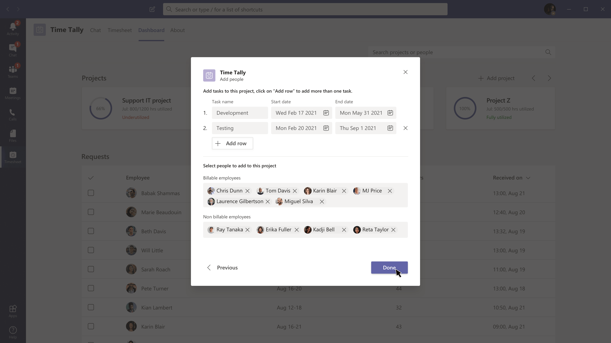
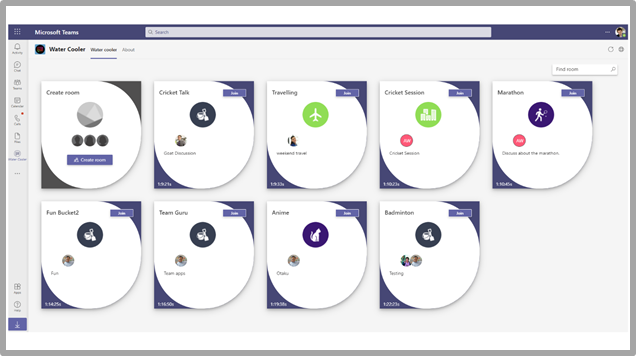

# Modelos de aplicativos para o Teams

Modelos de aplicativo são exemplos de aplicativos completos para Microsoft Teams que são de código aberto e disponíveis em GitHub. Cada modelo de aplicativo contém instruções detalhadas para implantar e instalar esse aplicativo para sua organização. Ele também fornece um aplicativo de exemplo que você pode instalar e começar a usar imediatamente. O código-fonte completo também está disponível, o que permite explorá-lo em detalhes ou bifurcar o código e alterá-lo para atender aos seus requisitos específicos.
Todos os modelos de aplicativo são fornecidos nos termos de [Licença do MIT.](https://github.com/OfficeDev/microsoft-teams-apps-eprescription/blob/master/LICENSE)

> [!NOTE] 
> Você deve licenciar e dar suporte a aplicativos criados a partir de modelos de aplicativos para seus usuários e organizações.

**&#9734; Indica modelos de aplicativo recém-lançados.**

### Principais benefícios

* **Implantar diretamente na nuvem:** Todos os modelos de aplicativo incluem scripts de implantação que permitem hospedar todos os serviços necessários no Microsoft Azure ou na Plataforma Power. 
* **Código de exemplo recomendado:** Os modelos de aplicativo estão em conformidade com as práticas recomendadas em torno da segurança e da infraestrutura. Todas as alterações enviadas pela comunidade aos modelos de aplicativos são revisadas para garantir a conformidade.
* **Personalizável e extensível:** Embora todos os modelos de aplicativo sejam implantados com configuração mínima, toda a base de código e scripts de implantação são fornecidos, para que você possa personalizá-los ou estendí-los facilmente para se ajustar às suas necessidades exclusivas.
* **Documentação detalhada:** Todos os modelos de aplicativo são acompanhados por documentação de ponta a ponta em etapas de arquitetura de solução, implantação e configuração.  

## Bot de adoção 

O Bot de Adoção é um bot de chat de cuidado do usuário criado com o Power Virtual Agent para Teams PVA. Ele é considerado como a versão PVA do FaQ Plus. O Bot de Adoção responde a mais de 100 perguntas comuns sobre Microsoft 365 e Teams. Você pode editar os tópicos existentes, adicionar seus próprios tópicos e ingerir perguntas frequentes existentes. Se os usuários precisarem de ajuda adicional, o Bot de Adoção poderá conectá-los a especialistas ou até mesmo ser estendido para abrir tíquetes de serviço com conectores de fluxo premium. Esse bot é auto-instalado ou integrado a um aplicativo personalizado, como o [Hub de Adoção](https://github.com/akporzondek/adoption_hub).

[Obter no GitHub](https://github.com/OfficeDev/microsoft-teams-apps-adopt-bot)

## Ferramenta de Adoção - Plataforma de Gerenciamento de Campeões &#9734;

O modelo de aplicativo da Plataforma de Gerenciamento de Campeões (CMP) ajuda você a gerenciar, dimensionar e inspirar seus defensores do trabalho em equipe a obter mais. Esse modelo de aplicativo é criado no Estrutura do SharePoint e carregado em uma guia dentro de uma equipe. Os grupos podem aproveitar essa ferramenta para ajudar a gerenciar a associação ao programa, fornecer uma tabela de líderes e tipos de eventos para registro em log e ferramentas para sobrepor selos digitais aos participantes do programa.

[Obter no GitHub](https://github.com/OfficeDev/microsoft-teams-apps-champion-management)

## Ferramenta de Adoção- Microsoft 365 Learning caminhos (Introdução) &#9734;

O Introdução de aplicativo permite que você traga o poder de Microsoft 365 de aprendizado dentro do Microsoft Teams. Este modelo de aplicativo permite que você conceda fácil acesso a páginas de treinamento específicas ou a outros ativos de intranet e carregue o conteúdo diretamente no Teams. Você também pode alterar o nome do aplicativo ou o logotipo para corresponder à identidade visual da sua empresa.

[Obter no GitHub](https://github.com/msft-teams/tools/tree/master/M365%20Learning%20Pathways)

## Gerenciador de Compromissos 

O Gerenciador de Compromissos é um Teams de aplicativos para ajudar as empresas a criar, gerenciar e conduzir compromissos virtuais com os consumidores por meio Teams. As novas solicitações de compromisso dos consumidores ficam visíveis Teams canais, onde são atribuídas rapidamente e reatribuídas à equipe em uma equipe. As solicitações de compromisso são exibidas em níveis de equipe ou pessoal por meio de guias personalizadas. Cada compromisso é associado a uma reunião Teams online, portanto, a equipe e os consumidores podem participar facilmente da reunião no horário agendado.

O modelo de aplicativo se integra ao Microsoft Bookings para facilitar o gerenciamento de compromissos. Os compromissos agendados aparecem automaticamente nos calendários dos membros da equipe atribuídos, e os consumidores recebem notificações de email e lembretes personalizáveis com links de reunião incorporados.

[Obter no GitHub](https://github.com/OfficeDev/microsoft-teams-apps-appointment-manager)

 

## Ask Away

Ask Away é um [Microsoft Teams que](../bots/what-are-bots.md) permite que os usuários conduzam Perguntas e Respostas, chamadas de Q&A em Teams. Usando o bot Ask Away, os membros da equipe podem enviar e fazer perguntas de votação compartilhadas por colegas, permitindo que os hosts de Q&A reúnam facilmente perguntas importantes em um canal ou chat. O bot é usado para conduzir uma sessão Q&A em tempo real em uma reunião Teams e permite que os participantes enviem perguntas ao vivo por chat.

[Obter no GitHub](https://github.com/OfficeDev/microsoft-teams-apps-askaway)

:::row:::
  :::column span="2":::
      
:::column-end:::
:::row-end:::

## Informações associadas

Associar Insights é um [modelo Power Apps](/powerapps/maker/canvas-apps/embed-teams-app) que capacita os funcionários de primeira linha a capturar e enviar diretamente a opinião, o sentimento e a percepção do cliente. Os funcionários de primeira linha geralmente são o primeiro representante da empresa a se envolver com os clientes em um ponto de contato de um para um. Os dados coletados são compartilhados e usados de forma colaborativa por equipes de negócios, como por meio de uma guia Power BI Teams, para melhorar o produto e melhorar a experiência do cliente.

[Obter no GitHub](https://github.com/OfficeDev/microsoft-teams-apps-associateinsights)

:::row:::
  :::column span="2":::
      
:::column-end:::
:::row-end:::
:::row:::
:::column span="2":::
    
:::column-end:::
:::row-end:::

## Participação

O aplicativo de participação é [uma Power Apps](/powerapps/maker/canvas-apps/embed-teams-app) guia que é fixada em uma equipe. Ele foi projetado para registrar a presença em configurações, como ambientes de aprendizado e treinamento. Os usuários podem marcar ou editar a participação por até 30 dias no passado e exibir relatórios de participação resumidos para um grupo inteiro ou participantes individuais. Para obter mais informações sobre a participação das equipes, consulte [Get it on GitHub](https://github.com/OfficeDev/microsoft-teams-apps-attendance).

A imagem a seguir exibe a demonstração do aplicativo de participação:  

## Book-a-room

Book-a-room é um [Microsoft Teams que](../bots/what-are-bots.md) permite aos usuários encontrar e reservar rapidamente uma sala de reunião por 30, 60 ou 90 minutos a partir da hora atual. O tempo padrão é de 30 minutos. Os escopos de bot book-a-room para conversas pessoais ou 1:1. Para obter mais informações sobre o aplicativo Book-a-room, consulte [Get it on GitHub](https://github.com/OfficeDev/microsoft-teams-apps-bookaroom).  
A imagem a seguir exibe a demonstração Book-a-room:

## Criando o Access

O Building Access é um aplicativo baseado na Plataforma Do Microsoft [Power](https://powerapps.microsoft.com/blog/now-in-preview-customize-teams-with-built-in-power-platform-capabilities/) que oferece suporte à administração da criação de limites de ocupação e de normas de distanciamento social, permitindo que os diretores de instalações gerenciem, acompanhem e reportem a presença do funcionário no local. O aplicativo, criado usando o Microsoft [Power Apps](/powerapps/powerapps-overview)e [o Power Automate,](/power-automate/getting-started)integra-se profundamente ao Microsoft Teams e permite que as organizações determinem a preparação para a criação, estabeleçam critérios de qualificação para acesso no site e reúnam ideias para o planejamento futuro.

[Obter no GitHub](https://github.com/OfficeDev/microsoft-teams-apps-buildingaccess)

:::row:::
   :::column span="":::
     
   :::column-end:::
   :::column span="":::
      
   :::column-end:::
:::row-end:::

## Celebrações

Celebrações é um Teams que ajuda os membros da equipe a comemorar aniversários, aniversários e outros eventos recorrentes. Ele lembra ocasiões especiais de todos os membros da equipe e envia uma mensagem amigável em todas as equipes selecionadas no momento da criação do evento, para fazer com que os membros da equipe se sintam especiais em seus dias.

O aplicativo fornece uma interface fácil para todos os membros da equipe adicionarem e exibirem seus eventos pessoalmente e também permitem que o usuário selecione as equipes nas quais os eventos são compartilhados.

[Obter no GitHub](https://github.com/OfficeDev/microsoft-teams-celebrations-app)

## Lista de verificação

Checklist é um aplicativo  de extensão Microsoft Teams mensagens personalizado que permite que você colabore com sua equipe criando uma lista de verificação compartilhada em um chat ou canal. O aplicativo tem suporte em todos os clientes Teams plataforma, como navegador de área de trabalho, iOS e Android. O aplicativo está pronto para implantação como parte de sua assinatura Microsoft 365 usuário.  

[Obter no GitHub](https://github.com/OfficeDev/microsoft-teams-checklist-app)

:::row:::
:::column span="2":::
      
:::column-end:::
:::row-end:::

## Drop-in de sala de aula 

O Drop-in de sala de aula é um aplicativo baseado na Plataforma [Microsoft Power](https://powerapps.microsoft.com/blog/now-in-preview-customize-teams-with-built-in-power-platform-capabilities/)que permite que os líderes do sistema encontrem equipes de classe, significa salas de aula virtuais e adicionem a si mesmos ou outras pessoas a essas equipes de classe por um período de entrega especificado, conforme necessário. O aplicativo criado usando o Microsoft [Power Apps](/powerapps/powerapps-overview) e [o Power Automate](/power-automate/getting-started), integra-se profundamente ao Microsoft Teams para garantir que os institutos educacionais possam otimizar suas operações em um ambiente de aprendizado híbrido, fornecendo acesso a participantes relevantes para equipes de classe por requisitos comerciais.

[Obter no GitHub](https://github.com/OfficeDev/microsoft-teams-apps-classroom-dropin)

## Communicator da empresa

O aplicativo Communicator company permite que as equipes corporativas criem e enviem mensagens destinadas a várias equipes ou a um grande número de funcionários por chat, permitindo que a organização chegue aos funcionários exatamente onde colaboram. Utilize esse modelo para vários cenários, como novos comunicados de iniciativa, integração de funcionários, aprendizado moderno e desenvolvimento ou transmissões em toda a organização.

O aplicativo fornece uma interface fácil para usuários designados criar, visualizar, colaborar e enviar mensagens.

Ele fornece uma base para criar recursos personalizados de comunicação direcionada, como telemetria personalizada, em quantos usuários reconheceram ou interagiram com uma mensagem.

[Obter no GitHub](https://github.com/OfficeDev/microsoft-teams-company-communicator-app)

## Procurar grupo de contatos

O aplicativo de Pesquisa de Grupo de Contatos fornece uma abordagem conveniente e útil para criar, acessar e gerenciar os grupos de contatos da sua organização, anteriormente conhecidos como listas de distribuição ou grupos de comunicação. Os usuários podem exibir e conversar rapidamente com membros do grupo, exibir o status do membro e criar um chat de grupo com membros selecionados no grupo de contatos, tudo dentro do ambiente Teams de grupo.

[Obter no GitHub](https://github.com/OfficeDev/microsoft-teams-app-contactgrouplookup)

:::row:::
:::column span="2":::
      
:::column-end:::
:::row-end:::
:::row:::
:::column span="2":::
    
:::column-end:::
:::row-end:::

## Reconhecimento de colegas de trabalho 

Usando o modelo de reconhecimento de colegas de trabalho no Microsoft Teams, os usuários podem reconhecer as conquistas de seus colegas no contexto Teams do usuário. Quando os colegas de trabalho selecionam recompensar um colega, os destinatários e outros membros da equipe são marcados em uma conversa de canal e recebem uma notificação sobre os detalhes do prêmio do canal. Os prêmios são registrados no aplicativo Teams, que é seguro, portátil e compartilhável facilmente. Isso é considerado como a versão baseada no PowerApps do modelo de aplicativo Open Badges, com uma tabela de classificação.

[Obter no GitHub](https://github.com/OfficeDev/microsoft-teams-apps-coworker-appreciation)

## CrowdSourcer

CrowdSourcer é um [Microsoft Teams que](../bots/what-are-bots.md) fornece informações consultadas às equipes de forma colaborativa de membros do grupo. Ele ajuda a responder a perguntas frequentes ao permitir que os participantes se envolvam ativamente e contribuam para um recurso de informações divertido e útil.

[Obter no Github](https://github.com/OfficeDev/microsoft-teams-crowdsourcer-app)

## Adesivos personalizados

A auto expressão é fundamental para uma cultura de equipe saudável. Este modelo de aplicativo é uma extensão [de](~/messaging-extensions/what-are-messaging-extensions.md) mensagens que permite que seus usuários usem adesivos personalizados e GIFs em Microsoft Teams. Este modelo oferece uma experiência de configuração baseada na Web fácil, onde qualquer pessoa com acesso à configuração pode carregar os GIFs, adesivos e imagens que eles querem que seus usuários tenham, permitindo que toda a sua equipe use qualquer conjunto de adesivos que você escolher.

Este aplicativo também permite fácil compartilhamento de imagens, GIFs, adesivos entre equipes sem precisar de acesso a sites SharePoint ou canais individuais como mecanismos de armazenamento e compartilhamento. Por exemplo, as equipes de produtos podem compartilhar facilmente imagens de produto e GIFs para equipes de mídia social, marketing e vendas programaticamente. Também é possível estender esse aplicativo disparando um fluxo de notificação para equipes ou indivíduos específicos quando novas imagens e GIFs são disponibilizados.

[Obter no GitHub](https://github.com/OfficeDev/microsoft-teams-stickers-app)

## Ideias de funcionários

O aplicativo Ideias de Funcionários é a versão do PowerApps do modelo de aplicativo Great Ideas baseado no Azure. O aplicativo permite que os usuários Teams configurar e configurar uma campanha de ideias. Uma campanha de ideias é uma categoria para agrupar ideias em torno de temas comuns.

Teams usuários também podem executar as seguintes atividades:

* Configure um formulário de envio padrão que os funcionários devem enviar para cada ideia. 
* Revise e gerencie as ideias e a lista de campanhas.
* Modificar e excluir campanhas.
* Revise os conselhos de líderes de ideias.
* Vote e compartilhe ideias priorizadas.
* Enviar ideias para uma campanha.
* Exibir a ideia de outro membro da equipe.
* Vote nas ideias mais curtidas.
* Revise o desempenho de suas ideias em comparação com outras em uma campanha.

[Obter no GitHub](https://github.com/OfficeDev/microsoft-teams-apps-employeeideas)

 

## E-Prescriptions 

O E-Prescriptions  é um aplicativo baseado em Power Apps que aprimora a telemedicina e o cuidado virtual automatizando o processo de emissão de prescrições e para os pacientes. Os profissionais médicos podem revisar rapidamente os compromissos, gerar prescrições e enviar emails com anexos de prescrição e para os pacientes diretamente dentro da plataforma Teams.

[Obter no GitHub](https://github.com/OfficeDev/microsoft-teams-apps-eprescription) 

:::row:::
:::column span="2":::
      
:::column-end:::
:::row-end:::
:::row:::
:::column span="2":::
    
:::column-end:::
:::row-end:::

## Treinamento de funcionários 

Treinamento de funcionários é um Microsoft Teams que permite que os organizadores publiquem, acompanhem e promovam facilmente eventos de aprendizado e treinamento para sua organização.  Com o aplicativo, os planejadores de eventos podem enviar lembretes e notificações para os registrantes de eventos e os funcionários podem indicar interesse nos próximos eventos, manter-se atualizados sobre eventos atuais e compartilhar detalhes do evento com colegas por meio da extensão de mensagens Teams.

[Obter no GitHub](https://github.com/OfficeDev/microsoft-teams-apps-employeetraining)

:::row:::
:::column span="2":::
    **Exibir eventos de treinamento de funcionários**   
:::column-end:::
:::row-end:::
:::row:::
:::column span="2":::
    **Criar evento de treinamento de funcionários** 
:::column-end:::
:::row-end:::

## Expert Finder

O Expert Finder é [um Microsoft Teams que](../bots/what-are-bots.md) identifica membros específicos da organização com base em suas habilidades, interesses e atributos de educação. Os membros encontram especialistas em uma organização que combinam com uma pesquisa de palavra-chave de Azure Active Directory perfis de usuário.

[Obter no GitHub](https://github.com/OfficeDev/microsoft-teams-apps-expertfinder)

## Perguntas Frequentes Plus

Conversational Q&Um bots é uma maneira fácil de fornecer respostas para perguntas frequentes pelos usuários. Porém, a maioria dos bots não consegue se envolver com os usuários de maneira significativa porque não há nenhum humano no loop quando o bot falha. O bot de perguntas frequentes é&um bot que traz um humano no loop quando não consegue ajudar. É possível fazer uma pergunta ao bot e o bot responde com uma resposta se ele estiver contido na base de dados de conhecimento. Caso não seja, o bot permite que o usuário envie uma consulta que, em seguida, é postada para uma equipe pré-configurada de especialistas que ajudam a fornecer suporte atuando sobre as notificações de dentro da própria equipe.

> [!NOTE]
> A versão mais recente do **FaQ Plus** oferece suporte a resoluções de Q&A aprimoradas, permitindo que uma equipe de especialistas conclua o seguinte:
>
> &#x2714; Adicionar novo Q&Diretamente à base de dados de conhecimento usando extensões de mensagem.
>
> &#x2714; Editar e excluir P&Pares A adicionados por um bot.
>
> &#x2714; o histórico de revisão de Q&As.
>
> &#x2714; Configurar uma resposta com detalhes adicionais para exibição como um [Cartão Adaptável.](../task-modules-and-cards/cards/cards-reference.md#adaptive-card)
>
[Obter no GitHub](https://github.com/OfficeDev/microsoft-teams-apps-faqplusv2)

## Obter aplicativo de suporte

O aplicativo Obter Suporte é usado por organizações que estão usando Microsoft Teams, para permitir que qualquer conjunto de usuários solicite assistência de supervisores. Este aplicativo inclui os seguintes recursos:
* Solicitando assistência em diferentes categorias de um Power App.
* Notificações enviadas aos solicitadores informando quem foi atribuído.
* Notificações enviadas a supervisores atribuídos informando quem precisa de assistência. 
* Analisando escalonamentos e padrões em SharePoint e PowerBI.S.

[Obter no GitHub](https://github.com/OfficeDev/microsoft-teams-app-get-support/)

## Rastreador de Meta

O aplicativo Rastreador de Metas é uma solução abrangente para sua organização para dar suporte ao estabelecimento de metas, à observação do progresso e ao reconhecimento do sucesso dentro Microsoft Teams. O aplicativo permite aos usuários definir, rastrear e atualizar objetivos em um nível profissional, pessoal e de equipe. Os membros da equipe também recebem lembretes e atualizações de status em tempo há tempo para permanecerem focados e permanecerem no controle.

[Obter no GitHub](https://github.com/OfficeDev/microsoft-teams-app-goaltracker)

:::row:::
  :::column span="2":::
      
:::column-end:::
:::row-end:::
:::row:::
:::column span="2":::
    
:::column-end:::
:::row-end:::

## Ótimas ideias

O aplicativo Grandes Ideias dá suporte e capacita a inovação e a criatividade em sua organização. O aplicativo permite que seus funcionários compartilhem ideias com colegas e liderança, descubram novos envios, destaquem as contribuições para consideração por pares e votem nas melhores propostas dentro Microsoft Teams.

[Obter no GitHub](https://github.com/OfficeDev/microsoft-teams-apps-greatideas)

:::row:::
  :::column span="2":::
      
:::column-end:::
:::row-end:::
:::row:::
:::column span="2":::
    
:::column-end:::
:::row-end:::

## Atividades de grupo

Atividades de grupo é um Microsoft Teams que facilita que os proprietários da equipe criem rapidamente grupos de atividades e gerenciem fluxos de trabalho de colaboração no contexto de Microsoft Teams. Os autores de atividades estão habilitados para criar atividades, distribuir aleatoriamente membros da equipe em grupos e, opcionalmente, fazer com que o bot envie lembretes até que as atividades sejam concluídas.

[Obter no GitHub](https://github.com/OfficeDev/microsoft-teams-apps-groupactivities)

:::row:::
  :::column span="2":::
      
:::column-end:::
:::row-end:::
:::row:::
:::column span="2":::
    
:::column-end:::
:::row-end:::

## Grupo Conexão &#9734;

Grupo Conexão é um aplicativo Microsoft Teams que ajuda os membros da organização a descobrir grupos de funcionários e a encontrar informações relevantes para grupos de funcionários. O aplicativo vem integrado com recursos avançados para os líderes da organização se comunicarem com seus funcionários em relação a grupos, eventos e recursos. O aplicativo Conexão grupo também corresponde aos membros do grupo uns com os outros na frequência desejada para incentivar a rede e a coesão dentro de um grupo. Para obter mais informações sobre como você pode aproveitar o aplicativo Conexão group para ajudar os grupos de funcionários a promover em sua organização, consulte o aplicativo no GitHub.

[Obter no GitHub](https://github.com/OfficeDev/microsoft-teams-apps-groupconnect)

## Aumentar suas habilidades

O aplicativo Crescer Suas Habilidades dá suporte ao crescimento e ao desenvolvimento profissional, permitindo que os funcionários contribuam com projetos complementares para sua organização e, ao mesmo tempo, aprendam novas habilidades. Os funcionários podem usar o aplicativo para localizar oportunidades que atendem aos seus interesses, desfrutar de colaboração significativa com pares e adquirir novos níveis de experiência e recursos, tudo dentro do ambiente Teams.

[Obter no GitHub](https://github.com/OfficeDev/microsoft-teams-apps-growyourskills)

:::row:::
  :::column span="2":::
      
:::column-end:::
:::row-end:::
:::row:::
:::column span="2":::
    
:::column-end:::
:::row-end:::

## Suporte de RH

O bot de Suporte de RH é um Q&um bot que traz um profissional de suporte ou especialista da equipe de RH no loop quando não consegue ajudar. É possível fazer uma pergunta ao bot e o bot responde com uma resposta se ele estiver contido na base de dados de conhecimento. Caso não seja, o bot permite que o usuário envie uma consulta que, em seguida, é postada em uma equipe pré-configurada de especialistas que ajudam a fornecer suporte agindo sobre as notificações de dentro de sua própria equipe. Além disso, o bot sugere links para políticas ou perguntas recomendadas de RH pesquisando marcas pré-configuradas na pergunta. Esses blocos são encontrados na guia associada como uma referência rápida. O Suporte de RH funciona bem para Q&A e para fornecer suporte rápido ao iniciar novos projetos ou iniciativas na organização.

[Obter no GitHub](https://github.com/OfficeDev/microsoft-teams-hrsupport-app)

## Frases de apresentação

Icebreaker é um [Microsoft Teams que](../bots/what-are-bots.md) ajuda sua equipe a se aproximar emparelhando dois membros aleatórios da equipe a cada semana para se reunir. O bot facilita o agendamento sugerindo automaticamente tempos livres que funcionam para ambos os membros. Fortaleça conexões pessoais e crie uma comunidade estreita com esse aplicativo.

Além de incentivar conexões pessoais em toda a sua equipe, o aplicativo Icebreaker pode ajudar a criar comunidades baseadas em interesse em sua organização. Por exemplo, você pode usar esse aplicativo para um grupo de DevOps de interesse para ajudar a propagar ideias e práticas recomendadas de forma orgânica em sua organização.

[Obter no GitHub](https://github.com/OfficeDev/microsoft-teams-icebreaker-app)

## Incentivos

Incentivos é um [modelo Power Apps](/powerapps/maker/canvas-apps/embed-teams-app) que gerencia e rastreia a participação de funcionários incentivados em atividades designadas, como treinamentos e iniciativas de gerenciamento de alterações. Os administradores usam o aplicativo para estabelecer atividades designadas, atribuir pontos para conclusão e especificar níveis de pontos de qualificação necessários para recompensas. Os funcionários usam o aplicativo para exibir seus pontos acumulados e, ao chegarem à qualificação, solicitam e solicitam recompensas resgatáveis.

[Obter no GitHub](https://github.com/OfficeDev/microsoft-teams-apps-incentives)

## Incident Reporter

Incident Reporter é um [Microsoft Teams que](../bots/what-are-bots.md) otimiza o gerenciamento de incidentes em sua organização. O bot facilita a coleta automatizada de dados de incidentes, relatórios de incidentes personalizados, notificações relevantes de participantes e controle de incidentes de ponta a ponta.

[Obter no GitHub](https://github.com/OfficeDev/microsoft-teams-apps-incidentreport)

:::row:::
  :::column span="2":::
      
:::column-end:::
:::row-end:::
:::row:::
:::column span="2":::
    
:::column-end:::
:::row-end:::

## Inspeção 

 A inspeção é um Microsoft Teams que permite que os funcionários de linha de frente inspecionem qualquer coisa de locais para ativos e equipamentos. Por exemplo, uma loja de varejo, uma fábrica de manufatura ou veículos e máquinas. Há dois aplicativos nesta solução, cada um destinado a tipos diferentes de usuários.

O aplicativo capacita os funcionários de linha de frente a inspecionar um ativo ou área, gerenciar a qualidade de produtos e serviços ou manter a segurança no local de trabalho. Facilita a comunicação entre membros da equipe para resolver problemas encontrados durante a inspeção. O aplicativo fornece relatórios simples para os gerentes agilizarem a resolução de problemas e realçam as tendências.

[Obter no GitHub](https://github.com/OfficeDev/microsoft-teams-apps-inspection)

   

## Relatório de Problemas

O aplicativo Relatório de Problemas capacita os funcionários e gerentes a levantar e gerenciar problemas. Ele consiste em dois aplicativos, Emitir aplicativo de relatório para problemas de relatórios e gerenciar problemas do aplicativo para gerenciar problemas.

Os gerentes de equipe usam o aplicativo Gerenciar Problemas para configurar a experiência do aplicativo, incluindo o canal no qual Microsoft Teams mensagens e tarefas do Planner são criadas pelo aplicativo. Os gerentes também usam o aplicativo para criar formulários de modelo para coletar detalhes quando um usuário relata um problema. Por exemplo, revise, edite ou exclua formulários de modelo de problema. O aplicativo também é usado para revisar problemas de equipe, relatar o histórico de problemas e gerenciar com eficiência a resolução de problemas.

Os funcionários usam o aplicativo Demissão de relatórios para registrar problemas e detalhes necessários para resolvê-los. O aplicativo também é usado para modificar e resolver problemas existentes e obter uma visão de alto nível de problemas individuais ou de equipe.

[Obter no GitHub](https://github.com/OfficeDev/microsoft-teams-apps-issuereporting)

  

## Integração de novos funcionários 

A Integração de Novos Funcionários é uma solução integrada Microsoft Teams e SharePoint Nova Integração de Funcionários que permite [que sua](https://lookbook.microsoft.com/details/75e60a32-9849-4ed4-b83e-b2b08983ad19) organização forneça uma experiência de integração consistente e de alta qualidade para os funcionários em sua jornada de nova contratação. O aplicativo é usado por equipes de recursos humanos e gerentes de contratação para fornecer informações relevantes em todo o processo de orientação e indução e por novos contratados para compartilhar comentários, fornecer apresentações e concluir tarefas de integração.

[Obter no GitHub](https://github.com/OfficeDev/microsoft-teams-apps-newemployeeonboarding)

:::row:::
  :::column span="2":::
    **Novo cartão de boas-vindas do funcionário** 
:::column-end:::
:::row-end:::
:::row:::
:::column span="2":::
    **Nova lista de verificação de funcionários**   
:::column-end:::
:::row-end:::

## Selos abertos

O Open Badges é um Microsoft Teams que permite que as pessoas ganhem selos de credencial de aprendizagem digital no contexto Teams e compartilhem-os em todos os lugares. Usando recursos da autoridade de emissão de selo digital de terceiros, [o Badgr](https://badgr.org/), os selos concedidos são registrados no perfil Badgr de um destinatário e disponíveis para criar e compartilhar uma imagem rica das jornadas de aprendizado de vida útil.

[Obter no GitHub](https://github.com/OfficeDev/microsoft-teams-apps-openbadges)

:::row:::
  :::column span="2":::
      
:::column-end:::
:::row-end:::
:::row:::
:::column span="2":::
    
:::column-end:::
:::row-end:::

## Sondagem 

Poll é um aplicativo  de extensão Microsoft Teams mensagens personalizado que permite que você crie e envie votações rapidamente em um chat ou canal para reunir opiniões e preferências de equipe. O aplicativo tem suporte em todos os clientes da plataforma Teams, como desktop, navegador, iOS e Android, e está pronto para implantação como parte da sua assinatura Microsoft 365.

[Obter no GitHub](https://github.com/OfficeDev/microsoft-teams-poll-app)

:::row:::
  :::column span="1":::
      
:::column-end:::
:::row-end:::

## Respostas rápidas

Respostas Rápidas é um Microsoft Teams que oferece uma solução robusta para responder efetivamente às perguntas frequentes dos usuários. Em vez de responder a cada consulta manualmente e continuamente repetindo informações, o aplicativo cria uma biblioteca de respostas para uma experiência interativa do usuário por meio de extensões de Teams [de mensagens.](../messaging-extensions/what-are-messaging-extensions.md)

[Obter no GitHub](https://github.com/OfficeDev/microsoft-teams-apps-quickresponses)

## Teste &#9734;

Quiz é um aplicativo de extensão [Teams](../messaging-extensions/what-are-messaging-extensions.md) mensagens personalizado que permite que você crie um teste em um chat ou um canal para verificação de conhecimento e resultados instantâneos. Você pode usar Quiz para, exames em classe e offline, Verificação de conhecimento dentro da equipe e testes divertidos em uma equipe. O aplicativo quiz é suportado em várias plataformas, como clientes Teams desktop, navegador, iOS e Android. Este aplicativo está pronto para implantação como parte de sua assinatura Microsoft 365 existente.

[Obter no GitHub](https://github.com/OfficeDev/microsoft-teams-apps-quiz)

:::row:::
  :::column span="1":::
      
:::column-end:::
:::row-end:::

## Assistência Rápida

O Rapid Assist é um aplicativo baseado na Plataforma [Microsoft Power](https://powerapps.microsoft.com/blog/now-in-preview-customize-teams-with-built-in-power-platform-capabilities/) que permite que os associados voltados para o cliente se conectem rapidamente com os especialistas para obter respostas rápidas, pesquisar informações, acompanhar solicitações abertas e permitir que os especialistas recebam notificações para receber rapidamente uma chamada para ajudar a responder a perguntas. O aplicativo criado usando o Microsoft [Power Apps](/powerapps/powerapps-overview) e [Power Automate](/power-automate/getting-started), integra-se profundamente ao Microsoft Teams para permitir que as organizações conectem facilmente os funcionários de linha de frente com ligações corporativas para resolver consultas de clientes e oferecer uma ótima experiência do cliente. 

[Obter no GitHub](https://github.com/OfficeDev/microsoft-teams-apps-rapid-assist)

:::row:::
   :::column span="":::
     
   :::column-end:::
   :::column span="":::
      
   :::column-end:::
:::row-end:::

## Reflect 

Reflect é um aplicativo  de extensão Microsoft Teams mensagens personalizado que fornece um recurso seguro e inclusivo para os membros da equipe compartilharem o estado de seu bem-estar emocional com colegas ou líderes de grupo diretamente no Teams. O aplicativo está disponível em chats de canal, grupo, reunião e 1:1, e a resposta de check-in é definida como pública, privada para remetente ou totalmente anônima.

[Obter no GitHub](https://github.com/OfficeDev/Microsoft-Teams-App-Reflect)

:::row:::
    :::column:::
    **Sondagem de bem-estar**
    
    
    :::column-end:::
:::row-end:::

## Suporte remoto

O Suporte Remoto é um [Microsoft Teams que](../bots/what-are-bots.md) fornece uma interface focada entre solicitadores de suporte em toda a sua organização e a equipe de suporte interno.  Os usuários finais podem enviar, editar ou retirar solicitações de suporte e a equipe de suporte pode responder, gerenciar e atualizar todas as solicitações na plataforma Teams.

[Obter no GitHub](https://github.com/OfficeDev/microsoft-teams-apps-remotesupport)

:::row:::
  :::column span="2":::
      
:::column-end:::
:::row-end:::
:::row:::
:::column span="2":::
    
:::column-end:::
:::row-end:::

## Request-a-team

Request-a-team é um Microsoft Teams que otimiza a criação de nova equipe para sua organização corporativa. O aplicativo dá suporte à padronização e às práticas recomendadas ao criar novas instâncias de equipe por meio da integração de um formulário de solicitação orientado pelo assistente, um processo de aprovação incorporado, um painel de status de solicitação e com builds de equipe automatizados.

[Obter no GitHub](https://github.com/OfficeDev/microsoft-teams-apps-requestateam)

:::row:::
  :::column span="2":::
    
:::column-end:::
:::row-end:::
:::row:::
:::column span="2":::
    
:::column-end:::
:::row-end:::

## Scrums for Channels

O Scrums for Channels é um aplicativo assistente scrum que permite que os usuários agendem e executem scrums em canais dentro Microsoft Teams. O aplicativo é ótimo para equipes remotas e equipes compostas por membros de locais geográficos e fusos horário variados para compartilhar atualizações diárias e garantir a participação em reuniões de stand-up scrum.

[Obter no GitHub](https://github.com/OfficeDev/microsoft-teams-apps-scrumsforchannels)

> [!NOTE]
> Para conduzir reuniões scrum em um chat em grupo, consulte [Scrums for Group Chat app](#scrums-for-group-chat) template.

:::row:::
  :::column span="2":::
    
:::column-end:::
:::row-end:::
:::row:::
:::column span="2":::
    
:::column-end:::
:::row-end:::

## Scrums para Chat em Grupo

> [!NOTE]
> O modelo de aplicativo Status do Scrums foi atualizado e agora é Scrums para Chat de Grupo.

O Scrums for Group Chat é um assistente de scrum de suporte que permite que os membros do chat de grupo executem reuniões de stand-up assíncronas e compartilhem facilmente suas atualizações diárias. Ele permite que todos os membros do chat de grupo contribuam para o scrum e exibir as atualizações feitas por outras pessoas no scrum em execução.

[Obter no GitHub](https://github.com/OfficeDev/microsoft-teams-apps-scrumsforgroupchat)

## Compartilhar Agora 

O aplicativo Compartilhar Agora promove a troca positiva de informações entre colegas permitindo que seus usuários compartilhem facilmente conteúdo no ambiente Teams. Os usuários envolvem o aplicativo para compartilhar itens de interesse com membros da equipe, descobrir novo conteúdo compartilhado, definir preferências e favoritos de indicador para leitura posterior.

[Obter no GitHub](https://github.com/OfficeDev/microsoft-teams-apps-sharenow)

## Pesquisa de lista do SharePoint

A colaboração Microsoft Teams muitas vezes faz referência às informações contidas em itens em uma SharePoint lista. Colar um link para o item em questão força todos a alternar o contexto da conversa, encontrar as informações necessárias e retornar ao Teams para continuar a conversa. À medida que a conversa continua, as pessoas têm que voltar para o item de referência várias vezes para verificar novos comentários e atualizar suas recordações das informações contidas no item. Essa alternação de contexto cria uma barreira para suavizar a colaboração.
Para resolver esse problema, o modelo de aplicativo de Pesquisa de Lista é usado. Muitos usuários usam SharePoint para dar energia a alguns dos principais fluxos de trabalho em suas organizações. No entanto, é difícil colaborar em torno de listas. Usando o modelo de aplicativo de Pesquisa de Lista no Microsoft Teams, os usuários podem inserir informações de itens de lista SharePoint diretamente em uma conversa de chat para aliviar a alternância de contexto causada ao simplesmente inserir um link em um chat. As informações são inseridas como um cartão de formatação automática fácil de ler, ajudando os usuários a permanecer envolvidos na conversa.

[Obter no GitHub](https://github.com/OfficeDev/microsoft-teams-list-search-app)

## Check-ins de equipe

Os Check-ins de equipe são [um aplicativo Power Apps](/powerapps/powerapps-overview) baseado em segurança que permite a comunicação de supervisão entre sua empresa e a equipe de campo. A equipe pode fornecer informações e atualizações de status de tempo críticos facilmente em uma base agendada ou ad hoc diretamente do Teams. O aplicativo dá suporte a locais, fotos, anotações, notificações de lembrete e fluxos de trabalho automatizados em tempo real.

[Obter no GitHub](https://github.com/OfficeDev/microsoft-teams-apps-staffcheckins)

## Pesquisa

A pesquisa é um  aplicativo Microsoft Teams de extensão de mensagens personalizado que permite que você crie uma pesquisa em um chat ou canal para coletar dados e obter informações ativas. O aplicativo tem suporte em todos os clientes da plataforma Teams, como desktop, navegador, iOS e Android, e está pronto para implantação como parte da sua assinatura Microsoft 365.  

[Obter no GitHub](https://github.com/OfficeDev/Microsoft-Teams-Survey-app)

:::row:::
  :::column span="2":::
    
:::column-end:::
:::row-end:::

## Time Tally 

Um projeto pode incluir várias tarefas e vários projetos podem ser atribuídos aos funcionários. Os gerentes são obrigados a entender o andamento do projeto pelo tempo gasto pelos funcionários nessas tarefas. Isso pode ser uma atividade complicada, pois os funcionários precisam preencher os quadro de horários. O aplicativo Time Tally permite que os funcionários preencham seus quadro de horários rapidamente, usando o dispositivo móvel, e os gerentes não têm que acompanhar os funcionários na entrada do quadro de horários. Os gerentes podem exibir a utilização do projeto com base em recursos e podem aprovar ou rejeitar as entradas. As notificações de lembrete são enviadas para garantir a conformidade do quadro de horários. Além disso, dados históricos e utilizações estão disponíveis para análise.

[Obter no GitHub](https://github.com/OfficeDev/microsoft-teams-apps-timetally)

## Treinamento &#9734;

O treinamento é [um](../messaging-extensions/what-are-messaging-extensions.md) aplicativo de extensão Teams mensagens personalizado que permite que os usuários publiquem um treinamento em um chat ou um canal para compartilhamento de conhecimento offline e upskilling. O aplicativo tem suporte em vários clientes Teams plataforma, como desktop, navegador, iOS e Android. Este aplicativo está pronto para implantação como parte de sua assinatura Microsoft 365 de usuário.

[Obter no GitHub](https://github.com/OfficeDev/microsoft-teams-apps-training)

:::row:::
  :::column span="1":::
      
:::column-end:::
:::row-end:::

## Arredondamento Virtual

Os provedores de hospital e de emergência fazem muitas **rodadas** por dia. Esses check-ins rápidos em pacientes destinam-se a fornecer uma verificação de status sobre como o paciente está fazendo e garantir que as preocupações do paciente sejam resolvidas. Embora o arredondamento seja uma prática essencial para garantir que os pacientes sejam monitorados por vários tipos de provedores, eles representam um dreno enorme no PPE, pois para cada visita, de cada provedor, uma nova máscara e um novo conjunto de luvas são usados. Com esses modelos de aplicativo, os funcionários médicos podem conduzir facilmente rodadas virtualmente, por meio de uma reunião Microsoft Teams entre o provedor e o paciente.

A solução de Arredondamento Virtual também é referenciada na postagem do [blog](https://aka.ms/teamsvirtualrounding)Microsoft Health e Life Sciences.

[Obter no GitHub](https://github.com/SmartterHealth/Virtual-Rounding)

## Gerenciamento de Visitantes

O aplicativo de Gerenciamento de Visitantes permite que sua organização e funcionários gerenciem de forma fácil e eficiente o processo de visitante local, diretamente Microsoft Teams. O aplicativo permite que os funcionários criem solicitações de visitante, rastreiem centralmente um status de solicitação por meio do painel de visitantes e recebam notificações em tempo real quando um visitante chegar.

[Obter no GitHub](https://github.com/OfficeDev/microsoft-teams-app-visitormanagement)

:::row:::
  :::column span="2":::
    
:::column-end:::
:::row-end:::
:::row:::
:::column span="2":::
    
:::column-end:::
:::row-end:::

## Water &#9734;

Water Cool é um aplicativo Teams personalizado que permite que as equipes corporativas criem, convidem e participem de conversas casuais entre colegas de equipe, como aquelas que ocorrem pelo Water Cool ou pela sala de pausa. Use este modelo para vários cenários, como novos comunicados não relacionados ao projeto, tópicos de interesse, eventos atuais ou conversas sobre hobbies. O aplicativo fornece uma interface fácil para qualquer pessoa encontrar uma conversa existente ou iniciar uma nova. É uma base para a criação de recursos de comunicação personalizados direcionados, promovendo a interação entre colegas de trabalho que podem não ter a chance de socializar durante as pausas.    

[Obter no GitHub](https://github.com/microsoft/csapps-msteams-watercooler)     

    

### Principais recursos

**Home Page do Water Cool**: Você pode navegar em salas existentes onde os membros da equipe estão interagindo em conversas existentes com determinadas pessoas ou tópicos de interesse. As conversas ativas na **Home Page** mostram um nome de sala, descrição curta, duração da chamada e imagem de sala. 

**Sala de participação**: Use o recurso **Da sala** De ingressar para participar de uma conversa contínua imediatamente. Selecione **Participar de** conversas ativas para ingressar na sala.

**Criação de** sala : use o **recurso de** criação de sala para criar uma chamada Teams ou chat para todos os participantes interagirem. Crie salas facilmente especificando o nome da sala, a descrição curta, até cinco colegas como um grupo inicial e selecionando no conjunto fornecido de imagens de sala. 

**Sala de busca**: Use o **recurso Encontrar sala** para pesquisar a palavra-chave que corresponde ao tópico ou às breves descrições de conversas em andamento.

**Convite do participante**: use o **recurso de convite do Participante** para convidar usuários adicionais após a criação da sala. Isso é semelhante ao Teams chamada.

**Selo do** aplicativo : O ícone **do Water Cool** no menu esquerdo mostra um selo com o número de conversas ativas visíveis do Teams ao usar qualquer aplicativo. 

## Workplace Awards

Workplace Awards é um Teams de aplicativos que fornece uma estrutura positiva para promover o reconhecimento e incentivar a cultura da valorização dos funcionários no local de trabalho moderno. O aplicativo permite que você configure e gerencie recompensas e reconhecimento de funcionários, chamado R&R programa onde os funcionários podem facilmente nomear e endossar colegas e seu líder R&R pode exibir nomeações enviadas, conceder prêmios e anunciar destinatários.

[Obter no GitHub](https://github.com/OfficeDev/microsoft-teams-apps-workplaceawards)

:::row:::
  :::column span="2":::
    
:::column-end:::
:::row-end:::
:::row:::
:::column span="2":::
    
:::column-end:::
:::row-end:::

Para obter mais informações sobre o modelo de aplicativo, consulte [Modelo de aplicativo](https://forms.office.com/Pages/ResponsePage.aspx?id=v4j5cvGGr0GRqy180BHbR2_7qFm_lcZAr4eqEhnLsZ9UMVZGT1lCT0FXUDdZMUM0RkpBS1BESTAwWC4u).

## Confira também

[Integrar aplicativos Web](~/samples/integrate-web-apps-overview.md)
