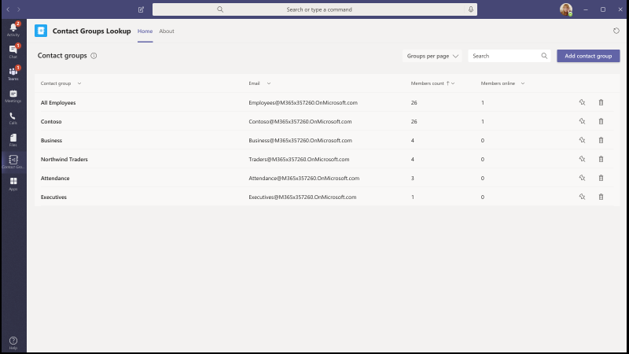
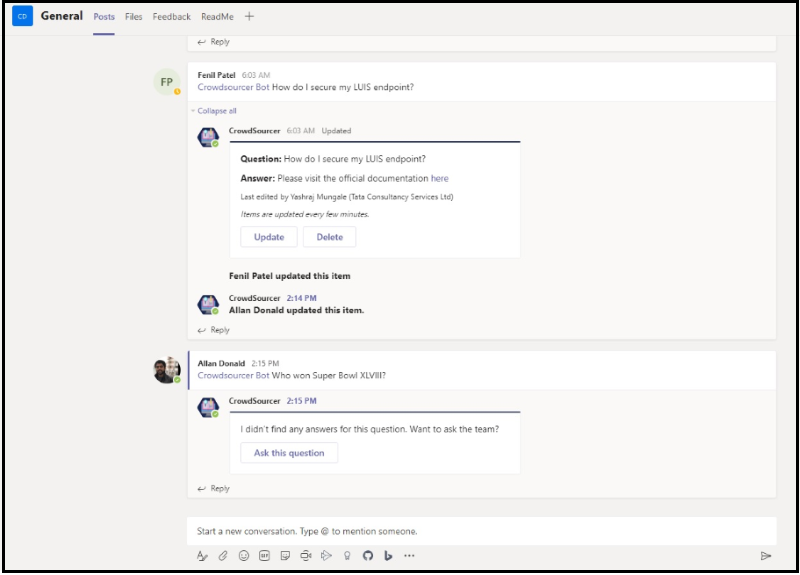
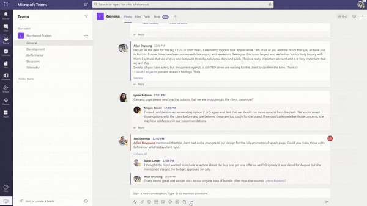
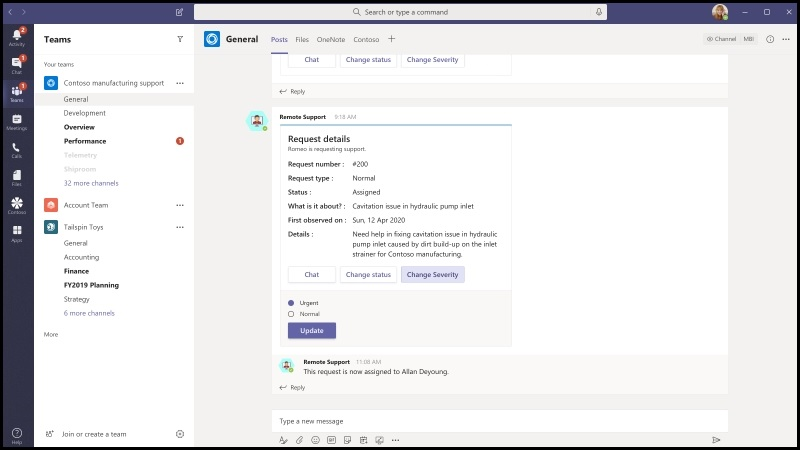
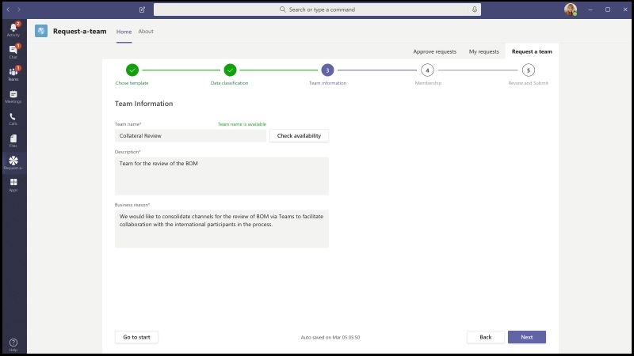

# Modelos de aplicativos para o Microsoft TeamsApp Templates for Microsoft Teams

Os modelos de aplicativos são aplicativos prontos para produção para o Microsoft Teams que são orientados pela Comunidade, fontes abertas e disponíveis no GitHub.App templates are production-ready apps for Microsoft Teams that are community driven, open-source, and available on GitHub. Cada uma contém instruções detalhadas para implantar e instalar o aplicativo para sua organização, fornecendo um aplicativo pronto para usar que você pode instalar e começar a usar imediatamente.Each contains detailed instructions for deploying and installing that app for your organization, providing a ready-to-use app that you can install and begin using immediately. O código-fonte completo também está disponível, para que você possa explorá-lo em detalhes ou bifurcar o código e alterá-lo para atender às suas necessidades específicas.The complete source code is available as well, so you can explore it in detail, or fork the code and alter it to meet your specific needs.

**&#9734; indica modelos de aplicativos recentemente liberados.****&#9734; Indicates newly released app templates.**

### Principais benefíciosKey benefits

* **Experiência de plug and Play:** Todos os modelos de aplicativos incluem scripts de implantação que permitirão que você hospede todos os serviços necessários no Microsoft Azure.**Plug and play experience:** All app templates include deployments scripts that will allow you to host all necessary services in Microsoft Azure. Nenhuma codificação é necessária para implantar os aplicativos.No coding is required to deploy the apps.
* **Código pronto para produção:** Os modelos de aplicativos estão de acordo com as práticas recomendadas em relação à segurança e à infraestrutura, e todas as alterações enviadas à Comunidade são revisadas para garantir a conformidade contínua.**Production-ready code:** The app templates conform to recommended best practices around security and infrastructure, and all community submitted changes to them are reviewed to ensure continued conformance.
* **Personalizável e extensível:** Embora todos os modelos de aplicativos estejam prontos para implantar como estão, fornecemos toda a base de código e scripts de implantação para que você possa facilmente personalizá-los ou estendê-los para atender às suas necessidades exclusivas.**Customizable and extensible:** While all app templates are ready to deploy as they are, we provide the entire code base and deployment scripts so that you can easily customize or extend them to fit your unique needs.
* **Documentação detalhada & suporte:** Todos os modelos de aplicativos são acompanhados por documentação de ponta a ponta nas etapas de arquitetura, implantação e configuração da solução.**Detailed documentation & support:** All app templates are accompanied by end-to-end documentation on solution architecture, deployment, and configuration steps. Os repositórios também são monitorados, portanto, informe qualquer problema que você encontrar, gerando um problema no GitHub.The repositories are monitored as well, so please report any issues you encounter by raising an Issue on GitHub.

## Peça para fora &#9734;Ask Away &#9734;

Pergunte que é um [bot do Microsoft Teams](../bots/what-are-bots.md) que permite que os usuários conduzam as seções Q&a (pergunta e resposta) no Teams.Ask Away is a [Microsoft Teams bot](../bots/what-are-bots.md) that enables users to conduct Q&A (Question and Answer) sessions within Teams. Usando o bot de Perg, os membros da equipe podem enviar e receber perguntas compostas por colegas, permitindo Q&um hosts a reunir facilmente perguntas de alto nível em um canal ou chat.Using the Ask Away bot, team members can submit and up-vote questions shared by colleagues allowing Q&A hosts to easily gather top-of-mind questions within a channel or chat. O bot pode ser usado para conduzir uma sessão Q&em tempo real em uma reunião do Teams e permite que os participantes Enviem perguntas ao vivo via chat.The bot can be used to conduct a real-time Q&A session in a Teams meeting and allows attendees to submit questions live via chat.

[Obter no GitHubGet it on GitHub](https://github.com/OfficeDev/microsoft-teams-apps-askaway)

:::row:::
  :::column span="2":::
      
:::column-end:::
:::row-end:::

## Informações associadasAssociate Insights

Associar o insights é um modelo de [aplicativos de energia](/powerapps/maker/canvas-apps/embed-teams-app) que permite que os funcionários de primeiro lugar capturem e enviem diretamente opiniões, opiniões e percepção do cliente.Associate Insights is a [Power Apps](/powerapps/maker/canvas-apps/embed-teams-app) template that empowers firstline workers to directly capture and submit customer opinion, sentiment, and perception. Os funcionários de primeiro lugar são geralmente o representante da empresa a ser direcionado para os clientes em um ponto de contato de um-para-um.Firstline workers are often the first company representative to engage with customers in a one-to-one point-of contact. Os dados coletados podem ser compartilhados e usados de forma colaborativa por equipes de negócios, por exemplo, por meio de uma guia do Power BI Teams, para melhorar o produto e aprimorar a experiência do cliente.The collected data can be shared and used collaboratively by business teams, e.g., via a Power BI Teams tab, for product improvement and enhancing the customer experience.

[Obter no GitHubGet it on GitHub](https://github.com/OfficeDev/microsoft-teams-apps-associateinsights)

:::row:::
  :::column span="2":::
      
:::column-end:::
:::row-end:::
:::row:::
:::column span="2":::
    
:::column-end:::
:::row-end:::

## ParticipaçãoAttendance

O aplicativo de presença é uma guia [aplicativos de energia](/powerapps/maker/canvas-apps/embed-teams-app) que pode ser fixado em uma equipe.The Attendance app is a [Power Apps](/powerapps/maker/canvas-apps/embed-teams-app) tab that can be pinned in a team. Ele foi projetado para registrar a presença, geralmente em configurações como ambientes de aprendizado e treinamento.It is designed to record presence, typically in settings such as learning and training environments. Os usuários podem marcar ou editar a presença de até 30 dias no passado e exibir os relatórios de presença resumidos para um grupo inteiro ou participantes individuais.Users can mark or edit attendance for up to 30 days in the past and view summarized attendance reports for an entire group or individual attendees.

[Obter no GitHubGet it on GitHub](https://github.com/OfficeDev/microsoft-teams-apps-attendance)

## Livro-a-RoomBook-a-room

Book-a-Room é um [bot do Microsoft Teams](../bots/what-are-bots.md) que permite que os usuários encontrem e reservem rapidamente uma sala de reunião para 30 (padrão), 60 ou 90 minutos a partir da hora atual.Book-a-room is a [Microsoft Teams bot](../bots/what-are-bots.md) that lets users quickly find and reserve a meeting room for 30 (default), 60, or 90 minutes starting from the current  time. Os escopos de bot de livro-a-Room para conversas pessoais ou de 1:1.The Book-a-room bot scopes to personal or 1:1 conversations.

[Obter no GitHubGet it on GitHub](https://github.com/OfficeDev/microsoft-teams-apps-bookaroom)

## &#9734; de acesso de criaçãoBuilding Access &#9734;

A criação de acesso é um aplicativo baseado em [plataforma de alimentação](https://powerapps.microsoft.com/blog/now-in-preview-customize-teams-with-built-in-power-platform-capabilities/)da Microsoft que dá suporte à administração da criação de limiares de ocupação e das normas de distancing social, permitindo que os diretores de recursos gerenciem, rastreiem e relatem a presença local do funcionário.Building Access is a Microsoft [Power Platform](https://powerapps.microsoft.com/blog/now-in-preview-customize-teams-with-built-in-power-platform-capabilities/)-based app that supports the administration of building occupancy thresholds and social distancing norms by enabling facilities directors to manage, track, and report employee on-site presence. O aplicativo, criado usando os [aplicativos de alimentação](/powerapps/powerapps-overview)da Microsoft, e a [automatização de energia](/power-automate/getting-started), integra-se totalmente ao Microsoft Teams e permite que as organizações determinem a criação da preparação, estabeleçam critérios de qualificação para o acesso no local e coletem insights para planejamento futuro.The app, built using Microsoft [Power Apps](/powerapps/powerapps-overview), and [Power Automate](/power-automate/getting-started), deeply integrates with Microsoft Teams and enables organizations to determine building readiness, establish eligibility criteria for on-site access, and gather insights for future planning.

[Obter no GitHubGet it on GitHub](https://github.com/OfficeDev/microsoft-teams-apps-buildingaccess)

:::row:::
   :::column span="":::
     
   :::column-end:::
   :::column span="":::
      
   :::column-end:::
:::row-end:::

## CelebraçõesCelebrations

Comemorações é um aplicativo do teams que ajuda os membros da equipe a se comemorarem de aniversários, datas comemorativas e outros eventos recorrentes.Celebrations is a Teams app that helps team members celebrate each others' birthdays, anniversaries, and other recurring events. Ele memoriza ocasiões especiais de todos os membros da equipe e envia uma mensagem amigável em todas as equipes selecionadas no momento da criação do evento, para fazer com que os membros da equipe se sintam especiais no dia.It remembers special occasions of all the team members and sends a friendly message in all the teams selected at the time of event creation, to make the team members feel special on their day.

O aplicativo fornece uma interface fácil para que todos os membros da equipe adicionem pessoal e visualizem seus eventos, além de permitir que o usuário selecione as equipes nas quais os eventos são compartilhados.The app provides an easy interface for all the team members to personally add and view their events and also allows the user to select the teams in which the events gets shared.

[Obter no GitHubGet it on GitHub](https://github.com/OfficeDev/microsoft-teams-celebrations-app)

## Lista de verificação &#9734;Checklist &#9734;

A lista de verificação é um aplicativo personalizado de [extensão de mensagens](../messaging-extensions/what-are-messaging-extensions.md) do Microsoft Teams que permite que você colabore com sua equipe criando uma lista de verificação compartilhada em um chat ou canal.Checklist is a custom Microsoft Teams [messaging extension](../messaging-extensions/what-are-messaging-extensions.md) app that enables you to collaborate with your team by creating a shared checklist in a chat or channel. O aplicativo é suportado em todos os clientes da plataforma de equipes — desktop, navegador, iOS e Android, e está pronto para implantação como parte da sua assinatura do Microsoft 365.The app is supported across all Teams platform clients —  desktop, browser, iOS, and Android — and is ready for deployment as part of your Microsoft 365 subscription.  

[Obter no GitHubGet it on GitHub](https://github.com/OfficeDev/microsoft-teams-checklist-app )

:::row:::
:::column span="2":::
      
:::column-end:::
:::row-end:::

## Communicator da empresaCompany Communicator

O aplicativo do Communicator da empresa permite que as equipes corporativas criem e enviem mensagens destinadas a várias equipes ou grande número de funcionários por meio de chat, permitindo que a organização atinja os funcionários com o direito de colaborar.The Company Communicator app enables corporate teams to create and send messages intended for multiple teams or large number of employees over chat allowing organization to reach employees right where they collaborate. Use este modelo para vários cenários, como novos comunicados de iniciativa, integração de funcionários, aprendizado e desenvolvimento modernos ou difusões em toda a organização.Utilize this template for multiple scenarios such as new initiative announcements, employee onboarding, modern learning and development or organization-wide broadcasts.

O aplicativo fornece uma interface fácil para usuários designados para criar, Visualizar, colaborar e enviar mensagens.The app provides an easy interface for designated users to create, preview, collaborate and send messages.

Ele fornece uma base para criar recursos de comunicação direcionados personalizados, como telemetria personalizada em quantos usuários foram confirmados ou interagindo com uma mensagem.It provides a foundation to build custom targeted communication capabilities such as custom telemetry on how many users acknowledged or interacted with a message.

[Obter no GitHubGet it on GitHub](https://github.com/OfficeDev/microsoft-teams-company-communicator-app)

## Pesquisa de &#9734; de grupo de contatosContact Group Lookup &#9734;

O aplicativo de pesquisa de grupo de contatos fornece uma abordagem conveniente e útil para criar, acessar e gerenciar os grupos de contatos da sua organização (anteriormente conhecidos como listas de distribuição ou grupos de comunicação).The Contact Group Lookup app provides a convenient and useful approach to creating, accessing, and managing your organization's contact groups (formerly known as distribution lists or communication groups). Os usuários podem exibir rapidamente e bater papo com membros do grupo, exibir o status do membro e criar um chat de grupo com membros selecionados no grupo de contatos, tudo dentro do ambiente do teams.Users can quickly view and chat with group members, view member status, and create a group chat with selected members in the contact group, all within the Teams environment.

[Obter no GitHubGet it on GitHub](https://github.com/OfficeDev/microsoft-teams-app-contactgrouplookup)

:::row:::
:::column span="2":::
      
:::column-end:::
:::row-end:::
:::row:::
:::column span="2":::
    
:::column-end:::
:::row-end:::

## CrowdSourcerCrowdSourcer

CrowdSourcer é um [bot do Microsoft Teams](../bots/what-are-bots.md) que fornece às equipes consultadas informações que foram originadas de forma colaborativa de membros do grupo.CrowdSourcer is a [Microsoft Teams bot](../bots/what-are-bots.md) that gives teams queried information sourced collaboratively from group members. É uma ótima maneira de responder às perguntas frequentes, permitindo que os participantes entrem em contato ativamente e contribuam para um recurso de informações divertido e útil.It's a great way to answer frequently asked questions while enabling participants to actively engage in and contribute to a fun and helpful information resource.

[Obter no githubGet it on Github](https://github.com/OfficeDev/microsoft-teams-crowdsourcer-app)

## Adesivos personalizadosCustom Stickers

Autoexpressão é essencial para uma cultura de equipe íntegra.Self-expression is core to a healthy team culture. Esse modelo de aplicativo é uma [extensão de mensagens](~/messaging-extensions/what-are-messaging-extensions.md) que permite que os usuários usem adesivos e gifs personalizados no Microsoft Teams.This app template is a [messaging extension](~/messaging-extensions/what-are-messaging-extensions.md) that enables your users to use custom stickers and GIFs within Microsoft Teams. Este modelo oferece uma experiência de configuração fácil e baseada na Web, onde qualquer pessoa com acesso à configuração pode carregar os GIFs/adesivos/imagens que eles desejam que seus usuários finais tenham, permitindo que toda a equipe use qualquer conjunto de adesivos escolhido.This template provides an easy web-based configuration experience where anyone with configuration access can upload the GIFs/stickers/images they want their end-users to have, allowing your entire team to use any set of stickers you chose.

Este aplicativo também permite o compartilhamento fácil de imagens/GIFs/adesivos entre equipes sem precisar de acesso a sites do SharePoint ou canais individuais como mecanismos de armazenamento e compartilhamento.This app also enables easy sharing of images/GIFs/stickers across teams without needing access to SharePoint sites or individual channels as storage and sharing mechanisms. Por exemplo, as equipes de produto podem compartilhar facilmente imagens de produtos e GIFs para equipes de mídia social, marketing e vendas programaticamente.For example, product teams can easily share product images and GIFs to social media, marketing and sales teams programmatically. Um também pode estender esse aplicativo, disparando um fluxo de notificação para equipes ou pessoas específicas quando novas imagens/GIFs forem disponibilizadas.One can also extend this app by triggering a notification flow to specific teams/individuals when new images/GIFs are made available.

[Obter no GitHubGet it on GitHub](https://github.com/OfficeDev/microsoft-teams-stickers-app)

## &#9734; e-prescriçõesE-Prescriptions &#9734; 

E-prescrições é um aplicativo baseado em [aplicativos de energia](/powerapps/maker/canvas-apps/embed-teams-app)que aprimora a telemedicina e o tratamento virtual ao automatizar o processo de emissão e-prescrições para pacientes.E-Prescriptions is a [Power Apps](/powerapps/maker/canvas-apps/embed-teams-app)-based app that enhances telemedicine and virtual care by automating the process of issuing e-prescriptions to patients. Profissionais médicos podem revisar rapidamente compromissos, gerar e-prescrições e enviar emails com anexos da e-médica para pacientes diretamente dentro da plataforma do teams.Medical professionals can quickly review appointments, generate e-prescriptions, and send emails with e-prescription attachments to patients directly within the Teams platform.

[Obter no GitHubGet it on GitHub](https://github.com/OfficeDev/microsoft-teams-apps-eprescription) 

:::row:::
:::column span="2":::
      
:::column-end:::
:::row-end:::
:::row:::
:::column span="2":::
    
:::column-end:::
:::row-end:::

## Localizador especialistaExpert Finder

O expert Finder é um [bot do Microsoft Teams](../bots/what-are-bots.md) que identifica membros específicos da organização com base em seus respectivos atributos de qualificações, interesses e educação.Expert Finder is a [Microsoft Teams bot](../bots/what-are-bots.md) that identifies specific organization members based on their skills, interests, and education attributes. Membros encontrem especialistas em uma organização que correspondam a uma pesquisa de palavra-chave dos perfis de usuário do Azure Active Directory.Members find experts within an organization  that match a keyword search of Azure Active Directory user profiles.

[Obter no GitHubGet it on GitHub](https://github.com/OfficeDev/microsoft-teams-apps-expertfinder)

## Perguntas Frequentes PlusFAQ Plus

A conversa Q&um bots é uma maneira fácil de fornecer respostas para perguntas frequentes dos usuários.Conversational Q&A bots are an easy way to provide answers to frequently asked questions by users. No entanto, a maioria dos bots falha ao se envolver com usuários de forma significativa, pois não há nenhum homem no loop quando o bot falha.However, most bots fail to engage with users in meaningful way because there is no human in the loop when the bot fails. O bot de perguntas frequentes é um&amigável para um bot que traz um homem no loop quando não é possível ajudar.FAQ bot is a friendly Q&A bot that brings a human in the loop when it is unable to help. É possível fazer uma pergunta ao bot e o bot responde com uma resposta se ela estiver contida na base de dados de conhecimento.One can ask the bot a question and the bot responds with an answer if it is contained in the knowledge base. Caso contrário, o bot permite que o usuário envie uma consulta que, em seguida, é lançada em uma equipe pré-configurada de especialistas que ajudam a fornecer suporte, agindo de dentro da própria equipe.If not, the bot allows the user to submit a query which then gets posted to a pre-configured team of experts who help to provide support by acting upon the notifications from within the team itself.

> [!NOTE]
> A versão mais recente do **FAQ Plus** oferece suporte a uma resolução de p&a melhor, permitindo que uma equipe de especialistas realize o seguinte:The latest release of **FAQ Plus** supports improved Q&A resolutions by enabling a team of experts to complete the following:
>
> &#x2714; adicionar novos Q&diretamente à base de dados de conhecimento usando extensões de mensagem.&#x2714; Add new Q&As directly to the knowledge base using message extensions.
>
> &#x2714; editar e excluir Q&um par adicionado por um bot.&#x2714; Edit and delete Q&A pairs added by a bot.
>
> &#x2714; rastrear o histórico de revisão de Q&como.&#x2714; Track the revision history of Q&As.
>
> &#x2714; configurar uma resposta com detalhes adicionais para exibir como um [cartão adaptável](../task-modules-and-cards/cards/cards-reference.md#adaptive-card).&#x2714; Configure an answer with additional details to display as an [adaptive card](../task-modules-and-cards/cards/cards-reference.md#adaptive-card).
>
[**Obter no GitHub****Get it on GitHub**](https://github.com/OfficeDev/microsoft-teams-apps-faqplusv2)

## Controlador de metaGoal Tracker

O aplicativo de controlador de meta é uma solução abrangente para que sua organização dê suporte ao estabelecimento de metas, a observação do progresso e a confirmação do sucesso no Microsoft Teams.The Goal Tracker app is a comprehensive solution for your organization to support establishing goals, observing progress, and acknowledging success within Microsoft Teams. O aplicativo permite que os usuários definam, rastreiem e atualizem objetivos em nível profissional, pessoal e de equipe.The app enables users to set, track, and update objectives on a professional, personal, and team level. Os membros da equipe também recebem lembretes oportunas e atualizações de status para manter o foco e permanecer no controle.Team members also receive timely reminders and status updates to remain focused and stay on track.

[Obter no GitHubGet it on GitHub](https://github.com/OfficeDev/microsoft-teams-app-goaltracker)

:::row:::
  :::column span="2":::
      
:::column-end:::
:::row-end:::
:::row:::
:::column span="2":::
    
:::column-end:::
:::row-end:::

## Boas ideiasGreat Ideas

O aplicativo de ótimas ideias oferece suporte e capacita a inovação e a criatividade em sua organização.The Great Ideas app supports and empowers innovation and creativity within your organization. O aplicativo permite que seus funcionários compartilhem ideias com colegas e liderança, descubram novos envios, contribuições de destaque para consideração de ponto e transmitir seus votos para as melhores propostas no Microsoft Teams.The app enables your employees to share ideas with colleagues and leadership, discover new submissions, spotlight contributions for peer consideration, and cast their vote for the best proposals within Microsoft Teams.

[Obter no GitHubGet it on GitHub](https://github.com/OfficeDev/microsoft-teams-apps-greatideas)

:::row:::
  :::column span="2":::
      
:::column-end:::
:::row-end:::
:::row:::
:::column span="2":::
    
:::column-end:::
:::row-end:::

## Atividades de grupoGroup Activities

As atividades de grupo são um aplicativo do Microsoft Teams que facilita para os proprietários de equipe criarem rapidamente grupos de atividades e gerenciar fluxos de trabalho de colaboração dentro do contexto do Microsoft Teams.Group Activities is a Microsoft Teams app that makes it easy for team owners to quickly create activity groups and manage collaboration workflows within the context of Microsoft Teams. Os autores de atividade estão habilitados para criar atividades, distribuir aleatoriamente membros da equipe em grupos e, opcionalmente, fazer com que o bot envie lembretes até que as atividades sejam concluídas.Activity authors are enabled to create activities, randomly distribute team members in groups, and optionally have the bot send reminders until activities are complete.

[Obter no GitHubGet it on GitHub](https://github.com/OfficeDev/microsoft-teams-apps-groupactivities)

:::row:::
  :::column span="2":::
      
:::column-end:::
:::row-end:::
:::row:::
:::column span="2":::
    
:::column-end:::
:::row-end:::

## Amplie suas habilidadesGrow Your Skills

O aplicativo crescimento de suas habilidades oferece suporte para o crescimento e o desenvolvimento de profissionais, permitindo que os funcionários contribuam para projetos complementares da sua organização enquanto conhecem simultaneamente novas habilidades.The Grow Your Skills app supports professional growth and development by enabling employees to contribute to supplemental projects for your organization while simultaneously learning new skills. Os funcionários podem usar o aplicativo para localizar oportunidades que atendam aos seus interesses, desfrutar de colaboração significativa com colegas e adquirir novos níveis de expertise e recursos, tudo dentro do ambiente do teams.Employees can use the app to locate opportunities that meet their interests, enjoy meaningful collaboration with peers, and acquire new levels of expertise and capabilities, all within the Teams environment.

[Obter no GitHubGet it on GitHub](https://github.com/OfficeDev/microsoft-teams-apps-growyourskills)

:::row:::
  :::column span="2":::
      
:::column-end:::
:::row-end:::
:::row:::
:::column span="2":::
    
:::column-end:::
:::row-end:::

## Suporte de RHHR Support

O bot de suporte de RH é um&amigável para um bot que oferece um profissional de suporte/especialista da equipe de RH no loop quando não é possível ajudar.HR Support bot is a friendly Q&A bot that brings a support professional/expert from the HR team in the loop when it is unable to help. É possível fazer uma pergunta ao bot e o bot responde com uma resposta se ela estiver contida na base de dados de conhecimento.One can ask the bot a question and the bot responds with an answer if it is contained in the knowledge base. Caso contrário, o bot permite que o usuário envie uma consulta que, em seguida, é lançada em uma equipe pré-configurada de especialistas que ajudam a fornecer suporte, agindo de dentro da própria equipe.If not, the bot allows the user to submit a query which then gets posted in a pre-configured team of experts who are help to provide support by acting upon the notifications from within their team itself. Além disso, o bot sugere links para as políticas/perguntas de RH recomendadas pesquisando marcas pré-configuradas na pergunta.Additionally, the bot suggests links to recommended HR policies/questions by searching for pre-configured tags in the question. Esses blocos também podem ser encontrados na guia associada como uma referência rápida.These tiles can also be found in the associated tab as a quick reference. O suporte a RH funciona bem para o QnA de peso leve e para oferecer suporte rápido ao lançar novos projetos/iniciativas na organização.HR Support works well for light weight QnA and to provide quick support when launching new projects/initiatives in the organization.

[Obter no GitHubGet it on GitHub](https://github.com/OfficeDev/microsoft-teams-hrsupport-app)

## Frases de apresentaçãoIcebreaker

O Icebreaker é um [bot do Microsoft Teams](../bots/what-are-bots.md) que ajuda sua equipe a ficar mais perto ao emparelhar dois membros aleatórios da equipe a cada semana para atender.Icebreaker is a [Microsoft Teams bot](../bots/what-are-bots.md) that helps your team get closer by pairing two random team members up every week to meet. O bot torna o agendamento fácil, sugerindo automaticamente as horas livres que funcionam para ambos os membros.The bot makes scheduling easy by automatically suggesting free times that work for both members. Fortaleça as conexões pessoais e construa uma Knit Community com esse aplicativo.Strengthen personal connections and build a tightly knit community with this app.

Além de encorajar as conexões pessoais em toda a sua equipe, o aplicativo do Icebreaker pode ajudar a cultivar comunidades baseadas em interesses dentro da sua organização.In addition to encouraging personal connections across your entire team, the Icebreaker app can help cultivate interest-based communities within your organization. Por exemplo, você pode usar este aplicativo para um grupo de interesse do DevOps para ajudar as ideias e práticas recomendadas espalhadas de forma orgânica em sua organização.For example, you can use this app for a DevOps interest group to help ideas and best practices organically spread across your organization.

[Obter no GitHubGet it on GitHub](https://github.com/OfficeDev/microsoft-teams-icebreaker-app)

## IncentivoIncentives

Incentivos é um modelo de [aplicativos de energia](/powerapps/maker/canvas-apps/embed-teams-app) que gerencia e controla a participação do funcionário do incentivized em atividades designadas, como treinamentos e iniciativas de gerenciamento de alterações.Incentives is a [Power Apps](/powerapps/maker/canvas-apps/embed-teams-app) template that manages and tracks incentivized employee participation in designated activities such as trainings and change management initiatives. Os administradores usam o aplicativo para estabelecer atividades designadas, atribuir pontos para conclusão e especificar os níveis de ponto de qualificação necessários para prêmios.Admins use the app to establish designated activities, assign points for completion, and specify required eligibility point levels for rewards. Os funcionários usam o aplicativo para exibir seus pontos acumulados e, ao atingir as recompensas de qualificação, solicitação e reivindicação retidas.Employees use the app to view their accumulated points and, upon reaching eligibility, request and claim redeemable rewards.

[Obter no GitHubGet it on GitHub](https://github.com/OfficeDev/microsoft-teams-apps-incentives)

## Gerador de verificação de incidentesIncident Reporter

O incidentes reporter é um [bot do Microsoft Teams](../bots/what-are-bots.md)  que otimiza o gerenciamento de incidentes em sua organização.Incident Reporter is a [Microsoft Teams bot](../bots/what-are-bots.md)  that optimizes the management of incidents in your organization. O bot facilita a coleta automatizada de dados de incidentes, relatórios de incidentes personalizados, notificações relevantes dos interessados e acompanhamento de incidentes de ponta a ponta.The bot facilitates automated incident data collection, customized incident reports, relevant stakeholder notifications, and end-to-end incident tracking.

[Obter no GitHubGet it on GitHub](https://github.com/OfficeDev/microsoft-teams-apps-incidentreport)

:::row:::
  :::column span="2":::
      
:::column-end:::
:::row-end:::
:::row:::
:::column span="2":::
    
:::column-end:::
:::row-end:::

## Nova integração de funcionários &#9734;New Employee Onboarding &#9734;

A integração de novos funcionários é uma solução integrada de integração do Microsoft Teams e [do SharePoint](https://lookbook.microsoft.com/details/75e60a32-9849-4ed4-b83e-b2b08983ad19) que permite que sua organização forneça uma experiência de integração consistente e de alta qualidade para os funcionários em sua jornada de novo contratação.New Employee Onboarding is an integrated Microsoft Teams and [SharePoint New Employee Onboarding Solution](https://lookbook.microsoft.com/details/75e60a32-9849-4ed4-b83e-b2b08983ad19) that enables your organization to provide a consistent, high-quality onboarding experience for employees on their new-hire journey. O aplicativo pode ser usado por equipes de recursos humanos e gerentes de contratação para fornecer informações relevantes durante todo o processo de orientação e indução e por novas contratações para compartilhar comentários, fornecer introduções e concluir tarefas de integração.The app can be used by human resource teams and hiring managers to provide relevant information throughout the orientation and induction process and by new hires to share feedback, provide introductions, and complete onboarding tasks.

[Obter no GitHubGet it on GitHub](https://github.com/OfficeDev/microsoft-teams-apps-newemployeeonboarding)

:::row:::
  :::column span="2":::
    Cartão de boas **-vindas do novo funcionário** **New employee welcome card** 
:::column-end:::
:::row-end:::
:::row:::
:::column span="2":::
    **Nova lista de verificação** **New employee checklist**   
:::column-end:::
:::row-end:::

## Abrir selosOpen Badges

Os crachás abertos são um aplicativo do Microsoft Teams que permite que as pessoas ganhem selos de credenciais de aprendizado digital no contexto da equipe e as compartilhem em qualquer lugar.Open Badges is a Microsoft Teams app that enables individuals to earn digital learning credential badges within the Teams context and share them everywhere. Usando recursos da autoridade de emissão do selo digital de terceiros, o [Badgr](https://badgr.org/), os selos conferidos são registrados no perfil do Badgr do destinatário e estão disponíveis para criar e compartilhar uma imagem rica das jornadas de aprendizado de vida útil.Using capabilities from the third-party digital badge issuing authority, [Badgr](https://badgr.org/), awarded badges are recorded in a recipient's Badgr profile and available to build and share a rich picture of lifetime learning journeys.

[Obter no GitHubGet it on GitHub](https://github.com/OfficeDev/microsoft-teams-apps-openbadges)

:::row:::
  :::column span="2":::
      
:::column-end:::
:::row-end:::
:::row:::
:::column span="2":::
    
:::column-end:::
:::row-end:::

## &#9734; de votaçãoPoll &#9734;

O Poll é um aplicativo personalizado de [extensão de mensagens](../messaging-extensions/what-are-messaging-extensions.md) do Microsoft Teams que permite criar e enviar pesquisas rapidamente em um chat ou canal para coletar opiniões e preferências da equipe.Poll is a custom Microsoft Teams [messaging extension](../messaging-extensions/what-are-messaging-extensions.md) app that enables you to quickly create and send polls in a chat or a channel to gather team opinions and preferences. O aplicativo é suportado em todos os clientes da plataforma de equipes — desktop, navegador, iOS e Android, e está pronto para implantação como parte da sua assinatura do Microsoft 365.The app is supported across all Teams platform clients — desktop, browser, iOS, and Android  — and is ready for deployment as part of your Microsoft 365 subscription.

[Obter no GitHubGet it on GitHub](https://github.com/OfficeDev/microsoft-teams-poll-app)

:::row:::
  :::column span="1":::
      
:::column-end:::
:::row-end:::

## Respostas rápidasQuick Responses

As respostas rápidas são um aplicativo do Microsoft Teams que oferece uma solução robusta para responder efetivamente às perguntas frequentes dos usuários.Quick Responses is a Microsoft Teams app that delivers a robust solution for effectively answering users' commonly asked questions (FAQs). Em vez de responder a cada consulta de forma manual e repetida continuamente, o aplicativo criará uma biblioteca de respostas para uma experiência de usuário interativa por meio de [extensões de mensagens](../messaging-extensions/what-are-messaging-extensions.md)do Microsoft Teams.Instead of answering each query manually and  continuously repeating information, the app will build a library of responses for an interactive user experience via Teams [messaging extensions](../messaging-extensions/what-are-messaging-extensions.md).

[Obter no GitHubGet it on GitHub](https://github.com/OfficeDev/microsoft-teams-apps-quickresponses)

## Refletir &#9734;Reflect &#9734;

O reflita é um aplicativo personalizado de [extensão de mensagens](../messaging-extensions/what-are-messaging-extensions.md) do Microsoft Teams que fornece um recurso seguro e inclusivo para que os membros da equipe compartilhem o estado de seus colegas e/ou os líderes de grupo diretamente no Teams.Reflect is a custom Microsoft Teams [messaging extension](../messaging-extensions/what-are-messaging-extensions.md) app that provides a safe and inclusive resource for your team members to share the state of their emotional well-being with colleagues and/or group leaders directly within Teams. O aplicativo está disponível nos chats de canal, grupo, reunião e 1:1 e a resposta de check-in pode ser definida como público, privado para remetente ou totalmente anônimo.The app is available in channel, group, meeting, and 1:1 chats and the check-in response can be set to public, private-to-sender, or fully anonymous.

[Obter no GitHubGet it on GitHub](https://github.com/OfficeDev/Microsoft-Teams-App-Reflect)

:::row:::
    :::column:::
    **Sondagem de bom desempenho****Well-being poll**
    
    
    :::column-end:::
:::row-end:::

## Suporte remotoRemote Support

O suporte remoto é um [bot do Microsoft Teams](../bots/what-are-bots.md) que fornece uma interface focalizada entre os solicitantes de suporte em toda a organização e na equipe de suporte interno.Remote Support is a [Microsoft Teams bot](../bots/what-are-bots.md) that provides a focused interface between support requesters throughout your organization and the internal support team.  Os usuários finais podem enviar, editar ou retirar solicitações de suporte e a equipe de suporte pode responder, gerenciar e atualizar solicitações em toda a plataforma do teams.End-users can submit, edit, or withdraw requests for support and the support team can respond, manage, and update requests all within the Teams platform.

[Obter no GitHubGet it on GitHub](https://github.com/OfficeDev/microsoft-teams-apps-remotesupport)

:::row:::
  :::column span="2":::
      
:::column-end:::
:::row-end:::
:::row:::
:::column span="2":::
    
:::column-end:::
:::row-end:::

## Solicitação-a-equipeRequest-a-team

O Request-a-Team é um aplicativo do Microsoft Teams que otimiza a criação de novas equipes para sua organização corporativa.Request-a-team is a Microsoft Teams app that optimizes new team creation for your enterprise organization. O aplicativo dá suporte à padronização e às práticas recomendadas ao criar novas instâncias de equipe por meio da integração de um formulário de solicitação orientado por assistente, um processo de aprovação incorporado, um painel de status de solicitação e compilações automatizadas da equipe.The app supports standardization and best practices when creating new team instances through the integration of a wizard-guided request form, an embedded approval process, a request status dashboard, and automated team builds.

[Obter no GitHubGet it on GitHub](https://github.com/OfficeDev/microsoft-teams-apps-requestateam)

:::row:::
  :::column span="2":::
    
:::column-end:::
:::row-end:::
:::row:::
:::column span="2":::
    
:::column-end:::
:::row-end:::

## Scrums para canaisScrums for Channels

Os scrums para canais são um aplicativo assistente do Scrum que permite que os usuários agendem e executem Scrum em canais no Microsoft Teams.Scrums for Channels is a scrum assistant app that enables users to schedule and run scrums in channels within Microsoft Teams. O aplicativo é ótimo para equipes e equipes remotas compostas por membros de diferentes locais geográficos e fusos horários para compartilhar atualizações diárias e garantir a participação em reuniões de parada do Scrum.The app is great for remote teams and teams comprised of members from varied geographical locations and time zones to share daily updates and ensure participation in scrum stand-up meetings.

[Obter no GitHubGet it on GitHub](https://github.com/OfficeDev/microsoft-teams-apps-scrumsforchannels)

> [!NOTE]
> Para conduzir reuniões do Scrum em um chat de grupo, confira nosso modelo [de aplicativo de chat de grupo de Scrum](#scrums-for-group-chat) .To conduct scrum meetings in a group chat, please see our [Scrums for Group Chat](#scrums-for-group-chat) app template.

:::row:::
  :::column span="2":::
    
:::column-end:::
:::row-end:::
:::row:::
:::column span="2":::
    
:::column-end:::
:::row-end:::

## Scrums para chat de grupoScrums for Group Chat

> [!NOTE]
> O modelo de aplicativo de status do Scrum foi atualizado e agora é Scrum para chat de grupo.The Scrums Status app template has been updated and is now Scrums for Group Chat.

Os scrums para chat de grupo são um assistente de Scrum de apoio que permite que os membros de chat de grupo executem reuniões de reserva assíncronas e compartilhem facilmente suas atualizações diárias.Scrums for Group Chat is a supportive scrum assistant that enables group chat members to run asynchronous stand-up meetings and easily share their daily updates. Ele permite que todos os membros do grupo conversem para contribuir com o Scrum e exibir as atualizações feitas por outras pessoas na execução do Scrum.It allows all members of the group chat to contribute to the scrum and view the updates made by others in the running scrum.

[Obter no GitHubGet it on GitHub](https://github.com/OfficeDev/microsoft-teams-apps-scrumsforgroupchat)

## Compartilhar agora &#9734;Share Now &#9734;

O aplicativo compartilhar agora promove a troca positiva de informações entre colegas, permitindo que os usuários compartilhem facilmente o conteúdo dentro do ambiente do teams.The Share Now app promotes the positive exchange of information between colleagues by enabling your users to easily share content within the Teams environment. Os usuários participam do aplicativo para compartilhar itens de interesse com os membros da equipe, descobrir o novo conteúdo compartilhado, definir preferências e marcar favoritos para leitura posterior.Users engage the app to share items of interest with team members, discover new shared content, set preferences, and bookmark favorites for later reading.

[Obter no GitHubGet it on GitHub](https://github.com/OfficeDev/microsoft-teams-apps-sharenow)

## Pesquisa de lista do SharePointSharePoint List Search

A colaboração no Microsoft Teams freqüentemente faz referência a informações contidas em itens em uma lista do SharePoint.Collaboration in Microsoft Teams quite often references information contained within items in a SharePoint list. Simplesmente colar um link para o item em questão obriga todos a mudar o contexto da conversa, localizar as informações necessárias e, em seguida, retornar ao Teams para continuar a conversa.Simply pasting a link to the item in question forces everyone to switch context away from the conversation, find the needed information, then return to Teams to continue the conversation. Como a conversa continua normalmente, as pessoas terão que voltar para o item de referência várias vezes para verificar novos comentários e atualizar suas memórias de informações contidas no item.As the conversation continues typically people will have to switch back to the reference item multiple times to verify new comments and refresh their memories of the information contained within the item. Essa alternância de contexto cria uma barreira para a colaboração suave e é uma receita para coisas que ocorrem por meio de rachaduras.This context switching creates a barrier to smooth collaboration, and is a recipe for things falling through the cracks.

Para ajudar a aliviar esse problema, estamos felizes em trazer para você o modelo de aplicativo de pesquisa de lista.To help alleviate this pain, we are happy to bring to you the List Search app template. Milhões de usuários usam o SharePoint para alimentar alguns dos fluxos de trabalho principais em suas organizações.Millions of users use SharePoint to power some of the core workflows in their organizations. No entanto, colaborar em listas pode ser especialmente entediante.However, collaborating around lists can be especially tedious. Usando o modelo de aplicativo de pesquisa de lista no Microsoft Teams, os usuários podem inserir informações de itens de lista do SharePoint diretamente em uma conversa de chat para aliviar a alternância de contexto causada pela simples inserção de um link em um chat.Using the List Search app template in Microsoft Teams, users can insert information from SharePoint list items directly within a chat conversation to alleviate the context-switching caused when simply inserting a link into a chat. As informações são inseridas como um cartão de formatação automática fácil de ler, ajudando os usuários a se manterem envolvidos na conversa.The information is inserted as an easy-to-read auto-formatted card, helping your users stay engaged in the conversation.

[Obter no GitHubGet it on GitHub](https://github.com/OfficeDev/microsoft-teams-list-search-app)

## Check-ins de equipeStaff Check-ins

Check-ins de equipe é um aplicativo baseado em [aplicativos de energia](/powerapps/powerapps-overview)que permite a comunicação de supervisão entre sua equipe de negócios e de campo.Staff Check-ins is a [Power Apps](/powerapps/powerapps-overview)-based app that enables oversight communication between your business and field personnel. A equipe pode facilmente fornecer informações de tempo e atualizações de status essenciais, de acordo com uma base agendada ou ad hoc, diretamente do Microsoft Teams.Staff can easily provide time-critical information and status updates on either a scheduled or ad-hoc basis directly from Teams. O aplicativo suporta local, Fotos e anotações em tempo real, bem como notificações de lembrete e fluxos de trabalho automatizados.The app supports real-time location, photos, and notes as well as reminder notifications and automated workflows.

[Obter no GitHubGet it on GitHub](https://github.com/OfficeDev/microsoft-teams-apps-staffcheckins)

## Pesquisa &#9734;Survey &#9734;

A pesquisa é um aplicativo personalizado de [extensão de mensagens](../messaging-extensions/what-are-messaging-extensions.md) do Microsoft Teams que permite criar uma pesquisa em um chat ou canal para coletar dados e obter informações acionáveis.Survey is a custom Microsoft Teams [messaging extension](../messaging-extensions/what-are-messaging-extensions.md) app that enables you to create a survey in a chat or a channel to gather data and gain actionable insight.  O aplicativo é suportado em todos os clientes da plataforma de equipes — desktop, navegador, iOS e Android, e está pronto para implantação como parte da sua assinatura do Microsoft 365.The app is supported across all Teams platform clients — desktop, browser, iOS, and Android — and is ready for deployment as part of your Microsoft 365 subscription.  

[Obter no GitHubGet it on GitHub](https://github.com/OfficeDev/Microsoft-Teams-Survey-app)

:::row:::
  :::column span="2":::
    
:::column-end:::
:::row-end:::

## &#9734; de gerenciamento de visitantesVisitor Management &#9734;

O aplicativo de gerenciamento de visitantes permite que sua organização e funcionários gerenciem de forma fácil e eficiente o processo de visitante no local, diretamente no Microsoft Teams.The Visitor Management app enables your organization and employees to easily and efficiently manage the on-site visitor process, directly from Microsoft Teams. O aplicativo permite que os funcionários criem solicitações de visitantes, controlem centralmente um status de solicitação por meio do painel do visitante e recebam notificações em tempo real quando um visitante chegar.The app enables employees to create visitor requests, centrally track a request status through the visitor dashboard, and receive real-time notifications when a visitor arrives.

[Obter no GitHubGet it on GitHub](https://github.com/OfficeDev/microsoft-teams-app-visitormanagement)

:::row:::
  :::column span="2":::
    
:::column-end:::
:::row-end:::
:::row:::
:::column span="2":::
    
:::column-end:::
:::row-end:::

## Prêmios de área de trabalho &#9734;Workplace Awards &#9734;

Prêmios de área de trabalho é um modelo de aplicativo do teams que fornece uma estrutura positiva para promover o reconhecimento e incentivar a cultura da apreciação dos funcionários no local de trabalho moderno.Workplace Awards is a Teams app template that provides a positive framework to foster recognition and encourage the culture of employee appreciation in the modern workplace. O aplicativo permite que você configure e gerencie um programa de recompensa e reconhecimento de funcionários (R&R), onde os funcionários podem facilmente acessar e endossar os colegas e o seu líder em R&R pode exibir indicações enviadas, conceder prêmios e anunciar destinatários.The app enables you to setup and manage an employee rewards and recognition (R&R) program where employees can easily nominate and endorse colleagues and your R&R leader can view submitted nominations, grant awards, and announce recipients.

[Obter no GitHubGet it on GitHub](https://github.com/OfficeDev/microsoft-teams-apps-workplaceawards)

:::row:::
  :::column span="2":::
    
:::column-end:::
:::row-end:::
:::row:::
:::column span="2":::
    
:::column-end:::
:::row-end:::

Tem uma ideia para um modelo de aplicativo que você gostaria de ver?Have an idea for an app template you'd like to see? [Informe-nos](https://forms.office.com/Pages/ResponsePage.aspx?id=v4j5cvGGr0GRqy180BHbR2_7qFm_lcZAr4eqEhnLsZ9UMVZGT1lCT0FXUDdZMUM0RkpBS1BESTAwWC4u).[Please let us know](https://forms.office.com/Pages/ResponsePage.aspx?id=v4j5cvGGr0GRqy180BHbR2_7qFm_lcZAr4eqEhnLsZ9UMVZGT1lCT0FXUDdZMUM0RkpBS1BESTAwWC4u).
