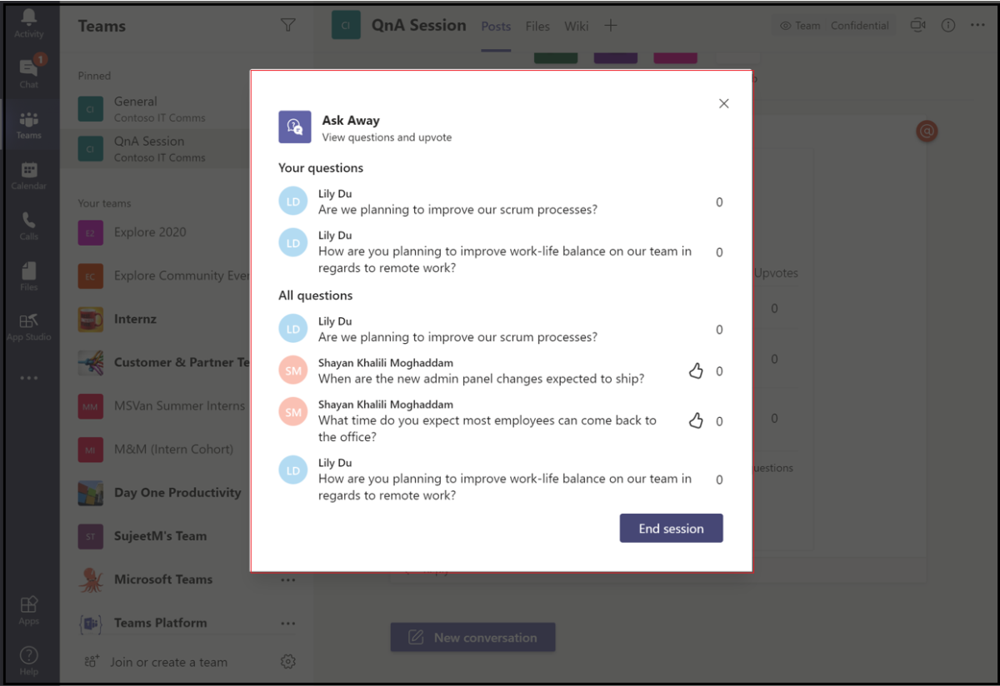
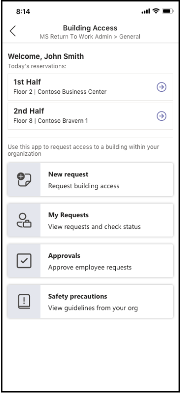
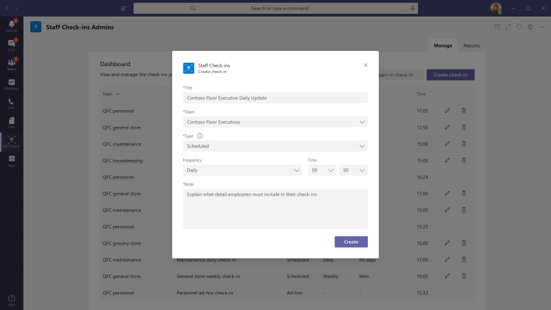

# Modelos de aplicativos para o Microsoft Teams

Os modelos de aplicativos são aplicativos prontos para produção para o Microsoft Teams que são orientados pela Comunidade, fontes abertas e disponíveis no GitHub. Cada uma contém instruções detalhadas para implantar e instalar o aplicativo para sua organização, fornecendo um aplicativo pronto para usar que você pode instalar e começar a usar imediatamente. O código-fonte completo também está disponível, para que você possa explorá-lo em detalhes ou bifurcar o código e alterá-lo para atender às suas necessidades específicas.

**&#9734; indica modelos de aplicativos recentemente liberados.**

### Principais benefícios

* **Experiência de plug and Play:** Todos os modelos de aplicativos incluem scripts de implantação que permitirão que você hospede todos os serviços necessários no Microsoft Azure. Nenhuma codificação é necessária para implantar os aplicativos.
* **Código pronto para produção:** Os modelos de aplicativos estão de acordo com as práticas recomendadas em relação à segurança e à infraestrutura, e todas as alterações enviadas à Comunidade são revisadas para garantir a conformidade contínua.
* **Personalizável e extensível:** Embora todos os modelos de aplicativos estejam prontos para implantar como estão, fornecemos toda a base de código e scripts de implantação para que você possa facilmente personalizá-los ou estendê-los para atender às suas necessidades exclusivas.
* **Documentação detalhada & suporte:** Todos os modelos de aplicativos são acompanhados por documentação de ponta a ponta nas etapas de arquitetura, implantação e configuração da solução. Os repositórios também são monitorados, portanto, informe qualquer problema que você encontrar, gerando um problema no GitHub.

## Peça para fora

Pergunte que é um [bot do Microsoft Teams](../bots/what-are-bots.md) que permite que os usuários conduzam as seções Q&a (pergunta e resposta) no Teams. Usando o bot de Perg, os membros da equipe podem enviar e receber perguntas compostas por colegas, permitindo Q&um hosts a reunir facilmente perguntas de alto nível em um canal ou chat. O bot pode ser usado para conduzir uma sessão Q&em tempo real em uma reunião do Teams e permite que os participantes Enviem perguntas ao vivo via chat.

[Obter no GitHub](https://github.com/OfficeDev/microsoft-teams-apps-askaway)

:::row:::
  :::column span="2":::
      
:::column-end:::
:::row-end:::

## Informações associadas

Associar o insights é um modelo de [aplicativos de energia](/powerapps/maker/canvas-apps/embed-teams-app) que permite que os funcionários de primeiro lugar capturem e enviem diretamente opiniões, opiniões e percepção do cliente. Os funcionários de primeiro lugar são geralmente o representante da empresa a ser direcionado para os clientes em um ponto de contato de um-para-um. Os dados coletados podem ser compartilhados e usados de forma colaborativa por equipes de negócios, por exemplo, por meio de uma guia do Power BI Teams, para melhorar o produto e aprimorar a experiência do cliente.

[Obter no GitHub](https://github.com/OfficeDev/microsoft-teams-apps-associateinsights)

:::row:::
  :::column span="2":::
      
:::column-end:::
:::row-end:::
:::row:::
:::column span="2":::
    
:::column-end:::
:::row-end:::

## Participação

O aplicativo de presença é uma guia [aplicativos de energia](/powerapps/maker/canvas-apps/embed-teams-app) que pode ser fixado em uma equipe. Ele foi projetado para registrar a presença, geralmente em configurações como ambientes de aprendizado e treinamento. Os usuários podem marcar ou editar a presença de até 30 dias no passado e exibir os relatórios de presença resumidos para um grupo inteiro ou participantes individuais.

[Obter no GitHub](https://github.com/OfficeDev/microsoft-teams-apps-attendance)

## Livro-a-Room

Book-a-Room é um [bot do Microsoft Teams](../bots/what-are-bots.md) que permite que os usuários encontrem e reservem rapidamente uma sala de reunião para 30 (padrão), 60 ou 90 minutos a partir da hora atual. Os escopos de bot de livro-a-Room para conversas pessoais ou de 1:1.

[Obter no GitHub](https://github.com/OfficeDev/microsoft-teams-apps-bookaroom)

## Acesso de criação

A criação de acesso é um aplicativo baseado em [plataforma de alimentação](https://powerapps.microsoft.com/blog/now-in-preview-customize-teams-with-built-in-power-platform-capabilities/)da Microsoft que dá suporte à administração da criação de limiares de ocupação e das normas de distancing social, permitindo que os diretores de recursos gerenciem, rastreiem e relatem a presença local do funcionário. O aplicativo, criado usando os [aplicativos de alimentação](/powerapps/powerapps-overview)da Microsoft, e a [automatização de energia](/power-automate/getting-started), integra-se totalmente ao Microsoft Teams e permite que as organizações determinem a criação da preparação, estabeleçam critérios de qualificação para o acesso no local e coletem insights para planejamento futuro.

[Obter no GitHub](https://github.com/OfficeDev/microsoft-teams-apps-buildingaccess)

:::row:::
   :::column span="":::
     
   :::column-end:::
   :::column span="":::
      
   :::column-end:::
:::row-end:::

## Celebrações

Comemorações é um aplicativo do teams que ajuda os membros da equipe a se comemorarem de aniversários, datas comemorativas e outros eventos recorrentes. Ele memoriza ocasiões especiais de todos os membros da equipe e envia uma mensagem amigável em todas as equipes selecionadas no momento da criação do evento, para fazer com que os membros da equipe se sintam especiais no dia.

O aplicativo fornece uma interface fácil para que todos os membros da equipe adicionem pessoal e visualizem seus eventos, além de permitir que o usuário selecione as equipes nas quais os eventos são compartilhados.

[Obter no GitHub](https://github.com/OfficeDev/microsoft-teams-celebrations-app)

## Lista de verificação

A lista de verificação é um aplicativo personalizado de [extensão de mensagens](../messaging-extensions/what-are-messaging-extensions.md) do Microsoft Teams que permite que você colabore com sua equipe criando uma lista de verificação compartilhada em um chat ou canal. O aplicativo é suportado em todos os clientes da plataforma de equipes — desktop, navegador, iOS e Android, e está pronto para implantação como parte da sua assinatura do Microsoft 365.  

[Obter no GitHub](https://github.com/OfficeDev/microsoft-teams-checklist-app )

:::row:::
:::column span="2":::
      
:::column-end:::
:::row-end:::

## &#9734; suspensa da sala de aula

O suplemento de sala de aula é um aplicativo baseado em plataforma de alimentação da Microsoft que permite que os líderes do sistema encontrem equipes de classe (sala de aula virtuais) e adicionem ou outras pessoas a essas equipes de classe para um período de [desligamento](https://powerapps.microsoft.com/blog/now-in-preview-customize-teams-with-built-in-power-platform-capabilities/)específico, conforme necessário. O aplicativo criado usando o Microsoft [Power apps](/powerapps/powerapps-overview) e a [automatização de energia](/power-automate/getting-started), integra-se totalmente ao Microsoft Teams para garantir que as instituições educacionais possam otimizar suas operações em um ambiente de aprendizado híbrido, fornecendo acesso a participantes relevantes para equipes de classe por necessidades comerciais.

[Obter no GitHub](https://github.com/OfficeDev/microsoft-teams-apps-classroom-dropin)

## Communicator da empresa

O aplicativo do Communicator da empresa permite que as equipes corporativas criem e enviem mensagens destinadas a várias equipes ou grande número de funcionários por meio de chat, permitindo que a organização atinja os funcionários com o direito de colaborar. Use este modelo para vários cenários, como novos comunicados de iniciativa, integração de funcionários, aprendizado e desenvolvimento modernos ou difusões em toda a organização.

O aplicativo fornece uma interface fácil para usuários designados para criar, Visualizar, colaborar e enviar mensagens.

Ele fornece uma base para criar recursos de comunicação direcionados personalizados, como telemetria personalizada em quantos usuários foram confirmados ou interagindo com uma mensagem.

[Obter no GitHub](https://github.com/OfficeDev/microsoft-teams-company-communicator-app)

## Pesquisa de grupo de contatos

O aplicativo de pesquisa de grupo de contatos fornece uma abordagem conveniente e útil para criar, acessar e gerenciar os grupos de contatos da sua organização (anteriormente conhecidos como listas de distribuição ou grupos de comunicação). Os usuários podem exibir rapidamente e bater papo com membros do grupo, exibir o status do membro e criar um chat de grupo com membros selecionados no grupo de contatos, tudo dentro do ambiente do teams.

[Obter no GitHub](https://github.com/OfficeDev/microsoft-teams-app-contactgrouplookup)

:::row:::
:::column span="2":::
      
:::column-end:::
:::row-end:::
:::row:::
:::column span="2":::
    
:::column-end:::
:::row-end:::

## &#9734; de apreciação de colegas de trabalho

Usando o modelo de reconhecimento de colegas no Microsoft Teams, os usuários podem reconhecer as realizações de seus colegas no contexto da equipe. Quando colegas de trabalho selecionam para recompensar um colega, os destinatários e outros membros da equipe são marcados em uma conversa de canal e recebem uma notificação sobre os detalhes dos prêmios do canal. Os prêmios são registrados no aplicativo Teams, que é seguro, portátil e facilmente compartilhável. Isso pode ser considerado como a versão baseada em PowerApps do modelo de aplicativo de selos abertos, com um leaderboard.

[Obter no GitHub](https://github.com/OfficeDev/microsoft-teams-apps-coworker-appreciation)

## CrowdSourcer

CrowdSourcer é um [bot do Microsoft Teams](../bots/what-are-bots.md) que fornece às equipes consultadas informações que foram originadas de forma colaborativa de membros do grupo. É uma ótima maneira de responder às perguntas frequentes, permitindo que os participantes entrem em contato ativamente e contribuam para um recurso de informações divertido e útil.

[Obter no github](https://github.com/OfficeDev/microsoft-teams-crowdsourcer-app)

## Adesivos personalizados

Autoexpressão é essencial para uma cultura de equipe íntegra. Esse modelo de aplicativo é uma [extensão de mensagens](~/messaging-extensions/what-are-messaging-extensions.md) que permite que os usuários usem adesivos e gifs personalizados no Microsoft Teams. Este modelo oferece uma experiência de configuração fácil e baseada na Web, onde qualquer pessoa com acesso à configuração pode carregar os GIFs/adesivos/imagens que eles desejam que seus usuários finais tenham, permitindo que toda a equipe use qualquer conjunto de adesivos escolhido.

Este aplicativo também permite o compartilhamento fácil de imagens/GIFs/adesivos entre equipes sem precisar de acesso a sites do SharePoint ou canais individuais como mecanismos de armazenamento e compartilhamento. Por exemplo, as equipes de produto podem compartilhar facilmente imagens de produtos e GIFs para equipes de mídia social, marketing e vendas programaticamente. Um também pode estender esse aplicativo, disparando um fluxo de notificação para equipes ou pessoas específicas quando novas imagens/GIFs forem disponibilizadas.

[Obter no GitHub](https://github.com/OfficeDev/microsoft-teams-stickers-app)

## Ideias de funcionários &#9734;

O aplicativo de idéias para funcionários é a versão do PowerApps do modelo de aplicativo de grandes ideias do Azure. O aplicativo permite que os usuários do teams configurem e configurem uma campanha de ideia. Uma campanha de ideia é uma categoria para agrupar ideias em relação a temas comuns.

Os usuários do teams também podem realizar as seguintes atividades:
* Configure um formulário de envio padrão que os funcionários precisam enviar para cada ideia. 
* Revise e gerencie as ideias e a lista de campanhas.
* Modificar e excluir campanhas.
* Revise as placas-guia de ideias.
* Vote em e Compartilhe ideias priorizadas.
* Enviar ideias para uma campanha.
* Exibir a idéia de outros membros da equipe.
* Vote em idéias curtidas.
* Revise o desempenho de suas ideias comparadas com outras pessoas em uma campanha.

[Obter no GitHub](https://github.com/OfficeDev/microsoft-teams-apps-employeeideas)

 

## E-prescrições 

E-prescrições é um aplicativo baseado em [aplicativos de energia](/powerapps/maker/canvas-apps/embed-teams-app)que aprimora a telemedicina e o tratamento virtual ao automatizar o processo de emissão e-prescrições para pacientes. Profissionais médicos podem revisar rapidamente compromissos, gerar e-prescrições e enviar emails com anexos da e-médica para pacientes diretamente dentro da plataforma do teams.

[Obter no GitHub](https://github.com/OfficeDev/microsoft-teams-apps-eprescription) 

:::row:::
:::column span="2":::
      
:::column-end:::
:::row-end:::
:::row:::
:::column span="2":::
    
:::column-end:::
:::row-end:::

## Treinamento de funcionários 

O treinamento de funcionários é um aplicativo do Microsoft Teams que permite que os organizadores publiquem, rastreiem e promovam facilmente eventos de aprendizado e treinamento para sua organização.  Com o aplicativo, os planejadores de eventos podem enviar lembretes e notificações a eventos inscritos e os funcionários podem indicar interesse em eventos futuros, permanecer atualizados em eventos atuais e compartilhar detalhes do evento com colegas por meio da extensão de mensagens do Microsoft Teams.

[Obter no GitHub](https://github.com/OfficeDev/microsoft-teams-apps-employeetraining)

:::row:::
:::column span="2":::
    **Exibir eventos**   
:::column-end:::
:::row-end:::
:::row:::
:::column span="2":::
    **Criar evento** 
:::column-end:::
:::row-end:::

## Localizador especialista

O expert Finder é um [bot do Microsoft Teams](../bots/what-are-bots.md) que identifica membros específicos da organização com base em seus respectivos atributos de qualificações, interesses e educação. Membros encontrem especialistas em uma organização que correspondam a uma pesquisa de palavra-chave dos perfis de usuário do Azure Active Directory.

[Obter no GitHub](https://github.com/OfficeDev/microsoft-teams-apps-expertfinder)

## Perguntas Frequentes Plus

A conversa Q&um bots é uma maneira fácil de fornecer respostas para perguntas frequentes dos usuários. No entanto, a maioria dos bots falha ao se envolver com usuários de forma significativa, pois não há nenhum homem no loop quando o bot falha. O bot de perguntas frequentes é um&amigável para um bot que traz um homem no loop quando não é possível ajudar. É possível fazer uma pergunta ao bot e o bot responde com uma resposta se ela estiver contida na base de dados de conhecimento. Caso contrário, o bot permite que o usuário envie uma consulta que, em seguida, é lançada em uma equipe pré-configurada de especialistas que ajudam a fornecer suporte, agindo de dentro da própria equipe.

> [!NOTE]
> A versão mais recente do **FAQ Plus** oferece suporte a uma resolução de p&a melhor, permitindo que uma equipe de especialistas realize o seguinte:
>
> &#x2714; adicionar novos Q&diretamente à base de dados de conhecimento usando extensões de mensagem.
>
> &#x2714; editar e excluir Q&um par adicionado por um bot.
>
> &#x2714; rastrear o histórico de revisão de Q&como.
>
> &#x2714; configurar uma resposta com detalhes adicionais para exibir como um [cartão adaptável](../task-modules-and-cards/cards/cards-reference.md#adaptive-card).
>
[Obter no GitHub](https://github.com/OfficeDev/microsoft-teams-apps-faqplusv2)

## Controlador de meta

O aplicativo de controlador de meta é uma solução abrangente para que sua organização dê suporte ao estabelecimento de metas, a observação do progresso e a confirmação do sucesso no Microsoft Teams. O aplicativo permite que os usuários definam, rastreiem e atualizem objetivos em nível profissional, pessoal e de equipe. Os membros da equipe também recebem lembretes oportunas e atualizações de status para manter o foco e permanecer no controle.

[Obter no GitHub](https://github.com/OfficeDev/microsoft-teams-app-goaltracker)

:::row:::
  :::column span="2":::
      
:::column-end:::
:::row-end:::
:::row:::
:::column span="2":::
    
:::column-end:::
:::row-end:::

## Boas ideias

O aplicativo de ótimas ideias oferece suporte e capacita a inovação e a criatividade em sua organização. O aplicativo permite que seus funcionários compartilhem ideias com colegas e liderança, descubram novos envios, contribuições de destaque para consideração de ponto e transmitir seus votos para as melhores propostas no Microsoft Teams.

[Obter no GitHub](https://github.com/OfficeDev/microsoft-teams-apps-greatideas)

:::row:::
  :::column span="2":::
      
:::column-end:::
:::row-end:::
:::row:::
:::column span="2":::
    
:::column-end:::
:::row-end:::

## Atividades de grupo

As atividades de grupo são um aplicativo do Microsoft Teams que facilita para os proprietários de equipe criarem rapidamente grupos de atividades e gerenciar fluxos de trabalho de colaboração dentro do contexto do Microsoft Teams. Os autores de atividade estão habilitados para criar atividades, distribuir aleatoriamente membros da equipe em grupos e, opcionalmente, fazer com que o bot envie lembretes até que as atividades sejam concluídas.

[Obter no GitHub](https://github.com/OfficeDev/microsoft-teams-apps-groupactivities)

:::row:::
  :::column span="2":::
      
:::column-end:::
:::row-end:::
:::row:::
:::column span="2":::
    
:::column-end:::
:::row-end:::

## Amplie suas habilidades

O aplicativo crescimento de suas habilidades oferece suporte para o crescimento e o desenvolvimento de profissionais, permitindo que os funcionários contribuam para projetos complementares da sua organização enquanto conhecem simultaneamente novas habilidades. Os funcionários podem usar o aplicativo para localizar oportunidades que atendam aos seus interesses, desfrutar de colaboração significativa com colegas e adquirir novos níveis de expertise e recursos, tudo dentro do ambiente do teams.

[Obter no GitHub](https://github.com/OfficeDev/microsoft-teams-apps-growyourskills)

:::row:::
  :::column span="2":::
      
:::column-end:::
:::row-end:::
:::row:::
:::column span="2":::
    
:::column-end:::
:::row-end:::

## Suporte de RH

O bot de suporte de RH é um&amigável para um bot que oferece um profissional de suporte/especialista da equipe de RH no loop quando não é possível ajudar. É possível fazer uma pergunta ao bot e o bot responde com uma resposta se ela estiver contida na base de dados de conhecimento. Caso contrário, o bot permite que o usuário envie uma consulta que, em seguida, é lançada em uma equipe pré-configurada de especialistas que ajudam a fornecer suporte, agindo de dentro da própria equipe. Além disso, o bot sugere links para as políticas/perguntas de RH recomendadas pesquisando marcas pré-configuradas na pergunta. Esses blocos também podem ser encontrados na guia associada como uma referência rápida. O suporte a RH funciona bem para o QnA de peso leve e para oferecer suporte rápido ao lançar novos projetos/iniciativas na organização.

[Obter no GitHub](https://github.com/OfficeDev/microsoft-teams-hrsupport-app)

## Frases de apresentação

O Icebreaker é um [bot do Microsoft Teams](../bots/what-are-bots.md) que ajuda sua equipe a ficar mais perto ao emparelhar dois membros aleatórios da equipe a cada semana para atender. O bot torna o agendamento fácil, sugerindo automaticamente as horas livres que funcionam para ambos os membros. Fortaleça as conexões pessoais e construa uma Knit Community com esse aplicativo.

Além de encorajar as conexões pessoais em toda a sua equipe, o aplicativo do Icebreaker pode ajudar a cultivar comunidades baseadas em interesses dentro da sua organização. Por exemplo, você pode usar este aplicativo para um grupo de interesse do DevOps para ajudar as ideias e práticas recomendadas espalhadas de forma orgânica em sua organização.

[Obter no GitHub](https://github.com/OfficeDev/microsoft-teams-icebreaker-app)

## Incentivo

Incentivos é um modelo de [aplicativos de energia](/powerapps/maker/canvas-apps/embed-teams-app) que gerencia e controla a participação do funcionário do incentivized em atividades designadas, como treinamentos e iniciativas de gerenciamento de alterações. Os administradores usam o aplicativo para estabelecer atividades designadas, atribuir pontos para conclusão e especificar os níveis de ponto de qualificação necessários para prêmios. Os funcionários usam o aplicativo para exibir seus pontos acumulados e, ao atingir as recompensas de qualificação, solicitação e reivindicação retidas.

[Obter no GitHub](https://github.com/OfficeDev/microsoft-teams-apps-incentives)

## Gerador de verificação de incidentes

O incidentes reporter é um [bot do Microsoft Teams](../bots/what-are-bots.md)  que otimiza o gerenciamento de incidentes em sua organização. O bot facilita a coleta automatizada de dados de incidentes, relatórios de incidentes personalizados, notificações relevantes dos interessados e acompanhamento de incidentes de ponta a ponta.

[Obter no GitHub](https://github.com/OfficeDev/microsoft-teams-apps-incidentreport)

:::row:::
  :::column span="2":::
      
:::column-end:::
:::row-end:::
:::row:::
:::column span="2":::
    
:::column-end:::
:::row-end:::

## &#9734; de inspeção

 A inspeção é um aplicativo do Microsoft Teams que permite que os funcionários de linha de frente inspecionem qualquer coisa de locais para ativos e equipamentos. Por exemplo, uma loja de varejo, instalações de produção ou veículos e máquinas. Há dois aplicativos nesta solução, cada um destinado a diferentes tipos de usuários.

O aplicativo capacita os funcionários da linha frontal a inspecionar um ativo ou uma área, gerenciar a qualidade de produtos e serviços ou manter a segurança no local de trabalho. Ele facilita a comunicação entre membros da equipe para lidar com problemas encontrados durante a inspeção. O aplicativo fornece relatórios simples para gerentes para agilizar a resolução de problemas e realçar as tendências.

[Obter no GitHub](https://github.com/OfficeDev/microsoft-teams-apps-inspection)

   

## Relatórios de problemas &#9734;

O aplicativo de relatório de problemas permite que os funcionários e gerentes gerem e gerenciem problemas. Ele consiste em dois aplicativos, issue Reporting app para relatar problemas e gerenciar o aplicativo problemas para gerenciar problemas.

Os gerentes de equipe usam o aplicativo gerenciar problemas para configurar a experiência do aplicativo, incluindo o canal no qual as mensagens do Microsoft Teams e do Planner são criadas pelo aplicativo. Os gerentes também usam o aplicativo para criar formulários de modelo para coletar detalhes quando um usuário relata um problema. Por exemplo, revise, edite ou exclua formulários de modelo de problema. O aplicativo também pode ser usado para analisar problemas da equipe, relatar o histórico de problemas e gerenciar eficientemente a solução de problemas.

Os funcionários usam o aplicativo de relatório de problemas para registrar problemas e detalhes necessários para solucioná-los. O aplicativo também é usado para modificar e resolver problemas existentes e obter uma visão de alto nível de problemas individuais ou da equipe.

[Obter no GitHub](https://github.com/OfficeDev/microsoft-teams-apps-issuereporting)

  

## Integração de novos funcionários 

A integração de novos funcionários é uma solução integrada de integração do Microsoft Teams e [do SharePoint](https://lookbook.microsoft.com/details/75e60a32-9849-4ed4-b83e-b2b08983ad19) que permite que sua organização forneça uma experiência de integração consistente e de alta qualidade para os funcionários em sua jornada de novo contratação. O aplicativo pode ser usado por equipes de recursos humanos e gerentes de contratação para fornecer informações relevantes durante todo o processo de orientação e indução e por novas contratações para compartilhar comentários, fornecer introduções e concluir tarefas de integração.

[Obter no GitHub](https://github.com/OfficeDev/microsoft-teams-apps-newemployeeonboarding)

:::row:::
  :::column span="2":::
    Cartão de boas **-vindas do novo funcionário** 
:::column-end:::
:::row-end:::
:::row:::
:::column span="2":::
    **Nova lista de verificação**   
:::column-end:::
:::row-end:::

## Abrir selos

Os crachás abertos são um aplicativo do Microsoft Teams que permite que as pessoas ganhem selos de credenciais de aprendizado digital no contexto da equipe e as compartilhem em qualquer lugar. Usando recursos da autoridade de emissão do selo digital de terceiros, o [Badgr](https://badgr.org/), os selos conferidos são registrados no perfil do Badgr do destinatário e estão disponíveis para criar e compartilhar uma imagem rica das jornadas de aprendizado de vida útil.

[Obter no GitHub](https://github.com/OfficeDev/microsoft-teams-apps-openbadges)

:::row:::
  :::column span="2":::
      
:::column-end:::
:::row-end:::
:::row:::
:::column span="2":::
    
:::column-end:::
:::row-end:::

## Quanto 

O Poll é um aplicativo personalizado de [extensão de mensagens](../messaging-extensions/what-are-messaging-extensions.md) do Microsoft Teams que permite criar e enviar pesquisas rapidamente em um chat ou canal para coletar opiniões e preferências da equipe. O aplicativo é suportado em todos os clientes da plataforma de equipes — desktop, navegador, iOS e Android, e está pronto para implantação como parte da sua assinatura do Microsoft 365.

[Obter no GitHub](https://github.com/OfficeDev/microsoft-teams-poll-app)

:::row:::
  :::column span="1":::
      
:::column-end:::
:::row-end:::

## Respostas rápidas

As respostas rápidas são um aplicativo do Microsoft Teams que oferece uma solução robusta para responder efetivamente às perguntas frequentes dos usuários. Em vez de responder a cada consulta de forma manual e repetida continuamente, o aplicativo criará uma biblioteca de respostas para uma experiência de usuário interativa por meio de [extensões de mensagens](../messaging-extensions/what-are-messaging-extensions.md)do Microsoft Teams.

[Obter no GitHub](https://github.com/OfficeDev/microsoft-teams-apps-quickresponses)

## Assistência rápida &#9734;

O Quick Assist é um aplicativo baseado na [plataforma de alimentação](https://powerapps.microsoft.com/blog/now-in-preview-customize-teams-with-built-in-power-platform-capabilities/) da Microsoft que permite ao cliente se conectar rapidamente aos especialistas para obter respostas rápidas, procurar informações, acompanhar solicitações abertas e permitir que os especialistas recebam notificações para obter rapidamente uma chamada para ajudar a responder perguntas. O aplicativo criado usando o Microsoft [Power apps](/powerapps/powerapps-overview) e a [automatização de energia](/power-automate/getting-started), integra-se totalmente ao Microsoft Teams para permitir que as organizações facilmente conectem os funcionários do linha com as conexões corporativas para resolver as consultas dos clientes e fornecer uma ótima experiência do cliente. 

[Obter no GitHub](https://github.com/OfficeDev/microsoft-teams-apps-rapid-assist)

:::row:::
   :::column span="":::
     
   :::column-end:::
   :::column span="":::
      
   :::column-end:::
:::row-end:::

## Reflexão 

O reflita é um aplicativo personalizado de [extensão de mensagens](../messaging-extensions/what-are-messaging-extensions.md) do Microsoft Teams que fornece um recurso seguro e inclusivo para que os membros da equipe compartilhem o estado de seus colegas e/ou os líderes de grupo diretamente no Teams. O aplicativo está disponível nos chats de canal, grupo, reunião e 1:1 e a resposta de check-in pode ser definida como público, privado para remetente ou totalmente anônimo.

[Obter no GitHub](https://github.com/OfficeDev/Microsoft-Teams-App-Reflect)

:::row:::
    :::column:::
    **Sondagem de bom desempenho**
    
    
    :::column-end:::
:::row-end:::

## Suporte remoto

O suporte remoto é um [bot do Microsoft Teams](../bots/what-are-bots.md) que fornece uma interface focalizada entre os solicitantes de suporte em toda a organização e na equipe de suporte interno.  Os usuários finais podem enviar, editar ou retirar solicitações de suporte e a equipe de suporte pode responder, gerenciar e atualizar solicitações em toda a plataforma do teams.

[Obter no GitHub](https://github.com/OfficeDev/microsoft-teams-apps-remotesupport)

:::row:::
  :::column span="2":::
      
:::column-end:::
:::row-end:::
:::row:::
:::column span="2":::
    
:::column-end:::
:::row-end:::

## Solicitação-a-equipe

O Request-a-Team é um aplicativo do Microsoft Teams que otimiza a criação de novas equipes para sua organização corporativa. O aplicativo dá suporte à padronização e às práticas recomendadas ao criar novas instâncias de equipe por meio da integração de um formulário de solicitação orientado por assistente, um processo de aprovação incorporado, um painel de status de solicitação e compilações automatizadas da equipe.

[Obter no GitHub](https://github.com/OfficeDev/microsoft-teams-apps-requestateam)

:::row:::
  :::column span="2":::
    
:::column-end:::
:::row-end:::
:::row:::
:::column span="2":::
    
:::column-end:::
:::row-end:::

## Scrums para canais

Os scrums para canais são um aplicativo assistente do Scrum que permite que os usuários agendem e executem Scrum em canais no Microsoft Teams. O aplicativo é ótimo para equipes e equipes remotas compostas por membros de diferentes locais geográficos e fusos horários para compartilhar atualizações diárias e garantir a participação em reuniões de parada do Scrum.

[Obter no GitHub](https://github.com/OfficeDev/microsoft-teams-apps-scrumsforchannels)

> [!NOTE]
> Para conduzir reuniões do Scrum em um chat de grupo, confira nosso modelo [de aplicativo de chat de grupo de Scrum](#scrums-for-group-chat) .

:::row:::
  :::column span="2":::
    
:::column-end:::
:::row-end:::
:::row:::
:::column span="2":::
    
:::column-end:::
:::row-end:::

## Scrums para chat de grupo

> [!NOTE]
> O modelo de aplicativo de status do Scrum foi atualizado e agora é Scrum para chat de grupo.

Os scrums para chat de grupo são um assistente de Scrum de apoio que permite que os membros de chat de grupo executem reuniões de reserva assíncronas e compartilhem facilmente suas atualizações diárias. Ele permite que todos os membros do grupo conversem para contribuir com o Scrum e exibir as atualizações feitas por outras pessoas na execução do Scrum.

[Obter no GitHub](https://github.com/OfficeDev/microsoft-teams-apps-scrumsforgroupchat)

## Compartilhar agora 

O aplicativo compartilhar agora promove a troca positiva de informações entre colegas, permitindo que os usuários compartilhem facilmente o conteúdo dentro do ambiente do teams. Os usuários participam do aplicativo para compartilhar itens de interesse com os membros da equipe, descobrir o novo conteúdo compartilhado, definir preferências e marcar favoritos para leitura posterior.

[Obter no GitHub](https://github.com/OfficeDev/microsoft-teams-apps-sharenow)

## Pesquisa de lista do SharePoint

A colaboração no Microsoft Teams freqüentemente faz referência a informações contidas em itens em uma lista do SharePoint. Simplesmente colar um link para o item em questão obriga todos a mudar o contexto da conversa, localizar as informações necessárias e, em seguida, retornar ao Teams para continuar a conversa. Como a conversa continua normalmente, as pessoas terão que voltar para o item de referência várias vezes para verificar novos comentários e atualizar suas memórias de informações contidas no item. Essa alternância de contexto cria uma barreira para a colaboração suave e é uma receita para coisas que ocorrem por meio de rachaduras.

Para ajudar a aliviar esse problema, estamos felizes em trazer para você o modelo de aplicativo de pesquisa de lista. Milhões de usuários usam o SharePoint para alimentar alguns dos fluxos de trabalho principais em suas organizações. No entanto, colaborar em listas pode ser especialmente entediante. Usando o modelo de aplicativo de pesquisa de lista no Microsoft Teams, os usuários podem inserir informações de itens de lista do SharePoint diretamente em uma conversa de chat para aliviar a alternância de contexto causada pela simples inserção de um link em um chat. As informações são inseridas como um cartão de formatação automática fácil de ler, ajudando os usuários a se manterem envolvidos na conversa.

[Obter no GitHub](https://github.com/OfficeDev/microsoft-teams-list-search-app)

## Check-ins de equipe

Check-ins de equipe é um aplicativo baseado em [aplicativos de energia](/powerapps/powerapps-overview)que permite a comunicação de supervisão entre sua equipe de negócios e de campo. A equipe pode facilmente fornecer informações de tempo e atualizações de status essenciais, de acordo com uma base agendada ou ad hoc, diretamente do Microsoft Teams. O aplicativo suporta local, Fotos e anotações em tempo real, bem como notificações de lembrete e fluxos de trabalho automatizados.

[Obter no GitHub](https://github.com/OfficeDev/microsoft-teams-apps-staffcheckins)

## Pesquisa

A pesquisa é um aplicativo personalizado de [extensão de mensagens](../messaging-extensions/what-are-messaging-extensions.md) do Microsoft Teams que permite criar uma pesquisa em um chat ou canal para coletar dados e obter informações acionáveis.  O aplicativo é suportado em todos os clientes da plataforma de equipes — desktop, navegador, iOS e Android, e está pronto para implantação como parte da sua assinatura do Microsoft 365.  

[Obter no GitHub](https://github.com/OfficeDev/Microsoft-Teams-Survey-app)

:::row:::
  :::column span="2":::
    
:::column-end:::
:::row-end:::

## &#9734; de arredondamento virtual

Os fornecedores de hospital e de sala de emergência fazem dúzias e, em geral, centenas de "rodadas" por dia. Esses check-ins rápidos nos pacientes se destinam a fornecer uma verificação de status sobre o funcionamento do paciente e garantir que as preocupações dos pacientes sejam atendidas. Enquanto o arredondamento é uma prática essencial para garantir que os pacientes estejam sendo monitorados por vários tipos de provedores, eles representam um grande dreno no PPE, porque para cada visita, de cada provedor, uma nova máscara e um novo conjunto de luvas devem ser usados. Com esses modelos de aplicativos, os funcionários médicos podem realizar rapidamente rodadas praticamente, por meio de uma reunião do Microsoft Teams entre o provedor e o paciente.

A solução de arredondamento virtual também é referenciada na [postagem do blog](https://aka.ms/teamsvirtualrounding)de saúde e ciências biomédicas da Microsoft.

[Obter no GitHub](https://github.com/SmartterHealth/Virtual-Rounding)

## Gerenciamento de visitantes

O aplicativo de gerenciamento de visitantes permite que sua organização e funcionários gerenciem de forma fácil e eficiente o processo de visitante no local, diretamente no Microsoft Teams. O aplicativo permite que os funcionários criem solicitações de visitantes, controlem centralmente um status de solicitação por meio do painel do visitante e recebam notificações em tempo real quando um visitante chegar.

[Obter no GitHub](https://github.com/OfficeDev/microsoft-teams-app-visitormanagement)

:::row:::
  :::column span="2":::
    
:::column-end:::
:::row-end:::
:::row:::
:::column span="2":::
    
:::column-end:::
:::row-end:::

## Prêmios do local de trabalho

Prêmios de área de trabalho é um modelo de aplicativo do teams que fornece uma estrutura positiva para promover o reconhecimento e incentivar a cultura da apreciação dos funcionários no local de trabalho moderno. O aplicativo permite que você configure e gerencie um programa de recompensa e reconhecimento de funcionários (R&R), onde os funcionários podem facilmente acessar e endossar os colegas e o seu líder em R&R pode exibir indicações enviadas, conceder prêmios e anunciar destinatários.

[Obter no GitHub](https://github.com/OfficeDev/microsoft-teams-apps-workplaceawards)

:::row:::
  :::column span="2":::
    
:::column-end:::
:::row-end:::
:::row:::
:::column span="2":::
    
:::column-end:::
:::row-end:::

Tem uma ideia para um modelo de aplicativo que você gostaria de ver? [Informe-nos](https://forms.office.com/Pages/ResponsePage.aspx?id=v4j5cvGGr0GRqy180BHbR2_7qFm_lcZAr4eqEhnLsZ9UMVZGT1lCT0FXUDdZMUM0RkpBS1BESTAwWC4u).
