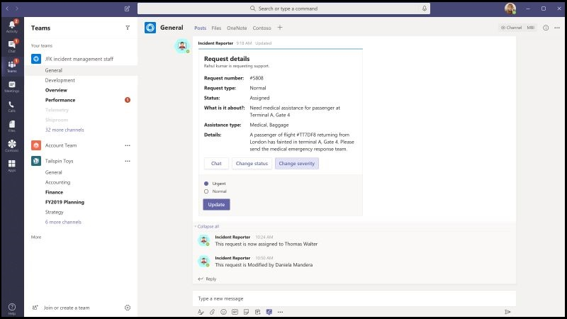

# Modelos de aplicativos para o TeamsApp templates for Microsoft Teams

Modelos de aplicativo são exemplos de aplicativos completos para o Microsoft Teams que são de código aberto e disponíveis no GitHub.App templates are examples of complete apps for Microsoft Teams that are open-source and available on GitHub. Cada modelo de aplicativo contém instruções detalhadas para implantar e instalar esse aplicativo para sua organização.Each app template contains detailed instructions for deploying and installing that app for your organization. Ele também fornece um aplicativo de exemplo que você pode instalar e começar a usar imediatamente.It also provides a sample app that you can install and begin using immediately. O código-fonte completo também está disponível, o que permite explorá-lo em detalhes ou bifurcar o código e alterá-lo para atender aos seus requisitos específicos.The complete source code is available too, which allows you to explore it in detail or fork the code and alter it to meet your specific requirements.
Todos os modelos de aplicativo são fornecidos nos termos de [Licença do MIT.](https://github.com/OfficeDev/microsoft-teams-apps-eprescription/blob/master/LICENSE)All app templates are provided under the [MIT License](https://github.com/OfficeDev/microsoft-teams-apps-eprescription/blob/master/LICENSE) terms.
> [!NOTE] 
> Você deve licenciar e dar suporte a aplicativos criados a partir de modelos de aplicativos para seus usuários e organizações.You must license and support apps created from app templates for your users and organizations. A Microsoft não é responsável por licenças e suporte.Microsoft is not responsible for licenses and support.

**&#9734; Indica modelos de aplicativo recém-lançados.****&#9734; Indicates newly released app templates.**

### Principais benefíciosKey benefits

* **Implantar diretamente na nuvem:** Todos os modelos de aplicativo incluem scripts de implantação que permitem hospedar todos os serviços necessários no Microsoft Azure ou na Plataforma Power.**Deploy directly to the cloud:** All app templates include deployment scripts that allows you to host all required services in Microsoft Azure or the Power Platform. 
* **Código de exemplo recomendado:** Os modelos de aplicativo estão em conformidade com as práticas recomendadas em torno da segurança e da infraestrutura.**Recommended sample code:** The app templates conform to recommended best practices around security and infrastructure. Todas as alterações enviadas pela comunidade aos modelos de aplicativos são revisadas para garantir a conformidade.All community submitted changes to the app templates are reviewed to ensure conformance.
* **Personalizável e extensível:** Embora todos os modelos de aplicativo possam ser implantados com configuração mínima, fornecemos toda a base de código e scripts de implantação para que você possa personalizá-los ou estendí-los facilmente para se ajustar às suas necessidades exclusivas.**Customizable and extensible:** While all app templates can be deployed with minimal configuration, we provide the entire code base and deployment scripts so that you can easily customize or extend them to fit your unique needs.
* **Documentação detalhada:** Todos os modelos de aplicativo são acompanhados por documentação de ponta a ponta em etapas de arquitetura de solução, implantação e configuração.**Detailed documentation:** All app templates are accompanied by end-to-end documentation on solution architecture, deployment, and configuration steps.  

## Bot de adoçãoAdoption Bot 

O Bot de Adoção é um bot de chat de cuidado do usuário criado com o Power Virtual Agent for Teams (PVA).Adoption Bot is a user care chat bot built with Power Virtual Agent for Teams (PVA). Ele pode ser considerado como a versão PVA do FAQPlus.It can be considered as the PVA version of FAQPlus. O Bot de Adoção responde a mais de 100 perguntas comuns sobre o Microsoft 365 e o Teams.Adoption Bot answers 100+ common questions about Microsoft 365 and Teams. Você pode editar os tópicos existentes, adicionar seus próprios tópicos e ingerir perguntas frequentes existentes.You can edit the existing topics, add your own topics, and ingest existing FAQs. Se os usuários precisarem de ajuda adicional, o Bot de Adoção poderá conectá-los a especialistas ou até mesmo ser estendido para abrir tíquetes de serviço com conectores de fluxo premium. Esse bot pode ser instalado por conta própria ou integrado a um aplicativo personalizado, como o [Hub de Adoção.](https://github.com/akporzondek/adoption_hub)If users need additional help, Adoption Bot can connect them to experts or even be extended to open service tickets with premium flow connectors.This bot can be installed on it's own or built into a custom app like the [Adoption Hub](https://github.com/akporzondek/adoption_hub).

[Obter no GitHubGet it on GitHub](https://github.com/OfficeDev/microsoft-teams-apps-adopt-bot)

## Ferramenta de Adoção - Plataforma de Gerenciamento de Campeões &#9734;Adoption Tool- Champion Management Platform &#9734;

O modelo de aplicativo da Plataforma de Gerenciamento de Campeões (CMP) ajuda você a gerenciar, dimensionar e inspirar seus defensores do trabalho em equipe a obter mais.The Champion Management Platform (CMP) app template helps you manage, scale, and inspire your teamwork champions to achieve more. Este modelo de aplicativo é criado na Estrutura do SharePoint e carregado em uma guia dentro de uma equipe.This app template is built on the SharePoint Framework and loaded into a tab within a team. Os grupos podem aproveitar essa ferramenta para ajudar a gerenciar a associação ao programa, fornecer uma tabela de líderes e tipos de eventos para registro em log e ferramentas para sobrepor selos digitais aos participantes do programa.Groups can leverage this tool to help manage program membership, provide a leaderboard and event types for logging, and tools to overlay digital badges to program participants.

[Obter no GitHubGet it on GitHub](https://github.com/OfficeDev/microsoft-teams-apps-champion-management)

## Ferramenta de Adoção - Microsoft 365 Learning Pathways (Get Started) &#9734;Adoption Tool- Microsoft 365 Learning Pathways (Get Started) &#9734;

O modelo de aplicativo Get Started permite que você traga o poder dos caminhos de aprendizado do Microsoft 365 para dentro do Microsoft Teams.The Get Started app template allows you to bring the power of Microsoft 365 learning pathways inside of Microsoft Teams. Este modelo de aplicativo permite que você conceda fácil acesso a páginas de treinamento específicas ou outros ativos de intranet e carregue o conteúdo diretamente no Teams.This app template allows you to grant easy access to specific training pages or other intranet assets and load the content directly within Teams. Você também pode alterar o nome do aplicativo ou o logotipo para corresponder à identidade visual da sua empresa.You can also change the app name or logo to match your company branding.

[Obter no GitHubGet it on GitHub](https://github.com/msft-teams/tools/tree/master/M365%20Learning%20Pathways)

## Gerenciador de CompromissosAppointment Manager 

O Gerenciador de Compromissos é um modelo de aplicativo do Teams para ajudar as empresas a criar, gerenciar e conduzir compromissos virtuais com os consumidores por meio do Teams.Appointment Manager is a Teams app template to help businesses create, manage, and conduct virtual appointments with consumers through Teams. As novas solicitações de compromisso dos consumidores ficam visíveis nos canais do Teams, onde eles podem ser atribuídos e reatribuídos rapidamente à equipe em uma equipe.New appointment requests from consumers are visible in Teams channels, where they can quickly be assigned and reassigned to staff in a team. As solicitações de compromisso podem ser exibidas em níveis de equipe ou pessoal por meio de guias personalizadas.Appointment requests can be viewed at team or personal levels through custom tabs. Cada compromisso é associado a uma reunião online do Teams, portanto, a equipe e os consumidores podem participar facilmente da reunião no horário agendado.Every appointment is associated with a Teams online meeting, hence the staff and consumers can easily join the meeting at the scheduled time.

O modelo de aplicativo se integra ao Microsoft Bookings para facilitar o gerenciamento de compromissos.The app template integrates with Microsoft Bookings for easy appointment management. Os compromissos agendados aparecem automaticamente nos calendários dos membros da equipe atribuídos, e os consumidores recebem notificações de email e lembretes personalizáveis com links de reunião incorporados.Scheduled appointments automatically appear on assigned staff members' calendars, and consumers receive customizable email notifications and reminders with embedded meeting links.

[Obter no GitHubGet it on GitHub](https://github.com/OfficeDev/microsoft-teams-apps-appointment-manager)

 

## Ask AwayAsk Away

Ask Away é um [bot do Microsoft Teams](../bots/what-are-bots.md) que permite que os usuários conduzam sessões de Q&A (Pergunta e Resposta) no Teams.Ask Away is a [Microsoft Teams bot](../bots/what-are-bots.md) that enables users to conduct Q&A (Question and Answer) sessions within Teams. Usando o bot Ask Away, os membros da equipe podem enviar e fazer perguntas de votação compartilhadas por colegas, permitindo que os hosts de Q&A reúnam facilmente perguntas importantes em um canal ou chat.Using the Ask Away bot, team members can submit and up-vote questions shared by colleagues allowing Q&A hosts to easily gather top-of-mind questions within a channel or chat. O bot pode ser usado para conduzir um Q em tempo real&uma sessão em uma reunião do Teams e permite que os participantes enviem perguntas ao vivo via chat.The bot can be used to conduct a real-time Q&A session in a Teams meeting and allows attendees to submit questions live via chat.

[Obter no GitHubGet it on GitHub](https://github.com/OfficeDev/microsoft-teams-apps-askaway)

:::row:::
  :::column span="2":::
      
:::column-end:::
:::row-end:::

## Informações associadasAssociate Insights

Associate Insights é um [modelo do Power Apps](/powerapps/maker/canvas-apps/embed-teams-app) que permite que os funcionários de primeira linha capturem e enviem diretamente a opinião, o sentimento e a percepção do cliente.Associate Insights is a [Power Apps](/powerapps/maker/canvas-apps/embed-teams-app) template that empowers firstline workers to directly capture and submit customer opinion, sentiment, and perception. Os funcionários de primeira linha geralmente são o primeiro representante da empresa a se envolver com os clientes em um ponto de contato de um para um.Firstline workers are often the first company representative to engage with customers in a one-to-one point-of contact. Os dados coletados podem ser compartilhados e usados de forma colaborativa por equipes de negócios, por exemplo, por meio de uma guia do Power BI Teams, para melhorar o produto e melhorar a experiência do cliente.The collected data can be shared and used collaboratively by business teams, e.g., via a Power BI Teams tab, for product improvement and enhancing the customer experience.

[Obter no GitHubGet it on GitHub](https://github.com/OfficeDev/microsoft-teams-apps-associateinsights)

:::row:::
  :::column span="2":::
      
:::column-end:::
:::row-end:::
:::row:::
:::column span="2":::
    
:::column-end:::
:::row-end:::

## ParticipaçãoAttendance

O aplicativo De presença é uma [guia do Power Apps](/powerapps/maker/canvas-apps/embed-teams-app) que pode ser fixada em uma equipe.The Attendance app is a [Power Apps](/powerapps/maker/canvas-apps/embed-teams-app) tab that can be pinned in a team. Ele foi projetado para registrar a presença, normalmente em configurações como ambientes de aprendizado e treinamento.It is designed to record presence, typically in settings such as learning and training environments. Os usuários podem marcar ou editar a participação por até 30 dias no passado e exibir relatórios de participação resumidos para um grupo inteiro ou participantes individuais.Users can mark or edit attendance for up to 30 days in the past and view summarized attendance reports for an entire group or individual attendees.

[Obter no GitHubGet it on GitHub](https://github.com/OfficeDev/microsoft-teams-apps-attendance)

## Book-a-roomBook-a-room

Book-a-room é um bot do [Microsoft Teams](../bots/what-are-bots.md) que permite aos usuários encontrar e reservar rapidamente uma sala de reunião para 30 (padrão), 60 ou 90 minutos a partir da hora atual.Book-a-room is a [Microsoft Teams bot](../bots/what-are-bots.md) that lets users quickly find and reserve a meeting room for 30 (default), 60, or 90 minutes starting from the current  time. Os escopos de bot book-a-room para conversas pessoais ou 1:1.The Book-a-room bot scopes to personal or 1:1 conversations.

[Obter no GitHubGet it on GitHub](https://github.com/OfficeDev/microsoft-teams-apps-bookaroom)

## Criando o AccessBuilding Access

O Building Access é um aplicativo baseado na Plataforma Do Microsoft [Power](https://powerapps.microsoft.com/blog/now-in-preview-customize-teams-with-built-in-power-platform-capabilities/)que oferece suporte à administração da criação de limites de ocupação e de normas de distanciamento social, permitindo que os diretores de instalações gerenciem, acompanhem e reportem a presença do funcionário no local.Building Access is a Microsoft [Power Platform](https://powerapps.microsoft.com/blog/now-in-preview-customize-teams-with-built-in-power-platform-capabilities/)-based app that supports the administration of building occupancy thresholds and social distancing norms by enabling facilities directors to manage, track, and report employee on-site presence. O aplicativo, criado usando o Microsoft [Power Apps](/powerapps/powerapps-overview)e o [Power Automate,](/power-automate/getting-started)integra-se profundamente com o Microsoft Teams e permite que as organizações determinem a preparação para a criação, estabeleçam critérios de qualificação para acesso local e reúnam ideias para o planejamento futuro.The app, built using Microsoft [Power Apps](/powerapps/powerapps-overview), and [Power Automate](/power-automate/getting-started), deeply integrates with Microsoft Teams and enables organizations to determine building readiness, establish eligibility criteria for on-site access, and gather insights for future planning.

[Obter no GitHubGet it on GitHub](https://github.com/OfficeDev/microsoft-teams-apps-buildingaccess)

:::row:::
   :::column span="":::
     
   :::column-end:::
   :::column span="":::
      
   :::column-end:::
:::row-end:::

## CelebraçõesCelebrations

Celebrações é um aplicativo do Teams que ajuda os membros da equipe a comemorar aniversários, aniversários e outros eventos recorrentes.Celebrations is a Teams app that helps team members celebrate each others' birthdays, anniversaries, and other recurring events. Ele lembra ocasiões especiais de todos os membros da equipe e envia uma mensagem amigável em todas as equipes selecionadas no momento da criação do evento, para fazer com que os membros da equipe se sintam especiais em seus dias.It remembers special occasions of all the team members and sends a friendly message in all the teams selected at the time of event creation, to make the team members feel special on their day.

O aplicativo fornece uma interface fácil para todos os membros da equipe adicionarem e exibirem seus eventos pessoalmente e também permitem que o usuário selecione as equipes nas quais os eventos são compartilhados.The app provides an easy interface for all the team members to personally add and view their events and also allows the user to select the teams in which the events gets shared.

[Obter no GitHubGet it on GitHub](https://github.com/OfficeDev/microsoft-teams-celebrations-app)

## Lista de verificaçãoChecklist

Lista de verificação é um aplicativo de extensão de mensagens personalizado do Microsoft [Teams](../messaging-extensions/what-are-messaging-extensions.md) que permite que você colabore com sua equipe criando uma lista de verificação compartilhada em um chat ou canal.Checklist is a custom Microsoft Teams [messaging extension](../messaging-extensions/what-are-messaging-extensions.md) app that enables you to collaborate with your team by creating a shared checklist in a chat or channel. O aplicativo tem suporte em todos os clientes de plataforma do Teams — desktop, navegador, iOS e Android — e está pronto para implantação como parte da sua assinatura do Microsoft 365.The app is supported across all Teams platform clients —  desktop, browser, iOS, and Android — and is ready for deployment as part of your Microsoft 365 subscription.  

[Obter no GitHubGet it on GitHub](https://github.com/OfficeDev/microsoft-teams-checklist-app )

:::row:::
:::column span="2":::
      
:::column-end:::
:::row-end:::

## Drop-in de sala de aulaClassroom Drop-in 

O Drop-in de sala de aula é um aplicativo baseado na Plataforma [Microsoft Power](https://powerapps.microsoft.com/blog/now-in-preview-customize-teams-with-built-in-power-platform-capabilities/)que permite que os líderes do sistema encontrem equipes de classe (salas de aula virtuais) e adicionem a si mesmos ou outras pessoas a essas equipes de classe por um período de entrega especificado, conforme necessário.Classroom Drop-in is a Microsoft [Power Platform](https://powerapps.microsoft.com/blog/now-in-preview-customize-teams-with-built-in-power-platform-capabilities/)-based app that enables system leaders to find class teams (virtual classrooms) and add themselves or others to these class teams for a specified drop-in period, as needed. O aplicativo criado usando o Microsoft [Power Apps](/powerapps/powerapps-overview) e o [Power Automate](/power-automate/getting-started), integra-se profundamente ao Microsoft Teams para garantir que os institutos educacionais possam otimizar suas operações em um ambiente de aprendizado híbrido, fornecendo acesso a participantes relevantes para equipes de classe por requisitos comerciais.The app built using Microsoft [Power Apps](/powerapps/powerapps-overview) and [Power Automate](/power-automate/getting-started), deeply integrates with Microsoft Teams to ensure educational institutes can optimize their operations in a hybrid learning environment by providing access to relevant stakeholders for class teams per business requirements.

[Obter no GitHubGet it on GitHub](https://github.com/OfficeDev/microsoft-teams-apps-classroom-dropin)

## Communicator da empresaCompany Communicator

O aplicativo Communicator company permite que as equipes corporativas criem e enviem mensagens destinadas a várias equipes ou a um grande número de funcionários por chat, permitindo que a organização chegue aos funcionários exatamente onde colaboram.The Company Communicator app enables corporate teams to create and send messages intended for multiple teams or large number of employees over chat allowing organization to reach employees right where they collaborate. Utilize esse modelo para vários cenários, como novos comunicados de iniciativa, integração de funcionários, aprendizado e desenvolvimento modernos ou transmissões em toda a organização.Utilize this template for multiple scenarios such as new initiative announcements, employee onboarding, modern learning and development or organization-wide broadcasts.

O aplicativo fornece uma interface fácil para usuários designados criar, visualizar, colaborar e enviar mensagens.The app provides an easy interface for designated users to create, preview, collaborate and send messages.

Ele fornece uma base para criar recursos personalizados de comunicação direcionada, como telemetria personalizada, em quantos usuários reconheceram ou interagiram com uma mensagem.It provides a foundation to build custom targeted communication capabilities such as custom telemetry on how many users acknowledged or interacted with a message.

[Obter no GitHubGet it on GitHub](https://github.com/OfficeDev/microsoft-teams-company-communicator-app)

## Procurar grupo de contatosContact Group Lookup

O aplicativo de Pesquisa de Grupo de Contatos fornece uma abordagem conveniente e útil para criar, acessar e gerenciar grupos de contatos da sua organização (anteriormente conhecidos como listas de distribuição ou grupos de comunicação).The Contact Group Lookup app provides a convenient and useful approach to creating, accessing, and managing your organization's contact groups (formerly known as distribution lists or communication groups). Os usuários podem exibir e conversar rapidamente com membros do grupo, exibir o status do membro e criar um chat de grupo com membros selecionados no grupo de contatos, tudo dentro do ambiente do Teams.Users can quickly view and chat with group members, view member status, and create a group chat with selected members in the contact group, all within the Teams environment.

[Obter no GitHubGet it on GitHub](https://github.com/OfficeDev/microsoft-teams-app-contactgrouplookup)

:::row:::
:::column span="2":::
      
:::column-end:::
:::row-end:::
:::row:::
:::column span="2":::
    
:::column-end:::
:::row-end:::

## Reconhecimento de colegas de trabalhoCo-worker Appreciation 

Usando o modelo de reconhecimento de colegas de trabalho no Microsoft Teams, os usuários podem reconhecer as conquistas de seus colegas no contexto do Teams.Using the co-worker appreciation template in Microsoft Teams, users can recognize their colleagues' achievements within the Teams’ context. Quando os colegas de trabalho selecionam recompensar um colega, os destinatários e outros membros da equipe são marcados em uma conversa de canal e recebem uma notificação sobre os detalhes do prêmio do canal.When co-workers select to reward a colleague, recipients and other team members are tagged in a channel conversation and they receive a notification about the channel's award details. Os prêmios são registrados no aplicativo teams, que é seguro, portátil e facilmente compartilhável.The awards are recorded in the Teams app, which is secure, portable, and easily shareable. Isso pode ser considerado como a versão baseada no PowerApps do modelo de aplicativo Open Badges, com uma tabela de classificação.This can be considered as the PowerApps based version of the Open Badges app template, with a leaderboard.

[Obter no GitHubGet it on GitHub](https://github.com/OfficeDev/microsoft-teams-apps-coworker-appreciation)

## CrowdSourcerCrowdSourcer

CrowdSourcer é um [bot do Microsoft Teams](../bots/what-are-bots.md) que fornece informações consultadas às equipes de forma colaborativa de membros do grupo.CrowdSourcer is a [Microsoft Teams bot](../bots/what-are-bots.md) that gives teams queried information sourced collaboratively from group members. É uma ótima maneira de responder a perguntas frequentes enquanto permite que os participantes se envolvam ativamente e contribuam para um recurso de informações divertido e útil.It's a great way to answer frequently asked questions while enabling participants to actively engage in and contribute to a fun and helpful information resource.

[Obter no GithubGet it on Github](https://github.com/OfficeDev/microsoft-teams-crowdsourcer-app)

## Adesivos personalizadosCustom Stickers

A auto expressão é fundamental para uma cultura de equipe saudável.Self-expression is core to a healthy team culture. Este modelo de aplicativo é uma [extensão de mensagens](~/messaging-extensions/what-are-messaging-extensions.md) que permite que seus usuários usem adesivos personalizados e GIFs no Microsoft Teams.This app template is a [messaging extension](~/messaging-extensions/what-are-messaging-extensions.md) that enables your users to use custom stickers and GIFs within Microsoft Teams. Este modelo oferece uma experiência de configuração baseada na Web fácil, onde qualquer pessoa com acesso à configuração pode carregar os GIFs/adesivos/imagens que deseja que seus usuários finais tenham, permitindo que toda a sua equipe use qualquer conjunto de adesivos que você escolher.This template provides an easy web-based configuration experience where anyone with configuration access can upload the GIFs/stickers/images they want their end-users to have, allowing your entire team to use any set of stickers you chose.

Este aplicativo também permite o compartilhamento fácil de imagens/GIFs/adesivos entre equipes sem precisar de acesso a sites do SharePoint ou canais individuais como mecanismos de armazenamento e compartilhamento.This app also enables easy sharing of images/GIFs/stickers across teams without needing access to SharePoint sites or individual channels as storage and sharing mechanisms. Por exemplo, as equipes de produtos podem compartilhar facilmente imagens de produto e GIFs para redes sociais, marketing e equipes de vendas programaticamente.For example, product teams can easily share product images and GIFs to social media, marketing and sales teams programmatically. Também é possível estender esse aplicativo disparando um fluxo de notificação para equipes/indivíduos específicos quando novas imagens/GIFs são disponibilizadas.One can also extend this app by triggering a notification flow to specific teams/individuals when new images/GIFs are made available.

[Obter no GitHubGet it on GitHub](https://github.com/OfficeDev/microsoft-teams-stickers-app)

## Ideias de funcionáriosEmployee Ideas

O aplicativo Ideias de Funcionários é a versão do PowerApps do modelo de aplicativo Great Ideas baseado no Azure.The Employee Ideas app is the PowerApps version of the Azure based Great Ideas app template. O aplicativo permite que os usuários do Teams configurem e configurem uma campanha de ideias.The app enables the Teams users to set up and configure an idea campaign. Uma campanha de ideias é uma categoria para agrupar ideias em torno de temas comuns.An idea campaign is a category for grouping ideas around common themes.

Os usuários do Teams também podem executar as seguintes atividades:Teams users can also perform following activities:
* Configure um formulário de envio padrão que os funcionários precisam enviar para cada ideia.Configure a standard submission form that employees need to submit for each idea. 
* Revise e gerencie as ideias e a lista de campanhas.Review and manage the ideas and list of campaigns.
* Modificar e excluir campanhas.Modify and delete campaigns.
* Revise os conselhos de líderes de ideias.Review leader boards of ideas.
* Vote e compartilhe ideias priorizadas.Vote for and share prioritized ideas.
* Enviar ideias para uma campanha.Submit ideas for a campaign.
* Exibir a ideia de outro membro da equipe.View other team member's idea.
* Vote nas ideias mais curtidas.Vote on most liked ideas.
* Revise o desempenho de suas ideias em comparação com outras em uma campanha.Review the performance of their ideas compared with others within a campaign.

[Obter no GitHubGet it on GitHub](https://github.com/OfficeDev/microsoft-teams-apps-employeeideas)

 

## E-PrescriptionsE-Prescriptions 

E-Prescriptions é um aplicativo baseado em [Power Apps](/powerapps/maker/canvas-apps/embed-teams-app)que aprimora a telemedicina e o cuidado virtual automatizando o processo de emissão de prescrições e para os pacientes.E-Prescriptions is a [Power Apps](/powerapps/maker/canvas-apps/embed-teams-app)-based app that enhances telemedicine and virtual care by automating the process of issuing e-prescriptions to patients. Os profissionais médicos podem revisar rapidamente os compromissos, gerar prescrições e enviar emails com anexos de prescrição e para os pacientes diretamente dentro da plataforma do Teams.Medical professionals can quickly review appointments, generate e-prescriptions, and send emails with e-prescription attachments to patients directly within the Teams platform.

[Obter no GitHubGet it on GitHub](https://github.com/OfficeDev/microsoft-teams-apps-eprescription) 

:::row:::
:::column span="2":::
      
:::column-end:::
:::row-end:::
:::row:::
:::column span="2":::
    
:::column-end:::
:::row-end:::

## Treinamento de funcionáriosEmployee Training 

Treinamento de funcionários é um aplicativo do Microsoft Teams que permite que os organizadores publiquem, acompanhem e promovam facilmente eventos de aprendizado e treinamento para sua organização.Employee training is a Microsoft Teams app that enables organizers to easily publish,  track, and promote learning and training events for your organization.  Com o aplicativo, os planejadores de eventos podem enviar lembretes e notificações para os registrantes de eventos e os funcionários podem indicar interesse nos eventos futuros, manter-se atualizados sobre eventos atuais e compartilhar detalhes do evento com colegas por meio da extensão de mensagens do Teams.With the app, event planners can send reminders and notifications to event registrants and employees can indicate interest in upcoming events, stay updated on current events, and share event details with colleagues via the Teams messaging extension.

[Obter no GitHubGet it on GitHub](https://github.com/OfficeDev/microsoft-teams-apps-employeetraining)

:::row:::
:::column span="2":::
    **Exibir eventos de treinamento de funcionários** **View employee training events**   
:::column-end:::
:::row-end:::
:::row:::
:::column span="2":::
    **Criar evento de treinamento de funcionários** **Create employee training event** 
:::column-end:::
:::row-end:::

## Expert FinderExpert Finder

O Expert Finder é um [bot do Microsoft Teams](../bots/what-are-bots.md) que identifica membros específicos da organização com base em suas habilidades, interesses e atributos de educação.Expert Finder is a [Microsoft Teams bot](../bots/what-are-bots.md) that identifies specific organization members based on their skills, interests, and education attributes. Os membros encontram especialistas em uma organização que combinam com uma pesquisa de palavra-chave de perfis de usuário do Azure Active Directory.Members find experts within an organization  that match a keyword search of Azure Active Directory user profiles.

[Obter no GitHubGet it on GitHub](https://github.com/OfficeDev/microsoft-teams-apps-expertfinder)

## Perguntas Frequentes PlusFAQ Plus

Conversational Q&Um bots é uma maneira fácil de fornecer respostas para perguntas frequentes pelos usuários.Conversational Q&A bots are an easy way to provide answers to frequently asked questions by users. No entanto, a maioria dos bots não consegue se envolver com os usuários de maneira significativa porque não há humanos no loop quando o bot falha.However, most bots fail to engage with users in meaningful way because there is no human in the loop when the bot fails. O bot de perguntas frequentes é&um bot que traz um humano no loop quando não consegue ajudar.FAQ bot is a friendly Q&A bot that brings a human in the loop when it is unable to help. É possível fazer uma pergunta ao bot e o bot responde com uma resposta se ele estiver contido na base de dados de conhecimento.One can ask the bot a question and the bot responds with an answer if it is contained in the knowledge base. Caso não seja, o bot permite que o usuário envie uma consulta que, em seguida, é postada para uma equipe pré-configurada de especialistas que ajudam a fornecer suporte atuando sobre as notificações de dentro da própria equipe.If not, the bot allows the user to submit a query which then gets posted to a pre-configured team of experts who help to provide support by acting upon the notifications from within the team itself.

> [!NOTE]
> A versão mais recente do **FaQ Plus** oferece suporte a resoluções de Q&A aprimoradas, permitindo que uma equipe de especialistas conclua o seguinte:The latest release of **FAQ Plus** supports improved Q&A resolutions by enabling a team of experts to complete the following:
>
> &#x2714; Adicionar novo Q&Diretamente à base de dados de conhecimento usando extensões de mensagem.&#x2714; Add new Q&As directly to the knowledge base using message extensions.
>
> &#x2714; Editar e excluir P&Pares A adicionados por um bot.&#x2714; Edit and delete Q&A pairs added by a bot.
>
> &#x2714; o histórico de revisão de Q&As.&#x2714; Track the revision history of Q&As.
>
> &#x2714; Configurar uma resposta com detalhes adicionais para exibição como um [cartão adaptável.](../task-modules-and-cards/cards/cards-reference.md#adaptive-card)&#x2714; Configure an answer with additional details to display as an [adaptive card](../task-modules-and-cards/cards/cards-reference.md#adaptive-card).
>
[Obter no GitHubGet it on GitHub](https://github.com/OfficeDev/microsoft-teams-apps-faqplusv2)

## Obter aplicativo de suporteGet Support App

O aplicativo Obter Suporte pode ser usado por organizações que estão usando o Microsoft Teams para permitir que qualquer conjunto de usuários solicite assistência de supervisores.The Get Support app can be used by organizations that are using Microsoft Teams, to enable any set of users to request assistance from supervisors. Este aplicativo inclui vários recursos, como:This app includes various features, such as:
-   Solicitando assistência em diferentes categorias de um Power AppRequesting assistance on different categories from a Power App
-   Notificações enviadas aos solicitadores informando quem foi atribuídoNotifications sent to requestors informing them of who has been assigned 
-   Notificações enviadas a supervisores atribuídos informando quem precisa de assistênciaNotifications sent to assigned supervisors informing them of who needs assistance 
-   Analisando escalonamentos e padrões no SharePoint e no PowerBIAnalyzing escalations and patterns in SharePoint and PowerBI

[Obter no GitHubGet it on GitHub](https://github.com/OfficeDev/microsoft-teams-app-get-support/)

## Rastreador de MetaGoal Tracker

O aplicativo Rastreador de Metas é uma solução abrangente para sua organização para dar suporte ao estabelecimento de metas, observar o progresso e reconhecer o sucesso no Microsoft Teams.The Goal Tracker app is a comprehensive solution for your organization to support establishing goals, observing progress, and acknowledging success within Microsoft Teams. O aplicativo permite aos usuários definir, rastrear e atualizar objetivos em um nível profissional, pessoal e de equipe.The app enables users to set, track, and update objectives on a professional, personal, and team level. Os membros da equipe também recebem lembretes e atualizações de status em tempo há tempo para permanecerem focados e permanecerem no controle.Team members also receive timely reminders and status updates to remain focused and stay on track.

[Obter no GitHubGet it on GitHub](https://github.com/OfficeDev/microsoft-teams-app-goaltracker)

:::row:::
  :::column span="2":::
      
:::column-end:::
:::row-end:::
:::row:::
:::column span="2":::
    
:::column-end:::
:::row-end:::

## Ótimas ideiasGreat Ideas

O aplicativo Grandes Ideias dá suporte e capacita a inovação e a criatividade em sua organização.The Great Ideas app supports and empowers innovation and creativity within your organization. O aplicativo permite que seus funcionários compartilhem ideias com colegas e liderança, descubram novos envios, destaquem as contribuições para consideração por pares e votem nas melhores propostas do Microsoft Teams.The app enables your employees to share ideas with colleagues and leadership, discover new submissions, spotlight contributions for peer consideration, and cast their vote for the best proposals within Microsoft Teams.

[Obter no GitHubGet it on GitHub](https://github.com/OfficeDev/microsoft-teams-apps-greatideas)

:::row:::
  :::column span="2":::
      
:::column-end:::
:::row-end:::
:::row:::
:::column span="2":::
    
:::column-end:::
:::row-end:::

## Atividades de grupoGroup Activities

Atividades de grupo é um aplicativo do Microsoft Teams que facilita que os proprietários da equipe criem rapidamente grupos de atividades e gerenciem fluxos de trabalho de colaboração no contexto do Microsoft Teams.Group Activities is a Microsoft Teams app that makes it easy for team owners to quickly create activity groups and manage collaboration workflows within the context of Microsoft Teams. Os autores de atividades estão habilitados para criar atividades, distribuir aleatoriamente membros da equipe em grupos e, opcionalmente, fazer com que o bot envie lembretes até que as atividades sejam concluídas.Activity authors are enabled to create activities, randomly distribute team members in groups, and optionally have the bot send reminders until activities are complete.

[Obter no GitHubGet it on GitHub](https://github.com/OfficeDev/microsoft-teams-apps-groupactivities)

:::row:::
  :::column span="2":::
      
:::column-end:::
:::row-end:::
:::row:::
:::column span="2":::
    
:::column-end:::
:::row-end:::

## Aumentar suas habilidadesGrow Your Skills

O aplicativo Crescer Suas Habilidades dá suporte ao crescimento e ao desenvolvimento profissional, permitindo que os funcionários contribuam com projetos complementares para sua organização e, ao mesmo tempo, aprendam novas habilidades.The Grow Your Skills app supports professional growth and development by enabling employees to contribute to supplemental projects for your organization while simultaneously learning new skills. Os funcionários podem usar o aplicativo para localizar oportunidades que atendem aos seus interesses, desfrutar de colaboração significativa com pares e adquirir novos níveis de experiência e recursos, tudo dentro do ambiente do Teams.Employees can use the app to locate opportunities that meet their interests, enjoy meaningful collaboration with peers, and acquire new levels of expertise and capabilities, all within the Teams environment.

[Obter no GitHubGet it on GitHub](https://github.com/OfficeDev/microsoft-teams-apps-growyourskills)

:::row:::
  :::column span="2":::
      
:::column-end:::
:::row-end:::
:::row:::
:::column span="2":::
    
:::column-end:::
:::row-end:::

## Suporte de RHHR Support

O bot de Suporte de RH é um bot Q amigável&um bot que traz um profissional/especialista de suporte da equipe de RH no loop quando não consegue ajudar.HR Support bot is a friendly Q&A bot that brings a support professional/expert from the HR team in the loop when it is unable to help. É possível fazer uma pergunta ao bot e o bot responde com uma resposta se ele estiver contido na base de dados de conhecimento.One can ask the bot a question and the bot responds with an answer if it is contained in the knowledge base. Caso não seja, o bot permite que o usuário envie uma consulta que, em seguida, é postada em uma equipe pré-configurada de especialistas que ajudam a fornecer suporte agindo sobre as notificações de dentro de sua própria equipe.If not, the bot allows the user to submit a query which then gets posted in a pre-configured team of experts who are help to provide support by acting upon the notifications from within their team itself. Além disso, o bot sugere links para políticas/perguntas recomendadas de RH pesquisando marcas pré-configuradas na pergunta.Additionally, the bot suggests links to recommended HR policies/questions by searching for pre-configured tags in the question. Esses blocos também podem ser encontrados na guia associada como uma referência rápida.These tiles can also be found in the associated tab as a quick reference. O Suporte de RH funciona bem para QnA de peso leve e para fornecer suporte rápido ao iniciar novos projetos/iniciativas na organização.HR Support works well for light weight QnA and to provide quick support when launching new projects/initiatives in the organization.

[Obter no GitHubGet it on GitHub](https://github.com/OfficeDev/microsoft-teams-hrsupport-app)

## Frases de apresentaçãoIcebreaker

Icebreaker é um [bot do Microsoft Teams](../bots/what-are-bots.md) que ajuda sua equipe a se aproximar emparelhando dois membros aleatórios da equipe a cada semana para se reunir.Icebreaker is a [Microsoft Teams bot](../bots/what-are-bots.md) that helps your team get closer by pairing two random team members up every week to meet. O bot facilita o agendamento sugerindo automaticamente tempos livres que funcionam para ambos os membros.The bot makes scheduling easy by automatically suggesting free times that work for both members. Fortaleça conexões pessoais e crie uma comunidade estreita com esse aplicativo.Strengthen personal connections and build a tightly knit community with this app.

Além de incentivar conexões pessoais em toda a sua equipe, o aplicativo Icebreaker pode ajudar a criar comunidades baseadas em interesse em sua organização.In addition to encouraging personal connections across your entire team, the Icebreaker app can help cultivate interest-based communities within your organization. Por exemplo, você pode usar esse aplicativo para um grupo de interesse de DevOps para ajudar ideias e práticas recomendadas a se propagar organicamente pela sua organização.For example, you can use this app for a DevOps interest group to help ideas and best practices organically spread across your organization.

[Obter no GitHubGet it on GitHub](https://github.com/OfficeDev/microsoft-teams-icebreaker-app)

## IncentivosIncentives

Incentivos é um [modelo do Power Apps](/powerapps/maker/canvas-apps/embed-teams-app) que gerencia e rastreia a participação de funcionários incentivados em atividades designadas, como treinamentos e iniciativas de gerenciamento de alterações.Incentives is a [Power Apps](/powerapps/maker/canvas-apps/embed-teams-app) template that manages and tracks incentivized employee participation in designated activities such as trainings and change management initiatives. Os administradores usam o aplicativo para estabelecer atividades designadas, atribuir pontos para conclusão e especificar níveis de pontos de qualificação necessários para recompensas.Admins use the app to establish designated activities, assign points for completion, and specify required eligibility point levels for rewards. Os funcionários usam o aplicativo para exibir seus pontos acumulados e, ao chegarem à qualificação, solicitam e solicitam recompensas resgatáveis.Employees use the app to view their accumulated points and, upon reaching eligibility, request and claim redeemable rewards.

[Obter no GitHubGet it on GitHub](https://github.com/OfficeDev/microsoft-teams-apps-incentives)

## Incident ReporterIncident Reporter

Incident Reporter é um [bot do Microsoft Teams](../bots/what-are-bots.md)  que otimiza o gerenciamento de incidentes em sua organização.Incident Reporter is a [Microsoft Teams bot](../bots/what-are-bots.md)  that optimizes the management of incidents in your organization. O bot facilita a coleta automatizada de dados de incidentes, relatórios de incidentes personalizados, notificações relevantes de participantes e controle de incidentes de ponta a ponta.The bot facilitates automated incident data collection, customized incident reports, relevant stakeholder notifications, and end-to-end incident tracking.

[Obter no GitHubGet it on GitHub](https://github.com/OfficeDev/microsoft-teams-apps-incidentreport)

:::row:::
  :::column span="2":::
      
:::column-end:::
:::row-end:::
:::row:::
:::column span="2":::
    
:::column-end:::
:::row-end:::

## InspeçãoInspection 

 A inspeção é um aplicativo do Microsoft Teams que permite que os funcionários de linha de frente inspecionem qualquer coisa de locais para ativos e equipamentos.Inspection is a Microsoft Teams app that enables front line workers to inspect anything from  locations to assets and equipments. Por exemplo, uma loja de varejo, uma fábrica de manufatura ou veículos e máquinas.For example, a retail store, manufacturing plant, or vehicles and machines. Há dois aplicativos nesta solução, cada um destinado a tipos diferentes de usuários.There are two apps in this solution, each intended for different types of users.

O aplicativo capacita os funcionários de linha de frente a inspecionar um ativo ou área, gerenciar a qualidade de produtos e serviços ou manter a segurança no local de trabalho.The app empowers the front line workers to inspect an asset or area, to manage quality of products and services, or maintain safety at workplace. Facilita a comunicação entre membros da equipe para resolver problemas encontrados durante a inspeção.It facilitates communication between team members to address issues found during inspection. O aplicativo fornece relatórios simples para os gerentes agilizarem a resolução de problemas e realçam as tendências.The app provides simple reports for managers to expedite issue resolution and highlight trends.

[Obter no GitHubGet it on GitHub](https://github.com/OfficeDev/microsoft-teams-apps-inspection)

   

## Relatório de ProblemasIssue Reporting

O aplicativo Relatório de Problemas capacita os funcionários e gerentes a levantar e gerenciar problemas.The Issue Reporting app empowers the employees and managers to raise and manage issues. Ele consiste em dois aplicativos, Emitir aplicativo de relatório para problemas de relatórios e gerenciar problemas do aplicativo para gerenciar problemas.It consists of two apps, Issue reporting app for reporting issues and Manage Issues app for managing issues.

Os gerentes de equipe usam o aplicativo Gerenciar Problemas para configurar a experiência do aplicativo, incluindo o canal no qual as mensagens do Microsoft Teams e tarefas do Planner são criadas pelo aplicativo.The team managers use the Manage Issues app to configure the app experience, including the channel in which Microsoft Teams messages and Planner tasks are created by the app. Os gerentes também usam o aplicativo para criar formulários de modelo para coletar detalhes quando um usuário relata um problema.Managers also use the app to create template forms to collect details when a user reports an issue. Por exemplo, revise, edite ou exclua formulários de modelo de problema.For example, review, edit, or delete issue template forms. O aplicativo também pode ser usado para revisar problemas de equipe, relatar o histórico de problemas e gerenciar com eficiência a resolução de problemas.The app can also be used to review team issues, report on issue history, and efficiently manage issue resolution.

Os funcionários usam o aplicativo Demissão de relatórios para registrar problemas e detalhes necessários para resolvê-los.The employees use the Issue reporting app to log issues and details required to resolve them. O aplicativo também é usado para modificar e resolver problemas existentes e obter uma visão de alto nível de problemas individuais ou de equipe.The app is also used to modify and resolve existing issues and get a high-level view of individual or team issues.

[Obter no GitHubGet it on GitHub](https://github.com/OfficeDev/microsoft-teams-apps-issuereporting)

  

## Integração de novos funcionáriosNew Employee Onboarding 

A Integração de Novos Funcionários é uma Solução integrada de Integração de Novos Funcionários do Microsoft Teams e do [SharePoint](https://lookbook.microsoft.com/details/75e60a32-9849-4ed4-b83e-b2b08983ad19) que permite que sua organização forneça uma experiência de integração consistente e de alta qualidade para os funcionários em sua jornada de nova contratação.New Employee Onboarding is an integrated Microsoft Teams and [SharePoint New Employee Onboarding Solution](https://lookbook.microsoft.com/details/75e60a32-9849-4ed4-b83e-b2b08983ad19) that enables your organization to provide a consistent, high-quality onboarding experience for employees on their new-hire journey. O aplicativo pode ser usado por equipes de recursos humanos e gerentes de contratação para fornecer informações relevantes em todo o processo de orientação e indução e por novos contratados para compartilhar comentários, fornecer apresentações e concluir tarefas de integração.The app can be used by human resource teams and hiring managers to provide relevant information throughout the orientation and induction process and by new hires to share feedback, provide introductions, and complete onboarding tasks.

[Obter no GitHubGet it on GitHub](https://github.com/OfficeDev/microsoft-teams-apps-newemployeeonboarding)

:::row:::
  :::column span="2":::
    **Novo cartão de boas-vindas do funcionário** **New employee welcome card** 
:::column-end:::
:::row-end:::
:::row:::
:::column span="2":::
    **Nova lista de verificação de funcionários** **New employee checklist**   
:::column-end:::
:::row-end:::

## Selos abertosOpen Badges

Open Badges é um aplicativo do Microsoft Teams que permite que as pessoas ganhem selos de credencial de aprendizagem digital no contexto do Teams e compartilhem-os em todos os lugares.Open Badges is a Microsoft Teams app that enables individuals to earn digital learning credential badges within the Teams context and share them everywhere. Usando recursos da autoridade de emissão de selo digital de terceiros, [o Badgr](https://badgr.org/), os selos concedidos são registrados no perfil Badgr de um destinatário e disponíveis para criar e compartilhar uma imagem rica das jornadas de aprendizado de vida útil.Using capabilities from the third-party digital badge issuing authority, [Badgr](https://badgr.org/), awarded badges are recorded in a recipient's Badgr profile and available to build and share a rich picture of lifetime learning journeys.

[Obter no GitHubGet it on GitHub](https://github.com/OfficeDev/microsoft-teams-apps-openbadges)

:::row:::
  :::column span="2":::
      
:::column-end:::
:::row-end:::
:::row:::
:::column span="2":::
    
:::column-end:::
:::row-end:::

## SondagemPoll 

Poll é um aplicativo de extensão de mensagens personalizado do Microsoft [Teams](../messaging-extensions/what-are-messaging-extensions.md) que permite que você crie e envie votações rapidamente em um chat ou canal para coletar opiniões e preferências da equipe.Poll is a custom Microsoft Teams [messaging extension](../messaging-extensions/what-are-messaging-extensions.md) app that enables you to quickly create and send polls in a chat or a channel to gather team opinions and preferences. O aplicativo tem suporte em todos os clientes de plataforma do Teams — desktop, navegador, iOS e Android — e está pronto para implantação como parte da sua assinatura do Microsoft 365.The app is supported across all Teams platform clients — desktop, browser, iOS, and Android  — and is ready for deployment as part of your Microsoft 365 subscription.

[Obter no GitHubGet it on GitHub](https://github.com/OfficeDev/microsoft-teams-poll-app)

:::row:::
  :::column span="1":::
      
:::column-end:::
:::row-end:::

## Respostas rápidasQuick Responses

Respostas Rápidas é um aplicativo do Microsoft Teams que oferece uma solução robusta para responder efetivamente às perguntas frequentes (perguntas frequentes) dos usuários.Quick Responses is a Microsoft Teams app that delivers a robust solution for effectively answering users' commonly asked questions (FAQs). Em vez de responder a cada consulta manualmente e continuamente repetindo informações, o aplicativo criará uma biblioteca de respostas para uma experiência interativa do usuário por meio de extensões de mensagens [do](../messaging-extensions/what-are-messaging-extensions.md)Teams.Instead of answering each query manually and  continuously repeating information, the app will build a library of responses for an interactive user experience via Teams [messaging extensions](../messaging-extensions/what-are-messaging-extensions.md).

[Obter no GitHubGet it on GitHub](https://github.com/OfficeDev/microsoft-teams-apps-quickresponses)

## Teste &#9734;Quiz  &#9734;

Quiz é um aplicativo de extensão de mensagens personalizado do [Teams](../messaging-extensions/what-are-messaging-extensions.md) que permite que você crie um teste em um chat ou um canal para verificação de conhecimento e resultados instantâneos.Quiz is a custom [Teams messaging extension](../messaging-extensions/what-are-messaging-extensions.md) app that enables you to create a quiz within a chat or a channel for knowledge check and instantaneous results. Você pode usar Quiz para, exames em classe e offline, Verificação de conhecimento dentro da equipe e testes divertidos em uma equipe.You can use Quiz for, In-class and offline exams, Knowledge check within team, and for fun quizzes within a team. O aplicativo quiz tem suporte em várias plataformas, como clientes da área de trabalho, navegador, iOS e Android do Teams.Quiz app is supported across multiple platforms, such as Teams desktop, browser, iOS, and Android clients. Este aplicativo está pronto para implantação como parte da assinatura existente do Microsoft 365.This app is ready for deployment as part of your existing Microsoft 365 subscription.

[Obter no GitHubGet it on GitHub](https://github.com/OfficeDev/microsoft-teams-apps-quiz)

:::row:::
  :::column span="1":::
      
:::column-end:::
:::row-end:::

## Assistência RápidaRapid Assist

O Rapid Assist é um aplicativo baseado na Plataforma [Microsoft Power](https://powerapps.microsoft.com/blog/now-in-preview-customize-teams-with-built-in-power-platform-capabilities/) que permite que os associados voltados para o cliente se conectem rapidamente com os especialistas para obter respostas rápidas, pesquisar informações, acompanhar solicitações abertas e permitir que os especialistas recebam notificações para receber rapidamente uma chamada para ajudar a responder a perguntas.Rapid Assist is a Microsoft [Power Platform](https://powerapps.microsoft.com/blog/now-in-preview-customize-teams-with-built-in-power-platform-capabilities/) based app that allows customer facing associates to rapidly connect with the experts to get quick answers, search for information, follow up open requests, and allow experts to receive notifications to quickly get on a call to help answer questions. O aplicativo criado usando o Microsoft [Power Apps](/powerapps/powerapps-overview) e o [Power Automate](/power-automate/getting-started), integra-se profundamente ao Microsoft Teams para permitir que as organizações conectem facilmente os funcionários de linha de frente com as ligações corporativas para resolver as consultas do cliente e oferecer uma ótima experiência do cliente.The app built using Microsoft [Power Apps](/powerapps/powerapps-overview) and [Power Automate](/power-automate/getting-started), deeply integrates with Microsoft Teams to enable organizations to easily connect frontline workers with corporate liaisons to resolve customer queries and deliver a great customer experience. 

[Obter no GitHubGet it on GitHub](https://github.com/OfficeDev/microsoft-teams-apps-rapid-assist)

:::row:::
   :::column span="":::
     
   :::column-end:::
   :::column span="":::
      
   :::column-end:::
:::row-end:::

## ReflectReflect 

Reflect é um aplicativo de extensão de mensagens personalizado do Microsoft [Teams](../messaging-extensions/what-are-messaging-extensions.md) que fornece um recurso seguro e inclusivo para os membros da equipe compartilharem o estado de seu bem-estar emocional com colegas e/ou líderes de grupo diretamente no Teams.Reflect is a custom Microsoft Teams [messaging extension](../messaging-extensions/what-are-messaging-extensions.md) app that provides a safe and inclusive resource for your team members to share the state of their emotional well-being with colleagues and/or group leaders directly within Teams. O aplicativo está disponível em chats de canal, grupo, reunião e 1:1, e a resposta de check-in pode ser definida como pública, privada para remetente ou totalmente anônima.The app is available in channel, group, meeting, and 1:1 chats and the check-in response can be set to public, private-to-sender, or fully anonymous.

[Obter no GitHubGet it on GitHub](https://github.com/OfficeDev/Microsoft-Teams-App-Reflect)

:::row:::
    :::column:::
    **Sondagem de bem-estar****Well-being poll**
    
    
    :::column-end:::
:::row-end:::

## Suporte remotoRemote Support

O Suporte Remoto é um [bot do Microsoft Teams](../bots/what-are-bots.md) que fornece uma interface focada entre os solicitadores de suporte em toda a sua organização e a equipe de suporte interno.Remote Support is a [Microsoft Teams bot](../bots/what-are-bots.md) that provides a focused interface between support requesters throughout your organization and the internal support team.  Os usuários finais podem enviar, editar ou retirar solicitações de suporte e a equipe de suporte pode responder, gerenciar e atualizar todas as solicitações dentro da plataforma do Teams.End-users can submit, edit, or withdraw requests for support and the support team can respond, manage, and update requests all within the Teams platform.

[Obter no GitHubGet it on GitHub](https://github.com/OfficeDev/microsoft-teams-apps-remotesupport)

:::row:::
  :::column span="2":::
      
:::column-end:::
:::row-end:::
:::row:::
:::column span="2":::
    
:::column-end:::
:::row-end:::

## Request-a-teamRequest-a-team

Request-a-team é um aplicativo do Microsoft Teams que otimiza a criação de nova equipe para sua organização corporativa.Request-a-team is a Microsoft Teams app that optimizes new team creation for your enterprise organization. O aplicativo dá suporte à padronização e às práticas recomendadas ao criar novas instâncias de equipe por meio da integração de um formulário de solicitação orientado pelo assistente, um processo de aprovação incorporado, um painel de status de solicitação e com builds de equipe automatizados.The app supports standardization and best practices when creating new team instances through the integration of a wizard-guided request form, an embedded approval process, a request status dashboard, and automated team builds.

[Obter no GitHubGet it on GitHub](https://github.com/OfficeDev/microsoft-teams-apps-requestateam)

:::row:::
  :::column span="2":::
    
:::column-end:::
:::row-end:::
:::row:::
:::column span="2":::
    
:::column-end:::
:::row-end:::

## Scrums for ChannelsScrums for Channels

O Scrums for Channels é um aplicativo assistente scrum que permite que os usuários agendem e executem scrums em canais dentro do Microsoft Teams.Scrums for Channels is a scrum assistant app that enables users to schedule and run scrums in channels within Microsoft Teams. O aplicativo é ótimo para equipes remotas e equipes compostas por membros de locais geográficos e fusos horário variados para compartilhar atualizações diárias e garantir a participação em reuniões de stand-up scrum.The app is great for remote teams and teams comprised of members from varied geographical locations and time zones to share daily updates and ensure participation in scrum stand-up meetings.

[Obter no GitHubGet it on GitHub](https://github.com/OfficeDev/microsoft-teams-apps-scrumsforchannels)

> [!NOTE]
> Para conduzir reuniões scrum em um chat em grupo, consulte nosso modelo de aplicativo [Scrums for Group Chat.](#scrums-for-group-chat)To conduct scrum meetings in a group chat, please see our [Scrums for Group Chat](#scrums-for-group-chat) app template.

:::row:::
  :::column span="2":::
    
:::column-end:::
:::row-end:::
:::row:::
:::column span="2":::
    
:::column-end:::
:::row-end:::

## Scrums para Chat em GrupoScrums for Group Chat

> [!NOTE]
> O modelo de aplicativo Status do Scrums foi atualizado e agora é Scrums para Chat de Grupo.The Scrums Status app template has been updated and is now Scrums for Group Chat.

O Scrums for Group Chat é um assistente de scrum de suporte que permite que os membros do chat de grupo executem reuniões de stand-up assíncronas e compartilhem facilmente suas atualizações diárias.Scrums for Group Chat is a supportive scrum assistant that enables group chat members to run asynchronous stand-up meetings and easily share their daily updates. Ele permite que todos os membros do chat de grupo contribuam para o scrum e exibir as atualizações feitas por outras pessoas no scrum em execução.It allows all members of the group chat to contribute to the scrum and view the updates made by others in the running scrum.

[Obter no GitHubGet it on GitHub](https://github.com/OfficeDev/microsoft-teams-apps-scrumsforgroupchat)

## Compartilhar AgoraShare Now 

O aplicativo Compartilhar Agora promove a troca positiva de informações entre colegas permitindo que seus usuários compartilhem facilmente conteúdo no ambiente do Teams.The Share Now app promotes the positive exchange of information between colleagues by enabling your users to easily share content within the Teams environment. Os usuários envolvem o aplicativo para compartilhar itens de interesse com membros da equipe, descobrir novo conteúdo compartilhado, definir preferências e favoritos de indicador para leitura posterior.Users engage the app to share items of interest with team members, discover new shared content, set preferences, and bookmark favorites for later reading.

[Obter no GitHubGet it on GitHub](https://github.com/OfficeDev/microsoft-teams-apps-sharenow)

## Pesquisa de lista do SharePointSharePoint List Search

A colaboração no Microsoft Teams frequentemente faz referência a informações contidas em itens em uma lista do SharePoint.Collaboration in Microsoft Teams quite often references information contained within items in a SharePoint list. Simplesmente colar um link ao item em questão força todos a mudarem de contexto da conversa, encontrar as informações necessárias e retornar ao Teams para continuar a conversa.Simply pasting a link to the item in question forces everyone to switch context away from the conversation, find the needed information, then return to Teams to continue the conversation. À medida que a conversa continua normalmente, as pessoas terão que voltar para o item de referência várias vezes para verificar novos comentários e atualizar suas recordações das informações contidas no item.As the conversation continues typically people will have to switch back to the reference item multiple times to verify new comments and refresh their memories of the information contained within the item. Essa alternação de contexto cria uma barreira para suavizar a colaboração e é uma receita para as coisas que passam pelas trincas.This context switching creates a barrier to smooth collaboration, and is a recipe for things falling through the cracks.

Para ajudar a aliviar essa dor, estamos felizes em trazer para você o modelo de aplicativo de Pesquisa de Lista.To help alleviate this pain, we are happy to bring to you the List Search app template. Milhões de usuários usam o SharePoint para dar energia a alguns dos principais fluxos de trabalho em suas organizações.Millions of users use SharePoint to power some of the core workflows in their organizations. No entanto, a colaboração em torno de listas pode ser especialmente tediosa.However, collaborating around lists can be especially tedious. Usando o modelo de aplicativo de Pesquisa de Lista no Microsoft Teams, os usuários podem inserir informações de itens de lista do SharePoint diretamente em uma conversa de chat para aliviar a alternância de contexto causada ao simplesmente inserir um link em um chat.Using the List Search app template in Microsoft Teams, users can insert information from SharePoint list items directly within a chat conversation to alleviate the context-switching caused when simply inserting a link into a chat. As informações são inseridas como um cartão de formatação automática fácil de ler, ajudando os usuários a permanecer envolvidos na conversa.The information is inserted as an easy-to-read auto-formatted card, helping your users stay engaged in the conversation.

[Obter no GitHubGet it on GitHub](https://github.com/OfficeDev/microsoft-teams-list-search-app)

## Check-ins de equipeStaff Check-ins

Os Check-ins de equipe são um aplicativo baseado em [Power Apps](/powerapps/powerapps-overview)que permite a comunicação de supervisão entre sua empresa e a equipe de campo.Staff Check-ins is a [Power Apps](/powerapps/powerapps-overview)-based app that enables oversight communication between your business and field personnel. A equipe pode fornecer informações e atualizações de status de tempo críticos facilmente em uma base agendada ou ad hoc diretamente do Teams.Staff can easily provide time-critical information and status updates on either a scheduled or ad-hoc basis directly from Teams. O aplicativo oferece suporte a locais, fotos e anotações em tempo real, bem como notificações de lembrete e fluxos de trabalho automatizados.The app supports real-time location, photos, and notes as well as reminder notifications and automated workflows.

[Obter no GitHubGet it on GitHub](https://github.com/OfficeDev/microsoft-teams-apps-staffcheckins)

## PesquisaSurvey

A pesquisa é um aplicativo de extensão de mensagens personalizado do Microsoft [Teams](../messaging-extensions/what-are-messaging-extensions.md) que permite que você crie uma pesquisa em um chat ou canal para coletar dados e obter informações ativas.Survey is a custom Microsoft Teams [messaging extension](../messaging-extensions/what-are-messaging-extensions.md) app that enables you to create a survey in a chat or a channel to gather data and gain actionable insight.  O aplicativo tem suporte em todos os clientes de plataforma do Teams — desktop, navegador, iOS e Android — e está pronto para implantação como parte da sua assinatura do Microsoft 365.The app is supported across all Teams platform clients — desktop, browser, iOS, and Android — and is ready for deployment as part of your Microsoft 365 subscription.  

[Obter no GitHubGet it on GitHub](https://github.com/OfficeDev/Microsoft-Teams-Survey-app)

:::row:::
  :::column span="2":::
    
:::column-end:::
:::row-end:::

## Time TallyTime Tally 

Um projeto pode incluir várias tarefas e vários projetos podem ser atribuídos aos funcionários.A project can include multiple tasks, and various projects can be assigned to employees. Os gerentes são obrigados a entender o andamento do projeto pelo tempo gasto pelos funcionários nessas tarefas.Managers are required to understand the project progress through the time spent by the employees on these tasks. Isso pode ser uma atividade complicada, pois os funcionários precisam preencher os quadro de horários.This can be a cumbersome activity, as the employees need to fill in the timesheets. O aplicativo Time Tally permite que os funcionários preencham seus quadro de horários rapidamente, usando o dispositivo móvel, e os gerentes não têm que acompanhar os funcionários na entrada do quadro de horários.Time Tally app enables employees to fill their timesheets quickly, using the mobile device, and managers do not have to follow up with employees on the timesheet entry. Os gerentes podem exibir a utilização do projeto com base em recursos e podem aprovar ou rejeitar as entradas.Managers get to view the project utilization based on resources, and they can approve or reject the entries. As notificações de lembrete são enviadas para garantir a conformidade do quadro de horários.Reminder notifications are sent to ensure timesheet compliance. Além disso, dados históricos e utilizações estão disponíveis para análise.Also, historical data and utilizations are available for analytics.

[Obter no GitHubGet it on GitHub](https://github.com/OfficeDev/microsoft-teams-apps-timetally)

## Treinamento &#9734;Training  &#9734;

O treinamento é um aplicativo de extensão de mensagens do [Teams](../messaging-extensions/what-are-messaging-extensions.md) personalizado que permite que os usuários publiquem um treinamento em um chat ou um canal para compartilhamento de conhecimento offline e upskilling.Training is a custom [Teams messaging extension](../messaging-extensions/what-are-messaging-extensions.md) app that enables users to publish a training within a chat or a channel for offline knowledge sharing and upskilling. O aplicativo tem suporte em vários clientes de plataforma do Teams, como desktop, navegador, iOS e Android.The app is supported across multiple Teams platform clients, such as desktop, browser, iOS, and Android. Este aplicativo está pronto para implantação como parte da sua assinatura do Microsoft 365.This app is ready for deployment as part of your Microsoft 365 subscription.

[Obter no GitHubGet it on GitHub](https://github.com/OfficeDev/microsoft-teams-apps-training)

:::row:::
  :::column span="1":::
      
:::column-end:::
:::row-end:::

## Arredondamento VirtualVirtual Rounding

Os provedores de sala de emergência e de emergência fazem dezenas e, muitas vezes, centenas de **rodadas** por dia.Hospital and emergency room providers make dozens, and often hundreds of **rounds** per day. Esses check-ins rápidos em pacientes destinam-se a fornecer uma verificação de status sobre como o paciente está fazendo e garantir que as preocupações do paciente sejam resolvidas.These quick check-ins on patients are intended to provide a status check on how the patient is doing and ensure that the patient’s concerns are addressed. Embora o arredondamento seja uma prática essencial para garantir que os pacientes sejam monitorados por vários tipos de provedores, eles representam um dreno enorme no PPE, pois para cada visita, de cada provedor, uma nova máscara e um novo conjunto de luvas devem ser usados.While rounding is an essential practice to ensure patients are being monitored by multiple types of providers, they represent a huge drain on PPE, because for each visit, from each provider, a new mask, and new set of gloves must be used. Com esses modelos de aplicativo, os funcionários médicos podem conduzir facilmente rodadas virtualmente, por meio de uma reunião do Microsoft Teams entre o provedor e o paciente.With this app templates, medical workers can easily conduct rounds virtually, through a Microsoft Teams meeting between the provider and the patient.

A solução de Arredondamento Virtual também é referenciada na postagem do [blog](https://aka.ms/teamsvirtualrounding)do Microsoft Health and Life Sciences.The Virtual Rounding solution is also referenced in the Microsoft Health and Life Sciences [blog post](https://aka.ms/teamsvirtualrounding).

[Obter no GitHubGet it on GitHub](https://github.com/SmartterHealth/Virtual-Rounding)

## Gerenciamento de VisitantesVisitor Management

O aplicativo de Gerenciamento de Visitantes permite que sua organização e funcionários gerenciem de forma fácil e eficiente o processo de visitante local, diretamente do Microsoft Teams.The Visitor Management app enables your organization and employees to easily and efficiently manage the on-site visitor process, directly from Microsoft Teams. O aplicativo permite que os funcionários criem solicitações de visitante, rastreiem centralmente um status de solicitação por meio do painel de visitantes e recebam notificações em tempo real quando um visitante chegar.The app enables employees to create visitor requests, centrally track a request status through the visitor dashboard, and receive real-time notifications when a visitor arrives.

[Obter no GitHubGet it on GitHub](https://github.com/OfficeDev/microsoft-teams-app-visitormanagement)

:::row:::
  :::column span="2":::
    
:::column-end:::
:::row-end:::
:::row:::
:::column span="2":::
    
:::column-end:::
:::row-end:::

## Workplace AwardsWorkplace Awards

Workplace Awards é um modelo de aplicativo do Teams que fornece uma estrutura positiva para promover o reconhecimento e incentivar a cultura de valorização dos funcionários no local de trabalho moderno.Workplace Awards is a Teams app template that provides a positive framework to foster recognition and encourage the culture of employee appreciation in the modern workplace. O aplicativo permite que você configure e gerencie um programa R&R (recompensas e reconhecimento de funcionários), onde os funcionários podem facilmente nomear e endossar colegas e seu líder R&R pode exibir indicações enviadas, conceder prêmios e anunciar destinatários.The app enables you to setup and manage an employee rewards and recognition (R&R) program where employees can easily nominate and endorse colleagues and your R&R leader can view submitted nominations, grant awards, and announce recipients.

[Obter no GitHubGet it on GitHub](https://github.com/OfficeDev/microsoft-teams-apps-workplaceawards)

:::row:::
  :::column span="2":::
    
:::column-end:::
:::row-end:::
:::row:::
:::column span="2":::
    
:::column-end:::
:::row-end:::

Tem uma ideia de um modelo de aplicativo que você gostaria de ver?Have an idea for an app template you'd like to see? [Por favor, nos avise](https://forms.office.com/Pages/ResponsePage.aspx?id=v4j5cvGGr0GRqy180BHbR2_7qFm_lcZAr4eqEhnLsZ9UMVZGT1lCT0FXUDdZMUM0RkpBS1BESTAwWC4u).[Please let us know](https://forms.office.com/Pages/ResponsePage.aspx?id=v4j5cvGGr0GRqy180BHbR2_7qFm_lcZAr4eqEhnLsZ9UMVZGT1lCT0FXUDdZMUM0RkpBS1BESTAwWC4u).
