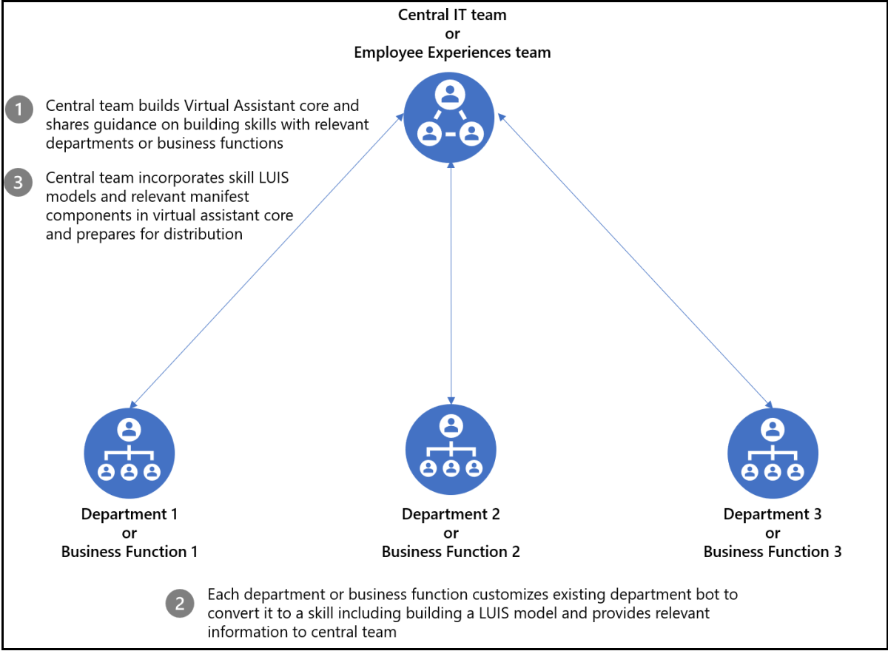
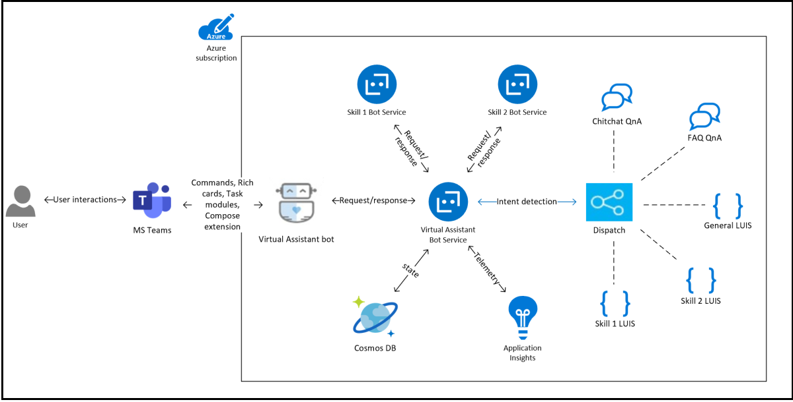

# <a name="create-virtual-assistant"></a>Criar um Assistente Virtual

Assistente Virtual é um modelo de software livre da Microsoft que permite criar uma solução de conversação robusta, mantendo o controle total da experiência do usuário, da identidade visual organizacional e dos dados necessários. O [modelo de núcleo do Assistente Virtual](https://microsoft.github.io/botframework-solutions/overview/virtual-assistant-template) é o bloco de construção básico que reúne as tecnologias da Microsoft necessárias para criar um Assistente Virtual, incluindo o [SDK do Bot Framework](https://github.com/microsoft/botframework-sdk), [Reconhecimento vocal (LUIS)](https://www.luis.ai/), e [QnA Maker](https://www.qnamaker.ai/). Ele também reúne os recursos essenciais, incluindo registro de habilidades, contas vinculadas, intenção de conversa básica para oferecer uma variedade de interações e experiências perfeitas aos usuários. Além disso, os recursos de modelo incluem exemplos avançados de [habilidades](https://microsoft.github.io/botframework-solutions/overview/skills) de conversação reutilizáveis.  As habilidades individuais são integradas em uma Assistente Virtual para habilitar vários cenários. Usando o SDK do Bot Framework, as habilidades são apresentadas no formulário de código-fonte, permitindo que você personalize e estenda conforme necessário. Para obter mais informações sobre as habilidades do Bot Framework, consulte [O que é uma habilidade Bot Framework](https://microsoft.github.io/botframework-solutions/overview/skills/). Este documento orienta você sobre as Assistente Virtual de implementação para organizações, como criar um Assistente Virtual com foco no Teams, exemplo relacionado, exemplo de código e limitações de Assistente Virtual.
A imagem a seguir exibe a visão geral do assistente virtual:


As atividades de mensagem de texto são roteadas para habilidades associadas pelo núcleo do Assistente Virtual usando um modelo de [expedição](/azure/bot-service/bot-builder-tutorial-dispatch?view=azure-bot-service-4.0&tabs=cs&preserve-view=true).

## <a name="implementation-considerations"></a>Considerações sobre implementação

A decisão de adicionar um Assistente Virtual inclui muitos determinantes e difere para cada organização. Os fatores de suporte de uma Assistente Virtual para sua organização são os seguintes:

* Uma equipe central gerencia todas as experiências dos funcionários. Ele tem a capacidade de criar uma experiência Assistente Virtual e gerenciar atualizações para a experiência principal, incluindo a adição de novas habilidades.
* Existem vários aplicativos entre funções de negócios e o número deve crescer no futuro.
* Os aplicativos existentes são personalizáveis, pertencentes à organização, e são convertidos em habilidades para um Assistente Virtual.
* A equipe central de experiências de funcionários é capaz de influenciar personalizações para aplicativos existentes. Ele também fornece as diretrizes necessárias para integrar aplicativos existentes como habilidades Assistente Virtual experiência.

A imagem a seguir exibe as funções de negócios Assistente Virtual:



## <a name="create-a-teams-focused-virtual-assistant"></a>Criar um grupo voltado para o Teams Assistente Virtual

A Microsoft publicou um [modelo do Microsoft Visual Studio](https://marketplace.visualstudio.com/items?itemName=BotBuilder.VirtualAssistantTemplate) para a criação de Assistentes Virtuais e habilidades. Com o Visual Studio, você pode criar um Assistente Virtual, alimentado por uma experiência baseada em texto com suporte para cartões avançados limitados com ações. Aprimoramos o modelo Visual Studio base para incluir recursos Microsoft Teams plataforma e aprimorar excelentes Teams aplicativo. Alguns dos recursos incluem suporte para recursos avançados Cartões Adaptáveis, módulos de tarefas, equipes ou chats em grupo e extensões de mensagem. Para obter mais informações sobre como estender o Assistente Virtual para o Microsoft Teams, consulte [Tutorial: Estenda Seu Assistente Virtual para o Microsoft Teams](https://microsoft.github.io/botframework-solutions/clients-and-channels/tutorials/enable-teams/1-intro/).
A imagem a seguir exibe o diagrama de alto nível de uma Assistente Virtual solução:



### <a name="add-adaptive-cards-to-your-virtual-assistant"></a>Adicione Cartões Adaptáveis ao seu Assistente Virtual

Para expedir solicitações corretamente, Assistente Virtual deve identificar o modelo LUIS correto e a habilidade correspondente associada a ele. No entanto, o mecanismo de expedição não pode ser usado para atividades de ação de cartão, pois o modelo luis associado a uma habilidade é treinado para textos de ação de cartão. Os textos de ação do cartão são palavras-chave fixas predefinida e não comentadas de um usuário.

Essa desvantagem é resolvida inserindo informações de habilidade na carga de ação do cartão. Cada habilidade deve inserir `skillId` no campo `value` de ações do cartão. Você deve garantir que cada atividade de ação do cartão transporte as informações de habilidade relevantes e Assistente Virtual pode utilizar essas informações para expedição.

Você deve fornecer `skillId` no construtor para garantir que as informações de habilidade estejam sempre presentes nas ações do cartão.
Um código de exemplo de dados de ação de cartão é mostrado na seção a seguir:

```csharp
    public class CardActionData
    {
        public CardActionData(string skillId)
        {
            this.SkillId = skillId;
        }

        [JsonProperty("skillId")]
        public string SkillId { get; set; }
    }

    ...
    var button = new CardAction
    {
        Type = ActionTypes.MessageBack,
        Title = "Card action button",
        Text = "card action button text",
        Value = new CardActionData(<SkillId>),
    };
```

Em seguida, `SkillCardActionData` no modelo Assistente Virtual é introduzida para extrair `skillId` da carga de ação do cartão.
Um trecho de código para extrair `skillId` do conteúdo da ação do cartão é mostrado na seção a seguir:

```csharp
    // Skill Card action data should contain skillId parameter
    // This class is used to deserialize it and get skillId 
    public class SkillCardActionData
    {
        /// <summary>
        /// Gets the ID of the skil that should handle this card
        /// </summary>
        [JsonProperty("skillId")]
        public string SkillId { get; set; }
    }
```

A implementação é feita por um método de extensão na classe [Atividade](https://github.com/microsoft/botframework-sdk/blob/master/specs/botframework-activity/botframework-activity.md).
Um trecho de código para extrair `skillId` dos dados de ação do cartão é mostrado na seção a seguir:

```csharp
    public static class ActivityExtensions
    {
        // Fetches skillId from CardAction data if present
        public static string GetSkillId(this Activity activity)
        {
            string skillId = string.Empty;

            try
            {
                if (activity.Type.Equals(ActivityTypes.Message) && activity.Value != null)
                {
                    var data = JsonConvert.DeserializeObject<SkillCardActionData>(activity.Value.ToString());
                    skillId = data.SkillId;
                }
                else if (activity.Type.Equals(ActivityTypes.Invoke) && activity.Value != null)
                {
                    var data = JsonConvert.DeserializeObject<SkillCardActionData>(JObject.Parse(activity.Value.ToString()).SelectToken("data").ToString());
                    skillId = data.SkillId;
                }
            }
            catch
            {
                // If not able to retrive skillId, empty skillId should be returned
            }

            return skillId;
        }
    }
```

### <a name="handle-interruptions"></a>Lidar com interrupções

Assistente Virtual pode lidar com interrupções em casos em que um usuário tenta invocar uma habilidade enquanto outra habilidade está ativa no momento. `TeamsSkillDialog` e `TeamsSwitchSkillDialog` são introduzidos com base no [SkillDialog](https://github.com/microsoft/botframework-solutions/blob/5b46d73e220bbb4fba86c48be532e495535ca78a/sdk/csharp/libraries/microsoft.bot.solutions/Skills/SkillDialog.cs) e [SwitchSkillDialog](https://github.com/microsoft/botframework-solutions/blob/6d40fa8ae05f96b0c5e0464e01361a9e1deb696c/sdk/csharp/libraries/microsoft.bot.solutions/Skills/Dialogs/SwitchSkillDialog.cs) do Bot Framework. Eles permitem que os usuários alternem uma experiência de habilidade de ações de cartão. Para lidar com essa solicitação, o Assistente Virtual solicita ao usuário uma mensagem de confirmação para alternar as habilidades:


### <a name="handle-task-module-requests"></a>Manipular solicitações de módulo de tarefa

Para adicionar funcionalidades de módulo de tarefa a um Assistente Virtual, dois métodos adicionais são incluídos no manipulador de atividade Assistente Virtual: `OnTeamsTaskModuleFetchAsync` e `OnTeamsTaskModuleSubmitAsync`. Esses métodos escutam atividades relacionadas ao módulo de tarefas Assistente Virtual, identificam a habilidade associada à solicitação e encaminham a solicitação para a habilidade identificada.

O encaminhamento de solicitação é feito por meio do método [SkillHttpClient](/dotnet/api/microsoft.bot.builder.integration.aspnet.core.skills.skillhttpclient?view=botbuilder-dotnet-stable&preserve-view=true), `PostActivityAsync`. Ele retorna a resposta como `InvokeResponse`, que é analisada e convertida em `TaskModuleResponse` .

```csharp
    public static TaskModuleResponse GetTaskModuleRespose(this InvokeResponse invokeResponse)
    {
        if (invokeResponse.Body != null)
        {
            return new TaskModuleResponse()
            {
                Task = GetTask(invokeResponse.Body),
            };
        }

        return null;
    }

    private static TaskModuleResponseBase GetTask(object invokeResponseBody)
        {
            JObject resposeBody = (JObject)JToken.FromObject(invokeResponseBody);
            var task = resposeBody.GetValue("task");
            var taskType = task.SelectToken("type").ToString();

            return taskType switch
            {
                "continue" => new TaskModuleContinueResponse()
                {
                    Type = taskType,
                    Value = task.SelectToken("value").ToObject<TaskModuleTaskInfo>(),
                },
                "message" => new TaskModuleMessageResponse()
                {
                    Type = taskType,
                    Value = task.SelectToken("value").ToString(),
                },
                _ => null,
            };
        }
```

Uma abordagem semelhante é seguida para expedição de ação de cartão e respostas de módulo de tarefa. Os dados de ação de busca e envio do módulo de tarefa são atualizados para incluir `skillId`.
O método de Extensão `GetSkillId` de Atividade `skillId` extrai da carga, que fornece detalhes sobre a habilidade que precisa ser invocada.

Os snippets de código e `OnTeamsTaskModuleFetchAsync` os `OnTeamsTaskModuleSubmitAsync` métodos são fornecidos na seção a seguir:

```csharp
    // Invoked when a "task/fetch" event is received to invoke task module.
    protected override async Task<TaskModuleResponse> OnTeamsTaskModuleFetchAsync(ITurnContext<IInvokeActivity> turnContext, TaskModuleRequest taskModuleRequest, CancellationToken cancellationToken)
    {
        try
        {
            string skillId = (turnContext.Activity as Activity).GetSkillId();
            var skill = _skillsConfig.Skills.Where(s => s.Value.AppId == skillId).First().Value;

            // Forward request to correct skill
            var invokeResponse = await _skillHttpClient.PostActivityAsync(this._appId, skill, _skillsConfig.SkillHostEndpoint, turnContext.Activity as Activity, cancellationToken);

            return invokeResponse.GetTaskModuleResponse();
        }
        catch (Exception exception)
        {
            await turnContext.SendActivityAsync(_templateEngine.GenerateActivityForLocale("ErrorMessage"));
            _telemetryClient.TrackException(exception);

            return null;
        }
    }

    // Invoked when a 'task/submit' invoke activity is received for task module submit actions.
    protected override async Task<TaskModuleResponse> OnTeamsTaskModuleSubmitAsync(ITurnContext<IInvokeActivity> turnContext, TaskModuleRequest taskModuleRequest, CancellationToken cancellationToken)
    {
        try
        {
            string skillId = (turnContext.Activity as Activity).GetSkillId();
            var skill = _skillsConfig.Skills.Where(s => s.Value.AppId == skillId).First().Value;

            // Forward request to correct skill
            var invokeResponse = await _skillHttpClient.PostActivityAsync(this._appId, skill, _skillsConfig.SkillHostEndpoint, turnContext.Activity as Activity, cancellationToken).ConfigureAwait(false);

            return invokeResponse.GetTaskModuleRespose();
        }
        catch (Exception exception)
        {
            await turnContext.SendActivityAsync(_templateEngine.GenerateActivityForLocale("ErrorMessage"));
            _telemetryClient.TrackException(exception);

            return null;
        }
    }
```

Além disso, você deve incluir todos os domínios de habilidade na seção `validDomains` no arquivo de manifesto do Assistente Virtual para que os módulos de tarefa invocados por meio de uma habilidade renderizem corretamente.

### <a name="handle-collaborative-app-scopes"></a>Manipular escopos de aplicativo colaborativos

Os aplicativos do Teams podem existir em vários escopos, incluindo chat 1:1, chat em grupo e canais. O modelo do núcleo do Assistente Virtual foi projetado para chats individuais. Como parte da experiência de integração, Assistente Virtual solicita aos usuários o nome e mantém o estado do usuário. Como a experiência de integração não é adequada para escopos de chat em grupo ou canal, ela foi removida.

As habilidades devem lidar com atividades em vários escopos, como chat 1:1, chat em grupo e conversa de canal. Se nenhum desses escopos tiver suporte, as habilidades deverão responder com uma mensagem apropriada.

As seguintes funções de processamento foram adicionadas ao núcleo do Assistente Virtual:

* Assistente Virtual pode ser invocado sem qualquer mensagem de texto de um chat em grupo ou canal.
* Os erros são limpos antes de enviar a mensagem para o módulo de expedição. Por exemplo, remova as @menção necessárias do bot.

```csharp
    if (innerDc.Context.Activity.Conversation?.IsGroup == true)
    {
        // Remove bot atmentions for teams/groupchat scope
        innerDc.Context.Activity.RemoveRecipientMention();

        // If bot is invoked without any text, reply with FirstPromptMessage
        if (string.IsNullOrWhiteSpace(innerDc.Context.Activity.Text))
        {
            await innerDc.Context.SendActivityAsync(_templateEngine.GenerateActivityForLocale("FirstPromptMessage"));
            return EndOfTurn;
        }
    }
```

### <a name="handle-message-extensions"></a>Manipular extensões de mensagem

Os comandos para uma extensão de mensagem são declarados no arquivo de manifesto do aplicativo. A interface do usuário da extensão de mensagem é ativada por esses comandos. Para que Assistente Virtual um comando de extensão de mensagem como uma habilidade anexada, Assistente Virtual manifesto de uma Assistente Virtual deve conter esses comandos. Você deve adicionar os comandos do manifesto de uma habilidade individual ao Assistente Virtual manifesto do usuário. A ID do comando fornece informações sobre uma habilidade associada acrescentando a ID do aplicativo da habilidade por meio de um separador `:`.

O trecho do arquivo de manifesto de uma habilidade é mostrado na seção a seguir:

```json
 "composeExtensions": [
    {
        "botId": "<Skil_App_Id>",
        "commands": [
            {
                "id": "searchQuery",
                "context": [ "compose", "commandBox" ],
                "description": "Test command to run query",
    ....   
```

O trecho de código do arquivo de manifesto correspondente do Assistente Virtual é mostrado na seção a seguir:

```json
 "composeExtensions": [
    {
        "botId": "<VA_App_Id>",
        "commands": [
            {
                "id": "searchQuery:<skill_id>",
                "context": [ "compose", "commandBox" ],
                "description": "Test command to run query",
    .... 
```

Depois que os comandos são invocados por um usuário, o Assistente Virtual pode identificar uma habilidade associada analisando a ID do comando, atualizando a atividade removendo o sufixo extra `:<skill_id>` da ID de comando e encaminhando-o para a habilidade correspondente. O código de uma habilidade não precisa lidar com o sufixo extra. Portanto, conflitos entre IDs de comando entre habilidades são evitados. Com essa abordagem, todos os comandos de pesquisa e ação de uma habilidade em todos os contextos, como **compose**, **commandBox** e **message** são alimentados por um Assistente Virtual.

```csharp
    const string MessagingExtensionCommandIdSeparator = ":";

    // Invoked when a 'composeExtension/submitAction' invoke activity is received for a messaging extension action command
    protected override async Task<MessagingExtensionActionResponse> OnTeamsMessagingExtensionSubmitActionAsync(ITurnContext<IInvokeActivity> turnContext, MessagingExtensionAction action, CancellationToken cancellationToken)
    {
        return await ForwardMessagingExtensionActionCommandActivityToSkill(turnContext, action, cancellationToken);
    }

    // Forwards invoke activity to right skill for messaging extension action commands.
    private async Task<MessagingExtensionActionResponse> ForwardMessagingExtensionActionCommandActivityToSkill(ITurnContext<IInvokeActivity> turnContext, MessagingExtensionAction action, CancellationToken cancellationToken)
    {
        var skillId = ExtractSkillIdFromMessagingExtensionActionCommand(turnContext, action);
        var skill = _skillsConfig.Skills.Where(s => s.Value.AppId == skillId).First().Value;
        var invokeResponse = await _skillHttpClient.PostActivityAsync(this._appId, skill, _skillsConfig.SkillHostEndpoint, turnContext.Activity as Activity, cancellationToken).ConfigureAwait(false);

        return invokeResponse.GetMessagingExtensionActionResponse();
    }

    // Extracts skill Id from messaging extension command and updates activity value
    private string ExtractSkillIdFromMessagingExtensionActionCommand(ITurnContext<IInvokeActivity> turnContext, MessagingExtensionAction action)
    {
        var commandArray = action.CommandId.Split(MessagingExtensionCommandIdSeparator);
        var skillId = commandArray.Last();

        // Update activity value by removing skill id before forwarding to the skill.
        var activityValue = JsonConvert.DeserializeObject<MessagingExtensionAction>(turnContext.Activity.Value.ToString());
        activityValue.CommandId = string.Join(MessagingExtensionCommandIdSeparator, commandArray, 0 commandArray.Length - 1);
        turnContext.Activity.Value = activityValue;

        return skillId;
    }
```

Algumas atividades de extensão de mensagem não incluem a ID do comando. Por exemplo, `composeExtension/selectItem` contém apenas o valor da ação de toque de invocação. Para identificar a habilidade associada, `skillId` é anexado a cada cartão de item ao formar uma resposta para `OnTeamsMessagingExtensionQueryAsync`. Isso é semelhante à abordagem para [adicionar cartões adaptáveis ao seu Assistente Virtual](#add-adaptive-cards-to-your-virtual-assistant).

```csharp
    // Invoked when a 'composeExtension/selectItem' invoke activity is received for compose extension query command.
    protected override async Task<MessagingExtensionResponse> OnTeamsMessagingExtensionSelectItemAsync(ITurnContext<IInvokeActivity> turnContext, JObject query, CancellationToken cancellationToken)
    {
        var data = JsonConvert.DeserializeObject<SkillCardActionData>(query.ToString());
        var skill = _skillsConfig.Skills.Where(s => s.Value.AppId == data.SkillId).First().Value;
        var invokeResponse = await _skillHttpClient.PostActivityAsync(this._appId, skill, _skillsConfig.SkillHostEndpoint, turnContext.Activity as Activity, cancellationToken).ConfigureAwait(false);

        return invokeResponse.GetMessagingExtensionResponse();
    }
```

---

## <a name="example"></a>Exemplo

O exemplo a seguir mostra como converter o modelo de aplicativo Agendar uma sala em uma habilidade do Assistente Virtual: Agendar uma sala é um Microsoft Teams que permite que os usuários localizem e reservem rapidamente uma sala de reunião por 30, 60 ou 90 minutos a partir da hora atual. O tempo padrão é de 30 minutos. O bot agendar uma sala tem escopos para conversas pessoais ou 1:1.
A imagem a seguir exibe um Assistente Virtual com uma habilidade **agendar uma sala**:


A seguir estão as alterações delta introduzidas para convertê-lo em uma habilidade, que está anexada a um Assistente Virtual. Diretrizes semelhantes são seguidas para converter qualquer bot v4 existente em uma habilidade.

### <a name="skill-manifest"></a>Manifesto de habilidade

Um manifesto de habilidade é um arquivo JSON que expõe o ponto de extremidade de mensagens, a ID, o nome e outros metadados relevantes de uma habilidade. Esse manifesto é diferente do manifesto usado para sideload de um aplicativo no Microsoft Teams. Um Assistente Virtual requer um caminho para esse arquivo como uma entrada para anexar uma habilidade. Adicionamos o manifesto a seguir à pasta wwwroot do bot.

```bash
botskills connect --remoteManifest "<url to skill's manifest>" ..
```

```json
{
  "$schema": "https://schemas.botframework.com/schemas/skills/skill-manifest-2.1.preview-0.json",
  "$id": "microsoft_teams_apps_bookaroom",
  "name": "microsoft-teams-apps-bookaroom",
  "description": "microsoft-teams-apps-bookaroom description",
  "publisherName": "Your Company",
  "version": "1.1",
  "iconUrl": "<icon url>",
  "copyright": "Copyright (c) Microsoft Corporation. All rights reserved.",
  "license": "",
  "privacyUrl": "<privacy url>",
  "endpoints": [
    {
      "name": "production",
      "protocol": "BotFrameworkV3",
      "description": "Production endpoint for the skill",
      "endpointUrl": "<endpoint url>",
      "msAppId": "skill app id"
    }
  ],
  "dispatchModels": {
    "languages": {
      "en-us": [
        {
          "id": "microsoft-teams-apps-bookaroom-en",
          "name": "microsoft-teams-apps-bookaroom LU (English)",
          "contentType": "application/lu",
          "url": "file://book-a-meeting.lu",
          "description": "English language model for the skill"
        }
      ]
    }
  },
  "activities": {
    "message": {
      "type": "message",
      "description": "Receives the users utterance and attempts to resolve it using the skill's LU models"
    }
  }
}
```

### <a name="luis-integration"></a>Integração do LUIS

Assistente Virtual modelo de expedição da Assistente Virtual é criado com base nos modelos LUIS das habilidades anexadas. O modelo de expedição identifica a intenção de cada atividade de texto e descobre a habilidade associada a ela.

Assistente Virtual requer o modelo LUIS da habilidade no formato `.lu` como uma entrada ao anexar uma habilidade. O json do LUIS é convertido em `.lu` usando a ferramenta botframework-cli.

```json
botskills connect --remoteManifest "<url to skill's manifest>" --luisFolder "<path to the folder containing your Skill's .lu files>" --languages "en-us" --cs
```

```bash
npm i -g @microsoft/botframework-cli
bf luis:convert --in <pathToLUIS.json> --out <pathToLuFile>
```

O bot agendar uma sala tem dois comandos principais para os usuários:

* `Book room`
* `Manage Favorites`

Criamos um modelo LUIS compreendendo esses dois comandos. Os segredos correspondentes devem ser preenchidos em `cognitivemodels.json`. O arquivo JSON do LUIS correspondente é encontrado [aqui](https://github.com/OfficeDev/microsoft-teams-apps-bookaroom/blob/nebhagat/microsoft-teams-apps-bookaroom-skill/Deployment/Resources/LU/en-us/book-a-meeting.json).
O arquivo `.lu` correspondente é mostrado na seção a seguir:

```
> ! Automatically generated by [LUDown CLI](https://github.com/Microsoft/botbuilder-tools/tree/master/Ludown), Tue Mar 31 2020 17:30:32 GMT+0530 (India Standard Time)

> ! Source LUIS JSON file: book-a-meeting.json

> ! Source QnA TSV file: Not Specified

> ! Source QnA Alterations file: Not Specified


> # Intent definitions

## BOOK ROOM
- book a room
- book room
- please book a room
- reserve a room
- i want to book a room
- i want to book a room please
- get me a room please
- get me a room


## MANAGE FAVORITES
- manage favorites
- manage favorite
- please manage my favorite rooms
- manage my favorite rooms please
- manage my favorite rooms
- i want to manage my favorite rooms

## None


> # Entity definitions


> # PREBUILT Entity definitions


> # Phrase list definitions


> # List entities

> # RegEx entities
```

Com essa abordagem, qualquer comando emitido por um usuário para Assistente Virtual relacionado a `book room` ou `manage favorites` são identificados como um comando associado ao bot `Book-a-room` e são encaminhados para essa habilidade.
Por outro lado, o `Book-a-room room` bot precisará usar o modelo luis para entender esses comandos se eles não forem digitados como completos. Por exemplo: `I want to manage my favorite rooms`.

### <a name="multi-language-support"></a>Suporte a vários idiomas

Por exemplo, um modelo LUIS com apenas cultura em inglês é criado. Você pode criar modelos LUIS correspondentes a outros idiomas e adicionar entrada a `cognitivemodels.json`.

```json
{
  "defaultLocale": "en-us",
  "languageModels": {
    "en-us": {
      "luisAppId": "",
      "luisApiKey": "",
      "luisApiHost": ""
    },
    "<your_language_culture>": {
      "luisAppId": "",
      "luisApiKey": "",
      "luisApiHost": ""
    }
  }
}
```

Em paralelo, adicione o arquivo `.lu` no caminho luisFolder. A estrutura de pastas deve ser a seguinte:

```bash
| - luisFolder

        | - en-us

                | - book-a-meeting.lu

        | - your_language_culture

                | - book-a-meeting.lu
```

Para modificar `languages`, atualize o comando botskills da seguinte maneira:

```json
botskills connect --remoteManifest "<url to skill's manifest>" --luisFolder "<path to luisFolder>" --languages "en-us, your_language_culture" --cs
```

Assistente Virtual usa `SetLocaleMiddleware` para identificar a localidade atual e invocar o modelo de expedição correspondente. A atividade do Bot Framework tem o campo de localidade, que é usado por esse middleware. Você também pode usar o mesmo para sua habilidade. O bot book-a-room não usa esse middleware e, em vez disso, obtém a localidade da entidade [clientInfo](https://github.com/microsoft/botframework-sdk/blob/master/specs/botframework-activity/botframework-activity.md#clientinfo) da atividade da estrutura do Bot.

### <a name="claim-validation"></a>Validação de declaração

Adicionamos [claimsValidator para](https://github.com/nebhagat/msteams-virtual-assistant-dotnet/blob/master/msteams-virtual-assistant-dotnet/Authentication/AllowedCallersClaimsValidator.cs) restringir os chamadores à habilidade. Para permitir que um Assistente Virtual chame essa habilidade, preencha a matriz `AllowedCallers` de `appsettings` com a ID do aplicativo Assistente Virtual específica.

```
"AllowedCallers": [ "<caller_VA1_appId>", "<caller_VA2_appId>" ],
```

A matriz de chamadores permitidos pode restringir quais consumidores de habilidades podem acessar a habilidade. Adicione uma única entrada `*` a essa matriz para aceitar chamadas de qualquer consumidor de habilidades.

```
"AllowedCallers": [ "*" ],
```

Para obter mais informações sobre como adicionar validação de declarações a uma habilidade, consulte [adicionar validação de declarações à habilidade](/azure/bot-service/skill-implement-skill?view=azure-bot-service-4.0&tabs=cs#claims-validator&preserve-view=true).

### <a name="limitation-of-card-refresh"></a>Limitação da atualização do cartão

A atualização da atividade, como a atualização do cartão, ainda não tem suporte por meio Assistente Virtual ([problema do Github](https://github.com/microsoft/botbuilder-dotnet/issues/3686)). Portanto, substituímos todas as chamadas de atualização de cartão `UpdateActivityAsync` por postagem de novas chamadas de cartão `SendActivityAsync`.

### <a name="card-actions-and-task-module-flows"></a>Ações de cartão e fluxos de módulo de tarefa

Para encaminhar atividades de ação de cartão ou módulo de tarefa para uma habilidade associada, a habilidade deve inserir `skillId` a ela.
`Book-a-room` ação do cartão de bot, as cargas de ação de busca e envio do módulo de tarefa são modificadas para conter `skillId` como um parâmetro.

Para obter mais informações, [consulte esta](/microsoftteams/platform/samples/virtual-assistant#add-adaptive-cards-to-your-virtual-assistant) seção nesta documentação.

### <a name="handle-activities-from-group-chat-or-channel-scope"></a>Manipular atividades do chat em grupo ou do escopo do canal

`Book-a-room bot` foi projetado para chats privados, como apenas escopo pessoal ou 1:1. Como personalizamos o Assistente Virtual para dar suporte aos escopos de canal e chat em grupo, o Assistente Virtual deve ser invocado dos escopos do canal e, portanto, o bot `Book-a-room` deve obter atividades para o mesmo escopo. Portanto`Book-a-room`bot é personalizado para lidar com essas atividades. Você pode encontrar a verificação nos métodos `OnMessageActivityAsync` do manipulador de atividade do bot `Book-a-room`.

```csharp
    protected override async Task OnMessageActivityAsync(ITurnContext<IMessageActivity> turnContext, CancellationToken cancellationToken)
    {
        // Check if activities are from groupchat/ teams scope. This might happen when the bot is consumed by Virtual Assistant.
        if (turnContext.Activity.Conversation.IsGroup == true)
        {
            await ShowNotSupportedInGroupChatCardAsync(turnContext).ConfigureAwait(false);
        }
        else
        {
            ...
        }
    }
```

Você também pode aproveitar as habilidades existentes do [repositório do Bot Framework Solutions](https://github.com/microsoft/botframework-components/tree/main/skills/csharp) ou criar uma nova habilidade completamente do zero. Para criar uma nova habilidade, consulte [tutoriais para criar uma nova habilidade](https://microsoft.github.io/botframework-solutions/overview/skills/). Para documentação de arquitetura de habilidades e Assistente Virtual, consulte[arquitetura de habilidades e Assistente Virtual](/azure/bot-service/skills-conceptual?view=azure-bot-service-4.0&preserve-view=true).  

## <a name="limitations-of-virtual-assistant"></a>Limitações de Assistente Virtual

* **EndOfConversation**: Uma habilidade deve enviar uma atividade `endOfConversation` quando terminar uma conversa. Com base na atividade, um Assistente Virtual termina o contexto com essa habilidade específica e volta Assistente Virtual contexto raiz do usuário. Para o bot book-a-room, não há nenhum estado claro em que a conversa é encerrada. Portanto, não enviamos do `endOfConversation` `Book-a-room` bot e quando o usuário deseja voltar para o contexto raiz, ele pode fazer isso por `start over` comando.  
* **Atualização do** cartão: a atualização do cartão ainda não tem suporte por meio Assistente Virtual.  
* **Extensões de mensagem**:
  * Atualmente, um Assistente Virtual pode dar suporte a um máximo de dez comandos para extensões de mensagem.
  * A configuração de extensões de mensagem não tem escopo para comandos individuais, mas para toda a extensão em si. Isso limita a configuração de cada habilidade individual por meio Assistente Virtual.
  * As IDs de comando de extensões de mensagem têm um comprimento máximo de [64 caracteres](../resources/schema/manifest-schema.md#composeextensions) e 37 caracteres são usados para inserir informações de habilidade. Assim, as restrições atualizadas para a ID de comando são limitadas a 27 caracteres.

Você também pode aproveitar as habilidades existentes do [repositório do Bot Framework Solutions](https://github.com/microsoft/botframework-components/tree/main/skills/csharp) ou criar uma nova habilidade completamente do zero. Tutoriais para o posterior podem ser encontrados [aqui](https://microsoft.github.io/botframework-solutions/overview/skills/). Consulte a [documentação](/azure/bot-service/skills-conceptual?view=azure-bot-service-4.0&preserve-view=true) para Assistente Virtual e arquitetura de habilidades.

## <a name="code-sample"></a>Exemplo de código

| **Nome de exemplo** | **Descrição** | **C#**  **.NET** |
|----------|-----------------|---------------------------|
| Modelo do Visual Studio atualizado | Modelo personalizado para dar suporte a recursos de equipes. | [View](https://github.com/OfficeDev/Microsoft-Teams-Samples/tree/main/samples/app-virtual-assistant/csharp) |
| Código de habilidade do bot agendar uma sala | Permite que você encontre e reserve rapidamente uma sala de reunião em qualquer lugar. | [Exibir](https://github.com/OfficeDev/microsoft-teams-apps-bookaroom/tree/nebhagat/microsoft-teams-apps-bookaroom-skill) |

## <a name="see-also"></a>Confira também

* [Integrar aplicativos Web](~/samples/integrate-web-apps-overview.md)
* [Agendar uma sala](app-templates.md#app-template-code-samples)
* [Bot do Microsoft Teams](../bots/what-are-bots.md)
