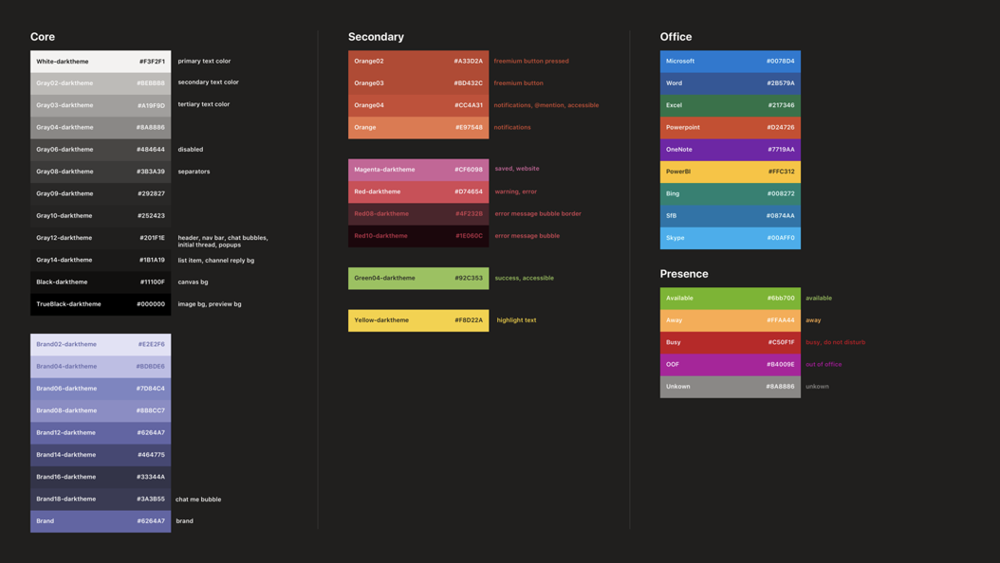

# Guias em dispositivos móveisTabs on mobile

Você pode incluir guias em Teams, chats e aplicativos pessoais.You can include tabs in Teams mobile channels, chats, and personal apps.

## Acessando guias pessoaisAccessing personal tabs

Você pode acessar guias pessoais na gaveta do aplicativo.You can access personal tabs in the app drawer.

:::image type="content" source="../../assets/images/tabs/mobile-app-drawer.png" alt-text="Ilustração mostrando a Teams do aplicativo móvel." border="false":::

## Acessando guias de canalAccessing channel tabs

Você pode acessar guias de canal e grupo selecionando o botão **Mais** no canal ou chat no qual eles foram adicionados.You can access channel and group tabs by selecting the **More** button in the channel or chat in which they've been added.

:::image type="content" source="../../assets/images/tabs/mobile-tab.png" alt-text="Ilustração mostrando uma Teams móvel." border="false":::

## Considerações de designDesign considerations

Nossa plataforma móvel permite que os aplicativos sejam uma experiência imersiva com o conteúdo do aplicativo ocupando toda a tela, além da navegação Teams principal.Our mobile platform allows apps to be an immersive experience with the app content taking up all of the screen apart from main Teams navigation. Para criar uma experiência imersiva que se ajuste ao Teams, siga estas diretrizes.To create an immersive experience that fits with Teams, follow these guidelines.

### Design responsivoResponsive design

Como sua guia pode ser aberta em dispositivos com uma ampla variedade de tamanhos de tela, ela precisa seguir princípios de [design responsivo.](https://www.w3schools.com/html/html_responsive.asp)Because your tab can be opened on devices with a wide range of screen sizes, it needs to follow [responsive design](https://www.w3schools.com/html/html_responsive.asp) principles. Todas as construções principais devem ser acessíveis em dispositivos móveis, e os exibições não devem ser distorcidos.All of the key constructs should be accessible on mobile devices, and the views should not be distorted. Certifique-se de que, quando a guia for carregada em um dispositivo móvel, todos os botões e links serão facilmente acessíveis usando a navegação baseada em dedos.Ensure that when your tab is loaded on a mobile device, all buttons and links are easily accessible using finger-based navigation.

### LayoutsLayouts

Escolher o layout correto para sua guia é importante.Choosing the correct layout for your tab is important. Você deve considerar o tipo de informação que está apresentando e escolher um layout que as organize para facilitar o consumo.You should consider the kind of information you're presenting, and choose a layout that organizes it for easy consumption. Algumas opções possíveis são descritas abaixo.Some potential options are outlined below.

#### Tela únicaSingle canvas

Esta é uma área grande onde o trabalho é feito.This is one large area where work gets done. O Teams wiki segue esse padrão.The Teams Wiki app follows this pattern. Se você tiver um aplicativo que não separe conteúdo em componentes menores, isso seria um bom ajuste.If you have an app that doesn’t separate content into smaller components this would be a good fit.

:::image type="content" source="../../assets/images/tabs/mobile-tab-single-canvas.png" alt-text="Ilustração mostrando uma Teams única tela móvel." border="false":::

#### ListList

As listas são ótimas para classificar e filtrar grandes quantidades de dados e são ótimas para manter as coisas mais importantes na parte superior.Lists are great for sorting and filtering large quantities of data and are great at keeping the most important things at the top. É útil usar colunas sortíveis.It is helpful to use sortable columns. As ações podem ser adicionadas a cada item de lista no menu reellipse.Actions can be added to each list item under the ellipsis menu.

:::image type="content" source="../../assets/images/tabs/mobile-tab-list.png" alt-text="Ilustração mostrando uma guia Teams lista móvel." border="false":::

#### GradeGrid

As grades são úteis para mostrar elementos altamente visuais.Grids are useful for showing elements which are highly visual. Ele ajuda a incluir um filtro ou controle de pesquisa na parte superior.It helps to include a filter or search control at the top.

:::image type="content" source="../../assets/images/tabs/mobile-tab-grid.png" alt-text="Ilustração mostrando uma Teams móvel com um layout de grade." border="false":::

### Guias com bots no celularTabs with bots on mobile

O exemplo a seguir é um aplicativo pessoal que tem guias e um bot:The following example is a personal app that has tabs and a bot:

:::image type="content" source="../../assets/images/tabs/mobile-tab-with-bot.png" alt-text="Ilustração mostrando como o aplicativo Teams celular que tem guias e um bot." border="false":::

## Componentes da interface do usuárioUI components

### Paletas de coresColor palettes

Usar nossa paleta neutra aprovada para planos de fundo, notificações, texto e botões ajudará seu aplicativo a se sentir mais em casa no Teams.Using our approved neutral palette for backgrounds, notifications, text, and buttons will help your app feel more at home in Teams. Como Teams celular tem dois temas de cores (claro e escuro), é uma boa ideia garantir que seu aplicativo tenha uma ótima aparência em ambos.Since Teams mobile has two colour themes (light and dark), it’s a good idea to make sure your app looks great in both.

#### Cor claraLight color

#### Cor escuraDark color

### Botões e controlesButtons and controls

A maneira como os botões são estilados ajuda a comunicar que tipo de ação eles disparam.The way buttons are styled helps communicate what kind of action they trigger. Mantemos uma ampla variedade de botões formatados para mostrar diferentes níveis de ênfase.We maintain a wide range of buttons that are formatted to show different levels of emphasis. Os botões podem ter texto, um ícone ou uma combinação de texto e um ícone.Buttons can have text, an icon, or a combination of text and an icon. Para comunicar níveis diferentes em uma hierarquia, projetamos botões primários e secundários em cada categoria.To communicate different levels in a hierarchy, we designed primary and secondary buttons within each category.

#### BotõesButtons

Botões primários e secundários.Primary and secondary buttons.

#### Controles de seleçãoSelection controls

Botões de rádio, caixas de seleção e alternâncias.Radio buttons, checkboxes, and toggles.

#### Chiclets e comprimidosChiclets and pills

### TipografiaTypography

A tipografia deve ser clara e proposital.Typography should be clear and purposeful. Enfatizar informações importantes e evitar usar várias fontes e tamanhos para reduzir a confusão.Emphasize important information and avoid using multiple fonts and sizes to reduce confusion. Recomendamos usar o caso de frase e evitar o uso de todas as caps para localização e legibilidade.We recommend using sentence case and avoiding the usage of all caps for localization and legibility.

### Campos e flyoutsFields and flyouts

Campos são áreas onde os usuários podem inserir texto.Fields are areas where users can input text. Os flyouts são mais leves do que as caixas de diálogo e aparecem no painel superior.Flyouts are more lightweight than dialogs and appear from the top pane.

#### Controles de listaList controls

#### Controles de campoField controls

## Considerações sobre desenvolvedoresDeveloper considerations

Ao criar um aplicativo que inclua uma guia, você precisa considerar (e testar) como sua guia funcionará nos clientes android e iOS Microsoft Teams.When you're building an app that includes a tab, you need to consider (and test) how your tab will function on both the Android and iOS Microsoft Teams clients. As seções abaixo delineam alguns dos principais cenários que você precisa considerar.The sections below outline some of the key scenarios you need to consider.

### AutenticaçãoAuthentication

Para que a autenticação funcione em clientes móveis, você deve atualizar Teams SDK JavaScript para pelo menos a versão 1.4.1.For authentication to work on mobile clients, you must upgrade you Teams JavaScript SDK to at least version 1.4.1.

### Baixa largura de banda e conexões intermitentesLow bandwidth and intermittent connections

Clientes móveis regularmente precisam funcionar com baixa largura de banda e conexões intermitentes.Mobile clients regularly need to function with low bandwidth and intermittent connections. Seu aplicativo deve lidar com quaisquer tempos de tempo apropriados fornecendo uma mensagem contextual ao usuário.Your app should handle any timeouts appropriately by providing a contextual message to the user. Você também deve ter indicadores de progresso do usuário para fornecer comentários aos usuários sobre processos de longa duração.You should also user progress indicators to provide feedback to your users for any long-running processes.

> [!NOTE]
> As guias são habilitadas no celular somente depois que o aplicativo é adicionado a uma lista de permitir, com base na entrada da equipe de aprovação.Tabs are enabled on mobile only after the application is added to an allow list, based on the input of the approval team. Para verificar a capacidade de resposta móvel, entre em contato com teamsubm@microsoft.com.To check mobile responsiveness, reach out to teamsubm@microsoft.com.

### Testes em clientes móveisTesting on mobile clients

Você precisa validar que sua guia funciona corretamente em dispositivos móveis de vários tamanhos e qualidades.You need to validate that your tab functions properly on mobile devices of various sizes and qualities. Para dispositivos Android, você pode usar [o DevTools](~/tabs/how-to/developer-tools.md) para depurar sua guia enquanto ela estiver em execução.For Android devices, you can use the [DevTools](~/tabs/how-to/developer-tools.md) to debug your tab while it is running. Recomendamos que você teste em dispositivos de alto e baixo desempenho, incluindo um tablet.We recommend that you test on both high- and low-performance devices, including a tablet.

### DistribuiçãoDistribution

Os aplicativos listados no Teams devem ser aprovados para uso móvel para funcionar corretamente no cliente Teams celular.Apps listed on the Teams store must be approved for mobile use to function properly in the Teams mobile client. A disponibilidade e o comportamento de tabulação dependem da aprovação do aplicativo.Tab availability and behavior depends on whether your app is approved.

#### Aplicativos no Teams store aprovados para dispositivos móveisApps on Teams store approved for mobile

A tabela a seguir descreve a disponibilidade e o comportamento da guia quando o aplicativo é listado no Teams e aprovado para uso móvel:The following table describes tab availability and behavior when the app is listed on the Teams store and approved for mobile use:

|RecursosCapability   |Disponibilidade móvel?Mobile availability?   |Comportamento móvelMobile behavior|
|----------|-----------|------------|
|CanalChannel   e guia grupoand group tab|SimYes|A guia é aberta Teams cliente móvel usando a configuração do `contentUrl` aplicativo.Tab opens in the Teams mobile client using your app's `contentUrl` configuration.|
|Aplicativo pessoalPersonal app|SimYes|Cada guia na guia aplicativo pessoal é aberta no cliente Teams móvel usando sua respectiva `contentUrl` configuração.Each tab in the personal app tab opens in the Teams mobile client using its respective `contentUrl` configuration.|

#### Aplicativos na Teams não aprovados para dispositivos móveisApps on Teams store not approved for mobile

A tabela a seguir descreve a disponibilidade e o comportamento da guia quando o aplicativo está listado no Teams, mas não aprovado para uso móvel:The following table describes tab availability and behavior when the app is listed on the Teams store but not approved for mobile use:

| RecursosCapability | Disponibilidade móvel?Mobile availability? | Comportamento móvelMobile behavior |
|----------|-----------|------------|
|Guia Canal e grupoChannel and group tab|SimYes|A guia é aberta no navegador padrão do dispositivo, em vez do cliente Teams móvel usando a configuração do aplicativo, que também deve ser incluído na função do `websiteUrl` `setSettings()` [código-fonte.](/javascript/api/@microsoft/teams-js/settings?view=msteams-client-js-latest#functions&preserve-view=true)Tab opens in the device's default browser instead of the Teams mobile client using your app's `websiteUrl` configuration, which also must be included in your source code's `setSettings()` [function](/javascript/api/@microsoft/teams-js/settings?view=msteams-client-js-latest#functions&preserve-view=true). No entanto, os usuários ainda podem exibir a guia no cliente Teams móvel selecionando **Mais** ao lado do aplicativo e escolhendo **Abrir**, o que dispara a configuração do `contentUrl` aplicativo.However, users can still view the tab in the Teams mobile client by selecting **More** next to the app and choosing **Open**, which triggers your app’s `contentUrl` configuration.|
|Aplicativo pessoalPersonal app|NãoNo|Não aplicávelNot applicable|

#### Aplicativos que não Teams lojaApps not on Teams store

Se você estiver fazendo sideload do seu aplicativo ou publicação no catálogo de aplicativos de uma organização, o comportamento da guia será o mesmo Teams aplicativos da loja aprovados pela Microsoft para dispositivos móveis.If you're sideloading your app or publishing to an org's app catalog, tab behavior will be the same as Teams store apps approved by Microsoft for mobile.
