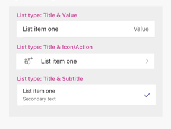

# Guias em dispositivos móveisTabs on mobile

Você pode incluir guias em Teams canais móveis, chats e aplicativos pessoais.You can include tabs in Teams mobile channels, chats, and personal apps.

## Acessando guias pessoaisAccessing personal tabs

Você pode acessar guias pessoais na gaveta de aplicativos.You can access personal tabs in the app drawer.

:::image type="content" source="../../assets/images/tabs/mobile-app-drawer.png" alt-text="Ilustração mostrando a Teams gaveta de aplicativos móveis." border="false":::

## Acessando guias de canaisAccessing channel tabs

Você pode acessar guias de canais e grupos selecionando o botão **Mais** no canal ou chat no qual eles foram adicionados.You can access channel and group tabs by selecting the **More** button in the channel or chat in which they've been added.

:::image type="content" source="../../assets/images/tabs/mobile-tab.png" alt-text="Ilustração mostrando uma guia móvel Teams." border="false":::

## Considerações de designDesign considerations

Nossa plataforma móvel permite que os aplicativos sejam uma experiência imersiva com o conteúdo do aplicativo ocupando toda a tela além da navegação principal Teams.Our mobile platform allows apps to be an immersive experience with the app content taking up all of the screen apart from main Teams navigation. Para criar uma experiência imersiva que se encaixe com Teams, siga essas diretrizes.To create an immersive experience that fits with Teams, follow these guidelines.

### Design responsivoResponsive design

Como sua guia pode ser aberta em dispositivos com uma ampla gama de tamanhos de tela, ela precisa seguir princípios [de design responsivos.](https://www.w3schools.com/html/html_responsive.asp)Because your tab can be opened on devices with a wide range of screen sizes, it needs to follow [responsive design](https://www.w3schools.com/html/html_responsive.asp) principles. Todas as construções-chave devem ser acessíveis em dispositivos móveis, e as visualizações não devem ser distorcidas.All of the key constructs should be accessible on mobile devices, and the views should not be distorted. Certifique-se de que quando sua guia estiver carregada em um dispositivo móvel, todos os botões e links são facilmente acessíveis usando navegação baseada em dedos.Ensure that when your tab is loaded on a mobile device, all buttons and links are easily accessible using finger-based navigation.

### LayoutsLayouts

Escolher o layout correto para sua guia é importante.Choosing the correct layout for your tab is important. Você deve considerar o tipo de informação que está apresentando e escolher um layout que a organize para fácil consumo.You should consider the kind of information you're presenting, and choose a layout that organizes it for easy consumption. Algumas opções potenciais estão descritas abaixo.Some potential options are outlined below.

#### Tela únicaSingle canvas

Esta é uma grande área onde o trabalho é feito.This is one large area where work gets done. O aplicativo wiki Teams segue esse padrão.The Teams Wiki app follows this pattern. Se você tem um aplicativo que não separa o conteúdo em componentes menores, isso seria um bom ajuste.If you have an app that doesn’t separate content into smaller components this would be a good fit.

:::image type="content" source="../../assets/images/tabs/mobile-tab-single-canvas.png" alt-text="Ilustração mostrando uma Teams guia de tela única móvel." border="false":::

#### ListList

As listas são ótimas para classificar e filtrar grandes quantidades de dados e são ótimas para manter as coisas mais importantes no topo.Lists are great for sorting and filtering large quantities of data and are great at keeping the most important things at the top. É útil usar colunas classificadas.It is helpful to use sortable columns. As ações podem ser adicionadas a cada item da lista no menu elipse.Actions can be added to each list item under the ellipsis menu.

:::image type="content" source="../../assets/images/tabs/mobile-tab-list.png" alt-text="Ilustração mostrando uma guia de lista de celular Teams." border="false":::

#### gradeGrid

Grades são úteis para mostrar elementos altamente visuais.Grids are useful for showing elements which are highly visual. Ajuda a incluir um filtro ou controle de pesquisa na parte superior.It helps to include a filter or search control at the top.

:::image type="content" source="../../assets/images/tabs/mobile-tab-grid.png" alt-text="Ilustração mostrando uma guia móvel Teams com um layout de grade." border="false":::

### Guias com bots no celularTabs with bots on mobile

O exemplo a seguir é um aplicativo pessoal que tem guias e um bot:The following example is a personal app that has tabs and a bot:

:::image type="content" source="../../assets/images/tabs/mobile-tab-with-bot.png" alt-text="Ilustração mostrando como o aplicativo de Teams móvel que tem guias e um bot." border="false":::

## Componentes de interface do usuárioUI components

### Paletas de coresColor palettes

Usar nossa paleta neutra aprovada para dados, notificações, texto e botões ajudará seu aplicativo a se sentir mais em casa em Teams.Using our approved neutral palette for backgrounds, notifications, text, and buttons will help your app feel more at home in Teams. Como Teams celular tem dois temas de cores (claro e escuro), é uma boa ideia garantir que seu aplicativo fique ótimo em ambos.Since Teams mobile has two colour themes (light and dark), it’s a good idea to make sure your app looks great in both.

#### Cor claraLight color

#### Cor escuraDark color

### Botões e controlesButtons and controls

A forma como os botões são estilizados ajuda a comunicar que tipo de ação eles acionam.The way buttons are styled helps communicate what kind of action they trigger. Mantemos uma ampla gama de botões que são formatados para mostrar diferentes níveis de ênfase.We maintain a wide range of buttons that are formatted to show different levels of emphasis. Os botões podem ter texto, um ícone ou uma combinação de texto e um ícone.Buttons can have text, an icon, or a combination of text and an icon. Para comunicar diferentes níveis em uma hierarquia, projetamos botões primários e secundários dentro de cada categoria.To communicate different levels in a hierarchy, we designed primary and secondary buttons within each category.

#### BotõesButtons

Botões primários e secundários.Primary and secondary buttons.

#### Controles de seleçãoSelection controls

Botões de rádio, caixas de seleção e alternâncias.Radio buttons, checkboxes, and toggles.

#### Chiclets e pílulasChiclets and pills

### TipografiaTypography

A tipografia deve ser clara e proposital.Typography should be clear and purposeful. Enfatize informações importantes e evite o uso de várias fontes e tamanhos para reduzir a confusão.Emphasize important information and avoid using multiple fonts and sizes to reduce confusion. Recomendamos o uso de casos de sentença e evitar o uso de todas as tampas para localização e legibilidade.We recommend using sentence case and avoiding the usage of all caps for localization and legibility.

### Campos e flyoutsFields and flyouts

Campos são áreas onde os usuários podem inserir texto.Fields are areas where users can input text. Os flyouts são mais leves do que os diálogos e aparecem do painel superior.Flyouts are more lightweight than dialogs and appear from the top pane.

#### Controles de listaList controls

#### Controles de campoField controls

## Considerações do desenvolvedorDeveloper considerations

Quando você está construindo um aplicativo que inclui uma guia, você precisa considerar (e testar) como sua guia funcionará tanto no Clientes Microsoft Teams Android quanto no iOS.When you're building an app that includes a tab, you need to consider (and test) how your tab will function on both the Android and iOS Microsoft Teams clients. As seções abaixo descrevem alguns dos principais cenários que você precisa considerar.The sections below outline some of the key scenarios you need to consider.

### AutenticaçãoAuthentication

Para que a autenticação funcione em clientes móveis, você deve atualizá-lo Teams JavaScript SDK para pelo menos a versão 1.4.1.For authentication to work on mobile clients, you must upgrade you Teams JavaScript SDK to at least version 1.4.1.

### Baixa largura de banda e conexões intermitentesLow bandwidth and intermittent connections

Os clientes móveis precisam funcionar regularmente com baixa largura de banda e conexões intermitentes.Mobile clients regularly need to function with low bandwidth and intermittent connections. Seu aplicativo deve lidar com quaisquer intervalos apropriadamente, fornecendo uma mensagem contextual ao usuário.Your app should handle any timeouts appropriately by providing a contextual message to the user. Você também deve fornecer indicadores de progresso para fornecer feedback aos seus usuários para quaisquer processos de longo prazo.You should also user progress indicators to provide feedback to your users for any long-running processes.

> [!NOTE]
> As guias são habilitadas no celular somente após o aplicativo ser adicionado a uma lista de permissões, com base na entrada da equipe de aprovação.Tabs are enabled on mobile only after the application is added to an allow list, based on the input of the approval team. Para verificar a capacidade de resposta móvel, entre em contato com teamsubm@microsoft.com.To check mobile responsiveness, reach out to teamsubm@microsoft.com.

### Testes em clientes móveisTesting on mobile clients

Você precisa validar que sua guia funciona corretamente em dispositivos móveis de vários tamanhos e qualidades.You need to validate that your tab functions properly on mobile devices of various sizes and qualities. Para dispositivos Android, você pode usar o [DevTools](~/tabs/how-to/developer-tools.md) para depurar sua guia enquanto ela está em execução.For Android devices, you can use the [DevTools](~/tabs/how-to/developer-tools.md) to debug your tab while it is running. Recomendamos que você teste em dispositivos de alto e baixo desempenho, incluindo um tablet.We recommend that you test on both high- and low-performance devices, including a tablet.

### distribuiçãoDistribution

Os aplicativos listados na loja Teams devem ser aprovados para que o uso do celular funcione corretamente no Teams cliente móvel.Apps listed on the Teams store must be approved for mobile use to function properly in the Teams mobile client. A disponibilidade e o comportamento da guia dependem se seu aplicativo é aprovado.Tab availability and behavior depends on whether your app is approved.

#### Aplicativos na loja Teams aprovados para celularApps on Teams store approved for mobile

A tabela a seguir descreve a disponibilidade e o comportamento da guia quando o aplicativo está listado na loja Teams e aprovado para uso móvel:The following table describes tab availability and behavior when the app is listed on the Teams store and approved for mobile use:

|RecursosCapability   |Disponibilidade móvel?Mobile availability?   |Comportamento móvelMobile behavior|
|----------|-----------|------------|
|CanalChannel   e aba de grupoand group tab|SimYes|A guia é aberta no Teams cliente móvel usando a configuração do seu `contentUrl` aplicativo.Tab opens in the Teams mobile client using your app's `contentUrl` configuration.|
|Aplicativo pessoalPersonal app|SimYes|Cada guia na guia do aplicativo pessoal é aberta no Teams cliente móvel usando sua respectiva `contentUrl` configuração.Each tab in the personal app tab opens in the Teams mobile client using its respective `contentUrl` configuration.|

#### Aplicativos na loja Teams não aprovados para celularApps on Teams store not approved for mobile

A tabela a seguir descreve a disponibilidade e o comportamento da guia quando o aplicativo está listado na loja Teams, mas não aprovado para uso móvel:The following table describes tab availability and behavior when the app is listed on the Teams store but not approved for mobile use:

| RecursosCapability | Disponibilidade móvel?Mobile availability? | Comportamento móvelMobile behavior |
|----------|-----------|------------|
|Guia de canal e grupoChannel and group tab|SimYes|A guia é aberta no navegador padrão do dispositivo em vez do Teams cliente móvel usando a configuração do seu `websiteUrl` aplicativo, que também deve ser incluída na função do seu código fonte `setSettings()` .Tab opens in the device's default browser instead of the Teams mobile client using your app's `websiteUrl` configuration, which also must be included in your source code's `setSettings()` [function](/javascript/api/@microsoft/teams-js/settings?view=msteams-client-js-latest#functions&preserve-view=true). No entanto, os usuários ainda podem visualizar a guia no Teams cliente móvel selecionando **Mais** ao lado do aplicativo e escolhendo **Open**, o que aciona a configuração do seu `contentUrl` aplicativo.However, users can still view the tab in the Teams mobile client by selecting **More** next to the app and choosing **Open**, which triggers your app’s `contentUrl` configuration.|
|Aplicativo pessoalPersonal app|NãoNo|Não aplicávelNot applicable|

#### Aplicativos que não estão na loja TeamsApps not on Teams store

Se você estiver carregando seu aplicativo ou publicando para o catálogo de aplicativos de uma organização, o comportamento da guia será o mesmo que Teams aplicativos de loja aprovados pela Microsoft para dispositivos móveis.If you're sideloading your app or publishing to an org's app catalog, tab behavior will be the same as Teams store apps approved by Microsoft for mobile.
