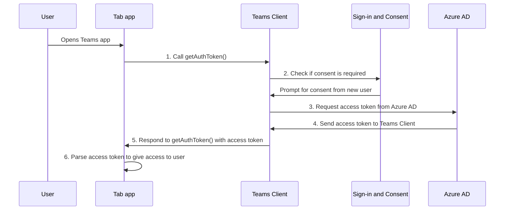

# Habilitar o logon único para o aplicativo de guia

<!--Single sign-on (SSO) allows a user to access an application or a web service after signing-in only once. The app users never have to go through authentication again.-->

Com o logon único no Teams, os usuários do aplicativo têm a vantagem de usar o Teams para acessar aplicativos. Depois de fazer logon no Teams usando a conta Microsoft ou do Microsoft 365, os usuários do aplicativo podem usar seu aplicativo sem precisar entrar novamente. Seu aplicativo está disponível para usuários de aplicativos em qualquer dispositivo com acesso concedido por meio do Azure AD.

Veja o que você aprenderá nesta seção:

1. **Experiência do usuário de logon único**: o Teams oferece aos usuários do aplicativo uma verdadeira experiência de logon único. Os usuários do aplicativo podem usar seu aplicativo sem entrar novamente.
2. **Logon único no Teams em runtime**: seu aplicativo de guia interage com o Azure AD em runtime para autenticação e autorização única para os usuários do aplicativo.
3. **Habilite o logon único para seu aplicativo de guia**: implemente as tarefas envolvidas para implementar o logon único em seu aplicativo de guia.

## Experiência do usuário de logon único no Teams

Os usuários do aplicativo entrarão no Teams usando uma conta pessoal da Microsoft ou uma conta do Microsoft 365. Você pode aproveitar isso e usar o logon único para autenticar e autorizar os usuários do aplicativo.

&nbsp;&nbsp;&nbsp;&nbsp;:::image type="content" source="../../../assets/images/authentication/teams-sso-tabs/teams-sso-ux.png" alt-text="Experiência do usuário de logon único em um aplicativo de guia do Teams":::

- O Teams autentica e armazena a identidade do usuário do aplicativo.
- Seu aplicativo de guia usa a identidade armazenada do usuário do aplicativo que já está validado pelo Teams.
- O usuário do aplicativo precisa dar consentimento ao Teams para usar a identidade a ser acessada para usar seu aplicativo de guia.
- O usuário do aplicativo pode acessar o aplicativo na Web, na área de trabalho ou no cliente móvel.

Você pode exibir aqui um exemplo de experiência do usuário com o logon único em um aplicativo de guia:

:::image type="content" source="../../../assets/images/authentication/teams-sso-tabs/sso-tab.gif" alt-text="Logon único no aplicativo de guia":::

### Aprimorar a experiência do usuário com o logon único

Veja o que os usuários do aplicativo ganham com a experiência de logon único:

- O Teams obtém o token de acesso para o usuário atual do aplicativo pelo Azure AD. Essa interação com o Azure AD não é visível para o usuário do aplicativo. Isso resulta em obter acesso ao aplicativo sem precisar sair do ambiente do Teams.
- Um usuário do aplicativo precisa consentir apenas em um ambiente multilocatário. Se o usuário do aplicativo e o aplicativo residirem no mesmo locatário, o usuário do aplicativo não precisará dar consentimento para usar o aplicativo.
- Depois de consentir para o Teams pela primeira vez, o usuário do aplicativo pode usar seu aplicativo sem ter mais a necessidade de consentir, mesmo em outro dispositivo. Por esse motivo, ele oferece uma melhor experiência do usuário.
  - Como alternativa, o administrador de locatários pode dar consentimento em nome dos usuários do aplicativo. Nesse cenário, quando o administrador de locatários consente para os usuários do aplicativo no locatário, não será necessário solicitar o consentimento dos usuários do aplicativo. Isto significa que os usuários do aplicativo não veem as caixas de diálogo de consentimento e podem acessar o aplicativo diretamente.
- O token de acesso é pré-buscado pelo Teams para melhorar o desempenho e o tempo de carregamento do aplicativo no ambiente do Teams.
- Os usuários do aplicativo não precisam memorizar ou gravar várias senhas para acessar e usar aplicativos no ambiente do Teams.

> [!NOTE]
> Os usuários do aplicativo não podem conceder permissão a alguns escopos de permissão, como o `Sites.ReadWrite.All`, o que permite que o usuário do aplicativo leia e grave em todos os ativos do SharePoint e do OneDrive no locatário. Para esses escopos, somente o administrador de locatários pode dar consentimento em nome do usuário do aplicativo.

Agora, vamos ver o que acontece no back-end durante o runtime para obter a experiência de logon único no Teams.

## Logon único no Teams em runtime

Obtenha o logon único em um aplicativo de guia obtendo o token de acesso para o usuário do aplicativo Teams que está conectado no momento. Esse processo inclui o cliente e o servidor do aplicativo de guia, o cliente do Teams e o Azure AD. Durante essa interação, o usuário do aplicativo deve dar consentimento para usar a identidade do Teams para obter o token de acesso em um ambiente multilocatário.

A imagem a seguir mostra como o logon único funciona quando um usuário do aplicativo Teams tenta acessar o aplicativo de guia:

:::image type="content" source="../../../assets/images/authentication/teams-sso-tabs/sso-runtime-seqd.png" alt-text="Diagrama de logon único de guia" lightbox="../../../assets/images/authentication/teams-sso-tabs/sso-runtime-seqd.png":::

| # | Interação | O que está acontecendo |
| --- | --- | --- |
| 1 | Aplicativo de guia → cliente do Teams | O aplicativo de guia faz uma chamada JavaScript para `getAuthToken()`, que informa ao Teams para obter um token de acesso. |
| 2 | Cliente do Teams → Azure AD | O Teams solicita o ponto de extremidade do Azure AD para o token de acesso para o usuário atual do aplicativo com base na identidade do Teams. |
| 3 | Azure AD → Formulário de consentimento | Se o usuário atual do aplicativo estiver usando seu aplicativo de guia pela primeira vez, o Teams exibirá a solicitação de consentimento se o aplicativo precisar acessar dados protegidos. O usuário do aplicativo (ou o administrador) deve dar consentimento ao Teams para usar a identidade do Teams do usuário do aplicativo para obter o token de acesso do Azure AD.   Como alternativa, haverá uma solicitação para lidar com a autenticação step-up, como a autenticação de dois fatores. |
| 4 | Azure AD → Cliente do Teams | O Azure AD envia o token de acesso para o cliente do Teams. O token é um Token Web JSON (JWT) e sua validação funciona como uma validação de token na maioria dos fluxos padrão do OAuth. O Teams armazena o token em seu nome para que futuras chamadas para `getAuthToken()` retornem o token armazenado em cache. |
| 5 | Cliente do Teams → Cliente do aplicativo de guia | O Teams envia o token de acesso para o aplicativo de guia como parte do objeto de resultado retornado pela chamada do `getAuthToken()`. |
| 6 | Aplicativo de guia (entre servidor e cliente) | O aplicativo de guia analisa o token de acesso usando o JavaScript para extrair as informações necessárias, como o endereço de email do usuário do aplicativo. O token devolvido para o aplicativo de guia é um token de acesso e um token de identidade. |

Para obter mais informações, confira [Atualizar o código para habilitar o logon único](tab-sso-code.md).

> [!IMPORTANT]
> O `getAuthToken()` é válido apenas para permitir um conjunto limitado de APIs a nível de usuário, como email, perfil, offline_access e OpenId. Ele não é usado para escopos do Graph como `User.Read` ou `Mail.Read`. Para obter soluções alternativas sugeridas, confira [Estender seu aplicativo com permissões do Microsoft Graph](tab-sso-graph-api.md).

As guias são páginas da Web com reconhecimento do Teams. Para habilitar o logon único em uma página da Web hospedada dentro de um aplicativo de guia, adicione o [SDK do cliente do Javascript do Teams](/javascript/api/overview/msteams-client?view=msteams-client-js-latest&preserve-view=true) e chame `microsoftTeams.initialize()`. Após a inicialização, chame `microsoftTeams.getAuthToken()` para obter o token de acesso para seu aplicativo.

### Casos de uso para habilitar o logon único

Você pode habilitar o logon único no Teams para todos os aplicativos que dão suporte ao Azure AD como um provedor de identidade. Além de usar o logon único para autenticar usuários de aplicativos em um aplicativo de guia, você também pode usá-lo para habilitar o acesso contínuo no Teams.

Alguns cenários em que você pode usar a API de logon único para autenticar os usuários do seu aplicativo são:

- Se você quiser autenticar os usuários do seu aplicativo em um aplicativo de guia do Teams, a API de logon único permitirá que os usuários do aplicativo usem seu aplicativo no Teams sem a necessidade de autenticação adicional. Com base na identidade do Teams do usuário do aplicativo, você pode obter o token de acesso para eles pelo Azure AD.
- Se seu aplicativo usar o módulo de tarefa de dentro de um bot, uma guia, uma extensão de mensagem ou Cartões Adaptáveis, você poderá usar a API de logon único para autenticar os usuários do seu aplicativo.
- Você também pode usar a API de logon único para autenticar os usuários do aplicativo que desejam acessar a Exibição Estendida sem precisar de validação novamente.

> [!TIP]
> Você também pode usar a API de logon único para autenticar usuários de aplicativos em [módulos de tarefas](../../../task-modules-and-cards/what-are-task-modules.md) que inserem conteúdo da Web.

Para obter o logon único em runtime, configure seu aplicativo para habilitar o logon único para autenticar e autorizar usuários de aplicativos.

## Habilitar o logon único para um aplicativo de guia

Esta seção descreve as tarefas incluídas na implementação do logon único para um aplicativo de guia. Essas tarefas possuem uma linguagem e estrutura desconhecida.

Para habilitar o logon único para um aplicativo de guia:

&nbsp;&nbsp;&nbsp;&nbsp;&nbsp;:::image type="content" source="../../../assets/images/authentication/teams-sso-tabs/enable-sso.png" alt-text="Etapas para habilitar o logon único para guia" lightbox="../../../assets/images/authentication/teams-sso-tabs/enable-sso.png":::

1. **Registre-se no Azure AD**: crie um aplicativo Azure AD para gerar uma ID do aplicativo e o URI da ID do aplicativo. Para gerar o token de acesso, configure escopos e autorize aplicativos cliente confiáveis.
2. **Código de atualização**: adicione o código para manipular o token de acesso, chamando o `getAuthToken()` quando um usuário do aplicativo acessar seu aplicativo de guia, enviando esse token para o código do servidor do aplicativo no Cabeçalho autorização e validando o token de acesso quando ele é recebido.
3. **Atualizar o manifesto do aplicativo Teams**: atualize o manifesto do aplicativo Cliente do Teams com a ID do aplicativo e o URI da ID do aplicativo gerados no Azure AD para permitir que o Teams solicite tokens de acesso em nome do seu aplicativo.

## Cookies de terceiros no iOS

Após a atualização do iOS 14, a Apple bloqueou o acesso de [cookies de terceiros](https://webkit.org/blog/10218/full-third-party-cookie-blocking-and-more/) para todos os aplicativos por padrão. Portanto, os aplicativos que utilizam cookies de terceiros para autenticação em suas guias de Canal ou Chat e aplicativos pessoais não poderão concluir seus fluxos de trabalho de autenticação em clientes iOS do Teams. Para estar em conformidade com os requisitos de privacidade e segurança, você deve migrar para um sistema baseado em token ou usar cookies primários para os fluxos de trabalho de autenticação do usuário.

### Suporte de cliente móvel do Teams

Para o aplicativo móvel do Teams, as versões de cliente que dão suporte ao logon único são:

- Teams para Android (1416/1.0.0.2020073101 and later)
- Teams para iOS (version: 2.0.18 and later)  
- ✔SDK do JavaScript do Teams (versão: 1.11 e posterior) para que o logon único funcione no painel lateral de reunião.

Para obter uma melhor experiência no Teams, use a versão mais recente do iOS e Android.

## Práticas recomendadas

Aqui está uma lista de práticas recomendadas:

- **Chame o token de acesso somente quando precisar dele**: chame o `getAuthToken()` somente quando precisar de um token de acesso. Você pode chamá-lo quando um usuário do aplicativo acessa seu aplicativo de guia ou para usar uma função específica que requer validação do usuário do aplicativo.
- **Não armazene o token de acesso no código do lado do cliente**: não armazene em cache ou armazene o token de acesso no código do lado do cliente do aplicativo. O Cliente do Teams armazena em cache o token de acesso (ou solicita um novo se ele expirar). Isso garante que não haja vazamento acidental do token do seu aplicativo Web.
- **Use o código do lado do servidor para chamadas do Microsoft Graph**: use sempre o código do lado do servidor para fazer as chamadas do Microsoft Graph ou outras chamadas que exijam a passagem de um token de acesso. Nunca retorne o token OBO ao cliente para permitir que o cliente faça chamadas diretas ao Microsoft Graph. Isso ajuda a proteger o token de ser interceptado ou vazado. Para mais informações, confira [Estender o aplicativo de guia com permissões e escopo do Microsoft Graph](tab-sso-graph-api.md).

## Limitações conhecidas

- Atualmente, o logon único no Teams dá suporte apenas ao token OAuth 2.0. Ele não dá suporte ao token SAML.
- Não há suporte para vários domínios por aplicativo. Para obter mais informações, confira [aplicativos LOB](tab-sso-register-aad.md#before-you-register-with-azure-ad).

## Próxima etapa

> [!div class="nextstepaction"]
> [Registrar seu aplicativo de guia no Azure AD](tab-sso-register-aad.md)

## Confira também

[Configurar código para habilitar o logon único em um aplicativo de guia](tab-sso-code.md)

<!--
### Use cases for enabling SSO for tab app

Here are some use cases where enabling SSO is beneficial. Call `getAuthToken()` in these scenarios to use Teams identity for obtaining access token for your app users:

- To get an app user’s identity from Teams if you have an existing app that you want to be available within a tab app in Teams.

- To authenticate an app user by reusing the Team’s identity inside your tab app.

- To authenticate and get an app user’s Teams identity inside configurable tabs. The app users don't need to sign in again. It's applicable to some settings that need to be configured at a configuration stage.

- To obtain an access token inside a task module, when it's invoked from a tab app, a bot app, a messaging extension app, or adaptive cards.

- To authenticate an app user in Stage view.

- To authenticate users for [task modules](../../../task-modules-and-cards/what-are-task-modules.md) that embed web content.
-->

<!--

-->

<!--
- Tenant admin consent: A simple way of [consenting on behalf of an organization as a tenant admin](/azure/active-directory/develop/v2-permissions-and-consent.md#requesting-consent-for-an-entire-tenant) is by getting [consent from admin](/azure/active-directory/manage-apps/grant-admin-consent).
  
    You can ask for consent using the Auth API. Another approach for getting Graph scopes is to present a consent dialog using our existing [third party OAuth provider authentication approach](~/tabs/how-to/authentication/auth-tab-aad.md#navigate-to-the-authorization-page-from-your-pop-up-page). This approach involves popping up an Azure AD consent dialog box.

  

  
To ask for additional consent using the Auth API, follow these steps:

    1. The token retrieved using `getAuthToken()` must be exchanged on the server-side using Azure AD [on-behalf-of flow (OBO)](/azure/active-directory/develop/v2-oauth2-on-behalf-of-flow) to get access to those other Graph APIs. Ensure you use the v2 Graph endpoint for this exchange.
    2. If the exchange fails, Azure AD returns an invalid grant exception. It usually responds with one of the two error messages, `invalid_grant` or `interaction_required`.
    3. When the exchange fails, you must ask for consent. Use the user interface (UI) to ask the app user to grant other consent. This UI must include a button that triggers an Azure AD consent dialog using [Silent authentication](~/concepts/authentication/auth-silent-aad.md).
    4. When asking for more consent from Azure AD, you must include `prompt=consent` in your [query-string-parameter](~/tabs/how-to/authentication/auth-silent-aad.md#get-the-user-context) to Azure AD, otherwise Azure AD wouldn't ask for other scopes.

        - Instead of `?scope={scopes}`, use `?prompt=consent&scope={scopes}`
        - Ensure that `{scopes}` includes all the scopes you're prompting the user for, for example, `Mail.Read` or `User.Read`.
    5. After the app user has granted more permissions, retry the OBO flow to get access to these other APIs.

    

-->
<!--
- If you want your existing app to be available within a Teams tab app, the SSO API allows your signed-in app users to use your app in Teams with no additional authentication needed. Based on the app user's Teams identity, you can obtain access token for them from Azure AD.
- If your app has configurable tabs, you can use `getAuthToken()` to allow app users into the tab app without signing in again. SSO is applicable to some settings that need to be configured at a configuration stage.
- Your app may have a bot, a tab, a message extension, or Adaptive Cards, and allows your app users to invoke task module from within a tab or a bot. The SSO API will authenticate your app users who attempt to access the task module. Teams can use the app user's Teams identity and obtain an access token from Azure AD.

- You can also use the SSO API for authenticating your app users who want to access to Stage view without need to be validated again. The access token obtained for the app user when they first used your app can be used to allow them to use Stage view. -->
