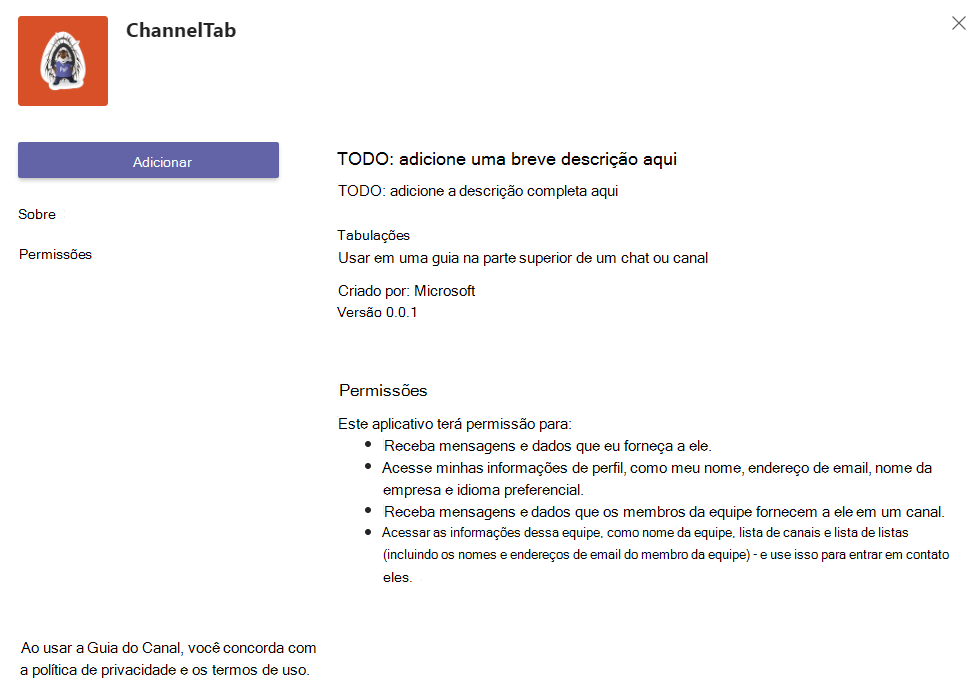

# <a name="create-a-channel-or-group-tab"></a>Criar um canal ou uma guia de grupo

## <a name="create-a-custom-channel-or-group-tab"></a>Criar um canal personalizado ou uma guia de grupo

Você pode criar uma guia de canal ou grupo usando Node.js e o Gerador Yeoman, ASP.NETCore ou MVC ASP.NETCore.

# <a name="nodejs"></a>[Node.js](#tab/nodejs)

### <a name="create-a-custom-channel-and-group-tab-using-nodejs-and-the-yeoman-generator"></a>Criar um canal personalizado e uma guia de grupo usando Node.js e o Gerador Yeoman

> [!NOTE]
> Este artigo segue as etapas descritas na com build [Seu](https://github.com/OfficeDev/generator-teams/wiki/Build-Your-First-Microsoft-Teams-App) primeiro wiki do aplicativo Microsoft Teams encontrado no repositório de GitHub do Microsoft OfficeDev.

Você pode criar um canal personalizado ou uma guia de grupo usando o [gerador Teams Yeoman](https://github.com/OfficeDev/generator-teams/).

### <a name="prerequisites-for-apps"></a>Pré-requisitos para aplicativos

Você deve ter uma compreensão dos seguintes pré-requisitos:

- Você deve ter um locatário Office 365 e uma equipe configurada com **Permitir o carregamento de aplicativos personalizados** habilitados. Para obter mais informações, [consulte prepare your Office 365 tenant](~/concepts/build-and-test/prepare-your-o365-tenant.md).

    > [!NOTE]
    > Se você não tiver uma conta Office 365, poderá inscrever-se para uma assinatura gratuita por meio do programa Office 365 Desenvolvedor. A assinatura permanece ativa desde que você a use para desenvolvimento contínuo. Consulte [welcome to the Office 365 Developer Program](/office/developer-program/microsoft-365-developer-program).

Além disso, este projeto exige que você tenha o seguinte instalado em seu ambiente de desenvolvimento:

- Qualquer editor de texto ou IDE. Você pode instalar e usar [Visual Studio Code](https://code.visualstudio.com/download) gratuitamente.

- [Node.js/npm](https://nodejs.org/en/). Use a versão LTS mais recente. O nó Gerenciador de Pacotes (npm) instala em seu sistema com a instalação de Node.js.

- Depois de instalar o Node.js, instale os pacotes [Yeoman](https://yeoman.io/) e [gulp-cli](https://www.npmjs.com/package/gulp-cli) inserindo o seguinte no prompt de comando:

    ```bash
    npm install yo gulp-cli --global
    ```

- Instale o Microsoft Teams aplicativos inserindo o seguinte no prompt de comando:

    ```bash
    npm install generator-teams --global
    ```

### <a name="generate-your-project"></a>Gerar seu projeto

**Para gerar seu projeto**

1. Em um prompt de comando, crie um novo diretório para seu projeto de guia.

1. Para iniciar o gerador, vá para o novo diretório e digite o seguinte comando:

    ```bash
    yo teams
    ```

1. Em seguida, forneça uma série de valores usados no arquivomanifest.js **no** aplicativo:

    

    **Qual é o nome da solução?**

    Esse é o nome do seu projeto. Você pode aceitar o nome sugerido selecionando a **tecla Enter.**

    **Onde você deseja colocar os arquivos?**

    No momento, você está no diretório do projeto. Selecione **Inserir**.

    **Título do seu projeto Microsoft Teams aplicativo?**

    Esse é o nome do pacote do aplicativo e será usado no manifesto e na descrição do aplicativo. Insira um título ou selecione **Enter** para aceitar o nome padrão.

    **Seu nome (empresa) ? (máx. 32 caracteres)**

    O nome da empresa será usado no manifesto do aplicativo. Insira um nome da empresa ou selecione **Enter** para aceitar o nome padrão.

    **Qual versão de manifesto você gostaria de usar?**

    Selecione o esquema padrão.

    **Scaffolding rápido? (Y/n)**

    O padrão é sim; insira **n** para inserir sua ID do Microsoft Partner.

    **Insira sua ID do Microsoft Partner, se você tiver uma? (Deixe em branco para ignorar)**

    Esse campo não é obrigatório e só deve ser usado se você já faz parte da [Rede de Parceiros da Microsoft.](https://partner.microsoft.com)

    **O que você deseja adicionar ao seu projeto?**

    Selecione **( ) Uma &ast; guia**.

    **A URL onde você hospedará essa solução?**

    Por padrão, o gerador sugere uma URL de Sites do Azure. Você só está testando seu aplicativo localmente, portanto, uma URL válida não é necessária.

    **Você gostaria de mostrar um indicador de carregamento quando seu aplicativo/guia é carregado?**

    Escolha **não incluir** um indicador de carregamento quando seu aplicativo ou guia for carregado. O padrão é não, digite **n**.

   **Você gostaria que aplicativos pessoais fossem renderizados sem uma barra de texto de tabulação?**

    Escolha **não** incluir aplicativos pessoais a serem renderizados sem uma barra de header-bar de tabulação. O padrão é não, digite **n**.

    **Você gostaria de incluir a estrutura de teste e testes iniciais? (y/N)**

    Escolha **não** incluir uma estrutura de teste para este projeto. O padrão é sim; enter **n**.

    **Você gostaria de usar aplicativos do Azure Insights para telemetria? (y/N)**

    Escolha **não** incluir o [aplicativo Azure Insights](/azure/azure-monitor/app/app-insights-overview). O padrão é não; enter **n**.

    **Nome da guia padrão (máx. 16 caracteres)?**

    Nomeia sua guia. Esse nome de guia será usado em todo o seu projeto como um componente de caminho de arquivo ou URL.

    **Que tipo de Guia você gostaria de criar?**

    Use as teclas de seta para selecionar **a guia Configurável.**

    **Quais escopos você pretende usar para sua Guia?**

    Você pode selecionar uma equipe ou um chat em grupo.

    **Você precisa do suporte para o Microsoft Azure Active Directory com Login Único para a guia?**

    Escolha **não** incluir o suporte ao Azure AD Single-Sign-On para a guia. O padrão é sim, digite **n**.

    **Deseja que essa guia seja disponibilizada no SharePoint Online? (Y/n)**

    Insira **n**.

    > [!IMPORTANT]
    > O componente de **caminho yourDefaultTabNameTab**, é o valor que você inscrevia no gerador para **Nome** da Guia Padrão mais a **palavra Tab**.
    >
    > Por exemplo: DefaultTabName: **MyTab**  >  **/MyTabTab/**

1. Em Visual Studio Code ou em qualquer editor de código, vá para o diretório do projeto e abra o seguinte arquivo:

    ```bash
    ./src/app/scripts/<yourDefaultTabNameTab>/<yourDefaultTabNameTab>.tsx
    ```

1. Localize `render()` o método e adicione a seguinte marca e conteúdo à parte superior do código do `<div>` `<PanelBody>` contêiner:

    ```html
        <PanelBody>
            <div style={styles.section}>
                Hello World! Yo Teams rocks!
            </div>
        </PanelBody>
    ```

1. Certifique-se de salvar o arquivo atualizado.

### <a name="build-and-run-your-application"></a>Criar e executar seu aplicativo

Em um prompt de comando, abra o diretório do projeto para concluir as próximas tarefas.

#### <a name="create-the-app-package"></a>Criar o pacote do aplicativo

Você deve ter um pacote de aplicativos para testar sua guia Teams. É uma pasta zip que contém os seguintes arquivos necessários:

- Um **ícone de cor completo** medindo 192 x 192 pixels.
- Um **ícone de contorno transparente** medindo 32 x 32 pixels.
- Um **manifest.json** que especifica os atributos do seu aplicativo.

O pacote é criado por meio de uma tarefa gulp que valida o manifest.jsno arquivo on e gera a pasta zip no **diretório ./package.** No prompt de comando, insira o seguinte comando:

```bash
gulp manifest
```

#### <a name="build-your-application"></a>Criar seu aplicativo

O comando build transpila sua solução para a **pasta ./dist.** Insira o seguinte comando no prompt de comando:

```bash
gulp build
```

#### <a name="run-your-application-in-localhost"></a>Executar seu aplicativo no localhost

1. Inicie um servidor Web local inserindo o seguinte no prompt de comando:

    ```bash
    gulp serve
    ```

1. Insira `http://localhost:3007/<yourDefaultAppNameTab>/` no navegador, substitua **seuDefaultAppNameTab** pelo nome da guia e exibir a home page do aplicativo, conforme mostrado na imagem a seguir:

    

1. Para exibir sua página de configuração de tabulação, vá para `https://localhost:3007/<yourDefaultAppNameTab>/config.html` . O seguinte é mostrado:

    

### <a name="establish-a-secure-tunnel-to-your-tab"></a>Estabelecer um túnel seguro para sua guia

Microsoft Teams é um produto baseado em nuvem e exige que o conteúdo da guia seja disponibilizado na nuvem usando pontos de extremidade HTTPS. Teams não permite hospedagem local. Você deve publicar sua guia em uma URL pública ou usar um proxy que exponha sua porta local a uma URL voltada para a Internet.

Para testar sua extensão de tabulação, use [ngrok](https://ngrok.com/docs), que é integrado a esse aplicativo. O Ngrok é uma ferramenta de software de proxy reverso que cria um túnel para os pontos de extremidade HTTPS do servidor Web em execução localmente. Os pontos de extremidade da Web do seu servidor estão disponíveis durante a sessão atual em seu computador. Quando o computador é desligado ou vai para o sono, o serviço não está mais disponível.

No prompt de comando, saia do localhost e insira o seguinte:

```bash
gulp ngrok-serve
```

> [!IMPORTANT]
> Depois que sua guia for carregada no Microsoft Teams e salva com êxito, você poderá exibi-la na galeria de guias, adicioná-la à barra de guias e interagir com ela até que sua sessão de túnel de ngrok termine. Se você reiniciar sua sessão de ngrok, deverá atualizar seu aplicativo com a nova URL.

### <a name="upload-your-application-to-teams"></a>Upload seu aplicativo para Teams

**Para carregar seu aplicativo para Teams**

1. Vá para Microsoft Teams. Se você usar a [versão baseada na Web,](https://teams.microsoft.com) poderá inspecionar seu código front-end usando as ferramentas de desenvolvedor [do navegador.](~/tabs/how-to/developer-tools.md)
1. Em suas equipes no painel esquerdo, selecione as releições &#x25CF;&#x25CF;&#x25CF; ao lado da equipe que você está usando para testar sua guia e escolha **Gerenciar equipe**.
1. No painel principal, selecione **Aplicativos** na barra de guias e escolha Upload um **aplicativo** personalizado localizado no canto inferior direito da página.
1. Vá para o diretório do projeto, navegue até a pasta **./package,** selecione a pasta zip do pacote do aplicativo e escolha **Abrir**.

    

1. Selecione **Adicionar** na caixa de diálogo pop-up. Sua guia é carregada em Teams.
1. Retorne à sua equipe, escolha o canal onde você deseja exibir a guia, selecione ➕ na barra de guias e escolha sua guia na galeria.
1. Siga as instruções para adicionar uma guia. Há uma caixa de diálogo de configuração personalizada para seu canal ou guia de grupo.
1. Selecione **Salvar** e sua guia é adicionada à barra de guias do canal.

    

# <a name="aspnet-core"></a>[ASP.NET Core](#tab/aspnetcore)

### <a name="create-a-custom-channel-or-group-tab-with-aspnet-core"></a>Criar um canal personalizado ou uma guia de grupo com ASP.NET Core

Você pode criar um canal personalizado ou uma guia de grupo usando a C# e ASP.Net core de lâmina. [O App Studio para Microsoft Teams](~/concepts/build-and-test/app-studio-overview.md) também é usado para finalizar o manifesto do aplicativo e implantar sua guia para Teams.

### <a name="prerequisites-for-teams-apps"></a>Pré-requisitos para Teams aplicativos

Você deve ter uma compreensão dos seguintes pré-requisitos:

- Você deve ter um locatário Office 365 e uma equipe configurada com **Permitir o carregamento de aplicativos personalizados** habilitados. Para obter mais informações, [consulte prepare your Office 365 tenant](~/concepts/build-and-test/prepare-your-o365-tenant.md).

    > [!NOTE]
    > Se você não tiver uma conta Microsoft 365, poderá inscrever-se para uma assinatura gratuita por meio do [Programa de Desenvolvedores da Microsoft.](https://developer.microsoft.com/en-us/microsoft-365/dev-program) A assinatura permanece ativa desde que você a use para desenvolvimento contínuo.

- Use o App Studio para importar seu aplicativo para Teams. Para instalar o App Studio, selecione **Aplicativo** da Loja de Aplicativos no canto inferior esquerdo do aplicativo Teams  pesquise **por App Studio**. Depois de encontrar o azulejo, selecione-o e escolha **Adicionar** na caixa de diálogo pop-up para instalá-lo.

Além disso, este projeto exige que você tenha o seguinte instalado em seu ambiente de desenvolvimento:

- A versão atual do Visual Studio IDE com a carga de trabalho de desenvolvimento entre **plataformas .NET CORE** instalada. Se você ainda não tiver Visual Studio, poderá baixar e instalar a versão Microsoft Visual Studio Community [versão](https://visualstudio.microsoft.com/downloads) mais recente gratuitamente.

- A [ferramenta proxy reverso ngrok.](https://ngrok.com) Use ngrok para criar um túnel para os pontos de extremidade HTTPS do servidor Web em execução localmente. Você pode [baixar ngrok](https://ngrok.com/download).

### <a name="get-the-source-code"></a>Obter o código-fonte

Em um prompt de comando, crie um novo diretório para seu projeto de guia. Um projeto simples é fornecido para você começar. Clone o repositório de exemplo em seu novo diretório usando o seguinte comando:

```bash
git clone https://github.com/OfficeDev/microsoft-teams-sample-tabs.git
```

Como alternativa, você pode recuperar o código-fonte baixando a pasta zip e extraindo os arquivos.

**Para criar e executar o projeto de guia**

1. Depois de ter o código-fonte, vá para Visual Studio e selecione **Abrir um projeto ou solução**.
1. Vá para o diretório de aplicativos de tabulação e abra **ChannelGroupTab.sln**.
1. Para criar e executar seu aplicativo, pressione **F5** ou escolha **Iniciar Depuração** no menu **Depurar.**
1. Em um navegador, vá para as SEGUINTES URLs e verifique se o aplicativo foi carregado corretamente:

    - `http://localhost:44355`
    - `http://localhost:44355/privacy`
    - `http://localhost:44355/tou`

### <a name="review-the-source-code"></a>Revisar o código-fonte

#### <a name="startupcs"></a>Startup.cs

Esse projeto foi criado a partir de um modelo vazio do Aplicativo Web 2.2 do ASP.NET Core 2.2 com a caixa de seleção Avançado - Configurar para **HTTPS** selecionada na instalação. Os serviços MVC são registrados pelo método da estrutura de injeção de `ConfigureServices()` dependência. Além disso, o modelo vazio não habilita o serviço de conteúdo estático por padrão, portanto, o middleware de arquivos estáticos é adicionado ao método usando `Configure()` o seguinte código:

```csharp
public void ConfigureServices(IServiceCollection services)
  {
    services.AddMvc().SetCompatibilityVersion(CompatibilityVersion.Version_2_2);
  }
public void Configure(IApplicationBuilder app)
  {
    app.UseStaticFiles();
    app.UseMvc();
  }
```

#### <a name="wwwroot-folder"></a>pasta wwwroot

Em ASP.NET Core, a pasta raiz da Web é onde o aplicativo procura arquivos estáticos.

#### <a name="indexcshtml"></a>Index.cshtml

ASP.NET Core trata arquivos chamados **Index** como o padrão ou home page do site. Quando a URL do navegador aponta para a raiz do site, **Index.cshtml** é exibida como a home page do aplicativo.

#### <a name="tabcs"></a>Tab.cs

Esse C# contém um método chamado de **Tab.cshtml** durante a configuração.

#### <a name="appmanifest-folder"></a>Pasta AppManifest

Esta pasta contém os seguintes arquivos de pacote de aplicativos necessários:

- Um **ícone de cor completo** medindo 192 x 192 pixels.
- Um **ícone de contorno transparente** medindo 32 x 32 pixels.
- Um **manifest.json** que especifica os atributos do seu aplicativo.

Esses arquivos precisam ser cortados em um pacote de aplicativos para uso ao carregar sua guia para Teams. Quando um usuário opta por adicionar ou atualizar sua guia, Microsoft Teams carrega o especificado em seu manifesto, incorpora-o em um IFrame e a renderiza em `configurationUrl` sua guia.

#### <a name="csproj"></a>.csproj

Na janela Visual Studio Do Explorador de Soluções, clique com o botão direito do mouse no projeto e selecione **Editar Project Arquivo**. No final do arquivo, você vê o seguinte código que cria e atualiza sua pasta zip quando o aplicativo é construído:

```xml
<PropertyGroup>
    <PostBuildEvent>powershell.exe Compress-Archive -Path \"$(ProjectDir)AppManifest\*\" -DestinationPath \"$(TargetDir)tab.zip\" -Force</PostBuildEvent>
  </PropertyGroup>

  <ItemGroup>
    <EmbeddedResource Include="AppManifest\icon-outline.png">
      <CopyToOutputDirectory>Always</CopyToOutputDirectory>
    </EmbeddedResource>
    <EmbeddedResource Include="AppManifest\icon-color.png">
      <CopyToOutputDirectory>Always</CopyToOutputDirectory>
    </EmbeddedResource>
    <EmbeddedResource Include="AppManifest\manifest.json">
      <CopyToOutputDirectory>Always</CopyToOutputDirectory>
    </EmbeddedResource>
  </ItemGroup>
```

### <a name="establish-a-secure-tunnel-to-your-tab-for-teams"></a>Estabeleça um túnel seguro para sua guia para Teams

Microsoft Teams é um produto baseado em nuvem e exige que o conteúdo da guia seja disponibilizado na nuvem usando pontos de extremidade HTTPS. Teams não permite hospedagem local. Você deve publicar sua guia em uma URL pública ou usar um proxy que exponha sua porta local a uma URL voltada para a Internet.

Para testar sua guia, use [ngrok](https://ngrok.com/docs). Os pontos de extremidade da Web do seu servidor estão disponíveis enquanto o ngrok está em execução no computador. Na versão gratuita do ngrok, se você fechar o ngrok, as URLs serão diferentes na próxima vez em que você a iniciar.

- Em um prompt de comando na raiz do diretório do projeto, execute o seguinte comando:

    ```bash
    ngrok http https://localhost:44355 -host-header="localhost:44355"
    ```

- O Ngrok escuta as solicitações da Internet e as encaminha para seu aplicativo quando está sendo executado na porta 44355. Deve parecer `https://y8rCgT2b.ngrok.io/` onde **y8rCgT2b** é substituído pela URL HTTPS alfanumérico ngrok.

- Certifique-se de manter o prompt de comando com o ngrok em execução e anote a URL.

### <a name="update-your-application"></a>Atualizar seu aplicativo

Em **Tab.cshtml,** o aplicativo apresenta ao usuário dois botões de opção para exibir a guia com um ícone vermelho ou cinza. Escolher os **gatilhos do** botão Selecionar Cinza ou Selecionar Vermelho ou , respectivamente, define e habilita o botão  `saveGray()` `saveRed()` `settings.setValidityState(true)` **Salvar** na página de configuração. Esse código permite Teams que você concluiu os requisitos de configuração e que a instalação pode continuar. Os parâmetros de `settings.setSettings` são definidos. Por fim, `saveEvent.notifySuccess()` é chamado para indicar que a URL de conteúdo foi resolvida com êxito.

#### <a name="_layoutcshtml"></a>_Layout.cshtml

Para que sua guia seja exibida Teams, você deve incluir o **SDK** do cliente JavaScript Microsoft Teams e incluir uma chamada depois que a página `microsoftTeams.initialize()` for carregada. É assim que sua guia e o cliente Teams se comunicam:

Vá para **a pasta Shared,** abra **_Layout.cshtml** e adicione o seguinte à `<head>` marca:

```html
<script src="https://ajax.aspnetcdn.com/ajax/jQuery/jquery-3.4.1.min.js"></script>
<script src="https://statics.teams.cdn.office.net/sdk/v1.6.0/js/MicrosoftTeams.min.js"></script>
```

> [!IMPORTANT]
> Não copie e colará `<script src="...">` as URLs desta página, pois elas não representam a versão mais recente. Para obter a versão mais recente do SDK, sempre vá [para Microsoft Teams API JavaScript](https://www.npmjs.com/package/@microsoft/teams-js).

#### <a name="tabcshtml"></a>Tab.cshtml

**Para atualizar Tab.cshtml**

1. Abra **Tab.cshtml** no Visual Studio e atualize o `<script>` .

1. Na parte superior do script, chame `microsoftTeams.initialize()` .

1. Atualize `websiteUrl` os valores e em cada função com a URL de `contentUrl` ngrok HTTPS para sua guia.

    Seu código agora deve incluir o seguinte **com y8rCgT2b** substituído pela URL do ngrok:

    ```javascript
        microsoftTeams.initialize();

        let saveGray = () => {
            microsoftTeams.settings.registerOnSaveHandler(function (saveEvent) {
                microsoftTeams.settings.setSettings({
                    websiteUrl: `https://y8rCgT2b.ngrok.io`,
                    contentUrl: `https://y8rCgT2b.ngrok.io/gray/`,
                    entityId: "grayIconTab",
                    suggestedDisplayName: "MyNewTab"
                });
                saveEvent.notifySuccess();
            });
        }

        let saveRed = () => {
            microsoftTeams.settings.registerOnSaveHandler(function (saveEvent) {
                microsoftTeams.settings.setSettings({
                    websiteUrl: `https://y8rCgT2b.ngrok.io`,
                    contentUrl: `https://y8rCgT2b.ngrok.io/red/`,
                    entityId: "redIconTab",
                    suggestedDisplayName: "MyNewTab"
                });
                saveEvent.notifySuccess();
        });
        }
    ```

1. Salve o **Tab.cshtml atualizado**.

### <a name="build-and-run-your-application-for-teams"></a>Criar e executar seu aplicativo para Teams

**Para criar e executar seu aplicativo**

1. Em Visual Studio, pressione **F5** ou escolha **Iniciar Depuração** no menu **Depurar.**
1. Verifique se **o ngrok** está sendo executado e funcionando corretamente abrindo seu navegador e indo para sua página de conteúdo por meio da URL HTTPS ngrok fornecida na janela do prompt de comando.

> [!TIP]
> Você precisa ter seu aplicativo no Visual Studio e ngrok em execução para concluir as etapas fornecidas neste artigo. Se você precisar parar de executar seu aplicativo Visual Studio para trabalhar nele, **mantenha o ngrok em execução**. Ele escuta e retoma o roteamento da solicitação do aplicativo quando ele é reiniciado no Visual Studio. Se você tiver que reiniciar o serviço ngrok, ele retornará uma nova URL e será preciso atualizar seu aplicativo com a nova URL.

### <a name="upload-your-tab-for-teams"></a>Upload sua guia para Teams

> [!NOTE]
> O App Studio pode ser usado para editar seu **manifest.jsno** arquivo e carregar o pacote concluído para Teams. Você também pode editar manualmente o **manifest.jsno** arquivo. Se fizer isso, certifique-se de criar a solução novamente para criar o arquivo **tab.zip** para carregar.

**Para carregar sua guia com o App Studio**

1. Vá para Microsoft Teams. Se você usar a [versão baseada na Web,](https://teams.microsoft.com)poderá inspecionar seu código front-end usando as ferramentas de desenvolvedor [do navegador.](~/tabs/how-to/developer-tools.md)

1. Vá para **o App Studio** e selecione a guia Editor **de** manifesto.

1. Selecione **Importar um aplicativo existente** no editor de **Manifesto** para começar a atualizar o pacote de aplicativos para sua guia. O código-fonte vem com seu próprio manifesto parcialmente completo. O nome do pacote do aplicativo é **tab.zip**. Ele está disponível no seguinte caminho:

    ```bash
    /bin/Debug/netcoreapp2.2/tab.zip
    ```

1. Upload **tab.zip** App Studio.

#### <a name="update-your-app-package-with-manifest-editor"></a>Atualizar seu pacote de aplicativos com o editor de manifesto

Depois de carregar seu pacote de aplicativos no App Studio, você deve configurá-lo.

Selecione o azulejo para sua guia recém-importada no painel direito da página de boas-vindas do editor de manifesto.

Há uma lista de etapas no lado esquerdo do editor de Manifesto e, à direita, uma lista de propriedades que devem ter valores para cada uma dessas etapas. Grande parte das informações foi fornecida pelo seumanifest.js **em,** mas há campos que você deve atualizar.

##### <a name="details-app-details"></a>Detalhes: Detalhes do aplicativo

Na seção **Detalhes do** aplicativo:

1. Em **Identificação**, selecione **Gerar** para substituir a ID do espaço reservado pelo GUID necessário para sua guia.

1. Em **Informações do desenvolvedor**, **atualize Site** com sua URL HTTPS **ngrok.**

1. Em **URLs do aplicativo,** atualize a **instrução Privacy** para `https://<yourngrokurl>/privacy` e Termos de **uso** para `https://<yourngrokurl>/tou`>.

##### <a name="capabilities-tabs"></a>Recursos: guias

Na seção **Guias:**

1. Na **guia Equipe,** selecione **Adicionar**.

1. Na janela **pop-up da guia** Equipe, atualize a URL de **configuração** para `https://<yourngrokurl>/tab` .

1. Verifique se as caixas de seleção Pode **atualizar configuração?**, **Equipe** e **Chat** de Grupo estão selecionadas e selecione **Salvar**.

##### <a name="finish-domains-and-permissions"></a>Concluir: domínios e permissões

Na seção **Domínios e** permissões, **domínios** de suas guias devem conter sua URL ngrok sem o prefixo HTTPS `<yourngrokurl>.ngrok.io/` .

##### <a name="finish-test-and-distribute"></a>Concluir: Testar e distribuir

> [!IMPORTANT]
> À direita, em **Descrição,** você verá o seguinte aviso:
>
> &#9888; "**A matriz 'validDomains' não pode conter um site de tunelamento...**"
>
> Esse aviso pode ser ignorado durante o teste da guia.

1. Na seção **Testar e Distribuir,** selecione **Instalar**.

1. Na caixa de diálogo pop-up, selecione **Adicionar a** uma equipe ou no drop-down, selecione Adicionar a **um chat**.

1. Escolha a equipe ou o chat onde você deseja que a guia seja exibida e selecione **Configurar uma guia**.

1. Na próxima caixa de diálogo pop-up, escolha **Selecionar** Cinza ou **Selecionar Vermelho** e **selecione Salvar**.

1. Para exibir sua guia, vá para a equipe ou chat onde você instalou a guia e selecione-a na barra de guias. A página escolhida durante a configuração é exibida.

    

# <a name="aspnet-core-mvc"></a>[ASP.NET Core MVC](#tab/aspnetcoremvc)

### <a name="create-a-custom-channel-or-group-tab-with-aspnet-core-mvc"></a>Criar um canal personalizado ou uma guia de grupo com ASP.NET Core MVC

Você pode criar um canal personalizado ou uma guia de grupo usando C# e ASP.Net Core MVC. [O App Studio para Microsoft Teams](~/concepts/build-and-test/app-studio-overview.md) também é usado para finalizar o manifesto do aplicativo e implantar sua guia para Teams.

### <a name="prerequisites-for-custom-channel-or-group-tab"></a>Pré-requisitos para canal personalizado ou guia grupo

- Você deve ter um locatário Microsoft 365 e uma equipe configurada com **Permitir o carregamento de aplicativos personalizados** habilitados. Para obter mais informações, [consulte prepare your Office 365 tenant](~/concepts/build-and-test/prepare-your-o365-tenant.md).

    > [!NOTE]
    > Se você não tiver uma conta Microsoft 365, poderá inscrever-se para uma assinatura gratuita por meio do [Programa de Desenvolvedores da Microsoft.](https://developer.microsoft.com/en-us/microsoft-365/dev-program) A assinatura permanece ativa desde que você a use para desenvolvimento contínuo.

- Use o App Studio para importar seu aplicativo para Teams. Para instalar o App Studio, selecione **Aplicativo** da Loja de Aplicativos no canto inferior esquerdo do aplicativo Teams  pesquise **por App Studio**. Depois de encontrar o azulejo, selecione-o e escolha **Adicionar** na caixa de diálogo pop-up para instalá-lo.

Além disso, este projeto exige que você tenha o seguinte instalado em seu ambiente de desenvolvimento:

- A versão atual do Visual Studio IDE com a carga de trabalho de desenvolvimento entre **plataformas .NET CORE** instalada. Se você ainda não tiver Visual Studio, poderá baixar e instalar a versão Microsoft Visual Studio Community [versão](https://visualstudio.microsoft.com/downloads) mais recente gratuitamente.

- A [ferramenta proxy reverso ngrok.](https://ngrok.com) Use ngrok para criar um túnel para os pontos de extremidade HTTPS do servidor Web em execução localmente. Você pode [baixar ngrok](https://ngrok.com/download).

### <a name="get-the-source-code"></a>Obter o código-fonte

Em um prompt de comando, crie um novo diretório para seu projeto de guia. Um projeto [simples de Guia de Grupo](https://github.com/OfficeDev/microsoft-teams-sample-tabs/tree/master/ChannelGroupTabMVC) de Canal é fornecido para você começar. Clone o repositório de exemplo em seu novo diretório usando o seguinte comando:

```bash
git clone https://github.com/OfficeDev/microsoft-teams-sample-tabs.git
```

Como alternativa, você pode recuperar o código-fonte baixando a pasta zip e extraindo os arquivos.

**Para criar e executar o projeto de guia**

1. Depois de ter o código-fonte, vá para Visual Studio e selecione **Abrir um projeto ou solução**.
1. Vá para o diretório de aplicativos de tabulação e abra **ChannelGroupTabMVC.sln**.
1. Para criar e executar seu aplicativo, pressione **F5** ou escolha **Iniciar Depuração** no menu **Depurar.**
1. Em um navegador, navegue até as SEGUINTES URLs e verifique se o aplicativo foi carregado corretamente:

    - `http://localhost:44360`
    - `http://localhost:44360/privacy`
    - `http://localhost:44360/tou`

### <a name="review-the-source-code"></a>Revisar o código-fonte

#### <a name="startupcs"></a>Startup.cs

Esse projeto foi criado a partir de um modelo vazio do Aplicativo Web 2.2 do ASP.NET Core 2.2 com a caixa de seleção Avançado - Configurar para **HTTPS** selecionada na instalação. Os serviços MVC são registrados pelo método da estrutura de injeção de `ConfigureServices()` dependência. Além disso, o modelo vazio não habilita o serviço de conteúdo estático por padrão, portanto, o middleware de arquivos estáticos é adicionado ao método usando `Configure()` o seguinte código:

```csharp
public void ConfigureServices(IServiceCollection services)
  {
    services.AddMvc().SetCompatibilityVersion(CompatibilityVersion.Version_2_2);
  }
public void Configure(IApplicationBuilder app)
  {
    app.UseStaticFiles();
    app.UseMvc();
  }
```

#### <a name="wwwroot-folder"></a>pasta wwwroot

Em ASP.NET Core, a pasta raiz da Web é onde o aplicativo procura arquivos estáticos.

#### <a name="appmanifest-folder"></a>Pasta AppManifest

Esta pasta contém os seguintes arquivos de pacote de aplicativos necessários:

- Um **ícone de cor completo** medindo 192 x 192 pixels.
- Um **ícone de contorno transparente** medindo 32 x 32 pixels.
- Um **manifest.json** que especifica os atributos do seu aplicativo.

Esses arquivos precisam ser cortados em um pacote de aplicativos para uso ao carregar sua guia para Teams.

#### <a name="csproj"></a>.csproj

Na janela Visual Studio Do Explorador de Soluções, clique com o botão direito do mouse no projeto e selecione **Editar Project Arquivo**. No final do arquivo, você vê o seguinte código que cria e atualiza sua pasta zip quando o aplicativo é construído:

```xml
<PropertyGroup>
    <PostBuildEvent>powershell.exe Compress-Archive -Path \"$(ProjectDir)AppManifest\*\" -DestinationPath \"$(TargetDir)tab.zip\" -Force</PostBuildEvent>
  </PropertyGroup>

  <ItemGroup>
    <EmbeddedResource Include="AppManifest\icon-outline.png">
      <CopyToOutputDirectory>Always</CopyToOutputDirectory>
    </EmbeddedResource>
    <EmbeddedResource Include="AppManifest\icon-color.png">
      <CopyToOutputDirectory>Always</CopyToOutputDirectory>
    </EmbeddedResource>
    <EmbeddedResource Include="AppManifest\manifest.json">
      <CopyToOutputDirectory>Always</CopyToOutputDirectory>
    </EmbeddedResource>
  </ItemGroup>
```

#### <a name="models"></a>Modelos

**ChannelGroup.cs** apresenta um objeto Message e métodos que serão chamados dos controladores durante a configuração.

#### <a name="views"></a>Modos de exibição

Estas são as diferentes exibições em ASP.NET Core MVC:

* Home: ASP.NET Core trata arquivos chamados **Index** como o padrão ou home page do site. Quando a URL do navegador aponta para a raiz do site, **Index.cshtml** será exibida como a home page do aplicativo.

* Compartilhado: a marcação de exibição **parcial _Layout.cshtml** contém a estrutura geral da página do aplicativo e elementos visuais compartilhados. Ele também fará referência à biblioteca Teams.

#### <a name="controllers"></a>Controladores

Os controladores usam a `ViewBag` propriedade para transferir valores dinamicamente para os exibições.

[!INCLUDE [dotnet-ngrok-intro](~/includes/tabs/dotnet-ngrok-intro.md)]

* Abra um prompt de comando na raiz do diretório do projeto e execute o seguinte comando:

    ```bash
    ngrok http https://localhost:443560 -host-header="localhost:44360"
    ```

* O Ngrok ouvirá as solicitações da Internet e as encaminhará para seu aplicativo quando estiver sendo executado na porta 44355. Deve parecer `https://y8rCgT2b.ngrok.io/` onde **y8rCgT2b** é substituído pela URL HTTPS alfanumérico ngrok.

* Certifique-se de manter o prompt de comando com o ngrok em execução e anote a URL.

### <a name="update-your-application"></a>Atualizar seu aplicativo

Em **Tab.cshtml,** o aplicativo apresenta ao usuário dois botões de opção para exibir a guia com um ícone vermelho ou cinza. Escolher o **botão Selecionar Cinza** ou Selecionar **Vermelho,** dispara ou , respectivamente, define e habilita o botão Salvar `saveGray()` `saveRed()` na página de `settings.setValidityState(true)` configuração.  Esse código permite Teams que você concluiu os requisitos de configuração e que a instalação pode continuar. Ao salvar, os parâmetros de `settings.setSettings` são definidos. Por fim, `saveEvent.notifySuccess()` é chamado para indicar que a URL de conteúdo foi resolvida com êxito.

[!INCLUDE [dotnet-update-app](~/includes/tabs/dotnet-update-chan-grp-app.md)]

---

## <a name="see-also"></a>Confira também

* [Teams guias](~/tabs/what-are-tabs.md)
* [Criar uma guia pessoal](~/tabs/how-to/create-personal-tab.md)
* [Guias em dispositivos móveis](~/tabs/design/tabs-mobile.md)
* [Criar guias com Cartões Adaptáveis](~/tabs/how-to/build-adaptive-card-tabs.md)

## <a name="next-step"></a>Próxima etapa

> [!div class="nextstepaction"]
> [Criar uma página de conteúdo](~/tabs/how-to/create-tab-pages/content-page.md)
