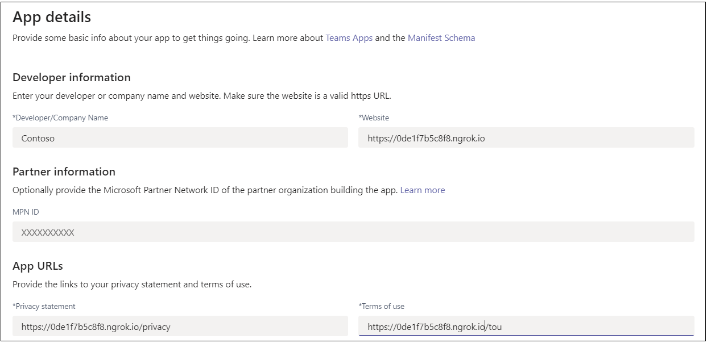

# <a name="create-a-personal-tab"></a>Criar uma guia pessoal

## <a name="create-a-custom-personal-tab"></a>Criar uma guia pessoal personalizada

Você pode criar uma guia pessoal usando Node.js e o Gerador Yeoman, ASP.NET Core ou ASP.NET Core MVC.

# <a name="nodejs"></a>[Node.js](#tab/nodejs)

### <a name="create-a-custom-personal-tab-using-nodejs-and-the-yeoman-generator"></a>Criar uma guia pessoal personalizada usando Node.js e o Gerador Yeoman

> [!NOTE]
> Este artigo segue as etapas descritas na [com](https://github.com/OfficeDev/generator-teams/wiki/Build-Your-First-Microsoft-Teams-App) build do seu primeiro wiki de aplicativo Microsoft Teams encontrado no repositório do Microsoft OfficeDev GitHub.

Você pode criar uma guia pessoal personalizada usando o [Teams do Yeoman](https://github.com/OfficeDev/generator-teams/wiki/Build-Your-First-Microsoft-Teams-App). O aplicativo também é carregado para Teams.

### <a name="prerequisites-for-teams-apps"></a>Pré-requisitos para Teams aplicativos

Você deve ter uma compreensão dos seguintes pré-requisitos:

- Você deve ter um locatário Office 365 e uma equipe configurada com **Permitir o carregamento de aplicativos personalizados** habilitados. Para obter mais informações, [consulte prepare your Office 365 tenant](~/concepts/build-and-test/prepare-your-o365-tenant.md).

    > [!NOTE]
    > Se você não tiver uma conta Office 365, poderá inscrever-se para uma assinatura gratuita por meio do programa Office 365 Desenvolvedor. A assinatura permanece ativa desde que você a use para desenvolvimento contínuo. Consulte [welcome to the Office 365 Developer Program](/office/developer-program/microsoft-365-developer-program).

Além disso, este projeto exige que você tenha o seguinte instalado em seu ambiente de desenvolvimento:

- Qualquer editor de texto ou IDE. Você pode instalar e usar [Visual Studio Code](https://code.visualstudio.com/download) gratuitamente.

- [Node.js/npm](https://nodejs.org/en/). Use a versão LTS mais recente. O nó Gerenciador de Pacotes (npm) é instalado em seu sistema com a instalação de Node.js.

- Depois de instalar o Node.js, instale os pacotes [Yeoman](https://yeoman.io/) e [gulp-cli](https://www.npmjs.com/package/gulp-cli) inserindo o seguinte comando no prompt de comando:

    ```bash
    npm install yo gulp-cli --global
    ```

- Instale o Microsoft Teams aplicativos inserindo o seguinte comando no prompt de comando:

    ```bash
    npm install generator-teams --global
    ```

### <a name="generate-your-project"></a>Gerar seu projeto

**Para gerar seu projeto**

1. Em um prompt de comando, crie um novo diretório para seu projeto de guia.

1. Para iniciar o gerador, vá para o novo diretório e insira o seguinte comando:

    ```bash
    yo teams
    ```

1. Em seguida, forneça uma série de valores usados no arquivo **manifest.json do** aplicativo:

    

    **Qual é o nome da solução?**

    O nome da solução é o nome do projeto. Você pode aceitar o nome sugerido selecionando **Enter**.

    **Onde você deseja colocar os arquivos?**

    No momento, você está no diretório do projeto. Selecione **Inserir**.

    **Título do seu projeto Microsoft Teams aplicativo?**

    O título é o nome do pacote do aplicativo e é usado no manifesto e na descrição do aplicativo. Insira um título ou selecione **Enter** para aceitar o nome padrão.

    **Seu nome (empresa) ? (máx. 32 caracteres)**

    O nome da empresa será usado no manifesto do aplicativo. Insira um nome da empresa ou selecione **Enter** para aceitar o nome padrão.

    **Qual versão de manifesto você gostaria de usar?**

    Selecione o esquema padrão.

    **Scaffolding rápido? (Y/n)**

    O padrão é sim; insira **n** para inserir sua ID do Microsoft Partner.

    **Insira sua ID do Microsoft Partner, se você tiver uma? (Deixe em branco para ignorar)**

    Esse campo não é obrigatório e deve ser usado somente se você já faz parte da [Rede de Parceiros da Microsoft.](https://partner.microsoft.com)

    **O que você deseja adicionar ao seu projeto?**

    Selecione **( ) Uma &ast; guia**.

    **A URL onde você hospedará essa solução?**

    Por padrão, o gerador sugere uma URL de Sites do Azure. Você só está testando seu aplicativo localmente, portanto, uma URL válida não é necessária.

    **Você gostaria de mostrar um indicador de carregamento quando seu aplicativo/guia é carregado?**

    Escolha **não incluir** um indicador de carregamento quando seu aplicativo ou guia for carregado. O padrão é não, digite **n**.

    **Você gostaria que aplicativos pessoais fossem renderizados sem uma barra de texto de tabulação?**

    Escolha **não** incluir aplicativos pessoais a serem renderizados sem uma barra de header-bar de tabulação. O padrão é não, digite **n**.

    **Você gostaria de incluir a estrutura de teste e testes iniciais? (y/N)**

    Escolha **não** incluir uma estrutura de teste para este projeto. O padrão é não, digite **n**.

    **Você gostaria de incluir suporte ao ESLint? (y/N)**

    Escolha não incluir suporte ao ESLint. O padrão é não, digite **n**.

    **Você gostaria de usar aplicativos do Azure Insights para telemetria? (y/N)**

    Escolha **não** incluir o [aplicativo Azure Insights](/azure/azure-monitor/app/app-insights-overview). O padrão é não; enter **n**.

    **Nome da guia padrão (máx. 16 caracteres)?**

    Nomeia sua guia. Esse nome de guia é usado em todo o seu projeto como um componente de caminho de arquivo ou URL.

    **Que tipo de Guia você gostaria de criar?**

    Use as teclas de seta para selecionar **Pessoal (estático)**.

    **Você precisa do suporte para o Microsoft Azure Active Directory com Login Único para a guia?**

    Escolha **não** incluir o suporte ao Azure AD Single-Sign-On para a guia. O padrão é sim, digite **n**.

    > [!IMPORTANT]
    > O componente de **caminho yourDefaultTabNameTab** é o valor que você inscrevia no gerador para Nome da Guia **Padrão** mais a **palavra Tab**.
    >
    > Por exemplo: DefaultTabName: **MyTab**  >  **/MyTabTab/**

### <a name="add-a-personal-tab"></a>Adicionar uma guia pessoal

**Para adicionar uma guia pessoal a esse aplicativo, crie uma página de conteúdo e atualize arquivos existentes**

1. No editor de código, crie um novo arquivo HTML **personal.html** e adicione a seguinte marcação:

    ```html
    <!DOCTYPE html>
    <html>
        <head>
            <meta charset="UTF-8">
            <title>
                <!-- Todo: add your a title here -->
            </title>
            <meta name="viewport" content="width=device-width, initial-scale=1.0">
            <!-- inject:css -->
            <!-- endinject -->
        </head>
            <body>
                <h1>Personal Tab</h1>
                <p></p>
                <p>This is your personal tab!</p>
            </body>
    </html>
    ```

1. Salve **personal.html** na pasta **web** do aplicativo no seguinte local:

    ```bash
    ./src/app/web/<yourDefaultTabNameTab>/personal.html
    ```

1. Abra **manifest.json** a partir do seguinte local no editor de código:

    ```bash
    ./src/manifest/manifest.json/
    ```

1. Adicione o seguinte à matriz `staticTabs` vazia ( ) e adicione o seguinte objeto `staticTabs":[]` JSON:

    ```json
    {
        "entityId": "personalTab",
        "name": "Personal Tab ",
        "contentUrl": "https://{{HOSTNAME}}/<yourDefaultTabNameTab>/personal.html",
        "websiteUrl": "https://{{HOSTNAME}}",
        "scopes": ["personal"]
    }
    ```

1. Atualize **o componente de caminho contentURL** **yourDefaultTabNameTab** com o nome da guia real.

1. Salve o arquivo **manifest.json** atualizado.

1. Para fornecer sua página de conteúdo em um IFrame, abra **Tab.ts** no editor de código do seguinte caminho:

    ```bash
    ./src/app/<yourDefaultTabNameTab>/<yourDefaultTabNameTab>.ts
    ```

1. Adicione o seguinte à lista de decoradores IFrame:

    ```typescript
     @PreventIframe("/<yourDefaultAppName>TabNameTab>/personal.html")
    ```

1. Salve o arquivo **Tab.ts** atualizado. Seu código de tabulação está completo.

### <a name="build-and-run-your-application"></a>Criar e executar seu aplicativo

Em um prompt de comando, abra o diretório do projeto para concluir as próximas tarefas.

#### <a name="create-the-app-package"></a>Criar o pacote do aplicativo

Você deve ter um pacote de aplicativos para testar sua guia Teams. É uma pasta zip que contém os seguintes arquivos necessários:

- Um **ícone de cor completo** medindo 192 x 192 pixels.
- Um **ícone de contorno transparente** medindo 32 x 32 pixels.
- Um **arquivo manifest.json** que especifica os atributos do seu aplicativo.

O pacote é criado por meio de uma tarefa gulp que valida o arquivo manifest.json e gera a pasta zip no **diretório ./package**. No prompt de comando, insira o seguinte comando:

```bash
gulp manifest
```

#### <a name="build-your-application"></a>Criar seu aplicativo

O comando build transpila sua solução para a **pasta ./dist.** Insira o seguinte comando no prompt de comando:

```bash
gulp build
```

#### <a name="run-your-application-in-localhost"></a>Executar seu aplicativo no localhost

1. Inicie um servidor Web local inserindo o seguinte comando no prompt de comando:

    ```bash
    gulp serve
    ```

1. Insira no navegador, substitua pelo nome da guia e veja a home page do aplicativo, conforme `http://localhost:3007/<yourDefaultAppNameTab>/` mostrado na imagem a `**<yourDefaultAppNameTab>**` seguir:

    

1. Para exibir sua guia pessoal, vá para `http://localhost:3007/<yourDefaultAppNameTab>/personal.html` .

    >

### <a name="establish-a-secure-tunnel-to-your-tab"></a>Estabelecer um túnel seguro para sua guia

Microsoft Teams é um produto baseado em nuvem e exige que o conteúdo da guia está disponível na nuvem usando pontos de extremidade HTTPS. Teams não permite hospedagem local. Publique sua guia em uma URL pública ou use um proxy que exponha sua porta local a uma URL voltada para a Internet.

Para testar sua extensão de tabulação, use [ngrok](https://ngrok.com/docs), que é integrado a esse aplicativo. Ngrok é uma ferramenta de software de proxy reverso. O Ngrok cria um túnel para os pontos de extremidade HTTPS do servidor Web em execução localmente. Os pontos de extremidade da Web do seu servidor estão disponíveis durante a sessão atual em seu computador. Quando o computador é desligado ou vai para o sono, o serviço não está mais disponível.

No prompt de comando, saia do localhost e insira o seguinte comando:

```bash
gulp ngrok-serve
```

> [!IMPORTANT]
> Depois que sua guia for carregada para Microsoft Teams por meio do **ngrok** e salva com êxito, você poderá exibi-la em Teams até que sua sessão de túnel termine.

### <a name="upload-your-application-to-teams"></a>Upload seu aplicativo para Teams

**Para carregar seu aplicativo para Teams**

1. Vá para Microsoft Teams. Se você usar a [versão baseada na Web,](https://teams.microsoft.com)poderá inspecionar seu código front-end usando as ferramentas de desenvolvedor [do navegador.](~/tabs/how-to/developer-tools.md)
1. No canto inferior esquerdo, selecione **Aplicativos**.
1. No canto inferior esquerdo, escolha **Upload um aplicativo personalizado.**
1. Vá para o diretório do projeto, navegue até a pasta **./package,** selecione a pasta zip e escolha **Abrir**.

    

1. Selecione **Adicionar** na caixa de diálogo pop-up. Sua guia é carregada para Teams.

    

### <a name="view-your-personal-tab"></a>Exibir sua guia pessoal

Na barra de navegação à esquerda no Teams, selecione &#x25CF;&#x25CF;&#x25CF; e escolha seu aplicativo.

# <a name="aspnet-core"></a>[ASP.NET Core](#tab/aspnetcore)

### <a name="create-a-custom-personal-tab-using-aspnet-core"></a>Criar uma guia pessoal personalizada usando ASP.NET Core

Você pode criar uma guia pessoal personalizada usando C# e ASP.NET Core Páginas de lâmina de corte. [O App Studio](~/concepts/build-and-test/app-studio-overview.md) também é usado para concluir o manifesto do aplicativo e implantar sua guia para Teams.

### <a name="prerequisites-for-personal-tab"></a>Pré-requisitos para guia pessoal

Você deve ter uma compreensão dos seguintes pré-requisitos:

- Você deve ter um locatário Office 365 e uma equipe configurada com **Permitir o carregamento de aplicativos personalizados** habilitados. Para obter mais informações, [consulte prepare your Office 365 tenant](~/concepts/build-and-test/prepare-your-o365-tenant.md).

    > [!NOTE]
    > Se você não tiver uma conta Microsoft 365, poderá se inscrever para uma assinatura gratuita por meio do [Programa de Desenvolvedores da Microsoft.](https://developer.microsoft.com/en-us/microsoft-365/dev-program) A assinatura permanece ativa desde que você a use para desenvolvimento contínuo.

- Use o App Studio para importar seu aplicativo para Teams. Para instalar o App Studio, selecione **Aplicativo** da Loja de Aplicativos no canto inferior esquerdo do aplicativo Teams  pesquise **por App Studio**. Depois de encontrar o azulejo, selecione-o e escolha **Adicionar** na caixa de diálogo pop-up para instalá-lo.

Além disso, este projeto exige que você tenha o seguinte instalado em seu ambiente de desenvolvimento:

- A versão atual do Visual Studio IDE com a carga de trabalho de desenvolvimento entre **plataformas .NET CORE** instalada. Se você ainda não tiver uma Visual Studio, poderá baixar e instalar a versão Microsoft Visual Studio Community [versão](https://visualstudio.microsoft.com/downloads) mais recente gratuitamente.

- A [ferramenta proxy reverso ngrok.](https://ngrok.com) Use o ngrok para criar um túnel para os pontos de extremidade HTTPS disponíveis publicamente do servidor Web em execução local. Você pode [baixar ngrok](https://ngrok.com/download).

### <a name="get-the-source-code"></a>Obter o código-fonte

Em um prompt de comando, crie um novo diretório para seu projeto de guia. Um projeto simples é fornecido para você começar. Clone o repositório de exemplo em seu novo diretório usando o seguinte comando:

```bash
git clone https://github.com/OfficeDev/microsoft-teams-sample-tabs.git
```

Como alternativa, você pode recuperar o código-fonte baixando a pasta zip e extraindo os arquivos.

**Para criar e executar o projeto de guia**

1. Depois de obter o código-fonte, vá para Visual Studio e selecione **Abrir um projeto ou solução**.
1. Vá para o diretório de aplicativos de tabulação e abra **PersonalTab.sln**.
1. Para criar e executar seu aplicativo, pressione **F5** ou escolha **Iniciar Depuração** no menu **Depurar.**
1. Em um navegador, vá para as SEGUINTES URLs para verificar se o aplicativo foi carregado corretamente:

    - `http://localhost:44325/`
    - `http://localhost:44325/personal`
    - `http://localhost:44325/privacy`
    - `http://localhost:44325/tou`

### <a name="review-the-source-code"></a>Revisar o código-fonte

#### <a name="startupcs"></a>Startup.cs

Esse projeto foi criado a partir de um modelo vazio do Aplicativo Web 2.2 do ASP.NET Core 2.2 com a caixa de seleção Avançado - Configurar para **HTTPS** selecionada na instalação. Os serviços MVC são registrados pelo método da estrutura de injeção de `ConfigureServices()` dependência. Além disso, o modelo vazio não habilita o serviço de conteúdo estático por padrão, portanto, o middleware de arquivos estáticos é adicionado ao método usando `Configure()` o seguinte código:

```csharp
public void ConfigureServices(IServiceCollection services)
  {
      services.AddMvc().SetCompatibilityVersion(CompatibilityVersion.Version_2_2);
  }
public void Configure(IApplicationBuilder app)
  {
    app.UseStaticFiles();
    app.UseMvc();
  }
```

#### <a name="wwwroot-folder"></a>pasta wwwroot

Em ASP.NET Core, a pasta raiz da Web é onde o aplicativo procura arquivos estáticos.

#### <a name="indexcshtml"></a>Index.cshtml

ASP.NET Core trata arquivos chamados **Index** como o padrão ou home page do site. Quando a URL do navegador aponta para a raiz do site, **Index.cshtml** é exibida como a home page do aplicativo.

#### <a name="appmanifest-folder"></a>Pasta AppManifest

Esta pasta contém os seguintes arquivos de pacote de aplicativos necessários:

- Um **ícone de cor completo** medindo 192 x 192 pixels.
- Um **ícone de contorno transparente** medindo 32 x 32 pixels.
- Um **arquivo manifest.json** que especifica os atributos do seu aplicativo.

Esses arquivos devem ser cortados em um pacote de aplicativos para uso ao carregar sua guia para Teams. Microsoft Teams carrega o especificado em seu manifesto, incorpora-o em um `contentUrl` <iframe \> e o renderiza em sua guia.

#### <a name="csproj"></a>.csproj

Na janela Visual Studio Do Explorador de Soluções, clique com o botão direito do mouse no projeto e selecione **Editar Project Arquivo**. No final do arquivo, você vê o seguinte código que cria e atualiza sua pasta zip quando o aplicativo é construído:

```xml
<PropertyGroup>
    <PostBuildEvent>powershell.exe Compress-Archive -Path \"$(ProjectDir)AppManifest\*\" -DestinationPath \"$(TargetDir)tab.zip\" -Force</PostBuildEvent>
  </PropertyGroup>

  <ItemGroup>
    <EmbeddedResource Include="AppManifest\icon-outline.png">
      <CopyToOutputDirectory>Always</CopyToOutputDirectory>
    </EmbeddedResource>
    <EmbeddedResource Include="AppManifest\icon-color.png">
      <CopyToOutputDirectory>Always</CopyToOutputDirectory>
    </EmbeddedResource>
    <EmbeddedResource Include="AppManifest\manifest.json">
      <CopyToOutputDirectory>Always</CopyToOutputDirectory>
    </EmbeddedResource>
  </ItemGroup>
```

### <a name="update-your-application-for-teams"></a>Atualize seu aplicativo para Teams

#### <a name="_layoutcshtml"></a>_Layout.cshtml

Para que sua guia seja exibida Teams, você deve incluir o **SDK** do cliente JavaScript Microsoft Teams e incluir uma chamada depois que a página `microsoftTeams.initialize()` for carregada. Sua guia e o aplicativo Teams se comunicam dessa maneira:

Vá para **a pasta Shared,** **abra _Layout.cshtml** e adicione o seguinte à seção `<head>` tags:

```html
<script src="https://ajax.aspnetcdn.com/ajax/jQuery/jquery-3.4.1.min.js"></script>
<script src="https://statics.teams.cdn.office.net/sdk/v1.6.0/js/MicrosoftTeams.min.js"></script>
```

#### <a name="personaltabcshtml"></a>PersonalTab.cshtml

Abra **PersonalTab.cshtml** e atualize as `<script>` marcas incorporadas chamando `microsoftTeams.initialize()` .

Certifique-se de salvar **seu PersonalTab.cshtml atualizado.**

### <a name="establish-a-secure-tunnel-to-your-tab-for-teams"></a>Estabeleça um túnel seguro para sua guia para Teams

Microsoft Teams é um produto baseado em nuvem e exige que o conteúdo da guia está disponível na nuvem usando pontos de extremidade HTTPS. Teams não permite hospedagem local. Publique sua guia em uma URL pública ou use um proxy que exponha sua porta local a uma URL voltada para a Internet.

Para testar sua guia, use [ngrok](https://ngrok.com/docs). Os pontos de extremidade da Web do seu servidor estão disponíveis enquanto o ngrok está em execução no computador. Na versão gratuita do ngrok, se você fechar o ngrok, as URLs serão diferentes na próxima vez em que você a iniciar.

**Para estabelecer um túnel seguro para sua guia**

1. Em um prompt de comando na raiz do diretório do projeto, execute o seguinte comando:

    ```bash
    ngrok http https://localhost:44325 -host-header="localhost:44325"
    ```

    O Ngrok escuta as solicitações da Internet e as encaminha para seu aplicativo quando está sendo executado na porta 44325. Ela se parece `https://y8rPrT2b.ngrok.io/` com onde **y8rPrT2b** é substituído pela URL HTTPS alfanumérico ngrok.

    Certifique-se de manter o prompt de comando com o ngrok em execução e anote a URL.

2. Verifique se **o ngrok** está sendo executado e funcionando corretamente abrindo seu navegador e indo para sua página de conteúdo por meio da URL HTTPS ngrok fornecida na janela do prompt de comando.

> [!TIP]
> Você precisa ter seu aplicativo no Visual Studio e ngrok em execução para concluir as etapas fornecidas neste artigo. Se você precisar parar de executar seu aplicativo Visual Studio para trabalhar nele, **mantenha o ngrok em execução**. Ele escuta e retoma o roteamento da solicitação do aplicativo quando ele é reiniciado no Visual Studio. Se você tiver que reiniciar o serviço ngrok, ele retornará uma nova URL e será preciso atualizar todos os lugares que usam essa URL.

#### <a name="run-your-application"></a>Executar seu aplicativo

Em Visual Studio, pressione **F5** ou escolha **Iniciar Depuração** no menu **Depuração do** aplicativo.

### <a name="upload-your-tab-with-app-studio-for-teams"></a>Upload sua guia com o App Studio para Teams

> [!NOTE]
> **O App Studio** pode ser usado para editar seu **arquivo manifest.json** e carregar o pacote concluído para Teams. Você também pode editar manualmente **manifest.json**. Se fizer isso, certifique-se de criar a solução novamente para criar o arquivo **Tab.zip** para carregar.

**Para carregar sua guia com o App Studio**

1. Vá para Microsoft Teams. Se você usar a [versão baseada na Web,](https://teams.microsoft.com)poderá inspecionar seu código front-end usando as ferramentas de desenvolvedor [do navegador.](~/tabs/how-to/developer-tools.md)

1. Vá para **o App Studio** e selecione a guia Editor **de** manifesto.

1. Selecione **Importar um aplicativo existente** no editor de **Manifesto** para começar a atualizar o pacote de aplicativos para sua guia. O código-fonte vem com seu próprio manifesto parcialmente completo. O nome do pacote do aplicativo é **tab.zip**. Ele está disponível no seguinte caminho:

    ```bash
    /bin/Debug/netcoreapp2.2/tab.zip
    ```

1. Upload **tab.zip** App **Studio.**

#### <a name="update-your-app-package-with-manifest-editor"></a>Atualizar seu pacote de aplicativos com o editor de manifesto

Depois de carregar seu pacote de aplicativos no App Studio, você deve configurá-lo.

Selecione o azulejo para sua guia recém-importada da página de boas-vindas do editor de manifesto.

Há uma lista de etapas no lado esquerdo do editor de Manifesto. No lado direito do editor de manifesto, há uma lista de propriedades que devem ter valores para cada uma dessas etapas. Grande parte das informações foram fornecidas por **seu manifesto.json,** mas há campos que você deve atualizar.

##### <a name="details-app-details"></a>Detalhes: Detalhes do aplicativo

Na seção **Detalhes do** aplicativo:

1. Em **Identificação**, selecione **Gerar** para gerar uma nova ID de aplicativo para seu aplicativo.

1. Em **Informações do desenvolvedor**, **atualize Site** com sua URL HTTPS **ngrok.**

    

1. Em **URLs do aplicativo,** atualize a **instrução Privacy** para `https://<yourngrokurl>/privacy` e Termos de **uso** para `https://<yourngrokurl>/tou`>.

##### <a name="capabilities-tabs"></a>Recursos: guias

Na seção **Guias:**

1. Em **Adicionar uma guia pessoal,** selecione **Adicionar**. Uma caixa de diálogo pop-up é exibida.

1. Insira um nome para a guia pessoal em **Nome**.

1. Insira a **ID da entidade**.

1. Atualizar **a URL de conteúdo** com `https://<yourngrokurl>/personalTab` .

    Deixe o **campo URL do site** em branco.

    

1. Selecione **Salvar**.

##### <a name="finish-domains-and-permissions"></a>Concluir: domínios e permissões

Na seção **Domínios e** permissões, **domínios** de suas guias devem conter sua URL ngrok sem o prefixo HTTPS `<yourngrokurl>.ngrok.io/` .

###### <a name="finish-test-and-distribute"></a>Concluir: Testar e distribuir

> [!IMPORTANT]
> À direita, em **Descrição,** você verá o seguinte aviso:
>
> &#9888; A **matriz 'validDomains' não pode conter um site de tunelamento...**
>
> Esse aviso pode ser ignorado durante o teste da guia.

1. Na seção **Testar e Distribuir,** selecione **Instalar**.

1. Na caixa de diálogo pop-up, selecione **Adicionar** e sua guia será exibida.

    

### <a name="view-your-personal-tab-in-teams"></a>Exibir sua guia pessoal no Teams

1. Na barra de navegação localizada à extrema esquerda do aplicativo Teams, selecione as releições &#x25CF;&#x25CF;&#x25CF;. Uma lista de aplicativos pessoais é mostrada.

1. Selecione sua guia na lista para exibi-la.

# <a name="aspnet-core-mvc"></a>[ASP.NET Core MVC](#tab/aspnetcoremvc)

### <a name="create-a-custom-personal-tab-with-aspnet-core-mvc"></a>Criar uma guia pessoal personalizada com ASP.NET Core MVC

Você pode criar uma guia pessoal personalizada usando C# e ASP.NET Core MVC. [O App Studio para Microsoft Teams](~/concepts/build-and-test/app-studio-overview.md) também é usado para concluir o manifesto do aplicativo e implantar sua guia para Teams.

### <a name="prerequisites-for-personal-tab-with-aspnet-core-mvc"></a>Pré-requisitos para guia pessoal com ASP.NET Core MVC

- Você deve ter um locatário Microsoft 365 e uma equipe configurada com **Permitir o carregamento de aplicativos personalizados** habilitados. Para obter mais informações, [consulte prepare your Office 365 tenant](~/concepts/build-and-test/prepare-your-o365-tenant.md).

    > [!NOTE]
    > Se você não tiver uma conta Microsoft 365, poderá se inscrever para uma assinatura gratuita por meio do [Programa de Desenvolvedores da Microsoft.](https://developer.microsoft.com/en-us/microsoft-365/dev-program) A assinatura permanece ativa desde que você a use para desenvolvimento contínuo.

- Use o App Studio para importar seu aplicativo para Teams. Para instalar o App Studio, selecione **Aplicativo** da Loja de Aplicativos no canto inferior esquerdo do aplicativo Teams  pesquise **por App Studio**. Depois de encontrar o azulejo, selecione-o e escolha **Adicionar** na caixa de diálogo pop-up para instalá-lo.

Além disso, este projeto exige que você tenha o seguinte instalado em seu ambiente de desenvolvimento:

- A versão atual do Visual Studio IDE com a carga de trabalho de desenvolvimento entre **plataformas .NET CORE** instalada. Se você ainda não tiver uma Visual Studio, poderá baixar e instalar a versão Microsoft Visual Studio Community [versão](https://visualstudio.microsoft.com/downloads) mais recente gratuitamente.

- A [ferramenta proxy reverso ngrok.](https://ngrok.com) Use o ngrok para criar um túnel para os pontos de extremidade HTTPS disponíveis publicamente do servidor Web em execução local. Você pode [baixar ngrok](https://ngrok.com/download).

### <a name="get-the-source-code"></a>Obter o código-fonte

Em um prompt de comando, crie um novo diretório para seu projeto de guia. Um projeto simples é fornecido para você começar. Clone o repositório de exemplo em seu novo diretório usando o seguinte comando:

``` bash
git clone https://github.com/OfficeDev/microsoft-teams-sample-tabs.git
```

Como alternativa, você pode recuperar o código-fonte baixando a pasta zip e extraindo os arquivos.

**Para criar e executar o projeto de guia**

1. Depois de ter o código-fonte, vá para Visual Studio e selecione **Abrir um projeto ou solução**.
1. Vá para o diretório de aplicativos de tabulação e abra **PersonalTabMVC.sln**.
1. Para criar e executar seu aplicativo, pressione **F5** ou escolha **Iniciar Depuração** no menu **Depurar.**
1. Em um navegador, vá para as SEGUINTES URLs para verificar se o aplicativo foi carregado corretamente:

    * `http://localhost:44335`
    * `http://localhost:44335/privacy`
    * `http://localhost:44335/tou`

### <a name="review-the-source-code"></a>Revisar o código-fonte

#### <a name="startupcs"></a>Startup.cs

Esse projeto foi criado a partir de um modelo vazio do Aplicativo Web 2.2 do ASP.NET Core 2.2 com a caixa de seleção Avançado - Configurar para **HTTPS** selecionada na instalação. Os serviços MVC são registrados pelo método da estrutura de injeção de `ConfigureServices()` dependência. Além disso, o modelo vazio não habilita o serviço de conteúdo estático por padrão, portanto, o middleware de arquivos estáticos é adicionado ao método usando `Configure()` o seguinte código:

``` csharp
public void ConfigureServices(IServiceCollection services)
  {
    services.AddMvc().SetCompatibilityVersion(CompatibilityVersion.Version_2_2);
  }
public void Configure(IApplicationBuilder app)
  {
    app.UseStaticFiles();
    app.UseMvc();
  }
```

#### <a name="wwwroot-folder"></a>pasta wwwroot

Em ASP.NET Core, a pasta raiz da Web é onde o aplicativo procura arquivos estáticos.

#### <a name="appmanifest-folder"></a>Pasta AppManifest

Esta pasta contém os seguintes arquivos de pacote de aplicativos necessários:

* Um **ícone de cor completo** medindo 192 x 192 pixels.
* Um **ícone de contorno transparente** medindo 32 x 32 pixels.
* Um **arquivo manifest.json** que especifica os atributos do seu aplicativo.

Esses arquivos devem ser cortados em um pacote de aplicativos para uso ao carregar sua guia para Teams. Microsoft Teams carrega o especificado em seu manifesto, incorpora-o em um IFrame e `contentUrl` o renderiza em sua guia.

#### <a name="csproj"></a>.csproj

Na janela Visual Studio Do Explorador de Soluções, clique com o botão direito do mouse no projeto e selecione **Editar Project Arquivo**. No final do arquivo, você vê o seguinte código que cria e atualiza sua pasta zip quando o aplicativo é construído:

``` xml
<PropertyGroup>
    <PostBuildEvent>powershell.exe Compress-Archive -Path \"$(ProjectDir)AppManifest\*\" -DestinationPath \"$(TargetDir)tab.zip\" -Force</PostBuildEvent>
  </PropertyGroup>

  <ItemGroup>
    <EmbeddedResource Include="AppManifest\icon-outline.png">
      <CopyToOutputDirectory>Always</CopyToOutputDirectory>
    </EmbeddedResource>
    <EmbeddedResource Include="AppManifest\icon-color.png">
      <CopyToOutputDirectory>Always</CopyToOutputDirectory>
    </EmbeddedResource>
    <EmbeddedResource Include="AppManifest\manifest.json">
      <CopyToOutputDirectory>Always</CopyToOutputDirectory>
    </EmbeddedResource>
  </ItemGroup>
```

#### <a name="models"></a>Modelos

**PersonalTab.cs** apresenta um objeto Message e métodos que são chamados de **PersonalTabController** quando um usuário seleciona um botão no Modo de Exibição **PersonalTab.**

#### <a name="views"></a>Visualizações

Essas exibições são as diferentes exibições ASP.NET Core MVC:

* Home: ASP.NET Core trata arquivos chamados **Index** como o padrão ou home page do site. Quando a URL do navegador aponta para a raiz do site, **Index.cshtml** é exibida como a home page do aplicativo.

* Compartilhado: a marcação de exibição **parcial _Layout.cshtml** contém a estrutura geral da página do aplicativo e elementos visuais compartilhados. Ele também faz referência à biblioteca Teams.

#### <a name="controllers"></a>Controladores

Os controladores usam a `ViewBag` propriedade para transferir valores dinamicamente para o Views.

[!INCLUDE [dotnet-update-personal-app](~/includes/tabs/dotnet-update-personal-app.md)]

[!INCLUDE [dotnet-ngrok-intro](~/includes/tabs/dotnet-ngrok-intro.md)]

**Para executar o ngrok e verificar a página de conteúdo**

1. Em um prompt de comando na raiz do diretório do projeto, execute o seguinte comando:

    ``` bash
    ngrok http https://localhost:44345 -host-header="localhost:44345"
    ```

    O Ngrok escuta as solicitações da Internet e as encaminha para seu aplicativo quando está sendo executado na porta 44325. Ela se parece `https://y8rPrT2b.ngrok.io/` com onde **y8rPrT2b** é substituído pela URL HTTPS alfanumérico ngrok.

    Certifique-se de manter o prompt de comando com o ngrok em execução e anote a URL.

1. Verifique se **o ngrok** está sendo executado e funcionando corretamente abrindo seu navegador e indo para sua página de conteúdo por meio da URL HTTPS ngrok fornecida na janela do prompt de comando.

> [!TIP]
> Você precisa ter seu aplicativo no Visual Studio e ngrok em execução para concluir as etapas fornecidas neste artigo. Se você precisar parar de executar seu aplicativo Visual Studio para trabalhar nele, **mantenha o ngrok em execução**. Ele escuta e retoma o roteamento da solicitação do aplicativo quando ele é reiniciado no Visual Studio. Se você tiver que reiniciar o serviço ngrok, ele retornará uma nova URL e será preciso atualizar todos os lugares que usam essa URL.

#### <a name="run-your-application"></a>Executar seu aplicativo

Em Visual Studio, pressione **F5** ou escolha **Iniciar Depuração** no menu **Depuração do** aplicativo.

[!INCLUDE [dotnet-personal-use-appstudio](~/includes/tabs/dotnet-personal-use-appstudio.md)]

---

## <a name="reorder-static-personal-tabs"></a>Reordenar guias pessoais estáticas

A partir da versão 1.7 do manifesto, os desenvolvedores podem reorganizar todas as guias em seu aplicativo pessoal. Em particular, um desenvolvedor pode mover a guia de **chat** bot, que sempre é padrão para a primeira posição, em qualquer lugar no header da guia do aplicativo pessoal. Duas palavras-chave de guia `entityId` reservadas são declaradas, **conversas** e **sobre**.

Se você criar um bot com **um escopo pessoal,** ele aparecerá na primeira posição da guia em um aplicativo pessoal por padrão. Se você quiser movê-lo para outra posição, adicione um objeto de guia estático ao manifesto com a palavra-chave reservada, **conversas**. A **guia** conversa é exibida na Web ou na área de trabalho, dependendo de onde você adicionar a guia **de** conversa na `staticTabs` matriz.

```json
{
   "staticTabs":[
      {
         
      },
      {
         "entityId":"conversations",
         "scopes":[
            "personal"
         ]
      }
   ]
}
```

## <a name="add-registeronfocused-api-for-tabs-or-personal-apps"></a>Adicionar `registerOnFocused` API para guias ou aplicativos pessoais

A `registerOnFocused` API SDK permite que você use um teclado Teams. Você pode retornar a um aplicativo pessoal e manter o foco em uma guia ou aplicativo pessoal com a ajuda das teclas Ctrl, Shift e F6. Por exemplo, você pode se afastar do aplicativo pessoal para pesquisar algo e, em seguida, retornar ao aplicativo pessoal ou usar Ctrl+F6 para dar a volta nos locais necessários. 

O código a seguir fornece um exemplo de definição de manipulador no SDK quando o foco deve ser retornado para a `registerFocusEnterHandler` guia ou aplicativo pessoal:

```csharp
export function registerFocusEnterHandler(handler: (navigateForward: boolean) => void): 
void {
  HandlersPrivate.focusEnterHandler = handler;
  handler && sendMessageToParent('registerHandler', ['focusEnter']);
}
function handleFocusEnter(navigateForward: boolean): void
 {
  if (HandlersPrivate.focusEnterHandler)
   {
    HandlersPrivate.focusEnterHandler(navigateForward);
  }
}
```

Depois que o manipulador é acionado com a palavra-chave , o manipulador é invocado com uma função de retorno de chamada que recebe `focusEnter` `registerFocusEnterHandler` um parâmetro chamado `focusEnterHandler` `navigateForward` . O valor de `navigateForward` determina o tipo de eventos. O `focusEnterHandler` é invocado apenas por Ctrl+F6 e não pela tecla de tabulação.   
As chaves úteis para mover eventos dentro Teams são as seguinte:    
* Encaminhar evento -> teclas Ctrl+F6
* Evento backward -> teclas Ctrl+Shift+F6

```csharp
case 'focusEnter':     
this.registerFocusEnterHandler((navigateForward: boolean = true) => {
this.sdkWindowMessageHandler.sendRequestMessage(this.frame, this.constants.SdkMessageTypes.focusEnter, [navigateForward]);
// Set focus on iframe or webview
if (this.frame && this.frame.sourceElem) {
  this.frame.sourceElem.focus();
}
return true;
});
}

// callback function to be passed to the handler
private focusEnterHandler: (navigateForward: boolean) => boolean;

// function that gets invoked after handler is registered.
private registerFocusEnterHandler(focusEnterHandler: (navigateForward: boolean) => boolean): void {
this.focusEnterHandler = focusEnterHandler;
this.layoutService.registerAppFocusEnterCallback(this.focusEnterHandler);
}
```

### <a name="personal-app"></a>Aplicativo pessoal

:::image type="content" source="../../assets/images/personal-apps/registerfocus.png" alt-text="Exemplo mostra opções para adicionar a API registerOnFocussed" border="false":::

#### <a name="personal-app---forward-event"></a>Aplicativo pessoal - Evento Forward

:::image type="content" source="../../assets/images/personal-apps/registerfocus-forward-event.png" alt-text="Exemplo mostra opções para adicionar a movimentação de encaminhamento da API registerOnFocussed" border="false":::

#### <a name="personal-app---backward-event"></a>Aplicativo pessoal - Evento Backward

:::image type="content" source="../../assets/images/personal-apps/registerfocus-backward-event.png" alt-text="Exemplo mostra opções para adicionar a movimentação para trás registerOnFocussed API" border="false":::

### <a name="tab"></a>Tab

:::image type="content" source="../../assets/images/personal-apps/registerfocus-tab.png" alt-text="Exemplo mostra opções para adicionar a guia registerOnFocussed API para" border="false":::

## <a name="next-step"></a>Próxima etapa

> [!div class="nextstepaction"]
> [Criar um canal ou uma guia de grupo](~/tabs/how-to/create-channel-group-tab.md)

## <a name="see-also"></a>Confira também

* [Teams guias](~/tabs/what-are-tabs.md)
* [Guias em dispositivos móveis](~/tabs/design/tabs-mobile.md)
* [Criar guias com Cartões Adaptáveis](~/tabs/how-to/build-adaptive-card-tabs.md)
* [Criar abas para conversação](~/tabs/how-to/conversational-tabs.md)