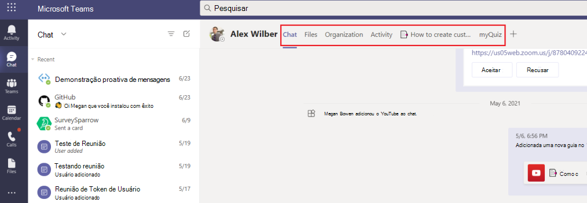
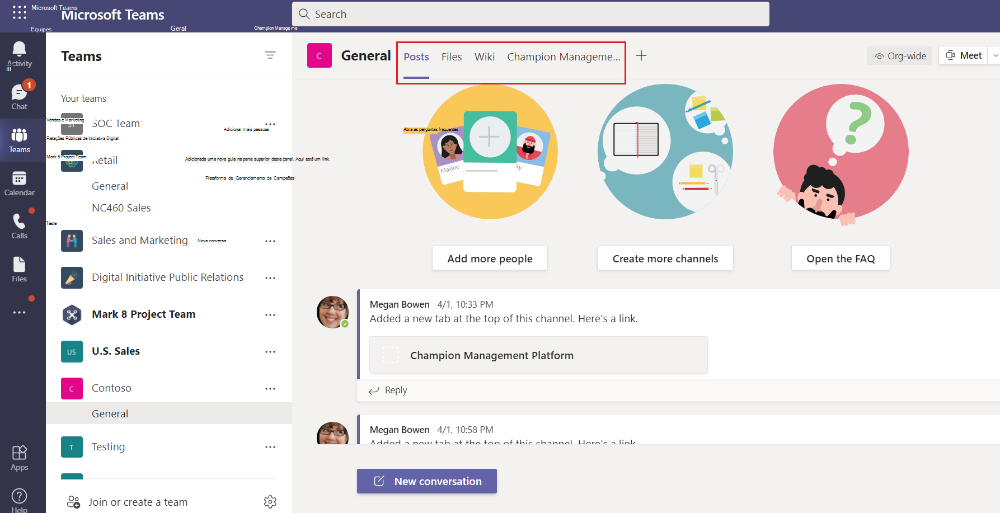

# Guias do Microsoft Teams

As guias são Teams web com conhecimento de Microsoft Teams. Eles são marcas html simples <iframe que apontam para domínios declarados no manifesto do aplicativo e podem ser adicionadas como parte de um canal dentro de uma equipe, chat de grupo ou aplicativo pessoal para um usuário \> individual. Você pode incluir guias personalizadas com seu aplicativo para inserir seu próprio conteúdo da Web Teams ou adicionar uma funcionalidade específica Teams ao conteúdo da Web. Para obter mais informações, [consulte Teams SDK do cliente JavaScript.](/javascript/api/overview/msteams-client)

> [!IMPORTANT]
> Atualmente, as guias personalizadas estão disponíveis em Nuvem da Comunidade Governamental (GCC), GCC-Alto e Departamento de Defesa (DOD).

A imagem a seguir mostra guias pessoais:

A imagem a seguir mostra as guias de canal contoso:

> [!VIDEO https://www.youtube-nocookie.com/embed/Jw6i7Mkt0dg]

> [!VIDEO https://www.youtube-nocookie.com/embed/T2a8yJC3VcQ]

Há alguns pré-requisitos pelos que você deve passar antes de trabalhar em guias.

Há dois tipos de guias disponíveis em Teams, pessoal e canal ou grupo. [Guias pessoais](~/tabs/how-to/create-personal-tab.md), juntamente com bots de escopo pessoal, fazem parte de aplicativos pessoais e têm escopo para um único usuário. Eles podem ser fixados na barra de navegação esquerda para facilitar o acesso. [Guias de canal ou grupo](~/tabs/how-to/create-channel-group-tab.md) oferecem conteúdo para canais e chats de grupo e são uma ótima maneira de criar espaços colaborativos em torno de conteúdo baseado na Web dedicado.

Você pode [criar uma página de conteúdo](~/tabs/how-to/create-tab-pages/content-page.md) como parte de uma guia pessoal, canal ou guia de grupo ou módulo de tarefa. Você [pode](~/tabs/how-to/create-tab-pages/configuration-page.md) criar uma página de configuração que permite que os usuários configurem um aplicativo Microsoft Teams e usem-no para configurar uma guia de chat de canal ou grupo, uma extensão de mensagens ou um conector Office 365. Você pode permitir que os usuários reconfigurem sua guia após a instalação e [criem uma página de remoção de tabulação](~/tabs/how-to/create-tab-pages/removal-page.md) para seu aplicativo. Quando você cria um aplicativo Teams que inclui uma guia, você deve testar como sua guia funciona nos clientes android e [iOS Teams .](~/tabs/design/tabs-mobile.md) Sua guia deve [obter contexto por](~/tabs/how-to/access-teams-context.md) meio de informações `entityId` básicas, informações de localidade e tema e ou que identifique o `subEntityId` que está na guia.

Você pode criar guias com Cartões Adaptáveis e centralizar todos os Teams de aplicativo eliminando a necessidade de um back-back diferente para seus bots e guias. [O Stage View](~/tabs/tabs-link-unfurling.md) é um novo componente da interface do usuário que permite renderizar o conteúdo aberto em tela inteira Teams e fixado como uma guia. O serviço de [desatração](~/tabs/tabs-link-unfurling.md) de link existente é atualizado para que ele seja usado para transformar URLs em uma guia usando um Cartão Adaptável e Serviços de Chat. Você  pode criar guias de conversa usando sub-entidades de conversa que permitem que os usuários tenham conversas sobre sub-entidades em sua guia, como tarefas específicas, paciente e oportunidade de vendas, em vez de discutir a guia inteira. Você pode fazer alterações nas [margens de tabulação](~/resources/removing-tab-margins.md) para melhorar a experiência do desenvolvedor ao criar aplicativos.

## Recursos de tabulação

Os recursos da guia são os seguinte:

* Se uma guia for adicionada a um aplicativo que também tenha um bot, o bot também será adicionado à equipe.
* Reconhecimento da Azure Active Directory (AAD) do usuário atual.
* Reconhecimento de localidade para que o usuário indique o idioma que é `en-us` .
* Recurso de SSO (SSO) de login único, se for suportado.
* Capacidade de usar bots ou notificações de aplicativo para vincular profundamente à guia ou a uma sub-entidade dentro do serviço, por exemplo, um item de trabalho individual.
* A capacidade de abrir um módulo de tarefa a partir de links em uma guia.
* Reutilização de SharePoint web parts na guia.

## Guias cenários de usuário

**Cenário:** Traga um recurso baseado na Web existente para dentro Teams. \
**Exemplo:** Você cria uma guia pessoal em seu aplicativo Teams que apresenta um site corporativo informacional aos usuários.

**Cenário:** Adicione páginas de suporte a um bot Teams ou extensão de mensagens. \
**Exemplo:** Você cria guias pessoais que **fornecem** e ajudam os **usuários** a fornecer conteúdo de página da Web.

**Cenário:** Forneça acesso a itens com os que seus usuários interagem regularmente para diálogo cooperativo e colaboração. \
**Exemplo:** Você cria um canal ou uma guia de grupo com vinculação profunda a itens individuais.

## Entender como as guias funcionam

Você pode usar um dos seguintes métodos para criar guias:

* [Declarar guia personalizada no manifesto do aplicativo](#declare-custom-tab-in-app-manifest)
* [Usar Cartão Adaptável para criar guias](~/tabs/how-to/build-adaptive-card-tabs.md)

### Declarar guia personalizada no manifesto do aplicativo

Uma guia personalizada é declarada no manifesto do aplicativo do pacote do aplicativo. Para cada página da Web que você deseja incluir como uma guia em seu aplicativo, você define uma URL e um escopo. Além disso, você pode adicionar o [Teams SDK](/javascript/api/overview/msteams-client) do cliente JavaScript à sua página e chamar depois que `microsoftTeams.initialize()` a página é carregada. Teams exibe sua página e fornece acesso Teams informações específicas, por exemplo, o cliente Teams está executando o tema escuro.

Se você optar por expor sua guia dentro do canal ou grupo ou escopo pessoal, você deve apresentar uma página de <de conteúdo HTML de iframe \> em sua guia.  Para guias pessoais, a URL de conteúdo é definida diretamente no manifesto do aplicativo Teams pela `contentUrl` propriedade na `staticTabs` matriz. O conteúdo da guia é o mesmo para todos os usuários.

Para guias de canal ou grupo, você também pode criar uma página de configuração adicional. Esta página permite configurar a URL da página de conteúdo, normalmente usando parâmetros de cadeia de caracteres de consulta de URL para carregar o conteúdo apropriado para esse contexto. Isso porque seu canal ou guia de grupo pode ser adicionado a várias equipes ou chats de grupo. Em cada instalação subsequente, os usuários podem configurar a guia, permitindo que você adapte a experiência conforme necessário. Quando os usuários adicionam ou configuram uma guia, uma URL é associada à guia apresentada na interface do usuário Teams usuário (UI). Configurar uma guia simplesmente adiciona parâmetros adicionais a essa URL. Por exemplo, quando você adiciona a guia Azure Boards, a página de configuração permite que você escolha, qual placa a guia carrega. A URL da página de configuração é especificada pela  `configurationUrl` propriedade na matriz no manifesto do `configurableTabs` aplicativo.

Você pode ter vários canais ou guias de grupo e até 16 guias pessoais por aplicativo.

### Ferramentas que você pode usar para criar guias
* [Kit de ferramentas do Teams para Visual Studio Code](../toolkit/visual-studio-code-overview.md)
* [Kit de ferramentas do Teams para Visual Studio](../toolkit/visual-studio-overview.md)

## Confira também

* [Solicitar permissões do dispositivo](../concepts/device-capabilities/native-device-permissions.md)
* [Integrar recursos de mídia](../concepts/device-capabilities/mobile-camera-image-permissions.md)
* [Integrar uma QR ou um scanner de código de barras](../concepts/device-capabilities/qr-barcode-scanner-capability.md)
* [Integrar os recursos de localização](../concepts/device-capabilities/location-capability.md)

## Próxima etapa

> [!div class="nextstepaction"]
> [Pré-requisitos](~/tabs/how-to/tab-requirements.md)
