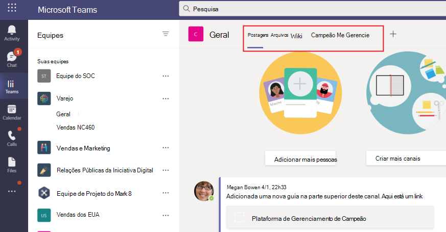

# Guias do Microsoft TeamsMicrosoft Teams tabs

As guias são Teams web com conhecimento de Microsoft Teams.Tabs are Teams-aware webpages embedded in Microsoft Teams. Eles são marcas html simples <iframe que apontam para domínios declarados no manifesto do aplicativo e podem ser adicionadas como parte de um canal dentro de uma equipe, chat de grupo ou aplicativo pessoal para um usuário \> individual.They are simple HTML <iframe\> tags that point to domains declared in the app manifest and can be added as part of a channel inside a team, group chat, or personal app for an individual user. Você pode incluir guias personalizadas com seu aplicativo para inserir seu próprio conteúdo da Web Teams ou adicionar uma funcionalidade específica Teams ao conteúdo da Web.You can include custom tabs with your app to embed your own web content in Teams or add Teams-specific functionality to your web content. Para obter mais informações, [consulte Teams SDK do cliente JavaScript.](/javascript/api/overview/msteams-client)For more information, see [Teams JavaScript client SDK](/javascript/api/overview/msteams-client).

A imagem a seguir mostra as guias de canal contoso:The following image shows Contoso channel tabs:

> [!VIDEO https://www.youtube-nocookie.com/embed/Jw6i7Mkt0dg]

> [!VIDEO https://www.youtube-nocookie.com/embed/T2a8yJC3VcQ]

Há alguns pré-requisitos pelos que você deve passar antes de trabalhar em guias.There are few prerequisites that you must go through before working on tabs.

Há dois tipos de guias disponíveis em Teams, pessoal e canal ou grupo.There are two types of tabs available in Teams, personal and channel or group. [Guias pessoais](~/tabs/how-to/create-personal-tab.md), juntamente com bots de escopo pessoal, fazem parte de aplicativos pessoais e têm escopo para um único usuário.[Personal tabs](~/tabs/how-to/create-personal-tab.md), along with personally-scoped bots, are part of personal apps and are scoped to a single user. Eles podem ser fixados na barra de navegação esquerda para facilitar o acesso.They can be pinned to the left navigation bar for easy access. [Guias de canal ou grupo](~/tabs/how-to/create-channel-group-tab.md) oferecem conteúdo para canais e chats de grupo e são uma ótima maneira de criar espaços colaborativos em torno de conteúdo baseado na Web dedicado.[Channel or group tabs](~/tabs/how-to/create-channel-group-tab.md) deliver content to channels and group chats, and are a great way to create collaborative spaces around dedicated web-based content.

Você pode [criar uma página de conteúdo](~/tabs/how-to/create-tab-pages/content-page.md) como parte de uma guia pessoal, canal ou guia de grupo ou módulo de tarefa.You can [create a content page](~/tabs/how-to/create-tab-pages/content-page.md) as part of a personal tab, channel or group tab, or task module. Você [pode](~/tabs/how-to/create-tab-pages/configuration-page.md) criar uma página de configuração que permite que os usuários configurem um aplicativo Microsoft Teams e usem-no para configurar uma guia de chat de canal ou grupo, uma extensão de mensagens ou um conector Office 365.You can [create a configuration page](~/tabs/how-to/create-tab-pages/configuration-page.md) that enables users to configure Microsoft Teams app and use it to configure a channel or group chat tab, a messaging extension, or an Office 365 Connector. Você pode permitir que os usuários reconfigurem sua guia após a instalação e [criem uma página de remoção de tabulação](~/tabs/how-to/create-tab-pages/removal-page.md) para seu aplicativo.You can permit users to reconfigure your tab after installation and [create a tab removal page](~/tabs/how-to/create-tab-pages/removal-page.md) for your application. Quando você cria um aplicativo Teams que inclui uma guia, você deve testar como sua guia funciona nos clientes android e [iOS Teams .](~/tabs/design/tabs-mobile.md)When you build a Teams app that includes a tab, you must test how your [tab functions on both the Android and iOS Teams clients](~/tabs/design/tabs-mobile.md). Sua guia deve [obter contexto por](~/tabs/how-to/access-teams-context.md) meio de informações `entityId` básicas, informações de localidade e tema e ou que identifique o `subEntityId` que está na guia.Your tab must [get context](~/tabs/how-to/access-teams-context.md) through basic information, locale and theme information, and `entityId` or `subEntityId` that identifies what is in the tab.

Você pode criar guias com Cartões Adaptáveis e centralizar todos os Teams de aplicativo eliminando a necessidade de um back-back diferente para seus bots e guias.You can build tabs with Adaptive Cards and centralize all Teams app capabilities by eliminating the need for a different backend for your bots and tabs. [O Stage View](~/tabs/tabs-link-unfurling.md) é um novo componente da interface do usuário que permite renderizar o conteúdo aberto em tela inteira Teams e fixado como uma guia. O serviço de [desatração](~/tabs/tabs-link-unfurling.md) de link existente é atualizado para que ele seja usado para transformar URLs em uma guia usando um Cartão Adaptável e Serviços de Chat.[Stage View](~/tabs/tabs-link-unfurling.md) is a new UI component that allows you to render the content opened in full screen in Teams and pinned as a tab. The existing [link unfurling](~/tabs/tabs-link-unfurling.md) service is updated so that it is used to turn URLs into a tab using an Adaptive Card and Chat Services. Você  pode criar guias de conversa usando sub-entidades de conversa que permitem que os usuários tenham conversas sobre sub-entidades em sua guia, como tarefas específicas, paciente e oportunidade de vendas, em vez de discutir a guia inteira. Você pode fazer alterações nas [margens de tabulação](~/resources/removing-tab-margins.md) para melhorar a experiência do desenvolvedor ao criar aplicativos.You can [create conversational tabs](~/tabs/how-to/conversational-tabs.md) using conversational sub-entities that allow users to have conversations about sub-entities in your tab, such as specific task, patient, and sales opportunity, instead of discussing the entire tab. You can make changes to [tab margins](~/resources/removing-tab-margins.md) to enhance the developer's experience when building apps.

## Recursos de tabulaçãoTab features

Os recursos da guia são os seguinte:The tab features are as follows:

* Se uma guia for adicionada a um aplicativo que também tenha um bot, o bot também será adicionado à equipe.If a tab is added to an app that also has a bot, the bot is also added to the team.
* Reconhecimento da Azure Active Directory (AAD) do usuário atual.Awareness of Azure Active Directory (AAD) ID of the current user.
* Reconhecimento de localidade para que o usuário indique o idioma que é `en-us` .Locale awareness for the user to indicate language that is `en-us`.
* Recurso de SSO (SSO) de login único, se for suportado.Single sign-on (SSO) capability, if supported.
* Capacidade de usar bots ou notificações de aplicativo para vincular profundamente à guia ou a uma sub-entidade dentro do serviço, por exemplo, um item de trabalho individual.Ability to use bots or app notifications to deep link to the tab or to a sub-entity within the service, for example an individual work item.
* A capacidade de abrir um módulo de tarefa a partir de links em uma guia.The ability to open a task module from links within a tab.
* Reutilização de SharePoint web parts na guia.Reuse of SharePoint web parts within the tab.

## Guias cenários de usuárioTabs user scenarios

**Cenário:** Traga um recurso baseado na Web existente para dentro Teams.**Scenario:** Bring an existing web-based resource inside Teams. \
**Exemplo:** Você cria uma guia pessoal em seu aplicativo Teams que apresenta um site corporativo informacional aos usuários.**Example:** You create a personal tab in your Teams app that presents an informational corporate website to users.

**Cenário:** Adicione páginas de suporte a um bot Teams ou extensão de mensagens.**Scenario:** Add support pages to a Teams bot or messaging extension. \
**Exemplo:** Você cria guias pessoais que **fornecem** e ajudam os **usuários** a fornecer conteúdo de página da Web.**Example:** You create personal tabs that provide **about** and **help** webpage content to users.

**Cenário:** Forneça acesso a itens com os que seus usuários interagem regularmente para diálogo cooperativo e colaboração.**Scenario:** Provide access to items that your users interact with regularly for cooperative dialogue and collaboration. \
**Exemplo:** Você cria um canal ou uma guia de grupo com vinculação profunda a itens individuais.**Example:** You create a channel or group tab with deep linking to individual items.

## Entender como as guias funcionamUnderstand how tabs work

Você pode usar um dos seguintes métodos para criar guias:You can use one of the following methods to create tabs:

* [Declarar guia personalizada no manifesto do aplicativoDeclare custom tab in app manifest](#declare-custom-tab-in-app-manifest)
* [Usar Cartão Adaptável para criar guiasUse Adaptive Card to build tabs](~/tabs/how-to/build-adaptive-card-tabs.md)

### Declarar guia personalizada no manifesto do aplicativoDeclare custom tab in app manifest

Uma guia personalizada é declarada no manifesto do aplicativo do pacote do aplicativo.A custom tab is declared in the app manifest of your app package. Para cada página da Web que você deseja incluir como uma guia em seu aplicativo, você define uma URL e um escopo.For each webpage you want included as a tab in your app, you define a URL and a scope. Além disso, você pode adicionar o [Teams SDK](/javascript/api/overview/msteams-client) do cliente JavaScript à sua página e chamar depois que `microsoftTeams.initialize()` a página é carregada.Additionally, you can add the [Teams JavaScript client SDK](/javascript/api/overview/msteams-client) to your page, and call `microsoftTeams.initialize()` after your page loads. Teams exibe sua página e fornece acesso Teams informações específicas, por exemplo, o cliente Teams está executando o tema escuro.Teams displays your page and provides access to Teams-specific information, for example the Teams client is running the dark theme.

Se você optar por expor sua guia dentro do canal ou grupo ou escopo pessoal, você deve apresentar uma página de <de conteúdo HTML de iframe \> em sua guia.  Para guias pessoais, a URL de conteúdo é definida diretamente no manifesto do aplicativo Teams pela `contentUrl` propriedade na `staticTabs` matriz.Whether you choose to expose your tab within the channel or group, or personal scope, you must present an <iframe\> HTML [content page](~/tabs/how-to/create-tab-pages/content-page.md) in your tab. For personal tabs, the content URL is set directly in your Teams app manifest by the `contentUrl` property in the `staticTabs` array. O conteúdo da guia é o mesmo para todos os usuários.Your tab's content is the same for all users.

Para guias de canal ou grupo, você também pode criar uma página de configuração adicional.For channel or group tabs, you can also create an additional configuration page. Esta página permite configurar a URL da página de conteúdo, normalmente usando parâmetros de cadeia de caracteres de consulta de URL para carregar o conteúdo apropriado para esse contexto.This page allows you to configure content page URL, typically by using URL query string parameters to load the appropriate content for that context. Isso porque seu canal ou guia de grupo pode ser adicionado a várias equipes ou chats de grupo.This is because your channel or group tab can be added to multiple teams or group chats. Em cada instalação subsequente, os usuários podem configurar a guia, permitindo que você adapte a experiência conforme necessário.On each subsequent install, your users can configure the tab, allowing you to tailor the experience as required. Quando os usuários adicionam ou configuram uma guia, uma URL é associada à guia apresentada na interface do usuário Teams usuário (UI).When users add or configure a tab, a URL is associated with the tab that is presented in the Teams user interface (UI). Configurar uma guia simplesmente adiciona parâmetros adicionais a essa URL.Configuring a tab simply adds additional parameters to that URL. Por exemplo, quando você adiciona a guia Azure Boards, a página de configuração permite que você escolha, qual placa a guia carrega.For example, when you add the Azure Boards tab, the configuration page allows you to choose, which board the tab loads. A URL da página de configuração é especificada pela  `configurationUrl` propriedade na matriz no manifesto do `configurableTabs` aplicativo.The configuration page URL is specified by the  `configurationUrl` property in the `configurableTabs` array in your app manifest.

Você pode ter vários canais ou guias de grupo e até 16 guias pessoais por aplicativo.You can have multiple channels or group tabs, and up to 16 personal tabs per app.

## Também consulteSee also

* [Solicitar permissões do dispositivoRequest device permissions](../concepts/device-capabilities/native-device-permissions.md)
* [Integrar recursos de mídiaIntegrate media capabilities](../concepts/device-capabilities/mobile-camera-image-permissions.md)
* [Integrar uma QR ou um scanner de código de barrasIntegrate a QR or barcode scanner](../concepts/device-capabilities/qr-barcode-scanner-capability.md)
* [Integrar os recursos de localizaçãoIntegrate location capabilities](../concepts/device-capabilities/location-capability.md)

## Próxima etapaNext step

> [!div class="nextstepaction"]
> [Pré-requisitosPrerequisites](~/tabs/how-to/tab-requirements.md)
