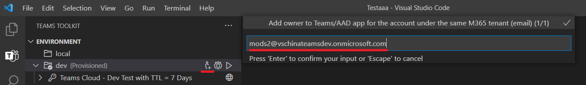

# Colabore Teams projeto usando Teams Toolkit

Vários desenvolvedores podem trabalhar juntos para depurar, provisionar e implantar para o mesmo projeto TeamsFx, mas exige a definição manual das permissões corretas do Teams App e do AAD App, o que não é fácil de fazer.

Teams Toolkit agora oferece suporte ao recurso de colaboração para permitir que um desenvolvedor (proprietário do projeto) convide outros desenvolvedores (colaboradores) para o projeto TeamsFx para depurar, provisionar e implantar o mesmo projeto TeamsFx.

## Pré-requisitos

* Pré-requisitos da conta

    Para provisionar recursos de nuvem no Azure e Microsoft 365, você deve ter as seguintes contas com permissões adequadas. Consulte Prepare [accounts to build Teams app](accounts.md) para obter mais informações.

    * Microsoft 365
    * Azure com assinatura válida

* [Instale Teams Toolkit](https://marketplace.visualstudio.com/items?itemName=TeamsDevApp.ms-teams-vscode-extension) versão v3.0.0+.

> [!TIP]
> Você já deve ter um projeto Teams aplicativo aberto em código VS.

## Colaborar com outros desenvolvedores

### Como proprietário do projeto

> [!NOTE]
> Antes de adicionar colaboradores para um ambiente, o proprietário do projeto precisa [provisionar](provision.md) o projeto primeiro.

* Na  seção AMBIENTE no Teams Toolkit, o nome do mouse sobre o ambiente para encontrar botões colaboradores, um deles é Adicionar o botão **Proprietários** do Aplicativo Teams **M365 (com** o aplicativo do AAD), o outro é **List M365 Teams App (com** o AAD App) Owners, conforme mostrado na imagem a seguir:

  

* Selecione Adicionar o botão Adicionar proprietários Teams **App do M365 (com** AAD App) e adicione outro endereço de email de conta do M365 como colaborador. A conta a ser adicionada deve estar no mesmo locatário que o proprietário do projeto para **depuração** remota, conforme mostrado na imagem:

  

* Para exibir os colaboradores no ambiente atual, selecione Listar proprietários do Aplicativo **M365 Teams (com** AAD App), e os colaboradores serão listados no canal de saída, conforme mostrado na imagem a seguir:

  

* Pressione o projeto para GitHub.

> [!NOTE]
> O colaborador recém-adicionado não receberá nenhuma notificação. Project proprietário precisa notificar o colaborador.

### Como colaborador do projeto

* Clone o projeto de GitHub
* Logon conta M365

> [!NOTE]
> Os colaboradores devem fazer logoff usando a conta adicionada pelo proprietário do projeto que **está sob o mesmo locatário com o proprietário do projeto.**

* Logon Conta do Azure que tem permissão de colaborador para todos os recursos do Azure que estão sendo usados neste projeto.
* Trabalhando no código do projeto, implante o projeto no controle remoto quando achar que é hora de visualizar seu Teams aplicativo.
* Iniciar remoto para ter uma visualização do Teams app. Para obter mais informações, [consulte build and run your Teams app in remote environment](/microsoftteams/platform/sbs-gs-javascript?tabs=vscode%2Cvsc%2Cviscode%2Cvcode&tutorial-step=3&branch).

### Limitações

> [!NOTE]
> As permissões relacionadas ao Azure devem ser definidas manualmente pelo administrador de assinatura do Azure no portal do Azure. A conta do Azure deve ter função de colaborador para a assinatura pelo menos para que os desenvolvedores possam trabalhar juntos para provisionar e implantar o projeto TeamsFx.

1. **Não é possível** excluir : não é possível remover colaboradores diretamente Teams Toolkit extensão. Siga as etapas a seguir para remover os colaboradores manualmente:

      1. Vá para [Teams Portal do Desenvolvedor](https://  dev.teams.microsoft.com/apps), encontre seu Teams App pelo nome ou id do aplicativo.
      2. Dentro da página Teams Gerenciamento de aplicativos, selecione **Proprietários** no painel esquerdo.
      3. Encontre e remova o colaborador.
      4. Vá para [Azure Active Directory](https://ms.portal.azure.com/#blade/Microsoft_AAD_IAM/ActiveDirectoryMenuBlade/RegisteredApps), selecione **Registro de aplicativo** no painel esquerdo e encontre seu AAD App.
      5. Dentro da página AAD Gerenciamento de aplicativos, selecione **Proprietários** no painel esquerdo.
      6. Encontre e remova o colaborador.
    

1. O recurso de colaboração só dá suporte ao projeto hospedado no Azure, SPFx o projeto hospedado será suportado no futuro.

1. O colaborador adicionado ao seu projeto não receberá nenhuma notificação. Project proprietário precisa notificar o colaborador offline.

## Confira também

> [!div class="nextstepaction"]
> [Provisione recursos de nuvem](provision.md)

> [!div class="nextstepaction"]
> [Implantar Teams aplicativo na nuvem](deploy.md)

> [!div class="nextstepaction"]
> [Gerenciar vários ambientes](TeamsFx-multi-env.md)
