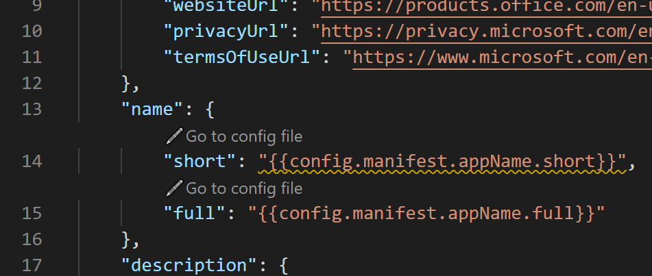

# <a name="customize-teams-app-manifest-in-teams-toolkit"></a>Personalizar Teams Manifesto do Aplicativo no Teams Toolkit

Teams Toolkit consiste em dois arquivos de modelo de manifesto na `templates/appPackage` pasta:

- `manifest.local.template.json` - aplicativo de equipes de depuração local
- `manifest.remote.template.json` - compartilhado em todos os ambientes

## <a name="prerequisite"></a>Pré-requisito

* [Instale Teams Toolkit](https://marketplace.visualstudio.com/items?itemName=TeamsDevApp.ms-teams-vscode-extension) versão v3.0.0+.

> [!TIP]
> Você já deve ter um projeto Teams aplicativo aberto em código VS.

Durante o provisionamento, Teams Toolkit carregará o manifesto `manifest.remote.template.json` de , combinado com configurações de e `state.{env}.json` `config.{env}.json` . Em seguida, ele cria um aplicativo teams no [Portal deV com](https://dev.teams.microsoft.com/apps) esse manifesto.

Durante a depuração local, Teams Toolkit carregará o manifesto `manifest.local.template.json` de , combinado com configurações de `localSettings.json` . Em seguida, ele cria um aplicativo teams no [Portal deV com](https://dev.teams.microsoft.com/apps) esse manifesto.

## <a name="supported-placeholder-in-manifestremotetemplatejson"></a>Espaço reservado suportado em manifest.remote.template.json

- `{{state.xx}}`é um espaço reservado pré-definido cujo valor é resolvido por Teams Toolkit, definido em `state.{env}.json` . Você não deve modificar os valores em estado. {env}.json.
- `{{config.manifest.xx}}` é um espaço reservado personalizado cujo valor é resolvido de `config.{env}.json` .
  - Você pode adicionar um parâmetro personalizado seguindo:
    - Adicione um espaço reservado em manifest.remote.template.json com padrão: `{{config.manifest.xx}}`
    - Adicione um valor config em config. {env}.json

        ```json
        {
            "manifest": {
                "KEY": "VALUE"
            }
        }
        ```

    Além de cada espaço reservado de configuração `manifest.remote.template.json` em , há um `Go to config file` botão. Você pode navegar até o arquivo de configuração selecionando-o conforme mostrado na imagem:

    

## <a name="supported-placeholder-in-manifestlocaltemplatejson"></a>Espaço reservado suportado em manifest.local.template.json

`{{localSettings.xx}}`é um espaço reservado pré-definido cujo valor é resolvido por Teams Toolkit, definido em `localSettings.json` . Você não deve modificar os valores em localSettings.json.

 > [!NOTE]
 > A personalização do manifesto local não é sugerida.

## <a name="see-also"></a>Confira também

> [!div class="nextstepaction"]
> [Visualizar Teams Manifesto do Aplicativo no Teams Toolkit](TeamsFx-manifest-preview.md)
