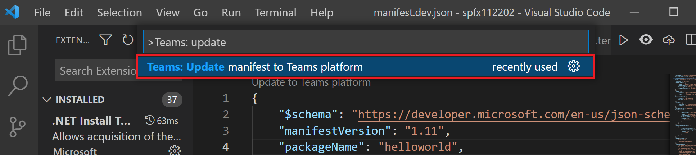

# <a name="preview-teams-app-manifest-in-teams-toolkit"></a>Visualizar Teams manifesto do aplicativo no Teams Toolkit

Após o scaffolding, você obterá dois arquivos de modelo de manifesto na `templates/appPackage` pasta.

- `manifest.local.template.json` - aplicativo de equipes de depuração local.
- `manifest.remote.template.json` - compartilhado entre todos os ambientes remotos.

Esses arquivos de modelo que contêm alguns espaço reservados, e os valores reais Teams Toolkit serão resolvidos em arquivos em `.fx/configs` `.fx/states` e .

## <a name="prerequisite"></a>Pré-requisito

* [Instale Teams Toolkit](https://marketplace.visualstudio.com/items?itemName=TeamsDevApp.ms-teams-vscode-extension) versão v3.0.0+.

> [!TIP]
> Você já deve ter um projeto Teams aplicativo aberto em código VS.

## <a name="preview-manifest"></a>Manifesto de visualização

Para visualizar o manifesto com conteúdo real, Teams Toolkit gerará arquivos de manifesto de visualização na `build/appPackage` pasta:

```text
└───build
    └───appPackage
        ├───appPackage.{env}.zip - Zipped app package of remote teams app
        ├───appPackage.local.zip - Zipped app package of local team app
        ├───manifest.{env}.json  - Previewed manifest of remote teams app
        └───manifest.local.json  - Previewed manifest of local teams app
```

### <a name="local-debug-teams-app"></a>Aplicativo de depuração Teams local

Para visualizar o arquivo de manifesto do aplicativo de equipes locais, você precisa pressionar **F5** para executar a depuração local primeiro. Esta etapa gerará configurações locais padrão para você, em seguida, o pacote do aplicativo e o manifesto de visualização serão construídos na **pasta build/appPackage.**

As outras maneiras são:

- Selecione **Visualizar** nos codelens do **arquivo manifest.local.template.json**
- Selecione **Visualizar arquivo de manifesto** na barra de menus do arquivo **manifest.local.template.json**
- Selecione **Zip Teams pacote de metadados** em Treeview e selecione Local O **local** de visualização aparece como mostrado na imagem a seguir:


### <a name="remote-environment"></a>Ambiente remoto

Para visualizar o arquivo de manifesto do aplicativo de equipes remotas, você precisa selecionar **Provisionar** na nuvem no painel DESENVOLVIMENTO do treeview de extensão Teams Toolkit ou disparar **Teams: Provisionar** na nuvem pela paleta de comandos primeiro. Esta etapa gerará configurações para o aplicativo de equipes remotas e, em seguida, o pacote do aplicativo e o manifesto de visualização serão construídos na **pasta build/appPackage.**

As outras maneiras são:

- Selecione **Visualizar** nos codelens do **arquivo manifest.remote.template.json.**
- Selecione **Visualizar arquivo de manifesto** na barra de menus do arquivo **manifest.remote.template.json.**
- Selecione **Zip Teams pacote de metadados** em Treeview e selecione seu ambiente.


> Se houver mais de um ambiente, você precisará selecionar o env que deseja visualizar, conforme mostrado na imagem:


## <a name="sync-local-changes-to-dev-portal"></a>Sincronizar alterações locais no Portal de Desenvolvimento

Depois de visualizar o arquivo de manifesto, você pode sincronizar as alterações locais no Portal de Desenvolvimento das seguintes maneiras:

- Selecione **Atualizar para Teams plataforma** no canto superior esquerdo da`manifest.{env}.json`
- Selecione **Teams: Atualizar manifesto para Teams plataforma na** barra de menus de`manifest.{env}.json`
- Trigger **Teams: atualizar manifesto para Teams plataforma da** paleta de comandos


 

> [!NOTE]
> O gatilho de codelens de editor ou botão de título atualizará o arquivo de manifesto atual para Teams plataforma. O gatilho da paleta de comandos exigirá a seleção do ambiente de destino.

Se o arquivo de manifesto estiver desatualizado devido à alteração do arquivo de configuração ou à alteração do modelo, o usuário será solicitado a confirmar sua ação: 

- **Somente visualização:** o arquivo de manifesto local será substituído de acordo com a configuração atual
- **Visualização e atualização**: o arquivo de manifesto local será substituído de acordo com a configuração atual e também atualizado para Teams plataforma ao mesmo tempo
- **Cancelar**: não fazer nada

> [!NOTE]
> As alterações serão atualizadas para o portal de dev. Se você tiver algumas atualizações manuais no portal de dev, ela será substituída.

## <a name="see-also"></a>Confira também

> [!div class="nextstepaction"]
> [Personalizar Teams Manifesto do Aplicativo no Teams Toolkit](TeamsFx-manifest-customization.md)
