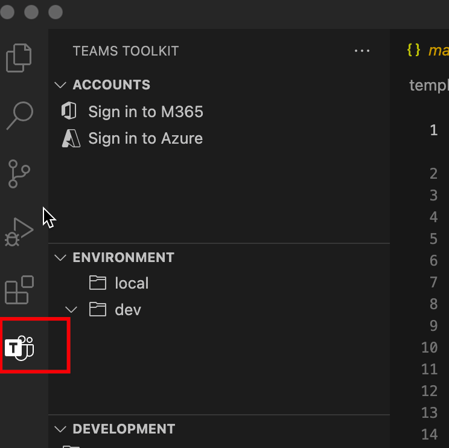

# Adicionar recursos aos aplicativos Teams aplicativos

Você pode começar a criar um Teams com um dos recursos Teams aplicativo. Durante o desenvolvimento de aplicativos, você pode Teams Toolkit adicionar de forma flexível mais recursos ao seu Teams app. A tabela a seguir descreve os recursos Teams aplicativos:

|**Recursos**|**Descrição**|
|--------|-------------|
| Guias |  Guias são marcas HTML simples que apontam para domínios declarados no manifesto do aplicativo. Você pode adicionar guias como parte do canal dentro de uma equipe, chat em grupo ou aplicativo pessoal para um usuário individual.|
| Bots |  Os bots ajudam a interagir com seu serviço Web por meio de texto, cartões interativos e módulos de tarefa.|
| Extensões de mensagens | As extensões de mensagens ajudam a interagir com seu serviço Web por meio de botões e formulários no Microsoft Teams cliente.|

## Pré-requisito

* [Instale Teams Toolkit](https://marketplace.visualstudio.com/items?itemName=TeamsDevApp.ms-teams-vscode-extension) versão v3.0.0+.

> [!TIP]
> Você já deve ter um projeto Teams aplicativo aberto em código VS.

## Adicionar recursos usando Teams Toolkit

> [!IMPORTANT]
> Você precisa executar o provisionamento para cada ambiente depois de adicionar recursos com êxito ao seu Teams app.

1. Selecione **Teams Toolkit** no painel esquerdo:

    
  
1. Selecione **Adicionar recursos**:

    

      Você também pode abrir a paleta de comandos e inserir **Teams: Adicionar Recursos**: 
      
      > [!NOTE]
      > Isso equivale a disparar do Tree View.

    

1. No pop-up, selecione os recursos a incluir em seu projeto:

    

1. Selecione **OK**.

Os recursos selecionados são adicionados com sucesso ao seu projeto. O Teams Toolkit gerar código-fonte para recursos recém-adicionados.

## Adicionar recursos Usando a CLI do TeamsFx na janela de comando

1. Altere o diretório para o **diretório do projeto.**
1. Execute o seguinte comando para adicionar diferentes recursos ao seu projeto:

   |Funcionalidade e Cenário| Comando|
   |-----------------------|----------|
   |Para adicionar uma guia|`teamsfx capability add tab`|
   |Para adicionar um bot|`teamsfx capability add bot`|
   |Para adicionar uma extensão de mensagens|`teamsfx capability add messaging-extension`|

## Matriz de recursos com suporte

Além dos recursos que seu Teams app já tem, você pode optar por adicionar diferentes recursos ao seu Teams app. A tabela a seguir oferece vários recursos Teams aplicativos com suporte: 

|Recursos existentes|Outros recursos podem ser adicionados|
|--------------------|--------------------|
|Guias com SPFx|Nenhum|
|Guias com o Azure|Bots e extensões de mensagens|
|Bots|Guias|
|Extensões de mensagens|Guias|
|Guias e bots|Nenhum|
|Guias e extensões de mensagens|Nenhum|
|Guias, bots e extensões de mensagens|Nenhum|

## O que acontece quando você adiciona recursos

Depois de adicionar bot e extensão de mensagens, as seguintes alterações em seu projeto são:

- Um código de modelo de bot é adicionado a uma subpasta com caminho `yourProjectFolder/bot` . Isso inclui um modelo de aplicativo bot "hello world" em seu projeto.
- `launch.json` e `task.json` em pasta são `.vscode` atualizados. Isso inclui scripts necessários para Visual Studio Code é executado quando você deseja depurar seu aplicativo localmente. 
- `manifest.remote.template.json` e `manifest.local.template.json` o arquivo na pasta é `templates/appPackage` atualizado. Isso inclui informações relacionadas ao bot no arquivo de manifesto que representa seu aplicativo na plataforma Teams. A alteração inclui:
  - A ID do seu bot.
  - Os escopos do bot.
  - Os comandos aos que o aplicativo de bot hello world pode responder.
- Os `templates/azure/teamsfx` arquivos em baixo serão atualizados e os modelos/azure/provision/xxx.bicep serão regenerados.
- O arquivo `.fx/config` em baixo é regenerado. Isso garante que seu projeto seja definido com configurações corretas para o recurso recém-adicionado.

Após a guia adicionada, as seguintes alterações em seu projeto são:

- Um código de modelo de guia front-end é adicionado a uma subpasta com caminho `yourProjectFolder/tab` . Isso inclui um modelo de aplicativo de guia "hello world" em seu projeto.
- `launch.json` e `task.json` em pasta são `.vscode` atualizados. Isso inclui scripts necessários para Visual Studio Code é executado quando você deseja depurar seu aplicativo localmente. 
- `manifest.remote.template.json` e `manifest.local.template.json` o arquivo na pasta é `templates/appPackage` atualizado. Isso inclui informações relacionadas a guias no arquivo de manifesto que representa seu aplicativo na plataforma Teams, as alterações incluem:
  - As guias configuráveis e estáticas.
  - Os escopos das guias.
- Os `templates/azure/teamsfx` arquivos em baixo serão atualizados e os modelos/azure/provision/xxx.bicep serão regenerados.
- O arquivo `.fx/config` em baixo é regenerado. Isso garante que seu projeto seja definido com configurações corretas para o recurso recém-adicionado.

## Limitações

Atualmente, há limitações com o TeamsFx ao adicionar mais recursos. As limitações são as seguinte:

- Cada recurso de projeto mais de uma vez
- Qualquer recurso se você começar com um aplicativo Tab com SPFx
- Mais recursos de bot se seu projeto contiver extensão de mensagens
- Mais extensão de mensagens se seu projeto contiver um bot.

> [!NOTE]
> Se você quiser incluir recursos de bot e extensão de mensagens, selecione-os ao mesmo tempo. Você pode adicioná-los ao criar um novo projeto ou um aplicativo de tabulação.

## Confira também

> [!div class="nextstepaction"]
> [Provisione recursos de nuvem](provision.md)

> [!div class="nextstepaction"]
> [Criar novo Teams projeto](create-new-project.md)
