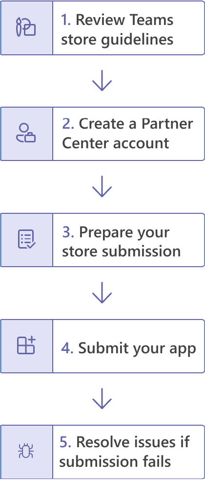

# Publicar Teams aplicativos usando Teams Toolkit

Depois de criar o aplicativo, você pode distribuir seu aplicativo para escopos diferentes, como individual, equipe, organização ou qualquer pessoa. A distribuição depende de vários fatores, incluindo necessidades, requisitos técnicos e comerciais e sua meta para o aplicativo. A distribuição para escopos diferentes pode precisar de um processo de revisão diferente. Em geral, quanto maior o escopo, mais o aplicativo precisa passar por questões de segurança e conformidade.

## Pré-requisito

* [Instale Teams Toolkit](https://marketplace.visualstudio.com/items?itemName=TeamsDevApp.ms-teams-vscode-extension) versão v3.0.0+.

> [!TIP]
> Você já deve ter um projeto Teams aplicativo.

## Publicar em escopo individual (permissão de sideload)

Os usuários podem adicionar aplicativos personalizados Teams carregando um pacote de aplicativos em um arquivo .zip diretamente para uma equipe ou em contexto pessoal. Adicionar um aplicativo personalizado carregando um pacote de aplicativos, também conhecido como side loading, permite testar o aplicativo à medida que ele está sendo desenvolvido, antes de estar pronto para ser amplamente distribuído, conforme mencionado nos seguintes cenários:

* Teste e depure um aplicativo localmente ou com outros desenvolvedores.
* Criou um aplicativo apenas para você. Por exemplo, para automatizar um fluxo de trabalho.
* Você criou um aplicativo para um pequeno conjunto de usuários, como seu grupo de trabalho.

Ele também permite que você crie um aplicativo apenas para uso interno e compartilhe-o com sua equipe sem enviar para o catálogo de aplicativos Teams no Teams app store.

* Criar seu aplicativo para *.zip de pacote de aplicativos

    Você pode criar o pacote de aplicativo selecionando `Zip Teams metadata package` no painel IMPLANTAÇÃO em Treeview do Teams Toolkit. Talvez seja necessário executar `Provision in the cloud` no início. O pacote de aplicativo gerado estará localizado `{your project folder}/build/appPackage/appPackage.{env}.zip` como mostrado na imagem a seguir:

 

## Publicar em sua organização 

Quando o aplicativo estiver pronto para uso em produção, o desenvolvedor poderá enviar o aplicativo usando Teams API de Envio de Aplicativo, chamada da API Graph, um ambiente de desenvolvimento integrado (IDE), como Visual Studio Code instalado com Teams toolkit. Você pode selecionar **Publicar para Teams** do painel IMPLANTAÇÃO no TreeView do Teams Toolkit ou **Teams: Publicar** no Teams da paleta de comandos. Em **seguida, selecione Instalar para sua organização,** conforme mostrado na imagem a seguir:

Isso disponibiliza o aplicativo na página Gerenciar aplicativos do centro de administração Microsoft Teams, onde você e o administrador podem revisá-lo e aprove-lo.

Como administrador, a página gerenciar  aplicativos no centro de administração Microsoft Teams é onde você visualiza e gerencia todos os Teams aplicativos para sua organização. Aqui, você pode ver o status e as propriedades de aplicativos no nível da organização, aprovar ou carregar novos aplicativos personalizados na loja de aplicativos da sua organização, bloquear ou permitir aplicativos no nível da organização, adicionar aplicativos às equipes, comprar serviços para aplicativos de terceiros, exibir permissões solicitadas por aplicativos, conceder consentimento de administrador a aplicativos e gerenciar configurações de aplicativos em toda a organização.

Gerencie a página de aplicativos no centro de administração do [teams](https://admin.teams.microsoft.com/policies/manage-apps) Teams kit de ferramentas para Visual Studio Code criado em cima da API de envio de aplicativos do Teams e permite automatizar o processo de envio para aprovação para aplicativos personalizados no Teams.

> [!NOTE]
> Lembre-se de que isso ainda não publica o aplicativo na loja de aplicativos da sua organização. Esta etapa envia o aplicativo para o centro de administração Microsoft Teams local onde você pode aprove-lo para publicação na loja de aplicativos da sua organização.

## Aprovação do administrador para aplicativos Teams enviados

O administrador do seu locatário do Teams pode, em seguida, ir para a página Gerenciar aplicativos no centro de administração do Microsoft Teams (na navegação à esquerda, vá para Teams aplicativos > Gerenciar aplicativos), fornece uma exibição em todos os aplicativos Teams para sua organização. O widget de aprovação pendente na parte superior da página permite que você saiba quando um aplicativo personalizado é enviado para aprovação.
Na tabela, um aplicativo recém-enviado mostra automaticamente um status de publicação de Submitted e Status of Blocked. Você pode classificar a coluna de status de publicação em ordem decrescente para encontrar rapidamente o aplicativo:

 

Selecione o nome do aplicativo para ir para a página de detalhes do aplicativo. Na guia Sobre, você pode exibir detalhes sobre o aplicativo, incluindo descrição, status, envio e ID do aplicativo:

 

Quando você estiver pronto para disponibilizar o aplicativo aos usuários, siga as etapas para publicar o aplicativo:

1. Na navegação à esquerda do centro de administração Microsoft Teams, acesse Teams aplicativos > Gerenciar aplicativos.
2. Selecione o nome do aplicativo para ir para a página de detalhes do aplicativo e, na caixa Status de Publicação, selecione Publicar.
Depois de publicar o aplicativo, o status de publicação muda para Publicado e o Status muda automaticamente para Permitido.

## Publicar no Microsoft Store

Você pode distribuir seu aplicativo diretamente para a loja dentro Microsoft Teams e alcançar milhões de usuários em todo o mundo. Se seu aplicativo também estiver em destaque na loja, você poderá alcançar instantaneamente clientes em potencial.
Os aplicativos publicados na Teams store também listam automaticamente no Microsoft AppSource, que é o marketplace oficial para Microsoft 365 aplicativos e soluções.
Entenda o processo de publicação Quando você acha que seu aplicativo está pronto para produção, você pode começar o processo de listá-lo no Teams store.

>[!Tip]
> Seguir as etapas de pré-envio de perto pode aumentar a possibilidade de que a Microsoft aprove seu aplicativo para publicação.

* Revise as diretrizes Teams de validação da loja para garantir que seu aplicativo atenda Teams padrões de aplicativo e loja.
* Crie uma conta de desenvolvedor do Partner Center.
* Prepare o envio da loja, que inclui a execução de testes automatizados, a compilação de notas de teste, a criação de uma listagem de loja, entre outras tarefas importantes para ajudar a acelerar o processo de revisão.
* Envie seu aplicativo por meio do Partner Center.
* Trabalhe com a Microsoft diretamente para resolver os problemas e reabrir o aplicativo (link para resolver os problemas e reabrir seu aplicativo).

## Confira também

> [!div class="nextstepaction"]
> [Gerenciar vários ambientes](TeamsFx-multi-env.md)

> [!div class="nextstepaction"]
> [Colaborar com outros desenvolvedores no Teams projeto](TeamsFx-collaboration.md)