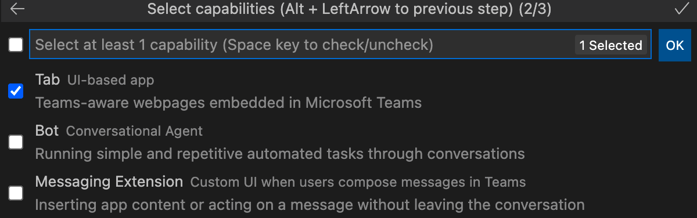

# Teams Toolkit

> [!NOTE]
> Atualmente, esse recurso está disponível apenas na **visualização de desenvolvedor** público.

Teams Toolkit para Visual Studio Code ajuda os desenvolvedores a criar e implantar aplicativos Teams com identidade integrada, acesso ao armazenamento em nuvem, dados do Microsoft Graph e outros serviços no Azure e no Microsoft 365 com uma abordagem de configuração zero para a experiência do desenvolvedor.  

Há uma Teams Toolkit para Visual Studio e uma [ferramenta CLI](https://github.com/OfficeDev/TeamsFx/blob/dev/docs/cli/user-manual.md) para desenvolvimento Teams aplicativo (chamado `teamsfx` ).

## Instale o Teams Toolkit para Visual Studio Code

1. Abra **Visual Studio Code.**

1. Selecione o exibição Extensões (**Ctrl+Shift+X**  /  **⌘⇧-X** ou **Exibir > Extensões).**

1. Na caixa de pesquisa, digite **Teams Toolkit**.

1. Selecione **o botão** instalar ao lado do Teams Toolkit.

Ou você pode encontrar o Teams Toolkit no [Visual Studio Code Marketplace](https://marketplace.visualstudio.com/items?itemName=TeamsDevApp.ms-teams-vscode-extension).

## Suporte Teams aplicativos

[Microsoft Teams recursos do aplicativo](../concepts/capabilities-overview.md) são Teams pontos de extensibilidade.Teams Toolkit para Visual Studio Code oferece suporte aos desenvolvedores para trabalhar no projeto com os seguintes recursos Teams aplicativos:

* [Guias](../tabs/what-are-tabs.md#microsoft-teams-tabs)

* [Bots](../bots/what-are-bots.md#bots-in-microsoft-teams)

* [Extensões de Mensagens](../messaging-extensions/what-are-messaging-extensions.md#messaging-extensions) 

Seu Teams projeto pode conter um dos recursos ou todos os três recursos acima. Você pode selecionar qualquer recurso ao criar o Teams Project.

Teams Toolkit oferece flexibilidade para adicionar mais recursos no processo de desenvolvimento Teams aplicativo.

## Jornada do usuário Teams Toolkit

Teams Toolkit fornece recursos Teams desenvolvimento de aplicativos para facilitar a depuração, implantação e publicação. Teams Toolkit automatiza o trabalho manual e fornece uma ótima integração dos recursos Teams e do Azure. A imagem a seguir mostra Teams Toolkit de usuário:

## Fazer um tour por Teams Toolkit para Visual Studio Code

Se você não abrir nenhum projeto Teams no VS Code ou abrir qualquer projeto que não seja criado usando o Teams Toolkit v2.+, você verá a interface do usuário Teams Toolkit com funcionalidades limitadas, conforme mostrado na imagem a seguir:

:::image type="content" source="./images/teams-toolkit-beforestart.png" alt-text="Antes de começar Teams Toolkit":::

Você pode selecionar **Início** Rápido para explorar o Teams Toolkit ou selecionar **Criar** um novo aplicativo Teams para criar um Teams projeto. Se você tiver uma Teams Project criada pelo Teams Toolkit v2.+ aberta no VS Code, você verá Teams Toolkit interface do usuário com mais funcionalidades, conforme mostrado na imagem a seguir:

:::image type="content" source="./images/teams-toolkit-overview.png" alt-text="Fazer um tour para Teams Toolkit":::

Vamos fazer um tour das funcionalidades que estão disponíveis no Teams Toolkit:

* [Accounts](#accounts)

* [Ambiente](#environment)

* [Desenvolvimento](#development)

* [Implantação](#deployment)

* [Ajuda e comentários](#help-and-feedback)

### Contas

Os desenvolvedores devem ter uma Microsoft 365 para criar Teams aplicativo. Se você não tiver uma, poderá obter uma conta de desenvolvedor gratuita Teams ingressar no programa Microsoft 365 [desenvolvedor :](https://developer.microsoft.com/microsoft-365/dev-program)

A conta do Azure é comumente usada no desenvolvimento Teams aplicativo. Se quiser hospedar seu aplicativo Teams ou acessar recursos no Azure, você deve ter uma conta do Azure. Teams Toolkit suporte à experiência integrada para entrar, provisionar e implantação para recursos do Azure. Você pode [criar uma conta gratuita do Azure](https://azure.microsoft.com/free/) antes de começar.

 Para obter mais informações, consulte [prepare accounts to build Teams app](accounts.md)

### Ambiente

Teams Toolkit ajuda você a gerenciar vários ambientes. Você pode adicionar, configurar e personalizar ambientes. Você pode optar por adicionar colaboradores para cada ambiente:

 Para obter mais informações, [consulte manage multiple environments](TeamsFx-multi-env.md) and [collaborate with other developers on Teams project](TeamsFx-collaboration.md).

### Desenvolvimento

Teams Toolkit oferece conveniência para você criar e personalizar seu projeto de aplicativo Teams que faz com que o desenvolvimento Teams aplicativo funcione de forma fácil e rápida: 

1. **Criar um novo Teams ,** ajuda a iniciar um Teams de desenvolvimento de aplicativos com um projeto de modelo de "hello world" ou um projeto de exemplo. Para obter mais informações, [consulte create new Teams project](create-new-project.md)
1. **Exibir exemplos**, mostra um conjunto de Teams de exemplo para você explorar, referir e desenvolver.
1. **Adicionar recursos**, ajuda a adicionar outros recursos Teams para Teams aplicativo a qualquer momento durante o processo de desenvolvimento. Para obter mais informações, [consulte add capabilities to your Teams app](add-capability.md)
1. **Adicionar recursos de nuvem** permite adicionar recursos adicionais de nuvem de acordo com a alteração de requisitos. Para obter mais informações, [consulte add cloud resources for your Teams app](add-resource.md)
1. **Editar arquivo de manifesto** permite editar facilmente como o aplicativo Teams se integra ao Teams cliente. Para obter mais informações, consulte [preview Teams manifesto file and](TeamsFx-manifest-preview.md) edit Teams manifest [file](TeamsFx-manifest-customization.md).

### Implantação

Durante ou após o desenvolvimento, você deve seguir o processo para fazer provisionamento, implantação e publicação Teams aplicativo antes que ele seja acessível aos seus usuários:

1. Se você quiser hospedar seu aplicativo Teams no Azure ou precisar usar  recursos do Azure, Provisionar na nuvem ajuda a automatizar o processo para criar recursos do Azure. Para usá-lo, você deve ter uma Assinatura do Azure. Para obter mais informações, consulte [provisione recursos de nuvem](provision.md).

1. Antes de publicar seu aplicativo ou compartilhamento, você pode criar seu aplicativo Teams em pacotes selecionando Zip Teams pacote de **metadados**.

1. **Implantar na nuvem ajuda** você a implantar o código-fonte no Azure. O pré-requisito para executar a implantação é  ter recursos provisionados executando Provisionamento na nuvem ou você precisa criar os recursos do Azure manualmente e especificar o parâmetro resource em suas configurações de ambiente de projeto. Para obter mais informações, [consulte deploy Teams app to the cloud](deploy.md).

1. Em vez de publicar manualmente seu aplicativo Teams personalizado, você pode usar a função **Publicar** Teams para chamar Teams api para publicar Teams app. Você precisa da permissão para carregar Teams aplicativo. Para obter mais informações, [consulte publish your app to Teams](publish.md).

1. O Portal do Desenvolvedor Teams é onde você pode gerenciar e distribuir seu Teams app. Para obter mais informações, consulte [portal do desenvolvedor](/microsoftteams/platform/concepts/build-and-test/teams-developer-portal)

1. Teams Toolkit também fornece modelo CI/CD para ferramentas ci/CD, como fluxo de trabalho GitHub, Azure Devops e Jenkins. Para obter mais informações, consulte [build CI/CD pipelines for Teams application](use-CICD-template.md)

### Ajuda e comentários

Nesta seção, você pode encontrar facilmente a documentação e os recursos necessários. Você pode selecionar **Report issues on GitHub** in the Teams Toolkit get Quick **support** from product expert. Navegue pelo problema antes de criar um novo ou visite a marca [StackOverflow `teams-toolkit` ](https://stackoverflow.com/questions/tagged/teams-toolkit) para procurar e fazer perguntas:

## Confira também

> [!div class="nextstepaction"]
> [Criar novo uso de projeto Teams Toolkit](create-new-project.md)

> [!div class="nextstepaction"]
>[Preparar contas para criar Teams aplicativos](accounts.md)
