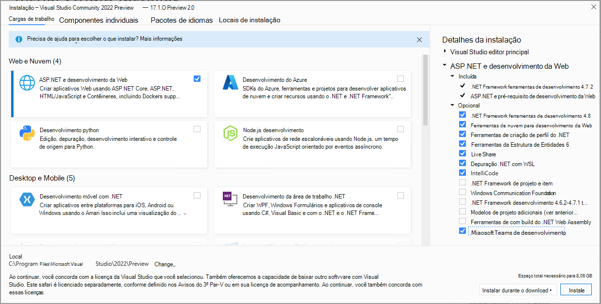
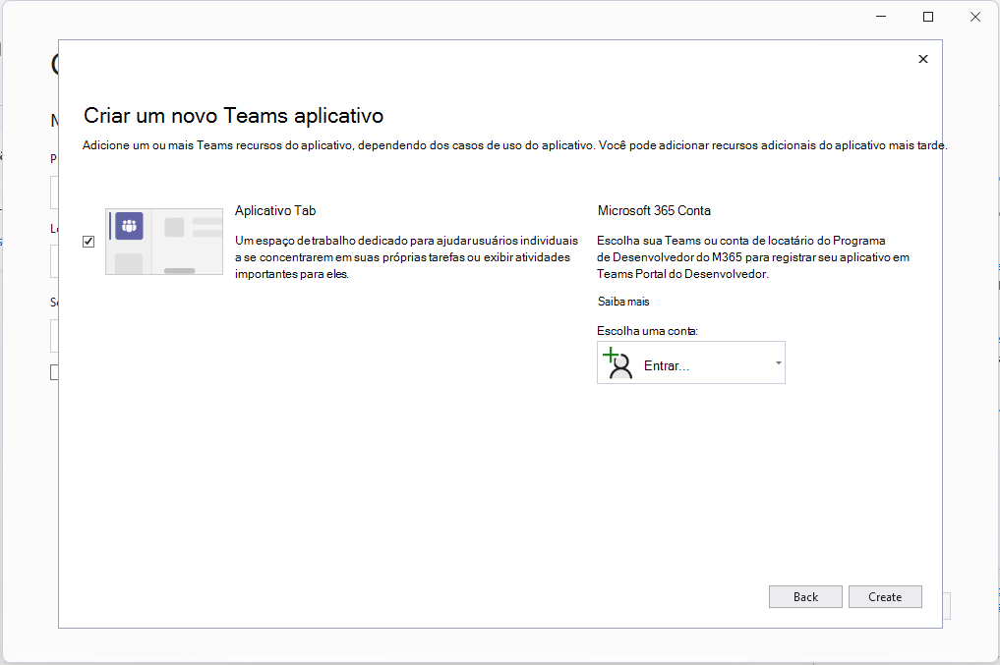

# Kit de ferramentas do Teams para Visual Studio

Crie, teste e desenvolva para o Teams dentro do seu IDE.

A extensão do Kit de Ferramentas do Teams para Visual Studio facilita a criação de novos projetos para o Teams, a configuração automática de aplicativos no Portal do Desenvolvedor do Teams, a execução e a depuração no Teams, a configuração da hospedagem na nuvem e o uso do [TeamsFx](https://github.com/OfficeDev/teamsfx) do seu IDE.

## Instalar o Kit de ferramentas do Teams para Visual Studio

>[!NOTE]
> Como pré-requisito, use o Visual Studio 2022 17.1 Versão Prévia 2 ou mais recente para seguir as instruções abaixo.

1. Se você já tiver Visual Studio 2022 17.1 Versão Prévia 2 instalada, vá para a próxima etapa. Caso contrário, [instale o a pré-visualização do Visual Studio 2022](https://visualstudio.microsoft.com/vs/preview/).
2. Abra o Instalador do Visual Studio.
3. Selecione **Modificar** para sua instalação existente do VS 2022 Preview.
4. Selecione a carga de trabalho **ASP.NET e desenvolvimento web**.
5. À direita, expanda a seção **ASP.NET e desenvolvimento na Web** e selecione **ferramentas de desenvolvimento do Microsoft Teams** na lista Opcional de componentes.
6. Selecione **Instalar** ou **Modificar** no Instalador do Visual Studio para concluir o processo de instalação.

   

## Comece rapidamente um novo projeto

Os modelos de projeto do Kit de Ferramentas do Teams fornecem todo o código, os arquivos e a configuração de que você precisa para começar a usar um projeto de aplicativo do Teams.

O modelo de projeto de aplicativo do Microsoft Teams permite que você especifique uma conta Microsoft 365 necessária para registrar e configurar automaticamente seu novo aplicativo do Teams.

> [!NOTE]
> Se você não tiver uma conta Microsoft 365, poderá se inscrever em uma assinatura do [Programa para desenvolvedores do Microsoft 365](https://developer.microsoft.com/microsoft-365/dev-program). Ele é gratuito por 90 dias e é renovado desde que você o use para atividades de desenvolvimento. Se você tiver uma assinatura do Visual Studio Enterprise ou Professional, ambos os programas incluem uma [assinatura para desenvolvedor](https://aka.ms/MyVisualStudioBenefits) gratuita do Microsoft 365, ativa pelo tempo de vida da sua assinatura do Visual Studio. Para mais informações, confira [configurar uma assinatura para desenvolvedor do Microsoft 365](/office/developer-program/office-365-developer-program-get-started).

1. Inicie o Visual Studio 2022.
1. Na janela inicial, escolha **Criar um novo projeto**.
1. Na caixa **Pesquisar modelos**, insira o Aplicativo do Microsoft Teams.
1. Selecione o modelo do **Aplicativo do Microsoft Teams** e selecione **Avançar**.
1. Na janela **Configurar seu novo projeto**, digite ou insira _HelloTeams_ na caixa **Nome do projeto**. Em seguida, selecione **Criar**.
1. Na janela **Criar um novo aplicativo do Teams**, escolha ou entre em uma conta do Microsoft 365 usando o seletor **Escolher uma conta**. Em seguida, selecione **Criar**.

   

O Visual Studio abrirá seu novo projeto e o Kit de Ferramentas do Teams configurará o novo projeto no Teams Portal do Desenvolvedor. O projeto será adicionado à organização do Teams vinculada à conta do Microsoft 365 você escolheu nas etapas acima e criará um novo registro Azure Active Directory aplicativo. Isso é necessário para que o aplicativo seja executado no Teams.

## Executar e depurar seu aplicativo no Teams

Você pode iniciar seu projeto de aplicativo em execução localmente do Visual Studio.

1. Abra ou [crie um projeto de aplicativo do Teams](#get-started-quickly-with-a-new-project).
2. Pressione **F5** ou selecione **Depurar > Inicie a depuração** no Visual Studio.

O Visual Studio iniciará seu projeto de aplicativo do Teams em um navegador e iniciará a depuração.

## Hospede seu aplicativo do Teams na nuvem e visualize-o

Você pode criar e configurar automaticamente recursos de nuvem para hospedar seu aplicativo no Azure usando o Kit de Ferramentas do Teams.

1. Selecione o menu **Projeto > Kit de ferramentas do Teams > Provisionar na nuvem**.
2. Na janela Selecionar sua assinatura, escolha a assinatura do Azure com a qual você deseja criar recursos.

O Kit de Ferramentas do Teams criará recursos do Azure nesta assinatura, mas nenhum código será implantado durante esta etapa. Para implantar seu projeto nesses novos recursos:

1. Selecione o menu **Projeto > Kit de ferramentas do Teams > Provisionar na nuvem**.

## Visualizar seu aplicativo em execução a partir de recursos de nuvem

Você pode executar seu aplicativo em um navegador usando os recursos remotos para verificar se tudo funciona. Ainda não é possível depurar durante esse cenário.

1. Selecione o menu **Projeto > Kit ferramentas do Teams > Visualizar o aplicativo do Teams**.

Seu aplicativo será aberto em um navegador e usará os recursos criados pelas etapas provisionar e implantar.

## Publicar seu aplicativo no Teams

No [Portal do Desenvolvedor do Teams](https://dev.teams.microsoft.com/home), você pode carregar seu aplicativo em uma equipe, enviar seu aplicativo para a loja de aplicativos personalizada da empresa para os usuários em sua organização ou enviar seu aplicativo para a Fonte de Aplicativos para todos os usuários do Teams.

- Seu administrador de TI revisará esses envios.
- Você pode retornar à página **Publicar** para verificar o status do envio e saber se o aplicativo foi aprovado ou rejeitado pelo administrador de TI. Esse também é o local onde você deverá enviar atualizações para o aplicativo ou cancelar os envios ativos no momento.
