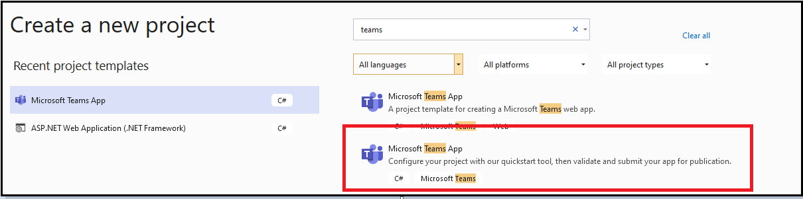
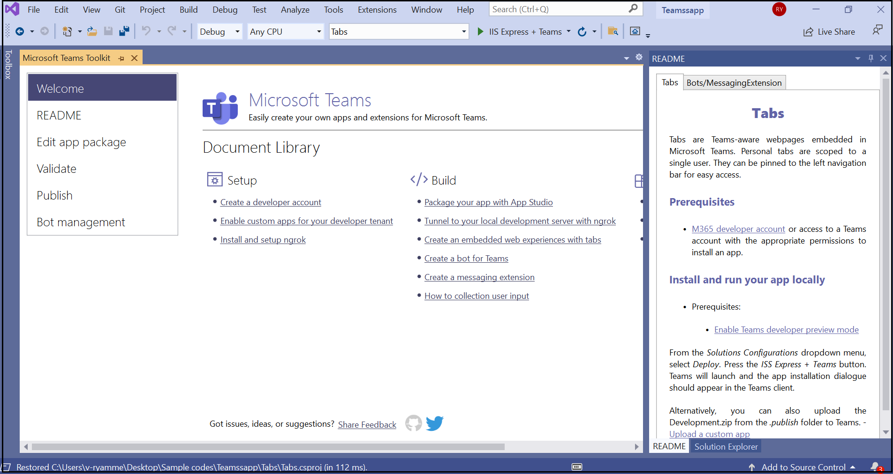

# Criar aplicativos com o Teams Toolkit e Visual Studio

O Kit de Ferramentas do Microsoft Teams permite criar aplicativos personalizados do Teams diretamente no ambiente de desenvolvimento integrado (IDE) do Visual Studio. O kit de ferramentas do Microsoft Teams guia você através do processo e fornece o necessário para criar, depurar e iniciar seu aplicativo do Teams.

## Pré-requisitos

1. [Habilitar a visualização do desenvolvedor](../resources/dev-preview/developer-preview-intro.md#enable-developer-preview).

1. Certifique-se de que **o ASP.NET e** o módulo de desenvolvimento da Web foram adicionados à sua Visual Studio instância. Você pode verificar seguindo as etapas na Visual Studio [adicionando ou removendo cargas](/visualstudio/install/modify-visual-studio?view=vs-2019&preserve-view=true) de trabalho e documentação de componentes.

3. Se você deseja testar seu aplicativo implantando-o Visual Studio, você deve ter Serviços de Informações da Internet (IIS)) instalado em seu ambiente de desenvolvimento. Visual Studio não inclui o IIS e ele não está incluído na configuração padrão Windows 10, Windows 8 ou Windows 7; no entanto, você pode baixar a versão mais recente do centro [de download da Microsoft.](https://www.microsoft.com/download/details.aspx?id=48264)

## Instalar o Teams Toolkit

O Microsoft Teams Toolkit para Visual Studio está disponível para download no [marketplace do Visual Studio ou](https://marketplace.visualstudio.com/items?itemName=TeamsDevApp.vsteamstemplate) diretamente no menu **Extensões** no Visual Studio. A partir do Visual Studio Marketplace também baixar [Teams Toolkit para Visual Studio 2019](https://marketplace.visualstudio.com/items?itemName=msft-vsteamstoolkit.vsteamstoolkit).

## Usando o kit de ferramentas

- [Configurar um novo projeto](#set-up-a-new-teams-project)
- [Configurar seu aplicativo](#configure-your-app)
- [Empacote seu aplicativo](#package-your-app)
- [Instalar e executar seu aplicativo em Teams](#install-and-run-your-app-locally)
- [Valide o seu aplicativo](#validate-your-app)
- [Publicar seu aplicativo](#publish-your-app-to-teams)

## Configurar um novo Teams projeto

1. Selecione **Criar Novo Projeto**.

    

1. Escolha a ferramenta de início rápido para **Microsoft Teams App** e selecione **Próximo**.
1. Na página **Configurar seu novo projeto,** insira **o** nome do Project, **Local** e Nome **da solução.**
1. Selecione a **solução Place e o projeto na mesma caixa de** seleção de diretório.
1. Na janela **pop-up Adicionar Recursos,** escolha um ou mais recursos para a configuração do projeto.
1. Selecione o **botão Próximo** para concluir o processo de configuração.
1. Na janela **pop-up Adicionar Recursos,** escolha as propriedades para cada recurso selecionado.
1. Selecione **Concluir**. A **Microsoft Teams Toolkit** de aterrissagem é mostrada.

    

## Configurar seu aplicativo

No seu núcleo, o Teams aplicativo abrange três componentes:

  1. O Microsoft Teams cliente, incluindo web, área de trabalho ou celular, onde os usuários interagem com seu aplicativo.
  1. Um servidor que responde a solicitações de conteúdo que é exibido em Teams, por exemplo, conteúdo de guia HTML ou um cartão adaptável de bot.
  1. Um Teams de aplicativo consiste em três arquivos:

      - O manifest.json
      - Um [ícone de cor](../resources/schema/manifest-schema.md#icons) para seu aplicativo ser exibido no catálogo de aplicativos público ou da organização.
      - Um [ícone de contorno](../resources/schema/manifest-schema.md#icons) para exibição na barra de Teams de atividades.

Quando um aplicativo é instalado, o cliente Teams analisado o arquivo de manifesto para determinar as informações necessárias, como o nome do seu aplicativo e a URL onde os serviços estão localizados.

> [!NOTE]
>Se você ainda não fez isso, você deve entrar na sua conta Microsoft 365 para continuar com o processo de desenvolvimento.
>
> Se você não tiver uma conta Microsoft 365, poderá inscrever-se para uma assinatura Microsoft 365 programa de [desenvolvedor.](https://developer.microsoft.com/microsoft-365/dev-program) Ele é gratuito por 90 dias e é renovado desde que você o use para atividades de desenvolvimento. Se você tiver uma assinatura Visual Studio Enterprise ou Professional, ambos os programas incluem uma assinatura de desenvolvedor Microsoft 365 gratuita [,](https://aka.ms/MyVisualStudioBenefits)ativa para o tempo de vida da sua assinatura Visual Studio. Para obter mais informações, [consulte configurar uma assinatura Microsoft 365 desenvolvedor.](/office/developer-program/office-365-developer-program-get-started)

### Etapas de configuração

1. Para configurar seu aplicativo, na **página** inicial Microsoft Teams Toolkit, selecione **Editar pacote de aplicativos**.
1. No menu **suspenso Meus Ambientes,** selecione **desenvolvimento**.
1. Na página **Detalhes do** aplicativo, edite os campos de propriedade do aplicativo.
    
    A edição dos campos na página detalhes do aplicativo atualiza o conteúdo do manifest.jsno arquivo que será shipado como parte do pacote do aplicativo. Para obter mais informações, [consulte Teams Toolkit manifesto](https://aka.ms/teams-toolkit-manifest).

## Empacote seu aplicativo

Modificar a página de detalhes **do** aplicativo ou atualizar o **manifesto** ou **arquivos .env** na pasta **.publish** do aplicativo gerará automaticamente seu **arquivoDevelopment.zip.** O Development.zip inclui três arquivos necessários, omanifest.js **e** [dois ícones](../concepts/build-and-test/apps-package.md#app-icons).

## Instalar e executar seu aplicativo localmente

1. No menu **suspenso Configurações** da Solução, selecione **Implantar** conforme mostrado na imagem a seguir:

    

1. Selecione o **IIS Express + Teams** botão.

    A caixa de diálogo de instalação do aplicativo é exibida no Teams cliente.

## Valide o seu aplicativo

A **página Validar** permite que você verifique seu pacote de aplicativos antes de enviar seu aplicativo ao AppSource. Basta carregar o pacote de manifesto e a ferramenta de validação verificará seu aplicativo em relação a todos os casos de teste relacionados ao manifesto. Para cada teste com falha, a descrição fornece um link de documentação para ajudá-lo a corrigir o erro. Para os testes difíceis de  automatizar, a lista de verificação preliminar detalha 7 dos casos de teste com falha mais comuns, bem como o link para uma lista de verificação de envio completa.

## Publicar seu aplicativo no Teams

* Na página inicial do seu projeto, você pode carregar seu aplicativo em uma equipe, enviar seu aplicativo para a loja de aplicativos personalizada da empresa para os usuários em sua organização ou enviar seu aplicativo para a Fonte de Aplicativos para todos os usuários do Teams.

* Seu administrador de TI revisará esses envios.

* Você pode retornar à página **Publicar** para verificar o status do envio e saber se seu aplicativo foi aprovado ou rejeitado pelo administrador de TI. Isso também é onde você pode enviar atualizações para seu aplicativo ou cancelar quaisquer envios ativos no momento.

## Próxima etapa

> [!div class="nextstepaction"]
> [Mantendo e dando suporte ao aplicativo publicado](../concepts/deploy-and-publish/appsource/post-publish/overview.md)
>
